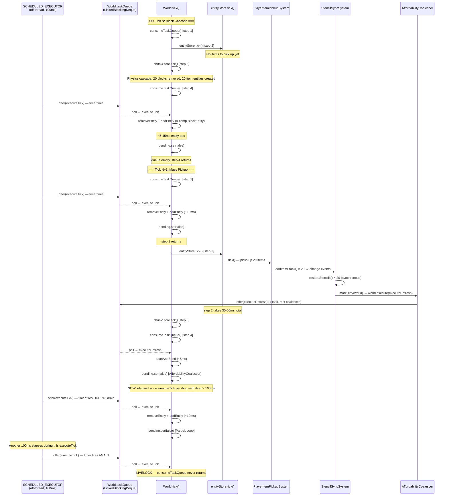
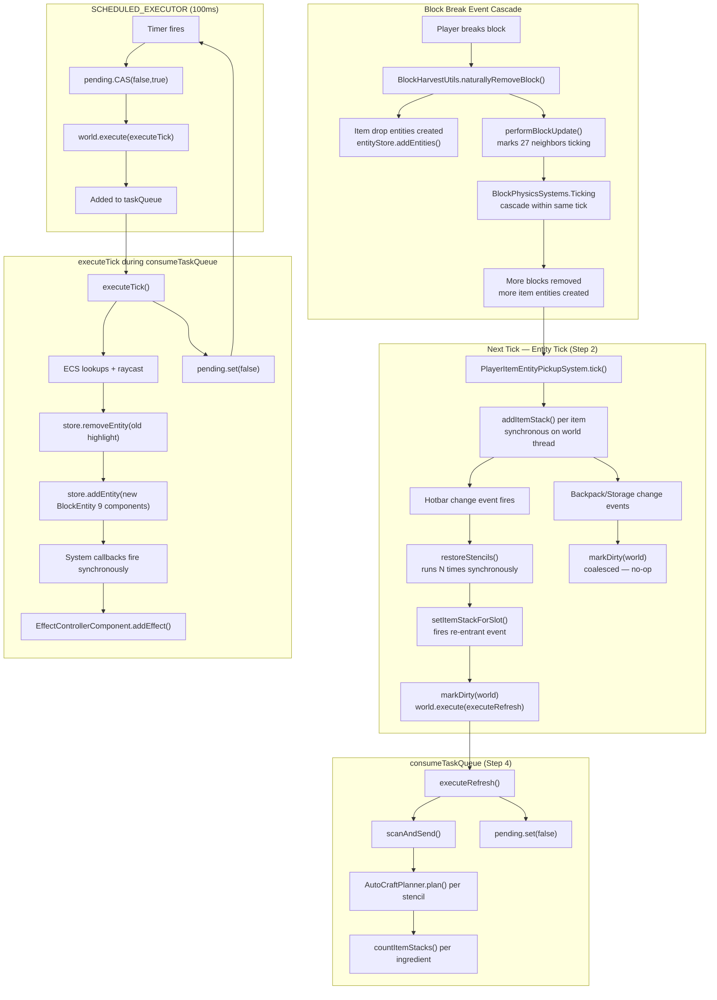

# Root Cause Analysis: Permanent Server Freeze After Block Breaks

**Date:** 2025-05-29  
**Scope:** StencilBookParticleLoop, AffordabilityCoalescer, StencilSyncSystem, World.consumeTaskQueue()  
**Symptom:** Server permanently freezes (console goes silent) after a player breaks 10–20 blocks that drop items.

---

## 1. Diagnosis: Primary Root Cause

**The server freeze is a livelock in `World.consumeTaskQueue()`**, caused by `StencilBookParticleLoop`'s `SCHEDULED_EXECUTOR` feeding new tasks into the world's task queue faster than the queue can drain them during a heavy-load tick.

The `consumeTaskQueue()` loop is `while (poll() != null) { run(); }` — **no iteration limit, no timeout**. The `LinkedBlockingDeque.poll()` returns newly-added elements immediately. If any task running inside the loop triggers enough wall-clock delay that the 100ms `SCHEDULED_EXECUTOR` timer fires again, a new `executeTick` task is added to the queue before the drain completes. The drain picks it up, runs it (~10ms for entity ops), `pending.set(false)` re-arms the timer, and the cycle repeats **indefinitely**.

**Why `pending.set(false)` in finally blocks did NOT fix it:** The `pending` flag's purpose is to prevent duplicate tasks from accumulating. It works correctly — only one `executeTick` task is in the queue at any time. The problem is that each `executeTick` **clears** the flag upon completion, allowing the `SCHEDULED_EXECUTOR` to immediately submit a **new** task. The fix actually made the livelock *more reliable* by ensuring `pending` is always reset.

---

## 2. Interaction Model During Freeze

### The Trigger Sequence

### The Full Component Interaction

### Why 10–20 Blocks Is the Threshold

The livelock requires the total tick time to exceed 100ms (the `SCHEDULED_EXECUTOR` interval). Here's the cost breakdown for a tick with N item pickups:

| Component | Cost | Scaling |
|-----------|------|---------|
| `executeTick()` (entity spawn/remove, 9 components, system callbacks) | ~10–15ms | Per `consumeTaskQueue` drain |
| `restoreStencils()` × N (synchronous, during entity tick) | ~1ms × N | Linear with items picked up |
| `executeRefresh()` (scanAndSend with AutoCraftPlanner) | ~5–10ms | Per drain (coalesced) |
| Entity tick (PlayerItemEntityPickupSystem for N items) | ~2ms × N | Linear with items |
| Physics cascade processing (chunkStore.tick) | ~5–20ms | Depends on cascade size |

With N=20 items: 10 + 20 + 10 + 40 + 15 = **~95ms** — right at the threshold. Any jitter or GC pause pushes it over 100ms, and the livelock engages.

### Contributing Amplifiers

1. **`restoreStencils()` runs synchronously N times** — once per hotbar change event during item pickup. Even with the `isRestoring` guard preventing re-entrant restoration, the outer call still scans all 9 hotbar slots and calls `setItemStackForSlot()` which fires another change event.

2. **`executeTick()` creates a full BlockEntity with 9 ECS components** — TransformComponent, HeadRotation, UUIDComponent, NetworkId, Visible, EffectControllerComponent, BlockEntity, EntityScaleComponent, Intangible. Each component triggers `HolderSystem.onEntityAdd()` and `RefSystem.onEntityAdded()` callbacks. This is the "not designed for high-frequency use" problem from the research.

3. **`executeRefresh()` does O(S × I × C) work** — with 8 stencils, 2 ingredients each, and 50 inventory slots, that's 800 slot reads per call.

4. **The SCHEDULED_EXECUTOR runs unconditionally** — even when the player is not holding the stencil book. The `holdingBook` check is inside `executeTick()` (which runs on the world thread after being dispatched). The scheduler, `world.execute()` dispatch, and ECS ref lookup all happen regardless.

---

## 3. Answers to Specific Investigation Questions

### Q1: Task Queue Feedback Loop

**Yes — this is the root cause.** `executeTick()` itself doesn't call `world.execute()`, but it doesn't need to. The feedback loop is external: `SCHEDULED_EXECUTOR` (off-thread) → `world.execute(executeTick)` → task runs → `pending.set(false)` → `SCHEDULED_EXECUTOR` fires again → `pending.CAS(false,true)` succeeds → `world.execute(executeTick)` → added to queue during active drain → `poll()` picks it up immediately → repeat.

The `consumeTaskQueue()` loop sees each new task because `LinkedBlockingDeque.poll()` returns newly-offered elements. There is no snapshot isolation.

### Q2: Lock Contention / Deadlock

**Not the primary cause, but a secondary risk.** `store.addEntity()` acquires `processing.lock()` during `consumeTaskQueue()`. The `AssetRegistry.ASSET_LOCK.readLock()` is held for the entire tick. If any system callback inside `addEntity` needs `AssetRegistry.ASSET_LOCK.writeLock()`, that's a deadlock. No evidence this happens with the current component set, but it's fragile.

No inventory lock contention was identified — `countItemStacks()` inside `executeRefresh()` does read-only access, and inventory mutations from `restoreStencils()` complete synchronously before `consumeTaskQueue()` runs.

### Q3: Interaction Between the Two Systems

**The two systems interact through wall-clock time, not through direct calls.** `executeRefresh()` adds ~5–10ms to the drain time. `executeTick()` adds ~10–15ms. Together they push the drain past the 100ms threshold needed for the SCHEDULED_EXECUTOR to re-fire. Neither system triggers the other, but both contribute to the time budget that enables the livelock.

### Q4: Rate of Task Generation

**Rate is exactly 1 task per 100ms from SCHEDULED_EXECUTOR.** The `pending` flag successfully limits it to at most 1 `executeTick` in the queue. The problem isn't queue growth — it's that 1 expensive task per 100ms is enough to sustain the livelock when `consumeTaskQueue()` takes >100ms per drain cycle.

### Q5: Physics Cascade + Synchronous restoreStencils

**This is the amplifier, not the root cause.** When N blocks cascade, `restoreStencils()` runs N times synchronously during `entityStore.tick()`. Each call scans 9 slots and may call `setItemStackForSlot()`. This adds ~20–40ms to the entity tick for N=20, pushing the total tick past the 100ms threshold that triggers the livelock in `consumeTaskQueue()`.

However, `restoreStencils()` itself does not cause the permanent freeze — it's bounded work. The permanent freeze comes from the unbounded `consumeTaskQueue()` drain that follows.

---

## 4. Proposed Architectural Fix

The fix must address **both** the livelock mechanism and the amplifiers that trigger it.

### Priority 1: Eliminate the Livelock Source — Replace Entity Spawn with Packets

**Change:** Replace the `store.addEntity()` / `store.removeEntity()` approach in `StencilBookParticleLoop` with `ParticleUtil.spawnParticleEffect()` / `SpawnParticleSystem` packets.

**Why:** This eliminates the 10–15ms entity operation cost from `executeTick()`, reducing it to ~1ms (raycast + packet send). Even if the SCHEDULED_EXECUTOR fires during a drain, the task completes so fast that `consumeTaskQueue()` drains it before the next timer fire.

**Design:**
- Remove all `Holder`, `BlockEntity`, `EntityScaleComponent`, etc. component setup
- Remove `store.addEntity()` and `store.removeEntity()` calls
- Send a `SpawnParticleSystem` packet directly to the player via `playerRef.getPacketHandler().writeNoCache()`
- Use the existing effect IDs (`Drop_Rare`, `Drop_Uncommon`, `BlockPlaceFail`)
- Track only `lastTargetBlock` and `lastAffordable` — no `activeEntity` field needed

**Impact:** Eliminates ~95% of `executeTick()` cost. Zero entity allocation, zero ECS overhead, zero system callbacks, zero GC pressure.

### Priority 2: Stop the Timer When Not Needed

**Change:** Cancel the `SCHEDULED_EXECUTOR` task when the player unequips the stencil book. Restart it when re-equipped.

**Why:** Currently, the timer fires unconditionally for every player who has ever held the book. The `holdingBook` check inside `executeTick()` exits early but still costs a `world.execute()` dispatch + ECS ref lookup per fire.

**Design:**
- On hotbar change event, check if the active slot holds a stencil book
- If book equipped and no timer running → start timer
- If book unequipped and timer running → cancel timer, send one final cleanup packet
- Remove the `holdingBook` check from `executeTick()` — it's now guaranteed by the lifecycle

**Impact:** Zero background load when no player is holding a stencil book.

### Priority 3: Suppress Change Events During restoreStencils

**Change:** Use the `fireEvent=false` overload of `setItemStackForSlot()` (if available) or batch all stencil restorations and call `setItemStackForSlot` once with event suppression.

**Why:** Currently, `restoreStencils()` calls `setItemStackForSlot()` which fires a re-entrant change event. The `isRestoring` guard prevents recursive restoration but still calls `markDirty()`. With N item pickups, this generates N unnecessary re-entrant event dispatches.

**Design:**
- Check if `ItemContainer.setItemStackForSlot(slot, stack, fireEvent)` exists with a `boolean fireEvent` parameter (it does — seen in `.tmp_hytale_src` at `StructuralCraftingWindow.java` line 296: `setItemStackForSlot(index, output.getFirst(), false)`)
- Use `hotbar.setItemStackForSlot(slot, restored, false)` to suppress the re-entrant event
- Remove the `isRestoring` guard entirely — it's no longer needed

**Impact:** Eliminates all re-entrant event dispatches. Each item pickup triggers exactly 1 change event instead of 2.

### Priority 4: Add Iteration Cap to Task Drain (Defense in Depth)

**Change:** Wrap the `consumeTaskQueue` usage with a local counter that breaks after N tasks.

**Why:** Since `consumeTaskQueue()` is engine code (can't modify), the plugin should avoid creating conditions that trigger unbounded drains. But as defense in depth, the `executeTick` task should self-limit: if it detects it's been running for too long, it should skip the entity/packet work and just reset `pending`.

**Design:**
- Add a `lastExecuteTimeNanos` field to `StencilBookParticleLoop`
- At the start of `executeTick()`, check if less than 50ms has elapsed since the last execution
- If so, skip the work (just reset pending) — the visual highlight is still showing from the previous execution
- This prevents the SCHEDULED_EXECUTOR from feeding work faster than reasonable

**Impact:** Hard cap on the rate at which `executeTick` does real work, even if the timer fires too frequently.

---

## 5. Should the Fix Focus on the Particle Loop, the Event Cascade, or Both?

**Both — but with different priorities.**

| Fix | Addresses | Impact on Freeze |
|-----|-----------|-----------------|
| Particle loop → packets (P1) | **Livelock mechanism** (root cause) | **Eliminates the freeze** |
| Timer lifecycle (P2) | Background load amplifier | Prevents the conditions that trigger it |
| Suppress re-entrant events (P3) | Event cascade amplifier | Reduces tick time by ~20ms |
| Self-rate-limiting (P4) | Defense in depth | Prevents future livelocks |

**Priority 1 alone is likely sufficient to fix the freeze** — reducing `executeTick()` from 10–15ms to <1ms makes it impossible for the SCHEDULED_EXECUTOR to sustain a livelock (the drain completes in well under 100ms). But Priorities 2–4 should be applied as well to eliminate the conditions that made the system fragile.

---

## 6. Priority-Ordered Change List

1. **Replace BlockEntity spawn/remove with `SpawnParticleSystem` packets** in `StencilBookParticleLoop.executeTick()` — eliminates the livelock root cause
2. **Lifecycle-manage the SCHEDULED_EXECUTOR timer** — cancel on book unequip, start on equip — eliminates unnecessary background task generation
3. **Use `setItemStackForSlot(slot, stack, false)`** in `StencilSyncSystem.restoreStencils()` — suppresses re-entrant change events, remove `isRestoring` guard
4. **Add self-rate-limiting** in `executeTick()` — skip work if called within 50ms of last execution
5. **Increase `UPDATE_INTERVAL_MILLIS` from 100ms to 200ms** — doubles the headroom before livelock conditions can be met (temporary measure if packet conversion isn't immediately feasible)
6. **Move `ENABLE_AFFORDABILITY_CHECK`** to ensure it stays `false` until packet-based highlights are in place — the `RecipeAffordabilityResolver.isAffordable()` call inside `executeTick()` would add another 5ms per tick if enabled

---

## 7. Open Questions

- Does `Store.addEntity()` called during `consumeTaskQueue()` (outside of `entityStore.tick()`) trigger the same set of system callbacks as during tick? If `assertWriteProcessing()` is a no-op in production, there may be latent ECS corruption from out-of-tick entity modifications.
- Does `ParticleUtil.spawnParticleEffect()` require being called from the world thread, or can it be called from the `SCHEDULED_EXECUTOR` thread directly (since it only sends packets)?
- Is there a `setItemStackForSlot(slot, stack, fireEvent)` overload on `ItemContainer`? The 3-arg version exists on `StructuralCraftingWindow` — need to verify it's on the base `ItemContainer` class.
