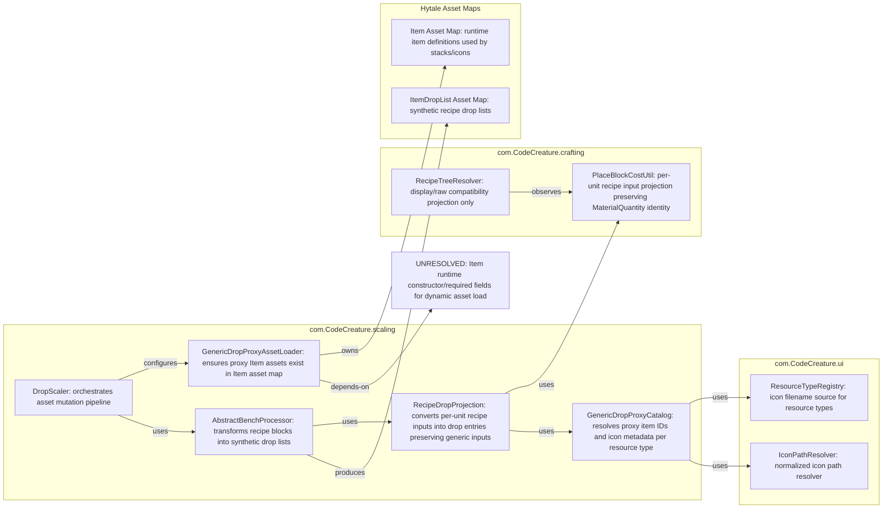
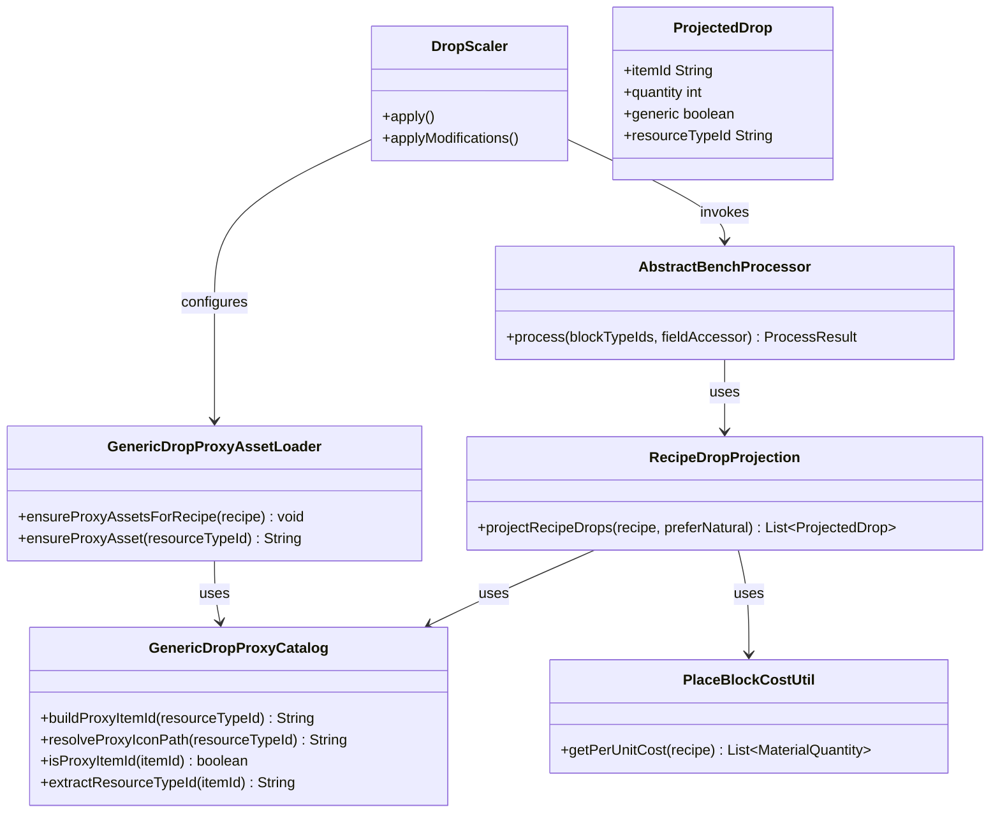
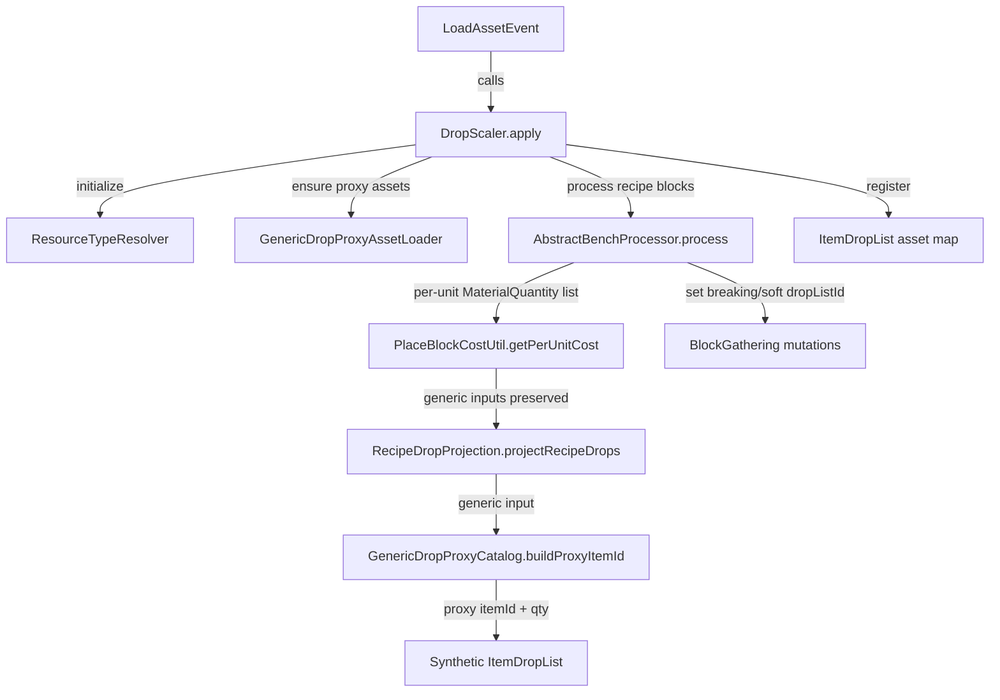
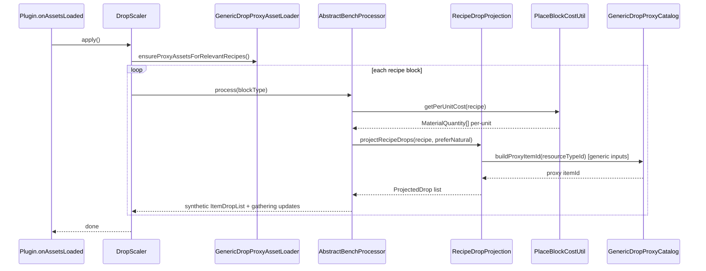

# 0. Knowledge Graph

# 1. Overview
The current recipe-block drop path projects generic ResourceTypeId ingredients into concrete item IDs before synthetic drop-list generation. That prevents generic resource proxy items from ever appearing in break drops. This design introduces explicit generic proxy item asset generation and recipe-drop projection that preserves authored generic inputs so breaking generic-input recipe blocks drops proxy items with generic resource icons.

# 2. Design Priorities
- Correctness first: generic ResourceTypeId recipe inputs must drop generic proxy item assets, not representative concrete variants.
- Minimal blast radius: keep natural-block scaling, crafted-intermediate recursion, and placement-cost systems unchanged.
- Determinism: proxy item IDs and icon mapping are stable and reproducible across runs.
- Backward compatibility: direct ItemId inputs and existing non-generic recipe drops continue to work unchanged.

# 3. Component Diagram

# 4. Responsibility Map

# 5. Sequence Diagram

# 6. Package Structure
src/main/java/com/CodeCreature/
├── scaling/
│   ├── GenericDropProxyCatalog.java
│   ├── GenericDropProxyAssetLoader.java
│   ├── RecipeDropProjection.java
│   ├── DropScaler.java (integration edits)
│   └── AbstractBenchProcessor.java (integration edits)
└── crafting/
    └── PlaceBlockCostUtil.java (no functional change; reused)

src/test/java/com/CodeCreature/
└── scaling/
    ├── GenericDropProxyCatalogTest.java
    └── GenericRecipeProxyDropIntegrationTest.java

# 7. Integration Changes Required
- File to modify: src/main/java/com/CodeCreature/scaling/AbstractBenchProcessor.java
  - Replace raw-cost-only projection path for recipe-block synthetic drops with a projection that preserves generic ResourceTypeId inputs and emits proxy item IDs.
  - Keep gatherType/quality preservation and soft-drop routing behavior unchanged.

- File to modify: src/main/java/com/CodeCreature/scaling/DropScaler.java
  - Add proxy asset ensure step before recipe-block processing.
  - Keep existing natural-block and fallback scaling paths unchanged except where recipe projection helper is reused.

- File to modify: src/main/java/com/CodeCreature/scaling/AssetFieldAccessor.java
  - Add any required reflected Item fields for runtime proxy-asset construction (icon, categories, display-name) if needed by runtime API constraints.

- File to modify: src/test/java/com/CodeCreature/scaling/ResourceScalingIntegrationTest.java
  - Extend generic recipe tests to assert generic proxy item IDs are present in synthetic drops for ResourceTypeId inputs.

- File to modify: src/test/java/com/CodeCreature/scaling/AssetTestHelper.java
  - Add minimal item field helpers needed to support proxy-item construction in tests.

- Candidate deletions after migration:
  - None in this wave.

# 8. Open Questions
- Does runtime Item asset loading require fields beyond id, icon, maxStack, and non-placeable block linkage for stable world-drop behavior?
- Should meta-filter resource types (for example Rock_Group) be emitted as group-level proxy items, or should only exact authored ResourceTypeId values become proxy IDs?
- Should proxy items be explicitly non-craftable/non-consumable in all vanilla systems, or only in this plugin’s crafting affordance boundaries?

# 9. Handoff Checklist
## Handoff Checklist
- [x] Knowledge graph included (section 0)
- [x] Component diagram included
- [x] Responsibility map included
- [x] All interfaces have Javadoc intent contracts
- [x] Skeleton Manifest complete (section 10) — all files, types, methods, @node refs, @wiki links
- [ ] Skeleton files written by Engineer (Wave 0 complete)
- [x] Integration Changes Required section populated
- [x] Open Questions section populated (even if empty)
- [ ] Fractonomical wiki updated via Project Manager
- [x] Wave Decomposition section populated (section 11)

# 10. Skeleton Manifest
File: src/main/java/com/CodeCreature/scaling/GenericDropProxyCatalog.java
Type: final class
@node: GenericDropProxyCatalog
@wiki: docs/The Fractonomical System/_knowledge/_sources/Hytale/04010000_Crafting-Input-Resolution/Overview.md

Methods:
  - String buildProxyItemId(String resourceTypeId)
    Intent: deterministically derive one proxy item ID for an authored resource type
    TODO: sanitize and normalize resource type IDs and return stable plugin-prefixed proxy IDs

  - String resolveProxyIconPath(String resourceTypeId)
    Intent: resolve normalized generic icon path for the proxy asset
    TODO: use ResourceTypeRegistry and IconPathResolver with deterministic fallback behavior

  - boolean isProxyItemId(String itemId)
    Intent: check whether an item ID belongs to plugin generic proxy namespace
    TODO: implement namespace/prefix matcher

  - String extractResourceTypeId(String proxyItemId)
    Intent: reverse-map proxy item IDs back to authored resource type IDs
    TODO: decode namespace-safe suffix back into resourceTypeId

File: src/main/java/com/CodeCreature/scaling/GenericDropProxyAssetLoader.java
Type: final class
@node: GenericDropProxyAssetLoader
@wiki: docs/The Fractonomical System/_knowledge/_sources/Hytale/04010000_Crafting-Input-Resolution/Overview.md

Methods:
  - void ensureProxyAssetsForRecipe(CraftingRecipe recipe)
    Intent: ensure all generic inputs in a recipe have corresponding proxy item assets loaded
    TODO: inspect per-unit inputs and call ensureProxyAsset for each ResourceTypeId input

  - String ensureProxyAsset(String resourceTypeId)
    Intent: ensure one proxy item exists for a resource type and return its item ID
    TODO: create/load item if missing and return deterministic proxy ID

  - Item buildProxyItem(String resourceTypeId, String proxyItemId)
    Intent: construct runtime proxy item definition with generic icon and non-placeable behavior
    TODO: populate required Item fields and icon metadata safely

File: src/main/java/com/CodeCreature/scaling/RecipeDropProjection.java
Type: final class
@node: RecipeDropProjection
@wiki: docs/The Fractonomical System/_knowledge/_sources/Hytale/04010000_Crafting-Input-Resolution/Overview.md

Methods:
  - List<ProjectedDrop> projectRecipeDrops(CraftingRecipe recipe, boolean preferNatural)
    Intent: transform per-unit recipe inputs into synthetic drop entries preserving generic inputs
    TODO: iterate PlaceBlockCostUtil per-unit costs and map each input to direct or proxy item IDs

  - ProjectedDrop fromInput(MaterialQuantity input, boolean preferNatural)
    Intent: project one input to one drop entry while preserving authored generic identity when present
    TODO: map resourceTypeId inputs to proxy item IDs and direct itemId inputs to gatherable forms

  - record ProjectedDrop(String itemId, int quantity, boolean generic, String resourceTypeId)
    Intent: represent one recipe-drop output entry with traceable generic metadata
    TODO: none

File: src/main/java/com/CodeCreature/scaling/AbstractBenchProcessor.java
Type: abstract class (existing)
@node: AbstractBenchProcessor
@wiki: docs/The Fractonomical System/_knowledge/_sources/Hytale/04010000_Crafting-Input-Resolution/Overview.md

Methods:
  - ProcessResult process(Set<String> blockTypeIds, AssetFieldAccessor f)
    Intent: build synthetic drop lists using generic-preserving projection for recipe blocks
    TODO: replace rawCost-only projection call site with RecipeDropProjection output

File: src/main/java/com/CodeCreature/scaling/DropScaler.java
Type: final class (existing)
@node: DropScaler
@wiki: docs/The Fractonomical System/_knowledge/_sources/Hytale/04010000_Crafting-Input-Resolution/Overview.md

Methods:
  - static void applyModifications()
    Intent: ensure generic proxy assets are prepared before recipe drop-list mutation
    TODO: run GenericDropProxyAssetLoader pass before Phase 3a processing

File: src/test/java/com/CodeCreature/scaling/GenericDropProxyCatalogTest.java
Type: class
@node: GenericDropProxyCatalogTest
@wiki: docs/The Fractonomical System/_knowledge/_sources/Hytale/04010000_Crafting-Input-Resolution/Overview.md

Methods:
  - void proxyIdIsDeterministic()
    Intent: verify stable ID mapping from resourceTypeId to proxy itemId
    TODO: assert same input yields same ID and namespace conventions

  - void iconPathResolutionUsesResourceTypeIcons()
    Intent: verify proxy icon resolution follows ResourceTypeRegistry/IconPathResolver behavior
    TODO: assert normalized resource icon paths for known IDs

File: src/test/java/com/CodeCreature/scaling/GenericRecipeProxyDropIntegrationTest.java
Type: class
@node: GenericRecipeProxyDropIntegrationTest
@wiki: docs/The Fractonomical System/_knowledge/_sources/Hytale/04010000_Crafting-Input-Resolution/Overview.md

Methods:
  - void resourceTypeRecipeInputDropsProxyItem()
    Intent: verify ResourceTypeId recipe inputs emit proxy item IDs in synthetic drop lists
    TODO: process a recipe block with generic input and assert synthetic drop entry itemId is proxy namespace

  - void directItemInputStillDropsConcreteItem()
    Intent: verify direct ItemId recipe inputs remain concrete and unaffected by proxy flow
    TODO: assert no proxy IDs for direct-only recipes

# 11. Wave Decomposition
### Wave 0 — Skeleton (no logic, scaffold only)
Scope: all files in Skeleton Manifest
Done when: project builds with no errors; every new method body is a commented stub

### Wave 1 — Proxy Catalog + Asset Loader
Scope: GenericDropProxyCatalog.buildProxyItemId, GenericDropProxyCatalog.resolveProxyIconPath, GenericDropProxyAssetLoader.ensureProxyAsset, GenericDropProxyAssetLoader.buildProxyItem
Done when: proxy items can be resolved/ensured for known resource types and are discoverable in Item asset map
Depends on: Wave 0

### Wave 2 — Recipe Drop Projection Integration
Scope: RecipeDropProjection.projectRecipeDrops, RecipeDropProjection.fromInput, AbstractBenchProcessor.process integration
Done when: generic-input recipe blocks produce synthetic drop lists containing proxy item IDs, while direct-input recipes remain unchanged
Depends on: Wave 1

### Wave 3 — Pipeline Wiring + Tests
Scope: DropScaler.applyModifications proxy ensure pass, GenericDropProxyCatalogTest, GenericRecipeProxyDropIntegrationTest
Done when: tests pass for deterministic proxy IDs, icon resolution, generic proxy drop emission, and direct-item compatibility
Depends on: Wave 2

### Wave 4 — Runtime Validation Hooks
Scope: optional debug diagnostics for proxy drops and evidence updates in review-resource-typeid-parity
Done when: operator can verify proxy drops in live runtime using break diagnostics and matrix notes
Depends on: Wave 3
