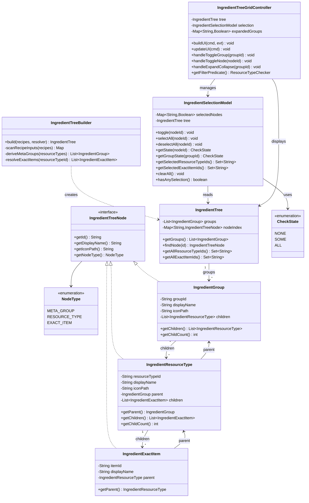
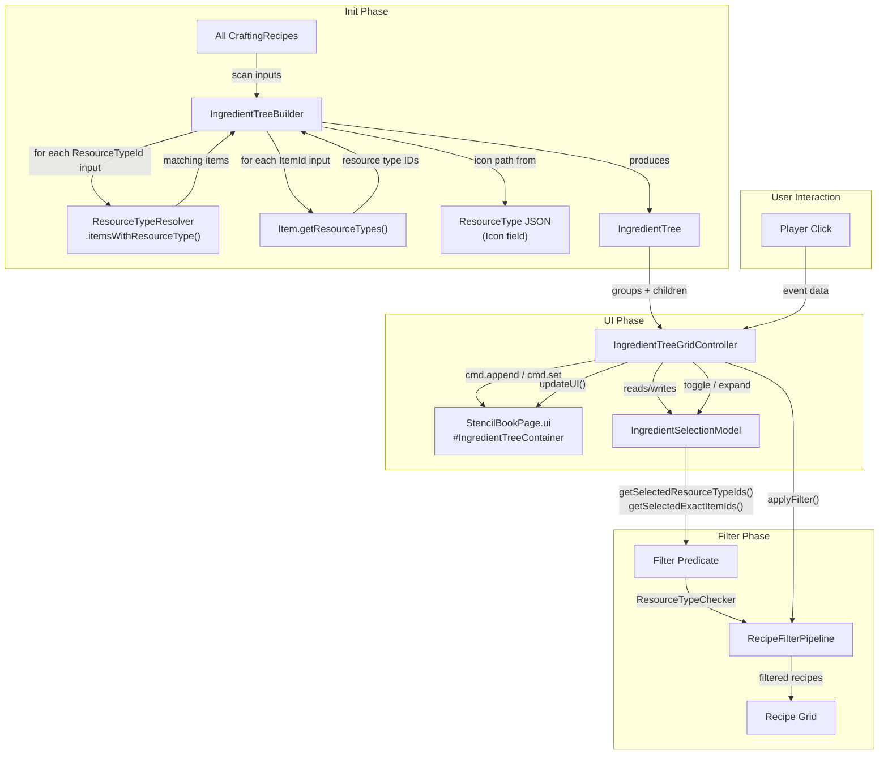
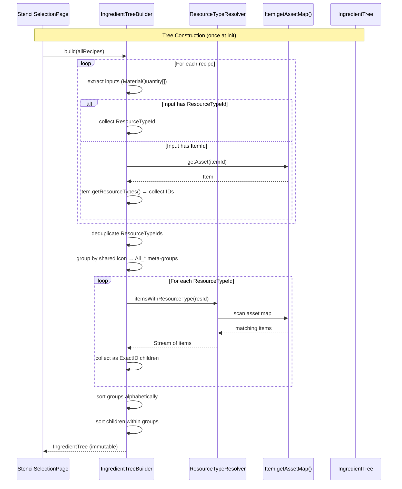
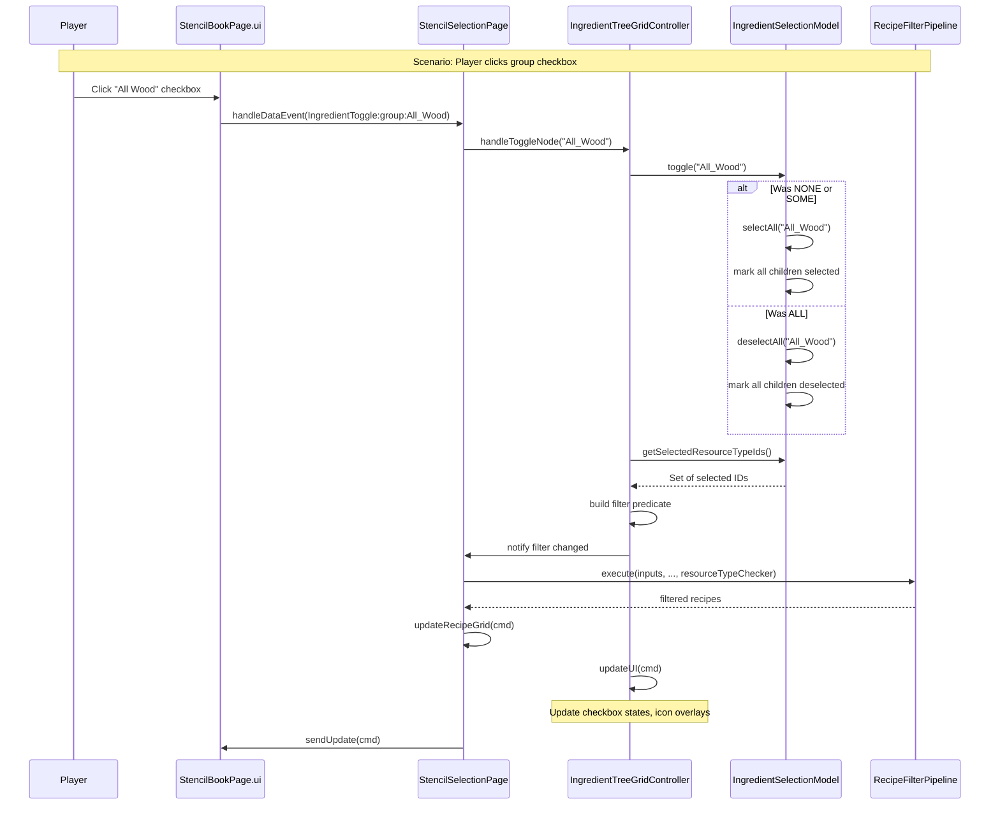

# Design: Ingredient Filter Tree Grid

**Date:** 2026-05-06  
**Epic:** [E2605061200](backlog/E2605061200_Ingredient-Filter-Grid-Refactor/E2605061200_Ingredient-Filter-Grid-Refactor.md)  
**Status:** Design Complete — Ready for Implementation

---

## 1. Overview

Replace the hardcoded `ResourceTypeRegistry` (73 static entries, 7 meta-filter groups) with a dynamically-derived ingredient filter displayed as a three-tier collapsible tree grid. The tree is built once at init time by scanning all recipe inputs and resolving them through the existing `ResourceTypeResolver` infrastructure. Players filter recipes by ingredient at any granularity — from "All Wood" (meta-group) down to a specific plank item (exact ID). The core principle is **derive, don't declare** — the grid contents come from actual recipe data, not a maintained registry.

## 2. Design Priorities

1. **Reusability** — The tree data model, three-state checkbox, and collapsible group header are generic components usable in any context, not coupled to the Stencil Crafting
2. **Simplicity** — Build once, read many; immutable tree; minimal state management
3. **Framework-native patterns** — Use `Visible` toggling for collapse/expand (no engine extensions), `cmd.set()` for all state updates, single `TopScrolling` container
4. **Testability** — Tree builder and selection model are pure logic with no UI dependencies
5. **Performance** — Tree built once at init; selection state is O(1) per node; filter predicate is pre-computed set

## 3. Component Diagram



## 4. Responsibility Map



## 5. Sequence Diagrams

### 5a. Tree Construction (Init)



### 5b. User Interaction — Checkbox Toggle



## 6. Data Model

### 6a. IngredientTreeNode (Interface)

The base contract for all nodes in the tree. Designed for reuse — any tree-structured filter can implement this.

| Method | Returns | Description |
|--------|---------|-------------|
| `getId()` | `String` | Unique identifier (groupId, resourceTypeId, or itemId) |
| `getDisplayName()` | `String` | Human-readable label (spaces instead of underscores) |
| `getIconPath()` | `String` | Relative path to icon image |
| `getNodeType()` | `NodeType` | Discriminator: META_GROUP, RESOURCE_TYPE, or EXACT_ITEM |

### 6b. NodeType (Enum)

```
META_GROUP     — Tier 1: All_* groups (e.g., "All Wood", "All Rock")
RESOURCE_TYPE  — Tier 2: Engine ResourceTypeId (e.g., "Wood_Hardwood")
EXACT_ITEM     — Tier 3: Specific ItemId (e.g., "Wood_Hardwood_Planks")
```

### 6c. IngredientGroup (Tier 1)

Represents an `All_*` meta-group. Groups are determined by **shared icon** in the ResourceType JSON definitions: all ResourceTypeIds that point to the same `Any_*.png` icon belong to the same group.

| Field | Type | Source |
|-------|------|--------|
| `groupId` | `String` | Derived from icon: `"Any_Rock.png"` → `"All_Rock"` |
| `displayName` | `String` | `"All Rock"`, `"All Wood"`, etc. |
| `iconPath` | `String` | `"Common/Icons/ResourceTypes/Any_Rock.png"` |
| `children` | `List<IngredientResourceType>` | Sorted alphabetically by resourceTypeId |

**Grouping rule:** ResourceTypes sharing `Any_*.png` icons form one group. ResourceTypes with unique non-`Any_` icons become **singleton groups** (group of one) or can be placed in a catch-all "Other" group. Decision: **singleton groups** — keeps the tree uniform and avoids a grab-bag category.

### 6d. IngredientResourceType (Tier 2)

| Field | Type | Source |
|-------|------|--------|
| `resourceTypeId` | `String` | Engine ResourceTypeId from recipe input or item declaration |
| `displayName` | `String` | `resourceTypeId` with underscores → spaces |
| `iconPath` | `String` | From ResourceType JSON `Icon` field, or `"Common/Icons/ResourceTypes/{id}.png"` fallback |
| `parent` | `IngredientGroup` | Back-reference to containing group |
| `children` | `List<IngredientExactItem>` | Items declaring this ResourceType that appear as recipe inputs |

### 6e. IngredientExactItem (Tier 3)

| Field | Type | Source |
|-------|------|--------|
| `itemId` | `String` | Concrete item asset ID |
| `displayName` | `String` | `itemId` with underscores → spaces |
| `parent` | `IngredientResourceType` | Back-reference |

**Icon resolution:** ExactID entries use `ItemIcon` element with `ItemId` set dynamically — the engine resolves the icon path automatically. No manual icon path needed.

### 6f. IngredientTree (Root Container)

| Field | Type | Description |
|-------|------|-------------|
| `groups` | `List<IngredientGroup>` | All Tier 1 groups, sorted alphabetically |
| `nodeIndex` | `Map<String, IngredientTreeNode>` | Flat lookup: any node ID → node reference |

Methods:
- `getGroups()` — returns immutable group list
- `findNode(id)` — O(1) lookup by any node ID
- `getAllResourceTypeIds()` — all Tier 2 IDs in the tree
- `getAllExactItemIds()` — all Tier 3 IDs in the tree
- `getTotalNodeCount()` — total nodes across all tiers (for UI slot pre-allocation)

## 7. UI Templates

### 7a. IngredientGroupHeader.ui — Section Header

Replaces the current `#ResourceTypesHeader` and `#CategoriesHeader` pattern with a reusable group header that includes a three-state checkbox, icon, label, and expand/collapse arrow.

```
// IngredientGroupHeader.ui — Collapsible section header with three-state checkbox
// Server sets: #GroupHeaderLabel.Text, #GroupHeaderIcon.Background, 
//              #CheckboxIcon.Background (checkbox state), #ExpandArrow.Background
// Events: #GroupHeaderBtn (expand/collapse), #CheckboxBtn (toggle selection)

$S = "StencilBookStyles.ui";

Group {
    Anchor: (Height: 28, Left: 0, Right: 0);
    LayoutMode: Left;
    Padding: (Left: 4, Right: 4, Top: 2, Bottom: 2);
    
    // Three-state checkbox (16x16)
    Group {
        Anchor: (Width: 20, Height: 20);
        Padding: (Top: 2, Bottom: 2, Left: 0, Right: 2);
        
        Group #CheckboxIcon {
            Anchor: (Full: 0);
            Background: "../../Common/Icons/Checkbox/Unchecked.png";
        }
        
        TextButton #CheckboxBtn {
            Text: "";
            Anchor: (Full: 0);
            Style: $S.@TransparentButtonStyle;
        }
    }
    
    // Group icon (20x20)
    Group #GroupHeaderIcon {
        Anchor: (Width: 20, Height: 20);
        Padding: (Top: 2, Bottom: 2);
    }
    
    // Label (fills remaining space)
    Group {
        FlexWeight: 1;
        Padding: (Left: 4);
        
        Label #GroupHeaderLabel {
            Text: "Group Name";
            Anchor: (Full: 0);
            Style: $S.@SectionHeaderLabelStyle;
        }
    }
    
    // Expand/collapse arrow (16x16)
    Group #ExpandArrow {
        Anchor: (Width: 16, Height: 16);
        Padding: (Top: 4, Bottom: 4);
        Background: "../../Common/Icons/ArrowDown.png";
    }
    
    // Full-width transparent click target for expand/collapse
    TextButton #GroupHeaderBtn {
        Text: "";
        Anchor: (Full: 0);
        Style: $S.@TransparentButtonStyle;
    }
}
```

**Note on layering:** The `#GroupHeaderBtn` covers the full header area for expand/collapse. The `#CheckboxBtn` is a separate click target layered above it for selection toggling. The engine processes events on the most specific (deepest) element first, so clicking the checkbox area fires `#CheckboxBtn`, not `#GroupHeaderBtn`.

### 7b. Child Entries — Reuse GroupFilterButton.ui

Tier 2 (ResourceType) entries reuse the existing `GroupFilterButton.ui` template unchanged — a 36×36 icon button with active overlay. The server sets:
- `#GroupIcon.Background` → `"Common/Icons/ResourceTypes/{resourceTypeId}.png"`
- `#ActiveOverlay.Visible` → selection state
- `.TooltipText` → display name

Tier 3 (ExactItem) entries need a **new template** because they use `ItemIcon` instead of a background image:

### 7c. ExactItemFilterButton.ui — Item Icon Button

```
// ExactItemFilterButton.ui — exact item filter button using engine ItemIcon
// Server sets: #ItemIconEl.ItemId, #ActiveOverlay.Visible, .TooltipText

$S = "StencilBookStyles.ui";

Group {
    Anchor: (Width: 36, Height: 36);
    Padding: (Left: 2, Right: 2, Top: 2, Bottom: 2);
    Visible: false;

    Group {
        Anchor: (Full: 0);
        Background: "../../Common/BlockSelectorSlotBackground.png";

        ItemIcon #ItemIconEl {
            Anchor: (Full: 4);
        }

        Group #ActiveOverlay {
            Anchor: (Full: 0);
            Background: #2a4a6a(0.6);
            Visible: false;
        }

        TextButton #ItemBtn {
            Text: "";
            Anchor: (Full: 0);
            Style: $S.@TransparentButtonStyle;
        }
    }
}
```

### 7d. UI Layout in StencilBookPage.ui

**Layout decision:** The right column is split into two vertical sections:
- **Top (40%):** Crafting Details — output icon, cost grid, Give Stencil button
- **Bottom (60%):** Ingredient Filters — affordability toggle in the section header, collapsible tree grid

This replaces the current layout where the resource type grid was wedged below the affordability toggle in a single scrollable column.

#### Right Column Structure

```
// ═══ RIGHT COLUMN — Details (top) + Ingredients (bottom) ═══
Group {
    Anchor: (Width: 270);
    LayoutMode: Top;
    Padding: (Left: 12);

    // ── Top: Crafting Details (40%) ──
    Group {
        FlexWeight: 4;                     // 40% of right column
        LayoutMode: Top;

        Label #OutputName { ... }
        Group { ... output icon + cost grid ... }
        TextButton #GetPlaceholderBtn { ... }
    }

    $C.@PanelSeparatorFancy {}

    // ── Bottom: Ingredient Filters (60%) ──
    Group {
        FlexWeight: 6;                     // 60% of right column
        LayoutMode: Top;

        // Section header with affordability toggle pill + clear button
        Group {
            Anchor: (Height: 26, Left: 0, Right: 0);
            LayoutMode: Left;

            Label { Text: "INGREDIENTS"; ... }

            TextButton #AffordableToggle {
                Text: "Resource Driven";
                Anchor: (Height: 20);
                Padding: (Left: 6, Right: 6);
                // Pill style — rounded border
            }

            TextButton #ClearIngredientsBtn { ... }
        }

        // Ingredient tree (single outer scroll)
        Group #IngredientTreeContainer {
            FlexWeight: 1;
            LayoutMode: TopScrolling;
            ScrollbarStyle: $C.@DefaultScrollbarStyle;

            // Server appends N × IngredientGroupHeader.ui (one per group)
            // After each header, server appends a body Group:
            //   Group #GroupBody_N {
            //       LayoutMode: LeftCenterWrap;
            //       Visible: true/false;     // expand/collapse state
            //       // Contains M × GroupFilterButton.ui (Tier 2)
            //       // Optionally K × ExactItemFilterButton.ui (Tier 3)
            //   }
        }
    }
}
```

#### Full Page Layout Map

```
┌─────────────────────────────────────────────────────────────────┐
│ [All] [Builders] [Furniture]                      Tab Bar       │
├────────────┬──────────────────────────┬──────────────────────────┤
│            │                          │  Crafting Details (40%)  │
│ Categories │                          │  ┌──────┬────────────┐  │
│ [icon grid]│                          │  │ OUT  │ cost cells │  │
│            │      Recipe Item Grid    │  │ icon │            │  │
│────────────│      (scrollable,        │  └──────┴────────────┘  │
│            │       grouped by sets)   │  [Give Stencil]         │
│ Sets       │                          ├──────────────────────────┤
│ [text list]│                          │  Ingredients (60%)       │
│            │                          │  INGREDIENTS [Res.Drv] ✕ │
│            │                          │  ▼ All Rock ☑ (6)       │
│            │                          │    [RK][SB][BB][CC]     │
│            │                          │  ▼ All Trunk ☐ (3)      │
│            │                          │    ▶ Wood Trunk (2)     │
│            │                          │    ▶ Hardwood Trunk (1) │
│            │                          │  ▶ Hardwood ☐ (1)       │
└────────────┴──────────────────────────┴──────────────────────────┘
```

**Key layout decisions:**
- NO nested scrolling. `#IngredientTreeContainer` is the single `TopScrolling` container
- Group headers and wrap-grid bodies stack vertically; `Visible: false` causes reflow
- Affordability toggle moves into the ingredient section header (not between details and filters)
- `#ResourceTypesHeader`, `#ClearResourceTypesBtn`, `#ResourceTypeGridContainer`, `#ResourceTypeGrid` are all removed

#### Interactive HTML Mockup

See [docs/mocks/ingredient-tree-grid-full-layout.html](mocks/ingredient-tree-grid-full-layout.html) for the full-page interactive mockup at 1180×720 showing all three columns with the new layout.

## 8. Builder Algorithm

### 8a. Overview

`IngredientTreeBuilder.build()` produces an `IngredientTree` from the full recipe set. It runs **once** during `StencilSelectionPage.loadRecipes()`.

### 8b. Step-by-Step Algorithm

```
INPUT:  List<CraftingRecipe> allRecipes
OUTPUT: IngredientTree

1. COLLECT RESOURCE TYPE IDS FROM RECIPES
   resourceTypeIds = new Set<String>
   exactItemIds = new Set<String>
   
   for each recipe in allRecipes:
       for each input in recipe.getInput():
           if input.getResourceTypeId() != null:
               resourceTypeIds.add(input.getResourceTypeId())
           if input.getItemId() != null && !"Empty".equals(input.getItemId()):
               item = Item.getAssetMap().getAsset(input.getItemId())
               if item != null && item.getResourceTypes() != null:
                   for each rt in item.getResourceTypes():
                       resourceTypeIds.add(rt.id)
               exactItemIds.add(input.getItemId())

2. RESOLVE ICONS FOR EACH RESOURCE TYPE ID
   iconMap = new Map<String, String>   // resourceTypeId → icon path
   
   for each resId in resourceTypeIds:
       rtAsset = ResourceType.getAssetMap().getAsset(resId)
       if rtAsset != null && rtAsset.icon != null:
           iconMap.put(resId, rtAsset.icon)
       else:
           iconMap.put(resId, "Icons/ResourceTypes/" + resId + ".png")

3. DERIVE META-GROUPS FROM SHARED ICONS
   // Group ResourceTypeIds by their icon filename
   iconGroups = new Map<String, List<String>>  // icon → list of resIds
   
   for each (resId, iconPath) in iconMap:
       filename = extractFilename(iconPath)    // e.g., "Any_Rock.png"
       iconGroups.computeIfAbsent(filename, []).add(resId)
   
   // Only icons starting with "Any_" form multi-member groups.
   // All others become singleton groups.

4. BUILD GROUP OBJECTS
   groups = new List<IngredientGroup>
   
   for each (iconFilename, resIds) in iconGroups:
       if iconFilename starts with "Any_":
           groupId = "All_" + iconFilename between "Any_" and ".png"
           // e.g., "Any_Rock.png" → "All_Rock"
           displayName = "All " + groupId part after "All_"
       else:
           // Singleton group — display name is the single ResourceTypeId
           groupId = resIds.get(0)  // use the resId itself
           displayName = resId with underscores → spaces
       
       group = new IngredientGroup(groupId, displayName, iconPath)
       
       for each resId in resIds (sorted alphabetically):
           resTypeNode = new IngredientResourceType(resId, ...)
           
           // Resolve ExactID children: items that declare this ResourceType
           // AND appear as direct ItemId inputs in any recipe
           for each item in itemsWithResourceType(resId):
               if exactItemIds.contains(item.getKey()):
                   resTypeNode.addChild(new IngredientExactItem(item.getKey(), ...))
           
           group.addChild(resTypeNode)
       
       groups.add(group)
   
   sort groups alphabetically by displayName

5. BUILD NODE INDEX
   nodeIndex = new Map<String, IngredientTreeNode>
   for each group in groups:
       nodeIndex.put(group.getId(), group)
       for each resType in group.getChildren():
           nodeIndex.put(resType.getId(), resType)
           for each exactItem in resType.getChildren():
               nodeIndex.put(exactItem.getId(), exactItem)

6. RETURN new IngredientTree(groups, nodeIndex)
```

### 8c. Meta-Group Derivation Logic

The key insight: **ResourceType JSON definitions already contain the grouping information via their `Icon` field.** All ResourceTypes pointing to `Any_Rock.png` belong to the "All Rock" group. This replaces the hardcoded `META_FILTER_MAP`.

| Icon Filename | Derived Group ID | Derived Display Name |
|---------------|------------------|----------------------|
| `Any_Bone.png` | `All_Bone` | "All Bone" |
| `Any_Book.png` | `All_Book` | "All Book" |
| `Any_Meat.png` | `All_Meat` | "All Meat" |
| `Any_Mushroom.png` | `All_Mushroom` | "All Mushroom" |
| `Any_Rock.png` | `All_Rock` | "All Rock" |
| `Any_Rubble.png` | `All_Rubble` | "All Rubble" |
| `Any_Trunk.png` | `All_Trunk` | "All Trunk" |

ResourceTypes with non-`Any_*` icons (e.g., `Hardwood.png`, `Fish.png`) become **singleton groups** — a group with exactly one ResourceType child. This keeps the tree structure uniform: every ResourceType is always nested under a group.

### 8d. ExactID Child Resolution

ExactID children are populated **only for items that actually appear as `ItemId` inputs in recipes**. This prevents the tree from showing thousands of items that happen to declare a ResourceType but are never used as recipe ingredients.

```
ExactID children of "Wood_Hardwood" = 
    { items declaring ResourceType "Wood_Hardwood" }
    ∩ { items appearing as ItemId inputs in any recipe }
```

### 8e. Edge Cases

| Case | Handling |
|------|----------|
| Item with no ResourceTypes | Not added to tree (no ResourceType to group under) |
| Item with multiple ResourceTypes | Appears as ExactID child under ALL matching ResourceTypes |
| ResourceType with no recipe inputs | Included if any recipe uses it as ResourceTypeId input |
| ResourceType with empty icon JSON | Fallback icon: `"Icons/ResourceTypes/{resId}.png"` |
| Duplicate items across ResourceTypes | Same ExactItem node referenced from multiple parents (via nodeIndex) |

## 9. Selection State Management

### 9a. IngredientSelectionModel

Maintains a flat `Map<String, Boolean>` of selected node IDs. The model is **not** stored on the tree nodes to keep the tree immutable and the selection model reusable.

### 9b. Three-State Logic

| Current State | On Click | Result |
|---------------|----------|--------|
| NONE (unchecked) | Click checkbox | → ALL (select all children) |
| SOME (indeterminate) | Click checkbox | → ALL (select all children) |
| ALL (checked) | Click checkbox | → NONE (deselect all children) |

### 9c. Cascade Rules

**Top-down cascade (group → children):**
- `selectAll(groupId)` → marks all ResourceType children and their ExactItem children as selected
- `deselectAll(groupId)` → marks all descendants as deselected

**Bottom-up bubble (child → parent):**
- After toggling a leaf or mid-level node, recompute the parent's state:
  - If ALL children selected → parent state = ALL
  - If SOME children selected → parent state = SOME
  - If NO children selected → parent state = NONE

**Mid-level toggle (ResourceType):**
- Toggling a ResourceType node also cascades to its ExactItem children
- Then bubbles up to update the parent group's state

### 9d. CheckState Computation

```
getGroupState(groupId):
    group = tree.findNode(groupId)
    allSelected = true
    anySelected = false
    for each child in group.getChildren():
        if isSelected(child.getId()):
            anySelected = true
        else:
            allSelected = false
        // Also check ExactItem children
        for each exactChild in child.getChildren():
            if isSelected(exactChild.getId()):
                anySelected = true
            else:
                allSelected = false
    
    if allSelected: return ALL
    if anySelected: return SOME
    return NONE
```

### 9e. Filter Output

When the filter pipeline needs the active filter:

```java
// For RESOURCE_DRIVEN mode:
Set<String> resourceTypeIds = selection.getSelectedResourceTypeIds();
Set<String> exactItemIds = selection.getSelectedExactItemIds();

// Build predicate:
resourceTypeChecker = recipe -> {
    CraftingRecipe cr = CraftingRecipe.getAssetMap().getAsset(recipe.recipeId());
    if (cr == null) return false;
    // Check ResourceType match
    if (ResourceTypeResolver.recipeMatchesAnyResourceType(cr, resourceTypeIds)) return true;
    // Check ExactID match
    for (MaterialQuantity input : cr.getInput()) {
        if (input.getItemId() != null && exactItemIds.contains(input.getItemId())) return true;
    }
    return false;
};
```

### 9f. Checkbox Icon Mapping

| State | Icon File | Visual |
|-------|-----------|--------|
| NONE | `Checkbox/Unchecked.png` | Empty square |
| SOME | `Checkbox/Indeterminate.png` | Square with dash |
| ALL | `Checkbox/Checked.png` | Square with checkmark |

These are new icon assets that need to be created (16×16 PNG). Alternatively, use the engine's built-in `CheckBox` element for Tier 1/2 headers if it supports indeterminate state. **Decision: use custom icon images** for full control over appearance and to avoid depending on undocumented CheckBox behavior.

## 10. Integration Changes Required

### 10a. StencilSelectionPage.java

| Change | Location | Description |
|--------|----------|-------------|
| Add field | Class fields | `private IngredientTree ingredientTree;` |
| Add field | Class fields | `private IngredientSelectionModel ingredientSelection;` |
| Add field | Class fields | `private IngredientTreeGridController ingredientController;` |
| Modify | `loadRecipes()` | After loading recipes, call `IngredientTreeBuilder.build(allRecipes)` to construct tree |
| Modify | `build()` | Replace `GroupFilterButton.ui` appends into `#ResourceTypeGrid` with controller's `buildUI()` |
| Modify | `build()` | Replace `buildResourceTypeBindings(evt)` with controller's event bindings |
| Modify | `handleDataEvent()` | Replace `ResourceType:idx:N` handlers with `IngredientToggle:*` handlers delegating to controller |
| Modify | `applyFilter()` | Replace `ResourceTypeRegistry.resolveFilterIds()` usage with `controller.getFilterPredicate()` |
| Modify | `savePrefs()` / `loadPrefs()` | Serialize/deserialize selected node IDs instead of resource type IDs |
| Remove | `updateResourceTypes()` | Replaced by `controller.updateUI()` |
| Remove | `buildResourceTypeBindings()` | Replaced by controller |

### 10b. StencilBookPage.ui

| Change | Location | Description |
|--------|----------|-------------|
| Replace | `#ResourceTypeGridContainer` + `#ResourceTypeGrid` | Replace with `#IngredientTreeContainer` (single `TopScrolling` group) |
| Remove | `#ClearResourceTypesBtn` | Clear functionality moves into controller |
| Remove | `#ResourceTypesHeader` | Replaced by per-group `IngredientGroupHeader.ui` instances |

### 10c. RecipeFilterPipeline.java

| Change | Description |
|--------|-------------|
| Add | `inputMatchesAnyExactItemId(recipe, Set<String>)` — new predicate for ExactID matching |
| No change | `ResourceTypeChecker` interface stays the same; the controller produces a checker that combines both ResourceType and ExactID logic |

### 10d. StencilBookPrefs.java

| Change | Description |
|--------|-------------|
| Rename | `activeResourceTypes` → `selectedIngredientNodes` (list of selected node IDs) |
| Add | `expandedIngredientGroups` (list of expanded group IDs) |
| Keep | Migration logic from old format |

## 11. What Gets Removed

### 11a. ResourceTypeRegistry Impact

`ResourceTypeRegistry` is **not deleted** in this phase. It is still referenced by:
- Preference migration (`getLegacyIdMigrationMap()`)
- Any other consumers not yet migrated

However, the following usages are removed:
- `ResourceTypeRegistry.getAll()` — no longer used for UI population
- `ResourceTypeRegistry.resolveFilterIds()` — replaced by tree selection model
- `ResourceTypeRegistry.isMetaFilter()` — replaced by `NodeType.META_GROUP`
- `ResourceTypeRegistry.getIconPath()` — replaced by tree node `getIconPath()`

**Future cleanup (separate ticket):** Once all consumers are migrated, `ResourceTypeRegistry` can be deleted. The `META_FILTER_MAP` data is now derived dynamically by the tree builder.

### 11b. Removed UI Elements

- `#ResourceTypeGrid` — flat wrap grid of 80 `GroupFilterButton.ui` slots
- `#ResourceTypeGridContainer` — the container around it
- `#ResourceTypesHeader` — single section header
- `#ClearResourceTypesBtn` — clear button (functionality integrated into controller)

### 11c. Removed State Fields in StencilSelectionPage

- `activeResourceTypes` (Set) → replaced by `IngredientSelectionModel`
- `resourceTypesExpanded` (boolean) → replaced by per-group expand state in controller

## 12. Package Structure

```
src/main/java/com/UnobstructedThirdPerson/
├── placeblock/
│   └── ui/
│       ├── ingredienttree/
│       │   ├── IngredientTreeNode.java          // Interface: getId, getDisplayName, getIconPath, getNodeType
│       │   ├── NodeType.java                     // Enum: META_GROUP, RESOURCE_TYPE, EXACT_ITEM
│       │   ├── IngredientGroup.java              // Tier 1: All_* meta-group
│       │   ├── IngredientResourceType.java       // Tier 2: ResourceType entry
│       │   ├── IngredientExactItem.java          // Tier 3: Exact item ID
│       │   ├── IngredientTree.java               // Root container with node index
│       │   ├── IngredientTreeBuilder.java         // Builds tree from recipes
│       │   ├── CheckState.java                   // Enum: NONE, SOME, ALL
│       │   ├── IngredientSelectionModel.java     // Selection state with cascade logic
│       │   └── IngredientTreeGridController.java // UI controller: build, update, events
│       ├── StencilSelectionPage.java           // Modified: uses controller
│       ├── RecipeFilterPipeline.java             // Minor additions
│       └── ResourceTypeRegistry.java            // Kept for migration; usage reduced
│
src/main/resources/Common/UI/Custom/Pages/StencilBook/
├── StencilBookPage.ui                         // Modified: #IngredientTreeContainer
├── IngredientGroupHeader.ui                      // NEW: section header template
├── ExactItemFilterButton.ui                      // NEW: ItemIcon-based filter button
├── GroupFilterButton.ui                          // UNCHANGED: reused for Tier 2 entries
└── StencilBookStyles.ui                       // Add: SectionHeaderLabelStyle
│
src/main/resources/Common/UI/Custom/Common/Icons/Checkbox/
├── Unchecked.png                                 // NEW: 16x16 empty checkbox
├── Checked.png                                   // NEW: 16x16 checked checkbox
└── Indeterminate.png                             // NEW: 16x16 indeterminate checkbox
```

## 13. Task Decomposition

### Wave 1 (no dependencies — can run in parallel)

#### Unit: Data Model Classes
- **Files:** `IngredientTreeNode.java`, `NodeType.java`, `IngredientGroup.java`, `IngredientResourceType.java`, `IngredientExactItem.java`, `IngredientTree.java`, `CheckState.java`
- **Contract:** Immutable data model classes implementing the IngredientTreeNode interface with parent/child navigation
- **Dependencies:** none
- **Done when:** All classes compile; IngredientTree provides `getGroups()`, `findNode()`, `getAllResourceTypeIds()`, `getAllExactItemIds()`

#### Unit: IngredientSelectionModel.java
- **Files:** `IngredientSelectionModel.java`
- **Contract:** Manages selection state with three-state checkbox logic, cascade-down selection, bubble-up state computation, and filter output methods
- **Dependencies:** none (operates on IngredientTreeNode interface)
- **Done when:** `toggle()`, `selectAll()`, `deselectAll()`, `getState()`, `getGroupState()`, `getSelectedResourceTypeIds()`, `getSelectedExactItemIds()` all work correctly; unit tests pass for all cascade/bubble scenarios

#### Unit: UI Templates
- **Files:** `IngredientGroupHeader.ui`, `ExactItemFilterButton.ui`, checkbox icon PNGs
- **Contract:** Reusable .ui templates matching the design specifications; checkbox icons in three states
- **Dependencies:** none
- **Done when:** Templates parse without error; visual appearance matches HTML mockup

### Wave 2 (depends on Wave 1 data model)

#### Unit: IngredientTreeBuilder.java
- **Files:** `IngredientTreeBuilder.java`
- **Contract:** Scans all recipe inputs, resolves ResourceTypeIds to icons, derives meta-groups from shared `Any_*.png` icons, collects ExactID children from recipe ItemId inputs, returns immutable IngredientTree
- **Dependencies:** Wave 1 data model classes
- **Done when:** Builder produces correct tree from test recipe data; edge cases (no ResourceTypes, multiple ResourceTypes, empty icon) handled; unit tests pass

#### Unit: IngredientTreeGridController.java
- **Files:** `IngredientTreeGridController.java`
- **Contract:** Manages UI lifecycle: appends templates in `buildUI()`, binds events, updates visibility and state in `updateUI()`, handles expand/collapse and selection toggle, produces filter predicate
- **Dependencies:** Wave 1 data model + selection model
- **Done when:** Controller correctly builds UI element tree, handles all event types, produces valid filter predicates

### Wave 3 (integration — depends on Wave 2)

#### Unit: Integration Wiring
- **Files:** `StencilSelectionPage.java`, `StencilBookPage.ui`, `StencilBookPrefs.java`, `RecipeFilterPipeline.java`
- **Contract:** Wire IngredientTreeGridController into StencilSelectionPage, replace ResourceTypeRegistry usage, update UI layout, add preference migration
- **Dependencies:** All Wave 1 + Wave 2 units
- **Done when:** Full build passes; ingredient tree displays in-game; selection filters recipes correctly; preferences save/load; ResourceTypeRegistry no longer called for filtering (only for migration)

## 14. Open Questions — RESOLVED

1. **Tier 3 default visibility:** ✅ **RESOLVED** — Each level has its own separate expand toggle. Group expands to show ResourceTypes; ResourceType expands to show ExactItems. Each expandable node has its own independent three-state inclusion checkbox using industry-standard filter "select all" behavior (click = select all children, click again = deselect all, partial selection = indeterminate state).

2. **Singleton group display:** ✅ **RESOLVED** — Use the **most simple and easily scalable design**. Uniform tree structure (option a): every node is a group header regardless of child count. No special-case rendering logic. One code path for all nodes.

3. **Checkbox icon assets:** ✅ **RESOLVED** — Reuse engine assets where possible. Investigate the built-in `CheckBox` element's available states and icon assets before creating custom PNGs.

4. **Max pre-allocated slots:** ✅ **RESOLVED** — Calculate slot count dynamically at build time, same pattern used for item sets. No fixed `MAX_RESOURCE_TYPE_BUTTONS` constant. Count the tree nodes after building, then `cmd.append()` exactly that many slots.

5. **Preference migration:** ✅ **RESOLVED** — No migration. Add a dev command to manually clear ingredient filter preferences for a clean slate during development. Old `activeResourceTypes` preferences are ignored; new `selectedIngredientNodes` starts empty.

## Handoff Checklist

- [x] Component diagram included
- [x] Responsibility map included
- [x] All interfaces have contract descriptions
- [x] All skeleton files described with specifications (no Java skeleton per ticket instructions)
- [x] Integration Changes Required section populated
- [x] Open Questions section populated
- [x] Task Decomposition section populated
- [x] UI template designs specified
- [x] Builder algorithm documented
- [x] Selection state management documented
- [x] HTML mockup created at `docs/mocks/ingredient-tree-grid-full-layout.html`

---

→ @Engineer implement docs/design-ingredient-tree-grid.md
