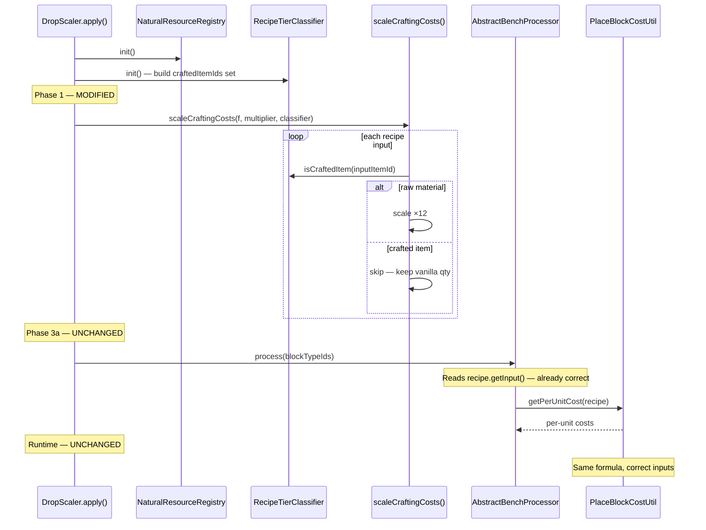

# Design: Linear Scaling Fix — Eliminating Exponential Cost Explosion

**Created:** 2026-05-19  
**Status:** Proposal (4 candidate architectures)  
**Scope:** `com.CodeCreature.scaling` pipeline, specifically Phase 1 of `DropScaler`

---

## 1. Problem Statement

Phase 1 of `DropScaler.scaleCraftingCosts()` applies a flat `RESOURCE_MULTIPLIER` (12×) to **every** recipe input, regardless of whether that input is a raw material or an intermediate crafted item. When crafting chains are multi-tier, this compounds exponentially:

```
Vanilla recipe chain:
  1 stone → 1 brick (Tier 0→1)
  3 bricks → 1 brick_stairs (Tier 1→2)
  Total raw cost: 3 stone for 1 stairs

With flat 12× scaling:
  Phase 1 scales brick recipe:     12 stone → 1 brick
  Phase 1 scales stairs recipe:    36 bricks → 1 brick_stairs
  But each brick already costs 12 stone, so:
  Actual cost: 36 × 12 = 432 stone for 1 stairs
  
  That's 144× vanilla, not 12×.
```

The desired behavior: **every final crafted item should cost exactly M× its vanilla raw material cost**, where M is the multiplier. A 3-stone stairs should cost 36 stone with 12×, not 432.

### Current Pipeline Reference

```
Phase 1:  scaleCraftingCosts()     — flat ×12 ALL recipe inputs ← BUG SOURCE
Phase 2:  BenchBlockClassifier     — categorize blocks by bench
Phase 3a: BenchCategoryProcessors  — synthetic drop lists for recipe blocks
Phase 3b: processNaturalBlock()    — scale natural block drops ×12
Phase 4:  Register synthetic drops — load into asset store
Phase 5:  scaleStackSizes()        — scale item max stacks ×12
Runtime:  PlacementCostScaler      — consume MULTIPLIER-1 extra on natural block place
Runtime:  StencilPlacementSystem   — consume per-unit cost from recipe on stencil place
```

---

## 2. Affected Downstream Systems

Any fix to Phase 1 must maintain invariants consumed by these systems:

| System | What it reads | Invariant |
|--------|--------------|-----------|
| `AbstractBenchProcessor` (Phase 3a) | `recipe.getInput()` (already scaled) | `dropQty = max(1, scaledInputQty / outputQty)` — break must return proportional ingredients |
| `PlaceBlockCostUtil.getPerUnitCost()` | `recipe.getInput()` (already scaled) | `perUnitCost = max(1, scaledInputQty / outputQty)` — stencil/UI cost must match drops |
| `RecipeAffordabilityResolver` | Calls `PlaceBlockCostUtil` | Affordability checks use per-unit cost |
| `StencilVisualManager` | Calls `RecipeAffordabilityResolver` | Visual glow reflects true cost |
| `StencilPlacementSystem` | Calls `PlaceBlockCostUtil` | Resource consumption must match |
| `PlacementCostScaler` | `RESOURCE_MULTIPLIER - 1` | Only applies to natural blocks — recipe blocks unaffected |
| `BlueprintSelectionPage` | Calls `RecipeAffordabilityResolver` | Bench UI shows correct costs |
| Phase 5 (`scaleStackSizes`) | All items with stack > 1 | Stacks must accommodate scaled quantities |

---

## 3. Design Constraints

1. **Integer math only** — no fractional quantities; all division must produce clean integers or use `Math.max(1, …)` floors
2. **Reflection-only API** — Hytale provides no public setters; all mutations go through `AssetFieldAccessor`
3. **Place-break symmetry** — placing a block and breaking it must be net-zero resources
4. **`ResourceTypeId` inputs** — abstract inputs must still resolve to concrete items
5. **Stack sizes** — must accommodate whatever the new scaled quantities are
6. **Single-pass asset modification** — the pipeline runs once at load time; no runtime recipe queries for scaling decisions

---

## 4. Candidate Architectures

### Overview Diagram

```mermaid
graph TB
    subgraph "Option A: Leaf-Only Scaling"
        A_SCAN[Scan all recipes] --> A_CLASS{Is input a<br/>raw material?}
        A_CLASS -->|Yes| A_SCALE["Scale ×M"]
        A_CLASS -->|No| A_SKIP["Skip - keep vanilla qty"]
        A_SCALE --> A_RECIPE["Modified recipe"]
        A_SKIP --> A_RECIPE
    end

    subgraph "Option B: Tier-Aware 10×"
        B_GRAPH["Build recipe DAG"] --> B_TOPO["Topological sort"]
        B_TOPO --> B_WALK["Walk tiers bottom-up"]
        B_WALK --> B_LEAF{"Tier 0?"}
        B_LEAF -->|Yes| B_M["Scale ×10"]
        B_LEAF -->|No| B_ADJ["Scale ×(10/parentScale)"]
        B_M --> B_OUT["Adjusted recipe"]
        B_ADJ --> B_OUT
    end

    subgraph "Option C: Flatten-then-Scale"
        C_RECIPE["Multi-tier recipe"] --> C_RESOLVE["Recursively resolve<br/>to raw materials"]
        C_RESOLVE --> C_FLAT["Flat raw material list"]
        C_FLAT --> C_SCALE["Scale each ×M"]
        C_SCALE --> C_WRITE["Replace recipe inputs"]
    end

    subgraph "Option D: Resource Tokens 10×"
        D_RAW["Raw material drops"] -->|"×10"| D_TOKEN["10 Resource Tokens"]
        D_TOKEN --> D_RECIPE["All recipes consume<br/>tokens directly"]
        D_RECIPE --> D_COST["Linear cost guaranteed"]
    end
```



---

### Proposal A: Leaf-Only Scaling

**One-line summary:** Only scale recipe inputs that are raw materials (leaf nodes); skip intermediate crafted items entirely.

#### Mechanism

Before scaling a recipe input, check whether the input item (or any item matching its `ResourceTypeId`) is itself the output of another crafting recipe. If yes, it's an intermediate — skip scaling. If no recipe produces it, it's a raw material — scale by M.

```
Classification:
  stone     → no recipe produces it → RAW     → scale ×12
  brick     → recipe: stone → brick → CRAFTED → skip
  brick_stairs → recipe: brick → stairs → CRAFTED → skip (brick input stays vanilla)

Result for stairs recipe:
  Vanilla: 3 bricks → 1 stairs
  Scaled:  3 bricks → 1 stairs (unchanged — brick is crafted)
  Brick recipe: 12 stone → 1 brick (raw input scaled)
  Total: 3 × 12 = 36 stone for 1 stairs = 12× vanilla ✓
```

#### Integer Math Analysis

| Vanilla Recipe | Shape | Scaled Input | Per-Unit Cost | Drop Qty | Net |
|---|---|---|---|---|---|
| 1 stone → 1 brick | 1→1, raw | 12 stone → 1 brick | 12 stone | 12 stone | ✓ 0 |
| 2 stone → 1 slab | 2→1, raw | 24 stone → 1 slab | 24 stone | 24 stone | ✓ 0 |
| 3 brick → 1 stairs | 3→1, crafted | 3 brick → 1 stairs | 3 brick | 3 brick | ✓ 0 |
| 4 brick → 1 wall | 4→1, crafted | 4 brick → 1 wall | 4 brick | 4 brick | ✓ 0 |
| 1 wood → 2 ladders | 1→2, raw | 12 wood → 2 ladders | 6 wood | 6 wood | ✓ 0 |
| 1 wood → 4 sticks | 1→4, raw | 12 wood → 4 sticks | 3 wood | 3 wood | ✓ 0 |
| 3 brick → 1 stairs (brick = 12 stone) | multi-tier | 3 brick → 1 stairs | 3 brick (=36 stone) | 3 brick | ✓ 12× |

**Problem:** Crafted-input recipes are *not scaled at all*. A stairs recipe stays `3 bricks → 1 stairs`. When the player breaks stairs, they get 3 bricks back. That's correct for **the stairs recipe**, but the *total raw cost* is 36 stone — which is 12× vanilla (3 stone). However, the **stairs break drops are bricks, not stone**, so the player needs 3 bricks to re-place. This is actually correct behavior — the break loop is symmetric at the brick level.

**Edge case:** What about crafted items used as inputs that are NOT blocks (no break-drop issue)? E.g., sticks used in tool recipes. These stay at vanilla quantities, which is the desired behavior — the stick recipe itself was scaled at the leaf.

#### What Changes in the Codebase

| File | Change |
|------|--------|
| `DropScaler.scaleCraftingCosts()` | Add `isRawMaterial(mq)` check before scaling each input |
| NEW: `RecipeTierClassifier.java` | Builds set of item IDs that are crafting outputs; query `isRawMaterial()` |
| `ResourceConstants.java` | No change (stays 12) |
| `AbstractBenchProcessor` | No change — reads already-correct scaled inputs |
| `PlaceBlockCostUtil` | No change — per-unit math works on whatever quantities are in the recipe |
| `PlacementCostScaler` | No change — only applies to natural blocks |
| `StencilPlacementSystem` | No change |

#### Impact on Existing Systems

- **Stencil placement:** Per-unit cost for crafted-input recipes will be vanilla quantities (e.g., 3 bricks for stairs). The player crafts bricks (which cost 12 stone each) and then uses 3 bricks to place stairs. Linear and correct.
- **Bench UI:** Affordability resolver shows 3 bricks needed. Player sees raw cost is 36 stone. Could add a "total raw cost" tooltip later.
- **Drop resolution:** Phase 3a reads `recipe.getInput()` — for crafted-input recipes, quantities are vanilla, so `dropQty = max(1, 3/1) = 3` bricks. Symmetric with placement.
- **PlacementCostScaler:** Unchanged. Only affects natural blocks. Recipe blocks use stencil or bench crafting.

#### Tradeoffs

| Pro | Con |
|-----|-----|
| Simplest change — one new predicate in Phase 1 | Requires building a "what is craftable" set before scaling (ordering dependency) |
| No multiplier change (stays 12) | Classification must handle `ResourceTypeId` inputs — need to check if *any* matching item is crafted |
| All downstream systems unchanged | Items that are both natural AND craftable (e.g., processing recipes at stonecutter) need careful handling |
| Easy to reason about — "raw gets scaled, crafted doesn't" | No visible scaling on the crafted-input line of the recipe — UI shows vanilla quantities |

#### Migration Path

1. Add `RecipeTierClassifier` — scans all recipes to build `craftedItemIds` set
2. Call it in `DropScaler.apply()` before Phase 1
3. Modify `scaleCraftingCosts()` to skip inputs where the item (or ResourceType match) is in `craftedItemIds`
4. Existing tests for Phase 1 need updating to reflect that crafted inputs are no longer scaled

---

### Proposal B: Tier-Aware Scaling (10×)

**One-line summary:** Build a recipe dependency graph, assign tiers, and scale each tier's inputs so the total raw cost is exactly 10× vanilla.

#### Mechanism

1. Build a directed acyclic graph (DAG) of recipe dependencies: if recipe R2 uses the output of recipe R1 as an input, edge R1→R2
2. Topological sort to assign tiers: tier 0 = uses only raw materials, tier 1 = uses tier-0 outputs, etc.
3. Scale tier-0 recipe inputs by 10×
4. For tier-N (N>0) recipes: inputs that are tier-(N-1) outputs are already implicitly 10× more expensive, so keep them at vanilla quantity. Only scale raw-material inputs (if any) by 10×.

This is equivalent to Proposal A with M=10, but the DAG formalism makes it explicit and extensible to deeper chains.

```
Tier 0:  1 stone → 1 brick          → scale: 10 stone → 1 brick
Tier 1:  3 brick → 1 brick_stairs   → no scale: 3 brick → 1 stairs
         Total raw: 3 × 10 = 30 stone = 10× vanilla (3 stone) ✓

Tier 0:  1 wood → 2 planks          → scale: 10 wood → 2 planks
Tier 1:  6 planks → 1 bookshelf     → no scale: 6 planks → 1 bookshelf
         Total raw: 6/2 × 10 = 30 wood = 10× vanilla (3 wood) ✓
```

#### Integer Math Analysis (M=10)

| Vanilla Recipe | Tier | Scaled Input | Per-Unit Cost | Drop Qty | Total Raw Cost |
|---|---|---|---|---|---|
| 1 stone → 1 brick | 0 | 10 stone → 1 brick | 10 stone | 10 stone | 10× ✓ |
| 2 stone → 1 slab | 0 | 20 stone → 1 slab | 20 stone | 20 stone | 10× ✓ |
| 3 brick → 1 stairs | 1 | 3 brick → 1 stairs | 3 brick | 3 brick | 30 stone = 10× ✓ |
| 4 brick → 1 wall | 1 | 4 brick → 1 wall | 4 brick | 4 brick | 40 stone = 10× ✓ |
| 1 wood → 2 ladders | 0 | 10 wood → 2 ladders | 5 wood | 5 wood | 10× ✓ |
| 1 wood → 4 sticks | 0 | 10 wood → 4 sticks | **2** wood | **2** wood | **8× ✗** |

**Problem with 1→4 at 10×:** `10 / 4 = 2.5`, floored to 2. Drop returns 2×4=8, not 10. **Integer math breaks for 1→4 with M=10.**

Mitigation: Use `Math.round()` instead of floor, or adjust to M=12 (which divides evenly by 1,2,3,4,6,12). With M=12: `12/4 = 3` — clean.

#### What Changes in the Codebase

| File | Change |
|------|--------|
| NEW: `RecipeDependencyGraph.java` | Builds DAG from all recipes, topological sort, tier assignment |
| NEW: `TierAwareScaler.java` | Encapsulates tier-based scaling logic |
| `DropScaler.scaleCraftingCosts()` | Replace flat scaling with tier-aware scaling |
| `ResourceConstants.java` | Change `RESOURCE_MULTIPLIER` from 12 to 10 |
| `PlacementCostScaler` | `EXTRA_COST` changes from 11 to 9 automatically |
| Phase 3b natural drops | Scales by 10 instead of 12 |
| Phase 5 stack sizes | Scales by 10 instead of 12 |

#### Impact on Existing Systems

- **All downstream consumers** automatically pick up the new multiplier value
- **Place-break symmetry** maintained — crafted inputs stay at vanilla, raw inputs at 10×
- **Stencil system** unchanged — `PlaceBlockCostUtil` reads whatever's in the recipe
- **Affordability** unchanged — reads scaled recipe inputs

#### Tradeoffs

| Pro | Con |
|-----|-----|
| Mathematically rigorous — DAG makes tier relationships explicit | Most complex solution — graph building, cycle detection, topological sort |
| Extensible to arbitrary chain depth | 10× has integer math issues with `outputQty=4` (2.5 floor) |
| Clean separation of concern (classifier vs scaler) | Over-engineered for a game that likely has max 2-3 tiers |
| Could visualize the DAG for debugging | DAG must handle `ResourceTypeId` → item resolution to trace dependencies |

#### Migration Path

1. Build `RecipeDependencyGraph` — scans all recipes, resolves outputs to inputs of other recipes
2. Build `TierAwareScaler` — tier-0 gets M×, tier-N>0 gets 1× on crafted inputs
3. Update `ResourceConstants.RESOURCE_MULTIPLIER` to 10
4. Replace `scaleCraftingCosts()` loop with tier-aware version
5. All downstream systems auto-adjust via the constant
6. Comprehensive test suite for DAG correctness

---

### Proposal C: Flatten-then-Scale

**One-line summary:** Recursively resolve every recipe to its raw material cost, then scale that flat cost by M×, replacing the recipe's inputs entirely.

#### Mechanism

For each recipe, recursively expand all crafted-item inputs into raw materials:

```
stairs recipe: 3 bricks
  → expand brick: 1 stone each
  → 3 × 1 stone = 3 stone (raw)
  
Flattened stairs recipe: 3 stone → 1 stairs
Scaled:                  36 stone → 1 stairs (at 12×)
```

All recipes become single-tier: every input is a raw material, scaled by M.

#### Integer Math Analysis (M=12)

| Vanilla Recipe | Flattened Raw Cost | Scaled | Per-Unit Cost | Drop Qty |
|---|---|---|---|---|
| 1 stone → 1 brick | 1 stone | 12 stone → 1 brick | 12 stone | 12 stone ✓ |
| 3 brick → 1 stairs (brick=1 stone) | 3 stone | 36 stone → 1 stairs | 36 stone | 36 stone ✓ |
| 4 brick → 1 wall | 4 stone | 48 stone → 1 wall | 48 stone | 48 stone ✓ |
| 1 wood → 2 ladders | 1 wood | 12 wood → 2 ladders | 6 wood | 6 wood ✓ |
| 1 wood → 4 sticks | 1 wood | 12 wood → 4 sticks | 3 wood | 3 wood ✓ |
| 6 planks → 1 bookshelf (plank=1 wood/2) | 3 wood | 36 wood → 1 bookshelf | 36 wood | 36 wood ✓ |

All integer math is clean because we're back to single-tier `rawQty × 12`.

#### What Changes in the Codebase

| File | Change |
|------|--------|
| NEW: `RecipeFlattener.java` | Recursive raw-material resolution with memoization |
| `DropScaler.scaleCraftingCosts()` | Flatten before scaling; replace recipe inputs with raw materials |
| `ResourceConstants.java` | No change (stays 12) |
| `AbstractBenchProcessor` | **MAJOR CHANGE** — recipe inputs are now raw materials, not intermediate items. Drop resolution must drop raw materials, not crafted intermediates |
| `PlaceBlockCostUtil` | No change — reads whatever inputs the recipe has |
| `RecipeAffordabilityResolver` | **CHANGE** — affordability checks against raw materials, not intermediates |
| `StencilPlacementSystem` | **CHANGE** — consumes raw materials, not intermediates |

#### Impact on Existing Systems

- **BREAKING: Break drops change.** Breaking stairs drops 36 stone instead of 3 bricks. This fundamentally changes the gameplay feel — you never get intermediate items back from breaking.
- **BREAKING: Stencil cost display changes.** Stencil tooltip shows "36 stone" instead of "3 bricks". Simpler but loses crafting identity.
- **Bench UI:** Shows raw materials as ingredients. The ingredient tree becomes flat — no intermediate nodes.
- **PlacementCostScaler:** Unchanged (natural blocks only).
- **`ResourceTypeId` resolution:** Flattening must handle `ResourceTypeId` inputs by resolving them to a concrete item first, then looking up that item's recipe.

#### Tradeoffs

| Pro | Con |
|-----|-----|
| Guaranteed linear — mathematically impossible to compound | **Destroys crafting identity** — no intermediate items in the economy |
| Simple mental model — every block costs raw materials | **Massive gameplay change** — breaking a bookshelf returns wood, not planks |
| All integer math is clean (single tier) | Flattener must handle `ResourceTypeId` resolution, cycles, and multi-output recipes |
| No tier classification needed | **Many downstream systems affected** — drop resolution, affordability, UI all change |
| | Flattening recipes with `ResourceTypeId` inputs is ambiguous — which concrete item to expand? |
| | Multi-output intermediate recipes (1 wood → 2 planks) require fractional tracking during flattening |

#### Migration Path

1. Build `RecipeFlattener` with recursive resolution and memoization
2. Handle `ResourceTypeId` expansion — pick canonical concrete item per resource type
3. Modify `scaleCraftingCosts()` to flatten then scale
4. Update `AbstractBenchProcessor` — drops are now raw materials
5. Update affordability resolver and stencil system — costs are raw materials
6. Extensive gameplay testing — all break drops and placement costs change
7. **HIGH RISK** — effectively a full rewrite of the economy feel

---

### Proposal D: Resource Token Economy (10×)

**One-line summary:** Introduce a new "Resource Token" item type per material family; natural blocks drop 10 tokens; all recipes consume tokens; intermediate items are eliminated from the crafting cost model.

#### Mechanism

1. Create new item assets: `Token_Stone`, `Token_Wood_Oak`, `Token_Wood_Hardwood`, etc.
2. Set stack sizes to 10,000 (or higher) for comfortable storage
3. Natural blocks drop 10 tokens of their type instead of 10 of themselves
4. ALL recipe inputs are rewritten to consume tokens:
   ```
   Vanilla: 1 stone → 1 brick
   Token:   10 Token_Stone → 1 brick
   
   Vanilla: 3 bricks → 1 stairs  
   Token:   30 Token_Stone → 1 stairs  (3 × 10, flattened)
   ```
5. Breaking any crafted block returns the token cost

This is conceptually Proposal C (flatten to raw) but with a dedicated denomination item, avoiding the "breaking stairs returns stone blocks" problem.

#### Integer Math Analysis (M=10)

| Vanilla Recipe | Token Cost | Per-Unit | Drop | Notes |
|---|---|---|---|---|
| 1 stone → 1 brick | 10 Token_Stone → 1 brick | 10 tokens | 10 tokens ✓ | |
| 2 stone → 1 slab | 20 Token_Stone → 1 slab | 20 tokens | 20 tokens ✓ | |
| 3 brick → 1 stairs | 30 Token_Stone → 1 stairs | 30 tokens | 30 tokens ✓ | flattened: 3×10 |
| 4 brick → 1 wall | 40 Token_Stone → 1 wall | 40 tokens | 40 tokens ✓ | |
| 1 wood → 2 ladders | 10 Token_Wood → 2 ladders | 5 tokens | 5 tokens ✓ | |
| 1 wood → 4 sticks | 10 Token_Wood → 4 sticks | **2** tokens | **2** tokens | **8 token round-trip ✗** |

**Same 1→4 problem as Proposal B with M=10**: `10/4 = 2.5` floors to 2. Could use M=10 and accept 80% return, or use M=12 for clean division.

**With M=12 tokens:**
| 1 wood → 4 sticks | 12 Token_Wood → 4 sticks | 3 tokens | 3 tokens ✓ |

#### What Changes in the Codebase

| File | Change |
|------|--------|
| NEW: Token item JSON assets | One per material family (stone, wood variants, metal, etc.) |
| NEW: `TokenRegistry.java` | Maps raw material item IDs → token item IDs |
| NEW: `RecipeTokenizer.java` | Flattens recipes and rewrites inputs to token items |
| `DropScaler.scaleCraftingCosts()` | Replace with `RecipeTokenizer.tokenize()` |
| `DropScaler.processNaturalBlock()` | Change drops from raw items to tokens |
| `ResourceConstants.java` | Change to 10 (or keep 12 for math cleanliness) |
| `PlacementCostScaler` | Change to consume tokens, not block items |
| `NaturalResourceRegistry` | Must register token items as "natural" |
| `AbstractBenchProcessor` | Drops return tokens |
| `RecipeAffordabilityResolver` | Checks token quantities |
| UI ingredient tree | Shows token items |

#### Impact on Existing Systems

- **Stencil placement:** Consumes tokens from inventory. `PlaceBlockCostUtil` reads token inputs from the rewritten recipe. Works if recipes are correctly rewritten.
- **Bench UI:** Shows token items as ingredients. Ingredient tree groups change — tokens are the leaf nodes. Would need icon/display name support for token items.
- **Drop resolution:** All breaks return tokens. `AbstractBenchProcessor` builds drops with token item IDs.
- **PlacementCostScaler:** Must consume tokens instead of block items. Natural blocks no longer drop themselves — they drop tokens.
- **`ResourceTypeId` resolution:** Tokens don't have `ResourceTypeId` — all recipes must be rewritten to use `ItemId` references to specific tokens.

#### Tradeoffs

| Pro | Con |
|-----|-----|
| Clean abstraction — tokens are the universal currency | **Highest complexity** — new item types, new registry, recipe rewriting |
| High stack sizes solve inventory pressure | **Massive content authoring** — need to create and maintain token item assets |
| Clear mental model for players — "everything costs tokens" | **Gameplay redesign** — no longer Hytale's vanilla item economy |
| Eliminates intermediate item cost confusion | Token items need proper icons, names, tooltips |
| | `ResourceTypeId` system is bypassed — all inputs become `ItemId` |
| | Existing player inventories would need migration |
| | **Breaks natural block placement entirely** — blocks don't drop themselves anymore |

#### Migration Path

1. Design and create token item JSON assets (one per material family)
2. Build `TokenRegistry` mapping raw items → tokens
3. Build `RecipeTokenizer` with recursive flattening (same as Proposal C)
4. Rewrite Phase 1 to use tokenized recipes
5. Rewrite Phase 3b natural drops to produce tokens
6. Modify `PlacementCostScaler` to consume tokens
7. Update all UI systems to display token items
8. **VERY HIGH RISK** — effectively a different game economy

---

## 5. Comparative Analysis

| Criterion | A: Leaf-Only | B: Tier-Aware | C: Flatten | D: Tokens |
|-----------|-------------|---------------|------------|-----------|
| **Complexity** | Low | Medium-High | High | Very High |
| **Files changed** | 2 (1 new) | 3 (2 new) | 4+ (1 new) | 8+ (3+ new + assets) |
| **Integer math clean?** | ✓ (M=12) | ✗ (M=10, 1→4) ✓ (M=12) | ✓ (M=12) | ✗ (M=10) ✓ (M=12) |
| **Downstream impact** | None | None | **Breaking** | **Breaking** |
| **Gameplay feel** | Vanilla-like | Vanilla-like | Different | Very different |
| **Place-break symmetry** | ✓ at item level | ✓ at item level | ✓ at raw level | ✓ at token level |
| **Multi-tier correct?** | ✓ | ✓ | ✓ | ✓ |
| **Multiplier** | 12 (no change) | 10 or 12 | 12 (no change) | 10 or 12 |
| **Risk** | Low | Medium | High | Very High |
| **Reversibility** | Easy rollback | Easy rollback | Hard to undo | Very hard to undo |

---

## 6. Recommendation

**Proposal A (Leaf-Only Scaling)** is the clear winner for immediate implementation:

1. **Minimal blast radius** — only `DropScaler.scaleCraftingCosts()` changes behavior; all downstream systems (`PlaceBlockCostUtil`, `AbstractBenchProcessor`, `StencilPlacementSystem`, affordability, UI) are completely unchanged
2. **No multiplier change** — stays at 12, which has the best integer divisibility (divides evenly by 1, 2, 3, 4, 6, 12)
3. **Preserves gameplay identity** — breaking stairs still returns bricks, not raw stone; the crafting hierarchy is visible to players
4. **Simple conceptual model** — "raw materials cost 12×, crafted items keep their vanilla recipe shapes"
5. **Low risk** — if classification is wrong for an edge case, the worst outcome is one recipe being 12× too expensive (fixable by adding to an exception list)

**Proposal B** is the same solution with unnecessary formalism. The DAG/tier model is over-engineered for a problem that A solves with a single predicate. Reserve B's structure only if the game later introduces 4+ tier chains where the distinction matters.

**Proposals C and D** fundamentally change the gameplay economy and should only be considered if the game design explicitly calls for "all costs in raw materials" or "token-based economy." They are not patches to the exponential bug — they are redesigns.

### Recommended Next Steps

1. Implement Proposal A
2. Build `RecipeTierClassifier` — simple set of "items that are crafting recipe outputs"
3. Modify Phase 1 to skip scaling inputs where the item is a crafting output
4. Add logging for skipped inputs (diagnostic visibility)
5. Validate with the brick_stairs chain and bookshelf chain

---

## 7. Sequence Diagram — Proposal A Implementation



---

## 8. Open Questions

1. **Processing recipes (e.g., stonecutter: 2 cobble → 1 cobble):** These are self-referential — the output is the same as the input. The classifier must treat the *output* item as "craftable" but the *input* in these recipes is still a raw material. Current `NaturalResourceRegistry` already handles this by checking bench type. Need to verify `RecipeTierClassifier` does the same.

2. **Salvage recipes:** Currently skipped by `RecipeFilterRegistry.DEFAULT_SKIP_PREFIXES`. The classifier should also skip them — salvage outputs shouldn't mark an item as "crafted."

3. **Items that are both natural AND crafted:** Some blocks might be both harvestable from the world and craftable at a bench. The classifier should check if the *input to this specific recipe* is a crafting output, not whether the item can exist as a natural drop.

4. **`ResourceTypeId` inputs in multi-tier recipes:** If a tier-1 recipe uses `ResourceTypeId: "Rock"` as input, and stone bricks match that type, should the input be classified as "crafted" because stone bricks are crafted? Or "raw" because raw stone also matches? Current approach: check if *any* matching item is a raw material → classify as raw → scale. This is conservative and correct — the player might use raw stone.

5. **Multiplier preference (10 vs 12):** If 10× is desired for aesthetic reasons, Proposal A works with M=10 but the `1→4` recipe shape (`10/4 = 2.5`) would need `Math.round()` instead of floor. With M=12, all common recipe shapes produce clean integers.
