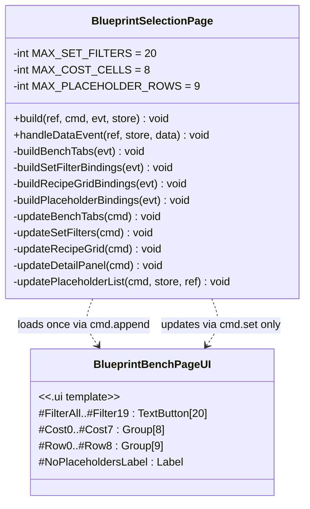
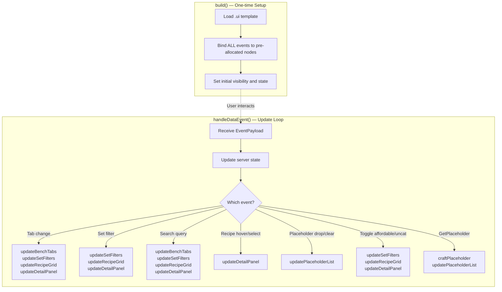
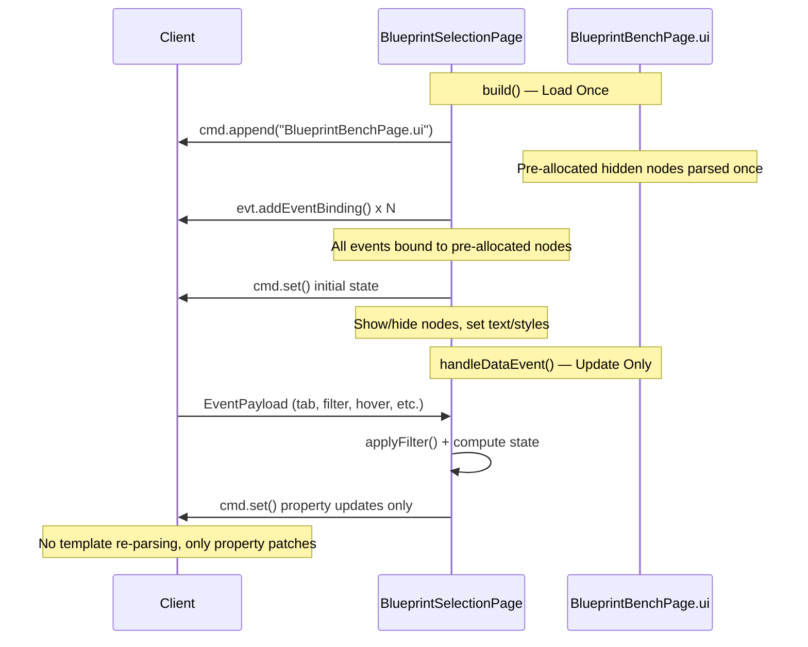

# Design: Load-Update Separation for BlueprintBench UI

> **Date:** 2026-04-29  
> **Status:** Ready for implementation  
> **Affects:** `BlueprintSelectionPage.java`, `BlueprintBenchPage.ui`, `CostCell.ui` (deprecated), `PlaceholderRow.ui` (deprecated)

## 1. Overview

Eliminate per-interaction `.ui` template re-parsing by pre-allocating all dynamic nodes in `BlueprintBenchPage.ui` with `Visible: false` and converting all `handleDataEvent()` paths from `cmd.clear()` + `cmd.append()`/`cmd.appendInline()` to `cmd.set()` property updates only. This fixes the stuttering and eventual disconnect caused by the client re-parsing `.ui` files on every filter change, recipe hover, and placeholder action.

## 2. Design Priorities

1. **Performance** — Zero `cmd.clear()` / `cmd.append()` / `cmd.appendInline()` calls after `build()`. Every update is a `cmd.set()` property patch.
2. **Simplicity** — Flat pre-allocated arrays with show/hide. No dynamic DOM manipulation.
3. **Framework-native patterns** — Uses `cmd.set()` / `.Visible` / `.Text` / `.Style` / `.ItemId` / `.Slots` which the Hytale client handles without re-parsing.
4. **Testability** — Update methods are pure state→cmd.set() mappings, no event binding side effects.

## 3. Component Diagram



## 4. Responsibility Map



## 5. Sequence Diagram



## 6. Deliverable 1 — BlueprintBenchPage.ui Modifications

### 6.1 New Styles to Add (after existing styles block, before Page Root)

These styles are migrated from `PlaceholderRow.ui` and `CostCell.ui` since those files are no longer loaded at runtime.

```
// ── Styles migrated from PlaceholderRow.ui ──

@RowLabelStyle = LabelStyle(
    ...$C.@DefaultLabelStyle,
    FontSize: 11, TextColor: #96a9be,
    HorizontalAlignment: Start, VerticalAlignment: Center, Wrap: true
);
@CancelLabelStyle = LabelStyle(
    ...$C.@DefaultLabelStyle,
    FontSize: 16, RenderBold: true,
    HorizontalAlignment: Center, VerticalAlignment: Center
);

// ── Style migrated from CostCell.ui ──

@CostQtyStyle = LabelStyle(
    ...$C.@DefaultLabelStyle,
    FontSize: 11, TextColor: #ffffff,
    HorizontalAlignment: End, VerticalAlignment: End
);
```

### 6.2 Replace `#SetFilters` Section

**Current** (line 154–156):
```
                Group #SetFilters {
                    LayoutMode: Top;
                }
```

**Replace with:**
```
                Group #SetFilters {
                    LayoutMode: Top;

                    TextButton #FilterAll {
                        Text: "All"; Anchor: (Height: 24);
                        Padding: (Left: 6, Right: 6); Visible: false;
                    }
                    TextButton #Filter0 {
                        Text: ""; Anchor: (Height: 24);
                        Padding: (Left: 6, Right: 6); Visible: false;
                    }
                    TextButton #Filter1 {
                        Text: ""; Anchor: (Height: 24);
                        Padding: (Left: 6, Right: 6); Visible: false;
                    }
                    TextButton #Filter2 {
                        Text: ""; Anchor: (Height: 24);
                        Padding: (Left: 6, Right: 6); Visible: false;
                    }
                    TextButton #Filter3 {
                        Text: ""; Anchor: (Height: 24);
                        Padding: (Left: 6, Right: 6); Visible: false;
                    }
                    TextButton #Filter4 {
                        Text: ""; Anchor: (Height: 24);
                        Padding: (Left: 6, Right: 6); Visible: false;
                    }
                    TextButton #Filter5 {
                        Text: ""; Anchor: (Height: 24);
                        Padding: (Left: 6, Right: 6); Visible: false;
                    }
                    TextButton #Filter6 {
                        Text: ""; Anchor: (Height: 24);
                        Padding: (Left: 6, Right: 6); Visible: false;
                    }
                    TextButton #Filter7 {
                        Text: ""; Anchor: (Height: 24);
                        Padding: (Left: 6, Right: 6); Visible: false;
                    }
                    TextButton #Filter8 {
                        Text: ""; Anchor: (Height: 24);
                        Padding: (Left: 6, Right: 6); Visible: false;
                    }
                    TextButton #Filter9 {
                        Text: ""; Anchor: (Height: 24);
                        Padding: (Left: 6, Right: 6); Visible: false;
                    }
                    TextButton #Filter10 {
                        Text: ""; Anchor: (Height: 24);
                        Padding: (Left: 6, Right: 6); Visible: false;
                    }
                    TextButton #Filter11 {
                        Text: ""; Anchor: (Height: 24);
                        Padding: (Left: 6, Right: 6); Visible: false;
                    }
                    TextButton #Filter12 {
                        Text: ""; Anchor: (Height: 24);
                        Padding: (Left: 6, Right: 6); Visible: false;
                    }
                    TextButton #Filter13 {
                        Text: ""; Anchor: (Height: 24);
                        Padding: (Left: 6, Right: 6); Visible: false;
                    }
                    TextButton #Filter14 {
                        Text: ""; Anchor: (Height: 24);
                        Padding: (Left: 6, Right: 6); Visible: false;
                    }
                    TextButton #Filter15 {
                        Text: ""; Anchor: (Height: 24);
                        Padding: (Left: 6, Right: 6); Visible: false;
                    }
                    TextButton #Filter16 {
                        Text: ""; Anchor: (Height: 24);
                        Padding: (Left: 6, Right: 6); Visible: false;
                    }
                    TextButton #Filter17 {
                        Text: ""; Anchor: (Height: 24);
                        Padding: (Left: 6, Right: 6); Visible: false;
                    }
                    TextButton #Filter18 {
                        Text: ""; Anchor: (Height: 24);
                        Padding: (Left: 6, Right: 6); Visible: false;
                    }
                    TextButton #Filter19 {
                        Text: ""; Anchor: (Height: 24);
                        Padding: (Left: 6, Right: 6); Visible: false;
                    }
                }
```

### 6.3 Replace `#CostGrid` Section

**Current** (line 213–216):
```
            Group #CostGrid {
                LayoutMode: LeftCenterWrap;
                FlexWeight: 4;
            }
```

**Replace with:**
```
            Group #CostGrid {
                LayoutMode: LeftCenterWrap;
                FlexWeight: 4;

                Group #Cost0 {
                    Anchor: (Width: 52, Height: 52); Visible: false;
                    ItemIcon #CostIcon { Anchor: (Full: 2); ShowItemTooltip: true; }
                    Label #CostQty { Text: ""; Anchor: (Height: 14, Bottom: 0, Right: 2); Style: @CostQtyStyle; }
                }
                Group #Cost1 {
                    Anchor: (Width: 52, Height: 52); Visible: false;
                    ItemIcon #CostIcon { Anchor: (Full: 2); ShowItemTooltip: true; }
                    Label #CostQty { Text: ""; Anchor: (Height: 14, Bottom: 0, Right: 2); Style: @CostQtyStyle; }
                }
                Group #Cost2 {
                    Anchor: (Width: 52, Height: 52); Visible: false;
                    ItemIcon #CostIcon { Anchor: (Full: 2); ShowItemTooltip: true; }
                    Label #CostQty { Text: ""; Anchor: (Height: 14, Bottom: 0, Right: 2); Style: @CostQtyStyle; }
                }
                Group #Cost3 {
                    Anchor: (Width: 52, Height: 52); Visible: false;
                    ItemIcon #CostIcon { Anchor: (Full: 2); ShowItemTooltip: true; }
                    Label #CostQty { Text: ""; Anchor: (Height: 14, Bottom: 0, Right: 2); Style: @CostQtyStyle; }
                }
                Group #Cost4 {
                    Anchor: (Width: 52, Height: 52); Visible: false;
                    ItemIcon #CostIcon { Anchor: (Full: 2); ShowItemTooltip: true; }
                    Label #CostQty { Text: ""; Anchor: (Height: 14, Bottom: 0, Right: 2); Style: @CostQtyStyle; }
                }
                Group #Cost5 {
                    Anchor: (Width: 52, Height: 52); Visible: false;
                    ItemIcon #CostIcon { Anchor: (Full: 2); ShowItemTooltip: true; }
                    Label #CostQty { Text: ""; Anchor: (Height: 14, Bottom: 0, Right: 2); Style: @CostQtyStyle; }
                }
                Group #Cost6 {
                    Anchor: (Width: 52, Height: 52); Visible: false;
                    ItemIcon #CostIcon { Anchor: (Full: 2); ShowItemTooltip: true; }
                    Label #CostQty { Text: ""; Anchor: (Height: 14, Bottom: 0, Right: 2); Style: @CostQtyStyle; }
                }
                Group #Cost7 {
                    Anchor: (Width: 52, Height: 52); Visible: false;
                    ItemIcon #CostIcon { Anchor: (Full: 2); ShowItemTooltip: true; }
                    Label #CostQty { Text: ""; Anchor: (Height: 14, Bottom: 0, Right: 2); Style: @CostQtyStyle; }
                }
            }
```

### 6.4 Replace `#PlaceholderList` Section

**Current** (line 238–241):
```
            Group #PlaceholderList {
                Padding: (Top: 20);
                LayoutMode: Top;
            }
```

**Replace with** (one `#RowN` per hotbar slot 0–8, plus `#NoPlaceholdersLabel`):
```
            Group #PlaceholderList {
                Padding: (Top: 20);
                LayoutMode: Top;

                // ── Row 0 ──
                Group #Row0 {
                    LayoutMode: Left; Anchor: (Height: 64, Left: 0, Right: 0); Visible: false;
                    Label #RowSlotLabel { Text: ""; Anchor: (Width: 16); Style: @RowLabelStyle; }
                    Group {
                        Anchor: (Width: 56, Height: 56); LayoutMode: Center;
                        Background: "../../Common/InputBox.png";
                        Group { LayoutMode: Center;
                            ItemGrid #RowInputSlot {
                                FlexWeight: 1; SlotsPerRow: 1;
                                DisplayItemQuantity: false; RenderItemQualityBackground: false;
                                Style: (SlotSize: 48, SlotIconSize: 48, SlotSpacing: 0);
                            }
                        }
                    }
                    Group { Anchor: (Width: 6); }
                    Group {
                        FlexWeight: 1; LayoutMode: Left;
                        Label #RowBlockName { Text: ""; Anchor: (Height: 28); Style: @RowLabelStyle; }
                        Group {
                            FlexWeight: 1; LayoutMode: Right;
                            $C.@CancelButton #RowClearBtn {
                                Anchor: (Width: 24, Height: 24); Visible: false;
                                Label { Text: "x"; Style: @CancelLabelStyle; }
                            }
                        }
                    }
                }

                // ── Row 1 ──
                Group #Row1 {
                    LayoutMode: Left; Anchor: (Height: 64, Left: 0, Right: 0); Visible: false;
                    Label #RowSlotLabel { Text: ""; Anchor: (Width: 16); Style: @RowLabelStyle; }
                    Group {
                        Anchor: (Width: 56, Height: 56); LayoutMode: Center;
                        Background: "../../Common/InputBox.png";
                        Group { LayoutMode: Center;
                            ItemGrid #RowInputSlot {
                                FlexWeight: 1; SlotsPerRow: 1;
                                DisplayItemQuantity: false; RenderItemQualityBackground: false;
                                Style: (SlotSize: 48, SlotIconSize: 48, SlotSpacing: 0);
                            }
                        }
                    }
                    Group { Anchor: (Width: 6); }
                    Group {
                        FlexWeight: 1; LayoutMode: Left;
                        Label #RowBlockName { Text: ""; Anchor: (Height: 28); Style: @RowLabelStyle; }
                        Group {
                            FlexWeight: 1; LayoutMode: Right;
                            $C.@CancelButton #RowClearBtn {
                                Anchor: (Width: 24, Height: 24); Visible: false;
                                Label { Text: "x"; Style: @CancelLabelStyle; }
                            }
                        }
                    }
                }

                // ── Row 2 ──
                Group #Row2 {
                    LayoutMode: Left; Anchor: (Height: 64, Left: 0, Right: 0); Visible: false;
                    Label #RowSlotLabel { Text: ""; Anchor: (Width: 16); Style: @RowLabelStyle; }
                    Group {
                        Anchor: (Width: 56, Height: 56); LayoutMode: Center;
                        Background: "../../Common/InputBox.png";
                        Group { LayoutMode: Center;
                            ItemGrid #RowInputSlot {
                                FlexWeight: 1; SlotsPerRow: 1;
                                DisplayItemQuantity: false; RenderItemQualityBackground: false;
                                Style: (SlotSize: 48, SlotIconSize: 48, SlotSpacing: 0);
                            }
                        }
                    }
                    Group { Anchor: (Width: 6); }
                    Group {
                        FlexWeight: 1; LayoutMode: Left;
                        Label #RowBlockName { Text: ""; Anchor: (Height: 28); Style: @RowLabelStyle; }
                        Group {
                            FlexWeight: 1; LayoutMode: Right;
                            $C.@CancelButton #RowClearBtn {
                                Anchor: (Width: 24, Height: 24); Visible: false;
                                Label { Text: "x"; Style: @CancelLabelStyle; }
                            }
                        }
                    }
                }

                // ── Row 3 ──
                Group #Row3 {
                    LayoutMode: Left; Anchor: (Height: 64, Left: 0, Right: 0); Visible: false;
                    Label #RowSlotLabel { Text: ""; Anchor: (Width: 16); Style: @RowLabelStyle; }
                    Group {
                        Anchor: (Width: 56, Height: 56); LayoutMode: Center;
                        Background: "../../Common/InputBox.png";
                        Group { LayoutMode: Center;
                            ItemGrid #RowInputSlot {
                                FlexWeight: 1; SlotsPerRow: 1;
                                DisplayItemQuantity: false; RenderItemQualityBackground: false;
                                Style: (SlotSize: 48, SlotIconSize: 48, SlotSpacing: 0);
                            }
                        }
                    }
                    Group { Anchor: (Width: 6); }
                    Group {
                        FlexWeight: 1; LayoutMode: Left;
                        Label #RowBlockName { Text: ""; Anchor: (Height: 28); Style: @RowLabelStyle; }
                        Group {
                            FlexWeight: 1; LayoutMode: Right;
                            $C.@CancelButton #RowClearBtn {
                                Anchor: (Width: 24, Height: 24); Visible: false;
                                Label { Text: "x"; Style: @CancelLabelStyle; }
                            }
                        }
                    }
                }

                // ── Row 4 ──
                Group #Row4 {
                    LayoutMode: Left; Anchor: (Height: 64, Left: 0, Right: 0); Visible: false;
                    Label #RowSlotLabel { Text: ""; Anchor: (Width: 16); Style: @RowLabelStyle; }
                    Group {
                        Anchor: (Width: 56, Height: 56); LayoutMode: Center;
                        Background: "../../Common/InputBox.png";
                        Group { LayoutMode: Center;
                            ItemGrid #RowInputSlot {
                                FlexWeight: 1; SlotsPerRow: 1;
                                DisplayItemQuantity: false; RenderItemQualityBackground: false;
                                Style: (SlotSize: 48, SlotIconSize: 48, SlotSpacing: 0);
                            }
                        }
                    }
                    Group { Anchor: (Width: 6); }
                    Group {
                        FlexWeight: 1; LayoutMode: Left;
                        Label #RowBlockName { Text: ""; Anchor: (Height: 28); Style: @RowLabelStyle; }
                        Group {
                            FlexWeight: 1; LayoutMode: Right;
                            $C.@CancelButton #RowClearBtn {
                                Anchor: (Width: 24, Height: 24); Visible: false;
                                Label { Text: "x"; Style: @CancelLabelStyle; }
                            }
                        }
                    }
                }

                // ── Row 5 ──
                Group #Row5 {
                    LayoutMode: Left; Anchor: (Height: 64, Left: 0, Right: 0); Visible: false;
                    Label #RowSlotLabel { Text: ""; Anchor: (Width: 16); Style: @RowLabelStyle; }
                    Group {
                        Anchor: (Width: 56, Height: 56); LayoutMode: Center;
                        Background: "../../Common/InputBox.png";
                        Group { LayoutMode: Center;
                            ItemGrid #RowInputSlot {
                                FlexWeight: 1; SlotsPerRow: 1;
                                DisplayItemQuantity: false; RenderItemQualityBackground: false;
                                Style: (SlotSize: 48, SlotIconSize: 48, SlotSpacing: 0);
                            }
                        }
                    }
                    Group { Anchor: (Width: 6); }
                    Group {
                        FlexWeight: 1; LayoutMode: Left;
                        Label #RowBlockName { Text: ""; Anchor: (Height: 28); Style: @RowLabelStyle; }
                        Group {
                            FlexWeight: 1; LayoutMode: Right;
                            $C.@CancelButton #RowClearBtn {
                                Anchor: (Width: 24, Height: 24); Visible: false;
                                Label { Text: "x"; Style: @CancelLabelStyle; }
                            }
                        }
                    }
                }

                // ── Row 6 ──
                Group #Row6 {
                    LayoutMode: Left; Anchor: (Height: 64, Left: 0, Right: 0); Visible: false;
                    Label #RowSlotLabel { Text: ""; Anchor: (Width: 16); Style: @RowLabelStyle; }
                    Group {
                        Anchor: (Width: 56, Height: 56); LayoutMode: Center;
                        Background: "../../Common/InputBox.png";
                        Group { LayoutMode: Center;
                            ItemGrid #RowInputSlot {
                                FlexWeight: 1; SlotsPerRow: 1;
                                DisplayItemQuantity: false; RenderItemQualityBackground: false;
                                Style: (SlotSize: 48, SlotIconSize: 48, SlotSpacing: 0);
                            }
                        }
                    }
                    Group { Anchor: (Width: 6); }
                    Group {
                        FlexWeight: 1; LayoutMode: Left;
                        Label #RowBlockName { Text: ""; Anchor: (Height: 28); Style: @RowLabelStyle; }
                        Group {
                            FlexWeight: 1; LayoutMode: Right;
                            $C.@CancelButton #RowClearBtn {
                                Anchor: (Width: 24, Height: 24); Visible: false;
                                Label { Text: "x"; Style: @CancelLabelStyle; }
                            }
                        }
                    }
                }

                // ── Row 7 ──
                Group #Row7 {
                    LayoutMode: Left; Anchor: (Height: 64, Left: 0, Right: 0); Visible: false;
                    Label #RowSlotLabel { Text: ""; Anchor: (Width: 16); Style: @RowLabelStyle; }
                    Group {
                        Anchor: (Width: 56, Height: 56); LayoutMode: Center;
                        Background: "../../Common/InputBox.png";
                        Group { LayoutMode: Center;
                            ItemGrid #RowInputSlot {
                                FlexWeight: 1; SlotsPerRow: 1;
                                DisplayItemQuantity: false; RenderItemQualityBackground: false;
                                Style: (SlotSize: 48, SlotIconSize: 48, SlotSpacing: 0);
                            }
                        }
                    }
                    Group { Anchor: (Width: 6); }
                    Group {
                        FlexWeight: 1; LayoutMode: Left;
                        Label #RowBlockName { Text: ""; Anchor: (Height: 28); Style: @RowLabelStyle; }
                        Group {
                            FlexWeight: 1; LayoutMode: Right;
                            $C.@CancelButton #RowClearBtn {
                                Anchor: (Width: 24, Height: 24); Visible: false;
                                Label { Text: "x"; Style: @CancelLabelStyle; }
                            }
                        }
                    }
                }

                // ── Row 8 ──
                Group #Row8 {
                    LayoutMode: Left; Anchor: (Height: 64, Left: 0, Right: 0); Visible: false;
                    Label #RowSlotLabel { Text: ""; Anchor: (Width: 16); Style: @RowLabelStyle; }
                    Group {
                        Anchor: (Width: 56, Height: 56); LayoutMode: Center;
                        Background: "../../Common/InputBox.png";
                        Group { LayoutMode: Center;
                            ItemGrid #RowInputSlot {
                                FlexWeight: 1; SlotsPerRow: 1;
                                DisplayItemQuantity: false; RenderItemQualityBackground: false;
                                Style: (SlotSize: 48, SlotIconSize: 48, SlotSpacing: 0);
                            }
                        }
                    }
                    Group { Anchor: (Width: 6); }
                    Group {
                        FlexWeight: 1; LayoutMode: Left;
                        Label #RowBlockName { Text: ""; Anchor: (Height: 28); Style: @RowLabelStyle; }
                        Group {
                            FlexWeight: 1; LayoutMode: Right;
                            $C.@CancelButton #RowClearBtn {
                                Anchor: (Width: 24, Height: 24); Visible: false;
                                Label { Text: "x"; Style: @CancelLabelStyle; }
                            }
                        }
                    }
                }

                // ── Empty state label ──
                Label #NoPlaceholdersLabel {
                    Text: "No placeholders in hotbar";
                    Anchor: (Height: 32);
                    Visible: false;
                    Style: LabelStyle(
                        FontSize: 11, TextColor: #6e7da1,
                        HorizontalAlignment: Center, VerticalAlignment: Center
                    );
                }
            }
```

## 7. Deliverable 2 — BlueprintSelectionPage.java Skeleton

### 7.1 Constants

```java
private static final int MAX_SET_FILTERS = 20;
private static final int MAX_COST_CELLS = 8;
private static final int MAX_PLACEHOLDER_ROWS = PlaceBlockMetadata.HOTBAR_SIZE; // 9
```

### 7.2 build() Method — Revised Structure

```java
@Override
public void build(@NonNull Ref<EntityStore> ref,
                  @NonNull UICommandBuilder cmd,
                  @NonNull UIEventBuilder evt,
                  @NonNull Store<EntityStore> store) {

    this.playerRef_ref = ref;
    this.playerStore = store;

    loadRecipes();

    // Load template ONCE — all dynamic nodes pre-allocated with Visible: false
    cmd.append("Pages/BlueprintBench/BlueprintBenchPage.ui");

    // ── Bind ALL events (one-time) ──

    // Search input
    evt.addEventBinding(
            CustomUIEventBindingType.ValueChanged,
            "#SearchInput",
            EventData.of("@SearchQuery", "#SearchInput.Value"),
            false
    );

    // Toggle buttons
    evt.addEventBinding(
            CustomUIEventBindingType.Activating, "#AffordableToggle",
            EventData.of("Action", "ToggleAffordable")
    );
    evt.addEventBinding(
            CustomUIEventBindingType.Activating, "#UncategorizedToggle",
            EventData.of("Action", "ToggleUncategorized")
    );

    // Get Placeholder button
    evt.addEventBinding(
            CustomUIEventBindingType.Activating, "#GetPlaceholderBtn",
            EventData.of("Action", "GetPlaceholder")
    );

    buildBenchTabs(evt);
    buildSetFilterBindings(evt);
    buildRecipeGridBindings(evt);
    buildPlaceholderBindings(evt);

    // ── Set initial state ──
    cmd.set("#AffordableToggle.Style", affordabilityEnabled ? FILTER_ACTIVE : FILTER_INACTIVE);
    cmd.set("#UncategorizedToggle.Style", showUncategorized ? FILTER_ACTIVE : FILTER_INACTIVE);

    updateBenchTabs(cmd);
    updateSetFilters(cmd);
    updateRecipeGrid(cmd);
    updateDetailPanel(cmd);
    updatePlaceholderList(cmd, store, ref);
}
```

### 7.3 build()-only Binding Methods

```java
/**
 * Binds the tab-changed event on #BenchTabs.
 * Called once from build(). Never rebind — tabs are static DOM nodes.
 */
private void buildBenchTabs(UIEventBuilder evt) {
    // TODO: Bind SelectedTabChanged on #BenchTabs
    //       EventData.of("@SelectedTab", "#BenchTabs.SelectedTab"), false
}

/**
 * Binds Activating events for all 21 pre-allocated set filter buttons.
 * #FilterAll sends "SetFilter:All".
 * #Filter0–#Filter19 send "SetFilter:idx:N" — server resolves index to set name
 * via currentSets.get(N) at event time.
 */
private void buildSetFilterBindings(UIEventBuilder evt) {
    // TODO: Bind Activating on #FilterAll → EventData.of("Action", "SetFilter:All")
    // TODO: Loop i = 0..MAX_SET_FILTERS-1:
    //         Bind Activating on "#Filter" + i → EventData.of("Action", "SetFilter:idx:" + i)
}

/**
 * Binds hover and click events on #RecipeGrid.
 * Called once — the grid is a static DOM node, only its .Slots content changes.
 */
private void buildRecipeGridBindings(UIEventBuilder evt) {
    // TODO: Bind SlotMouseEntered on #RecipeGrid → EventData.of("Action", "RecipeHover"), false
    // TODO: Bind SlotClicking on #RecipeGrid → EventData.of("Action", "RecipeSelect"), false
}

/**
 * Binds drop and clear events for all 9 pre-allocated placeholder rows.
 * #RowN maps to hotbar slot N, so event data carries the fixed slot index.
 */
private void buildPlaceholderBindings(UIEventBuilder evt) {
    // TODO: Loop i = 0..MAX_PLACEHOLDER_ROWS-1:
    //         Bind Dropped on "#Row" + i + " #RowInputSlot"
    //           → EventData.of("Action", "PlaceholderDrop:" + i), false
    //         Bind Activating on "#Row" + i + " #RowClearBtn"
    //           → EventData.of("Action", "PlaceholderClear:" + i)
}
```

### 7.4 Update-only Methods (cmd.set() only — no cmd.clear/append/appendInline)

```java
/**
 * Sets #BenchTabs.SelectedTab and #ActiveBenchLabel.Text.
 * Pure cmd.set() — no event bindings.
 */
private void updateBenchTabs(UICommandBuilder cmd) {
    // TODO: cmd.set("#BenchTabs.SelectedTab", activeTab)
    // TODO: cmd.set("#ActiveBenchLabel.Text", tabDisplayName(activeTab))
}

/**
 * Shows/hides pre-allocated filter buttons and sets their text + styles.
 *
 * Logic:
 *   1. Show #FilterAll, set style based on activeSetFilters.isEmpty()
 *   2. For i = 0..currentSets.size()-1:
 *        Show #FilterN, set .Text to shortened set name, set .Style based on membership
 *   3. For i = currentSets.size()..MAX_SET_FILTERS-1:
 *        Hide #FilterN
 *
 * Set name shortening: drop first underscore-delimited segment, replace '_' with ' '.
 */
private void updateSetFilters(UICommandBuilder cmd) {
    // TODO: cmd.set("#FilterAll.Visible", !currentSets.isEmpty())
    // TODO: cmd.set("#FilterAll.Style", activeSetFilters.isEmpty() ? FILTER_ACTIVE : FILTER_INACTIVE)
    // TODO: Loop i = 0..MAX_SET_FILTERS-1:
    //         if (i < currentSets.size()):
    //           cmd.set("#Filter" + i + ".Visible", true)
    //           cmd.set("#Filter" + i + ".Text", shortenSetName(currentSets.get(i)))
    //           cmd.set("#Filter" + i + ".Style", activeSetFilters.contains(currentSets.get(i)) ? FILTER_ACTIVE : FILTER_INACTIVE)
    //         else:
    //           cmd.set("#Filter" + i + ".Visible", false)
}

/**
 * Populates #RecipeGrid.Slots from displayedRecipes.
 * Pure cmd.set() — grid events are bound in buildRecipeGridBindings().
 */
private void updateRecipeGrid(UICommandBuilder cmd) {
    // TODO: Build ItemGridSlot[] from displayedRecipes (same logic as current buildRecipeList)
    // TODO: cmd.set("#RecipeGrid.Slots", recipeSlots)
}

/**
 * Updates the detail panel: #OutputName, #OutputIcon, and cost cells #Cost0–#Cost7.
 *
 * Logic:
 *   1. If selectedRecipeId is null or not found:
 *        Set #OutputName.Text = "No recipe selected", #OutputIcon.ItemId = ""
 *        Hide all cost cells
 *   2. Otherwise:
 *        Set output name and icon
 *        Compute per-unit cost via PlaceBlockCostUtil.getPerUnitCost()
 *        Aggregate by item ID using ResourceTypeResolver.resolveInputItemId()
 *        For i = 0..ingredientCount-1:
 *          Show #CostN, set #CostN #CostIcon.ItemId and #CostN #CostQty.Text
 *        For i = ingredientCount..MAX_COST_CELLS-1:
 *          Hide #CostN
 */
private void updateDetailPanel(UICommandBuilder cmd) {
    // TODO: Implement per the logic above
    // CRITICAL: No cmd.clear() or cmd.append() — only cmd.set()
}

/**
 * Shows/hides pre-allocated placeholder rows based on hotbar contents.
 *
 * Design: #RowN maps directly to hotbar slot N.
 *   - Scan all 9 hotbar slots
 *   - If slot N has a placeholder: show #RowN, set label/icon/name, show clear btn if armed
 *   - If slot N has no placeholder: hide #RowN
 *   - Show #NoPlaceholdersLabel if zero placeholders found
 *
 * Each row's events are pre-bound in buildPlaceholderBindings() with the fixed slot index,
 * so no event rebinding is needed.
 */
private void updatePlaceholderList(UICommandBuilder cmd,
                                    Store<EntityStore> store, Ref<EntityStore> ref) {
    // TODO: Scan all HOTBAR_SIZE slots (reuse scanHotbarPlaceholders logic)
    // TODO: Loop i = 0..MAX_PLACEHOLDER_ROWS-1:
    //         String rowSel = "#Row" + i;
    //         if (slot i has placeholder):
    //           cmd.set(rowSel + ".Visible", true)
    //           cmd.set(rowSel + " #RowSlotLabel.Text", String.valueOf(i + 1))
    //           if (armed):
    //             cmd.set(rowSel + " #RowInputSlot.Slots", new ItemGridSlot[]{armedSlot})
    //             cmd.set(rowSel + " #RowBlockName.Text", blockName)
    //             cmd.set(rowSel + " #RowClearBtn.Visible", true)
    //           else:
    //             cmd.set(rowSel + " #RowInputSlot.Slots", new ItemGridSlot[]{emptyActivatableSlot})
    //             cmd.set(rowSel + " #RowBlockName.Text", "Empty")
    //             cmd.set(rowSel + " #RowClearBtn.Visible", false)
    //         else:
    //           cmd.set(rowSel + ".Visible", false)
    // TODO: cmd.set("#NoPlaceholdersLabel.Visible", noPlaceholdersFound)
}
```

### 7.5 handleDataEvent() — Revised Structure

The overall structure stays the same, but every call to `buildSetFilters` / `buildRecipeList` / `buildPlaceholderList` / `updateDetailPanel` / `bindBenchTabs` is replaced with the update-only variants. **No `UIEventBuilder` is needed in handleDataEvent.**

```java
@Override
public void handleDataEvent(@NonNull Ref<EntityStore> ref,
                            @NonNull Store<EntityStore> store,
                            @NonNull EventPayload data) {

    this.playerRef_ref = ref;
    this.playerStore = store;

    UICommandBuilder cmd = new UICommandBuilder();
    // NOTE: No UIEventBuilder — all events were bound in build()

    if (data.selectedTab != null) {
        String tab = data.selectedTab;
        if (!tab.equals(this.activeTab)) {
            this.activeTab = tab;
            this.activeSetFilters.clear();
            this.searchQuery = "";
            this.selectedRecipeId = null;
            applyFilter();
            cmd.set("#SearchInput.Value", "");
            updateBenchTabs(cmd);
            updateSetFilters(cmd);
            updateRecipeGrid(cmd);
            updateDetailPanel(cmd);
            sendUpdate(cmd, null, false);  // null evt — no rebinding
        }

    } else if (data.action != null && data.action.startsWith("SetFilter:")) {
        String filterPayload = data.action.substring("SetFilter:".length());
        if (ALL_FILTER.equals(filterPayload)) {
            activeSetFilters.clear();
        } else if (filterPayload.startsWith("idx:")) {
            // Index-based filter — resolve to set name
            int idx = Integer.parseInt(filterPayload.substring(4));
            if (idx >= 0 && idx < currentSets.size()) {
                String setName = currentSets.get(idx);
                if (activeSetFilters.contains(setName)) {
                    activeSetFilters.remove(setName);
                } else {
                    activeSetFilters.add(setName);
                }
            }
        }
        this.selectedRecipeId = null;
        applyFilter();
        updateSetFilters(cmd);
        updateRecipeGrid(cmd);
        updateDetailPanel(cmd);
        sendUpdate(cmd, null, false);

    } else if (data.searchQuery != null) {
        this.searchQuery = data.searchQuery.trim();
        applyFilter();
        this.selectedRecipeId = null;
        updateBenchTabs(cmd);
        updateSetFilters(cmd);
        updateRecipeGrid(cmd);
        updateDetailPanel(cmd);
        sendUpdate(cmd, null, false);

    } else if (data.recipeId != null) {
        this.selectedRecipeId = data.recipeId;
        updateRecipeGrid(cmd);
        updateDetailPanel(cmd);
        sendUpdate(cmd, null, false);

    } else if ("ToggleAffordable".equals(data.action)) {
        this.affordabilityEnabled = !this.affordabilityEnabled;
        applyFilter();
        cmd.set("#AffordableToggle.Style", affordabilityEnabled ? FILTER_ACTIVE : FILTER_INACTIVE);
        updateSetFilters(cmd);
        updateRecipeGrid(cmd);
        updateDetailPanel(cmd);
        sendUpdate(cmd, null, false);

    } else if ("ToggleUncategorized".equals(data.action)) {
        this.showUncategorized = !this.showUncategorized;
        applyFilter();
        cmd.set("#UncategorizedToggle.Style", showUncategorized ? FILTER_ACTIVE : FILTER_INACTIVE);
        updateSetFilters(cmd);
        updateRecipeGrid(cmd);
        updateDetailPanel(cmd);
        sendUpdate(cmd, null, false);

    } else if (data.action != null && data.action.startsWith("PlaceholderDrop:")) {
        // ... existing armPlaceholder logic unchanged ...
        updatePlaceholderList(cmd, store, ref);
        sendUpdate(cmd, null, false);

    } else if (data.action != null && data.action.startsWith("PlaceholderClear:")) {
        // ... existing disarmPlaceholder logic unchanged ...
        updatePlaceholderList(cmd, store, ref);
        sendUpdate(cmd, null, false);

    } else if ("RecipeHover".equals(data.action)) {
        if (data.slotIndex != null && data.slotIndex >= 0 && data.slotIndex < displayedRecipes.size()) {
            this.selectedRecipeId = displayedRecipes.get(data.slotIndex).recipeId();
            updateDetailPanel(cmd);
        }
        sendUpdate(cmd, null, false);

    } else if ("RecipeSelect".equals(data.action)) {
        if (data.slotIndex != null && data.slotIndex >= 0 && data.slotIndex < displayedRecipes.size()) {
            this.selectedRecipeId = displayedRecipes.get(data.slotIndex).recipeId();
            updateDetailPanel(cmd);
        }
        sendUpdate(cmd, null, false);

    } else if ("GetPlaceholder".equals(data.action)) {
        craftPlaceholder(store, ref, cmd);
        updatePlaceholderList(cmd, store, ref);
        sendUpdate(cmd, null, false);
    }
}
```

> **NOTE on `sendUpdate(cmd, null, false)`:** If the `sendUpdate` API requires a non-null `UIEventBuilder`, pass an empty `new UIEventBuilder()` instead of `null`. The point is that no event bindings are added to it.

## 8. Deliverable 3 — Event Binding Inventory

| Event Binding | Selector | Where | Rationale |
|---|---|---|---|
| `ValueChanged` | `#SearchInput` | `build()` only | Static DOM node — never recreated |
| `Activating` | `#AffordableToggle` | `build()` only | Static DOM node |
| `Activating` | `#UncategorizedToggle` | `build()` only | Static DOM node |
| `SelectedTabChanged` | `#BenchTabs` | `build()` only | Static DOM node |
| `Activating` | `#FilterAll` | `build()` only | Pre-allocated, never recreated |
| `Activating` | `#Filter0`–`#Filter19` | `build()` only | Pre-allocated, hidden when unused |
| `SlotMouseEntered` | `#RecipeGrid` | `build()` only | Static DOM node |
| `SlotClicking` | `#RecipeGrid` | `build()` only | Static DOM node |
| `Dropped` | `#Row0..#Row8 #RowInputSlot` | `build()` only | Pre-allocated, fixed slot mapping |
| `Activating` | `#Row0..#Row8 #RowClearBtn` | `build()` only | Pre-allocated, fixed slot mapping |
| `Activating` | `#GetPlaceholderBtn` | `build()` only | Static DOM node |

**Result:** Zero event bindings in `handleDataEvent()`. All 11 binding types are build()-only.

## 9. Package Structure

No new files. All changes are in existing files:

```
src/main/resources/Common/UI/Custom/Pages/BlueprintBench/
├── BlueprintBenchPage.ui      ← MODIFIED (pre-allocated nodes + migrated styles)
├── CostCell.ui                ← DEPRECATED (no longer loaded at runtime)
└── PlaceholderRow.ui          ← DEPRECATED (no longer loaded at runtime)

src/main/java/com/UnobstructedThirdPerson/placeblock/ui/
└── BlueprintSelectionPage.java ← MODIFIED (split build/update methods)
```

## 10. Integration Changes Required

| File | Change |
|---|---|
| `BlueprintBenchPage.ui` | Add `@RowLabelStyle`, `@CancelLabelStyle`, `@CostQtyStyle` styles. Replace `#SetFilters`, `#CostGrid`, `#PlaceholderList` sections with pre-allocated nodes. |
| `BlueprintSelectionPage.java` | Add 3 constants. Replace `buildSetFilters()` with `buildSetFilterBindings()` + `updateSetFilters()`. Replace `updateDetailPanel()` with update-only version (no `cmd.clear`/`cmd.append`). Replace `buildPlaceholderList()` with `buildPlaceholderBindings()` + `updatePlaceholderList()`. Extract `buildBenchTabs(evt)` + `updateBenchTabs(cmd)` from `bindBenchTabs()`. Extract `buildRecipeGridBindings(evt)` + `updateRecipeGrid(cmd)` from `buildRecipeList()`. Update `handleDataEvent()` to remove `UIEventBuilder` and call update-only methods. Update `SetFilter:` handler to parse `"idx:N"` format. |
| `CostCell.ui` | No code change. No longer loaded at runtime — can be deleted or kept as reference. |
| `PlaceholderRow.ui` | No code change. No longer loaded at runtime — can be deleted or kept as reference. |

### Protocol Change: Set Filter Action Format

The set filter event data changes from `"SetFilter:<setName>"` to:
- `"SetFilter:All"` — unchanged
- `"SetFilter:idx:<N>"` — index-based, where N is the filter button index (0–19)

The server resolves the index to the actual set name via `currentSets.get(N)` at event time. This is necessary because filter buttons are pre-allocated and bound once — the set names change when tabs change.

## 11. Open Questions

1. **`sendUpdate()` null-safety:** Does `sendUpdate(cmd, evt, false)` accept a null `UIEventBuilder`? If not, pass an empty `new UIEventBuilder()`. The Engineer should verify this.
2. **CostCell.ui / PlaceholderRow.ui cleanup:** Should these deprecated files be deleted, or kept as documentation? They are no longer loaded at runtime.

## 12. Handoff Checklist

- [x] Component diagram included
- [x] Responsibility map included
- [x] All interfaces have doc comments with contracts
- [x] All skeleton methods created with TODO markers
- [x] Integration Changes Required section populated
- [x] Open Questions section populated
- [x] Event binding inventory (all moved to build()-only)
- [x] Exact .ui replacement sections with full markup
- [x] handleDataEvent() revised structure with all update-only calls
- [x] Protocol change documented (SetFilter index-based format)
