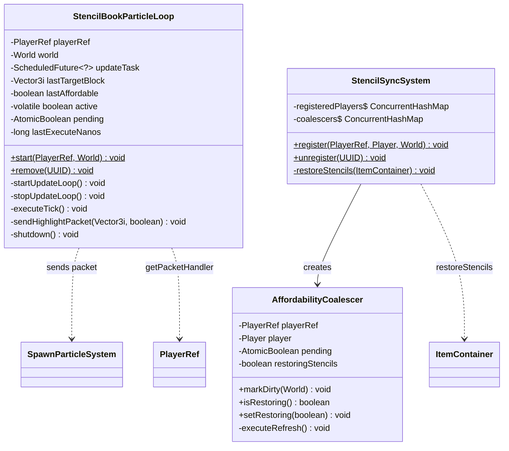
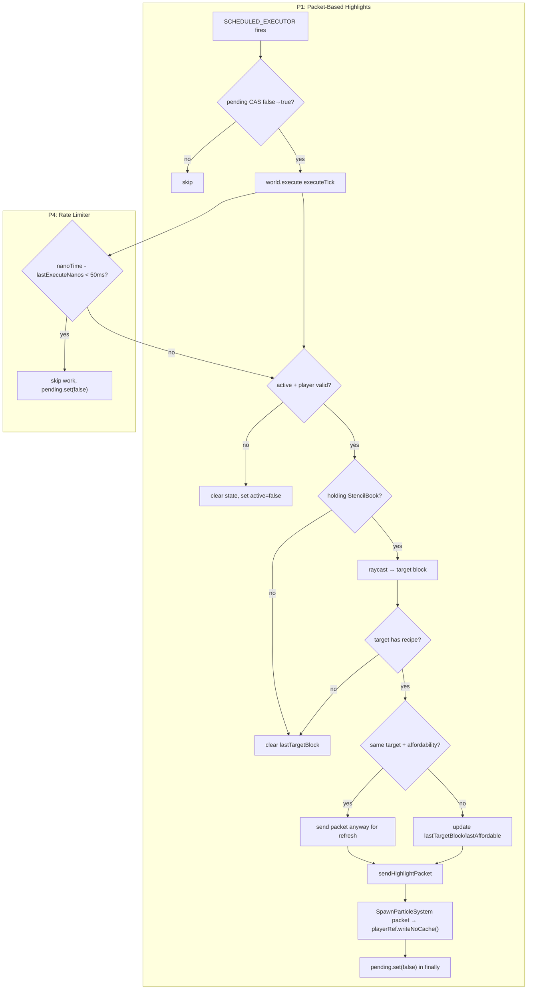
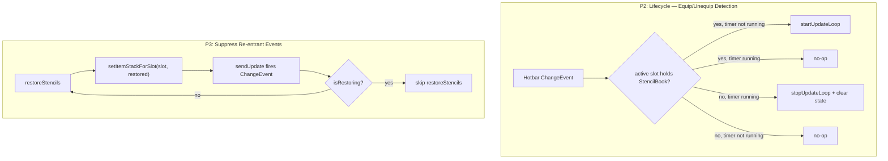
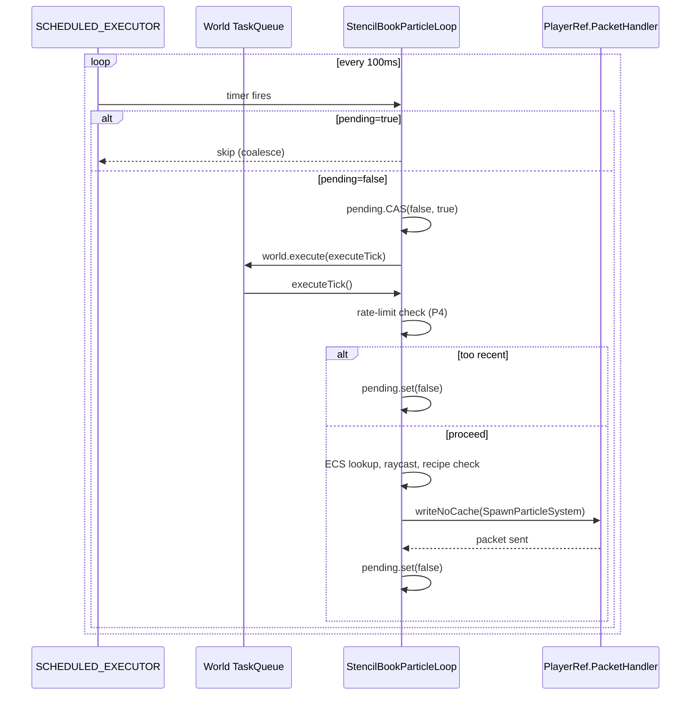

# Design: StencilBookParticleLoop Freeze Fix

## 1. Overview

`StencilBookParticleLoop` highlights blocks the player looks at while holding a Stencil Book. The current implementation spawns a full `BlockEntity` with 9 ECS components every 100ms, costing ~10–15ms per cycle. Under load (mass item pickup, affordability refresh, physics cascade), total tick time exceeds 100ms, causing the `SCHEDULED_EXECUTOR` to fire during `consumeTaskQueue()` drain, which immediately picks up the new `executeTick` task → `pending.set(false)` re-arms → livelock. Additionally, entity operations inside `consumeTaskQueue()` access the asset registry while `World.tick()` holds `AssetRegistry.ASSET_LOCK.readLock()`, risking read→write deadlock.

This design eliminates entity churn entirely by switching to fire-and-forget `SpawnParticleSystem` packets, lifecycle-manages the timer to only run when the player holds the book, keeps the existing re-entrancy guard for `restoreStencils`, and adds a self-rate-limiter as defense-in-depth against livelock.

## 2. Design Priorities

1. **Correctness** — eliminate the livelock and deadlock conditions permanently
2. **Simplicity** — minimal structural change; no new types or patterns introduced
3. **Performance** — `executeTick()` becomes a packet send (~0.1ms) instead of entity lifecycle (~10–15ms)
4. **Safety** — defense-in-depth rate limiter prevents livelock even under unforeseen conditions
5. **Testability** — packet-based approach is easier to validate (no entity state to inspect)

## 3. Component Diagram



## 4. Responsibility Map

### P1 + P4: Packet-Based Highlights with Rate Limiter



### P2 + P3: Lifecycle and Event Suppression



## 5. Sequence Diagram — Primary Runtime Flow (Post-Fix)



## 6. Package Structure

No new files. Changes are confined to existing files:

```
src/main/java/com/CodeCreature/
├── ui/stencilbook/
│   └── StencilBookParticleLoop.java   ← P1, P2, P4
├── stencil/
│   ├── StencilSyncSystem.java           ← P3 (no change — see §7)
│   └── AffordabilityCoalescer.java      ← P3 (no change — see §7)
```

## 7. Integration Changes Required

### P1: StencilBookParticleLoop.java — Replace Entity System with Packets

**Remove imports:**
- `com.hypixel.hytale.component.AddReason`
- `com.hypixel.hytale.component.Holder`
- `com.hypixel.hytale.component.Ref`
- `com.hypixel.hytale.component.RemoveReason`
- `com.hypixel.hytale.component.Store`
- `com.hypixel.hytale.math.vector.Rotation3f`
- `com.hypixel.hytale.server.core.asset.type.blocktype.config.RotationTuple`
- `com.hypixel.hytale.server.core.modules.entity.component.*` (all entity component imports)
- `com.hypixel.hytale.server.core.entity.entities.BlockEntity`
- `com.hypixel.hytale.server.core.entity.UUIDComponent`
- `com.hypixel.hytale.server.core.entity.effect.EffectControllerComponent`
- `com.hypixel.hytale.server.core.modules.entity.tracker.NetworkId`
- `com.hypixel.hytale.server.core.asset.type.entityeffect.config.*`
- `com.hypixel.hytale.server.core.universe.world.storage.EntityStore`

**Add imports:**
- `com.hypixel.hytale.protocol.packets.world.SpawnParticleSystem`
- `com.hypixel.hytale.protocol.Position`

**Remove fields:**
- `activeEntity` (`Ref<EntityStore>`)
- `EFFECT_DURATION_MILLIS` (no longer needed — particles auto-expire)

**Remove methods:**
- `spawnHighlightEntity()` — entire method (55 lines)
- `removeHighlightEntity()` — entire method (8 lines)

**Modify `executeTick()`:**
- Remove all `store.removeEntity()` / `store.addEntity()` calls
- Remove `removeHighlightEntity()` calls (replace with clearing `lastTargetBlock = null`)
- Instead of spawning entity, call new `sendHighlightPacket(target, affordable)`
- When target/affordability unchanged, still call `sendHighlightPacket()` — particle is fire-and-forget, needs periodic refresh
- Remove `activeEntity` local capture and `isValid()` checks

**Add method `sendHighlightPacket(Vector3i target, boolean affordable)`:**
- Constructs `SpawnParticleSystem` packet with:
  - `particleSystemId`: effect ID based on `ENABLE_AFFORDABILITY_CHECK` and `affordable`
  - `position`: `new Position(target.x + 0.5, target.y + 0.5, target.z + 0.5)`
  - `rotation`: `null`
  - `scale`: `1.0f`
  - `color`: `null`
- Sends via `playerRef.getPacketHandler().writeNoCache(packet)`

**Modify `shutdown()`:**
- Remove `activeEntity = null` (field no longer exists)
- Everything else stays the same — no `world.execute()` needed since particles auto-expire

### P2: StencilBookParticleLoop.java — Lifecycle-Managed Timer

**Modify `start()`:**
- Do NOT call `startUpdateLoop()` in `start()`
- Instead, the timer is started lazily when the hotbar change event detects StencilBook in active slot

**Add method `stopUpdateLoop()`:**
- Cancels `updateTask` if non-null
- Clears `lastTargetBlock`, `lastAffordable`
- Sets `updateTask = null`

**Equip/unequip detection strategy:**

The hotbar `registerChangeEvent` fires on ANY item change in the hotbar, not just active slot changes. To detect equip/unequip:

1. In `start()`, register a hotbar change listener via `hotbar.registerChangeEvent()`
2. In the listener: read `player.getInventory().getActiveHotbarSlot()` → get `hotbar.getItemStack(activeSlot)`
3. If item is StencilBook AND `updateTask == null` → call `startUpdateLoop()`
4. If item is NOT StencilBook AND `updateTask != null` → call `stopUpdateLoop()`

**Important:** The change event fires on item content changes too (e.g., stencil restoration). The listener must only compare the active slot's item ID — it must NOT read other slots or do expensive work.

**Store the `EventRegistration` handle** so it can be `.unregister()`'d in `shutdown()`.

**Modify `shutdown()`:**
- Call `stopUpdateLoop()` (if timer running)
- Unregister the hotbar change listener

### P3: StencilSyncSystem.java — Re-entrant Event Guard

> **CRITICAL FINDING:** The `ItemContainer.setItemStackForSlot(slot, stack, boolean)` 3-arg overload exists on `ItemContainer`, but the third parameter is `filter` (slot filter bypass), **NOT** event suppression. The `sendUpdate()` method always fires change events regardless of the `filter` parameter. This was verified from decompiled source:
>
> ```java
> // ItemContainer.java line 170-178
> public ItemStackSlotTransaction setItemStackForSlot(short slot, ItemStack itemStack) {
>     return this.setItemStackForSlot(slot, itemStack, true);
> }
> public ItemStackSlotTransaction setItemStackForSlot(short slot, ItemStack itemStack, boolean filter) {
>     ItemStackSlotTransaction transaction = InternalContainerUtilItemStack
>         .internal_setItemStackForSlot(this, slot, itemStack, filter);
>     this.sendUpdate(transaction);  // ALWAYS fires events
>     return transaction;
> }
> ```
>
> **Consequence: P3 as originally scoped (using 3-arg overload to suppress events) is NOT possible.** The `isRestoring` guard in `AffordabilityCoalescer` remains the **primary** mechanism for preventing re-entrant `restoreStencils()` calls. No code change is needed — the current guard already works correctly.

**Action: NO CODE CHANGE for P3.** The existing `isRestoring` guard is the correct and only mechanism. Document this finding and close P3 as "already addressed."

### P4: StencilBookParticleLoop.java — Self-Rate-Limiter

**Add field:**
- `private long lastExecuteNanos` — initialized to `0`

**Add constant:**
- `private static final long MIN_INTERVAL_NANOS = 50_000_000L` (50ms)

**Modify `executeTick()` — add at top of try block, after `if (!active) return`:**
```java
long now = System.nanoTime();
if (now - lastExecuteNanos < MIN_INTERVAL_NANOS) {
    return; // Rate-limited — skip this tick
}
lastExecuteNanos = now;
```

The `finally { pending.set(false); }` handles cleanup on skip.

## 8. Open Questions

1. **Particle visual fidelity:** `SpawnParticleSystem` sends a named particle effect at a position. The current entity-based approach renders the block's cube model with a highlight effect. The packet-based approach will show a particle effect (e.g., `Drop_Rare`) at the block center. Does this provide sufficient visual feedback? The particle won't show the block's shape — only a glowing effect at its location.

2. **Active slot detection accuracy:** The hotbar `registerChangeEvent` fires on any content change. It does NOT specifically fire on active slot changes. If the player switches active slots without changing hotbar contents (e.g., pressing 1-9), does the engine fire a change event? If not, P2's equip detection won't trigger on slot switch. **Fallback**: keep the timer always running (revert to current behavior) but with the packet-based approach from P1 + rate limiter from P4, which already eliminates the freeze.

3. **Particle refresh interval:** With entity-based highlights, the effect had a 500ms `EFFECT_DURATION_MILLIS`. With fire-and-forget packets at 100ms intervals, the client receives a new particle every 100ms. Is this visually smooth, or would 200ms be better to reduce packet volume?

## 9. Handoff Checklist

- [x] Component diagram included
- [x] Responsibility map included
- [x] All interfaces have doc contracts (inline in skeleton below)
- [x] All skeleton files created with TODO markers (below, inline — no new files)
- [x] Integration Changes Required section populated
- [x] Open Questions section populated
- [x] Task Decomposition section populated

## 10. Task Decomposition

### Wave 1 (no dependencies — can run in parallel)

#### Unit: P1 — StencilBookParticleLoop.executeTick() + sendHighlightPacket()

- **Methods**: `executeTick()` (rewrite), `sendHighlightPacket()` (new), remove `spawnHighlightEntity()`, remove `removeHighlightEntity()`
- **Contract**: `executeTick()` performs player/item/raycast checks and sends a `SpawnParticleSystem` packet instead of spawning/removing entities. `sendHighlightPacket()` constructs and sends the packet to the player.
- **Dependencies**: none
- **Done when**: `executeTick()` contains zero `store.addEntity()` / `store.removeEntity()` calls; all entity-related imports and fields are removed; `sendHighlightPacket()` sends a `SpawnParticleSystem` packet via `playerRef.getPacketHandler().writeNoCache()`; compiles clean

#### Unit: P4 — StencilBookParticleLoop rate limiter

- **Methods**: `executeTick()` (add rate-limit check at top)
- **Contract**: If `System.nanoTime() - lastExecuteNanos < 50ms`, skip work and return (pending.set(false) via finally). Prevents livelock under load.
- **Dependencies**: none (orthogonal to P1 — can be applied to current code or post-P1 code)
- **Done when**: `lastExecuteNanos` field exists; `MIN_INTERVAL_NANOS` constant exists; rate check is the first logic after `if (!active) return`; compiles clean

#### Unit: P3 — StencilSyncSystem verification (NO CODE CHANGE)

- **Methods**: none
- **Contract**: Verify that the `isRestoring` guard in `AffordabilityCoalescer` is functioning correctly. Document that the 3-arg `setItemStackForSlot(slot, stack, boolean filter)` does NOT suppress events — `filter` controls slot restriction bypass only.
- **Dependencies**: none
- **Done when**: Verified existing guard works; no code changes applied; finding documented

### Wave 2 (depends on Wave 1 P1)

#### Unit: P2 — StencilBookParticleLoop lifecycle management

- **Methods**: `start()` (modify — don't start timer), `stopUpdateLoop()` (new), `shutdown()` (modify — unregister listener), hotbar change listener (new inline lambda)
- **Contract**: Timer only runs when player holds StencilBook in active slot. Hotbar change listener detects equip/unequip and starts/stops the timer accordingly. `shutdown()` cleans up the listener registration.
- **Dependencies**: P1 must be complete first — the equip/unequip listener calls `startUpdateLoop()`/`stopUpdateLoop()` which control the packet-based tick loop
- **Done when**: Timer does not start in `start()`; hotbar listener registered; `stopUpdateLoop()` cancels timer and clears state; `shutdown()` unregisters listener; `EventRegistration` handle stored and cleaned up; compiles clean

### Wave 3 (integration — depends on Wave 2)

#### Unit: Integration validation

- **Files**: `StencilBookParticleLoop.java`, `Plugin.java`
- **Contract**: Verify full lifecycle: `Plugin.onPlayerConnect()` → `start()` → hotbar change → timer starts → player looks at block → packet sent → unequip → timer stops → `Plugin.onPlayerDisconnect()` → `remove()` → clean shutdown
- **Dependencies**: all Wave 1 + Wave 2 units
- **Done when**: Full build passes; manual test confirms: (1) no highlight when not holding book, (2) highlight appears when holding book and looking at recipe block, (3) no server freeze after breaking 20+ blocks, (4) clean disconnect/reconnect

## 11. Impact Assessment — Player-Visible Behavior Changes

| Aspect | Before | After |
|--------|--------|-------|
| Highlight visual | Block entity with cube model + effect overlay | Particle effect at block center (e.g., `Drop_Rare` glow) |
| Highlight when not holding book | Still runs (timer always active) | No highlight, no timer (P2) |
| Server cost per tick | ~10–15ms (entity spawn + remove + 9 components + tracker) | ~0.1ms (packet construction + Netty write) |
| Freeze under load | Livelock when tick > 100ms | Impossible — rate limiter + no entity ops |
| Particle persistence | Entity-based, explicitly removed | Fire-and-forget, auto-expires on client |
| Cleanup on disconnect | Fields nulled, entity may linger (non-serialized, self-expires) | Fields nulled, no entity to linger |

## 12. Skeleton Code

Below is the skeleton for the modified `StencilBookParticleLoop.java`. This is the target state after all 4 fixes are applied. Method bodies contain only `// TODO:` markers.

```java
package com.CodeCreature.ui.stencilbook;

import com.CodeCreature.crafting.RecipeAffordabilityResolver;
import com.CodeCreature.registry.BenchRecipeRegistries;
import com.CodeCreature.util.BoundingBoxRayCast;
import com.CodeCreature.util.DebugLogger;
import com.hypixel.hytale.protocol.Position;
import com.hypixel.hytale.protocol.packets.world.SpawnParticleSystem;
import com.hypixel.hytale.server.core.HytaleServer;
import com.hypixel.hytale.server.core.asset.type.blocktype.config.BlockType;
import com.hypixel.hytale.server.core.asset.type.item.config.CraftingRecipe;
import com.hypixel.hytale.server.core.entity.entities.Player;
import com.hypixel.hytale.server.core.inventory.ItemStack;
import com.hypixel.hytale.server.core.inventory.container.CombinedItemContainer;
import com.hypixel.hytale.server.core.inventory.container.ItemContainer;
import com.hypixel.hytale.server.core.universe.PlayerRef;
import com.hypixel.hytale.server.core.universe.world.World;
import com.hypixel.hytale.server.core.universe.world.storage.EntityStore;
import com.hypixel.hytale.component.Ref;
import com.hypixel.hytale.component.Store;
import com.hypixel.hytale.event.EventRegistration;

import javax.annotation.Nonnull;
import org.joml.Vector3i;

import java.util.Map;
import java.util.UUID;
import java.util.concurrent.ConcurrentHashMap;
import java.util.concurrent.ScheduledFuture;
import java.util.concurrent.TimeUnit;
import java.util.concurrent.atomic.AtomicBoolean;
import java.util.logging.Level;

import static com.CodeCreature.util.DebugLogger.Subsystem.*;

public class StencilBookParticleLoop {

    private static final long UPDATE_INTERVAL_MILLIS = 100;
    private static final String STENCIL_BOOK_ITEM_ID = "StencilBook";
    private static final String EFFECT_ID_DEFAULT = "Drop_Rare";
    private static final String EFFECT_ID_GREEN = "Drop_Uncommon";
    private static final String EFFECT_ID_RED = "BlockPlaceFail";
    private static final boolean ENABLE_AFFORDABILITY_CHECK = false;

    /** P4: Minimum interval between executeTick() runs. Prevents livelock. */
    private static final long MIN_INTERVAL_NANOS = 50_000_000L; // 50ms

    private static final Map<UUID, StencilBookParticleLoop> INSTANCES = new ConcurrentHashMap<>();

    private final PlayerRef playerRef;
    private final World world;
    private ScheduledFuture<?> updateTask;
    private Vector3i lastTargetBlock;
    private boolean lastAffordable;
    private volatile boolean active = true;
    private final AtomicBoolean pending = new AtomicBoolean(false);

    /** P4: Timestamp of last executeTick() that did real work. */
    private long lastExecuteNanos;

    /** P2: Hotbar change listener registration — unregistered on shutdown. */
    private EventRegistration<?, ?> hotbarListenerHandle;

    public StencilBookParticleLoop(@Nonnull PlayerRef playerRef, @Nonnull World world) {
        this.playerRef = playerRef;
        this.world = world;
    }

    /**
     * Creates and registers a particle loop for the given player.
     * Does NOT start the timer — the hotbar change listener (P2) starts
     * the timer when StencilBook is detected in the active slot.
     *
     * @param playerRef the player's network reference
     * @param world     the player's current world
     */
    public static void start(@Nonnull PlayerRef playerRef, @Nonnull World world) {
        // TODO: Same INSTANCES lifecycle as current code (replace stale, put new)
        // TODO: Instead of calling startUpdateLoop(), register a hotbar change
        //       listener via world.execute() that checks the active slot item.
        //       If StencilBook → startUpdateLoop(). If not → stopUpdateLoop().
        //       Store the EventRegistration handle in hotbarListenerHandle.
        // TODO: To register the listener, need Player + Inventory access.
        //       Queue a world.execute() that resolves playerRef → Player → hotbar,
        //       then registers the listener.
    }

    /**
     * Removes and shuts down the particle loop for the given player.
     *
     * @param playerId the player's UUID
     */
    public static void remove(@Nonnull UUID playerId) {
        // TODO: Same as current — INSTANCES.remove() + shutdown()
    }

    /**
     * Starts the scheduled executor timer. Called when StencilBook
     * is detected in the active hotbar slot (P2).
     * Idempotent — no-op if timer is already running.
     */
    private void startUpdateLoop() {
        // TODO: Guard: if updateTask != null, return (already running)
        // TODO: Same scheduleAtFixedRate as current code
    }

    /**
     * Stops the scheduled executor timer. Called when StencilBook
     * is unequipped from the active slot (P2).
     * Clears visual state (lastTargetBlock, lastAffordable).
     */
    private void stopUpdateLoop() {
        // TODO: Cancel updateTask if non-null, set to null
        // TODO: Clear lastTargetBlock = null, lastAffordable = false
    }

    /**
     * Runs on the world thread via world.execute(). Performs player/item checks,
     * raycasts for target block, and sends a SpawnParticleSystem packet.
     *
     * <p>P4 rate limiter: if called within MIN_INTERVAL_NANOS of the last
     * execution, skips work (pending.set(false) in finally handles cleanup).</p>
     *
     * <p>Post-P1: NO entity operations. Only reads ECS state and sends a packet.</p>
     */
    private void executeTick() {
        try {
            if (!active) { return; }

            // TODO P4: Rate limiter — check System.nanoTime() vs lastExecuteNanos.
            //          If too recent, return early (finally clears pending).

            // TODO P1: Resolve playerRef → Ref<EntityStore> → Player (same as current)
            //          If invalid → clear state, set active=false, return

            // TODO P1: Check active hotbar slot for StencilBook (same as current)
            //          If not holding → clear lastTargetBlock, return

            // TODO P1: Raycast via BoundingBoxRayCast.getTargetBlock() (same as current)
            //          If no target → clear lastTargetBlock, return

            // TODO P1: Look up BlockType, check BenchRecipeRegistries.getRecipeForBlock()
            //          If no recipe → clear lastTargetBlock, return

            // TODO P1: Resolve affordability (same as current, gated by ENABLE_AFFORDABILITY_CHECK)

            // TODO P1: Update lastTargetBlock, lastAffordable
            //          Call sendHighlightPacket(target, affordable)

        } finally {
            pending.set(false);
        }
    }

    /**
     * Constructs and sends a SpawnParticleSystem packet to the player.
     *
     * <p>Uses fire-and-forget semantics — no cleanup needed when target changes.
     * The client plays the particle animation once and it auto-expires.</p>
     *
     * <p>Packet is sent via playerRef.getPacketHandler().writeNoCache() for
     * single-player targeting (no broadcast to nearby players).</p>
     *
     * @param target    the block position to highlight (center: x+0.5, y+0.5, z+0.5)
     * @param affordable whether the recipe is affordable (determines effect ID)
     */
    private void sendHighlightPacket(@Nonnull Vector3i target, boolean affordable) {
        // TODO P1: Determine effect ID:
        //          - If !ENABLE_AFFORDABILITY_CHECK → EFFECT_ID_DEFAULT
        //          - If affordable → EFFECT_ID_GREEN
        //          - If !affordable → EFFECT_ID_RED

        // TODO P1: Construct SpawnParticleSystem:
        //          new SpawnParticleSystem(effectId,
        //              new Position(target.x + 0.5, target.y + 0.5, target.z + 0.5),
        //              null,   // rotation
        //              1.0f,   // scale
        //              null)   // color

        // TODO P1: Send via playerRef.getPacketHandler().writeNoCache(packet)
    }

    /**
     * Shuts down the particle loop. Cancels the timer, unregisters the
     * hotbar listener, and clears all state.
     *
     * <p>No world.execute() cleanup needed — particles auto-expire on client.
     * Entity cleanup is NOT required (no entities spawned post-P1).</p>
     */
    private void shutdown() {
        // TODO: Call stopUpdateLoop()
        // TODO: Unregister hotbarListenerHandle if non-null
        // TODO: Null fields, set active = false (volatile write last for memory fence)
    }
}
```

---

→ @Engineer implement [docs/design-particle-loop-freeze-fix.md](docs/design-particle-loop-freeze-fix.md)
