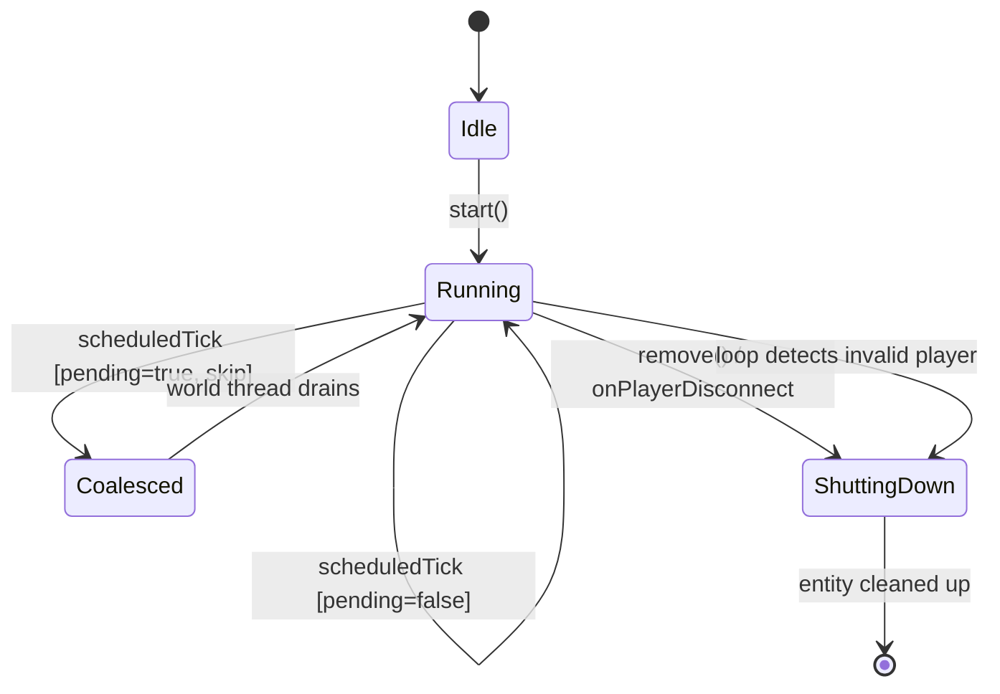
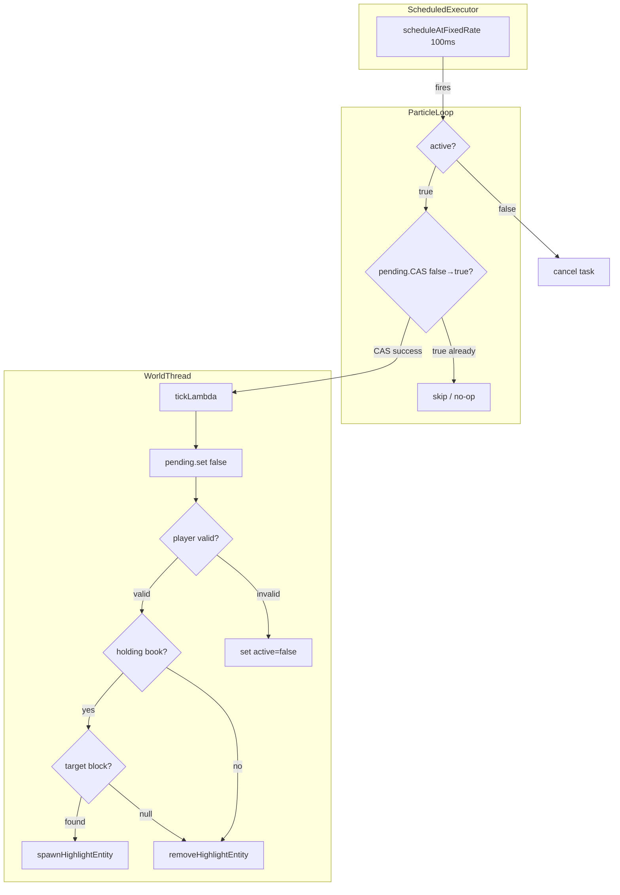

# Design: Particle Loop Queue Guard

## 1. Overview

`StencilBookParticleLoop` highlights blocks that the player is looking at when holding the Stencil Book. It uses a scheduled executor to poll every 100ms and queues work onto the world thread via `world.execute()`. The current implementation has no backpressure — when the world thread is busy, lambdas accumulate in the world's unbounded `LinkedBlockingDeque`, causing progressive server slowdown. Additionally, a race condition between the loop lambda and `onPlayerDisconnect()` leaks highlight entities.

This design applies the `AtomicBoolean pending` coalescing pattern (proven in `AffordabilityCoalescer`) to guarantee at most one `world.execute()` lambda is queued at any time, and fixes the shutdown/disconnect lifecycle to prevent entity leaks.

## 2. Design Priorities

1. **Correctness** — eliminate entity leaks and shutdown races
2. **Backpressure** — at most one `world.execute()` queued at any time
3. **Simplicity** — minimal changes; reuse proven `AtomicBoolean` pattern
4. **Visual continuity** — effect duration long enough to survive delayed ticks

## 3. Component Diagram

No new types are introduced. Changes are confined to `StencilBookParticleLoop`.



## 4. Responsibility Map



## 5. Sequence Diagram

```mermaid
sequenceDiagram
    participant SE as ScheduledExecutor
    participant Loop as ParticleLoop
    participant WT as World Thread
    participant ES as EntityStore

    Note over SE,ES: Normal Tick (pending=false)
    SE->>Loop: scheduledTick()
    Loop->>Loop: pending.compareAndSet(false, true)
    Loop->>WT: world.execute(tickLambda)
    WT->>Loop: tickLambda runs
    Loop->>Loop: pending.set(false)
    Loop->>ES: removeEntity / spawnEntity
    
    Note over SE,ES: Coalesced Tick (pending=true)
    SE->>Loop: scheduledTick()
    Loop->>Loop: pending.compareAndSet(false, true) FAILS
    Loop-->>Loop: no-op return

    Note over SE,ES: Shutdown via remove()
    SE->>Loop: scheduledTick()
    Loop->>Loop: active=false, skip
    Loop->>Loop: cancel task
    Note over Loop: onPlayerDisconnect calls remove()
    Loop->>Loop: active = false
    Loop->>Loop: cancel updateTask
    Loop->>WT: world.execute(cleanup)
    WT->>ES: removeEntity(activeEntity)
    WT->>Loop: activeEntity = null
```

## 6. Exact Changes Required

### 6.1 New Fields

| Field | Type | Purpose |
|---|---|---|
| `pending` | `AtomicBoolean` | Coalescing guard — prevents queuing more than one `world.execute()` lambda |
| `EFFECT_DURATION_MILLIS` | `long` (constant, `500`) | Longer effect duration to survive delayed ticks |

### 6.2 Remove

- Remove the `UPDATE_INTERVAL_MILLIS+1` effect duration inline literal. Replace with `EFFECT_DURATION_MILLIS`.

### 6.3 Modified Methods

#### `startUpdateLoop()`

**Before (problematic):**
```java
updateTask = HytaleServer.SCHEDULED_EXECUTOR.scheduleAtFixedRate(() -> {
    if (!active) { updateTask.cancel(false); return; }
    try {
        world.execute(() -> {
            // ... all tick logic including INSTANCES.remove() ...
        });
    } catch (Exception e) { ... }
}, UPDATE_INTERVAL_MILLIS, UPDATE_INTERVAL_MILLIS, TimeUnit.MILLISECONDS);
```

**After (fixed):**
```java
updateTask = HytaleServer.SCHEDULED_EXECUTOR.scheduleAtFixedRate(() -> {
    if (!active) { return; }  // Don't cancel here — let remove()/shutdown() own cancellation
    if (!pending.compareAndSet(false, true)) { return; }  // Already queued, coalesce
    try {
        world.execute(this::executeTick);
    } catch (Exception e) {
        pending.set(false);  // Reset on failure so next tick can retry
        DebugLogger.log(STENCIL_BOOK, Level.WARNING, "...");
    }
}, UPDATE_INTERVAL_MILLIS, UPDATE_INTERVAL_MILLIS, TimeUnit.MILLISECONDS);
```

Key changes:
1. **`pending.compareAndSet(false, true)`** — at most one lambda queued
2. **`this::executeTick`** — tick logic extracted to named method for clarity
3. **No `INSTANCES.remove()` inside the lambda** — loop only sets `active = false`
4. **No `updateTask.cancel()` inside the lambda** — `shutdown()` owns cancellation
5. **`pending.set(false)` in catch** — ensures the guard resets on `world.execute()` failure

#### New method: `executeTick()`

Extracted from the inline lambda. Runs on the world thread.

```java
private void executeTick() {
    pending.set(false);  // Clear BEFORE work, same as AffordabilityCoalescer
    if (!active) { return; }

    // ... existing tick logic (player validation, raycast, entity management) ...
    // CRITICAL CHANGE: when player is invalid, ONLY set active = false.
    // Do NOT call INSTANCES.remove() — that's remove()'s job.
    // The next scheduled tick will see active=false and no-op.
    // The disconnect handler will call remove() which calls shutdown().
}
```

#### `shutdown()`

**Before (racy):**
```java
private void shutdown() {
    if (updateTask != null) { updateTask.cancel(false); updateTask = null; }
    if (activeEntity != null) {
        world.execute(() -> {
            if (activeEntity != null && activeEntity.isValid()) {
                store.removeEntity(activeEntity, RemoveReason.REMOVE);
            }
            activeEntity = null;
        });
    }
}
```

**After (fixed):**
```java
private void shutdown() {
    active = false;  // 1. Stop tick logic from doing work
    if (updateTask != null) {
        updateTask.cancel(false);  // 2. Stop scheduling new ticks
        updateTask = null;
    }
    // 3. Clean up entity on world thread — single queued lambda
    world.execute(() -> {
        removeHighlightEntity(/* get store from playerRef or activeEntity */);
    });
}
```

Key changes:
1. **`active = false` first** — any in-flight `executeTick()` will see this and no-op
2. **Always queue cleanup** — even if `activeEntity` is currently null, a concurrent `executeTick()` might be about to set it. The cleanup lambda runs after any pending tick lambda.
3. **Uses `removeHighlightEntity()`** — single method for entity removal, avoids duplication

#### `remove(UUID)` (static)

No structural change needed. This remains the sole owner of `INSTANCES.remove()`.

#### Loop lambda player-invalid handling

**Before:**
```java
if (ref == null || !ref.isValid()) {
    removeHighlightEntity(ref != null ? ref.getStore() : null);
    active = false;
    INSTANCES.remove(playerRef.getUuid());  // BUG: races with onPlayerDisconnect
    return;
}
```

**After:**
```java
if (ref == null || !ref.isValid()) {
    removeHighlightEntity(ref != null ? ref.getStore() : null);
    active = false;  // Stop loop; disconnect handler will call remove()
    return;
}
```

Same change for the `player == null` check — remove `INSTANCES.remove()`, keep `active = false`.

#### `spawnHighlightEntity()` — effect duration

**Before:**
```java
effectCtrl.addEffect(entityRef, effect, UPDATE_INTERVAL_MILLIS+1, OverlapBehavior.EXTEND, store);
```

**After:**
```java
effectCtrl.addEffect(entityRef, effect, EFFECT_DURATION_MILLIS, OverlapBehavior.EXTEND, store);
```

Where `EFFECT_DURATION_MILLIS = 500`. This ensures the visual effect persists across delayed ticks without flickering.

## 7. Lifecycle: Start → Tick → Shutdown → Disconnect

### Happy Path
1. Player equips Stencil Book → `start(playerRef, world)` creates instance, puts in `INSTANCES`, calls `startUpdateLoop()`
2. Every 100ms, scheduled executor fires. If `pending` is false, CAS succeeds, queues `executeTick()` on world thread.
3. `executeTick()` clears `pending`, validates player, raycasts, spawns/removes highlight entity.
4. Player unequips book / closes UI → `remove(uuid)` pulls from `INSTANCES`, calls `shutdown()`.
5. `shutdown()` sets `active=false`, cancels task, queues entity cleanup on world thread.

### Disconnect Path
1. Player disconnects → `onPlayerDisconnect()` calls `remove(uuid)`.
2. `remove()` gets instance from `INSTANCES`, calls `shutdown()`.
3. If a tick lambda is in-flight on world thread, it sees `active=false` and no-ops.
4. `shutdown()`'s cleanup lambda runs after any pending tick lambda (world queue is FIFO).
5. Entity is removed. No leak.

### Player-Invalid Path (edge case)
1. Player reference becomes invalid mid-tick (server-side entity cleanup).
2. `executeTick()` detects `ref == null || !ref.isValid()`, removes entity, sets `active = false`.
3. Does NOT remove from `INSTANCES` — the disconnect handler will do that.
4. Next scheduled tick sees `active = false`, no-ops.
5. When disconnect handler eventually fires, `remove()` calls `shutdown()` (which is idempotent).

## 8. Integration Changes Required

| File | Change |
|---|---|
| `StencilBookParticleLoop.java` | All changes described above — add `pending` field, add `EFFECT_DURATION_MILLIS`, extract `executeTick()`, fix `shutdown()`, remove `INSTANCES.remove()` from loop lambda |

No other files need modification. The `start()`, `remove()`, and `onPlayerDisconnect()` call sites remain unchanged.

## 9. Open Questions

1. **Effect duration value** — 500ms is proposed. If the world thread can stall longer than 500ms under heavy load, consider 1000ms. The Engineer should test with a loaded server.
2. **Shutdown idempotency** — should `shutdown()` guard against double-call with a boolean flag, or is the current `updateTask == null` check sufficient? (Current design: `active = false` + `updateTask = null` provides adequate protection.)

## 10. Handoff Checklist

- [x] Component diagram included
- [x] Responsibility map included
- [x] All interfaces have Javadoc contracts
- [x] All skeleton files created with TODO markers
- [x] Integration Changes Required section populated
- [x] Open Questions section populated (even if empty)
- [x] Task Decomposition section populated

## 11. Task Decomposition

### Wave 1 (no dependencies — can run in parallel)

#### Unit: Add `pending` field and `EFFECT_DURATION_MILLIS` constant
- **File**: `StencilBookParticleLoop.java`
- **Changes**: Add `private final AtomicBoolean pending = new AtomicBoolean(false)` field. Add `private static final long EFFECT_DURATION_MILLIS = 500` constant. Add `import java.util.concurrent.atomic.AtomicBoolean`.
- **Contract**: New field declarations only, no behavioral changes yet.
- **Dependencies**: none
- **Done when**: File compiles with new fields unused.

### Wave 2 (depends on Wave 1)

#### Unit: Extract `executeTick()` and fix loop lambda
- **File**: `StencilBookParticleLoop.java`
- **Methods**: `executeTick()` (new), `startUpdateLoop()` (modified)
- **Contract**: `startUpdateLoop()` uses `pending.compareAndSet` guard and delegates to `executeTick()`. `executeTick()` clears `pending` first, then runs existing tick logic. Remove all `INSTANCES.remove()` calls from inside tick logic — only set `active = false`.
- **Dependencies**: Wave 1 (`pending` field must exist)
- **Done when**: Scheduled executor fires, at most one `world.execute()` is queued at any time. Loop lambda never modifies `INSTANCES`.

#### Unit: Fix `shutdown()` lifecycle ordering
- **File**: `StencilBookParticleLoop.java`
- **Methods**: `shutdown()` (modified)
- **Contract**: Sets `active = false` before cancelling task. Always queues entity cleanup on world thread regardless of current `activeEntity` state.
- **Dependencies**: Wave 1 (`active` field semantics)
- **Done when**: `shutdown()` is safe to call from any thread. Entity cleanup always runs after any pending `executeTick()`.

#### Unit: Update effect duration
- **File**: `StencilBookParticleLoop.java`
- **Methods**: `spawnHighlightEntity()` (one-line change)
- **Contract**: Replace `UPDATE_INTERVAL_MILLIS+1` with `EFFECT_DURATION_MILLIS` in `addEffect()` call.
- **Dependencies**: Wave 1 (`EFFECT_DURATION_MILLIS` constant must exist)
- **Done when**: Effect duration is 500ms instead of 101ms.

### Wave 3 (integration — depends on Wave 2)

#### Unit: Manual integration test
- **Files**: N/A (runtime testing)
- **Contract**: Verify on a loaded server: (1) no queue flooding under world thread pressure, (2) no entity leaks on disconnect, (3) no visual flickering during normal use, (4) no errors in logs during rapid equip/unequip cycles.
- **Dependencies**: All Wave 2 units
- **Done when**: All four scenarios pass without regressions.

---

→ @engineer implement docs/design-particle-loop-queue-guard.md
