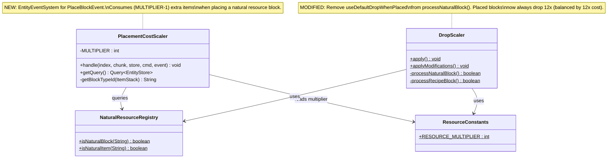
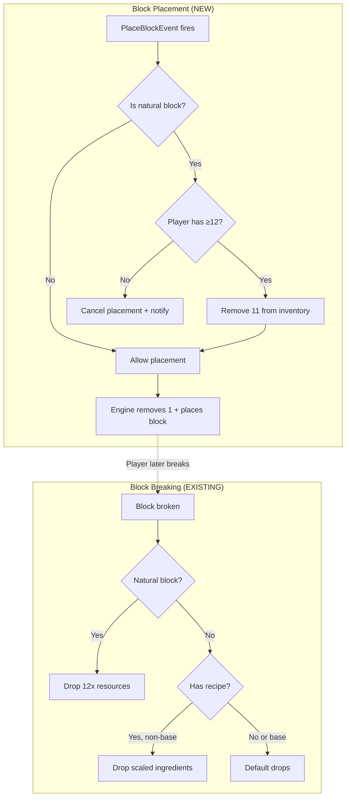
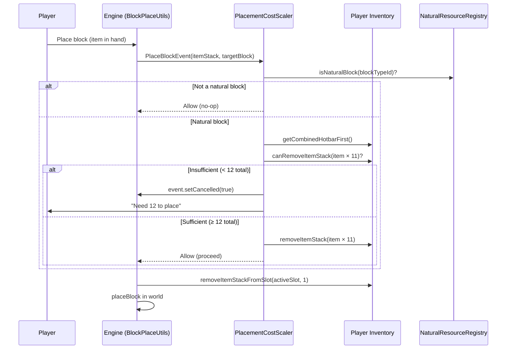

# Design: Placement Cost Scaler

### 1. Overview
Prevents infinite resource duplication by making natural block placement cost 12× items instead of 1×. This balances the 12× drop pipeline: placing a block consumes 12 internal units and breaking it returns 12, achieving net-zero. The approach replaces the unreliable `useDefaultDropWhenPlaced` flag with an active inventory enforcement system.

### 2. Design Priorities
1. **Exploit closure** — no net-positive resource loops from place+break cycles
2. **Consistency** — 12 internal units always equals 1 real block, in every direction
3. **Simplicity** — single new system, minimal changes to existing pipeline
4. **Framework-native** — uses Hytale's `EntityEventSystem<EntityStore, PlaceBlockEvent>` pattern

### 3. Component Diagram



### 4. Responsibility Map



### 5. Sequence Diagram



### 6. Package Structure

```
src/main/java/com/UnobstructedThirdPerson/resourcecollection/
├── PlacementCostScaler.java     ← NEW: EntityEventSystem for PlaceBlockEvent
├── DropScaler.java              ← MODIFIED: remove useDefaultDropWhenPlaced from natural blocks
├── NaturalResourceRegistry.java ← UNCHANGED
├── ResourceConstants.java       ← UNCHANGED
├── AssetFieldAccessor.java      ← UNCHANGED
├── BenchRecipeRegistries.java   ← UNCHANGED
└── BenchRecipeRegistry.java     ← UNCHANGED

src/main/java/com/UnobstructedThirdPersonPlugin.java
└── MODIFIED: register PlacementCostScaler via getEntityStoreRegistry()
```

### 7. Integration Changes Required

| File | Change | Reason |
|------|--------|--------|
| `DropScaler.java` | Remove `f.gatheringUseDefaultDrop.setBoolean(gathering, true)` from `processNaturalBlock()` | Placed natural blocks should now drop 12× (balanced by 12× placement cost). The flag would cause placed blocks to drop only 1×, which is wrong in the new economy. |
| `UnobstructedThirdPersonPlugin.java` | Add `this.getEntityStoreRegistry().registerSystem(new PlacementCostScaler())` in `setup()` | Register the new system with the ECS. |
| `ResourceScalingIntegrationTest.java` | Update `PlacedBlockBehavior` tests — placed natural blocks should now drop 12× instead of having `useDefaultDropWhenPlaced=true` | Reflects the new economy model. |

### 8. Open Questions

1. **Insufficient inventory UX**: When a player has 1-11 of a natural item, should they see a chat message ("Need 12 Rock_Stone to place") or a notification toast? Current design uses `PlayerRef.sendMessage()`.

2. **Creative mode bypass**: Should Creative mode players be exempt from the 12× cost? The engine's own item consumption is skipped in Creative (`isAdventureMode` check in `BlockPlaceUtils`). If we skip our 11× removal too, Creative placement is unaffected. Recommend: yes, bypass in Creative.

3. **Edge case — items across slots**: Player has 7 in hotbar slot and 5 in storage. `CombinedItemContainer.removeItemStack()` with quantity 11 should handle cross-slot removal (engine implementation traverses all slots). Needs runtime verification.

4. **NaturalResourceRegistry availability at runtime**: The registry is populated during `DropScaler.apply()` at `LoadAssetEvent` time. `PlaceBlockEvent` fires at runtime. The registry data persists as a static `Set<String>`, so it will be available. No timing issue.
