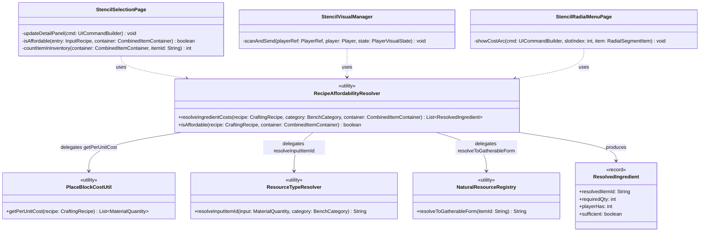
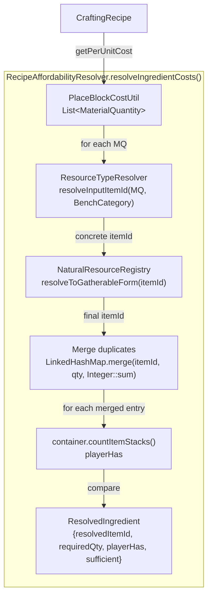
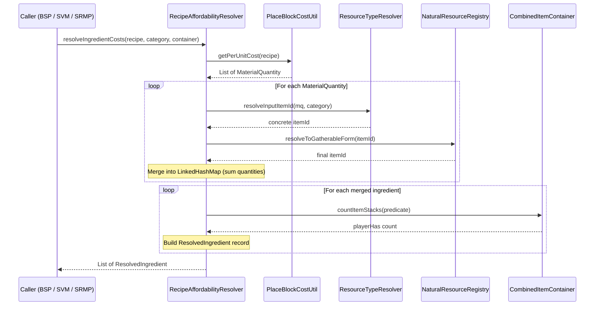

# Design: Recipe Affordability Resolver

## 1. Overview

RecipeAffordabilityResolver is a stateless utility that consolidates the duplicated 3-step ingredient resolution chain (`PlaceBlockCostUtil.getPerUnitCost()` → `ResourceTypeResolver.resolveInputItemId()` → `NaturalResourceRegistry.resolveToGatherableForm()`) and per-ingredient affordability checking into a single source of truth. It has **no UI dependencies** — no `UICommandBuilder`, `Value`, or `AffordabilityMode` — so it can be used from both UI pages (StencilSelectionPage, StencilRadialMenuPage) and non-UI systems (StencilVisualManager).

## 2. Design Priorities

1. **No UI coupling** — usable from StencilVisualManager's packet-level system that has no page context
2. **Single source of truth** — eliminate the 3 independent implementations of ingredient resolution + affordability
3. **Simplicity** — stateless utility with static methods; no builder, no interface, no DI
4. **Backward compatibility** — existing behavior unchanged; callers migrate incrementally

## 3. Component Diagram



## 4. Responsibility Map



## 5. Sequence Diagram



## 6. Package Structure

```
src/main/java/com/UnobstructedThirdPerson/placeblock/
├── PlaceBlockCostUtil.java                    (existing — unchanged)
├── RecipeAffordabilityResolver.java           (NEW — skeleton)
├── ResolvedIngredient.java                    (NEW — record)
└── ui/
    └── StencilSelectionPage.java            (existing — migration target)

src/main/java/com/UnobstructedThirdPerson/stencil/
├── StencilVisualManager.java                  (existing — migration target)
└── StencilRadialMenuPage.java                 (existing — migration target)

src/main/resources/Common/UI/Custom/Pages/StencilRadial/
└── StencilRadialCostSlot.ui                   (existing — add #CostDim overlay)
```

## 7. Integration Changes Required

### 7A. StencilRadialCostSlot.ui — Add Affordability Overlay

**Current** (no affordability feedback):
```
Group {
    Anchor: (Width: 64, Height: 64, Left: 8, Top: 0);
    Background: #0d1520(0.85);
    ItemIcon #CostIcon {
        Anchor: (Full: 4);
        ShowItemTooltip: false;
    }

    Label #CostQty {
        Text: "";
        Anchor: (Width: 32, Height: 14, Left: 32, Top: 49);
        Style: (FontSize: 11, TextColor: #ffcc00, ...);
    }
}
```

**After** (add `#CostDim` overlay, same pattern as CostCell.ui):
```
Group {
    Anchor: (Width: 64, Height: 64, Left: 8, Top: 0);
    Background: #0d1520(0.85);
    ItemIcon #CostIcon {
        Anchor: (Full: 4);
        ShowItemTooltip: false;
    }

    // Affordability dim overlay — toggled by server via #CostSlots[j] #CostDim.Visible
    Group #CostDim {
        Anchor: (Full: 2);
        Background: #000000(0.5);
        Visible: false;
    }

    Label #CostQty {
        Text: "";
        Anchor: (Width: 32, Height: 14, Left: 32, Top: 49);
        Style: (FontSize: 11, TextColor: #ffcc00, ...);
    }
}
```

### 7B. StencilRadialMenuPage.java — Value.ref Constants

Add two `Value.ref()` constants for cost quantity style swapping. These reference `StencilBookStyles.ui` which already defines the needed styles:

```java
// Per-ingredient cost affordability (reuses StencilBook styles)
private static final Value<String> COST_QTY_NORMAL =
        Value.ref("Pages/StencilBook/StencilBookStyles.ui", "CostQuantityStyle");
private static final Value<String> COST_QTY_INSUFFICIENT =
        Value.ref("Pages/StencilBook/StencilBookStyles.ui", "CostQuantityInsufficientStyle");
```

### 7C. StencilRadialMenuPage.java — showCostArc Signature

`showCostArc()` currently receives `(UICommandBuilder cmd, int slotIndex, RadialSegmentItem item)`.

It needs to obtain a `CombinedItemContainer` to pass to `RecipeAffordabilityResolver`. The `handleDataEvent` method has access to `Store<EntityStore> store` and `Ref<EntityStore> ref`. Two options:

**Option A (recommended):** Store `ref` and `store` as fields (same pattern as `StencilSelectionPage.playerRef_ref` / `playerStore`), then access the container inside `showCostArc`:
```java
Player player = playerStore.getComponent(playerRef_ref, Player.getComponentType());
CombinedItemContainer container = player.getInventory().getCombinedBackpackStorageHotbar();
```

**Option B:** Pass `store` and `ref` down into `showCostArc` as parameters.

**Recommendation:** Option A — store as fields. The `build()` method already receives `Ref<EntityStore> ref` and `Store<EntityStore> store`, so capture them there (same pattern as StencilSelectionPage lines 95-96). This avoids threading extra params through `handleDataEvent` → `showCostArc`.

### 7D. StencilRadialMenuPage.java — Field Additions

```java
// Stored during build() for inventory access in showCostArc()
private Ref<EntityStore> playerRef_ref;
private Store<EntityStore> playerStore;
```

Capture in `build()`:
```java
this.playerRef_ref = ref;
this.playerStore = store;
```

## 8. Caller Migration Plan

### Consumer 1: StencilSelectionPage.updateDetailPanel()

**Before** ([StencilSelectionPage.java#L790-L830](src/main/java/com/UnobstructedThirdPerson/placeblock/ui/StencilSelectionPage.java#L790-L830)):
```java
CraftingRecipe recipe = CraftingRecipe.getAssetMap().getAsset(entry.recipeId);
if (recipe != null) {
    List<MaterialQuantity> perUnitInputs = PlaceBlockCostUtil.getPerUnitCost(recipe);
    if (!perUnitInputs.isEmpty()) {
        FilteredRecipeEntry fe = RecipeFilterRegistry.getEntry(entry.recipeId);
        BenchCategory category = fe != null ? fe.benchCategory() : BenchCategory.BUILDERS_ONLY;

        Map<String, Integer> ingredientMap = new LinkedHashMap<>();
        for (MaterialQuantity mq : perUnitInputs) {
            if (mq == null) continue;
            String itemId = ResourceTypeResolver.resolveInputItemId(mq, category);
            if (itemId == null || itemId.isEmpty()) continue;
            itemId = NaturalResourceRegistry.resolveToGatherableForm(itemId);
            ingredientMap.merge(itemId, mq.getQuantity(), Integer::sum);
        }

        for (var e : ingredientMap.entrySet()) {
            if (costIdx >= MAX_COST_CELLS) break;
            String itemId = e.getKey();
            int requiredQty = e.getValue();
            int playerHas = countItemInInventory(container, itemId);
            boolean sufficient = playerHas >= requiredQty;
            // ... UI commands ...
        }
    }
}
```

**After**:
```java
CraftingRecipe recipe = CraftingRecipe.getAssetMap().getAsset(entry.recipeId);
if (recipe != null) {
    FilteredRecipeEntry fe = RecipeFilterRegistry.getEntry(entry.recipeId);
    BenchCategory category = fe != null ? fe.benchCategory() : BenchCategory.BUILDERS_ONLY;

    List<ResolvedIngredient> ingredients =
        RecipeAffordabilityResolver.resolveIngredientCosts(recipe, category, container);

    for (ResolvedIngredient ing : ingredients) {
        if (costIdx >= MAX_COST_CELLS) break;
        if (!ing.sufficient()) allAffordable = false;
        // ... UI commands using ing.resolvedItemId(), ing.requiredQty(), ing.sufficient() ...
        costIdx++;
    }
}
```

**What gets deleted from StencilSelectionPage**:
- `import com.UnobstructedThirdPerson.resourcecollection.ResourceTypeResolver;`
- `import com.UnobstructedThirdPerson.resourcecollection.NaturalResourceRegistry;`
- `private int countItemInInventory(...)` method (L1021-L1024)
- Inline resolution chain in `updateDetailPanel()` (the `ingredientMap` construction loop)

**What stays**: `isAffordable()` method (L1026-L1053) — it has BlockGroup interchangeability logic that the resolver intentionally does NOT absorb. The `isAffordable()` method is used by `RecipeFilterPipeline` for grid-level filtering, which is a different concern.

---

### Consumer 2: StencilVisualManager.scanAndSend()

**Before** ([StencilVisualManager.java#L240-L260](src/main/java/com/UnobstructedThirdPerson/stencil/StencilVisualManager.java#L240-L260)):
```java
CraftingRecipe recipe = CraftingRecipe.getAssetMap().getAsset(recipeId);
if (recipe == null) continue;

List<MaterialQuantity> materials = PlaceBlockCostUtil.getPerUnitCost(recipe);
boolean affordable = materials.isEmpty() || container.canRemoveMaterials(materials);
```

**After**:
```java
CraftingRecipe recipe = CraftingRecipe.getAssetMap().getAsset(recipeId);
if (recipe == null) continue;

boolean affordable = RecipeAffordabilityResolver.isAffordable(recipe, container);
```

**What gets deleted from StencilVisualManager**:
- `import com.UnobstructedThirdPerson.placeblock.PlaceBlockCostUtil;` (replaced by `import com.UnobstructedThirdPerson.placeblock.RecipeAffordabilityResolver;`)
- Direct `PlaceBlockCostUtil.getPerUnitCost()` + `canRemoveMaterials()` inline check

---

### Consumer 3: StencilRadialMenuPage.showCostArc()

**Before** ([StencilRadialMenuPage.java#L358-L395](src/main/java/com/UnobstructedThirdPerson/stencil/StencilRadialMenuPage.java#L358-L395)):
```java
List<MaterialQuantity> costs = PlaceBlockCostUtil.getPerUnitCost(recipe);
// ... position loop ...
MaterialQuantity mq = costs.get(j);
String itemId = ResourceTypeResolver.resolveInputItemId(mq, category);
if (itemId != null && !itemId.isEmpty()) {
    itemId = NaturalResourceRegistry.resolveToGatherableForm(itemId);
} else {
    itemId = "";
}
String costName = itemId.replace('_', ' ');
cmd.set("#CostSlots[" + j + "] #CostIcon.ItemId", itemId);
cmd.set("#CostSlots[" + j + "] #CostQty.Text", "x" + mq.getQuantity());
cmd.set("#CostSlots[" + j + "] #CostName.Text", costName);
cmd.set("#CostSlots[" + j + "].Visible", true);
```

**After** (with affordability feedback):
```java
Player player = playerStore != null
    ? playerStore.getComponent(playerRef_ref, Player.getComponentType()) : null;
CombinedItemContainer container = player != null
    ? player.getInventory().getCombinedBackpackStorageHotbar() : null;

List<ResolvedIngredient> ingredients =
    RecipeAffordabilityResolver.resolveIngredientCosts(recipe, category, container);
int count = Math.min(ingredients.size(), MAX_COST_SLOTS);
// ... position loop uses ingredients.size() instead of costs.size() ...
ResolvedIngredient ing = ingredients.get(j);
String costName = ing.resolvedItemId().replace('_', ' ');
cmd.set("#CostSlots[" + j + "] #CostIcon.ItemId", ing.resolvedItemId());
cmd.set("#CostSlots[" + j + "] #CostQty.Text", "x" + ing.requiredQty());
cmd.set("#CostSlots[" + j + "] #CostName.Text", costName);
cmd.set("#CostSlots[" + j + "] #CostDim.Visible", !ing.sufficient());
cmd.set("#CostSlots[" + j + "] #CostQty.Style", ing.sufficient() ? COST_QTY_NORMAL : COST_QTY_INSUFFICIENT);
cmd.set("#CostSlots[" + j + "].Visible", true);
```

**What gets deleted from StencilRadialMenuPage**:
- `import com.UnobstructedThirdPerson.placeblock.PlaceBlockCostUtil;`
- `import com.UnobstructedThirdPerson.resourcecollection.ResourceTypeResolver;`
- `import com.UnobstructedThirdPerson.resourcecollection.NaturalResourceRegistry;`
- Inline resolution chain in `showCostArc()` (the `resolveInputItemId` → `resolveToGatherableForm` code)

**What gets added to StencilRadialMenuPage**:
- `import com.UnobstructedThirdPerson.placeblock.RecipeAffordabilityResolver;`
- `import com.UnobstructedThirdPerson.placeblock.ResolvedIngredient;`
- `Value.ref()` constants: `COST_QTY_NORMAL`, `COST_QTY_INSUFFICIENT`
- Fields: `playerRef_ref`, `playerStore` (captured in `build()`)
- `hideCostArc()` must also reset `#CostDim.Visible` and `#CostQty.Style` per slot

## 9. Open Questions

1. **BlockGroup interchangeability in resolver?** — `StencilSelectionPage.isAffordable()` checks BlockGroup member interchangeability as a fallback. `StencilVisualManager` does not. The resolver's `isAffordable()` currently does NOT include BlockGroup logic (matching StencilVisualManager's simpler check). Should a second overload be provided, or should BlockGroup checking remain in `StencilSelectionPage.isAffordable()` only? **Current answer:** Keep it out of the resolver; `isAffordable()` on the resolver does the simple `canRemoveMaterials` check, and `StencilSelectionPage` keeps its own extended `isAffordable()` for the filter pipeline.

2. **`hideCostArc()` reset** — When the user unhovers, should the dim/style state be explicitly reset per slot, or is hiding the slot sufficient? **Current answer:** Hiding is sufficient — styles only matter while visible. But if Hytale caches style state across visibility toggles, explicit reset may be needed. Verify during implementation.

## 10. Handoff Checklist

- [x] Component diagram included
- [x] Responsibility map included
- [x] All interfaces have Javadoc contracts
- [x] All skeleton files created with TODO markers
- [x] Integration Changes Required section populated
- [x] Open Questions section populated (even if empty)
- [x] Task Decomposition section populated

## 11. Task Decomposition

### Wave 1 (no dependencies — can run in parallel)

#### Unit: ResolvedIngredient.java
- **Methods**: record constructor (auto-generated)
- **Contract**: Immutable data record holding per-ingredient resolution results with affordability
- **Dependencies**: none
- **Done when**: Record compiles with all four fields (`resolvedItemId`, `requiredQty`, `playerHas`, `sufficient`)

#### Unit: StencilRadialCostSlot.ui
- **Methods**: n/a (template modification)
- **Contract**: Add `#CostDim` overlay group between `#CostIcon` and `#CostQty`, matching CostCell.ui's pattern
- **Dependencies**: none
- **Done when**: `#CostDim` element exists with `Background: #000000(0.5)` and `Visible: false`

### Wave 2 (depends on Wave 1: ResolvedIngredient)

#### Unit: RecipeAffordabilityResolver.java
- **Methods**: `resolveIngredientCosts()`, `isAffordable()`
- **Contract**: Stateless utility that runs the 3-step resolution chain, merges duplicates, and checks per-ingredient affordability against a container
- **Dependencies**: ResolvedIngredient (Wave 1)
- **Done when**: Both methods compile, `resolveIngredientCosts` returns merged `List<ResolvedIngredient>`, `isAffordable` delegates to `resolveIngredientCosts` and returns `allMatch(sufficient)`

### Wave 3 (depends on Wave 2 — caller migrations, can run in parallel)

#### Unit: StencilSelectionPage migration
- **Files**: `StencilSelectionPage.java`
- **Methods**: `updateDetailPanel()` refactored to use `resolveIngredientCosts()`
- **Contract**: Replace inline resolution chain with resolver call; keep `isAffordable()` for BlockGroup logic
- **Dependencies**: RecipeAffordabilityResolver (Wave 2)
- **Done when**: `updateDetailPanel()` uses `RecipeAffordabilityResolver.resolveIngredientCosts()`, removed imports for `ResourceTypeResolver`/`NaturalResourceRegistry`, removed `countItemInInventory()`, visual output identical

#### Unit: StencilVisualManager migration
- **Files**: `StencilVisualManager.java`
- **Methods**: `scanAndSend()` refactored to use `isAffordable()`
- **Contract**: Replace `PlaceBlockCostUtil.getPerUnitCost()` + `canRemoveMaterials()` with single `RecipeAffordabilityResolver.isAffordable()` call
- **Dependencies**: RecipeAffordabilityResolver (Wave 2)
- **Done when**: `scanAndSend()` uses `RecipeAffordabilityResolver.isAffordable()`, removed `PlaceBlockCostUtil` import, affordability glow behavior identical

#### Unit: StencilRadialMenuPage affordability wiring
- **Files**: `StencilRadialMenuPage.java`
- **Methods**: `showCostArc()`, `hideCostArc()`, `build()`, field additions
- **Contract**: showCostArc uses resolver for ingredient data + affordability, applies dim/style feedback per slot
- **Dependencies**: RecipeAffordabilityResolver (Wave 2), StencilRadialCostSlot.ui (Wave 1)
- **Done when**: Cost slots show `#CostDim` overlay for insufficient ingredients, quantity text swaps to red, `playerRef_ref`/`playerStore` captured in `build()`

### Wave 4 (integration verification — depends on Wave 3)

#### Unit: Integration verification
- **Files**: All modified files
- **Contract**: Full build passes, all three subsystems render affordability identically to before (StencilBook, hotbar glow) plus new radial menu affordability feedback
- **Dependencies**: All Wave 3 units
- **Done when**: `gradle build` succeeds, manual verification of all three affordability paths

---

→ Skeleton files: [RecipeAffordabilityResolver.java](../src/main/java/com/UnobstructedThirdPerson/placeblock/RecipeAffordabilityResolver.java), [ResolvedIngredient.java](../src/main/java/com/UnobstructedThirdPerson/placeblock/ResolvedIngredient.java)

→ @Engineer implement docs/design-recipe-affordability-resolver.md
