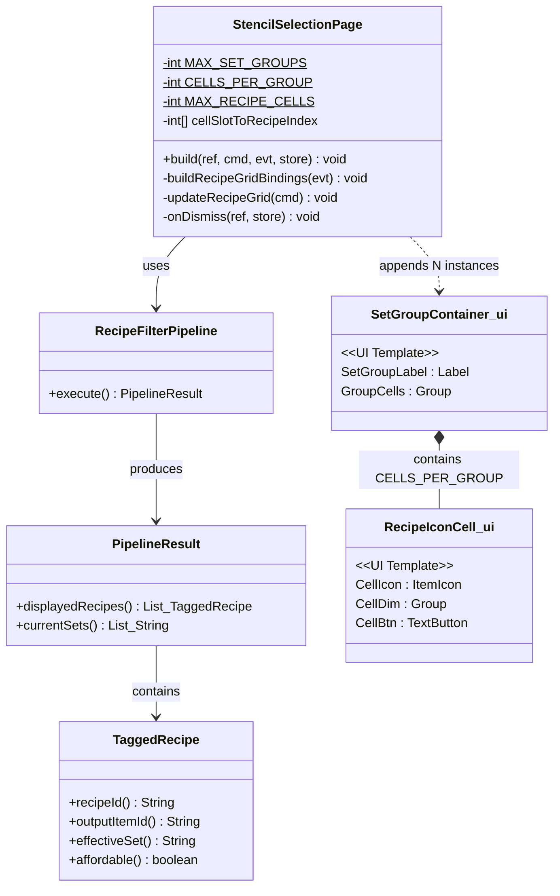
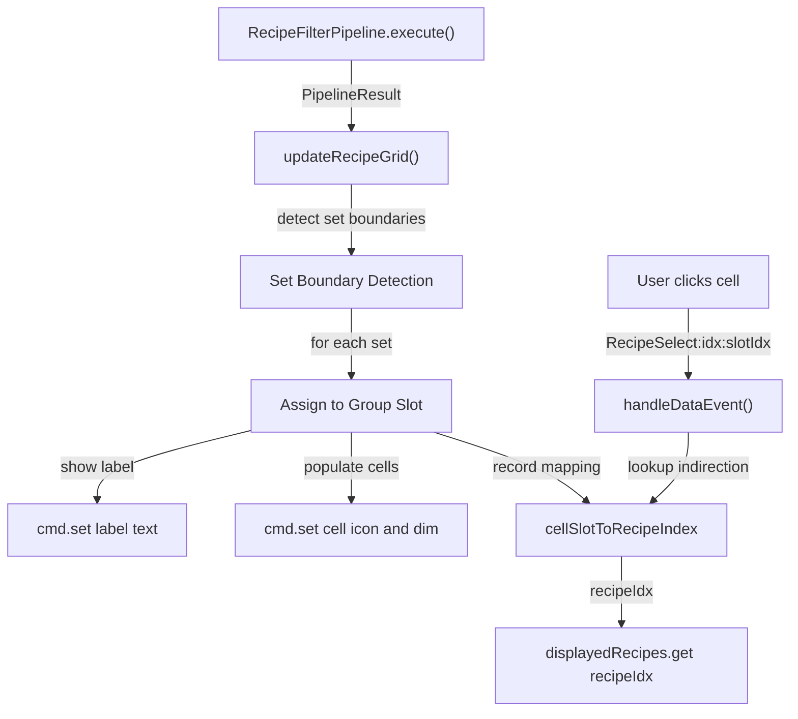
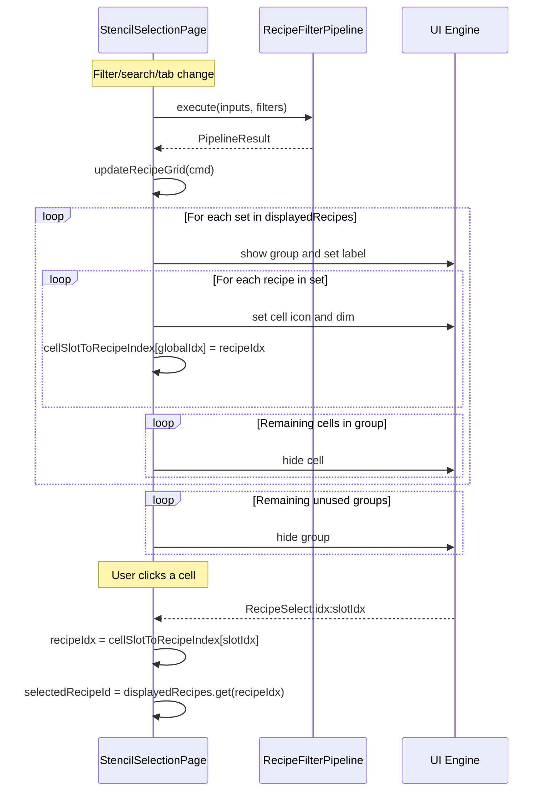

# Design: Recipe Grid Set-Based Grouping

## 1. Overview

Restructure the Stencil Crafting recipe grid from a flat `LeftCenterWrap` cell pool into per-set vertical groups, each headed by a static text label (e.g., "Ancient", "Kweebec", "Stone"). The design preserves the build-once / update-via-`cmd.set()` pattern and the `RecipeSelect:idx:i` event format by adding a lightweight **cell-slot-to-recipe indirection map**.

## 2. Design Priorities

1. **Framework-native patterns** — stay within the build-once / `cmd.set()`-only update model
2. **Simplicity** — minimal new abstractions; one new UI template, one new field, modified methods
3. **Backward compatibility** — `RecipeSelect:idx:i` event payload format preserved; handler change is additive
4. **Testability** — indirection map is a simple `int[]` that can be unit-tested independently

## 3. Component Diagram



## 4. Responsibility Map



## 5. Sequence Diagram



## 6. Package Structure

```
src/main/resources/Common/UI/Custom/Pages/StencilBook/
├── StencilBookPage.ui          ← MODIFIED: #RecipeGrid → #RecipeGridArea (Top layout)
├── RecipeIconCell.ui              ← UNCHANGED
├── SetGroupContainer.ui           ← NEW: per-set group with label + wrapping cell grid
├── SetFilterButton.ui             ← UNCHANGED
├── GroupFilterButton.ui           ← UNCHANGED
└── CostCell.ui                    ← UNCHANGED

src/main/java/com/UnobstructedThirdPerson/placeblock/ui/
├── StencilSelectionPage.java    ← MODIFIED: grouped build/update/binding/dismiss
└── RecipeFilterPipeline.java      ← UNCHANGED
```

## 7. Integration Changes Required

### 7.1 StencilBookPage.ui (lines 193–207)

**Current** — flat wrapping grid:
```ui
Group {
    FlexWeight: 1;
    LayoutMode: TopScrolling;
    ScrollbarStyle: $C.@DefaultScrollbarStyle;
    Padding: (Left: 8);

    Group #RecipeGrid {
        LayoutMode: LeftCenterWrap;
    }
}
```

**New** — vertical stack of per-set groups:
```ui
Group {
    FlexWeight: 1;
    LayoutMode: TopScrolling;
    ScrollbarStyle: $C.@DefaultScrollbarStyle;
    Padding: (Left: 8);

    Group #RecipeGridArea {
        LayoutMode: Top;
    }
}
```

The only .ui change is renaming `#RecipeGrid` to `#RecipeGridArea` and switching `LayoutMode` from `LeftCenterWrap` to `Top`. All grouping and cell structure is built server-side by appending `SetGroupContainer.ui` templates.

### 7.2 StencilSelectionPage.java — Constants

**Replace:**
```java
private static final int MAX_RECIPE_CELLS = 81;  // 9 columns × 9 rows
```

**With:**
```java
private static final int MAX_SET_GROUPS = 20;      // matches MAX_SET_FILTERS
private static final int CELLS_PER_GROUP = 9;       // one row of 9 columns per group
private static final int MAX_RECIPE_CELLS = MAX_SET_GROUPS * CELLS_PER_GROUP;  // 180
```

### 7.3 StencilSelectionPage.java — New Field

**Add:**
```java
/** Maps cell slot index (0..MAX_RECIPE_CELLS-1) to displayedRecipes index. -1 = unused. */
private final int[] cellSlotToRecipeIndex = new int[MAX_RECIPE_CELLS];
```

### 7.4 StencilSelectionPage.java — build() Recipe Grid Section

**Replace** the recipe cell append block:
```java
// Recipe icon cells
for (int i = 0; i < MAX_RECIPE_CELLS; i++) {
    cmd.append("#RecipeGrid", "Pages/StencilBook/RecipeIconCell.ui");
}
```

**With:**
```java
// Per-set group containers (each contains a label + wrapping cell grid)
for (int g = 0; g < MAX_SET_GROUPS; g++) {
    cmd.append("#RecipeGridArea", "Pages/StencilBook/SetGroupContainer.ui");
    // Append recipe cells into each group's #GroupCells container
    for (int c = 0; c < CELLS_PER_GROUP; c++) {
        cmd.append("#RecipeGridArea[" + g + "] #GroupCells",
                   "Pages/StencilBook/RecipeIconCell.ui");
    }
}
```

### 7.5 StencilSelectionPage.java — buildRecipeGridBindings()

**Replace:**
```java
private void buildRecipeGridBindings(UIEventBuilder evt) {
    for (int i = 0; i < MAX_RECIPE_CELLS; i++) {
        evt.addEventBinding(CustomUIEventBindingType.Activating,
                "#RecipeGrid[" + i + "] #CellBtn",
                EventData.of("Action", "RecipeSelect:idx:" + i));
    }
}
```

**With:**
```java
private void buildRecipeGridBindings(UIEventBuilder evt) {
    int flatIdx = 0;
    for (int g = 0; g < MAX_SET_GROUPS; g++) {
        for (int c = 0; c < CELLS_PER_GROUP; c++) {
            evt.addEventBinding(CustomUIEventBindingType.Activating,
                    "#RecipeGridArea[" + g + "] #GroupCells[" + c + "] #CellBtn",
                    EventData.of("Action", "RecipeSelect:idx:" + flatIdx));
            flatIdx++;
        }
    }
}
```

The event payload `RecipeSelect:idx:N` is preserved. `N` is now a **cell slot index** (not a direct recipe index) — the handler uses `cellSlotToRecipeIndex[N]` to resolve the actual recipe.

### 7.6 StencilSelectionPage.java — updateRecipeGrid()

**Replace** the current flat iteration with grouped assignment logic:

```java
private void updateRecipeGrid(UICommandBuilder cmd) {
    // Reset indirection map
    Arrays.fill(cellSlotToRecipeIndex, -1);

    // Walk displayedRecipes (sorted by effectiveSet) and detect set boundaries
    int groupIdx = -1;
    int cellInGroup = 0;
    String currentSet = null;

    for (int recipeIdx = 0; recipeIdx < displayedRecipes.size(); recipeIdx++) {
        RecipeFilterPipeline.TaggedRecipe entry = displayedRecipes.get(recipeIdx);

        // Set boundary → advance to next group
        if (!entry.effectiveSet().equals(currentSet)) {
            // Hide remaining cells in the previous group
            if (groupIdx >= 0) {
                hideRemainingCells(cmd, groupIdx, cellInGroup);
            }
            groupIdx++;
            if (groupIdx >= MAX_SET_GROUPS) break;  // overflow — no more group slots

            currentSet = entry.effectiveSet();
            cellInGroup = 0;

            // Show group and set its label
            String groupSel = "#RecipeGridArea[" + groupIdx + "]";
            cmd.set(groupSel + ".Visible", true);
            cmd.set(groupSel + " #SetGroupLabel.Text",
                    RecipeFilterPipeline.setDisplayLabel(currentSet));
        }

        // Overflow within group — skip recipe (no cell slot available)
        if (cellInGroup >= CELLS_PER_GROUP) continue;

        // Populate cell
        int globalIdx = groupIdx * CELLS_PER_GROUP + cellInGroup;
        String cellSel = "#RecipeGridArea[" + groupIdx + "] #GroupCells[" + cellInGroup + "]";
        cmd.set(cellSel + ".Visible", true);
        cmd.set(cellSel + " #CellIcon.ItemId", entry.outputItemId());
        cmd.set(cellSel + " #CellDim.Visible", !entry.affordable());

        cellSlotToRecipeIndex[globalIdx] = recipeIdx;
        cellInGroup++;
    }

    // Hide remaining cells in the last populated group
    if (groupIdx >= 0) {
        hideRemainingCells(cmd, groupIdx, cellInGroup);
    }

    // Hide all unused groups
    for (int g = groupIdx + 1; g < MAX_SET_GROUPS; g++) {
        cmd.set("#RecipeGridArea[" + g + "].Visible", false);
    }
}

/** Hide cells [startCell..CELLS_PER_GROUP) in the given group. */
private void hideRemainingCells(UICommandBuilder cmd, int groupIdx, int startCell) {
    for (int c = startCell; c < CELLS_PER_GROUP; c++) {
        cmd.set("#RecipeGridArea[" + groupIdx + "] #GroupCells[" + c + "].Visible", false);
    }
}
```

### 7.7 StencilSelectionPage.java — onDismiss()

**Replace:**
```java
for (int i = 0; i < MAX_RECIPE_CELLS; i++) {
    cmd.set("#RecipeGrid[" + i + "].Visible", false);
}
```

**With:**
```java
for (int g = 0; g < MAX_SET_GROUPS; g++) {
    cmd.set("#RecipeGridArea[" + g + "].Visible", false);
}
```

Hiding the group container hides all its children (label + cells), so per-cell cleanup is unnecessary.

### 7.8 StencilSelectionPage.java — RecipeSelect Handler

**Replace:**
```java
} else if (data.action != null && data.action.startsWith("RecipeSelect:idx:")) {
    int idx = -1;
    try { idx = Integer.parseInt(data.action.substring("RecipeSelect:idx:".length())); } catch (NumberFormatException ignored) {}
    if (idx >= 0 && idx < displayedRecipes.size()) {
        RecipeFilterPipeline.TaggedRecipe entry = displayedRecipes.get(idx);
        this.selectedRecipeId = entry.recipeId();
```

**With:**
```java
} else if (data.action != null && data.action.startsWith("RecipeSelect:idx:")) {
    int slotIdx = -1;
    try { slotIdx = Integer.parseInt(data.action.substring("RecipeSelect:idx:".length())); } catch (NumberFormatException ignored) {}
    if (slotIdx >= 0 && slotIdx < MAX_RECIPE_CELLS) {
        int recipeIdx = cellSlotToRecipeIndex[slotIdx];
        if (recipeIdx >= 0 && recipeIdx < displayedRecipes.size()) {
            RecipeFilterPipeline.TaggedRecipe entry = displayedRecipes.get(recipeIdx);
            this.selectedRecipeId = entry.recipeId();
```

## 8. Key Design Decision: Addressing Strategy

**Chosen: Option B — Nested selectors with indirection map**

| Option | Approach | Verdict |
|--------|----------|---------|
| **A** — Parallel flat array | Hidden flat `#RecipeGrid` for events + visible grouped layout | Doubles UI elements, sync complexity |
| **B** — Nested selectors | `#RecipeGridArea[g] #GroupCells[c] #CellBtn` with `cellSlotToRecipeIndex` | **Selected** — clean grouping, minimal overhead |
| **C** — Interleaved labels in flat container | Labels and cells as siblings in one `LeftCenterWrap` | Breaks wrapping — labels need `Top` layout, cells need `LeftCenterWrap` |

**Why Option B:**
- Matches the existing pattern used by `#MaterialGroups[i] #GroupBtn` (nested ID + index selectors)
- Each group is a self-contained container that can be shown/hidden atomically
- The `int[] cellSlotToRecipeIndex` indirection is trivial (one `Arrays.fill` + assignment per cell)
- The `RecipeSelect:idx:N` event format is preserved — only the handler interpretation changes

## 9. Cell Distribution Strategy

### Recommended Configuration

| Constant | Value | Rationale |
|----------|-------|-----------|
| `MAX_SET_GROUPS` | 20 | Matches `MAX_SET_FILTERS` — every set in the sidebar can have a grid group |
| `CELLS_PER_GROUP` | 9 | One full row of the 9-column grid per group |
| `MAX_RECIPE_CELLS` | 180 | `20 × 9` — increased from 81 to accommodate per-group allocation |

### Trade-offs

- **Increase from 81 to 180 cells**: Most cells are hidden (`Visible: false`) and don't participate in layout/rendering. The engine already handles 136+ pre-allocated elements (81 cells + 21 set buttons + 26 group buttons + 8 cost cells). Adding ~100 more hidden elements should be negligible.
- **9 cells per group**: When a single set filter is active, at most 9 recipes are visible for that set. If this is too few, increase `CELLS_PER_GROUP` to 18 (2 rows) and accept `MAX_RECIPE_CELLS = 360`.
- **Overflow**: If a set has more recipes than `CELLS_PER_GROUP`, excess recipes are silently dropped from display. If more than `MAX_SET_GROUPS` distinct sets exist, excess sets get no group. Both are soft-fail (no errors, just truncation).

### Conservative Alternative (keep 81 cells)

If increasing the cell budget is unacceptable:
- `MAX_SET_GROUPS = 9`, `CELLS_PER_GROUP = 9`, `MAX_RECIPE_CELLS = 81`
- Only 9 set groups can be displayed simultaneously (the 10th+ set's recipes are hidden)
- Sufficient for most practical scenarios where ≤9 distinct sets are visible after filtering

## 10. New UI Template: SetGroupContainer.ui

```ui
// SetGroupContainer — per-set group with label header and wrapping cell grid
// Server appends CELLS_PER_GROUP RecipeIconCell.ui instances into #GroupCells during build()
// Server shows/hides the entire group and sets #SetGroupLabel.Text via cmd.set()

@SetGroupLabelStyle = LabelStyle(
    FontSize: 14, TextColor: #8b9bb5, RenderBold: true,
    HorizontalAlignment: Start, VerticalAlignment: Center
);

Group {
    LayoutMode: Top;
    Visible: false;

    Label #SetGroupLabel {
        Text: "";
        Style: @SetGroupLabelStyle;
        Anchor: (Height: 24, Left: 0, Right: 0);
        Padding: (Left: 4, Top: 4, Bottom: 2);
    }

    Group #GroupCells {
        LayoutMode: LeftCenterWrap;
    }
}
```

## 11. Open Questions

1. **Cell budget approval**: Is increasing `MAX_RECIPE_CELLS` from 81 to 180 acceptable, or should the conservative 81-cell approach (9 groups × 9 cells) be used?
2. **Label styling**: Should the set group label style (`14px, #8b9bb5, bold`) match the existing `@SectionLabelStyle` (`13px, #6e7da1`) from the sidebar, or be visually distinct as proposed?
3. **Overflow indicator**: When a set has more recipes than `CELLS_PER_GROUP`, should a "… and N more" indicator be shown, or is silent truncation acceptable?
4. **Empty set groups**: If a set has 0 recipes after filtering (e.g., affordability filter removes all), should the group header still be visible with an empty cell area, or hidden entirely? (Design assumes hidden entirely.)

## 12. Handoff Checklist

- [x] Component diagram included
- [x] Responsibility map included
- [x] All interfaces have doc-comment contracts (see §7.6 `cellSlotToRecipeIndex` javadoc, `hideRemainingCells` purpose)
- [x] All skeleton files created with TODO markers (SetGroupContainer.ui)
- [x] Integration Changes Required section populated (§7.1–§7.8)
- [x] Open Questions section populated
- [x] Task Decomposition section populated

## 13. Task Decomposition

### Wave 1 (no dependencies — can run in parallel)

#### Unit: SetGroupContainer.ui
- **File**: `src/main/resources/Common/UI/Custom/Pages/StencilBook/SetGroupContainer.ui`
- **Contract**: Static UI template defining a per-set group container with a label and a wrapping cell grid
- **Dependencies**: none
- **Done when**: File exists, renders correctly when appended by the engine

#### Unit: StencilBookPage.ui layout change
- **File**: `src/main/resources/Common/UI/Custom/Pages/StencilBook/StencilBookPage.ui`
- **Changes**: Rename `#RecipeGrid` → `#RecipeGridArea`, change `LayoutMode` from `LeftCenterWrap` to `Top`
- **Dependencies**: none
- **Done when**: The `#RecipeGridArea` container exists with `LayoutMode: Top`

### Wave 2 (depends on Wave 1)

#### Unit: StencilSelectionPage.java — constants, field, and build()
- **Methods**: Update constants (`MAX_SET_GROUPS`, `CELLS_PER_GROUP`, `MAX_RECIPE_CELLS`), add `cellSlotToRecipeIndex` field, modify `build()` to append `SetGroupContainer.ui` instances and populate each with `RecipeIconCell.ui` cells
- **Contract**: Pre-allocate the full grouped grid structure during the one-time build phase
- **Dependencies**: Wave 1 (SetGroupContainer.ui must exist, `#RecipeGridArea` ID must be in the .ui file)
- **Done when**: `build()` creates 20 groups × 9 cells = 180 pre-allocated cell slots

#### Unit: StencilSelectionPage.java — buildRecipeGridBindings()
- **Methods**: `buildRecipeGridBindings(UIEventBuilder)`
- **Contract**: Bind `RecipeSelect:idx:N` events using nested selectors `#RecipeGridArea[g] #GroupCells[c] #CellBtn`, where N increments globally across all groups
- **Dependencies**: Wave 1 (UI structure)
- **Done when**: All 180 cell slots have event bindings with correct flat indices

### Wave 3 (depends on Wave 2)

#### Unit: StencilSelectionPage.java — updateRecipeGrid() + hideRemainingCells()
- **Methods**: `updateRecipeGrid(UICommandBuilder)`, `hideRemainingCells(UICommandBuilder, int, int)`
- **Contract**: Walk `displayedRecipes`, detect set boundaries, show/hide groups and cells, set labels, populate `cellSlotToRecipeIndex` mapping
- **Dependencies**: Wave 2 (constants, field, and build structure must be in place)
- **Done when**: Groups display correct labels, cells show correct icons, hidden cells are invisible, `cellSlotToRecipeIndex` is populated correctly

#### Unit: StencilSelectionPage.java — RecipeSelect handler + onDismiss()
- **Methods**: Modify `RecipeSelect:idx:` handler block, modify `onDismiss()` cleanup loop
- **Contract**: Handler resolves `slotIdx` → `cellSlotToRecipeIndex[slotIdx]` → `displayedRecipes.get(recipeIdx)`. Dismiss hides groups instead of individual cells.
- **Dependencies**: Wave 2 (constants, field)
- **Done when**: Clicking any visible recipe cell correctly selects the recipe. Dismissing the page hides all groups.

### Wave 4 (integration — depends on Wave 3)

#### Unit: Integration validation
- **Files**: All modified files
- **Contract**: Full build passes, all components registered, grouped grid displays correctly with set headers, recipe selection works, filter/search/tab changes re-populate groups correctly
- **Dependencies**: All Wave 3 units
- **Done when**: Manual smoke test passes — open bench, see grouped recipes with labels, filter by set, search, select recipe, dismiss and reopen
