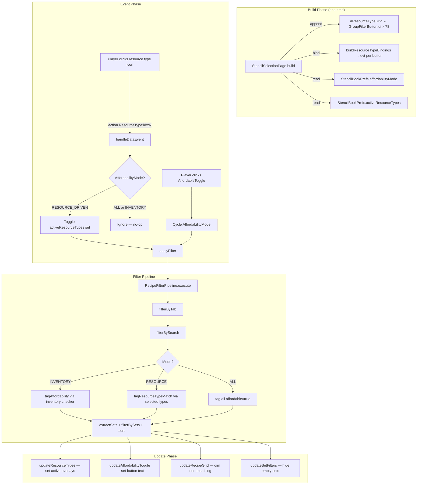

# Design: Resource Type Input Filter

## 1. Overview

The Resource Type Input Filter replaces the deprecated placeholder list section in the Stencil Crafting's right column with an icon grid of ~78 resource types. It introduces a three-state affordability mode (All / Inventory Driven / Resource Driven) that determines how recipes are filtered and dimmed. In Resource Driven mode, selected resource type icons filter recipes whose inputs match ANY selected type (loose OR), dimming non-matching recipes within visible sets and hiding sets with zero matches. The feature reuses the existing `GroupFilterButton.ui` template, mirrors the `MaterialGroups` build/bind/update pattern, and integrates as a new stage in `RecipeFilterPipeline`.

## 2. Scope

### Files Modified

| File | Change |
|------|--------|
| `StencilSelectionPage.java` | Replace `affordabilityEnabled: boolean` with `AffordabilityMode` enum; add `activeResourceTypes` set; add `buildResourceTypeBindings()`, `updateResourceTypes()`, `updateAffordabilityToggle()`; modify `applyFilter()`, `handleDataEvent()`, `savePrefs()`, `build()` |
| `StencilBookPrefs.java` | Replace `affordabilityEnabled: boolean` with `affordabilityMode: String`; add `activeResourceTypes: List<String>`; add `resourceTypesExpanded: boolean`; update CODEC |
| `RecipeFilterPipeline.java` | Add `ResourceTypeChecker` interface; add `tagResourceTypeMatch()` stage; modify `execute()` signature to accept resource type state; update `PipelineResult` if needed |
| `StencilBookPage.ui` | Replace `#InputSlotLabel`, `#NoPlaceholdersLabel`, `#PlaceholderList` section (lines 253-291) with `#ResourceTypeGrid` section |
| `StencilBookStyles.ui` | Add `@ResourceTypeGridLabelStyle` if needed (or reuse `@SectionLabelStyle`) |

### Files Created

| File | Purpose |
|------|---------|
| `AffordabilityMode.java` | Tri-state enum: `ALL`, `INVENTORY_DRIVEN`, `RESOURCE_DRIVEN` |
| `ResourceTypeRegistry.java` | Static ordered list of all 78 resource type entries with icon filenames |

### Files Unchanged

| File | Reason |
|------|--------|
| `GroupFilterButton.ui` | Reused as-is — same icon + overlay + click button pattern |
| `ResourceTypeResolver.java` | Read-only dependency — `itemsWithResourceType()` already exists |
| `SetFilterButton.ui`, `RecipeIconCell.ui`, `CostCell.ui` | Unrelated to this feature |

## 3. UI Layout Changes

Replace the placeholder section in `StencilBookPage.ui` (lines 253-291) with a resource type icon grid.

**Remove:**
```
Label #InputSlotLabel { ... }
Group { Anchor: (Height: 4); }
Group {
    FlexWeight: 1;
    LayoutMode: TopScrolling;
    ...
    Label #NoPlaceholdersLabel { ... }
    Group #PlaceholderList { ... }
}
```

**Replace with:**
```
// ── Resource Type Filter Grid ──
Group {
    Anchor: (Height: 24, Left: 0, Right: 0);

    TextButton #ResourceTypesHeader {
        Text: "v Resource Types";
        Anchor: (Full: 0);
        Padding: (Left: 6, Right: 22);
        Style: $S.@SectionHeaderStyle;
    }

    Group {
        Anchor: (Width: 24, Height: 24, Right: 2);
        Background: "../../Common/Icons/AssetNotifications/Trash.png";

        TextButton #ClearResourceTypesBtn {
            Text: "";
            Anchor: (Full: 0);
        }
    }
}

Group {
    FlexWeight: 1;
    LayoutMode: TopScrolling;
    ScrollbarStyle: $C.@DefaultScrollbarStyle;

    Group #ResourceTypeGrid {
        LayoutMode: LeftCenterWrap;
    }
}
```

**Layout math:** The right column is 270px wide with 12px left padding = 258px usable. At 36px per icon (including 2px padding each side = 40px), that's 6 icons per row. With 78 icons → 13 rows × 36px = 468px of content in a scrollable area.

## 4. New UI Template

**Reuse `GroupFilterButton.ui` as-is.** The template already provides:
- 36×36 icon slot with background
- `#GroupIcon` — background set dynamically to icon path
- `#ActiveOverlay` — visible toggle for selected state
- `#GroupBtn` — transparent click target for event binding

No new `.ui` template file needed. Server appends `GroupFilterButton.ui` instances into `#ResourceTypeGrid` the same way it appends into `#MaterialGroups`.

## 5. Data Model

### 5.1 Resource Type Enumeration

`ResourceTypeRegistry` provides a static, ordered list of all resource types derived from the icon files in `Common/UI/Custom/Common/Icons/ResourceTypes/`. Each entry maps a `resourceTypeId` to an icon filename.

The `resourceTypeId` is derived from the icon filename by stripping the `.png` extension (e.g., `Hardwood.png` → `Hardwood`).

**Full icon list (78 entries):**

| resourceTypeId | iconFilename |
|---|---|
| Any_Bone | Any_Bone.png |
| Any_Book | Any_Book.png |
| Any_Meat | Any_Meat.png |
| Any_Mushroom | Any_Mushroom.png |
| Any_Recipe | Any_Recipe.png |
| Any_Rock | Any_Rock.png |
| Any_Rubble | Any_Rubble.png |
| Any_Trunk | Any_Trunk.png |
| Blackwood | Blackwood.png |
| Bone | Bone.png |
| Books | Books.png |
| Crystal_Shards | Crystal_Shards.png |
| Darkwood | Darkwood.png |
| Deadwood | Deadwood.png |
| Drywood | Drywood.png |
| Fish | Fish.png |
| Fish_Epic | Fish_Epic.png |
| Fish_Legendary | Fish_Legendary.png |
| Fish_Rare | Fish_Rare.png |
| Fish_Uncommon | Fish_Uncommon.png |
| Flowers | Flowers.png |
| Fuel | Fuel.png |
| Goldenwood | Goldenwood.png |
| Greenwood | Greenwood.png |
| Hardwood | Hardwood.png |
| Lightwood | Lightwood.png |
| Milk_Bucket | Milk_Bucket.png |
| Milk_Mosshorn_Bucket | Milk_Mosshorn_Bucket.png |
| Moss | Moss.png |
| Prototype_Rock_Concrete_Brick | Prototype_Rock_Concrete_Brick.png |
| Redwood | Redwood.png |
| Rock | Rock.png |
| Rock_Aqua_Brick | Rock_Aqua_Brick.png |
| Rock_Aqua_Cobble | Rock_Aqua_Cobble.png |
| Rock_Basalt_Brick | Rock_Basalt_Brick.png |
| Rock_Basalt_Cobble | Rock_Basalt_Cobble.png |
| Rock_Calcite_Brick | Rock_Calcite_Brick.png |
| Rock_Calcite_Cobble | Rock_Calcite_Cobble.png |
| Rock_Chalk_Brick | Rock_Chalk_Brick.png |
| Rock_Gold_Brick | Rock_Gold_Brick.png |
| Rock_Ledge_Brick | Rock_Ledge_Brick.png |
| Rock_Ledge_Cobble | Rock_Ledge_Cobble.png |
| Rock_Lime_Brick | Rock_Lime_Brick.png |
| Rock_Lime_Cobble | Rock_Lime_Cobble.png |
| Rock_Marble_Brick | Rock_Marble_Brick.png |
| Rock_Marble_Cobble | Rock_Marble_Cobble.png |
| Rock_Peach_Brick | Rock_Peach_Brick.png |
| Rock_Peach_Cobble | Rock_Peach_Cobble.png |
| Rock_Quartzite_Brick | Rock_Quartzite_Brick.png |
| Rock_Quartzite_Cobble | Rock_Quartzite_Cobble.png |
| Rock_Runic_Blue_Brick | Rock_Runic_Blue_Brick.png |
| Rock_Runic_Brick | Rock_Runic_Brick.png |
| Rock_Sandstone_Brick | Rock_Sandstone_Brick.png |
| Rock_Sandstone_Cobble | Rock_Sandstone_Cobble.png |
| Rock_Sandstone_Red_Brick | Rock_Sandstone_Red_Brick.png |
| Rock_Sandstone_Red_Cobble | Rock_Sandstone_Red_Cobble.png |
| Rock_Sandstone_White_Brick | Rock_Sandstone_White_Brick.png |
| Rock_Sandstone_White_Cobble | Rock_Sandstone_White_Cobble.png |
| Rock_Shale_Brick | Rock_Shale_Brick.png |
| Rock_Shale_Cobble | Rock_Shale_Cobble.png |
| Rock_Slate_Cobble | Rock_Slate_Cobble.png |
| Rock_Stone | Rock_Stone.png |
| Rock_Stone_Brick | Rock_Stone_Brick.png |
| Rock_Stone_Cobble | Rock_Stone_Cobble.png |
| Rock_Temp | Rock_Temp.png |
| Rock_Volcanic_Brick | Rock_Volcanic_Brick.png |
| Rock_Volcanic_Cobble | Rock_Volcanic_Cobble.png |
| Rubble | Rubble.png |
| Softwood | Softwood.png |
| Soil_Clay_Brick | Soil_Clay_Brick.png |
| Soil_Clay_Ocean_Brick | Soil_Clay_Ocean_Brick.png |
| Soil_Hive_Brick | Soil_Hive_Brick.png |
| Soil_Hive_Corrupted_Brick | Soil_Hive_Corrupted_Brick.png |
| Soil_Snow_Brick | Soil_Snow_Brick.png |
| Tropicalwood | Tropicalwood.png |
| Wood | Wood.png |
| Wood_Planks | Wood_Planks.png |
| Wood_Trunk | Wood_Trunk.png |
| Wood_Trunk_Temp | Wood_Trunk_Temp.png |

**Sort order:** Alphabetical by `resourceTypeId` (matching directory listing order). The registry provides a `sortOrder` integer for future re-ordering.

### 5.2 Max Button Constant

`MAX_RESOURCE_TYPE_BUTTONS = 80` — slightly above 78 to accommodate future additions without layout rebuild.

## 6. Affordability Mode

### 6.1 Enum Design

```java
public enum AffordabilityMode {
    ALL,               // No filtering, no dimming
    INVENTORY_DRIVEN,  // Filter by player inventory
    RESOURCE_DRIVEN;   // Filter by selected resource types

    public AffordabilityMode next() {
        return values()[(ordinal() + 1) % values().length];
    }

    public String label() {
        return switch (this) {
            case ALL -> "All";
            case INVENTORY_DRIVEN -> "Inventory Driven";
            case RESOURCE_DRIVEN -> "Resource Driven";
        };
    }
}
```

### 6.2 Toggle Cycling

The `#AffordableToggle` button cycles: `INVENTORY_DRIVEN → RESOURCE_DRIVEN → ALL → INVENTORY_DRIVEN → ...`

The button text updates to show the current mode's label.

### 6.3 Prefs Migration

`StencilBookPrefs.affordabilityEnabled` (boolean) is replaced by `StencilBookPrefs.affordabilityMode` (String). Migration:
- `true` → `"INVENTORY_DRIVEN"`
- `false` → `"ALL"`

The CODEC uses `Codec.STRING` with the enum name. On load, `AffordabilityMode.valueOf()` with fallback to `INVENTORY_DRIVEN`.

### 6.4 Resource Type Selections Storage

`StencilBookPrefs.activeResourceTypes: List<String>` — persisted as a string array. On load, restored into `Set<String> activeResourceTypes` on `StencilSelectionPage`.

`StencilBookPrefs.resourceTypesExpanded: boolean` — persists collapse state of the resource types section header.

## 7. Build Phase

Changes to `StencilSelectionPage.build()`:

```
// After appending MaterialGroups buttons...

// Resource type icon buttons (one per resource type)
for (int i = 0; i < MAX_RESOURCE_TYPE_BUTTONS; i++) {
    cmd.append("#ResourceTypeGrid", "Pages/StencilBook/GroupFilterButton.ui");
}

// Bind resource type events
buildResourceTypeBindings(evt);
```

### 7.1 buildResourceTypeBindings(evt)

Mirrors `buildMaterialGroupBindings()`:
- Binds `#ClearResourceTypesBtn` → action `"ResourceType:All"` (clear all selections)
- Binds `#ResourceTypesHeader` → action `"ToggleResourceTypes"` (expand/collapse)
- For each `i` in `0..MAX_RESOURCE_TYPE_BUTTONS-1`: binds `#ResourceTypeGrid[i] #GroupBtn` → action `"ResourceType:idx:i"`

## 8. Update Phase

### 8.1 updateResourceTypes(cmd)

Mirrors `updateMaterialGroups()`:

```
for (int i = 0; i < MAX_RESOURCE_TYPE_BUTTONS; i++) {
    String sel = "#ResourceTypeGrid[" + i + "]";
    if (i < ResourceTypeRegistry.getCount()) {
        ResourceTypeEntry entry = ResourceTypeRegistry.getAll().get(i);
        boolean active = activeResourceTypes.contains(entry.resourceTypeId());
        cmd.set(sel + ".Visible", true);
        cmd.set(sel + ".TooltipText", entry.resourceTypeId());  // or display name
        cmd.set(sel + " #ActiveOverlay.Visible", active);
        cmd.set(sel + " #GroupIcon.Background",
                "Common/Icons/ResourceTypes/" + entry.iconFilename());
    } else {
        cmd.set(sel + ".Visible", false);
    }
}
```

### 8.2 updateAffordabilityToggle(cmd)

```
cmd.set("#AffordableToggle.Text", affordabilityMode.label());
cmd.set("#AffordableToggle.Style",
        affordabilityMode != AffordabilityMode.ALL ? FILTER_ACTIVE : FILTER_INACTIVE);
```

## 9. Event Handling

### 9.1 ToggleAffordable (modified)

Current: `affordabilityEnabled = !affordabilityEnabled`

New: `affordabilityMode = affordabilityMode.next()`

After cycling:
1. `applyFilter()`
2. `pruneInvalidMaterialGroups()`
3. `updateAffordabilityToggle(cmd)`
4. `updateResourceTypes(cmd)` — resource type grid may need visual update
5. `updateMaterialGroups(cmd)`, `updateSetFilters(cmd)`, `updateRecipeGrid(cmd)`, `updateDetailPanel(cmd)`
6. `savePrefs()`

### 9.2 ResourceType:All (new)

Clear all selected resource types:
```
activeResourceTypes.clear();
applyFilter();
updateResourceTypes(cmd);
updateSetFilters(cmd);
updateRecipeGrid(cmd);
updateDetailPanel(cmd);
savePrefs();
```

### 9.3 ResourceType:idx:N (new)

Toggle a single resource type:
```
int idx = parse N;
if (idx >= 0 && idx < ResourceTypeRegistry.getCount()) {
    String typeId = ResourceTypeRegistry.getAll().get(idx).resourceTypeId();
    if (activeResourceTypes.contains(typeId)) {
        activeResourceTypes.remove(typeId);
    } else {
        activeResourceTypes.add(typeId);
    }
    applyFilter();
    updateResourceTypes(cmd);
    updateSetFilters(cmd);
    updateRecipeGrid(cmd);
    updateDetailPanel(cmd);
    savePrefs();
}
```

### 9.4 ToggleResourceTypes (new)

```
resourceTypesExpanded = !resourceTypesExpanded;
cmd.set("#ResourceTypesHeader.Text", (resourceTypesExpanded ? "v " : "> ") + "Resource Types");
cmd.set("#ResourceTypeGrid.Visible", resourceTypesExpanded);
```

## 10. Filter Integration

### 10.1 Pipeline Changes

The `RecipeFilterPipeline.execute()` method currently accepts:
- `AffordabilityChecker checker` — for inventory-based affordability
- `boolean affordableOnly` — controls set visibility gating

This needs to generalize to support three modes:

| Mode | checker | affordableOnly | resourceTypeChecker |
|------|---------|---------------|---------------------|
| ALL | null | false | null |
| INVENTORY_DRIVEN | inventory checker | true | null |
| RESOURCE_DRIVEN | null | false | resource type checker |

**New interface:**

```java
@FunctionalInterface
public interface ResourceTypeChecker {
    boolean matchesResourceType(InputRecipe recipe);
}
```

**New pipeline parameter:** `ResourceTypeChecker resourceTypeChecker` — when non-null, used instead of `AffordabilityChecker` for tagging and gating.

**New stage:** `tagResourceTypeMatch(recipes, checker)` — identical structure to `tagAffordability()`, but uses `ResourceTypeChecker` to set the `affordable` flag on `TaggedRecipe`. The `affordable` field is repurposed as a general "matches current filter" boolean regardless of mode.

### 10.2 applyFilter() Changes

```java
private void applyFilter() {
    // ... existing player/inventory lookup ...

    RecipeFilterPipeline.AffordabilityChecker checker = null;
    RecipeFilterPipeline.ResourceTypeChecker resourceTypeChecker = null;
    boolean affordableOnly = false;

    switch (affordabilityMode) {
        case INVENTORY_DRIVEN:
            if (container != null) {
                checker = recipe -> isAffordable(recipe, container);
            }
            affordableOnly = true;
            break;
        case RESOURCE_DRIVEN:
            if (!activeResourceTypes.isEmpty()) {
                resourceTypeChecker = recipe -> recipeMatchesResourceTypes(recipe, activeResourceTypes);
                affordableOnly = true;
            }
            break;
        case ALL:
            // No checker, no filtering
            break;
    }

    // Execute pipeline with both checkers
    RecipeFilterPipeline.PipelineResult result = pipeline.execute(
            inputs, activeTab, effectiveGroups, effectiveSets, searchQuery,
            checker, affordableOnly, categoryInfoMap, resourceTypeChecker);

    // ... store results ...
}
```

### 10.3 recipeMatchesResourceTypes()

A new method on `StencilSelectionPage` that checks whether any of a recipe's input `MaterialQuantity` entries have a `ResourceTypeId` matching any selected resource type.

```java
private boolean recipeMatchesResourceTypes(
        RecipeFilterPipeline.InputRecipe recipe,
        Set<String> selectedTypes) {
    CraftingRecipe cr = CraftingRecipe.getAssetMap().getAsset(recipe.recipeId());
    if (cr == null) return false;
    for (MaterialQuantity input : cr.getInputs()) {
        String resTypeId = input.getResourceTypeId();
        if (resTypeId != null && selectedTypes.contains(resTypeId)) {
            return true;
        }
    }
    return false;
}
```

## 11. Responsibility Map



### Class Ownership

| Responsibility | Owner |
|---|---|
| Resource type enumeration + ordering | `ResourceTypeRegistry` |
| Tri-state affordability mode enum | `AffordabilityMode` |
| UI append/bind/update for resource type grid | `StencilSelectionPage` |
| Recipe ↔ resource type matching logic | `StencilSelectionPage.recipeMatchesResourceTypes()` |
| Pipeline stage for resource type tagging | `RecipeFilterPipeline` |
| Persistence of mode + selections | `StencilBookPrefs` + `StencilBookPrefsStore` |
| UI layout (grid container) | `StencilBookPage.ui` |
| Icon button template | `GroupFilterButton.ui` (reused) |

## 12. Skeleton Code

See skeleton files created alongside this document:

| File | Contents |
|------|----------|
| [`AffordabilityMode.java`](../src/main/java/com/UnobstructedThirdPerson/placeblock/ui/AffordabilityMode.java) | Enum with `ALL`, `INVENTORY_DRIVEN`, `RESOURCE_DRIVEN` |
| [`ResourceTypeRegistry.java`](../src/main/java/com/UnobstructedThirdPerson/placeblock/ui/ResourceTypeRegistry.java) | Static registry of 78 resource type entries |

Method signatures to add to existing files are documented in this section with Javadoc contracts.

### 12.1 StencilSelectionPage — New Methods

```java
/**
 * Appends resource type icon buttons into #ResourceTypeGrid and binds
 * click events for each button. Called once during build().
 *
 * <p>Appends MAX_RESOURCE_TYPE_BUTTONS instances of GroupFilterButton.ui
 * into #ResourceTypeGrid. Binds:
 * <ul>
 *   <li>#ClearResourceTypesBtn → "ResourceType:All"</li>
 *   <li>#ResourceTypesHeader → "ToggleResourceTypes"</li>
 *   <li>#ResourceTypeGrid[i] #GroupBtn → "ResourceType:idx:i"</li>
 * </ul>
 *
 * @param evt the event builder from build()
 */
private void buildResourceTypeBindings(UIEventBuilder evt);

/**
 * Updates all resource type icon buttons to reflect current selection state.
 * Sets icon background, tooltip, visibility, and active overlay for each button.
 *
 * <p>Iterates 0..MAX_RESOURCE_TYPE_BUTTONS. For indices within registry range,
 * sets visible=true with icon and overlay. For indices beyond, sets visible=false.
 *
 * @param cmd the command builder for this update cycle
 */
private void updateResourceTypes(UICommandBuilder cmd);

/**
 * Updates the affordability toggle button text and style to reflect
 * the current {@link AffordabilityMode}.
 *
 * <p>Sets #AffordableToggle.Text to mode.label() and #AffordableToggle.Style
 * to FILTER_ACTIVE (for INVENTORY_DRIVEN, RESOURCE_DRIVEN) or FILTER_INACTIVE (for ALL).
 *
 * @param cmd the command builder for this update cycle
 */
private void updateAffordabilityToggle(UICommandBuilder cmd);

/**
 * Checks whether a recipe's input MaterialQuantity entries include any
 * ResourceTypeId matching the player's selected resource types.
 *
 * <p>Looks up the CraftingRecipe asset by recipeId, iterates its inputs,
 * and returns true if any input's ResourceTypeId is in selectedTypes.
 * Returns false if the recipe asset is not found or has no matching inputs.
 *
 * @param recipe        the pipeline input recipe to check
 * @param selectedTypes the set of selected resource type IDs (non-empty)
 * @return true if at least one input matches a selected resource type
 */
private boolean recipeMatchesResourceTypes(
        RecipeFilterPipeline.InputRecipe recipe,
        Set<String> selectedTypes);
```

### 12.2 RecipeFilterPipeline — New Interface + Method

```java
/**
 * Functional interface for resource-type-based recipe matching.
 *
 * <p>Used in RESOURCE_DRIVEN mode. Implementations check whether a recipe's
 * input MaterialQuantity entries include a ResourceTypeId matching any
 * player-selected resource type.
 *
 * <p>The pipeline calls this exactly once per recipe per execution.
 */
@FunctionalInterface
public interface ResourceTypeChecker {
    /**
     * @param recipe the recipe to check
     * @return true if at least one input matches a selected resource type
     */
    boolean matchesResourceType(InputRecipe recipe);
}

/**
 * Tags recipes with resource-type-match status. Identical structure to
 * tagAffordability() but uses ResourceTypeChecker instead of AffordabilityChecker.
 *
 * <p>Sets the affordable flag on TaggedRecipe based on resource type matching.
 * When checker is null, all recipes are tagged as matching (affordable=true).
 *
 * @param recipes the input recipe list (post-tab, post-search)
 * @param checker the resource type checker; null = all match
 * @return list of TaggedRecipe with affordable flag set by resource type matching
 */
List<TaggedRecipe> tagResourceTypeMatch(
        List<InputRecipe> recipes,
        @Nullable ResourceTypeChecker checker);
```

### 12.3 RecipeFilterPipeline.execute() — Updated Signature

```java
/**
 * Executes the full filter pipeline with support for three affordability modes.
 *
 * <p>When both checker and resourceTypeChecker are null, ALL mode is assumed
 * (no filtering, no dimming). When checker is non-null, INVENTORY_DRIVEN mode
 * is active. When resourceTypeChecker is non-null, RESOURCE_DRIVEN mode is active.
 * Only one of checker/resourceTypeChecker should be non-null at a time.
 *
 * @param allRecipes             complete recipe list
 * @param activeTab              current bench tab
 * @param activeMaterialGroups   selected material group prefixes
 * @param activeSetFilters       selected set names
 * @param searchQuery            search text
 * @param checker                inventory affordability checker (INVENTORY_DRIVEN mode)
 * @param affordableOnly         gate sets by match threshold
 * @param categoryInfoMap        category metadata
 * @param resourceTypeChecker    resource type checker (RESOURCE_DRIVEN mode); null if inactive
 * @return pipeline result
 */
public PipelineResult execute(
        List<InputRecipe> allRecipes,
        String activeTab,
        Set<String> activeMaterialGroups,
        Set<String> activeSetFilters,
        String searchQuery,
        @Nullable AffordabilityChecker checker,
        boolean affordableOnly,
        Map<String, CategoryInfo> categoryInfoMap,
        @Nullable ResourceTypeChecker resourceTypeChecker);
```

## 13. Task Decomposition

### Wave 1 (no dependencies — can run in parallel)

#### Unit: AffordabilityMode.java
- **Methods**: `next()`, `label()`, `fromString()`
- **Contract**: Tri-state enum with cycling and label text. `fromString()` handles migration from boolean prefs.
- **Dependencies**: none
- **Done when**: Enum compiles. `next()` cycles correctly through all three values. `fromString("true")` → `INVENTORY_DRIVEN`, `fromString("false")` → `ALL`.

#### Unit: ResourceTypeRegistry.java
- **Methods**: `getAll()`, `getIconPath(String)`, `getCount()`
- **Contract**: Static ordered list of 78 resource type entries. Each entry has a `resourceTypeId` and `iconFilename`. List is immutable and sorted alphabetically.
- **Dependencies**: none
- **Done when**: `getCount()` returns 78. `getAll()` returns entries in alphabetical order. `getIconPath("Hardwood")` returns `"Hardwood.png"`.

#### Unit: StencilBookPage.ui — Layout Change
- **Files**: `StencilBookPage.ui`
- **Contract**: Replace `#InputSlotLabel` / `#NoPlaceholdersLabel` / `#PlaceholderList` section with `#ResourceTypesHeader` / `#ClearResourceTypesBtn` / `#ResourceTypeGrid` section.
- **Dependencies**: none
- **Done when**: UI file parses. `#ResourceTypeGrid` container exists with `LayoutMode: LeftCenterWrap`. Old placeholder IDs are removed.

#### Unit: StencilBookPrefs.java — Schema Update
- **Methods**: Updated CODEC with `affordabilityMode`, `activeResourceTypes`, `resourceTypesExpanded`
- **Contract**: Replace `affordabilityEnabled: boolean` with `affordabilityMode: String`. Add `activeResourceTypes: List<String>`. Add `resourceTypesExpanded: boolean`. CODEC must handle missing fields with defaults.
- **Dependencies**: none
- **Done when**: CODEC serializes/deserializes all new fields. Old prefs files with `affordabilityEnabled` do not crash on load (graceful default).

### Wave 2 (depends on Wave 1)

#### Unit: RecipeFilterPipeline.java — Resource Type Stage
- **Methods**: `ResourceTypeChecker` interface, `tagResourceTypeMatch()`, updated `execute()` signature
- **Contract**: Add `ResourceTypeChecker` functional interface. Add `tagResourceTypeMatch()` stage that tags recipes using the checker. Update `execute()` to accept optional `ResourceTypeChecker` and route to either inventory or resource type tagging based on which checker is provided.
- **Dependencies**: Wave 1 (`AffordabilityMode` concept, but no compile dependency — pipeline only uses checker interfaces)
- **Done when**: `execute()` compiles with new signature. When `resourceTypeChecker` is non-null, recipes are tagged via `tagResourceTypeMatch()`. When both checkers are null, all recipes are tagged as affordable.

#### Unit: StencilSelectionPage.java — Field + Prefs Migration
- **Methods**: Replace `affordabilityEnabled` field, update `build()` prefs loading, update `savePrefs()`
- **Contract**: Replace `boolean affordabilityEnabled` with `AffordabilityMode affordabilityMode`. Add `Set<String> activeResourceTypes`. Add `boolean resourceTypesExpanded`. Update `build()` to read new prefs fields. Update `savePrefs()` to write new prefs fields.
- **Dependencies**: `AffordabilityMode.java`, `StencilBookPrefs.java` (Wave 1)
- **Done when**: Field declared. `build()` loads `affordabilityMode` from prefs with fallback. `savePrefs()` writes mode string and resource type list.

### Wave 3 (depends on Wave 2)

#### Unit: StencilSelectionPage.java — Build/Bind/Update Methods
- **Methods**: `buildResourceTypeBindings()`, `updateResourceTypes()`, `updateAffordabilityToggle()`, `recipeMatchesResourceTypes()`
- **Contract**: Append resource type buttons in `build()`. Bind events. Update icons/overlays. Check recipe inputs against selected resource types.
- **Dependencies**: `ResourceTypeRegistry` (Wave 1), `RecipeFilterPipeline` new signature (Wave 2), field migration (Wave 2)
- **Done when**: `build()` appends 80 GroupFilterButton.ui into #ResourceTypeGrid. Events bound. `updateResourceTypes()` sets icon/overlay for each button. `recipeMatchesResourceTypes()` returns correct match.

#### Unit: StencilSelectionPage.java — applyFilter() + handleDataEvent()
- **Methods**: Modified `applyFilter()`, modified `handleDataEvent()` for `ToggleAffordable`, `ResourceType:All`, `ResourceType:idx:N`, `ToggleResourceTypes`
- **Contract**: `applyFilter()` constructs the correct checker based on `affordabilityMode`. `handleDataEvent()` routes new actions, cycles mode on toggle, toggles individual resource types.
- **Dependencies**: All Wave 2 units
- **Done when**: Mode cycling works (All → Inventory Driven → Resource Driven → All). Resource type toggle adds/removes from set. `applyFilter()` passes correct checker to pipeline. Resource type selections are ignored in non-RESOURCE_DRIVEN modes.

### Wave 4 (integration — depends on Wave 3)

#### Unit: Integration Wiring
- **Files**: `StencilSelectionPage.java` (`build()` call order), `StencilBookPage.ui` (verified)
- **Contract**: Wire all new components into the existing build/update lifecycle. Ensure `updateResourceTypes()` is called in the correct update sequence alongside `updateMaterialGroups()`, `updateSetFilters()`, `updateRecipeGrid()`.
- **Dependencies**: All Wave 3 units
- **Done when**: Full build passes. Opening bench shows resource type grid with icons. Cycling affordability mode updates button text. Selecting resource types in Resource Driven mode filters recipes. Prefs persist across bench open/close.

## 14. Handoff Checklist

- [x] Component diagram included
- [x] Responsibility map included
- [x] All interfaces have Javadoc contracts
- [x] All skeleton files created with TODO markers
- [x] Integration Changes Required section populated (§2 Scope)
- [x] Open Questions section populated (see below)
- [x] Task Decomposition section populated

## 15. Open Questions (RESOLVED)

1. **Display names for resource types**: ~~Should tooltips show the raw `resourceTypeId`?~~ **RESOLVED: Use raw `resourceTypeId` as-is** (e.g., `Rock_Basalt_Cobble`). No display name mapping needed.

2. **Resource type grid visibility by mode**: ~~Should the grid dim/hide in non-Resource-Driven modes?~~ **RESOLVED: Yes — dim/hide the resource type grid when mode is ALL or INVENTORY_DRIVEN.** The grid becomes visible and interactive only in RESOURCE_DRIVEN mode. Selections are stored silently across mode switches.

3. **Give Stencil button**: ~~Does `#GetPlaceholderBtn` stay or go?~~ **RESOLVED: Keep the Give Stencil button.** It remains in its current position above the resource type grid section. Only the `#InputSlotLabel`, `#NoPlaceholdersLabel`, and `#PlaceholderList` are removed.

---

→ @Engineer implement docs/design-resource-type-filter.md
