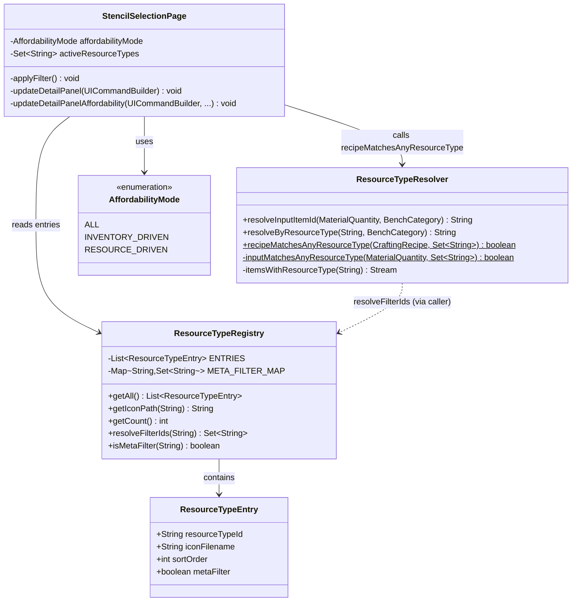
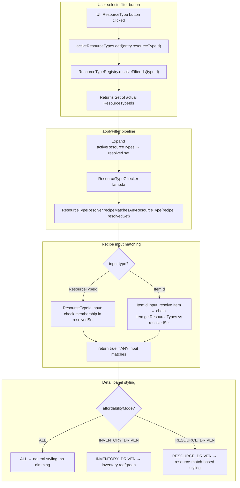
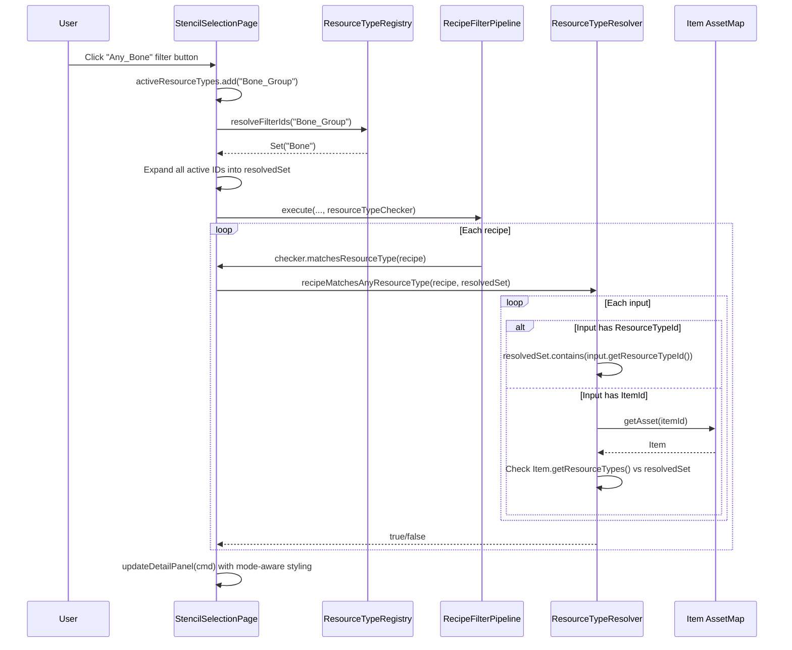

# Design: Resource Type Matching Bug Fixes

## 1. Overview

Targeted fixes for three interconnected bugs in the Resource Type Filter: (1) `ResourceTypeRegistry` stores icon filenames as IDs instead of actual `ResourceTypeId` values, (2) `recipeMatchesResourceTypes()` ignores `ItemId`-based recipe inputs and lives in the wrong class, and (3) `updateDetailPanel()` unconditionally applies inventory-based affordability styling regardless of the active mode. The core design principle is **single source of truth** — all resource-type resolution flows through `ResourceTypeResolver`, and the registry maps directly to engine-defined `ResourceTypeId` values.

## 2. Design Priorities

1. **Correctness** — registry IDs must match actual engine `ResourceTypeId` values; matching must handle both `ItemId` and `ResourceTypeId` inputs
2. **Simplicity** — minimal changes to fix the bugs; no new abstractions beyond what's needed
3. **Reusability** — matching logic lives in `ResourceTypeResolver` as a shared static method
4. **Consistency** — detail panel affordability styling must agree with the grid's dimming logic

## 3. Component Diagram



## 4. Responsibility Map



## 5. Sequence Diagram



## 6. Detailed Changes

### 6.1 ResourceTypeRegistry — Meta-filter mapping

**Problem:** The 8 `"Any_*"` entries use icon filenames as `resourceTypeId` values. No engine item or recipe uses `"Any_Bone"` — the actual ResourceTypeId is `"Bone"`.

**Decision (from ticket):** Option B — `Any_*` entries become group meta-filters. Remove specific entries that overlap (e.g., remove `"Bone"` at index 9 since `"Any_Bone"` now maps to `{"Bone"}`).

#### Registry entry changes

| Current `resourceTypeId` | Action | New `resourceTypeId` | Meta-filter? | Resolves to |
|--------------------------|--------|---------------------|--------------|-------------|
| `Any_Bone` (idx 0) | **Rename** | `Bone_Group` | Yes | `{"Bone"}` |
| `Any_Book` (idx 1) | **Rename** | `Books_Group` | Yes | `{"Books"}` |
| `Any_Meat` (idx 2) | **Rename** | `Meats_Group` | Yes | `{"Meats"}` |
| `Any_Mushroom` (idx 3) | **Rename** | `Mushrooms_Group` | Yes | `{"Mushrooms"}` |
| `Any_Recipe` (idx 4) | **Remove** | — | — | *(no engine ResourceType)* |
| `Any_Rock` (idx 5) | **Rename** | `Rock_Group` | Yes | `{"Rock", "Clays", "Sands", "Soils", "Rock_Slate_Brick", "Rock_Runic_Teal_Brick", "Rock_Runic_Dark_Brick"}` |
| `Any_Rubble` (idx 6) | **Rename** | `Rubble_Group` | Yes | `{"Rubble"}` |
| `Any_Trunk` (idx 7) | **Rename** | `Trunk_Group` | Yes | `{"Wood_Trunk", "Wood_All_Trunk", "Wood_Hardwood_Trunk", ...}` (all 41 trunk ResourceTypeIds) |
| `Bone` (idx 9) | **Remove** | — | — | *(overlaps with Bone_Group)* |
| `Books` (idx 10) | **Remove** | — | — | *(overlaps with Books_Group)* |
| `Rock` (idx 31) | **Remove** | — | — | *(overlaps with Rock_Group — exact match is a subset of group)* |
| `Rubble` (idx 67) | **Remove** | — | — | *(overlaps with Rubble_Group)* |
| `Wood_Trunk` (idx 77) | **Remove** | — | — | *(overlaps with Trunk_Group — exact match is a subset of group)* |

> **Note:** `Meats` and `Mushrooms` have no separate exact-match entries to remove. `Wood` (idx 75) is NOT removed — it maps to the `"Wood"` ResourceTypeId which is distinct from trunk types.

#### New `ResourceTypeEntry` record

Add a `metaFilter` boolean field:

```java
public record ResourceTypeEntry(
        String resourceTypeId,
        String iconFilename,
        int sortOrder,
        boolean metaFilter
) {}
```

#### New `META_FILTER_MAP`

A `Map<String, Set<String>>` mapping meta-filter `resourceTypeId` values to the set of actual `ResourceTypeId` values they cover.

#### New `resolveFilterIds(String)` method

Returns the set of actual ResourceTypeIds for a given registry entry:
- If the entry is a meta-filter → return the mapped set from `META_FILTER_MAP`
- Otherwise → return `Set.of(resourceTypeId)` (exact match)

#### New `isMetaFilter(String)` method

Returns `true` if the given `resourceTypeId` is a meta-filter group entry.

### 6.2 ResourceTypeResolver — New matching method

**Problem:** `recipeMatchesResourceTypes()` in `StencilSelectionPage` only checks `input.getResourceTypeId()`, ignoring `ItemId`-based inputs entirely. It also lives in the wrong class.

**Fix:** Add two new static methods to `ResourceTypeResolver`:

#### `recipeMatchesAnyResourceType(CraftingRecipe, Set<String>)`

Public entry point. Iterates recipe inputs, returns `true` if ANY input matches any of the given resource type IDs.

```java
public static boolean recipeMatchesAnyResourceType(
        @Nonnull CraftingRecipe recipe,
        @Nonnull Set<String> resourceTypeIds)
```

Contract:
- Returns `false` if recipe has no inputs
- Returns `true` as soon as ANY input matches (short-circuit)
- Handles both `ResourceTypeId` and `ItemId` input types
- Does NOT apply BenchCategory preference — this is a filter check, not a resolution

#### `inputMatchesAnyResourceType(MaterialQuantity, Set<String>)`

Private helper. Checks a single input against the resource type set:

1. If `input.getResourceTypeId()` is non-null → return `resourceTypeIds.contains(resTypeId)`
2. If `input.getItemId()` is non-null and not `"Empty"` → look up `Item.getAssetMap().getAsset(itemId)`, check if any of `item.getResourceTypes()` has an ID in `resourceTypeIds`
3. Otherwise → return `false`

### 6.3 StencilSelectionPage — applyFilter changes

**In `applyFilter()`, RESOURCE_DRIVEN branch (line ~218):**

Replace:
```java
resourceTypeChecker = recipe -> recipeMatchesResourceTypes(recipe, selected);
```

With logic that:
1. Expands `activeResourceTypes` through `ResourceTypeRegistry.resolveFilterIds()` to build a flat `Set<String>` of actual ResourceTypeIds
2. Creates the checker lambda using the new `ResourceTypeResolver.recipeMatchesAnyResourceType()`

```java
// Expand meta-filters to actual ResourceTypeIds
Set<String> resolvedTypes = new HashSet<>();
for (String typeId : activeResourceTypes) {
    resolvedTypes.addAll(ResourceTypeRegistry.resolveFilterIds(typeId));
}
resourceTypeChecker = recipe -> {
    CraftingRecipe cr = CraftingRecipe.getAssetMap().getAsset(recipe.recipeId());
    return cr != null && ResourceTypeResolver.recipeMatchesAnyResourceType(cr, resolvedTypes);
};
```

**Delete** the private `recipeMatchesResourceTypes()` method (lines 894-912).

### 6.4 StencilSelectionPage — updateDetailPanel mode-awareness

**Problem:** `updateDetailPanel()` unconditionally checks inventory quantities and applies red/green styling regardless of `affordabilityMode`.

**Fix:** Branch the affordability styling based on `affordabilityMode`:

#### ALL mode
- All cost cells shown with neutral styling (`COST_QTY_NORMAL`)
- `#CostDim.Visible = false` for all cells
- Output frame uses `OUTPUT_BG_NORMAL`

#### INVENTORY_DRIVEN mode
- Current behavior (no change): check `countItemInInventory()`, red if insufficient

#### RESOURCE_DRIVEN mode
- Cost cells shown with neutral styling — no red/green based on inventory
- `#CostDim.Visible = false` for all cells (the grid already handles dimming)
- Output frame uses `OUTPUT_BG_NORMAL`

> **Rationale:** In RESOURCE_DRIVEN mode, the user is browsing by resource type, not checking what they can craft. The grid already dims non-matching recipes. The detail panel should just show the recipe's ingredients neutrally. Showing inventory-based red/green contradicts the grid's resource-type-based highlighting.

The implementation change is a conditional around the `countItemInInventory()` and styling block (lines ~812-822):

```java
boolean checkInventory = (affordabilityMode == AffordabilityMode.INVENTORY_DRIVEN);
// ... in the loop:
if (checkInventory) {
    int playerHas = countItemInInventory(container, itemId);
    boolean sufficient = playerHas >= requiredQty;
    if (!sufficient) allAffordable = false;
    cmd.set(sel + " #CostDim.Visible", !sufficient);
    cmd.set(sel + " #CostQty.Style", sufficient ? COST_QTY_NORMAL : COST_QTY_INSUFFICIENT);
} else {
    cmd.set(sel + " #CostDim.Visible", false);
    cmd.set(sel + " #CostQty.Style", COST_QTY_NORMAL);
}
```

And the output frame styling at the end:

```java
if (checkInventory) {
    cmd.set("#OutputFrame.Background", allAffordable ? OUTPUT_BG_NORMAL : OUTPUT_BG_UNAFFORDABLE);
    cmd.set("#OutputDim.Visible", !allAffordable);
    cmd.set("#OutputName.Style", allAffordable ? DETAIL_LABEL_NORMAL : DETAIL_LABEL_MUTED);
} else {
    cmd.set("#OutputFrame.Background", OUTPUT_BG_NORMAL);
    cmd.set("#OutputDim.Visible", false);
    cmd.set("#OutputName.Style", DETAIL_LABEL_NORMAL);
}
```

## 7. Package Structure

No new files. Changes are to existing files:

```
src/main/java/com/UnobstructedThirdPerson/
├── placeblock/ui/
│   ├── ResourceTypeRegistry.java          ← MODIFY (meta-filter map, entry removals, new methods)
│   └── StencilSelectionPage.java        ← MODIFY (delete recipeMatchesResourceTypes, fix applyFilter, fix updateDetailPanel)
└── resourcecollection/
    └── ResourceTypeResolver.java          ← MODIFY (add recipeMatchesAnyResourceType, inputMatchesAnyResourceType)
```

## 8. Integration Changes Required

| File | Change | Detail |
|------|--------|--------|
| `ResourceTypeRegistry.java` | Add `metaFilter` field to `ResourceTypeEntry` | Existing callers that construct/destructure the record will need updating |
| `ResourceTypeRegistry.java` | Remove 5 overlapping entries + 1 orphan (`Any_Recipe`) | `getCount()` return value decreases from 79 to 73; sort order indices shift |
| `ResourceTypeRegistry.java` | Rename 7 `Any_*` entries to `*_Group` | Any persisted `activeResourceTypes` preferences using old `"Any_*"` IDs will silently fail to match — need migration or graceful fallback in `loadPrefs()` |
| `StencilSelectionPage.java` | Delete `recipeMatchesResourceTypes()` | No other callers — safe to remove |
| `StencilSelectionPage.java` | `applyFilter()` RESOURCE_DRIVEN branch | Lambda now calls `ResourceTypeResolver.recipeMatchesAnyResourceType()` with resolved set |
| `StencilSelectionPage.java` | `updateDetailPanel()` | Conditional inventory check based on `affordabilityMode` |
| Persisted preferences (JSON) | Stale `activeResourceTypes` values | If a user had `"Any_Bone"` saved, it won't match `"Bone_Group"`. Add a migration map in `loadPrefs()` or silently drop unknown entries |

## 9. Open Questions

1. **Trunk list completeness:** The 41 trunk ResourceTypeIds are from the research doc. If new trunk types are added in future engine updates, `META_FILTER_MAP` will need updating. Consider building the trunk list dynamically by scanning `ResourceTypes/*.json` for files using `Any_Trunk.png` as their icon — but this requires asset access at init time, which may not be available in the plugin's lifecycle.

2. **Preference migration:** Should `loadPrefs()` include a one-time migration map (`"Any_Bone" → "Bone_Group"`) or just drop unrecognized entries? Dropping is simpler but loses the user's selection.

3. **Meats / Mushrooms overlap removal:** `Meats` and `Mushrooms` don't have separate exact-match entries in the current registry. No overlap to remove. Confirmed correct.

## 10. Handoff Checklist

- [x] Component diagram included
- [x] Responsibility map included
- [x] All interfaces have Javadoc contracts
- [x] All skeleton files created with TODO markers
- [x] Integration Changes Required section populated
- [x] Open Questions section populated (even if empty)
- [x] Task Decomposition section populated

## 11. Task Decomposition

### Wave 1 (no dependencies — can run in parallel)

#### Unit: ResourceTypeRegistry.java — Meta-filter map + entry cleanup

- **Methods**: Modify `ENTRIES` list, add `META_FILTER_MAP`, add `resolveFilterIds()`, add `isMetaFilter()`, update `ResourceTypeEntry` record
- **Contract**: Registry entries use actual engine ResourceTypeIds (or `*_Group` meta-filter names). Meta-filter entries map to sets of actual ResourceTypeIds. Orphaned/overlapping entries removed.
- **Dependencies**: none
- **Done when**: `resolveFilterIds("Bone_Group")` returns `Set.of("Bone")`, `resolveFilterIds("Rock_Group")` returns the 7-member set, `resolveFilterIds("Hardwood")` returns `Set.of("Hardwood")`, `getCount()` returns 73, `Any_Recipe` entry is gone

#### Unit: ResourceTypeResolver.java — recipeMatchesAnyResourceType

- **Methods**: `recipeMatchesAnyResourceType(CraftingRecipe, Set<String>)`, `inputMatchesAnyResourceType(MaterialQuantity, Set<String>)`
- **Contract**: Returns `true` if any recipe input (by `ResourceTypeId` or by resolved `ItemId` → `Item.getResourceTypes()`) matches any ID in the given set. Short-circuits on first match.
- **Dependencies**: none
- **Done when**: Method correctly matches (a) `ResourceTypeId`-based inputs, (b) `ItemId`-based inputs by resolving item and checking its `ResourceTypes` array, and (c) returns `false` for null/empty inputs

### Wave 2 (depends on Wave 1)

#### Unit: StencilSelectionPage.java — applyFilter + updateDetailPanel + cleanup

- **Methods**: Modify `applyFilter()` RESOURCE_DRIVEN branch, modify `updateDetailPanel()`, delete `recipeMatchesResourceTypes()`
- **Contract**: `applyFilter()` expands meta-filters via `ResourceTypeRegistry.resolveFilterIds()` and delegates matching to `ResourceTypeResolver.recipeMatchesAnyResourceType()`. `updateDetailPanel()` applies affordability styling only in INVENTORY_DRIVEN mode; neutral styling in ALL and RESOURCE_DRIVEN modes.
- **Dependencies**: Wave 1 (both `ResourceTypeRegistry.resolveFilterIds()` and `ResourceTypeResolver.recipeMatchesAnyResourceType()`)
- **Done when**: Selecting "Bone_Group" in RESOURCE_DRIVEN mode highlights all bone recipes (both `ItemId` and `ResourceTypeId` inputs). Detail panel shows neutral styling in RESOURCE_DRIVEN mode. Old `recipeMatchesResourceTypes()` method is deleted.

### Wave 3 (integration — depends on Wave 2)

#### Unit: Preference migration + validation

- **Files**: `StencilSelectionPage.java` `loadPrefs()` section
- **Contract**: Map stale `"Any_*"` values in persisted preferences to new `"*_Group"` values. Drop unrecognized entries.
- **Dependencies**: Wave 2 (registry entries finalized)
- **Done when**: User with saved `"Any_Bone"` preference loads into `"Bone_Group"`. Unknown entries are silently dropped. No crash on old prefs.
