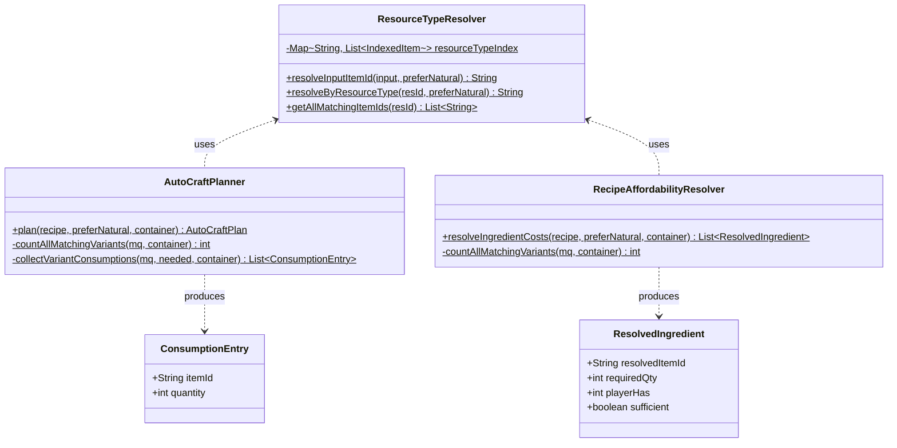
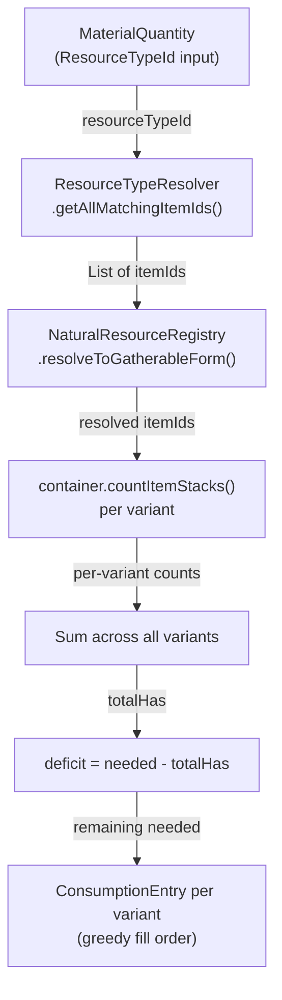
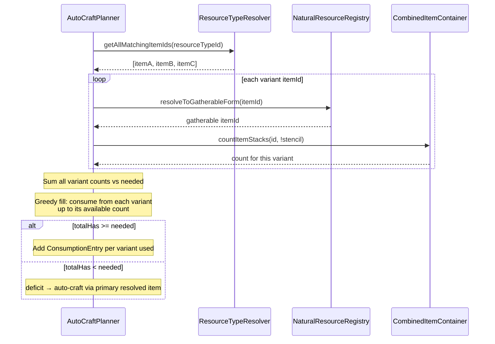

# Design: ResourceTypeId Multi-Variant Consumption

## 1. Overview

When a recipe input uses a `ResourceTypeId`, any item whose `resourceTypes` includes that ID is a valid match. Currently, `AutoCraftPlanner` and `RecipeAffordabilityResolver` resolve to ONE specific item and only count/consume that one, ignoring other matching variants the player may hold. This design adds multi-variant counting and greedy consumption so that ALL matching items are used before falling back to auto-crafting.

The core principle is **minimal change surface**: add one new public method to `ResourceTypeResolver`, then update the counting/consumption logic in the two consumer classes.

## 2. Design Priorities

1. **Minimal blast radius** — only change resolution/counting logic; don't restructure planners
2. **Correctness** — stencil exclusion preserved for all variants; `resolveToGatherableForm` applied per variant
3. **Simplicity** — no new classes, no new abstractions; just a new query method and updated loops
4. **Thread safety** — all new code is stateless, reading only from immutable indexes

## 3. Component Diagram



## 4. Responsibility Map



## 5. Sequence Diagram



## 6. Package Structure

No new files. Changes are to existing files only:

```
src/main/java/com/CodeCreature/
├── scaling/
│   └── ResourceTypeResolver.java          ← +1 new public method
├── crafting/
│   ├── AutoCraftPlanner.java              ← fast path + slow path updated
│   └── RecipeAffordabilityResolver.java   ← resolveIngredientCosts updated
```

## 7. Integration Changes Required

### `ResourceTypeResolver.java`
- **Add** public static method `getAllMatchingItemIds(String resourceTypeId)` that returns `List<String>` of all concrete item IDs from `resourceTypeIndex`.
- **No existing methods modified** — `resolveInputItemId` and `resolveByResourceType` remain unchanged (still used for primary resolution and auto-craft raw-cost lookup).

### `AutoCraftPlanner.java` — Fast Path (lines ~125–140)
- **Currently**: resolves to ONE item via `resolveInputItemId`, counts only that item.
- **Change**: when `mq.getResourceTypeId() != null`, call `getAllMatchingItemIds` to get all variants, apply `resolveToGatherableForm` to each, sum counts across all. If total across all variants ≥ needed, produce one `ConsumptionEntry` per variant consumed (greedy fill).
- When `mq.getItemId() != null` (direct item reference), behavior is unchanged.

### `AutoCraftPlanner.java` — Slow Path (lines ~145–180)
- **Currently**: resolves to ONE item, counts that item, computes deficit.
- **Change**: when `mq.getResourceTypeId() != null`, enumerate all variants, sum `playerHas` across all. Greedily consume from each variant (producing multiple `ConsumptionEntry` records). Deficit is `needed - sumOfAllVariants`. Auto-craft resolution uses the primary resolved item's raw cost (unchanged — all variants decompose to the same raw materials).
- When `mq.getItemId() != null`, behavior is unchanged.

### `RecipeAffordabilityResolver.java` — `resolveIngredientCosts()`
- **Currently**: resolves to ONE item, counts only that item for `playerHas`.
- **Change**: when `mq.getResourceTypeId() != null`, get all variants, apply `resolveToGatherableForm` to each, sum counts for `playerHas`. The `resolvedItemId` in `ResolvedIngredient` stays as the primary resolved item (for display). The `playerHas` field reflects the total across all variants.
- The `ingredientMap` merge logic stays as-is (keyed by primary resolved item).

### `StencilPlacementSystem.java`
- **No changes needed.** It already iterates `plan.consumptions()` and creates ItemId-based `MaterialQuantity` entries. Multiple `ConsumptionEntry` records for different variants of the same ResourceType are handled correctly — each removes a specific item by its concrete ID.

## 8. Open Questions

1. **Variant consumption order**: The design uses the `resourceTypeIndex` order (set-roots first, then derivatives). This means set-root items are consumed before ornate/decorative variants. Is this the desired priority, or should cheaper/more-common variants be consumed first? *Recommendation: use index order (set-roots first) for consistency with the existing resolution preference.*

2. **resolveToGatherableForm collisions**: If two different item IDs (e.g., `Shale_Brick` and `Shale_Brick_Ornate`) both resolve to the same gatherable form via `resolveToGatherableForm`, they should be counted as the same item and produce a single `ConsumptionEntry`. This is unlikely but should be handled defensively. *Recommendation: deduplicate by resolved gatherable ID, merging counts.*

## 9. Handoff Checklist

- [x] Component diagram included
- [x] Responsibility map included
- [x] All interfaces have Javadoc contracts
- [x] All skeleton files created with TODO markers
- [x] Integration Changes Required section populated
- [x] Open Questions section populated (even if empty)
- [x] Task Decomposition section populated

## 10. Task Decomposition

### Wave 1 (no dependencies — can run in parallel)

#### Unit: ResourceTypeResolver.getAllMatchingItemIds()
- **Methods**: `getAllMatchingItemIds(String resourceTypeId)`
- **Contract**: Returns all concrete item IDs from `resourceTypeIndex` matching the given ResourceTypeId. Returns empty list if no matches. Each ID appears once. Order matches the index (set-roots first).
- **Dependencies**: none
- **Done when**: Method returns correct list for known ResourceTypeIds; returns empty list for unknown IDs; does not modify the index.

### Wave 2 (depends on Wave 1)

#### Unit: AutoCraftPlanner — fast path multi-variant
- **Methods**: Update the fast-path loop in `plan()` (lines ~125–140)
- **Contract**: When `mq.getResourceTypeId() != null`, enumerate all matching variants via `getAllMatchingItemIds`, apply `resolveToGatherableForm` to each, sum non-stencil counts. If total ≥ needed, greedily fill `ConsumptionEntry` records per variant. If total < needed, fall through to slow path.
- **Dependencies**: `ResourceTypeResolver.getAllMatchingItemIds`
- **Done when**: Fast path correctly counts all variants; produces multiple `ConsumptionEntry` records when consuming from multiple variants; stencil exclusion applies to all variants.

#### Unit: AutoCraftPlanner — slow path multi-variant
- **Methods**: Update the slow-path loop in `plan()` (lines ~145–180)
- **Contract**: Same variant enumeration as fast path. Greedy consumption across variants. Deficit auto-crafts using primary resolved item's raw cost. `totalConsumption` map receives entries for each variant consumed.
- **Dependencies**: `ResourceTypeResolver.getAllMatchingItemIds`
- **Done when**: Slow path sums all variants; deficit is `needed - sumAllVariants`; auto-craft uses primary resolved item; multiple `ConsumptionEntry` records per variant.

#### Unit: RecipeAffordabilityResolver — multi-variant counting
- **Methods**: Update `resolveIngredientCosts()` playerHas counting
- **Contract**: When `mq.getResourceTypeId() != null`, sum `playerHas` across all matching variants (each resolved through `resolveToGatherableForm`, each excluding stencils). `ResolvedIngredient.resolvedItemId` stays as primary resolved item. `sufficient` reflects total across variants.
- **Dependencies**: `ResourceTypeResolver.getAllMatchingItemIds`
- **Done when**: `playerHas` in `ResolvedIngredient` reflects sum of all variants; UI displays correct affordability; stencil exclusion on all variants.

### Wave 3 (integration — depends on Wave 2)

#### Unit: Integration verification
- **Files**: `StencilPlacementSystem.java` (read-only verification), manual testing
- **Contract**: Verify that multi-variant `ConsumptionEntry` lists are consumed correctly by `container.removeMaterials()`. No code changes expected.
- **Dependencies**: all Wave 2 units
- **Done when**: End-to-end test: player with mixed variants of a ResourceType-based ingredient can place a stencil consuming from all variants; deficit is correctly auto-crafted from raw materials.

---

## Appendix: Method Specifications

### `ResourceTypeResolver.getAllMatchingItemIds()`

```java
/**
 * Returns all concrete item IDs that match the given {@code ResourceTypeId},
 * in the same order as the pre-built index (set-roots first, then derivatives).
 *
 * <p>This method is the multi-variant counterpart to
 * {@link #resolveByResourceType(String, boolean)}, which returns only the
 * first (preferred) match. Use this method when all matching variants
 * should be considered (e.g., for inventory counting across all variants).
 *
 * <p>Each returned item ID appears exactly once. The list is unmodifiable.
 *
 * @param resourceTypeId the resource type ID to look up (e.g. {@code "Rock_Shale_Brick"})
 * @return unmodifiable list of concrete item IDs; empty if no items match
 */
@Nonnull
public static List<String> getAllMatchingItemIds(@Nonnull String resourceTypeId) {
    // TODO: Look up resourceTypeIndex for the given resourceTypeId.
    //       Return a List<String> of all IndexedItem.itemId values.
    //       Return List.of() if not found.
}
```

### `AutoCraftPlanner.plan()` — fast path change (pseudocode)

```java
// BEFORE (single-variant):
// String itemId = ResourceTypeResolver.resolveInputItemId(mq, preferNatural);
// int available = container.countItemStacks(stack -> lookupId.equals(stack.getItemId()) && !StencilMetadata.isStencil(stack));
// if (available < mq.getQuantity()) { directlyAvailable = false; break; }
// fastPathConsumptions.add(new ConsumptionEntry(itemId, mq.getQuantity()));

// AFTER (multi-variant for ResourceTypeId inputs):
String resourceTypeId = mq.getResourceTypeId();
if (resourceTypeId != null) {
    List<String> allVariants = ResourceTypeResolver.getAllMatchingItemIds(resourceTypeId);
    // TODO: For each variant, resolveToGatherableForm, count non-stencil items.
    //       Sum total available across all variants.
    //       If total < needed: directlyAvailable = false; break.
    //       Otherwise: greedy fill — for each variant with available > 0,
    //       consume min(variantAvailable, remaining) and add ConsumptionEntry.
} else {
    // ItemId path — unchanged single-item logic
}
```

### `AutoCraftPlanner.plan()` — slow path change (pseudocode)

```java
// AFTER (multi-variant for ResourceTypeId inputs):
String resourceTypeId = mq.getResourceTypeId();
String primaryResolvedId = ResourceTypeResolver.resolveInputItemId(mq, preferNatural);
// primaryResolvedId used for auto-craft raw-cost lookup (unchanged)

if (resourceTypeId != null) {
    List<String> allVariants = ResourceTypeResolver.getAllMatchingItemIds(resourceTypeId);
    int needed = mq.getQuantity();
    int totalHas = 0;
    // TODO: For each variant:
    //   1. resolveToGatherableForm(variantId)
    //   2. count non-stencil items
    //   3. sum into totalHas
    //   4. greedy consume: useFromVariant = min(variantAvail, remaining)
    //      if useFromVariant > 0: totalConsumption.merge(resolvedVariantId, useFromVariant, Integer::sum)
    //      remaining -= useFromVariant
    // After loop: deficit = remaining
    // If deficit > 0: auto-craft using primaryResolvedId's raw cost (unchanged)
} else {
    // ItemId path — unchanged single-item logic
}
```

### `RecipeAffordabilityResolver.resolveIngredientCosts()` — change (pseudocode)

```java
// AFTER (multi-variant counting):
// The ingredientMap merge stays keyed by primary resolved itemId.
// Only the playerHas counting changes.

for (var e : ingredientMap.entrySet()) {
    String primaryItemId = e.getKey();
    int requiredQty = e.getValue();
    int playerHas;
    // TODO: Check if this ingredient originated from a ResourceTypeId input.
    //       If yes: sum countItemStacks across all variants from getAllMatchingItemIds.
    //       If no: count only the primary item (unchanged).
    //       In both cases, exclude stencils.
    result.add(new ResolvedIngredient(primaryItemId, requiredQty, playerHas, playerHas >= requiredQty));
}
```

**Note on RecipeAffordabilityResolver**: The current code loses track of whether an ingredient came from a ResourceTypeId by the time it reaches the counting loop. The implementation will need to either:
- (a) Track which `resourceTypeId` each merged ingredient came from (e.g., a parallel `Map<String, String>` of `resolvedItemId → resourceTypeId`), or
- (b) Inline the multi-variant counting into the merge loop, computing `playerHas` at merge time.

Option (b) is simpler and avoids a second data structure.
