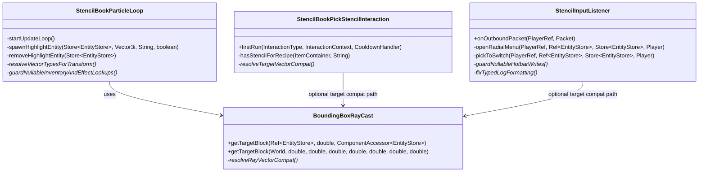
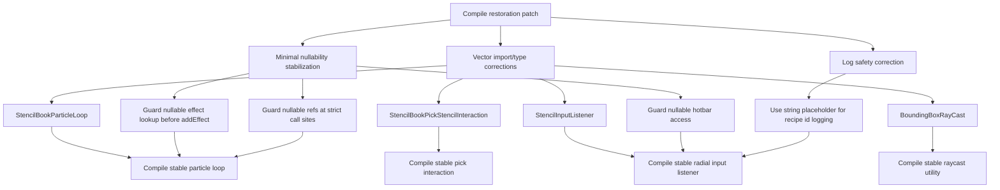
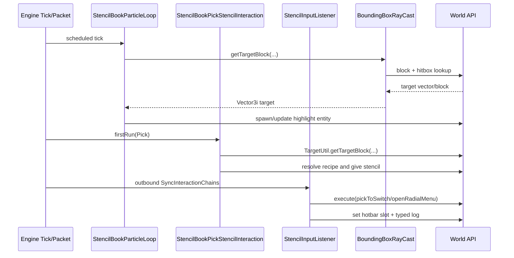

# Design: S2605261205 Compile Restoration for Vector Type Drift

## 1. Overview
This design restores compilation after the decompile API update moved or renamed vector types used in stencil and stencil interaction paths. The patch is intentionally mechanical and behavior-preserving: adjust vector imports/types, apply only minimal nullability guards required for compile stability, and fix one logging type-safety risk. The core principle is to isolate API-compatibility edits to the four scoped files without changing gameplay flow.

## 2. Design Priorities
- 1) Minimality: smallest mechanical delta in only the scoped files
- 2) Compile stability: resolve unresolved vector types and tightened nullability contracts
- 3) Behavior preservation: no interaction flow or game logic changes
- 4) Log/runtime safety: avoid format-type mismatch and avoid obvious nullable call-site hazards
- 5) Framework-native patterns: keep existing APIs and style, avoid new abstraction layers

## 3. Component Diagram


## 4. Responsibility Map


## 5. Sequence Diagram


## 6. Package Structure
```text
src/main/java/com/CodeCreature/
├── ui/
│   ├── stencilbook/
│   │   ├── StencilBookParticleLoop.java
│   │   └── StencilBookPickStencilInteraction.java
│   └── radial/
│       └── StencilInputListener.java
└── util/
    └── BoundingBoxRayCast.java

docs/
└── design-s2605261205-compile-restoration-vector-types.md
```

## 7. Integration Changes Required
- File: src/main/java/com/CodeCreature/ui/stencilbook/StencilBookParticleLoop.java
- Modification: Replace old vector imports/types with updated API equivalents where used by transform/target handling; add minimal null guards at nullable hotbar/effect/ref call sites needed for strict compile checks.
- Migration cleanup after implementation: remove temporary compatibility TODO markers and any temporary fallback comments.

- File: src/main/java/com/CodeCreature/ui/stencilbook/StencilBookPickStencilInteraction.java
- Modification: Apply mechanical target vector type/import correction (if required by new API) without changing interaction flow.
- Migration cleanup after implementation: remove temporary compatibility TODO markers.

- File: src/main/java/com/CodeCreature/ui/radial/StencilInputListener.java
- Modification: Apply mechanical target vector type/import correction (if required), guard nullable hotbar write call, and change recipe-id log placeholder to string-safe format.
- Migration cleanup after implementation: remove temporary compatibility TODO markers.

- File: src/main/java/com/CodeCreature/util/BoundingBoxRayCast.java
- Modification: Apply mechanical vector import/type corrections for ray start/end and returned block coordinates under updated API naming.
- Migration cleanup after implementation: remove temporary compatibility TODO markers.

- What can be deleted after migration:
- Any temporary compatibility comments/TODO anchors introduced for this compile-restoration handoff.

## 8. Open Questions
- Exact post-decompile vector package/type names to use for replacement are not encoded in this design and should be confirmed from current SDK symbols before implementation.
- Should stricter @Nonnull adapters (local precondition wrappers) be used, or are local guards plus early return preferred at each call site?
- Do we want to keep using TargetUtil in interaction classes if BoundingBoxRayCast becomes the only compile-safe target source in the updated API?

## 9. Handoff Checklist
- [x] Component diagram included
- [x] Responsibility map included
- [x] All interfaces have Javadoc contracts
- [x] All skeleton files created with TODO markers
- [x] Integration Changes Required section populated
- [x] Open Questions section populated (even if empty)
- [x] Task Decomposition section populated

## 10. Task Decomposition

### Wave 1 (no dependencies - can run in parallel)

#### Unit: BoundingBoxRayCast.java
- Methods: getTargetBlock(Ref..., ...), getTargetBlock(World, ...)
- Contract: Restore compile by mechanically correcting vector API usage while preserving exact raycast behavior.
- Dependencies: none
- Done when: file compiles with updated vector types and returns same target semantics.

#### Unit: StencilBookPickStencilInteraction.java
- Methods: firstRun(...)
- Contract: Keep pick-to-stencil flow unchanged while applying only mechanical vector-type alignment if needed.
- Dependencies: none
- Done when: file compiles against updated target/vector signatures without changing recipe selection behavior.

#### Unit: StencilInputListener.java
- Methods: onOutboundPacket(...), pickToSwitch(...), openRadialMenu(...)
- Contract: Preserve Use/Pick behavior, compile under updated vector/nullability contracts, and keep logging type-safe.
- Dependencies: none
- Done when: compile warnings blocking build are resolved; log formatting no longer risks runtime format mismatch.

### Wave 2 (depends on Wave 1)

#### Unit: StencilBookParticleLoop.java
- Methods: startUpdateLoop(), spawnHighlightEntity(...), removeHighlightEntity(...), shutdown()
- Contract: Preserve highlight entity lifecycle while adopting updated vector contracts and minimal null-safety guards required for compile stability.
- Dependencies: BoundingBoxRayCast.java
- Done when: scheduled loop path compiles and particle spawn/remove behavior is unchanged.

### Wave 3 (integration - depends on Wave 2)

#### Unit: Integration verification wiring
- Files: all four scoped source files plus this design doc for traceability
- Contract: Ensure all compile-restoration edits are mechanical and scoped, with no behavior drift.
- Dependencies: all Wave 1 and Wave 2 units
- Done when: project compile passes and focused regression checks for stencil pick/use/highlight paths are green.
