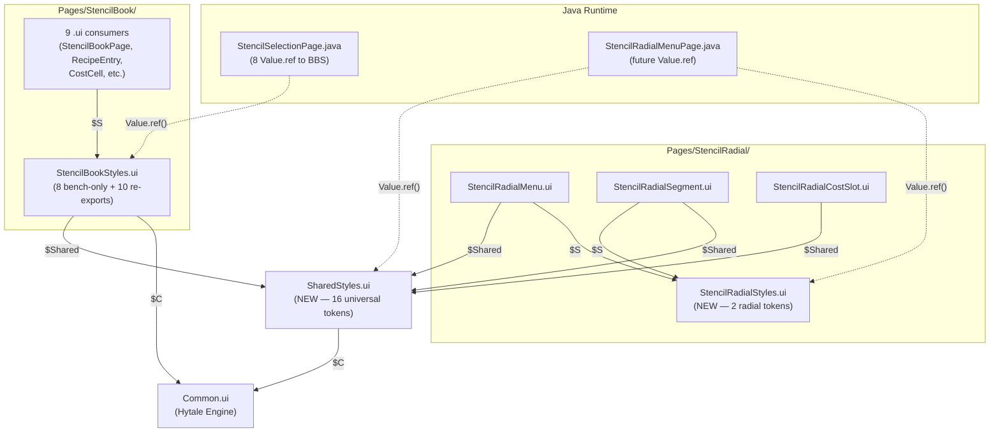
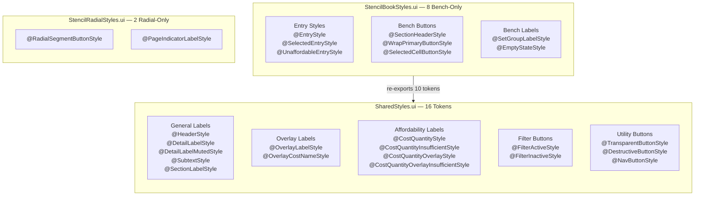
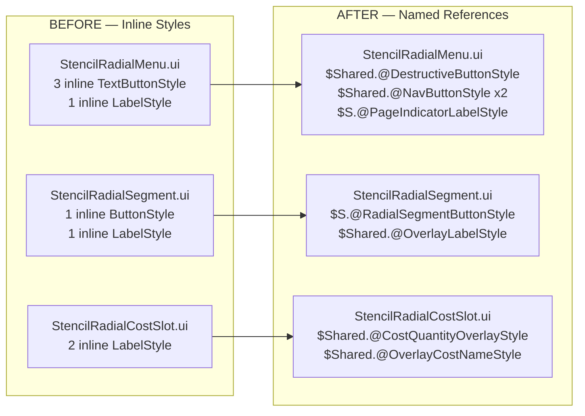

# Design: Shared Style Architecture

## 1. Overview

This design establishes a two-tier style hierarchy for the plugin's UI: a **SharedStyles.ui** file containing 16 universal style tokens used across all subsystems, and **per-subsystem style files** (StencilBookStyles.ui, StencilRadialStyles.ui) containing subsystem-specific tokens. StencilBookStyles.ui becomes a facade that re-exports shared tokens so existing `Value.ref()` paths remain valid. StencilRadial `.ui` files replace all inline styles with named references.

## 2. Design Priorities

1. **Zero visual regression** — every extracted style must exactly match its inline source
2. **Value.ref() path stability** — all 8 runtime lookups in StencilSelectionPage.java must continue resolving via `Pages/StencilBook/StencilBookStyles.ui`
3. **Framework-native patterns** — use `$Alias = "path.ui"` import and `$Alias.@TokenName` referencing, matching established conventions
4. **Simplicity** — flat token lists, no nested inheritance hierarchies beyond what already exists
5. **Extensibility** — new subsystems import SharedStyles.ui directly; no knowledge of StencilBook required

## 3. File Hierarchy Diagram



## 4. Token Distribution Map



## 5. Inline Style Extraction Map



## 6. Package Structure

```
src/main/resources/Common/UI/Custom/
├── Common.ui                              (Hytale engine — unchanged)
├── SharedStyles.ui                        (NEW — 16 universal tokens)
└── Pages/
    ├── StencilBook/
    │   ├── StencilBookStyles.ui        (MODIFIED — facade + 8 bench-only)
    │   ├── StencilBookPage.ui          (unchanged)
    │   ├── RecipeEntry.ui                 (unchanged — $S refs still resolve)
    │   ├── CostCell.ui                    (unchanged)
    │   ├── RecipeIconCell.ui              (unchanged)
    │   ├── MaterialGroupButton.ui         (unchanged)
    │   ├── GroupFilterButton.ui           (unchanged)
    │   ├── ExactItemFilterButton.ui       (unchanged)
    │   ├── SetGroupContainer.ui           (unchanged)
    │   └── IngredientGroupHeader.ui       (unchanged)
    └── StencilRadial/
        ├── StencilRadialStyles.ui         (NEW — 2 radial-specific tokens)
        ├── StencilRadialMenu.ui           (MODIFIED — inline → refs)
        ├── StencilRadialSegment.ui        (MODIFIED — inline → refs)
        └── StencilRadialCostSlot.ui       (MODIFIED — inline → refs)
```

---

## 7. Complete File Contents

### 7A. SharedStyles.ui (NEW)

**Path:** `Common/UI/Custom/SharedStyles.ui`

```
// Plugin-wide shared style tokens
// Imported by per-subsystem style files and .ui templates across all subsystems
// Convention: $Shared = "../../SharedStyles.ui" (from Pages/*/), $Shared = "SharedStyles.ui" (from Custom/)

$C = "Common.ui";

// ═══════════════════════════════════════════════════════
// Label Styles — General
// ═══════════════════════════════════════════════════════

@HeaderStyle = LabelStyle(
    ...$C.@DefaultLabelStyle,
    FontSize: 22, RenderBold: true,
    HorizontalAlignment: Start, VerticalAlignment: Center
);

@DetailLabelStyle = LabelStyle(
    ...$C.@DefaultLabelStyle,
    FontSize: 16, RenderBold: true,
    HorizontalAlignment: Start, VerticalAlignment: Center
);

@DetailLabelMutedStyle = LabelStyle(
    ...$C.@DefaultLabelStyle,
    FontSize: 16, TextColor: #6e7da1, RenderBold: true,
    HorizontalAlignment: Start, VerticalAlignment: Center
);

@SubtextStyle = LabelStyle(
    ...$C.@DefaultLabelStyle,
    FontSize: 12, TextColor: #6e7da1,
    HorizontalAlignment: Start, VerticalAlignment: Center
);

@SectionLabelStyle = LabelStyle(
    ...$C.@DefaultLabelStyle,
    FontSize: 13, TextColor: #6e7da1, RenderBold: true,
    HorizontalAlignment: Start, VerticalAlignment: Center
);

// ═══════════════════════════════════════════════════════
// Label Styles — Overlay (bold + outline for readability over images)
// ═══════════════════════════════════════════════════════

@OverlayLabelStyle = LabelStyle(
    FontSize: 10, TextColor: #ffffff,
    HorizontalAlignment: Center, Wrap: true,
    RenderBold: true, OutlineColor: #000000
);

@OverlayCostNameStyle = LabelStyle(
    FontSize: 9, TextColor: #ffffff,
    HorizontalAlignment: Center, Wrap: true,
    RenderBold: true, OutlineColor: #000000
);

// ═══════════════════════════════════════════════════════
// Label Styles — Affordability State
// ═══════════════════════════════════════════════════════

// Panel variant (StencilBook detail panel — no outline, inherits DefaultLabelStyle)
@CostQuantityStyle = LabelStyle(
    ...$C.@DefaultLabelStyle,
    FontSize: 11, TextColor: #ffffff,
    HorizontalAlignment: End, VerticalAlignment: End
);

@CostQuantityInsufficientStyle = LabelStyle(
    ...$C.@DefaultLabelStyle,
    FontSize: 11, TextColor: #ff4444,
    HorizontalAlignment: End, VerticalAlignment: End
);

// Overlay variant (StencilRadial cost arc — bold + outline for readability over icons)
@CostQuantityOverlayStyle = LabelStyle(
    FontSize: 11, TextColor: #ffcc00,
    HorizontalAlignment: End,
    RenderBold: true, OutlineColor: #000000
);

@CostQuantityOverlayInsufficientStyle = LabelStyle(
    FontSize: 11, TextColor: #ff4444,
    HorizontalAlignment: End,
    RenderBold: true, OutlineColor: #000000
);

// ═══════════════════════════════════════════════════════
// Button Styles — Filter State
// ═══════════════════════════════════════════════════════

@FilterActiveStyle = TextButtonStyle(
    Default: (Background: $C.@DefaultSquareButtonDefaultBackground, LabelStyle: (FontSize: 11, TextColor: #ffffff,
              HorizontalAlignment: Center, VerticalAlignment: Center)),
    Hovered: (Background: $C.@DefaultSquareButtonHoveredBackground, LabelStyle: (FontSize: 11, TextColor: #ffffff,
              HorizontalAlignment: Center, VerticalAlignment: Center)),
    Pressed: (Background: $C.@DefaultSquareButtonPressedBackground, LabelStyle: (FontSize: 11, TextColor: #ffffff,
              HorizontalAlignment: Center, VerticalAlignment: Center))
);

@FilterInactiveStyle = TextButtonStyle(
    Default: (Background: $C.@TertiaryDefaultButtonBackground, LabelStyle: (FontSize: 11, TextColor: #6e7da1,
              HorizontalAlignment: Center, VerticalAlignment: Center)),
    Hovered: (Background: $C.@TertiaryHoveredButtonBackground, LabelStyle: (FontSize: 11, TextColor: #96a9be,
              HorizontalAlignment: Center, VerticalAlignment: Center)),
    Pressed: (Background: $C.@TertiaryPressedButtonBackground, LabelStyle: (FontSize: 11, TextColor: #96a9be,
              HorizontalAlignment: Center, VerticalAlignment: Center))
);

// ═══════════════════════════════════════════════════════
// Button Styles — Utility
// ═══════════════════════════════════════════════════════

@TransparentButtonStyle = TextButtonStyle(
    Default: (Background: $C.@TertiaryDefaultButtonBackground, LabelStyle: (FontSize: 1, TextColor: #000000(0.0))),
    Hovered: (Background: $C.@TertiaryHoveredButtonBackground, LabelStyle: (FontSize: 1, TextColor: #000000(0.0))),
    Pressed: (Background: $C.@TertiaryPressedButtonBackground, LabelStyle: (FontSize: 1, TextColor: #000000(0.0)))
);

@DestructiveButtonStyle = TextButtonStyle(
    Default: (Background: #8b2020(0.9),
             LabelStyle: (FontSize: 18, TextColor: #ffffff, HorizontalAlignment: Center, VerticalAlignment: Center)),
    Hovered: (Background: #cc3333(0.9),
             LabelStyle: (FontSize: 18, TextColor: #ffffff, HorizontalAlignment: Center, VerticalAlignment: Center)),
    Pressed: (Background: #661515(0.9),
             LabelStyle: (FontSize: 18, TextColor: #ffffff, HorizontalAlignment: Center, VerticalAlignment: Center))
);

@NavButtonStyle = TextButtonStyle(
    Default: (Background: $C.@TertiaryDefaultButtonBackground,
             LabelStyle: (FontSize: 16, TextColor: #ffffff, HorizontalAlignment: Center, VerticalAlignment: Center)),
    Hovered: (Background: $C.@TertiaryHoveredButtonBackground,
             LabelStyle: (FontSize: 16, TextColor: #ffffff, HorizontalAlignment: Center, VerticalAlignment: Center)),
    Pressed: (Background: $C.@TertiaryPressedButtonBackground,
             LabelStyle: (FontSize: 16, TextColor: #ffffff, HorizontalAlignment: Center, VerticalAlignment: Center))
);
```

### 7B. StencilRadialStyles.ui (NEW)

**Path:** `Common/UI/Custom/Pages/StencilRadial/StencilRadialStyles.ui`

```
// Stencil Radial — subsystem-specific styles
// Tokens here are unique to the radial menu and not shared across subsystems

// ── Segment Button ──

@RadialSegmentButtonStyle = ButtonStyle(
    Hovered: (Background: #3a7bd5(0.8)),
    Pressed: (Background: #2a5ba0(0.9))
);

// ── Page Navigation Indicator ──

@PageIndicatorLabelStyle = LabelStyle(
    FontSize: 14, TextColor: #aaaaaa,
    HorizontalAlignment: Center, VerticalAlignment: Center
);
```

### 7C. StencilBookStyles.ui (MODIFIED)

**Path:** `Common/UI/Custom/Pages/StencilBook/StencilBookStyles.ui`

Changes:
- **Added:** `$Shared = "../../SharedStyles.ui"` import
- **Replaced:** 10 inline style definitions with re-export aliases from `$Shared`
- **Kept:** 8 bench-specific styles unchanged

```
// Stencil Crafting — shared styles
// Imported by StencilBookPage.ui and referenced by Java Value.ref
//
// FACADE PATTERN: Universal tokens are re-exported from SharedStyles.ui so that
// Value.ref("Pages/StencilBook/StencilBookStyles.ui", "TokenName") continues
// to resolve. New subsystems should import SharedStyles.ui directly instead.

$C = "../../Common.ui";
$Shared = "../../SharedStyles.ui";

// ═══════════════════════════════════════════════════════
// Re-exported Shared Tokens (canonical source: SharedStyles.ui)
// These aliases preserve existing Value.ref() and $S.@Token paths.
// ═══════════════════════════════════════════════════════

@HeaderStyle = $Shared.@HeaderStyle;
@DetailLabelStyle = $Shared.@DetailLabelStyle;
@DetailLabelMutedStyle = $Shared.@DetailLabelMutedStyle;
@SubtextStyle = $Shared.@SubtextStyle;
@SectionLabelStyle = $Shared.@SectionLabelStyle;
@CostQuantityStyle = $Shared.@CostQuantityStyle;
@CostQuantityInsufficientStyle = $Shared.@CostQuantityInsufficientStyle;
@FilterActiveStyle = $Shared.@FilterActiveStyle;
@FilterInactiveStyle = $Shared.@FilterInactiveStyle;
@TransparentButtonStyle = $Shared.@TransparentButtonStyle;

// ═══════════════════════════════════════════════════════
// Bench-Specific Styles (remain defined here)
// ═══════════════════════════════════════════════════════

// ── Button Styles ──

@SectionHeaderStyle = TextButtonStyle(
    Default: (Background: $C.@TertiaryDefaultButtonBackground, LabelStyle: (FontSize: 18, TextColor: #6e7da1, RenderBold: true,
              HorizontalAlignment: Start, VerticalAlignment: Center)),
    Hovered: (Background: $C.@TertiaryHoveredButtonBackground, LabelStyle: (FontSize: 18, TextColor: #96a9be, RenderBold: true,
              HorizontalAlignment: Start, VerticalAlignment: Center)),
    Pressed: (Background: $C.@TertiaryPressedButtonBackground, LabelStyle: (FontSize: 18, TextColor: #96a9be, RenderBold: true,
              HorizontalAlignment: Start, VerticalAlignment: Center))
);

@WrapPrimaryButtonStyle = TextButtonStyle(
    Default: (Background: PatchStyle(TexturePath: "../../Common/Buttons/Secondary.png", Border: $C.@ButtonBorder),
             LabelStyle: (Wrap: true, FontSize: 12, TextColor: #bdcbd3, RenderBold: true, RenderUppercase: true,
             HorizontalAlignment: Center, VerticalAlignment: Center)),
    Hovered: (Background: PatchStyle(TexturePath: "../../Common/Buttons/Secondary_Hovered.png", Border: $C.@ButtonBorder),
             LabelStyle: (Wrap: true, FontSize: 12, TextColor: #bdcbd3, RenderBold: true, RenderUppercase: true,
             HorizontalAlignment: Center, VerticalAlignment: Center)),
    Pressed: (Background: PatchStyle(TexturePath: "../../Common/Buttons/Secondary_Pressed.png", Border: $C.@ButtonBorder),
             LabelStyle: (Wrap: true, FontSize: 12, TextColor: #bdcbd3, RenderBold: true, RenderUppercase: true,
             HorizontalAlignment: Center, VerticalAlignment: Center))
);

// ── Recipe Entry Styles ──

@EntryStyle = TextButtonStyle(
    Default:  (Background: $C.@TertiaryDefaultButtonBackground, LabelStyle: (FontSize: 14, TextColor: #96a9be,
              HorizontalAlignment: Start, VerticalAlignment: Center)),
    Hovered:  (Background: $C.@TertiaryHoveredButtonBackground, LabelStyle: (FontSize: 14, TextColor: #ffffff,
              HorizontalAlignment: Start, VerticalAlignment: Center)),
    Pressed:  (Background: $C.@TertiaryPressedButtonBackground, LabelStyle: (FontSize: 14, TextColor: #ffffff,
              HorizontalAlignment: Start, VerticalAlignment: Center))
);

@SelectedEntryStyle = TextButtonStyle(
    Default:  (Background: $C.@DefaultSquareButtonDefaultBackground, LabelStyle: (FontSize: 14, TextColor: #ffffff,
              RenderBold: true, HorizontalAlignment: Start, VerticalAlignment: Center)),
    Hovered:  (Background: $C.@DefaultSquareButtonHoveredBackground, LabelStyle: (FontSize: 14, TextColor: #ffffff,
              RenderBold: true, HorizontalAlignment: Start, VerticalAlignment: Center)),
    Pressed:  (Background: $C.@DefaultSquareButtonPressedBackground, LabelStyle: (FontSize: 14, TextColor: #ffffff,
              RenderBold: true, HorizontalAlignment: Start, VerticalAlignment: Center))
);

@UnaffordableEntryStyle = TextButtonStyle(
    Default:  (Background: $C.@TertiaryDefaultButtonBackground, LabelStyle: (FontSize: 14, TextColor: #4a5568,
              HorizontalAlignment: Start, VerticalAlignment: Center)),
    Hovered:  (Background: $C.@TertiaryHoveredButtonBackground, LabelStyle: (FontSize: 14, TextColor: #5a6578,
              HorizontalAlignment: Start, VerticalAlignment: Center)),
    Pressed:  (Background: $C.@TertiaryPressedButtonBackground, LabelStyle: (FontSize: 14, TextColor: #5a6578,
              HorizontalAlignment: Start, VerticalAlignment: Center))
);

// ── Visual State Styles ──

@SelectedCellButtonStyle = TextButtonStyle(
    Default: (Background: $C.@TertiaryActiveButtonBackground, LabelStyle: (FontSize: 1, TextColor: #000000(0.0))),
    Hovered: (Background: $C.@TertiaryActiveButtonBackground, LabelStyle: (FontSize: 1, TextColor: #000000(0.0))),
    Pressed: (Background: $C.@TertiaryActiveButtonBackground, LabelStyle: (FontSize: 1, TextColor: #000000(0.0)))
);

// ── Set Group Styles ──

@SetGroupLabelStyle = LabelStyle(
    FontSize: 18, TextColor: #8b9bb5, RenderBold: true,
    HorizontalAlignment: Start, VerticalAlignment: Center
);

// ── Empty State Styles ──

@EmptyStateStyle = LabelStyle(
    FontSize: 11, TextColor: #6e7da1,
    HorizontalAlignment: Center, VerticalAlignment: Center
);
```

### 7D. StencilRadialMenu.ui (MODIFIED)

**Path:** `Common/UI/Custom/Pages/StencilRadial/StencilRadialMenu.ui`

Changes:
- **Replaced:** `$C = "../../Common.ui"` with `$Shared` and `$S` imports (`$C` no longer needed — its usage moved into SharedStyles.ui)
- **CloseBtn:** Inline `TextButtonStyle(...)` → `$Shared.@DestructiveButtonStyle`
- **PrevBtn:** Inline `TextButtonStyle(...)` → `$Shared.@NavButtonStyle`
- **NextBtn:** Inline `TextButtonStyle(...)` → `$Shared.@NavButtonStyle`
- **PageLabel:** Inline `Style: (...)` → `$S.@PageIndicatorLabelStyle`

```
// Stencil Radial Menu — page root
// Server appends StencilRadialSegment.ui instances into #Segments during build()
// Server positions each segment absolutely via Left/Top on the appended child

$Shared = "../../SharedStyles.ui";
$S = "StencilRadialStyles.ui";

Group {
    Anchor: (Full: 0);
    LayoutMode: Full;
    Background: #000000(0.5);

    // Centered container for the radial layout
    Group #RadialRoot {
        Anchor: (Width: 400, Height: 400);
        LayoutMode: Full;

        // Container for dynamically appended segments
        Group #Segments {
            Anchor: (Full: 0);
            LayoutMode: Full;
        }

        // Container for cost icon slots (outer ring, shown on hover)
        Group #CostSlots {
            Anchor: (Full: 0);
            LayoutMode: Full;
        }

        // Center hub — background panel with close, pagination, and delete
        Group #CenterHub {
            Anchor: (Width: 130, Height: 120, Left: 135, Top: 140);
            LayoutMode: Top;
            Padding: (Left: 5, Right: 5, Top: 6, Bottom: 6);

            // Close button (X) at top
            TextButton #CloseBtn {
                Anchor: (Width: 30, Height: 30);
                Text: "X";
                Style: $Shared.@DestructiveButtonStyle;
            }

            // Page navigation row
            Group #CenterNav {
                Anchor: (Width: 120, Height: 36);
                LayoutMode: Left;
                Padding: (Full: 2);

                TextButton #PrevBtn {
                    Anchor: (Width: 32, Height: 32);
                    Text: "<";
                    Style: $Shared.@NavButtonStyle;
                }

                Label #PageLabel {
                    Anchor: (Width: 48, Height: 32);
                    Style: $S.@PageIndicatorLabelStyle;
                    Text: "1 / 1";
                }

                TextButton #NextBtn {
                    Anchor: (Width: 32, Height: 32);
                    Text: ">";
                    Style: $Shared.@NavButtonStyle;
                }
            }

            // Delete button (trash icon)
            Group #DeleteBtn {
                Anchor: (Width: 32, Height: 32);
                Background: "../../Common/Icons/AssetNotifications/Trash.png";

                TextButton #DeleteBtnHit {
                    Text: "";
                    Anchor: (Full: 0);
                }
            }
        }
    }
}
```

### 7E. StencilRadialSegment.ui (MODIFIED)

**Path:** `Common/UI/Custom/Pages/StencilRadial/StencilRadialSegment.ui`

Changes:
- **Replaced:** `$C = "../../Common.ui"` with `$Shared` and `$S` imports
- **SegBtn:** Inline `Style: (Hovered: ..., Pressed: ...)` → `$S.@RadialSegmentButtonStyle`
- **SegLabelText:** Inline `Style: (...)` → `$Shared.@OverlayLabelStyle`

```
// Single radial segment — Group wrapper for positioning + Button for interaction
// Server sets Anchor on this Group for circular positioning
// Button handles hover/pressed visuals natively via Style states

$Shared = "../../SharedStyles.ui";
$S = "StencilRadialStyles.ui";

Group #SegRoot {
    Anchor: (Width: 116, Height: 126);
    LayoutMode: Full;

    Button #SegBtn {
        Anchor: (Width: 96, Height: 96, Left: 10, Top: 0);
        Background: #1a2030(0.7);
        Style: $S.@RadialSegmentButtonStyle;

        ItemIcon #SegIcon {
            Anchor: (Full: 4);
            ItemId: "";
            ShowItemTooltip: false;
        }
    }

    Group #SegLabel {
        Anchor: (Width: 116, Height: 28, Left: 0, Top: 97);

        Label #SegLabelText {
            Text: "";
            Anchor: (Full: 0);
            Style: $Shared.@OverlayLabelStyle;
        }
    }
}
```

> **Note:** `Background: #1a2030(0.7)` is kept on the `Button` element because the `ButtonStyle` only defines `Hovered` and `Pressed` state overrides. The element's `Background` property serves as the default state. This matches how the inline style worked — `Background` was a separate property from `Style`.

### 7F. StencilRadialCostSlot.ui (MODIFIED)

**Path:** `Common/UI/Custom/Pages/StencilRadial/StencilRadialCostSlot.ui`

Changes:
- **Added:** `$Shared = "../../SharedStyles.ui"` import
- **CostQty:** Inline `Style: (...)` → `$Shared.@CostQuantityOverlayStyle`
- **CostName:** Inline `Style: (...)` → `$Shared.@OverlayCostNameStyle`

```
// Single cost icon slot — positioned absolutely by server
// Non-interactive, display only

$Shared = "../../SharedStyles.ui";

Group {
    Anchor: (Width: 80, Height: 90);
    Visible: false;
    LayoutMode: Full;

    Group {
        Anchor: (Width: 64, Height: 64, Left: 8, Top: 0);
        Background: #0d1520(0.85);
        ItemIcon #CostIcon {
            Anchor: (Full: 4);
            ShowItemTooltip: false;
        }

        // Quantity badge — bottom-right of the icon
        Label #CostQty {
            Text: "";
            Anchor: (Width: 32, Height: 14, Left: 32, Top: 49);
            Style: $Shared.@CostQuantityOverlayStyle;
        }
    }

    Group #CostLabel {
        Anchor: (Width: 80, Height: 24, Left: 0, Top: 65);

        Label #CostName {
            Text: "";
            Anchor: (Full: 0);
            Style: $Shared.@OverlayCostNameStyle;
        }
    }
}
```

---

## 8. StencilBookStyles.ui Migration Detail

### Styles Moving to SharedStyles.ui (replaced with re-export alias)

| Token Name | Type | Value.ref()? | Re-export Line |
|---|---|---|---|
| `@HeaderStyle` | LabelStyle | No | `@HeaderStyle = $Shared.@HeaderStyle;` |
| `@DetailLabelStyle` | LabelStyle | Yes | `@DetailLabelStyle = $Shared.@DetailLabelStyle;` |
| `@DetailLabelMutedStyle` | LabelStyle | Yes | `@DetailLabelMutedStyle = $Shared.@DetailLabelMutedStyle;` |
| `@SubtextStyle` | LabelStyle | No | `@SubtextStyle = $Shared.@SubtextStyle;` |
| `@SectionLabelStyle` | LabelStyle | No | `@SectionLabelStyle = $Shared.@SectionLabelStyle;` |
| `@CostQuantityStyle` | LabelStyle | Yes | `@CostQuantityStyle = $Shared.@CostQuantityStyle;` |
| `@CostQuantityInsufficientStyle` | LabelStyle | Yes | `@CostQuantityInsufficientStyle = $Shared.@CostQuantityInsufficientStyle;` |
| `@FilterActiveStyle` | TextButtonStyle | Yes | `@FilterActiveStyle = $Shared.@FilterActiveStyle;` |
| `@FilterInactiveStyle` | TextButtonStyle | Yes | `@FilterInactiveStyle = $Shared.@FilterInactiveStyle;` |
| `@TransparentButtonStyle` | TextButtonStyle | Yes | `@TransparentButtonStyle = $Shared.@TransparentButtonStyle;` |

### Styles Remaining in StencilBookStyles.ui

| Token Name | Type | Reason |
|---|---|---|
| `@SectionHeaderStyle` | TextButtonStyle | Bench-specific collapsible section header |
| `@WrapPrimaryButtonStyle` | TextButtonStyle | Bench-specific wrapped craft button |
| `@EntryStyle` | TextButtonStyle | Recipe list entry display |
| `@SelectedEntryStyle` | TextButtonStyle | Selected recipe highlight |
| `@UnaffordableEntryStyle` | TextButtonStyle | Dimmed unaffordable recipe |
| `@SetGroupLabelStyle` | LabelStyle | Set group header |
| `@EmptyStateStyle` | LabelStyle | Empty state message |
| `@SelectedCellButtonStyle` | TextButtonStyle | Selected recipe cell highlight |

### Value.ref() Path Validation

All 8 constants in `StencilSelectionPage.java` reference `"Pages/StencilBook/StencilBookStyles.ui"`. After migration, StencilBookStyles.ui re-exports these tokens from SharedStyles.ui. The `Value.ref()` path resolves the token name within StencilBookStyles.ui's scope, which includes re-exported aliases.

| Java Constant | Token Name | Resolution Path |
|---|---|---|
| `FILTER_ACTIVE` | `FilterActiveStyle` | BBS → `$Shared.@FilterActiveStyle` → SharedStyles.ui |
| `FILTER_INACTIVE` | `FilterInactiveStyle` | BBS → `$Shared.@FilterInactiveStyle` → SharedStyles.ui |
| `CELL_SELECTED_STYLE` | `SelectedCellButtonStyle` | BBS → local definition (unchanged) |
| `CELL_UNSELECTED_STYLE` | `TransparentButtonStyle` | BBS → `$Shared.@TransparentButtonStyle` → SharedStyles.ui |
| `COST_QTY_NORMAL` | `CostQuantityStyle` | BBS → `$Shared.@CostQuantityStyle` → SharedStyles.ui |
| `COST_QTY_INSUFFICIENT` | `CostQuantityInsufficientStyle` | BBS → `$Shared.@CostQuantityInsufficientStyle` → SharedStyles.ui |
| `DETAIL_LABEL_NORMAL` | `DetailLabelStyle` | BBS → `$Shared.@DetailLabelStyle` → SharedStyles.ui |
| `DETAIL_LABEL_MUTED` | `DetailLabelMutedStyle` | BBS → `$Shared.@DetailLabelMutedStyle` → SharedStyles.ui |

---

## 9. Integration Changes Required

| File | Change | Detail |
|---|---|---|
| `StencilBookStyles.ui` | Modify | Add `$Shared` import, replace 10 inline definitions with re-export aliases |
| `StencilRadialMenu.ui` | Modify | Replace `$C` with `$Shared`+`$S`, replace 3 inline TextButtonStyles + 1 inline LabelStyle with references |
| `StencilRadialSegment.ui` | Modify | Replace `$C` with `$Shared`+`$S`, replace 1 inline ButtonStyle + 1 inline LabelStyle with references |
| `StencilRadialCostSlot.ui` | Modify | Add `$Shared` import, replace 2 inline LabelStyles with references |
| No Java files modified | — | Value.ref() paths unchanged; no Java changes in this feature |

---

## 10. Open Questions

1. **Re-export alias syntax:** Does `@TokenName = $Import.@TokenName;` work as a direct alias in the Hytale .ui DSL? This is the preferred re-export mechanism but is **unverified**. If it doesn't work, the fallback is to keep the full inline definitions in StencilBookStyles.ui and add a comment noting the canonical source is SharedStyles.ui. **Test this first before proceeding with the full migration.**

2. **ButtonStyle named type:** The `@RadialSegmentButtonStyle = ButtonStyle(...)` syntax assumes the `.ui` DSL supports `ButtonStyle` as a named type prefix (analogous to `TextButtonStyle` and `LabelStyle`). The existing code uses only inline `Style: (Hovered: ..., Pressed: ...)` for `Button` elements. If `ButtonStyle(...)` is not a recognized type, keep the style inline in `StencilRadialSegment.ui` and document the gap.

3. **Button.Background vs ButtonStyle.Default:** The design keeps `Background: #1a2030(0.7)` as a separate property on `#SegBtn` while the named `@RadialSegmentButtonStyle` only defines `Hovered` and `Pressed` states. Confirm that a named `ButtonStyle` with only Hovered/Pressed does not override/clear the element's `Background` property.

---

## 11. Migration Checklist

```markdown
## Pre-Migration
- [ ] Test re-export alias syntax: create a minimal .ui file with `@X = $Import.@X;` and verify it resolves
- [ ] Test ButtonStyle named type: create a minimal `@Y = ButtonStyle(Hovered: ..., Pressed: ...);` and verify it loads
- [ ] If either fails, apply the documented fallback (see Open Questions)

## File Creation
- [ ] Create `Common/UI/Custom/SharedStyles.ui` with all 16 tokens
- [ ] Create `Common/UI/Custom/Pages/StencilRadial/StencilRadialStyles.ui` with 2 tokens
- [ ] Server starts without UI parse errors

## StencilBook Migration
- [ ] Modify `StencilBookStyles.ui`: add $Shared import, replace 10 definitions with re-export aliases
- [ ] Open StencilBook — verify filter buttons toggle correctly (active/inactive styles)
- [ ] Verify recipe cells dim/highlight on selection (SelectedCellButtonStyle/TransparentButtonStyle)
- [ ] Verify cost quantities show white/red for affordable/unaffordable (CostQuantityStyle/InsufficientStyle)
- [ ] Verify detail panel output name mutes correctly (DetailLabelStyle/DetailLabelMutedStyle)
- [ ] Verify all 9 .ui files importing $S = "StencilBookStyles.ui" still render correctly

## StencilRadial Extraction
- [ ] Modify `StencilRadialMenu.ui`: replace imports and inline styles
- [ ] Modify `StencilRadialSegment.ui`: replace imports and inline styles
- [ ] Modify `StencilRadialCostSlot.ui`: add $Shared import and replace inline styles
- [ ] Open radial menu — verify close button renders red with white X
- [ ] Verify prev/next buttons render with tertiary background
- [ ] Verify page label renders "1 / 1" centered in gray
- [ ] Verify segment buttons show blue hover (#3a7bd5) and darker pressed (#2a5ba0)
- [ ] Verify segment labels render white bold with black outline
- [ ] Verify cost quantity badges render gold (#ffcc00) bold with black outline
- [ ] Verify cost name labels render white bold with black outline

## Post-Migration
- [ ] Full server restart — no UI parse errors in logs
- [ ] Smoke test both subsystems end-to-end
```

---

## 12. Handoff Checklist

- [x] Component diagram included
- [x] Responsibility map included (token distribution + extraction maps)
- [x] All style tokens have inline documentation comments
- [x] All skeleton files created with complete content
- [x] Integration Changes Required section populated
- [x] Open Questions section populated
- [x] Task Decomposition section populated

---

## 13. Task Decomposition

### Wave 1 (no dependencies — can run in parallel)

#### Unit: SharedStyles.ui
- **File**: `Common/UI/Custom/SharedStyles.ui`
- **Tokens**: All 16 token definitions
- **Contract**: Create the universal style token file; server must start without parse errors
- **Dependencies**: none
- **Done when**: File exists, server starts, tokens are defined and parseable

#### Unit: StencilRadialStyles.ui
- **File**: `Common/UI/Custom/Pages/StencilRadial/StencilRadialStyles.ui`
- **Tokens**: @RadialSegmentButtonStyle, @PageIndicatorLabelStyle
- **Contract**: Create the radial-specific style token file
- **Dependencies**: none
- **Done when**: File exists, server starts without parse errors

### Wave 2 (depends on Wave 1)

#### Unit: StencilBookStyles.ui facade migration
- **File**: `Common/UI/Custom/Pages/StencilBook/StencilBookStyles.ui`
- **Contract**: Replace 10 inline definitions with re-export aliases from SharedStyles.ui while preserving all 8 Value.ref() resolution paths
- **Dependencies**: Wave 1 SharedStyles.ui must exist
- **Done when**: All 9 .ui consumers and 8 Java Value.ref() paths resolve correctly; no visual regression in StencilBook

#### Unit: StencilRadial .ui inline style replacement
- **Files**: `StencilRadialMenu.ui`, `StencilRadialSegment.ui`, `StencilRadialCostSlot.ui`
- **Contract**: Replace all inline styles with $Shared/$S references; remove unused $C imports
- **Dependencies**: Wave 1 SharedStyles.ui and StencilRadialStyles.ui must exist
- **Done when**: Zero inline style definitions remain in StencilRadial .ui files; radial menu renders identically to before

### Wave 3 (integration — depends on Wave 2)

#### Unit: Full integration smoke test
- **Files**: All modified files
- **Contract**: Verify both subsystems work end-to-end after all changes
- **Dependencies**: All Wave 2 units complete
- **Done when**: Migration Checklist fully checked, server starts clean, both UIs render correctly

---

→ @Engineer implement docs/design-shared-style-architecture.md
