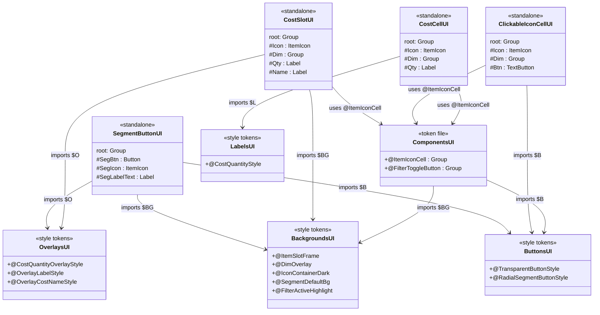
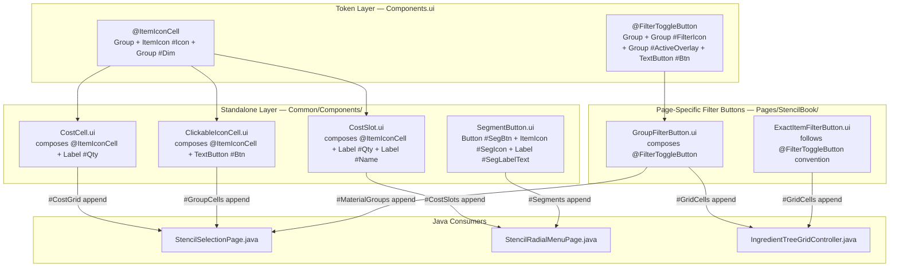
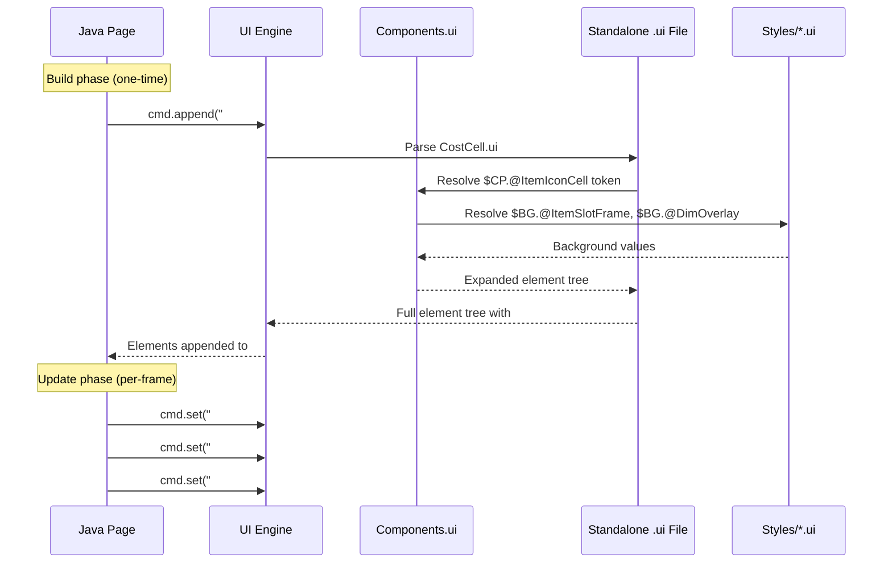

# Design: Shared UI Component Library

## 1. Overview

A shared component library that extracts common UI patterns (icon cells, filter toggles, cost displays, segment buttons) from page-specific `.ui` files into a centralized `Common/Components/` folder. Token components define reusable element trees with parameterized defaults; standalone files compose tokens for `cmd.append()`-based dynamic instantiation. This eliminates structural duplication across StencilBook and StencilRadial pages while standardizing element IDs for all Java selectors.

## 2. Design Priorities

1. **ID consistency** — every component uses canonical IDs; all Java selectors use the same names regardless of which page consumes the component
2. **Composition over duplication** — standalone files compose token components rather than repeating structural boilerplate
3. **Backward compatibility** — container IDs (`#CostGrid`, `#SetFilters`, `#RecipeGridArea`, `#MaterialGroups`, `#Segments`, `#CostSlots`, `#GroupCells`) are unchanged
4. **Minimal migration surface** — page-specific layout components (SetFilterButton, SetGroupContainer, IngredientGroupHeader, IngredientButtonGrid) are NOT migrated
5. **Style separation** — tokens reference existing style tokens (`$BG.@ItemSlotFrame`, etc.) and do NOT inline colors or asset paths

## 3. Component Diagram



## 4. Responsibility Map



## 5. Sequence Diagram



## 6. Package Structure

```
Common/UI/Custom/
├── Styles/
│   ├── Backgrounds.ui          ← existing (unchanged)
│   ├── Buttons.ui              ← existing (unchanged)
│   ├── Labels.ui               ← existing (unchanged)
│   ├── Overlays.ui             ← existing (unchanged)
│   └── Entries.ui              ← existing (unchanged)
├── Common/
│   ├── Icons/                  ← existing assets
│   ├── GroupIcons/              ← existing assets
│   └── Components/             ← NEW
│       ├── Components.ui       ← token definitions (@ItemIconCell, @FilterToggleButton)
│       ├── CostCell.ui         ← standalone (replaces Pages/StencilBook/CostCell.ui)
│       ├── ClickableIconCell.ui← standalone (replaces Pages/StencilBook/RecipeIconCell.ui)
│       ├── CostSlot.ui         ← standalone (replaces Pages/StencilRadial/StencilRadialCostSlot.ui)
│       └── SegmentButton.ui    ← standalone (replaces Pages/StencilRadial/StencilRadialSegment.ui)
└── Pages/
    ├── StencilBook/
    │   ├── StencilBookPage.ui       ← unchanged
    │   ├── GroupFilterButton.ui        ← REWRITTEN to compose @FilterToggleButton
    │   ├── ExactItemFilterButton.ui    ← REWRITTEN to follow @FilterToggleButton convention
    │   ├── SetFilterButton.ui          ← unchanged (NOT migrated)
    │   ├── SetGroupContainer.ui        ← unchanged (NOT migrated)
    │   ├── IngredientGroupHeader.ui    ← unchanged (NOT migrated)
    │   ├── IngredientButtonGrid.ui     ← unchanged (NOT migrated)
    │   ├── MaterialGroupButton.ui      ← DELETE (unused — superseded by GroupFilterButton.ui)
    │   ├── CostCell.ui                 ← DELETE after migration
    │   ├── CostIconCell.ui             ← DELETE after migration
    │   └── RecipeIconCell.ui           ← DELETE after migration
    └── StencilRadial/
        ├── StencilRadialMenu.ui        ← unchanged
        ├── StencilRadialCostSlot.ui    ← DELETE after migration
        └── StencilRadialSegment.ui     ← DELETE after migration
```

## 7. Token vs Standalone Rationale

| Component | Form | Rationale |
|---|---|---|
| `@ItemIconCell` | Token | Small, parameterized structural pattern (frame + icon + dim). Composed by 3 standalone files. No `cmd.append()` needed directly. |
| `@FilterToggleButton` | Token | Self-contained toggle pattern. Consumed directly via `$CP.@FilterToggleButton {}` in GroupFilterButton.ui — no additional elements needed. |
| `CostCell.ui` | Standalone | Needs `cmd.append()` for N dynamic instances. Adds Label `#Qty` to `@ItemIconCell` — extra element beyond the token. |
| `ClickableIconCell.ui` | Standalone | Needs `cmd.append()` for N dynamic instances. Adds TextButton `#Btn` to `@ItemIconCell` — extra element beyond the token. |
| `CostSlot.ui` | Standalone | Needs `cmd.append()`. Adds Label `#Qty` + Label `#Name` to `@ItemIconCell`. Also overrides `@Background`, `@IconPadding`, `@ShowTooltip`. |
| `SegmentButton.ui` | Standalone | Needs `cmd.append()`. Completely different structure (Button, not Group frame). Does not compose `@ItemIconCell`. |

---

## 8. Token Definitions (Components.ui)

**File:** `Common/UI/Custom/Common/Components/Components.ui`

```
// Shared UI component tokens
// Referenced from standalone .ui files via $CP = "Components.ui";
// Referenced from page files via $CP = "../../Common/Components/Components.ui";

$BG = "../../Styles/Backgrounds.ui";
$B = "../../Styles/Buttons.ui";

// ── Base Icon Cell ──
// Framed ItemIcon with dim overlay. Compose into standalone files
// that add extra elements (quantity labels, click buttons, etc.).
//
// Canonical IDs:
//   #Icon    — ItemIcon, set via cmd.set("#Icon.ItemId", ...)
//   #Dim     — Group overlay, set via cmd.set("#Dim.Visible", ...)
//
// @Params:
//   @Anchor       — override to set explicit size/position (default: fill parent)
//   @Background   — frame background token (default: $BG.@ItemSlotFrame)
//   @IconPadding   — inset from frame edge in px (default: 2)
//   @ShowTooltip   — whether ItemIcon shows native tooltip (default: true)

@ItemIconCell = Group {
    @Anchor = (Full: 0);
    @Background = $BG.@ItemSlotFrame;
    @IconPadding = 2;
    @ShowTooltip = true;
    Anchor: (...@Anchor);
    Background: @Background;
    ItemIcon #Icon {
        Anchor: (Full: @IconPadding);
        ShowItemTooltip: @ShowTooltip;
    }
    Group #Dim {
        Anchor: (Full: 2);
        Background: $BG.@DimOverlay;
        Visible: false;
    }
};

// ── Filter Toggle Button ──
// Icon frame with active-state overlay and transparent click target.
// Used for category/group filter buttons. The icon slot is a Group
// whose Background is set at runtime via cmd.set().
//
// For ItemIcon-based filter buttons (ExactItemFilterButton.ui), use
// the same structural convention and canonical IDs but replace the
// Group #FilterIcon with ItemIcon #FilterItemIcon.
//
// Canonical IDs:
//   #FilterIcon     — Group, set via cmd.set("#FilterIcon.Background", ...)
//   #ActiveOverlay  — Group, set via cmd.set("#ActiveOverlay.Visible", ...)
//   #Btn            — TextButton, bind via evt.addEventBinding(...)
//
// @Params:
//   @Width   — outer width (default: 36)
//   @Height  — outer height (default: 36)

@FilterToggleButton = Group {
    @Width = 36;
    @Height = 36;
    Anchor: (Width: @Width, Height: @Height);
    Padding: (Left: 2, Right: 2, Top: 2, Bottom: 2);
    Visible: false;
    Group {
        Anchor: (Full: 0);
        Background: $BG.@ItemSlotFrame;
        Group #FilterIcon {
            Anchor: (Full: 4);
        }
        Group #ActiveOverlay {
            Anchor: (Full: 0);
            Background: $BG.@FilterActiveHighlight;
            Visible: false;
        }
        TextButton #Btn {
            Text: "";
            Anchor: (Full: 0);
            Style: $B.@TransparentButtonStyle;
        }
    }
};
```

### Token @Param Summary

| Token | @Param | Type | Default | Purpose |
|---|---|---|---|---|
| `@ItemIconCell` | `@Anchor` | Anchor tuple | `(Full: 0)` | Size/position of the frame Group |
| | `@Background` | Background ref | `$BG.@ItemSlotFrame` | Frame background (asset path or color) |
| | `@IconPadding` | int | `2` | Inset of ItemIcon from frame edge |
| | `@ShowTooltip` | bool | `true` | Native item tooltip on hover |
| `@FilterToggleButton` | `@Width` | int | `36` | Outer element width |
| | `@Height` | int | `36` | Outer element height |

---

## 9. Standalone File Definitions

### CostCell.ui

**Replaces:** `Pages/StencilBook/CostCell.ui`
**Composition:** `@ItemIconCell` + quantity Label
**Root Visible:** `false` (Java shows/hides per slot)

```
// Shared cost cell — icon frame with quantity badge
// Appended N times via cmd.append("#CostGrid", "Common/Components/CostCell.ui")
// Java selectors: #CostGrid[N] #Icon, #CostGrid[N] #Qty, #CostGrid[N] #Dim

$CP = "Components.ui";
$L = "../../Styles/Labels.ui";

Group {
    Anchor: (Width: 60, Height: 60);
    Visible: false;
    Padding: (Full: 4);

    $CP.@ItemIconCell {}

    Label #Qty {
        Text: "";
        Anchor: (Height: 14, Bottom: 0, Right: 2);
        Style: $L.@CostQuantityStyle;
    }
}
```

**Element IDs:**
| ID | Type | Property set by Java | Purpose |
|---|---|---|---|
| `#Icon` | ItemIcon | `.ItemId` | Ingredient item icon |
| `#Dim` | Group | `.Visible` | Insufficient-quantity dim overlay |
| `#Qty` | Label | `.Text`, `.Style` | Quantity badge ("x5") |

---

### ClickableIconCell.ui

**Replaces:** `Pages/StencilBook/RecipeIconCell.ui`
**Composition:** `@ItemIconCell` + click TextButton (siblings in Full layout)
**Root Visible:** implicit (parent grid controls visibility)

```
// Shared clickable icon cell — icon frame with dim overlay and click target
// Appended N times via cmd.append("#GroupCells", "Common/Components/ClickableIconCell.ui")
// Java selectors: #GroupCells[N] #Icon, #GroupCells[N] #Dim, #GroupCells[N] #Btn

$CP = "Components.ui";
$B = "../../Styles/Buttons.ui";

Group {
    Anchor: (Width: 72, Height: 72);
    Padding: (Left: 4, Right: 4, Top: 4, Bottom: 4);

    $CP.@ItemIconCell { @IconPadding = 4; }

    TextButton #Btn {
        Text: "";
        Anchor: (Full: 2);
        Style: $B.@TransparentButtonStyle;
    }
}
```

**Layout note:** The root Group uses default layout (Full). Both `@ItemIconCell` (Anchor: Full: 0) and `TextButton #Btn` (Anchor: Full: 2) are siblings that overlap. The TextButton renders on top, receiving click events. This is visually identical to the original where the TextButton was a child of the frame Group.

**Element IDs:**
| ID | Type | Property set by Java | Purpose |
|---|---|---|---|
| `#Icon` | ItemIcon | `.ItemId` | Recipe output item icon |
| `#Dim` | Group | `.Visible` | Unaffordable dim overlay |
| `#Btn` | TextButton | `.Style` | Click target (selected/unselected style swap) |

---

### CostSlot.ui

**Replaces:** `Pages/StencilRadial/StencilRadialCostSlot.ui`
**Composition:** `@ItemIconCell` (with overrides) + quantity Label + name Label
**Root Visible:** `false` (Java shows/hides per slot)

```
// Shared cost slot — icon frame with quantity and name label (radial menu variant)
// Appended N times via cmd.append("#CostSlots", "Common/Components/CostSlot.ui")
// Java selectors: #CostSlots[N] #Icon, #CostSlots[N] #Dim, #CostSlots[N] #Qty, #CostSlots[N] #Name

$CP = "Components.ui";
$O = "../../Styles/Overlays.ui";
$BG = "../../Styles/Backgrounds.ui";

Group {
    Anchor: (Width: 80, Height: 90);
    Visible: false;
    LayoutMode: Full;

    $CP.@ItemIconCell {
        @Anchor = (Width: 64, Height: 64, Left: 8, Top: 0);
        @Background = $BG.@IconContainerDark;
        @IconPadding = 4;
        @ShowTooltip = false;
    }

    Label #Qty {
        Text: "";
        Anchor: (Width: 32, Height: 14, Left: 40, Top: 49);
        Style: $O.@CostQuantityOverlayStyle;
    }

    Group #CostLabel {
        Anchor: (Width: 80, Height: 24, Left: 0, Top: 65);
        Label #Name {
            Text: "";
            Anchor: (Full: 0);
            Style: $O.@OverlayCostNameStyle;
        }
    }
}
```

**Layout note:** The original placed `#Qty` inside the icon frame Group. In the new design, `#Qty` is a sibling positioned absolutely via `LayoutMode: Full`. Position adjusted from `(Left: 32, Top: 49)` inside the frame to `(Left: 40, Top: 49)` in the root (frame offset Left: 8 + original Left: 32 = 40).

**Style note:** This file imports `Overlays.ui` (not `Labels.ui`) because the radial menu uses bold+outline overlay styles (`@CostQuantityOverlayStyle`), not the panel-style `@CostQuantityStyle`. This distinction is handled at the standalone file level, not the token level.

**Element IDs:**
| ID | Type | Property set by Java | Purpose |
|---|---|---|---|
| `#Icon` | ItemIcon | `.ItemId` | Ingredient item icon |
| `#Dim` | Group | `.Visible` | Insufficient-quantity dim overlay |
| `#Qty` | Label | `.Text`, `.Style` | Quantity badge ("x5") |
| `#Name` | Label | `.Text` | Ingredient display name |

---

### SegmentButton.ui

**Replaces:** `Pages/StencilRadial/StencilRadialSegment.ui`
**Composition:** None — unique structure (Button, not Group frame)
**Root Visible:** implicit (controlled by parent)

```
// Shared radial segment button — large clickable button with icon and label
// Appended N times via cmd.append("#Segments", "Common/Components/SegmentButton.ui")
// Java selectors: #Segments[N] #SegBtn, #Segments[N] #SegIcon, #Segments[N] #SegLabelText

$B = "../../Styles/Buttons.ui";
$O = "../../Styles/Overlays.ui";
$BG = "../../Styles/Backgrounds.ui";

Group #SegRoot {
    Anchor: (Width: 116, Height: 126);
    LayoutMode: Full;

    Button #SegBtn {
        Anchor: (Width: 96, Height: 96, Left: 10, Top: 0);
        Background: $BG.@SegmentDefaultBg;
        Style: $B.@RadialSegmentButtonStyle;
        ItemIcon #SegIcon {
            Anchor: (Full: 4);
            ItemId: "";
            ShowItemTooltip: false;
        }
    }

    Group #SegLabel {
        Anchor: (Width: 116, Height: 28, Left: 0, Top: 97);
        Label #SegLabelText {
            Text: "";
            Anchor: (Full: 0);
            Style: $O.@OverlayLabelStyle;
        }
    }
}
```

**Design note:** SegmentButton does NOT compose `@ItemIconCell` because it uses a `Button` element (not a `Group` frame) and has no dim overlay. The IDs (`#SegBtn`, `#SegIcon`, `#SegLabelText`, `#SegRoot`) are kept unchanged from the original since they are unique to this component and already consistent.

**Element IDs:**
| ID | Type | Property set by Java | Purpose |
|---|---|---|---|
| `#SegRoot` | Group | — | Root container (event binding target) |
| `#SegBtn` | Button | — | Clickable button (event binding target) |
| `#SegIcon` | ItemIcon | `.ItemId` | Segment item icon |
| `#SegLabelText` | Label | `.Text` | Segment display name |

---

## 10. Rewritten Page-Specific Filter Buttons

These files stay at `Pages/StencilBook/` but are rewritten to compose the `@FilterToggleButton` token or follow its convention. Their `cmd.append()` paths are unchanged.

### GroupFilterButton.ui (rewritten)

```
// Group-icon filter toggle — composes @FilterToggleButton token directly
// cmd.append() path unchanged: Pages/StencilBook/GroupFilterButton.ui

$CP = "../../Common/Components/Components.ui";

$CP.@FilterToggleButton {}
```

The entire file becomes a single token instantiation. All element IDs (`#FilterIcon`, `#ActiveOverlay`, `#Btn`) come from the token definition.

### ExactItemFilterButton.ui (rewritten)

```
// Item-icon filter toggle — follows @FilterToggleButton convention with ItemIcon
// cmd.append() path unchanged: Pages/StencilBook/ExactItemFilterButton.ui
// Cannot compose @FilterToggleButton directly because icon element is ItemIcon, not Group

$BG = "../../Styles/Backgrounds.ui";
$B = "../../Styles/Buttons.ui";

Group {
    Anchor: (Width: 36, Height: 36);
    Padding: (Left: 2, Right: 2, Top: 2, Bottom: 2);
    Visible: false;

    Group {
        Anchor: (Full: 0);
        Background: $BG.@ItemSlotFrame;
        ItemIcon #FilterItemIcon {
            Anchor: (Full: 4);
        }
        Group #ActiveOverlay {
            Anchor: (Full: 0);
            Background: $BG.@FilterActiveHighlight;
            Visible: false;
        }
        TextButton #Btn {
            Text: "";
            Anchor: (Full: 0);
            Style: $B.@TransparentButtonStyle;
        }
    }
}
```

**Why not compose the token?** `@FilterToggleButton` provides `Group #FilterIcon` for background-image icons. ExactItemFilterButton needs `ItemIcon #FilterItemIcon` for item-ID icons. Since Hytale tokens are fixed element trees (no slot injection), ExactItemFilterButton follows the structural convention and canonical ID pattern but defines its own tree.

---

## 11. ID Standardization Table

### @ItemIconCell IDs (used in CostCell, ClickableIconCell, CostSlot)

| Component (old file) | Old ID | New Canonical ID | Element Type |
|---|---|---|---|
| CostCell.ui | `#CostIcon` | `#Icon` | ItemIcon |
| CostCell.ui | `#CostDim` | `#Dim` | Group |
| CostCell.ui | `#CostQty` | `#Qty` | Label |
| RecipeIconCell.ui | `#CellIcon` | `#Icon` | ItemIcon |
| RecipeIconCell.ui | `#CellDim` | `#Dim` | Group |
| RecipeIconCell.ui | `#CellBtn` | `#Btn` | TextButton |
| StencilRadialCostSlot.ui | `#CostIcon` | `#Icon` | ItemIcon |
| StencilRadialCostSlot.ui | `#CostDim` | `#Dim` | Group |
| StencilRadialCostSlot.ui | `#CostQty` | `#Qty` | Label |
| StencilRadialCostSlot.ui | `#CostName` | `#Name` | Label |

### @FilterToggleButton IDs (used in GroupFilterButton, ExactItemFilterButton)

| Component (old file) | Old ID | New Canonical ID | Element Type |
|---|---|---|---|
| GroupFilterButton.ui | `#GroupIcon` | `#FilterIcon` | Group |
| GroupFilterButton.ui | `#ActiveOverlay` | `#ActiveOverlay` | Group (unchanged) |
| GroupFilterButton.ui | `#GroupBtn` | `#Btn` | TextButton |
| ExactItemFilterButton.ui | `#ItemIconEl` | `#FilterItemIcon` | ItemIcon |
| ExactItemFilterButton.ui | `#ActiveOverlay` | `#ActiveOverlay` | Group (unchanged) |
| ExactItemFilterButton.ui | `#ItemBtn` | `#Btn` | TextButton |

### SegmentButton IDs (unchanged)

| Component (old file) | Old ID | New Canonical ID | Element Type |
|---|---|---|---|
| StencilRadialSegment.ui | `#SegRoot` | `#SegRoot` | Group (unchanged) |
| StencilRadialSegment.ui | `#SegBtn` | `#SegBtn` | Button (unchanged) |
| StencilRadialSegment.ui | `#SegIcon` | `#SegIcon` | ItemIcon (unchanged) |
| StencilRadialSegment.ui | `#SegLabelText` | `#SegLabelText` | Label (unchanged) |

---

## 12. Java cmd.append() Migration Table

| Java File | Old Path | New Path |
|---|---|---|
| `StencilSelectionPage.java` | `Pages/StencilBook/RecipeIconCell.ui` | `Common/Components/ClickableIconCell.ui` |
| `StencilSelectionPage.java` | `Pages/StencilBook/CostCell.ui` | `Common/Components/CostCell.ui` |
| `StencilRadialMenuPage.java` | `Pages/StencilRadial/StencilRadialCostSlot.ui` | `Common/Components/CostSlot.ui` |
| `StencilRadialMenuPage.java` | `Pages/StencilRadial/StencilRadialSegment.ui` | `Common/Components/SegmentButton.ui` |

**Unchanged paths** (files rewritten in-place, not moved):
| Java File | Path (unchanged) |
|---|---|
| `StencilSelectionPage.java` | `Pages/StencilBook/GroupFilterButton.ui` |
| `IngredientTreeGridController.java` | `Pages/StencilBook/GroupFilterButton.ui` |
| `IngredientTreeGridController.java` | `Pages/StencilBook/ExactItemFilterButton.ui` |

---

## 13. Java Selector Migration Table

### StencilSelectionPage.java

| Context | Old Selector | New Selector |
|---|---|---|
| Cost grid — icon | `#CostGrid[N] #CostIcon.ItemId` | `#CostGrid[N] #Icon.ItemId` |
| Cost grid — quantity | `#CostGrid[N] #CostQty.Text` | `#CostGrid[N] #Qty.Text` |
| Cost grid — quantity style | `#CostGrid[N] #CostQty.Style` | `#CostGrid[N] #Qty.Style` |
| Cost grid — dim | `#CostGrid[N] #CostDim.Visible` | `#CostGrid[N] #Dim.Visible` |
| Recipe cell — icon | `#GroupCells[N] #CellIcon.ItemId` | `#GroupCells[N] #Icon.ItemId` |
| Recipe cell — dim | `#GroupCells[N] #CellDim.Visible` | `#GroupCells[N] #Dim.Visible` |
| Recipe cell — button style | `#GroupCells[N] #CellBtn.Style` | `#GroupCells[N] #Btn.Style` |
| Material group — icon | `#MaterialGroups[N] #GroupIcon.Background` | `#MaterialGroups[N] #FilterIcon.Background` |
| Material group — active | `#MaterialGroups[N] #ActiveOverlay.Visible` | `#MaterialGroups[N] #ActiveOverlay.Visible` (unchanged) |
| Material group — event binding | `#MaterialGroups[N] #GroupBtn` | `#MaterialGroups[N] #Btn` |

### StencilRadialMenuPage.java

| Context | Old Selector | New Selector |
|---|---|---|
| Cost slot — icon | `#CostSlots[N] #CostIcon.ItemId` | `#CostSlots[N] #Icon.ItemId` |
| Cost slot — quantity | `#CostSlots[N] #CostQty.Text` | `#CostSlots[N] #Qty.Text` |
| Cost slot — quantity style | `#CostSlots[N] #CostQty.Style` | `#CostSlots[N] #Qty.Style` |
| Cost slot — dim | `#CostSlots[N] #CostDim.Visible` | `#CostSlots[N] #Dim.Visible` |
| Cost slot — name | `#CostSlots[N] #CostName.Text` | `#CostSlots[N] #Name.Text` |
| Segment — icon | `#Segments[N] #SegIcon.ItemId` | `#Segments[N] #SegIcon.ItemId` (unchanged) |
| Segment — label | `#Segments[N] #SegLabelText.Text` | `#Segments[N] #SegLabelText.Text` (unchanged) |
| Segment — event binding | `#Segments[N] #SegBtn` | `#Segments[N] #SegBtn` (unchanged) |

### IngredientTreeGridController.java

| Context | Old Selector | New Selector |
|---|---|---|
| Group filter — icon bg | `#GridCells[N] #GroupIcon.Background` | `#GridCells[N] #FilterIcon.Background` |
| Group filter — active | `#GridCells[N] #ActiveOverlay.Visible` | `#GridCells[N] #ActiveOverlay.Visible` (unchanged) |
| Group filter — event binding | `#GridCells[N] #GroupBtn` | `#GridCells[N] #Btn` |
| Item filter — icon | `#GridCells[N] #ItemIconEl.ItemId` | `#GridCells[N] #FilterItemIcon.ItemId` |
| Item filter — active | `#GridCells[N] #ActiveOverlay.Visible` | `#GridCells[N] #ActiveOverlay.Visible` (unchanged) |
| Item filter — event binding | `#GridCells[N] #ItemBtn` | `#GridCells[N] #Btn` |

---

## 14. Import Convention

### From Pages/*/* files (e.g., `Pages/StencilBook/GroupFilterButton.ui`)

```
$CP = "../../Common/Components/Components.ui";
```

### From within Common/Components/ (e.g., `CostCell.ui` → `Components.ui`)

```
$CP = "Components.ui";
```

### Style imports from Common/Components/ files

```
$BG = "../../Styles/Backgrounds.ui";
$B  = "../../Styles/Buttons.ui";
$L  = "../../Styles/Labels.ui";
$O  = "../../Styles/Overlays.ui";
```

### From Java Value.ref()

```java
// Style references remain unchanged — they reference Styles/ directly
Value.ref("Styles/Labels.ui", "CostQuantityStyle")
Value.ref("Styles/Buttons.ui", "TransparentButtonStyle")
```

---

## 15. Integration Changes Required

| File | Change | Detail |
|---|---|---|
| `StencilSelectionPage.java` | Update `cmd.append()` paths | 2 paths change (CostCell, RecipeIconCell) |
| `StencilSelectionPage.java` | Update `cmd.set()` selectors | ~12 selector string changes (see §13) |
| `StencilSelectionPage.java` | Update `evt.addEventBinding()` selectors | `#GroupBtn` → `#Btn` in `buildMaterialGroupBindings()` |
| `StencilRadialMenuPage.java` | Update `cmd.append()` paths | 2 paths change (CostSlot, Segment) |
| `StencilRadialMenuPage.java` | Update `cmd.set()` selectors | ~8 selector string changes (see §13) |
| `IngredientTreeGridController.java` | Update `cmd.set()` selectors | ~4 selector string changes (see §13) |
| `IngredientTreeGridController.java` | Update `evt.addEventBinding()` selectors | `#GroupBtn`/`#ItemBtn` → `#Btn` |
| `Pages/StencilBook/GroupFilterButton.ui` | Rewrite to compose token | File body replaced with `$CP.@FilterToggleButton {}` |
| `Pages/StencilBook/ExactItemFilterButton.ui` | Rewrite with canonical IDs | `#ItemIconEl` → `#FilterItemIcon`, `#ItemBtn` → `#Btn` |

---

## 16. Open Questions

1. **Anchor spread behavior:** The `@ItemIconCell` token uses `Anchor: (...@Anchor)` with `@Anchor = (Full: 0)` as default. Confirm that the engine resolves `...(Full: 0)` correctly when no override is provided (expected: yes, based on `@ContentSeparator` pattern in engine Common.ui).

2. **Sibling overlap for ClickableIconCell:** Moving the TextButton from inside the frame Group to a sibling of the token-expanded Group relies on default Full layout mode. Verify that child elements without explicit LayoutMode on the parent Group overlap correctly.

3. **CostSlot.ui label repositioning:** The `#Qty` Label moved from inside the frame to a sibling with adjusted absolute positioning (`Left: 32` → `Left: 40`). Verify visual parity with the original layout.

4. **MaterialGroupButton.ui status:** This file appears unused (not referenced by any `cmd.append()` call). Confirm it can be safely deleted.

---

## 17. Risk Assessment

| Risk | Severity | Mitigation |
|---|---|---|
| **ID rename breaks selectors** | High | Migration tables (§13) provide complete mapping. Implement path changes and selector changes atomically per Java file. Run `grep` for old IDs post-migration to catch orphans. |
| **Token composition — sibling layout** | Medium | ClickableIconCell.ui and CostSlot.ui rely on sibling overlap instead of parent-child nesting. Validate visually in the first wave. If broken, revert to inlined structure (no token composition). |
| **Asset path resolution from new location** | Medium | Standalone files in `Common/Components/` use `../../Styles/` paths. Token file uses the same prefix. Verify the engine resolves paths relative to the .ui file, not the consuming page. |
| **@Param default override semantics** | Low | If `@Anchor = (Full: 0)` default doesn't merge correctly via spread, fall back to omitting the Anchor property from the token and setting it in each standalone file wrapper. |
| **ExactItemFilterButton not composing token** | Low | ExactItemFilterButton follows the convention manually. If `@FilterToggleButton` token is updated, ExactItemFilterButton must be updated separately. Document this coupling. |

---

## 18. Handoff Checklist

- [x] Component diagram included
- [x] Responsibility map included
- [x] All token definitions have doc-comment contracts
- [x] All standalone file definitions included with full source
- [x] ID standardization table complete
- [x] cmd.append() path migration table complete
- [x] cmd.set() selector migration table complete
- [x] Integration Changes Required section populated
- [x] Open Questions section populated
- [x] Task Decomposition section populated (below)

---

## 19. Task Decomposition

### Wave 1: Create token definitions (no migration)

#### Unit: Components.ui
- **Files**: `Common/UI/Custom/Common/Components/Components.ui`
- **Content**: `@ItemIconCell` and `@FilterToggleButton` token definitions
- **Dependencies**: none (only references existing Styles/*.ui files)
- **Done when**: File parses without errors; tokens are resolvable via `$CP = "Components.ui"`

### Wave 2: Create standalone component files (no migration)

#### Unit: CostCell.ui
- **Files**: `Common/UI/Custom/Common/Components/CostCell.ui`
- **Contract**: Icon frame + quantity badge, composes `@ItemIconCell`
- **Dependencies**: Wave 1 (Components.ui must exist)
- **Done when**: File parses; `$CP.@ItemIconCell` resolves; IDs `#Icon`, `#Dim`, `#Qty` are present

#### Unit: ClickableIconCell.ui
- **Files**: `Common/UI/Custom/Common/Components/ClickableIconCell.ui`
- **Contract**: Icon frame + click target, composes `@ItemIconCell`
- **Dependencies**: Wave 1
- **Done when**: File parses; IDs `#Icon`, `#Dim`, `#Btn` are present

#### Unit: CostSlot.ui
- **Files**: `Common/UI/Custom/Common/Components/CostSlot.ui`
- **Contract**: Icon frame (dark bg, no tooltip) + quantity + name label
- **Dependencies**: Wave 1
- **Done when**: File parses; IDs `#Icon`, `#Dim`, `#Qty`, `#Name` are present

#### Unit: SegmentButton.ui
- **Files**: `Common/UI/Custom/Common/Components/SegmentButton.ui`
- **Contract**: Large button with icon + label below (no token composition)
- **Dependencies**: none (only references Styles/*.ui)
- **Done when**: File parses; IDs `#SegRoot`, `#SegBtn`, `#SegIcon`, `#SegLabelText` are present

### Wave 3: Migrate StencilBook to shared components

#### Unit: StencilSelectionPage.java migration
- **Files**: `StencilSelectionPage.java`, `Pages/StencilBook/GroupFilterButton.ui`
- **Changes**:
  - `cmd.append` paths: `RecipeIconCell.ui` → `Common/Components/ClickableIconCell.ui`, `CostCell.ui` → `Common/Components/CostCell.ui`
  - `cmd.set` selectors: all CostCell and RecipeIconCell IDs per §13
  - `evt.addEventBinding` selectors: `#GroupBtn` → `#Btn`
  - Rewrite `GroupFilterButton.ui` to compose `@FilterToggleButton`
  - `cmd.set` selectors: `#GroupIcon` → `#FilterIcon`
- **Dependencies**: Wave 2 (CostCell.ui, ClickableIconCell.ui must exist)
- **Done when**: StencilBook page renders correctly; all selectors target correct elements; no references to old IDs remain in this file

#### Unit: IngredientTreeGridController.java migration
- **Files**: `IngredientTreeGridController.java`, `Pages/StencilBook/ExactItemFilterButton.ui`
- **Changes**:
  - `cmd.set` selectors: `#GroupIcon` → `#FilterIcon`, `#ItemIconEl` → `#FilterItemIcon`, `#GroupBtn`/`#ItemBtn` → `#Btn`
  - `evt.addEventBinding` selectors: `#GroupBtn`/`#ItemBtn` → `#Btn`
  - Rewrite `ExactItemFilterButton.ui` with canonical IDs
- **Dependencies**: Wave 3 GroupFilterButton.ui rewrite (shared file)
- **Done when**: Ingredient tree renders correctly; filter toggles work with new IDs

### Wave 4: Migrate StencilRadial to shared components

#### Unit: StencilRadialMenuPage.java migration
- **Files**: `StencilRadialMenuPage.java`
- **Changes**:
  - `cmd.append` paths: `StencilRadialCostSlot.ui` → `Common/Components/CostSlot.ui`, `StencilRadialSegment.ui` → `Common/Components/SegmentButton.ui`
  - `cmd.set` selectors: all CostSlot IDs per §13 (Segment IDs unchanged)
- **Dependencies**: Wave 2 (CostSlot.ui, SegmentButton.ui must exist)
- **Done when**: Radial menu renders correctly; cost slots display and dim properly

### Wave 5: Delete old page-specific component files

#### Unit: Cleanup
- **Files to delete**:
  - `Pages/StencilBook/CostCell.ui`
  - `Pages/StencilBook/CostIconCell.ui`
  - `Pages/StencilBook/RecipeIconCell.ui`
  - `Pages/StencilBook/MaterialGroupButton.ui`
  - `Pages/StencilRadial/StencilRadialCostSlot.ui`
  - `Pages/StencilRadial/StencilRadialSegment.ui`
- **Dependencies**: Waves 3 + 4 (all consumers updated)
- **Done when**: `grep -r` for old file names returns zero results; build passes; both pages render correctly

---

→ @Engineer implement docs/design-shared-ui-components.md
