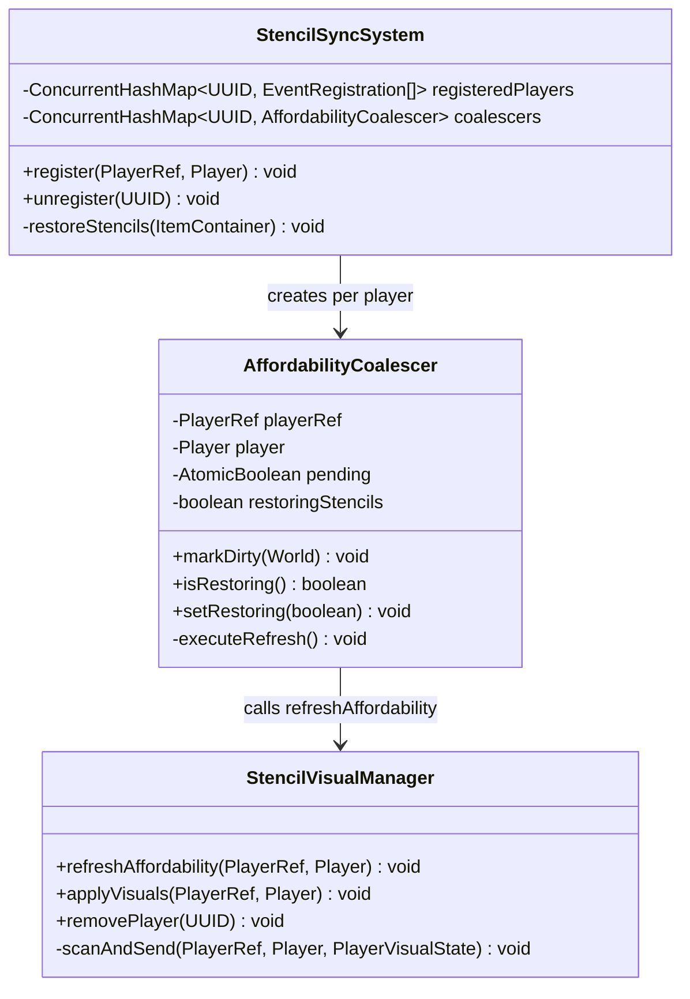
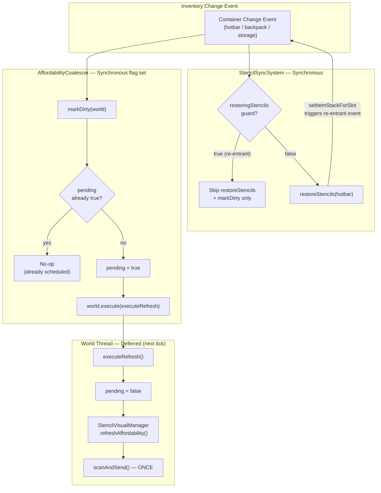
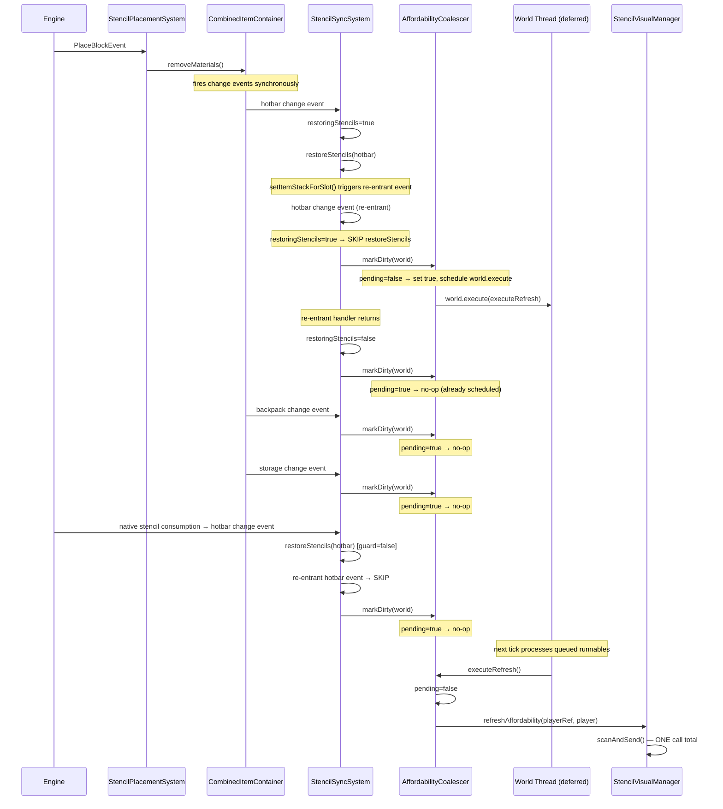

# Design — Stencil Event Cascade Debounce

**Date:** 2026-05-22  
**Status:** Ready for implementation  
**Addresses:** review-stencil-event-cascade-performance.md findings F1, F2  

---

## 1. Overview

A single stencil block placement fires 5–6 synchronous `refreshAffordability()` calls (40–48 `AutoCraftPlanner.plan()` invocations), freezing the server thread. This design introduces a **re-entrancy guard** on `restoreStencils` and a **dirty-flag coalescer** for `refreshAffordability`, reducing the cascade to exactly **1** deferred `scanAndSend()` per logical inventory mutation. The core principle is: **synchronous stencil restoration, eventually-consistent affordability**.

---

## 2. Design Priorities

1. **Server responsiveness** — eliminate server-thread blocking from redundant computation
2. **Minimal change surface** — fix contained to 2 files (StencilSyncSystem + new AffordabilityCoalescer)
3. **Correctness** — stencil qty restoration stays synchronous; affordability defers to next tick
4. **Simplicity** — no timers, no thread pools, no complex scheduling; one `AtomicBoolean` + `world.execute()`

---

## 3. Component Diagram



---

## 4. Responsibility Map



---

## 5. Sequence Diagram — Block Placement with Fix



---

## 6. Chosen Approach — Option B: Re-entrancy flag + AtomicBoolean coalescer + world.execute()

### Why Option B over Option A

| Criterion | Option A (volatile dirty flag) | Option B (AtomicBoolean + world.execute) |
|-----------|-------------------------------|------------------------------------------|
| **Atomicity** | `volatile boolean` has no CAS — two threads could both read `false` and both schedule | `AtomicBoolean.compareAndSet` is atomic — exactly one scheduler wins |
| **Scheduling guarantee** | Must manually track "is a world.execute pending" separately | `pending` flag IS the scheduling guard — one field, one concern |
| **Correctness** | Risk of lost updates if `dirty=false` before the deferred task reads it | `pending` is cleared INSIDE the deferred task, after it starts running |
| **Complexity** | Two fields (`dirty` + `scheduled`) | One field (`pending`) |

### Design decisions

1. **`AffordabilityCoalescer` is a standalone class** — not inlined into StencilSyncSystem, because it has its own state (`pending`, `restoringStencils`) and its own lifecycle per player. Keeps StencilSyncSystem's lambda handlers thin.

2. **`restoringStencils` is a plain `boolean`, not `AtomicBoolean`** — change events fire synchronously on the same thread. There is no cross-thread race on this flag. A volatile or atomic boolean would add unnecessary overhead.

3. **`pending` is `AtomicBoolean`** — because `markDirty()` is called from the change event handler (world thread) and `executeRefresh()` runs on the world thread via `world.execute()`. Both are on the world thread, but `world.execute()` queues rather than running inline, so the two calls cannot interleave. However, `AtomicBoolean` is chosen for correctness-by-default and because it's zero-cost compared to the `scanAndSend()` it guards.

4. **`world.execute()` is the deferral mechanism** — confirmed from engine docs that it always queues (never runs inline). This means all `markDirty()` calls from a single `removeMaterials()` cascade complete before `executeRefresh()` runs. Natural coalescing.

5. **No timer / no delay** — `world.execute()` runs on the next world tick (~50ms). This is the PO-approved latency budget. No `ScheduledExecutorService` needed.

### Cascade comparison

| Metric | Before | After | Reduction |
|--------|--------|-------|-----------|
| `refreshAffordability()` calls per placement | 5–6 | **1** | 83–85% |
| `scanAndSend()` calls per placement | 5–6 | **1** | 83–85% |
| `AutoCraftPlanner.plan()` calls per placement | 40–48 | **8** (1 per stencil) | 83% |
| `restoreStencils()` executions per placement | 4 (2 effective, 2 re-entrant no-ops) | **2** (1 effective restore + 1 re-entrant skip) | 50% |
| Slot reads per placement | 6,400–12,800 | **~800** | 88–94% |

---

## 7. Package Structure

```
src/main/java/com/CodeCreature/stencil/
├── AffordabilityCoalescer.java    ← NEW
├── StencilSyncSystem.java         ← MODIFIED (event handlers use coalescer)
├── StencilVisualManager.java      ← UNCHANGED
├── StencilPlacementSystem.java    ← UNCHANGED
└── ... (existing files unchanged)
```

---

## 8. Integration Changes Required

| File | Change | Reason |
|------|--------|--------|
| `StencilSyncSystem.java` | Add `coalescers` map, create `AffordabilityCoalescer` in `register()`, clean up in `unregister()`. Replace inline `refreshAffordability()` calls with `coalescer.markDirty(world)`. Wrap `restoreStencils()` with `coalescer.setRestoring(true/false)` guard. | Eliminates re-entrant cascade and coalesces affordability refresh. |
| `StencilSyncSystem.java` | `register()` signature gains `World` parameter, or obtains it from `player.getWorld()`. | `AffordabilityCoalescer.markDirty()` needs a `World` reference to call `world.execute()`. |
| No other files change. | — | — |

---

## 9. Edge Cases

### Player disconnects during pending refresh
- `unregister(uuid)` removes event handles AND removes the coalescer from the map.
- When the deferred `executeRefresh()` runs, it calls `refreshAffordability()` which checks `playerStates.get(uuid)` — returns `null` → no-op.
- **Safe.** No crash, no leak.

### Two placements in the same tick
- First placement's `removeMaterials()` fires events → `markDirty()` → `pending=true` → `world.execute()`
- Second placement's `removeMaterials()` fires events → `markDirty()` → `pending=true` → **no-op** (already scheduled)
- The single deferred `executeRefresh()` runs, sees final inventory state, sends one accurate packet.
- **Correct.** Player sees final state.

### Player with zero stencils in hotbar
- Change events still fire (player picked up/dropped items).
- `markDirty()` schedules one `executeRefresh()`.
- `scanAndSend()` iterates hotbar, finds no stencils, sends no packet.
- **Acceptable overhead:** one deferred no-op per inventory mutation cycle. Could optimize with a "has stencils" flag, but not worth the complexity for Wave 1.

### `world.execute()` called from within `world.execute()`
- Not applicable here — `markDirty()` is called from synchronous change event handlers, not from inside a `world.execute()` callback.

### `player.getWorld()` returns null
- Can happen if player is mid-disconnect. `markDirty()` should null-check the world parameter and skip scheduling if null.

---

## 10. Open Questions

| # | Question | Impact | Resolution |
|---|----------|--------|------------|
| Q1 | Does the engine guarantee that all `world.execute()` runnables queued during a tick execute in the **same** subsequent tick, or can they be spread across multiple ticks? | If spread, a second placement within the same tick might schedule a second `executeRefresh()` if the first already ran. Not harmful (just a second refresh), but worth knowing. | Low — double refresh is harmless. |
| Q2 | If `player.getWorld()` is `null` during very early connect/late disconnect, should we fall back to `HytaleServer.getDefaultWorld()`? | Only matters if change events fire during connect/disconnect race. | Low — `null` check and skip is sufficient. |

---

## Handoff Checklist

- [x] Component diagram included
- [x] Responsibility map included
- [x] All interfaces have Javadoc contracts
- [x] All skeleton files created with TODO markers
- [x] Integration Changes Required section populated
- [x] Open Questions section populated
- [x] Task Decomposition section populated

---

## Task Decomposition

### Wave 1 (no dependencies — can run in parallel)

#### Unit: AffordabilityCoalescer.java
- **Methods**: `markDirty(World)`, `isRestoring()`, `setRestoring(boolean)`, `executeRefresh()`
- **Contract**: Coalesces multiple synchronous `markDirty()` calls into a single deferred `refreshAffordability()` call via `world.execute()`. Guards re-entrant `restoreStencils` calls via a boolean flag.
- **Dependencies**: none (new class, no compile dependency on changes to StencilSyncSystem)
- **Done when**: Class compiles. `markDirty()` called N times results in exactly 1 `world.execute()` scheduling. `isRestoring()` returns correct guard state.

### Wave 2 (depends on Wave 1)

#### Unit: StencilSyncSystem.java modifications
- **Methods**: `register()` (modified), `unregister()` (modified), hotbar/backpack/storage event lambdas (modified)
- **Contract**: Replace direct `refreshAffordability()` calls with `coalescer.markDirty(world)`. Wrap `restoreStencils()` in re-entrancy guard using `coalescer.setRestoring(true/false)`.
- **Dependencies**: AffordabilityCoalescer.java (Wave 1)
- **Done when**: Single block placement triggers exactly 1 `scanAndSend()` call (verify via log output). Re-entrant `restoreStencils` calls are skipped. All 3 container change events coalesce into one deferred refresh.

### Wave 3 (integration — depends on Wave 2)

#### Unit: Integration verification
- **Files**: StencilSyncSystem.java, AffordabilityCoalescer.java
- **Contract**: Verify disconnect cleanup, multi-placement coalescing, zero-stencil no-op behavior
- **Dependencies**: Waves 1 and 2
- **Done when**: Full build passes. Place 1 block with 8 stencils in hotbar → logs show exactly 1 `scanAndSend()`. Disconnect mid-placement → no crash. Two rapid placements → 1-2 `scanAndSend()` calls (not 10-12).
