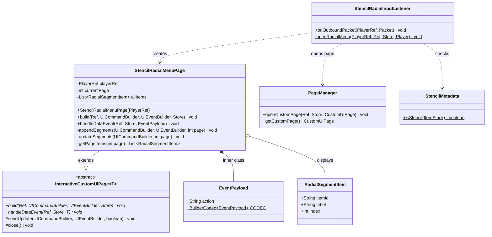
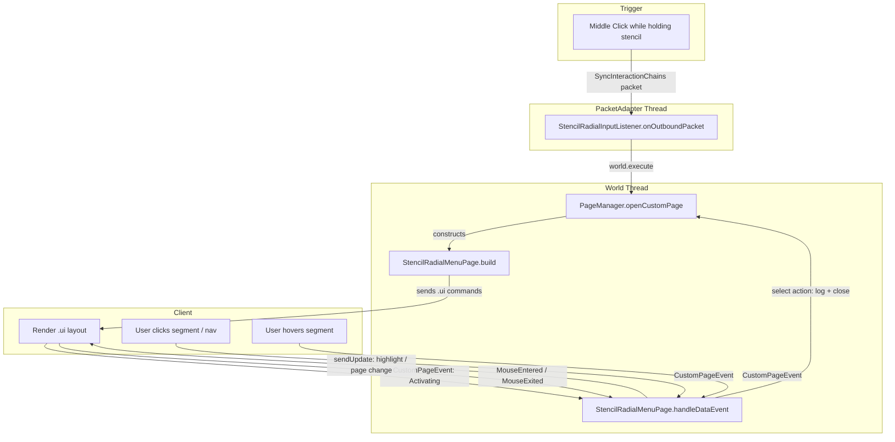
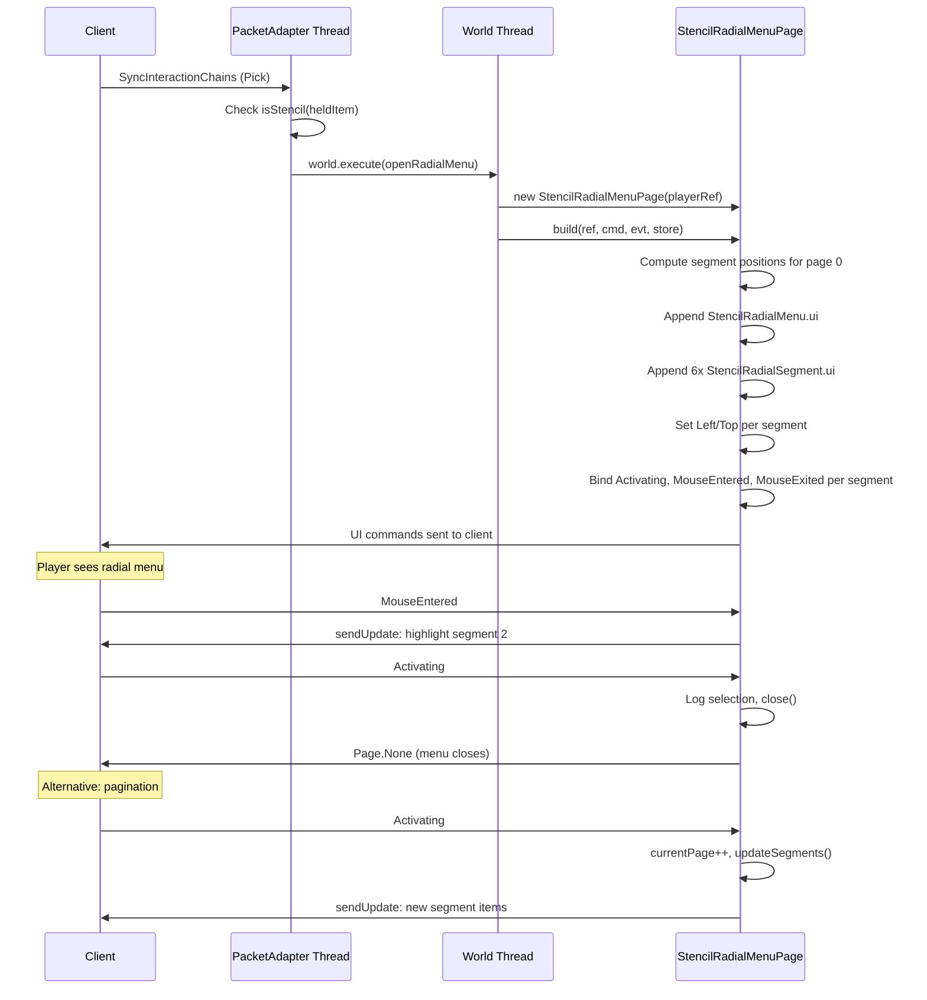

# Design: Stencil Radial Menu (POC)

## 1. Overview

A Custom UI radial menu that opens when a player middle-clicks while holding a blueprint stencil item. It displays rectangular segment buttons arranged in a circular orientation around center navigation controls (prev/next page). This is a proof-of-concept using dummy items to validate the circular-layout-via-absolute-positioning pattern within Hytale's `InteractiveCustomUIPage` system.

**Core design principle:** Simulate a radial menu using `LayoutMode: Full` with pre-computed trigonometric positions, since Hytale has no native radial/circular layout mode.

## 2. Design Priorities

1. **Simplicity** — POC with dummy data; minimal code surface
2. **Framework-native patterns** — Follow established `InteractiveCustomUIPage` + `.ui` template conventions already proven in `BlueprintSelectionPage`
3. **Testability** — Dummy item list is easily swappable for real data later
4. **Extensibility** — Pagination and segment count are parameterized for future adjustment

## 3. Component Diagram



## 4. Responsibility Map



## 5. Sequence Diagram



## 6. Package Structure

```
src/main/
├── java/com/UnobstructedThirdPerson/stencil/
│   ├── StencilRadialInputListener.java   ← MODIFY (open page instead of chat msg)
│   ├── StencilRadialMenuPage.java        ← NEW (InteractiveCustomUIPage)
│   ├── RadialSegmentItem.java            ← NEW (data record)
│   └── StencilMetadata.java              (existing, unchanged)
└── resources/Common/UI/Custom/Pages/StencilRadial/
    ├── StencilRadialMenu.ui              ← NEW (page template)
    └── StencilRadialSegment.ui           ← NEW (per-segment template)
```

## 7. Integration Changes Required

### `StencilRadialInputListener.java` — Modify `onOutboundPacket()`

**Current behavior:** Sends a chat message when Pick + stencil detected.

**New behavior:** Opens `StencilRadialMenuPage` via `PageManager.openCustomPage()`.

**Changes required:**
1. Add imports: `World`, `PageManager`, `StencilRadialMenuPage`
2. Replace the chat message block with `world.execute(() -> openRadialMenu(...))` call
3. Add private static `openRadialMenu()` method that:
   - Gets `Player` from store (re-resolve — may be on different thread)
   - Gets `PageManager`
   - Guards against existing custom page (`getCustomPage() != null`)
   - Creates and opens `StencilRadialMenuPage`

**Thread safety note:** The `onOutboundPacket` callback runs on the PacketAdapter/network thread. `openCustomPage` requires the world thread. The existing pattern in the codebase is `store.getExternalData().getWorld().execute(() -> { ... })`.

### No other existing files need modification.

## 8. Open Questions

1. **Screen resolution / scaling** — The absolute pixel positions (400×400 container, 140px radius) are designed for a standard HD screen. If the engine applies UI scaling, these values may need adjustment. Verify during POC testing.
2. **Segment size vs. dead zones** — With 6 segments of 56×56px at radius 140px, there will be ~40px gaps between segments. Acceptable for POC; may want larger segments or a closer radius later.
3. **Real item data source** — The POC uses dummy items. The production version will need a data source (e.g., stencil's available block variants, or filtered recipe outputs). Deferred to post-POC.
4. **Close on click outside** — The `CanDismissOrCloseThroughInteraction` lifetime should handle ESC and clicking outside the page content. Verify that clicking on the semi-transparent background (outside segments) dismisses the page.

## 9. Handoff Checklist

- [x] Component diagram included
- [x] Responsibility map included
- [x] All interfaces have Javadoc contracts
- [x] All skeleton files created with TODO markers
- [x] Integration Changes Required section populated
- [x] Open Questions section populated (even if empty)
- [x] Task Decomposition section populated

## 10. Task Decomposition

### Wave 1 (no dependencies — can run in parallel)

#### Unit: RadialSegmentItem.java
- **Methods**: Record constructor (itemId, label, index)
- **Contract**: Immutable data holder for a single segment slot's display info
- **Dependencies**: none
- **Done when**: Compiles, used by StencilRadialMenuPage

#### Unit: StencilRadialMenu.ui + StencilRadialSegment.ui
- **Files**: `resources/Common/UI/Custom/Pages/StencilRadial/StencilRadialMenu.ui`, `StencilRadialSegment.ui`
- **Contract**: Static .ui templates — the page root (background overlay + container + center nav) and per-segment button template
- **Dependencies**: none
- **Done when**: Templates load without error via `cmd.append()`

### Wave 2 (depends on Wave 1)

#### Unit: StencilRadialMenuPage.java
- **Methods**: `build()`, `handleDataEvent()`, `appendSegments()`, `updateSegments()`, `getPageItems()`, dummy item list
- **Contract**: Opens a Custom UI page showing 6 rectangular buttons in a circle with center prev/next navigation. Handles segment click (log + close), hover (highlight), and pagination (swap displayed items).
- **Dependencies**: RadialSegmentItem, .ui templates
- **Done when**: Page opens, displays 6 dummy segments in a circle, prev/next paginates, clicking a segment logs and closes, hover highlights

### Wave 3 (integration — depends on Wave 2)

#### Unit: StencilRadialInputListener.java modification
- **Files**: `StencilRadialInputListener.java`
- **Contract**: Replace chat message with `world.execute(() -> openRadialMenu(...))` that opens `StencilRadialMenuPage`
- **Dependencies**: StencilRadialMenuPage (Wave 2)
- **Done when**: Middle-click while holding stencil opens the radial menu instead of sending a chat message

---

## Appendix A: .ui File Specifications

### StencilRadialMenu.ui

```
// Stencil Radial Menu — page root
// Server appends StencilRadialSegment.ui instances into #Segments during build()
// Server positions each segment absolutely via Left/Top on the appended child

$C = "../../Common.ui";

Group {
    Anchor: (Full: 0);
    LayoutMode: Full;
    Background: #000000(0.5);

    // Centered container for the radial layout
    Group #RadialRoot {
        Anchor: (Width: 400, Height: 400);
        LayoutMode: Full;

        // Container for dynamically appended segments
        Group #Segments {
            Anchor: (Full: 0);
            LayoutMode: Full;
        }

        // Center navigation area
        Group #CenterNav {
            Anchor: (Width: 120, Height: 40, Left: 140, Top: 180);
            LayoutMode: Left;
            Background: #1a2030(0.9);

            TextButton #PrevBtn {
                Anchor: (Width: 32, Height: 32, Left: 4, Top: 4);
                Text: "<";
                Style: (FontSize: 16, TextColor: #ffffff, HorizontalAlignment: Center);
            }

            Label #PageLabel {
                Anchor: (Width: 48, Height: 32, Left: 40, Top: 4);
                Style: (FontSize: 14, TextColor: #aaaaaa, HorizontalAlignment: Center);
                Text: "1 / 1";
            }

            TextButton #NextBtn {
                Anchor: (Width: 32, Height: 32, Left: 84, Top: 4);
                Text: ">";
                Style: (FontSize: 16, TextColor: #ffffff, HorizontalAlignment: Center);
            }
        }

        // Hover label below the circle
        Label #HoverLabel {
            Anchor: (Width: 300, Height: 24, Left: 50, Top: 370);
            Style: (FontSize: 14, TextColor: #ffffff, HorizontalAlignment: Center);
            Text: "";
        }
    }
}
```

### StencilRadialSegment.ui

```
// Single radial segment — rectangular button with item icon and label
// Server sets Left/Top on this element for circular positioning

$C = "../../Common.ui";

Button #SegBtn {
    Anchor: (Width: 56, Height: 56);
    Background: #1a2030(0.7);

    ItemIcon #SegIcon {
        Anchor: (Full: 4);
        ItemId: "";
        ShowItemTooltip: false;
    }
}
```

## Appendix B: Circular Position Math

Constants used in `appendSegments()`:

| Constant | Value | Description |
|----------|-------|-------------|
| `SEGMENTS_PER_PAGE` | 6 | Buttons per page |
| `RADIUS` | 140 | Pixels from center to button center |
| `CENTER_X` | 200 | Container center X (400/2) |
| `CENTER_Y` | 200 | Container center Y (400/2) |
| `SEGMENT_W` | 56 | Segment button width |
| `SEGMENT_H` | 56 | Segment button height |

Position formula per segment `i` of `N`:
```java
double angle = (2 * Math.PI * i / N) - (Math.PI / 2); // start at top
int left = CENTER_X + (int)(RADIUS * Math.cos(angle)) - SEGMENT_W / 2;
int top  = CENTER_Y + (int)(RADIUS * Math.sin(angle)) - SEGMENT_H / 2;
```

Resulting positions for 6 segments:

| Slot | Angle (deg) | Left | Top | Position |
|------|-------------|------|-----|----------|
| 0 | 270° (top) | 172 | 32 | Top center |
| 1 | 330° | 293 | 102 | Upper right |
| 2 | 30° | 293 | 270 | Lower right |
| 3 | 90° (bottom) | 172 | 340 | Bottom center |
| 4 | 150° | 51 | 270 | Lower left |
| 5 | 210° | 51 | 102 | Upper left |

## Appendix C: Dummy Items

POC uses 12 dummy items across 2 pages:

```java
private static final List<RadialSegmentItem> DUMMY_ITEMS = List.of(
    new RadialSegmentItem("hytale:oak_log", "Oak Log", 0),
    new RadialSegmentItem("hytale:birch_log", "Birch Log", 1),
    new RadialSegmentItem("hytale:spruce_log", "Spruce Log", 2),
    new RadialSegmentItem("hytale:stone", "Stone", 3),
    new RadialSegmentItem("hytale:cobblestone", "Cobblestone", 4),
    new RadialSegmentItem("hytale:sandstone", "Sandstone", 5),
    new RadialSegmentItem("hytale:granite", "Granite", 6),
    new RadialSegmentItem("hytale:slate", "Slate", 7),
    new RadialSegmentItem("hytale:clay", "Clay", 8),
    new RadialSegmentItem("hytale:marble", "Marble", 9),
    new RadialSegmentItem("hytale:basalt", "Basalt", 10),
    new RadialSegmentItem("hytale:obsidian", "Obsidian", 11)
);
```
