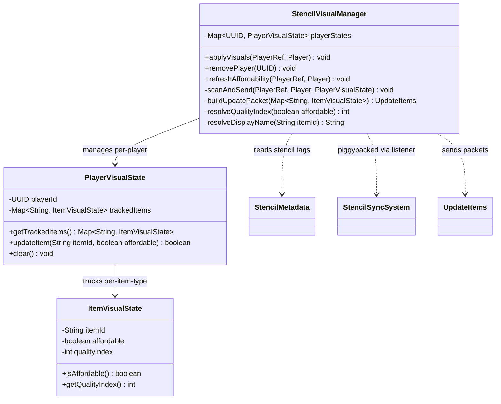
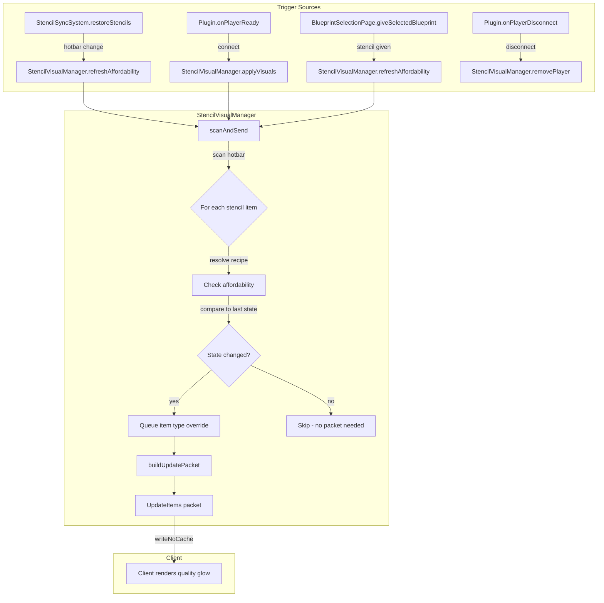
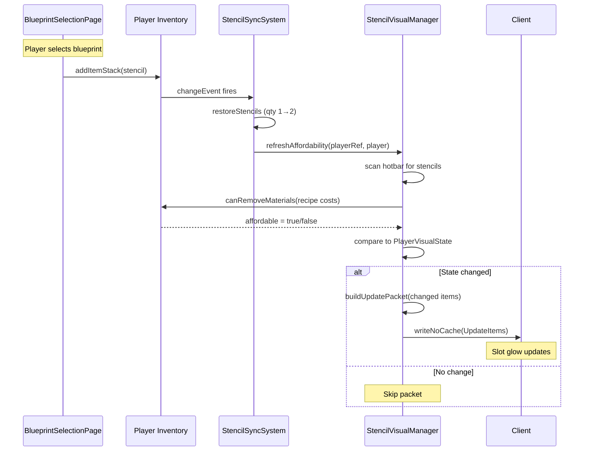

# Design: StencilVisualManager

## 1. Overview

StencilVisualManager provides per-player visual identity and real-time affordability indicators for blueprint stencil items in the hotbar. It overrides item display names (to `[Stencil] {Block Name}`) and swaps `ItemQuality` indices via `UpdateItems` packets to show distinctive slot glows — blue/green when affordable, red when not. The core design principle is **stateful delta tracking**: only send packets when affordability state actually changes.

## 2. Design Priorities

1. **Simplicity** — Single static utility class, no lifecycle management beyond a `ConcurrentHashMap`
2. **Performance** — Delta-based packet sending; batch all changed item types into one `UpdateItems` packet per player per event
3. **Framework-native patterns** — Follows the same `writeNoCache(UpdateItems)` pattern used by `BlockPreviewReskinManager` and `TransparentBlockUtils`
4. **Testability** — Pure state tracking separated from packet I/O; affordability checks use the same `canRemoveMaterials` path as `StencilPlacementSystem`

## 3. Component Diagram



## 4. Responsibility Map



## 5. Sequence Diagram

### Primary flow: Stencil enters hotbar



### Connect flow: Re-apply on `PlayerReadyEvent`

On connect, `applyVisuals()` is called after `StencilSyncSystem.register()`. It scans the hotbar, creates initial `PlayerVisualState`, and sends a single `UpdateItems` packet with all stencil item overrides — even if the player has no stencils (state is initialized empty, no packet sent).

## 6. Package Structure

```
src/main/java/com/UnobstructedThirdPerson/stencil/
├── StencilMetadata.java          (existing — unchanged)
├── StencilPlacementSystem.java   (existing — unchanged)
├── StencilSyncSystem.java        (existing — modified: add call to StencilVisualManager)
└── StencilVisualManager.java     (NEW)

src/main/resources/Server/Item/Items/_Debug/Stencil/
├── Stencil_Affordable.json       (NEW — ItemQuality asset)
└── Stencil_Unaffordable.json     (NEW — ItemQuality asset)
```

## 7. Integration Changes Required

### 7.1 StencilSyncSystem.java — Piggyback on change listener

**What:** After `restoreStencils()`, call `StencilVisualManager.refreshAffordability()` to re-evaluate visual state.

**Why:** The change listener already fires on every hotbar mutation. Adding a second listener would create ordering issues. Piggybacking ensures visuals update after qty restoration.

**Before:**
```java
hotbar.registerChangeEvent(event -> restoreStencils(hotbar));
```

**After:**
```java
hotbar.registerChangeEvent(event -> {
    restoreStencils(hotbar);
    StencilVisualManager.refreshAffordability(playerRef, player);
});
```

### 7.2 BlueprintSelectionPage.java — Trigger visual refresh after giving stencil

**What:** After `addItemStack(item)`, call `StencilVisualManager.refreshAffordability()`.

**Why:** The hotbar change listener will fire, but `BlueprintSelectionPage` has direct access to `playerRef` and `Player` which makes this a clearer integration point. However, since the change listener in `StencilSyncSystem` already fires on `addItemStack`, this call is **redundant** and should be omitted — the piggybacked call in 7.1 covers this case.

**Verdict:** No change needed in `BlueprintSelectionPage.java`. The listener-based path covers it.

### 7.3 UnobstructedThirdPersonPlugin.java — Register and cleanup

**`onPlayerReady`** — After `StencilSyncSystem.register()`, call `StencilVisualManager.applyVisuals()`:

```java
// existing:
StencilSyncSystem.register(playerRef, player);

// add after:
StencilVisualManager.applyVisuals(playerRef, player);
```

**`onPlayerDisconnect`** — Before or after `StencilSyncSystem.unregister()`, call `StencilVisualManager.removePlayer()`:

```java
// existing:
StencilSyncSystem.unregister(playerRef.getUuid());

// add after:
StencilVisualManager.removePlayer(playerRef.getUuid());
```

## 8. Open Questions

1. **Quality asset textures:** The `Stencil_Affordable` and `Stencil_Unaffordable` quality assets reference slot/tooltip textures that don't exist yet. They reuse the `Default` textures as placeholders. Custom textures (blue glow, red glow) need to be created by an artist or the texture paths updated once available.

2. **BlockGroup affordability:** `StencilPlacementSystem` does not check `BlockGroup` membership for affordability — only raw recipe materials. Should `StencilVisualManager` match this simpler check (recipe materials only), or match the richer `BlueprintSelectionPage.isAffordable()` which includes BlockGroup cycling? The skeleton uses the simpler recipe-only check to match placement behavior.

3. **Multiple stencils of the same item type with different recipes:** If two stencils of the same item ID exist in the hotbar but with different recipe IDs, quality is per item TYPE (not per stack). The last-scanned recipe wins. This is a known limitation per design constraint #2.

4. **Item type key for UpdateItems map:** The `UpdateItems.items` map is keyed by item string ID (e.g., `"Oak_Planks"`). Need to confirm this is the same ID returned by `ItemStack.getItemId()` / `Item.getId()`. The skeleton assumes it is based on `UpdateBlockTypes` patterns.

## 9. Handoff Checklist

- [x] Component diagram included
- [x] Responsibility map included
- [x] All interfaces have Javadoc contracts
- [x] All skeleton files created with TODO markers
- [x] Integration Changes Required section populated
- [x] Open Questions section populated

---

→ @Engineer implement docs/design-stencil-visual-manager.md
