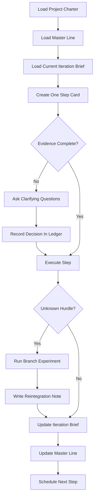

# Director Operating System

Purpose: run long-form documentary projects with high alignment, low drift, and controlled flexibility.

## Layers

1. Canonical Layer: stable truth that changes rarely.
2. Iteration Layer: current stage and branch decisions.
3. Working Layer: immediate step context only.

## Artifact Map

- [Governance Standard](00-governance-standard.md)
- [Project Charter](01-project-charter.md)
- [Master Line](02-master-line.md)
- [Decision Ledger](03-decision-ledger.md)
- [Iteration Brief](04-iteration-brief.md)
- [Step Card](05-step-card.md)
- [Branch Experiment](06-branch-experiment.md)
- [Reintegration Note](07-reintegration-note.md)
- [Checkpoint Review](08-checkpoint-review.md)

## Operating Loop

## Hard Rules

All hard rules are inherited from [Governance Standard](00-governance-standard.md).

Local reminder:

- Every session must update the master line and next action.
