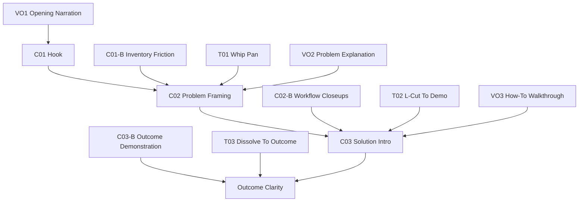

# Layered Mermaid Timeline Template

Purpose: maintain a continuously editable mock video timeline with clear A-Roll, B-Roll, transition/effects, and notes per clip.

## Timeline Standard

Use one Mermaid timeline as the canonical visual source for edit planning.

- Keep sections as lanes: A-Roll, B-Roll, FX/Transitions, Audio/VO.
- Keep clip IDs stable (C01, C02, C03...) so notes and scripts stay in sync.
- Update this file first when sequence timing changes.
- Target full runtime at approximately 12:00.
- Prefer coherence over quantity; no minimum number of clips is required.

## Mermaid Timeline (Editable)

```mermaid
gantt
    title Mock Video Timeline
    dateFormat  HH:mm:ss
    axisFormat  %M:%S

    section A-Roll
    C01 Hook On-Camera               :a1, 00:00:00, 00:00:18
    C02 Problem Framing              :a2, after a1, 00:00:28
    C03 Solution Intro               :a3, after a2, 00:00:30

    section B-Roll
    C01-B Inventory Friction         :b1, 00:00:04, 00:00:12
    C02-B Workflow Closeups          :b2, 00:00:24, 00:00:22
    C03-B Outcome Demonstration      :b3, 00:00:58, 00:00:25

    section FX / Transitions
    T01 Whip Pan                     :t1, 00:00:18, 00:00:02
    T02 L-Cut To Demo                :t2, 00:00:46, 00:00:02
    T03 Dissolve To Outcome          :t3, 00:01:20, 00:00:02

    section Audio / VO
    VO1 Opening Narration            :v1, 00:00:00, 00:00:20
    VO2 Problem Explanation          :v2, 00:00:20, 00:00:30
    VO3 How-To Walkthrough           :v3, 00:00:50, 00:00:35
```

## Companion Flowchart (Clip Logic)

Use this flowchart to model editorial dependency and story logic between clips.

## Timeline and Flowchart Sync Rules

- Keep clip IDs identical across Gantt and flowchart nodes.
- If a clip is added, update both diagrams in the same edit.
- If ordering changes in one diagram, mirror it in the other immediately.
- Keep the flowchart focused on dependency, not timestamps.

## Editorial Callouts (Editor-Ready)

Use these defaults to speed up assembly in any video editor.

### Music Direction

- Intro hook: low, tense pulse with light percussion; avoid melody-heavy tracks.
- Problem section: minimal texture bed; leave space for narration clarity.
- Solution/how-to section: confident, forward-driving rhythm at low mix level.
- Outcome/closing: warmer tonal lift, subtle resolve, no abrupt energy spike.
- Music mix rule: keep music below narration intelligibility threshold at all times.

### Sound Design Direction

- UI interactions: soft click/tick accents only on key actions.
- Transitions: one short whoosh/riser family used consistently.
- Emphasis moments: light impact hits for claims backed by evidence.
- Ambience: keep room tone or game ambience low and stable under VO.
- SFX density rule: if narration competes, remove SFX before lowering VO.

### Transition Usage Guide

- Hard cut: default for explanation continuity and pace.
- L-cut: default from A-Roll speech into B-Roll proof.
- J-cut: use for anticipation into next step.
- Dissolve: reserve for time-passing or outcome reflection.
- Transition rule: avoid decorative transitions that do not support story logic.

### A-Roll / B-Roll Focus Rules

- A-Roll focus: intent, stakes, instruction, and emotional clarity.
- B-Roll focus: proof of claims, workflow evidence, outcome visuals.
- Coverage ratio target: roughly 40% A-Roll, 60% B-Roll across instructional sections.
- Proof rule: every major A-Roll claim must have corresponding B-Roll evidence.

## Quick Assembly Map (Voice/Video String-Together)

Use this as a direct ingest checklist when building a rough cut from raw recordings.

| Segment | Primary A-Roll Source | Primary B-Roll Source | Music Profile | SFX Profile | Transition Style | Assembly Note |
|---|---|---|---|---|---|---|
| Hook | Host cam take | Fast pain proof cutaways | Tense pulse | Light riser | Hard cut -> L-cut | Keep under 20s; establish problem fast |
| Problem | Host explanation | Inventory friction closeups | Minimal texture | Sparse UI ticks | Hard cut | One clear pain statement + visual proof |
| Approach | Host walkthrough intro | Build process and system visuals | Forward rhythm | Key action clicks | L-cut | Match spoken step to visible action |
| Evidence | Interview or VO claim | Commit/milestone or before-after proof | Low neutral bed | Light impact hits | J-cut + hard cut | One claim, one proof pattern |
| How-To | Host step-by-step | Full workflow pass | Forward rhythm | UI feedback accents | L-cut | Prioritize clarity over speed |
| Closing | Host payoff line | Outcome montage | Warm resolve | Minimal | Dissolve (limited) | End on player value and next action |

## DaVinci Resolve Naming and Bin Conventions

Follow the canonical standard in [DaVinci Resolve Editorial Standard](00-davinci-resolve-editorial-standard.md).

Local rule:

- Do not redefine naming, bins, or track labels here unless an approved override is active.

## Clip Highlight Notes

Use short bullets for each clip component.

### C01

- Highlight: show viewer pain in under 10 seconds.
- Keep: strongest reaction shot only.
- Risk: opening runs long if B-Roll overlaps too heavily.

### C02

- Highlight: name the exact user problem in plain language.
- Keep: one visual proof and one evidence callout.
- Risk: technical wording may be too dense for first-time viewers.

### C03

- Highlight: explain how to use the result, not just what exists.
- Keep: one full workflow pass from start to outcome.
- Risk: transition timing can hide important UI actions.

## 1:00 Highlight Extraction Plan

| Highlight ID | Start | End | Source Clip IDs | Hook Line | Pull Status |
|---|---|---|---|---|---|
| HL-001 |  |  |  |  | Planned |
| HL-002 |  |  |  |  | Planned |
| HL-003 |  |  |  |  | Planned |

## Change Log

| Date | Editor | Change Summary | Impacted Clip IDs |
|---|---|---|---|
| YYYY-MM-DD |  |  |  |

## Done Criteria

- [ ] Mermaid timeline renders successfully.
- [ ] Every timeline clip has at least one highlight note bullet.
- [ ] A-Roll and B-Roll timing aligns with current paper edit.
- [ ] Transition/effect timings are explicit.
- [ ] Audio/VO lane reflects the current script draft.
- [ ] Flowchart dependencies match timeline clip IDs and order.
- [ ] Total timeline duration is approximately 12:00 (+/- 1:00).
- [ ] At least one 1:00 highlight extraction candidate is fully specified.
- [ ] Editorial callouts for music, sound, transitions, and A-Roll/B-Roll focus are set.
- [ ] Quick Assembly Map is complete for all active segments.
