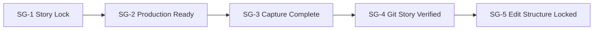
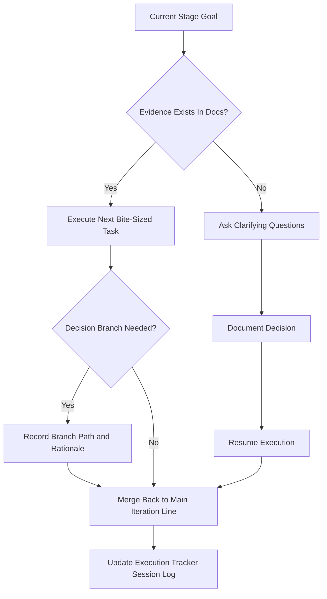

# Documentary Production Kit

This folder is a reusable system for planning, recording, and editing a high-quality documentary about a game, product, plugin, or technical project.

## Goal

Build a documentary narrative that clearly shows:

1. The audience pain or unmet need.
2. The design and engineering journey.
3. The practical outcome for end users.

## Alignment Rule

Use one canonical goal line across all files:

- Problem: what users struggle with
- Journey: what was built and why
- Usage outcome: how users apply the result

Execution governance is inherited from [Governance Standard](00-operating-system/00-governance-standard.md).

## How To Use This Kit

Treat all files as templates.

- You can keep, rename, remove, or expand sections to fit your project.
- Example lines are guidance, not required content.
- Only fill the parts needed for the current stage and step.

## Evidence Rule

Inherited from [Governance Standard](00-operating-system/00-governance-standard.md).

## Director Operating System

Use the Operating System as the default execution framework for long-running work:

- [Operating System Hub](00-operating-system/README.md)
- [Governance Standard](00-operating-system/00-governance-standard.md)
- [Project Charter](00-operating-system/01-project-charter.md)
- [Master Line](00-operating-system/02-master-line.md)
- [Decision Ledger](00-operating-system/03-decision-ledger.md)
- [Iteration Brief](00-operating-system/04-iteration-brief.md)
- [Step Card](00-operating-system/05-step-card.md)
- [Branch Experiment](00-operating-system/06-branch-experiment.md)
- [Reintegration Note](00-operating-system/07-reintegration-note.md)
- [Checkpoint Review](00-operating-system/08-checkpoint-review.md)

Execution rule:

Inherited from [Governance Standard](00-operating-system/00-governance-standard.md).

## Folder Structure

- `01-story/` Narrative framing and audience hooks.
- `02-production/` Recording logistics, plans, and interview prep.
- `03-edit/` Paper edit, beats, and narration drafts.
- `04-git-story/` Evidence mapping from project history.
- `05-assets/` Media tracking and naming conventions.

## Quick Start Prompt

Use this slash prompt to bootstrap any new conversation with operating context:

- [Director OS Bootstrap Prompt](../../.github/prompts/director-operating-system-bootstrap.prompt.md)

Suggested use:

1. Start a new conversation.
2. Run `/director-operating-system-bootstrap`.
3. Provide target project folder + current stage + immediate objective.

## How To Use

1. Start with [Execution Tracker](00-execution-tracker.md).
2. Lock story intent in [Logline](01-story/01-logline.md).
3. Build recording plan in [Shoot Plan](02-production/02-shoot-plan.md).
4. Track evidence in [Annotated Milestones](04-git-story/02-annotated-milestones.md).
5. Build rough cut from [Paper Edit](03-edit/01-paper-edit.md).
6. Keep layered timeline and clip highlights current in [Layered Mermaid Timeline](03-edit/04-layered-timeline-mermaid.md).
7. Keep both narration modes current in [Voiceover Script Template](03-edit/03-voiceover-script-draft.md) for direct read and live bullet recording.

## Runtime and Clip Targets

Inherited from [Governance Standard](00-operating-system/00-governance-standard.md).

## Visual Progress Map

## Decision Split and Reconnection Map

## README Maintenance Checklist

- Keep diagrams aligned with [Execution Tracker](00-execution-tracker.md).
- Keep branch and merge status synchronized with operating-system files.
- Ensure every important reasoning change links to documented evidence.
- Use repository-relative markdown links with correct `../` depth.
- Ensure no unresolved branch experiment remains open while new stage work starts.

## Mermaid Without Sign-In

This system is markdown-native.

- No third-party Mermaid account is required.
- Diagrams are written directly in markdown code fences.
- If rendering fails, keep validated Mermaid source in the docs.

## Documentary Through Code

Treat each major project milestone like a scene:

- Problem appears.
- Hypothesis is proposed.
- Solution is built.
- Issues force iteration.
- Outcome delivers user value.