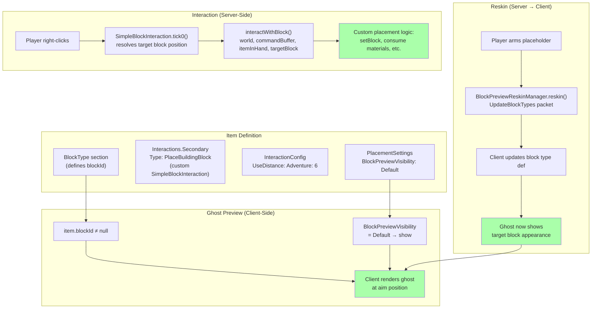

# Custom SimpleBlockInteraction Registration + Block Preview Ghost Research

---

## PART 1: Custom SimpleBlockInteraction Registration

### 1.1 How Are Interaction Types Registered?

Interaction types are registered via a **codec map registry** with string discriminator keys. The JSON `"Type"` field maps to a Java class.

#### The Registry Mechanism

`Interaction.CODEC` is an `AssetCodecMapCodec<String, Interaction>` — a polymorphic codec that uses `"Type"` as the discriminator key:

```java
// Interaction.java
@Nonnull
public static final AssetCodecMapCodec<String, Interaction> CODEC = new AssetCodecMapCodec<>(
    Codec.STRING, (t, k) -> t.id = k, t -> t.id, (t, data) -> t.data = data, t -> t.data
);
```

#### Core Registration (InteractionModule)

The engine registers 40+ built-in types directly on the CODEC:

```java
// InteractionModule — direct registration
Interaction.CODEC.register("Simple", SimpleInteraction.class, SimpleInteraction.CODEC);
Interaction.CODEC.register("PlaceBlock", PlaceBlockInteraction.class, PlaceBlockInteraction.CODEC);
Interaction.CODEC.register("PlaceFluid", PlaceFluidInteraction.class, PlaceFluidInteraction.CODEC);
Interaction.CODEC.register("BreakBlock", BreakBlockInteraction.class, BreakBlockInteraction.CODEC);
Interaction.CODEC.register("ChangeBlock", ChangeBlockInteraction.class, ChangeBlockInteraction.CODEC);
Interaction.CODEC.register("SpawnNPC", SpawnNPCInteraction.class, SpawnNPCInteraction.CODEC);
// ... 40+ more
```

#### Plugin Registration (via getCodecRegistry)

Plugins use `getCodecRegistry(Interaction.CODEC)` which returns `CodecMapRegistry.Assets<Interaction, ?>`:

```java
// CodecMapRegistry.Assets.register() — the method plugins call
@Nonnull
public Assets<T, C> register(String id, Class<? extends T> aClass, BuilderCodec<? extends T> codec)
```

**This is NOT a sealed enum. It is an open registry. Plugins CAN add entries.**

### 1.2 Can Plugins Add Entries to This Registry?

**YES — confirmed by multiple real-world examples from Hytale's own built-in plugins.**

#### CraftingPlugin (ships with the engine)

```java
// CraftingPlugin.setup()
this.getCodecRegistry(Interaction.CODEC)
    .register("OpenBenchPage", OpenBenchPageInteraction.class, OpenBenchPageInteraction.CODEC)
    .register("OpenProcessingBench", OpenProcessingBenchInteraction.class, OpenProcessingBenchInteraction.CODEC);
```

#### PortalsPlugin

```java
this.getCodecRegistry(Interaction.CODEC)
    .register("EnterPortal", EnterPortalInteraction.class, EnterPortalInteraction.CODEC)
    .register("ReturnPortal", ReturnPortalInteraction.class, ReturnPortalInteraction.CODEC);
```

#### CreativeHubPlugin

```java
this.getCodecRegistry(Interaction.CODEC)
    .register("HubPortal", HubPortalInteraction.class, HubPortalInteraction.CODEC);
```

#### TeleporterPlugin

```java
this.getCodecRegistry(Interaction.CODEC)
    .register("Teleporter", TeleporterInteraction.class, TeleporterInteraction.CODEC);
```

#### Our own codebase (PortableBenchInteraction)

```java
// UnobstructedThirdPersonPlugin — already registers a custom interaction
this.getCodecRegistry(Interaction.CODEC)
    .register("PortableBench", PortableBenchInteraction.class, PortableBenchInteraction.CODEC);
```

**Key difference:** Core modules call `Interaction.CODEC.register()` directly. Plugins call `this.getCodecRegistry(Interaction.CODEC).register()` — this wraps registration with automatic cleanup on plugin shutdown.

### 1.3 What Does `SimpleBlockInteraction` Provide?

**Package:** `com.hypixel.hytale.server.core.modules.interaction.interaction.config.client`

#### Class Definition

```java
public abstract class SimpleBlockInteraction extends SimpleInteraction {
```

Extends `SimpleInteraction`, which means it inherits:
- `Next` and `Failed` chaining (from `SimpleInteraction.CODEC`)
- `WaitForDataFrom.Client` (overrides parent's `None`)

#### CODEC

```java
@Nonnull
public static final BuilderCodec<SimpleBlockInteraction> CODEC =
    BuilderCodec.abstractBuilder(SimpleBlockInteraction.class, SimpleInteraction.CODEC)
        .appendInherited(
            new KeyedCodec<>("UseLatestTarget", Codec.BOOLEAN),
            (interaction, s) -> interaction.useLatestTarget = s,
            interaction -> interaction.useLatestTarget,
            (interaction, parent) -> interaction.useLatestTarget = parent.useLatestTarget
        )
        .build();
```

Inherits ALL `SimpleInteraction.CODEC` fields (including `Next` and `Failed`), plus adds `UseLatestTarget`.

#### Abstract Methods to Implement

```java
protected abstract void interactWithBlock(
    @Nonnull World world,
    @Nonnull CommandBuffer<EntityStore> commandBuffer,
    @Nonnull InteractionType type,
    @Nonnull InteractionContext context,
    @Nullable ItemStack itemInHand,
    @Nonnull Vector3i targetBlock,
    @Nonnull CooldownHandler cooldownHandler
);
```

Also inherits from `Interaction`:
```java
public abstract boolean walk(Collector collector, InteractionContext context);
protected abstract com.hypixel.hytale.protocol.Interaction generatePacket();
```

And from `SimpleInteraction`, `simulateTick0()` which calls:
```java
protected abstract void simulateInteractWithBlock(
    @Nonnull InteractionType type,
    @Nonnull InteractionContext context,
    @Nullable ItemStack itemInHand,
    @Nonnull World world,
    @Nonnull Vector3i targetBlock
);
```

(Note: `simulateInteractWithBlock` is called from `SimpleBlockInteraction.simulateTick0()` with slightly different parameter order than `interactWithBlock`.)

#### How Target Block Position Is Provided

`SimpleBlockInteraction.tick0()` does the following on `firstRun`:

1. Gets the `World` from the command buffer
2. If `useLatestTarget = true`: reads `context.getClientState().blockPosition` (latest client raycast)
3. Gets `context.getTargetBlock()` — the block position sent by the client
4. Validates the chunk is loaded and the block exists (non-empty)
5. Gets the `ItemStack itemInHand` from the player's inventory
6. Calls `interactWithBlock(world, commandBuffer, type, context, itemInHand, targetBlock, cooldownHandler)`

**The target block is provided as `Vector3i targetBlock` — the block the player right-clicked on.** The client sends this position as part of the interaction sync data (`WaitForDataFrom.Client`).

#### How ItemStack Is Provided

```java
if (EntityUtils.getEntity(ref, commandBuffer) instanceof LivingEntity livingEntity) {
    Inventory inventory = livingEntity.getInventory();
    ItemStack itemInHand = inventory.getItemInHand();
    // ... passed to interactWithBlock()
}
```

#### Next/Failed Chaining

After `interactWithBlock()` returns, `tick0()` calls `super.tick0()` which is `SimpleInteraction.tick0()`. If the interaction state is `Finished`, the `Next` interaction runs. If `Failed`, the `Failed` interaction runs:

```java
// SimpleInteraction.tick0() — chaining logic
if (context.getState().state == InteractionState.Finished && this.nextId != null) {
    // Chain to Next interaction
} else if (context.getState().state == InteractionState.Failed && this.failedId != null) {
    // Chain to Failed interaction
}
```

To chain: set `context.getState().state = InteractionState.Finished` for success, `InteractionState.Failed` for failure.

### 1.4 Existing Examples of Custom Interactions in This Codebase

**Yes — `PortableBenchInteraction`** is already registered as a custom interaction type in this plugin:

```java
// PortableBenchInteraction.java
public class PortableBenchInteraction extends SimpleInteraction {
    public static final BuilderCodec<PortableBenchInteraction> CODEC =
        BuilderCodec.builder(PortableBenchInteraction.class,
            PortableBenchInteraction::new, SimpleInteraction.CODEC)
            .build();
}
```

This extends `SimpleInteraction` (not `SimpleBlockInteraction`) because it doesn't need a block target — it opens a bench window from the held item. The pattern is proven and working in the current codebase.

### 1.5 Is There a Generic Interaction Type We Could Hijack?

**No built-in generic "Script" or "Custom" type exists** that delegates to a plugin handler. However, this is unnecessary — direct custom registration is the intended approach.

The engine has no `"Type": "Script"` or `"Type": "Custom"` or `"Type": "PluginHandler"` interaction type. Every interaction type is a specific Java class with specific behavior.

### 1.6 Can We Use SpawnNPC with Invalid Config as a Hack?

**Technically possible but terrible approach. Don't do this.**

`SpawnNPCInteraction` extends `SimpleBlockInteraction` and provides the target block position:

```java
protected void interactWithBlock(
    World world, CommandBuffer<EntityStore> commandBuffer,
    InteractionType type, InteractionContext context,
    ItemStack itemInHand, Vector3i targetBlock, CooldownHandler cooldownHandler) {
    if (!(ThreadLocalRandom.current().nextFloat() > this.spawnChance)) {
        commandBuffer.run(store -> this.spawnNPC(..., targetBlock));
    }
}
```

Setting `"SpawnChance": 0` would make it always skip the spawn. But:
- The `EntityId` field has a validator (`NPCRoleValidator`) that checks the NPC asset exists at load time
- No way to inject custom server-side logic from the interaction
- No event is fired that a plugin could intercept
- This is fragile, undocumented, and unmaintainable

**Just register a custom interaction type.** It's 30 lines of code, fully supported, and exactly what CraftingPlugin/PortalsPlugin/etc. do.

### 1.7 Summary: Registration Pattern for a Custom SimpleBlockInteraction

```java
// The custom interaction class
public class PlaceBuildingBlockInteraction extends SimpleBlockInteraction {

    public static final BuilderCodec<PlaceBuildingBlockInteraction> CODEC =
        BuilderCodec.builder(PlaceBuildingBlockInteraction.class,
            PlaceBuildingBlockInteraction::new, SimpleBlockInteraction.CODEC)
        .build();

    protected PlaceBuildingBlockInteraction() {}

    public PlaceBuildingBlockInteraction(@Nonnull String id) {
        super(id);
    }

    @Override
    protected void interactWithBlock(
            @Nonnull World world,
            @Nonnull CommandBuffer<EntityStore> commandBuffer,
            @Nonnull InteractionType type,
            @Nonnull InteractionContext context,
            @Nullable ItemStack itemInHand,
            @Nonnull Vector3i targetBlock,
            @Nonnull CooldownHandler cooldownHandler) {

        // Full access to:
        //   world        — the World instance
        //   commandBuffer — for deferred ECS operations
        //   itemInHand    — the player's held ItemStack (with BSON metadata)
        //   targetBlock   — the block position the player right-clicked
        //   context       — the interaction context (entity ref, state, client state)

        // Set state to control Next/Failed chaining:
        context.getState().state = InteractionState.Finished;  // triggers "Next"
        // or: context.getState().state = InteractionState.Failed;  // triggers "Failed"
    }

    @Override
    protected void simulateInteractWithBlock(
            @Nonnull InteractionType type,
            @Nonnull InteractionContext context,
            @Nullable ItemStack itemInHand,
            @Nonnull World world,
            @Nonnull Vector3i targetBlock) {
        // Client-side simulation — can be empty for server-only
    }

    @Override
    public boolean walk(Collector collector, InteractionContext context) {
        return false;
    }

    @Override
    protected com.hypixel.hytale.protocol.Interaction generatePacket() {
        return new com.hypixel.hytale.protocol.SimpleBlockInteraction();
    }
}
```

Registration in plugin `setup()`:

```java
this.getCodecRegistry(Interaction.CODEC)
    .register("PlaceBuildingBlock", PlaceBuildingBlockInteraction.class,
        PlaceBuildingBlockInteraction.CODEC);
```

JSON usage:

```json
{
  "Interactions": {
    "Secondary": {
      "Interactions": [{
        "Type": "PlaceBuildingBlock",
        "RemoveItemInHand": false
      }]
    }
  }
}
```

Or via programmatic asset loading:

```java
AssetRegistry.getAssetStore(Interaction.class)
    .loadAssets("MyMod:MyMod", List.of(new PlaceBuildingBlockInteraction("*My_PlaceBuilding")));
AssetRegistry.getAssetStore(RootInteraction.class)
    .loadAssets("MyMod:MyMod", List.of(new RootInteraction("*My_PlaceBuilding_Root", "*My_PlaceBuilding")));
```

---

## PART 2: Block Preview Ghost with Non-PlaceBlock Interactions

### 2.1 Does the Client Show a Block Preview Ghost for ANY Item with `BlockType`, Regardless of Interaction?

**YES. The ghost preview is driven by `item.blockId`, NOT by the interaction type.**

#### Evidence: The Client Resolution Chain

From `Item.java` (server-side `toPacket()`):

```java
// Item.java line 657-662
if (this.blockId != null) {
    packet.blockId = BlockType.getAssetMap().getIndexOrDefault(this.blockId, 1);
}
```

The client receives `ItemBase.blockId` as a numeric index. If non-zero, the client renders a ghost preview at the aim position. **The client has no knowledge of what interaction type the item uses.** It only checks whether the item has a `blockId`.

#### Evidence: The Eval Doc (confirmed)

From [eval-placeholder-refactor-block-to-tool.md](../../Plans/eval-placeholder-refactor-block-to-tool.md):

> "The client renders a ghost preview **only** when the held item has a non-null `blockId`. The `UpdateBlockTypes` reskinning system (`BlockPreviewReskinManager`) changes *what an existing block type looks like* — it does not create previews from nothing."

> "The client renders a ghost preview only when `item.blockId != null`, which requires a `BlockType` section in the item JSON."

#### Evidence: The Bucket Proves It

The `Container_Bucket` in state `Filled_Water` has:
- **Interaction:** `PlaceFluid` (NOT `PlaceBlock`)
- **BlockType:** YES — defines `DrawType: Model`, `CustomModel: Bucket_Full.blockymodel`, `Material: Empty`

```json
// Container_Bucket.json — Filled_Water state
{
  "Interactions": {
    "Secondary": {
      "Interactions": [{
        "Type": "PlaceFluid",           // ← NOT PlaceBlock
        "RemoveItemInHand": false,
        "FluidToPlace": "Water_Source"
      }]
    }
  },
  "BlockType": {                         // ← HAS a BlockType
    "Material": "Empty",
    "DrawType": "Model",
    "CustomModel": "Blocks/Decorative_Sets/Village/Bucket_Full.blockymodel",
    "CustomModelTexture": [{
      "Texture": "Blocks/Decorative_Sets/Village/Bucket_Texture_Water.png"
    }]
  }
}
```

The filled water bucket shows a ghost preview of the bucket model when held — **even though its interaction is `PlaceFluid`**, not `PlaceBlock`. The client doesn't check the interaction type; it only checks that `blockId` is non-null.

#### Conclusion

**The block preview ghost is 100% driven by `Item.hasBlockType()` / `item.blockId`. The interaction type is irrelevant.** Any item with a `BlockType` section will show a ghost, regardless of whether its interaction is `PlaceBlock`, `PlaceFluid`, `SpawnNPC`, a custom type, or has no interactions at all.

### 2.2 What Controls Block Preview Ghost Visibility?

Three factors control the ghost preview:

#### Factor 1: `Item.blockId` (required)

The item MUST have a `BlockType` section in its JSON. Without it, `blockId` is null and the client renders no preview.

```java
// ItemStack.java
public String getBlockKey() {
    if (this.isEmpty()) return "Empty";
    Item item = this.getItem();
    if (item == null) return null;
    return item.hasBlockType() ? item.getBlockId() : null;
}
```

#### Factor 2: `BlockPlacementSettings.BlockPreviewVisibility` (optional override)

Defined on the `BlockType`, sent to client via `BlockType.toPacket()`:

```java
// BlockPreviewVisibility.java
public enum BlockPreviewVisibility {
    AlwaysVisible(0),    // Always show ghost, even if other conditions say no
    AlwaysHidden(1),     // Never show ghost
    Default(2);          // Show based on default rules (item has blockId = show)
}
```

In JSON:
```json
"BlockType": {
    "PlacementSettings": {
        "BlockPreviewVisibility": "Default"
    }
}
```

`Default` means: show the ghost if `blockId` is set (which it always is for items with `BlockType`). `AlwaysHidden` suppresses it. `AlwaysVisible` forces it.

#### Factor 3: Client-side rendering logic

The client performs the actual raycast, determines the ghost position, and renders the translucent preview. This is entirely client-side — the server never sends per-tick preview data. The server's only influence is the `blockId` on the item and the `BlockPreviewVisibility` on the block type.

### 2.3 Custom Interaction + BlockType = Ghost Preview?

**YES. This is the critical answer.**

If you define a custom interaction (e.g., `"Type": "PlaceBuildingBlock"`) but keep a `BlockType` on the item state, the client WILL still show the ghost preview. The chain is:

```
Item has BlockType section
  → Item.toPacket() sends blockId to client
    → Client sees blockId != null on held item
      → Client renders ghost preview at aim position
```

The interaction type is never consulted by the preview system. The two systems are completely independent:

| System | Driven By | Server or Client |
|--------|-----------|-----------------|
| Ghost preview | `item.blockId` (from `BlockType` section) | Client-only |
| Interaction | `item.interactions` map → `RootInteraction` → `Interaction` chain | Server-driven |

### 2.4 Does `PlayerAnimationsId: "Block"` Affect Ghost Preview?

**NO. `PlayerAnimationsId` controls the player's hold/use animations, NOT the ghost preview.**

Evidence from the bucket:
- The **base bucket** (empty) has `"PlayerAnimationsId": "Item"` and has a `BlockType` → shows ghost
- The **Filled_Milk** state overrides `PlayerAnimationsId` with a `"Parent": "Item"` + custom Consume animation → still has `BlockType` → shows ghost
- The **Block_Placeholder** has `"PlayerAnimationsId": "Block"` → shows ghost because it has `BlockType`

Blocks like `Wood_Oak_Trunk` and `Rock_Stone` use `"PlayerAnimationsId": "Block"` because they're meant to be held as blocks with the block-holding animation. But the preview is NOT triggered by this field — it's triggered by `BlockType`.

**`PlayerAnimationsId: "Block"` makes the player hold the item like a block** (arms positioned to hold a cubic block). `PlayerAnimationsId: "Item"` uses the default hand-held item animation. Neither affects ghost preview rendering.

For our custom interaction tool, we should use `"PlayerAnimationsId": "Block"` to get the block-holding animation, but this is cosmetic — the ghost preview comes from `BlockType`.

### 2.5 Does `InteractionConfig.UseDistance` Affect Ghost Preview Range?

**PARTIALLY. `UseDistance` controls the interaction range, not the preview range directly. But they are likely linked on the client.**

`UseDistance` is sent to the client via `InteractionConfiguration`:
```java
// InteractionConfiguration.java (protocol)
public Map<GameMode, Float> useDistance;
```

Default values:
```java
Adventure: 5.0
Creative: 6.0
```

`SimpleBlockInteraction.tick0()` uses this for server-side range validation — if the target block is beyond `UseDistance`, the interaction fails. But the client also receives this value and likely uses it to determine the maximum distance for:
1. Sending interaction requests
2. Rendering the ghost preview

The ghost preview is rendered client-side at the client's aim position. The client knows the `UseDistance` from the item's `InteractionConfig` packet data. It's reasonable (and consistent with observed behavior) that the client limits the ghost preview distance to the `UseDistance` value.

**For our custom interaction:** Setting `"UseDistance": {"Adventure": 6, "Creative": 8}` would control both the interaction range and (likely) the preview render distance.

**However**, the ghost preview distance is more precisely tied to the *placement range* that the client uses for block placement logic, which is related to `UseDistance` but may have its own cap. Without client source, this is inferred behavior — but the EditorTool_Paste uses `"UseDistance": {"Adventure": 128, "Creative": 128}` and the ghost preview does render at that range.

### 2.6 The Reskin Approach: Does `UpdateBlockTypes` + Custom Interaction Still Work?

**YES. Confirmed.**

The `BlockPreviewReskinManager.reskin()` method works by:
1. Taking the armed placeholder's block type ID (e.g., `Block_Placeholder_Armed_Green_0`)
2. Cloning the target block's `toPacket()` output (e.g., `Oak_Planks`)
3. Sending `UpdateBlockTypes` that maps the placeholder's numeric ID → the target block's packet data
4. The client now thinks the placeholder block type *looks like* Oak_Planks
5. The ghost preview renders Oak_Planks at the aim position

**This process is completely independent of the interaction type.** The reskin changes what the client thinks the block type looks like. The ghost preview reads the block type appearance from the (reskinned) block type definition. Neither of these systems checks the interaction type.

```
UpdateBlockTypes(Green_0 → Oak_Planks packet)
  → Client updates block type definition for Green_0
    → Ghost preview renders using updated definition
      → Player sees Oak_Planks ghost at aim
        → Player right-clicks → custom interaction fires (NOT PlaceBlock)
          → Server handles placement in interactWithBlock()
```

The critical path works:

| Step | Component | Depends on PlaceBlock? |
|------|-----------|----------------------|
| Ghost preview rendering | `item.blockId` + client rendering | NO |
| Ghost appearance | `UpdateBlockTypes` reskin | NO |
| Interaction firing | `Interactions.Secondary` → custom type | NO |
| Target block position | `SimpleBlockInteraction.tick0()` | NO |
| Server-side placement | `interactWithBlock()` custom logic | NO |

**NOTHING in this chain depends on the interaction type being `PlaceBlock`.**

---

## PART 3: Critical Path Analysis

### The Key Question: Custom Interaction + BlockType-Based Ghost Preview + Reskinning?

**Answer: YES. All three work together.**



### What Changes from Current Architecture

| Current (PlaceBlock interaction) | Proposed (Custom interaction) |
|----------------------------------|-------------------------------|
| `"Type": "PlaceBlock"` on Secondary | `"Type": "PlaceBuildingBlock"` on Secondary |
| Client sends placement packet → `GamePacketHandler` → `PlaceBlockEvent` | Client sends interaction request → custom `interactWithBlock()` |
| `PlaceBlockPlacementSystem` intercepts PlaceBlockEvent, cancels, manually places | `interactWithBlock()` directly places block |
| Item consumption prevented by `event.setCancelled(true)` | Item never consumed (SimpleBlockInteraction doesn't consume) |
| BlockType needed for ghost preview ✅ | BlockType needed for ghost preview ✅ (same) |
| `UpdateBlockTypes` reskin works ✅ | `UpdateBlockTypes` reskin works ✅ (same) |
| `PlacementSettings.BlockPreviewVisibility: Default` | Same — unchanged |

### What You Gain

1. **Direct placement control** — No need to intercept and cancel `PlaceBlockEvent`. Your `interactWithBlock()` IS the placement handler.
2. **No `PlaceBlockEvent` complications** — No race with `PlacementCostScaler`, no `event.setCancelled()` side effects, no dual-system coordination.
3. **No item consumption by default** — `SimpleBlockInteraction` never touches the held item. No need for `RemoveItemInHand: false`, no need for SlotFilter.DENY, no restore writes.
4. **Full server-side control** — You get `World`, `CommandBuffer`, `ItemStack`, `Vector3i targetBlock` directly. Place blocks, consume materials, fire custom events — all in one method.
5. **Next/Failed chaining** — Can chain to other interactions (e.g., `ModifyInventory`, `Simple`, etc.)
6. **`UseDistance` control** — Per-game-mode interaction range via `InteractionConfig`.

### What You Lose

1. **`PlaceBlockEvent` no longer fires** — Other systems listening to `PlaceBlockEvent` won't see placements from this interaction. If `PlacementCostScaler` or other systems need to react, they'd need a different event or direct integration.
2. **Client-side placement prediction** — `PlaceBlock` has built-in client-side prediction (the client optimistically places the block before server confirmation). A custom interaction is server-authoritative only, adding ~1 tick of latency before the block appears.
3. **Drag-placement** — `PlaceBlock` supports hold-to-drag placement (placing blocks as you move the cursor). A custom interaction fires once per click. Drag-placement would need manual implementation.
4. **Block rotation UI** — `PlaceBlock` integrates with the client's block rotation system. A custom interaction would need to read rotation from `context.getClientState()` manually.
5. **`canPlaceBlock()` validation** — `PlaceBlock` uses `BlockPlaceUtils.canPlaceBlock()` for server-side validation (checking if the block can be placed at the target position). You'd need to call this yourself.

### The Bucket Precedent: Proof of Concept

The `Container_Bucket` `Filled_Water` state is living proof that this pattern works:

| Feature | Bucket (Filled_Water) | Proposed (PlaceBuildingBlock) |
|---------|----------------------|------------------------------|
| Has `BlockType` | ✅ Yes (bucket model) | ✅ Yes (placeholder block) |
| Interaction type | `PlaceFluid` (not PlaceBlock) | `PlaceBuildingBlock` (custom) |
| Shows ghost preview | ✅ Yes (bucket model ghost) | ✅ Yes (reskinned to target block) |
| `PlaceBlockEvent` fires | ❌ No | ❌ No |
| Item consumed on use | ❌ No (`RemoveItemInHand: false`) | ❌ No (SimpleBlockInteraction doesn't consume) |
| Has `Next` chaining | ✅ Yes → `ModifyInventory` | ✅ Available if needed |

**Notably:** `PlaceFluidInteraction` extends `SimpleBlockInteraction` (confirmed from decompiled source), NOT `SimpleInteraction` as was previously documented in some docs. This means `PlaceFluid` gets the same `WaitForDataFrom.Client` target block resolution as any other `SimpleBlockInteraction` subclass — and the ghost preview still works.

---

## PART 4: Open Questions and Remaining Risks

### Confirmed ✅

| # | Question | Answer |
|---|----------|--------|
| 1 | Can plugins register custom SimpleBlockInteraction types? | Yes — use `getCodecRegistry(Interaction.CODEC).register()` |
| 2 | Does the ghost preview work with non-PlaceBlock interactions? | Yes — driven by `item.blockId`, not interaction type |
| 3 | Does UpdateBlockTypes reskinning work with non-PlaceBlock interactions? | Yes — reskin changes block type appearance, independent of interaction |
| 4 | Does the bucket prove the pattern? | Yes — `PlaceFluid` interaction with `BlockType` = ghost preview |
| 5 | Is `PlayerAnimationsId` relevant to ghost preview? | No — it only controls hold/use animation |

### Needs Testing ⚠️

| # | Question | Risk | Mitigation |
|---|----------|------|------------|
| 1 | Does the client send target block position for a custom `SimpleBlockInteraction` on Secondary (right-click)? | Medium — the client might only send block position for known interaction types like PlaceBlock/PlaceFluid | Test with a minimal custom interaction. Fallback: use `UseLatestTarget: true` which reads from `context.getClientState().blockPosition` |
| 2 | Does the ghost preview render at the correct face (adjacent block) or on the target block itself? | Low — PlaceBlock renders the preview on the adjacent empty face. A custom interaction might show it ON the target block | The ghost renders based on `blockId` placement logic, not interaction type. Should still render on the adjacent face. Test to confirm. |
| 3 | Does `InteractionConfig.UseDistance` affect ghost preview distance for non-PlaceBlock items? | Low — the client likely uses the same distance for preview and interaction | Test by setting a large UseDistance and verifying preview renders at range |
| 4 | Does drag-to-place work with a custom SimpleBlockInteraction? | High — likely does NOT work natively | Accept as a known limitation. Can implement manually if needed. |
| 5 | Is `context.getClientState().blockFace` available in `interactWithBlock()`? | Low — should be available via `InteractionSyncData` | Check `context.getState().blockFace` and `context.getClientState().blockFace` for face data |

### Documentation Correction

**Previous doc error:** The bucket-pattern-feasibility doc stated that `PlaceBlockInteraction extends Interaction DIRECTLY`. The decompiled source shows `PlaceBlockInteraction extends SimpleInteraction` (both the protocol and server config versions). However, the CODEC chain matters more than the class hierarchy — `PlaceBlockInteraction.CODEC` may extend `Interaction.ABSTRACT_CODEC` rather than `SimpleInteraction.CODEC`, which would explain why `PlaceBlock` doesn't have `Next`/`Failed` fields despite the class extending `SimpleInteraction`. The codec chain determines available JSON fields, not the Java class hierarchy.

**Correction for PlaceFluidInteraction:** The bucket feasibility doc's class hierarchy showed `PlaceFluidInteraction` under `SimpleInteraction`. The decompiled source confirms it extends `SimpleBlockInteraction`, not `SimpleInteraction` directly. Updated hierarchy:

```
SimpleInteraction
├── SimpleBlockInteraction (abstract)
│   ├── PlaceFluidInteraction          ← CORRECTED: extends SimpleBlockInteraction
│   ├── ChangeBlockInteraction
│   ├── SpawnNPCInteraction
│   ├── OpenBenchPageInteraction
│   └── [many more]
└── BuilderToolInteraction
```

---

## See Also

- [Interaction Codec Registration API](../../hytale/plugins/interaction-codec-registration-api.md) — Full registration reference
- [Block Preview System](../../hytale/blocks/block-preview-system.md) — How ghost preview works
- [Builder Tool Research](./builder-tool-research.md) — Why BuilderTool is not suitable, custom interaction recommendation
- [Bucket Pattern Feasibility](./bucket-pattern-feasibility-for-placeblock.md) — Bucket interaction chain analysis
- [Design: Block Preview Reskin](../../Plans/design-block-preview-reskin.md) — UpdateBlockTypes reskin design
- [Eval: Placeholder Refactor Block-to-Tool](../../Plans/eval-placeholder-refactor-block-to-tool.md) — Why BlockType is required
