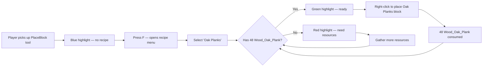

# Building Tools — Product Vision

## Player Experience Goal

Building should feel **fluid and efficient**. When a player wants to place the same block repeatedly — building a wall, laying a floor, constructing a roof — they shouldn't need to repeatedly open a crafting bench, craft a stack, place blocks until the stack runs out, then return to the bench. Instead, a **PlaceBlock tool** armed with a recipe lets the player place blocks directly from inventory resources, one at a time, indefinitely, without interrupting their building flow.

The tool communicates its state **at a glance**: blue means idle, green means ready, red means out of resources. The player never has to guess whether the next click will work.

## Relationship to Resource Economy

The PlaceBlock system **does not change the resource economy**. It compresses "craft then place" into a single "place (auto-consume)" action. The resource costs are identical to bench crafting. Blocks placed via PlaceBlock are indistinguishable from blocks crafted and placed normally. The gather→craft→place→break loop defined in the [Resource Economy vision](vision.md) remains symmetric.

## Behavioral Contracts

1. **The PlaceBlock is never consumed by placement.** Right-clicking to place a block removes recipe inputs from inventory — never the PlaceBlock item itself. The player keeps the tool indefinitely.

2. **Each placement costs exactly one recipe's worth of scaled inputs.** The resources consumed per placement are identical to what the player would pay at the bench, including 12× scaling for non-base recipes (per Resource Economy Contract #3). A PlaceBlock does not create a cheaper path.

3. **Blocks placed via PlaceBlock are indistinguishable from blocks crafted-then-placed normally.** Same block type, same break drops, same physics behavior. There is no "PlaceBlock-placed" flag or behavioral difference.

4. **The PlaceBlock's visual state always reflects current inventory truth.** Green means "you CAN place right now." Red means "you CANNOT place right now." Blue means "no recipe selected." Every inventory change, every placement, every trade triggers re-evaluation. There must be no stale states.

5. **Recipe assignment is free and non-destructive.** Assigning, changing, or clearing a recipe consumes zero materials, produces zero outputs, and does not alter any inventory item except the PlaceBlock's own metadata.

6. **All assignment routes produce identical outcomes.** F-key menu, Assignment Bench, and Pocket Bench integration all write the same metadata, trigger the same quality swap, and reference the same recipe pool.

7. **A PlaceBlock with no recipe (blue) does nothing on right-click.** No debug block, no error block, no phantom placement. The world is never modified.

8. **A PlaceBlock in red state (armed, no resources) does not place.** Right-click is cancelled. No block appears, no partial state.

9. **A PlaceBlock cannot be armed with non-block recipes.** If a recipe's output is a non-block item (Rope, Fibre, tools), it must not appear in the PlaceBlock's recipe browser. The PlaceBlock is a building tool — it places blocks.

10. **PlaceBlock metadata survives disconnection, death, and inventory transfer.** The armed recipe persists across sessions, chest storage, and player trades. Metadata is on the ItemStack, not on the player.

11. **The PlaceBlock respects all existing economy contracts.** It does not create material duplication paths, bypass scaling, or break the gather→craft→place→break round-trip.

## UX Flow

## Visual Feedback Model

| Color | Quality | Meaning |
|-------|---------|---------|
| Blue | Tool | No recipe assigned — idle |
| Green | Uncommon | Recipe armed, resources available — ready to place |
| Red | Developer | Recipe armed, resources insufficient — blocked |

**Primary feedback**: Slot highlight color (instant, at-a-glance).
**Authoritative feedback**: Tooltip text showing armed recipe name and resource status. Color alone should not be the only distinguishing factor.

**Known limitation**: Red/green color blindness (~8% of male players) makes the ready/blocked distinction harder to perceive by color alone. Tooltip text mitigates this. A future iteration may add icon overlays.

## Edge Cases & Decisions

| Scenario | Decision | Rationale |
|----------|----------|-----------|
| Player rapid-fires placements | Each placement re-checks resources before executing | Prevents overplacement beyond resources |
| Player has exactly 1 recipe's worth left | Green → placement succeeds → immediate swap to Red | Transition must feel instant |
| External inventory change (admin /give, trade) | Triggers quality re-evaluation | Stale color = broken trust |
| Player disconnects holding armed PlaceBlock | Metadata persists; quality re-evaluated on reconnect | ItemStack metadata is source of truth |
| Recipe removed by game update | PlaceBlock falls back to blue (Default) with recipe cleared | Never reference a nonexistent recipe |
| Multiple PlaceBlocks with different recipes | Each independently tracked via per-ItemStack metadata | No global "active recipe" concept |
| PlaceBlock armed with a base block recipe | Allowed — costs unscaled inputs (per economy Contract #6) | Same rules as bench crafting |
| Player breaks a block placed by PlaceBlock | Same drops as any other instance of that block type | Indistinguishable blocks (Contract #3) |
| PlaceBlock in a chest or dropped | Metadata persists; quality re-evaluated when picked up | Quality requires a player's inventory to check against |

## Anti-Patterns to Reject

- **Allowing placement when resources are insufficient, even transiently.** The check-then-consume must be atomic.
- **Making PlaceBlock-placed blocks behave differently from bench-crafted blocks.** Drop behavior must be identical regardless of placement method.
- **Creating a separate "PlaceBlock economy" with different costs.** The PlaceBlock is a UX convenience, not an economic mechanism.
- **Consuming the PlaceBlock tool itself on placement.** This would make it a block item, not a building tool.
- **Showing stale quality colors after inventory changes.** Quality swap must be reactive.
- **Allowing non-block recipes in the PlaceBlock browser.** Non-block recipes belong at the bench.
- **Requiring the player to understand metadata or variant internals.** The player sees "ready" or "not ready," not BSON fields.
- **Making recipe assignment cost materials.** Free assignment encourages experimentation.
