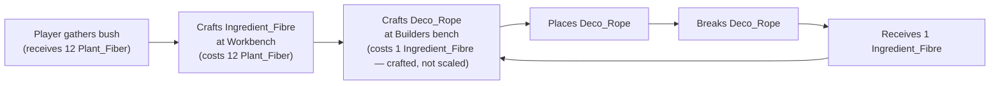
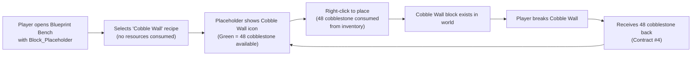

# Resource Economy — Product Vision

## Player Experience Goal

Gathering resources should feel **rewarding and proportional**. When a player breaks a natural rock, they receive a generous yield (12× the vanilla amount), making exploration feel productive. When they craft at a bench, the recipe costs scale to match — a wall that normally costs 4 stone now costs 48, but that's exactly what 4 natural blocks gave them. The result is that **the craft-place-break loop feels fair and round-trips cleanly**: you gather materials, craft something, place it, and if you change your mind and break it, you get those materials back — not the crafted block itself.

The system should be **invisible to the player** once configured. No lag at startup, no unexplained recipe cost mismatches, no items that break the economy because they were missed. An admin configures it once, and it just works.

## Behavioral Contracts

1. **Natural blocks drop 12× their vanilla quantity.** A rock that drops 1 cobblestone now drops 12.
2. **Natural resource stack sizes scale to 12×** their vanilla maximum to accommodate the increased yield.
3. **Bench recipe inputs are scaled per-input based on classification.** Each input is independently classified: raw material inputs are scaled ×12; crafted intermediate inputs retain their vanilla quantities. If a fence costs 2 planks (raw), it costs 24. If a recipe costs 1 Ingredient_Fibre (crafted), it stays 1. This applies to ALL recipes at registered benches — block outputs AND non-block outputs.
4. **Breaking a crafted block drops its recipe ingredients**, not the block itself. The quantities match the scaled recipe cost divided by output quantity.
5. **Placing a natural block consumes 12× of the item** (enforced at runtime by PlacementCostScaler), so the place-break loop is symmetric.
6. **Base block recipes are excluded from cost scaling** — these are block recipes where every input is a raw natural resource (e.g., 1× Rock_Stone → Rock_Stone_Cobble). Their costs are implicitly scaled by Contract #1 (the natural drops are already 12×).
7. **Processed ingredients are NOT natural items and are NOT scaled.** Items like `Ingredient_Fibre` (crafted from `Plant_Fiber` at another bench) are crafted intermediates. Because their own recipe already consumed scaled raw inputs, scaling them again would double-count. Crafted intermediate inputs retain their vanilla quantity.
8. **The economy configuration persists to disk.** Once calculated, modifications are saved so they do not need to be recomputed on every server boot.
9. **Admins can inspect, recalculate, and reset** the economy via in-game commands at any time.

## UX Flow

## Edge Cases & Decisions

| Scenario | Decision | Rationale |
|----------|----------|-----------|
| Recipe input is `Ingredient_Fibre` (a crafted intermediate) | Do NOT scale this input — retain vanilla quantity | `Ingredient_Fibre` is crafted from `Plant_Fiber`. Its cost was already absorbed when Plant_Fiber was scaled at the Workbench recipe. Scaling again would double-count. |
| Recipe has mixed inputs (e.g., 1 raw + 1 crafted intermediate) | Scale each input independently: raw inputs ×12, crafted inputs ×1 | Per-input classification ensures each resource is scaled exactly once across the full crafting chain. |
| Recipe output is a block item classified as "base" (all inputs are raw natural resources) | Do NOT scale its recipe cost | The inputs already drop at 12× from natural blocks (Contract #1). Scaling would make them cost 144×. |
| Recipe at a bench not registered (e.g., Farmingbench, Stonecutter) | Do NOT scale | Only registered bench recipes participate. Expansion can add benches later. |
| Block destroyed by physics cascade | Same drops as manual breaking | Player expectation: blocks don't vanish into nothing. |
| Block placed by another player is broken | Same behavior — drops recipe ingredients | Consistency: all instances of a block type behave identically. |
| Server restarts after economy is configured | Economy persists — no recomputation | Startup speed and determinism. Recomputation only via explicit command. |
| Economy manifest is stale (game update changed recipes) | Admin runs recalculate command | The manifest includes a version/hash so staleness can be detected. |

## The Three Phases of the Economy

The 12× resource economy operates in three distinct phases, each with its own systems and contracts:

### Phase 1: Gather (Breaking & Dropping)

**Systems:** DropScaler (natural block scaling), block-breaking drop overrides

When a player breaks blocks, they receive scaled yields. Natural blocks give 12× vanilla quantity. Crafted blocks return their scaled recipe ingredients. This is the **input** side of the economy — how resources enter the player's inventory.

### Phase 2: Craft (Recipe Scaling)

**Systems:** DropScaler (recipe cost scaling), BenchRecipeRegistries, BenchCategoryProcessors

When a player crafts at a bench, recipe costs are scaled per-input to match the generous gathering yields. Raw material inputs are scaled ×12 (a wall costing 4 stone in vanilla costs 48 in the scaled economy — exactly what 4 natural blocks yielded). Crafted intermediate inputs retain their vanilla quantities because their own recipe already consumed scaled raw inputs. This is the **transformation** side of the economy — how raw resources become useful items.

### Phase 3: Build (Placement & Construction)

**Systems:** PlacementCostScaler (natural blocks), PlaceBlock Building Tool (crafted blocks)

When a player places blocks into the world, the economy enforces costs:

- **Natural blocks** (stone, wood, dirt): PlacementCostScaler consumes 11 extra items at placement time, making each placement cost 12× total. This ensures the gather→place loop is symmetric.
- **Crafted blocks** (walls, fences, decorations): The **PlaceBlock Building Tool** enables a deferred-consumption workflow. Instead of crafting a block into inventory and then placing it, the player selects a recipe at the **Blueprint Bench** — a dedicated workbench block placed in the world — arms a placeholder tool with that recipe, and places the block directly into the world. Resources are consumed from the player's inventory **at placement time**, not at recipe selection time.

The Build phase is the **output** side of the economy — how resources leave the player's inventory and enter the world. Both placement systems ensure that `gather → build → break` is a closed loop: whatever was consumed to place a block is returned when it's broken.

### The Three Benches — Player-Facing Roles

The building economy uses three distinct bench types. Each serves a different player need, and all three coexist:

| Bench | Type | Workflow | Recipe Scope | Player Action |
|-------|------|----------|--------------|---------------|
| **Builders Bench** | Physical block in world | Craft → item goes to inventory | Structural crafting categories (walls, stairs, doors, etc.) | Walk up, interact, craft normally |
| **Portable Bench** | Handheld item (F-press) | Craft anywhere → item goes to inventory | Same categories as a physical bench, but mobile | Hold item, press F, craft on the go |
| **Blueprint Bench** | Physical block in world | Select recipe → arm placeholder → place blocks directly | ALL placeable recipes from ANY registered bench | Walk up, interact with placeholder, select recipe, go build |

**Why the Blueprint Bench exists alongside the Builders Bench:**
The Builders Bench is a standard crafting station — you put in materials, you get a finished item in your inventory. The Blueprint Bench serves a fundamentally different purpose: it doesn't craft items at all. Instead, it **arms a tool** that lets you place blocks directly into the world, consuming resources only when you place each block. The Builders Bench answers "I need 5 walls in my inventory." The Blueprint Bench answers "I want to build a house wall by wall, right now."

The Blueprint Bench is a **new block**, cloned from the Builders Bench asset (`Bench_Builders`) but configured with a wider recipe scope — all placeable block and furniture recipes across all registered benches. It does NOT modify the existing Builders Bench.

### PlaceBlock Building Tool — Player Experience

The PlaceBlock tool transforms the building experience from a craft-then-place workflow into a **select-then-build** workflow:

1. **At the Blueprint Bench**: The player walks up to a placed Blueprint Bench block in the world and interacts with it while holding a `Block_Placeholder` item. The bench displays all placeable recipes from every registered bench, filtered by what the player can afford (checking inventory). Selecting a recipe transforms the placeholder to show the selected block's icon — **no resources are consumed yet**.

2. **In the world**: The armed placeholder integrates with the engine's block preview system, showing a ghost of the selected block at valid placement positions. The player sees real-time feedback via rarity-based color indicators:
   - **Blue** (Tool quality): No recipe selected — placeholder is unarmed
   - **Green** (Uncommon quality): Recipe selected, resources available — ready to place
   - **Red** (Developer quality): Recipe selected, resources insufficient — cannot place

3. **On placement**: Right-clicking a valid location consumes the scaled recipe inputs from inventory, then places the actual crafted block. The placeholder remains armed — the player can keep placing without returning to the bench.

4. **On break**: The placed block behaves identically to any other crafted block (Contract #4). It drops its recipe ingredients at the scaled quantity. The player cannot distinguish between a block placed via the PlaceBlock tool and one placed from inventory.

### PlaceBlock Building Tool — Behavioral Contracts

10. **Recipe selection does NOT consume resources.** Selecting a recipe at the bench only transforms the placeholder's visual state and armed recipe reference. Resources are consumed exclusively at placement time. This ensures the player can freely browse and change their selection without economic penalty.

11. **Resource consumption occurs atomically at placement time.** When the player right-clicks to place, the system checks the player's inventory for the recipe's (already-scaled) inputs. If sufficient resources exist, they are deducted in a single atomic operation and the crafted block is placed. If insufficient, placement is denied and no resources are consumed. Partial consumption must never occur.

12. **The PlaceBlock tool and PlacementCostScaler are mutually exclusive per placement event.** A `PlaceBlockEvent` is handled by exactly one system: PlacementCostScaler for natural blocks (Contract #5), or the PlaceBlock tool for armed-placeholder placements. They must never both fire on the same event.

13. **Rarity-based indicators reflect real-time resource availability.** The placeholder's quality indicator updates whenever inventory contents change (inventory events) and after each placement (resource deduction). The indicator must never show "available" (green) when resources are actually insufficient, as this would violate the player's trust in the feedback system.

14. **Placed blocks are indistinguishable from normally-crafted blocks.** Once a block is placed via the PlaceBlock tool, it IS the crafted block — it has the same block type, the same breaking behavior (Contract #4), and the same drops. There is no "placed-via-tool" metadata. A player breaking a block cannot and should not know how it was placed.

## Anti-Patterns to Reject

- **Scaling crafted intermediate inputs ×12** as if they were raw materials. `Ingredient_Fibre` already cost 12× Plant_Fiber to craft — scaling it again at the Deco_Rope recipe would double-count. Each input must be classified independently: raw → scale ×12, crafted → retain vanilla.
- **Recomputing asset modifications on every server boot.** This is slow, fragile, and prevents admins from verifying what was changed. Modifications must be persistable and inspectable.
- **Skipping non-block recipes** because they "don't have a block to modify." The recipe cost still needs scaling. Only the *drop modification* (Phase 4a) is block-specific.
- **Applying a blanket ×12 multiplier to all inputs in a recipe.** The leaf-only model requires per-input classification. Each input is independently checked: if it is a raw natural drop, scale ×12; if it is a crafted intermediate, retain vanilla quantity. Treating all inputs uniformly violates the leaf-only principle.
- **Consuming resources at recipe selection time in the PlaceBlock flow.** This would eliminate the core value of the building tool — the ability to freely browse recipes and change your mind. The deferred-consumption model is intentional.
- **Allowing both PlacementCostScaler and PlaceBlock tool to fire on the same PlaceBlockEvent.** This would double-charge the player. The systems must be mutually exclusive based on whether the placed item is a natural block or an armed placeholder.
- **Storing "placed-via-PlaceBlock" metadata on blocks.** Once placed, a block is just a block. Adding placement-source metadata would create a hidden distinction that violates Contract #14 and complicates the break-return logic.
- **Using the Portable Bench (F-press handheld) for the PlaceBlock arming flow.** The Portable Bench is a craft-anywhere convenience tool that produces inventory items. The Blueprint Bench is a physically-placed workbench block that arms placeholder tools for deferred placement. These are fundamentally different workflows and must not be conflated.
- **Modifying the existing Builders Bench to support PlaceBlock arming.** The Builders Bench is a standard crafting station. The Blueprint Bench is a new, separate block that coexists alongside it. Merging them would confuse two distinct player workflows (craft-to-inventory vs. arm-and-place).
