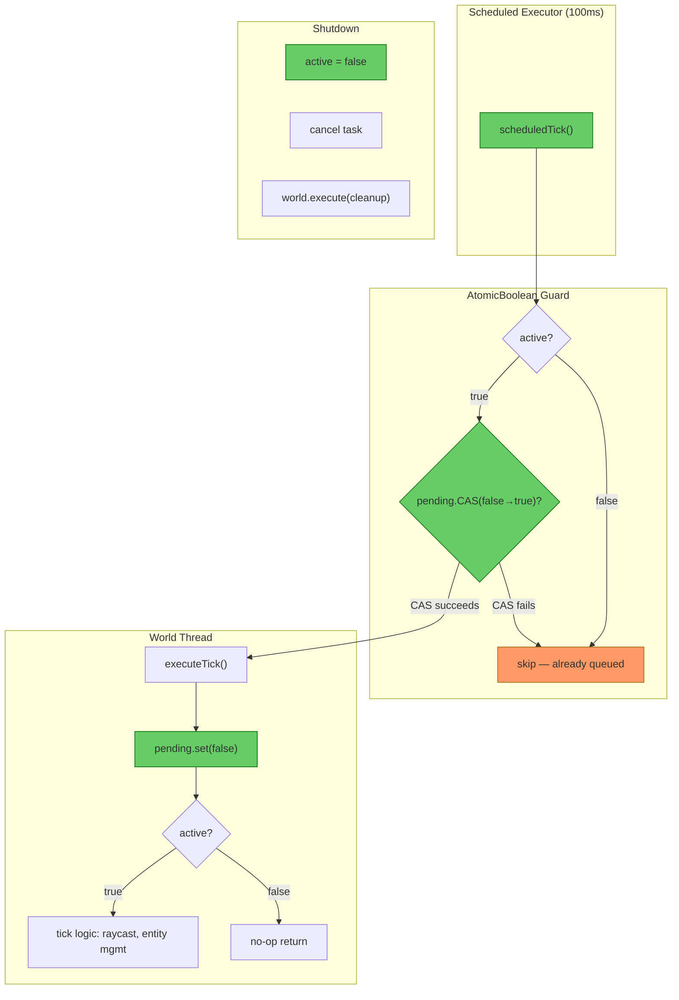
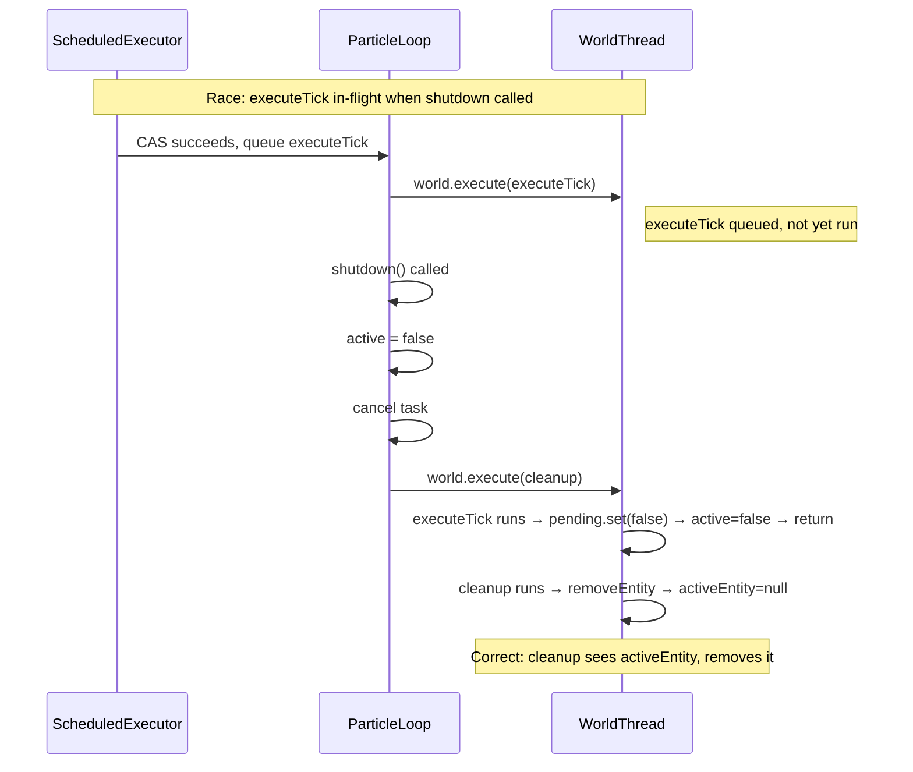
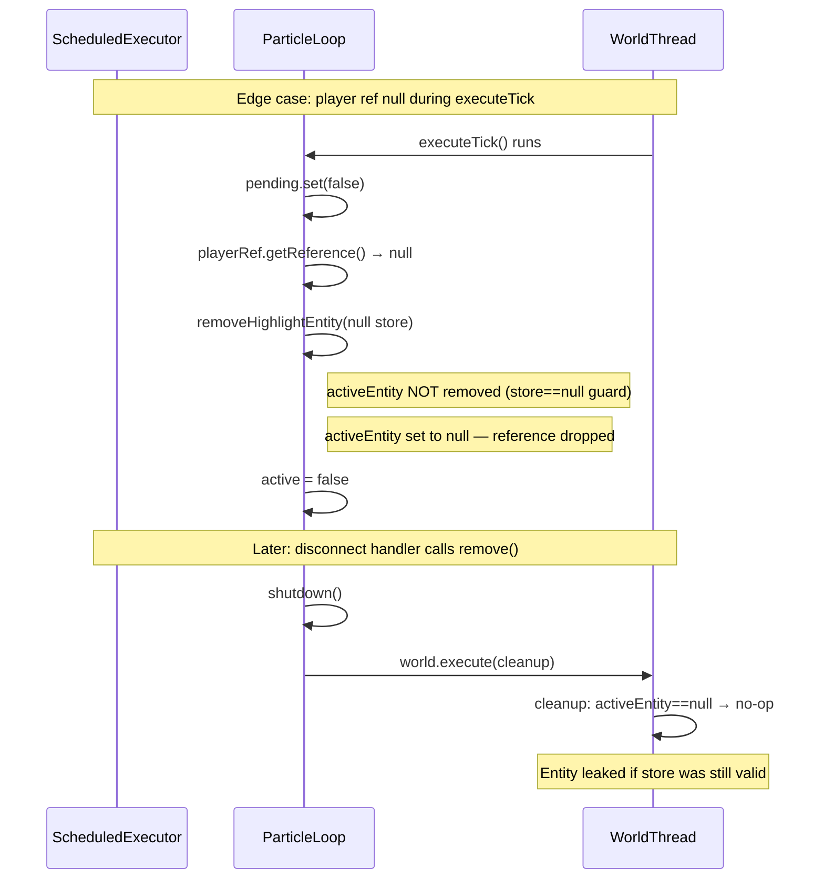

# Review: BlueprintBookParticleLoop Queue Guard

**File reviewed:** `src/main/java/com/CodeCreature/ui/blueprintbook/BlueprintBookParticleLoop.java`  
**Design doc:** `docs/design-particle-loop-queue-guard.md`  
**Comparison:** `src/main/java/com/CodeCreature/stencil/AffordabilityCoalescer.java`  
**Date:** 2026-05-29

---

## 1. Executive Summary

The implementation correctly applies the `AtomicBoolean pending` coalescing pattern to prevent world thread queue flooding. The shutdown lifecycle is sound — ordering is correct and entity cleanup is safely deferred to the world thread. No Critical or High findings. Two medium-severity edge cases are worth noting for defensive hardening.

**Verdict: PASS**

---

## 2. Architecture Diagram — Coalescing Guard Flow



---

## 3. Findings Table

| # | Category | Severity | Location | Detail |
|---|----------|----------|----------|--------|
| 1 | Correctness | 🔵 Informational | [BlueprintBookParticleLoop.java](../src/main/java/com/CodeCreature/ui/blueprintbook/BlueprintBookParticleLoop.java#L96-L107) | **Queue guard is correct.** `pending.compareAndSet(false, true)` in `startUpdateLoop()` + `pending.set(false)` as first line of `executeTick()` ensures at most one `world.execute()` lambda is queued. Matches the AffordabilityCoalescer pattern. |
| 2 | Correctness | 🔵 Informational | [BlueprintBookParticleLoop.java](../src/main/java/com/CodeCreature/ui/blueprintbook/BlueprintBookParticleLoop.java#L271-L284) | **Shutdown ordering is correct.** `active = false` → `cancel(false)` → queue cleanup is the right sequence. The `volatile` on `active` ensures visibility across threads. Queuing cleanup via `world.execute()` guarantees it runs after any in-flight `executeTick()`. |
| 3 | Safety | 🟡 Should Fix | [BlueprintBookParticleLoop.java](../src/main/java/com/CodeCreature/ui/blueprintbook/BlueprintBookParticleLoop.java#L111-L118) | **Entity reference dropped without removal when player ref is null.** When `playerRef.getReference()` returns `null`, `removeHighlightEntity(null)` is called. The null store guard skips `store.removeEntity()`, but `activeEntity` is set to `null` — dropping the reference. The subsequent `shutdown()` cleanup sees `activeEntity==null` and no-ops. If the entity store was still alive (player ref null but world intact), the highlight entity leaks. **Recommendation:** Before calling `removeHighlightEntity(null)`, attempt to get the store from `activeEntity.getStore()` as a fallback, matching how `shutdown()` retrieves the store. |
| 4 | Safety | 🟠 QA | [BlueprintBookParticleLoop.java](../src/main/java/com/CodeCreature/ui/blueprintbook/BlueprintBookParticleLoop.java#L275-L284) | **Entity leaks if `world.execute()` throws in `shutdown()`.** If the world is shutting down and rejects the cleanup lambda, the entity is not removed. The exception is caught and logged, but no fallback cleanup is attempted. This is likely benign (world shutdown cleans up all entities), but should be verified. **Recommendation:** Verify that world shutdown destroys all non-serialized entities. If not, consider synchronous entity removal as a fallback. |
| 5 | Performance | 🔵 Informational | [BlueprintBookParticleLoop.java](../src/main/java/com/CodeCreature/ui/blueprintbook/BlueprintBookParticleLoop.java#L96) | **Scheduled task keeps firing after `active = false`.** When `executeTick()` detects an invalid player, it sets `active = false` but does not cancel the task — relying on `remove()` to cancel it later. Each 100ms tick does a volatile read + return, which is negligible but unnecessary. Acceptable trade-off for cleaner lifecycle ownership. |
| 6 | Correctness | 🔵 Informational | [BlueprintBookParticleLoop.java](../src/main/java/com/CodeCreature/ui/blueprintbook/BlueprintBookParticleLoop.java#L101-L104) | **`pending` reset in catch block is an improvement over AffordabilityCoalescer.** If `world.execute()` itself throws, the particle loop resets `pending.set(false)` so subsequent ticks can retry. `AffordabilityCoalescer.markDirty()` does not do this — if `world.execute()` threw there, `pending` would stay `true` permanently, silently stopping all refreshes. Consider backporting this fix. |
| 7 | Correctness | 🔵 Informational | [BlueprintBookParticleLoop.java](../src/main/java/com/CodeCreature/ui/blueprintbook/BlueprintBookParticleLoop.java#L50) | **`EFFECT_DURATION_MILLIS = 500` is correct.** 5× the poll interval gives effects time to survive a few delayed ticks without visible flickering. The old `101ms` value left zero margin. |

---

## 4. Shutdown Race Analysis

The most important correctness property is that the disconnect race between `executeTick()` and `shutdown()` cannot leak entities. Both paths are serialized on the world thread:



**Verdict:** The world thread's single-threaded execution model guarantees ordering. `executeTick` and cleanup cannot interleave. All paths are safe.

---

## 5. Edge Case: Null Player Reference



**Fix:** In `executeTick()`, when `ref == null`, fall back to `activeEntity.getStore()`:

```java
if (ref == null || !ref.isValid()) {
    Store<EntityStore> store = (ref != null) ? ref.getStore()
            : (activeEntity != null && activeEntity.isValid() ? activeEntity.getStore() : null);
    removeHighlightEntity(store);
    active = false;
    return;
}
```

---

## 6. AffordabilityCoalescer Consistency Comparison

| Aspect | AffordabilityCoalescer | BlueprintBookParticleLoop | Match? |
|--------|----------------------|--------------------------|--------|
| Guard field | `AtomicBoolean pending` | `AtomicBoolean pending` | ✅ |
| Schedule guard | `pending.compareAndSet(false, true)` | `pending.compareAndSet(false, true)` | ✅ |
| Clear timing | `pending.set(false)` before work | `pending.set(false)` before work | ✅ |
| Null world check | `if (world == null) return` | World is `@Nonnull` field — N/A | ✅ |
| Failure recovery | None — `pending` stays `true` | `catch → pending.set(false)` | ⬆️ Better |
| Lifecycle mgmt | None (per-player, discarded on unregister) | `volatile active` + `shutdown()` | ⬆️ Extended (required) |

The particle loop faithfully applies the pattern and extends it with lifecycle management that the coalescing use case doesn't need. The failure recovery in the catch block is strictly an improvement.

---

## 7. Recommendation

**Finding #3 (entity reference drop)** is the only actionable item. It's a narrow race that requires:
1. Player reference becoming null while `executeTick` is running
2. The entity store still being alive
3. The highlight entity not being cleaned up by world shutdown

This is unlikely but should be hardened. All other findings are informational.

---

→ @Engineer Fix finding #3 (null-ref entity fallback) per the suggested fix in section 5  
→ @Engineer Consider backporting the `pending.set(false)` catch-block pattern to `AffordabilityCoalescer.markDirty()` (finding #6)
