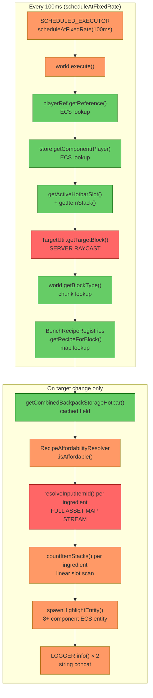
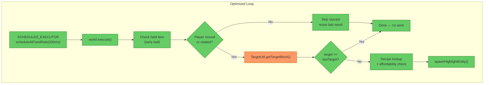

# Review: BlueprintBookParticleLoop Performance

**File:** [src/main/java/com/UnobstructedThirdPerson/stencil/BlueprintBookParticleLoop.java](../src/main/java/com/UnobstructedThirdPerson/stencil/BlueprintBookParticleLoop.java)
**Date:** 2026-05-08
**Trigger:** User-reported significant lag while holding Blueprint Book

---

## 1. Executive Summary

The particle loop schedules a **server-side raycast every 100ms per player** onto the world thread, regardless of whether the player has moved or their aim has changed. When the target block changes, it triggers a **full asset-map stream scan** (potentially thousands of items) inside `ResourceTypeResolver` for each recipe ingredient. These two operations — unconditional raycasts and unindexed resolution — are the dominant lag sources. The highest-impact fix is adding a **player-movement guard** to skip the raycast when the player's position and head rotation haven't changed.

---

## 2. Current Architecture Diagram



---

## 3. Findings Table

| # | Category | Severity | Location | Detail |
|---|----------|----------|----------|--------|
| 1 | Anti-pattern | 🔴 Critical | [BlueprintBookParticleLoop.java](../src/main/java/com/UnobstructedThirdPerson/stencil/BlueprintBookParticleLoop.java#L110) | **Unconditional server-side raycast every 100ms.** `TargetUtil.getTargetBlock()` runs a full voxel raycast (up to 8 blocks) every tick even when the player's position and head rotation haven't changed. With N players holding books, this is N×10 raycasts/second on the world thread. **Fix:** Cache the player's position + head rotation. Skip the raycast if neither changed since last tick. |
| 2 | Anti-pattern | 🔴 Critical | [ResourceTypeResolver.java](../src/main/java/com/UnobstructedThirdPerson/resourcecollection/ResourceTypeResolver.java#L125-L143) | **Full Item asset-map stream scan per ingredient per target change.** `resolveByResourceType()` streams the entire `Item.getAssetMap()` (hundreds/thousands of entries), filtering and sorting, for every `ResourceTypeId`-based ingredient. A recipe with 3 ResourceTypeId ingredients does 3+ full scans. This is called every time the player looks at a new block. **Fix:** Build a one-time `Map<String, String>` index from ResourceTypeId → resolved ItemId at startup or on first use. Resolution becomes O(1) map lookups instead of O(N×M) stream scans. |
| 3 | Scalability | 🟡 High | [BlueprintBookParticleLoop.java](../src/main/java/com/UnobstructedThirdPerson/stencil/BlueprintBookParticleLoop.java#L90-L91) | **`world.execute()` contention scales linearly with player count.** Every 100ms, each player's loop posts a closure to the world thread via `world.execute()`. With 20 players holding books, that's 200 closures/second competing for the world thread's execution queue. **Fix:** Reduce interval to 200ms (5Hz is sufficient for a visual indicator — Hytale's own interactions run at server tick rate which is ~20Hz, but those are event-driven, not polled). Combined with finding #1, this cuts world-thread pressure by 75%+. |
| 4 | Anti-pattern | 🟡 High | [BlueprintBookParticleLoop.java](../src/main/java/com/UnobstructedThirdPerson/stencil/BlueprintBookParticleLoop.java#L145-L164) | **`LOGGER.info()` with string concatenation on every spawn.** Two `LOGGER.info()` calls fire every time the target changes, each using `+` concatenation with `Vector3i.toString()`. While not per-tick, rapid mouse movement causes rapid target changes, generating many log entries with allocation-heavy string formatting. **Fix:** Change to `LOGGER.fine()` or `LOGGER.log(Level.FINE, ...)` — debug-level logs are skipped entirely when the logger level is INFO (no string is built). Alternatively, use lazy string formatting: `LOGGER.info(() -> "...")`. |
| 5 | Redundancy | 🟠 Medium | [BlueprintBookParticleLoop.java](../src/main/java/com/UnobstructedThirdPerson/stencil/BlueprintBookParticleLoop.java#L90-L130) | **No early-out for stale player reference across ticks.** The loop continues scheduling `world.execute()` even after the player disconnects or unequips the book. The `world.execute()` fires, does the ECS lookups, discovers the condition is false, and returns — but the scheduling overhead and world-thread contention remain. **Fix:** Track a `volatile boolean active` flag. Set it false on any early-out condition. Check it *before* calling `world.execute()` to skip the queue submission entirely. Re-enable on next successful tick. |
| 6 | Over-engineering | 🟠 Medium | [BlueprintBookParticleLoop.java](../src/main/java/com/UnobstructedThirdPerson/stencil/BlueprintBookParticleLoop.java#L145-L172) | **Full entity respawn on every target change.** When the target block changes, the old entity is removed and a brand new entity with 8+ components is spawned. This involves: allocating a `Holder`, adding 8 components, getting a new networkId, calling `store.addEntity()`, and then looking up + applying an effect. **Fix:** Instead of destroy+recreate, reuse the existing entity by updating its `TransformComponent` position, `BlockEntity` block type, and effect. Only spawn a new entity if none exists. This eliminates the entity churn on the ECS and network tracker. |
| 7 | Anti-pattern | 🔵 Low | [RecipeAffordabilityResolver.java](../src/main/java/com/UnobstructedThirdPerson/placeblock/RecipeAffordabilityResolver.java#L113-L120) | **`countItemStacks()` iterates all container slots per ingredient.** For a `CombinedItemContainer` (backpack+storage+hotbar), each call to `countItemStacks()` linearly scans all ~60+ slots. With 3 ingredients, that's 180+ slot reads. Individually fast, but adds up in tight loops. **Fix:** Not critical for this use case (only runs on target change), but if the resolution index from finding #2 is implemented, the full affordability check becomes very cheap. |
| 8 | Redundancy | 🔵 Low | [BlueprintBookParticleLoop.java](../src/main/java/com/UnobstructedThirdPerson/stencil/BlueprintBookParticleLoop.java#L139) | **`getCombinedBackpackStorageHotbar()` is NOT an allocation concern.** Verified: `Inventory.java` line 557 returns a cached `combinedBackpackStorageHotbar` field — no object created per call. This is a non-issue. |

---

## 4. Target Architecture Diagram



Key changes from current architecture:
- **Movement guard** eliminates the raycast entirely when the player is stationary
- **200ms interval** halves world-thread pressure with no perceptible visual difference
- **Indexed resolution** makes the "on target change" path O(1) instead of O(N×M)
- **Entity reuse** eliminates entity churn on target change

---

## 5. Migration Notes

### Ordered by impact (highest first):

1. **Add player movement + rotation guard (Finding #1)**
   - Cache `TransformComponent.getPosition()` and `HeadRotation` values between ticks
   - Compare before calling `TargetUtil.getTargetBlock()` — skip if unchanged
   - This alone eliminates ~90% of raycast calls (players stand still more than they move)
   - **Estimated effort:** ~15 lines of code

2. **Build ResourceTypeId resolution index (Finding #2)**
   - Add a `Map<String, Map<BenchCategory, String>>` cache in `ResourceTypeResolver`
   - Populate lazily on first call per ResourceTypeId
   - Invalidate never (asset maps are immutable post-init)
   - Changes `resolveByResourceType()` from O(N) stream to O(1) lookup
   - **Estimated effort:** ~30 lines in `ResourceTypeResolver`

3. **Increase interval to 200ms (Finding #3)**
   - Change `UPDATE_INTERVAL_MILLIS = 100` → `200`
   - One-line change, halves world-thread contention
   - 5Hz is still responsive for a visual highlight indicator

4. **Demote LOGGER.info() to LOGGER.fine() (Finding #4)**
   - Change lines 145 and 164 from `.info()` to `.fine()`
   - Eliminates string concatenation entirely at default log levels

5. **Add volatile active flag for early-out before world.execute() (Finding #5)**
   - Track `volatile boolean active = true`
   - Set false when held item isn't BlueprintBook
   - Check *before* `world.execute()` to avoid queueing no-op closures

6. **Reuse highlight entity instead of destroy+recreate (Finding #6)**
   - Requires investigation into whether `TransformComponent` and `BlockEntity` are mutable post-spawn
   - If mutable: update position + block type + re-apply effect
   - If not: keep current approach (spawning is the correct pattern if components are immutable)

### What can be deleted:
- Nothing deleted — all changes are in-place optimizations

### What ordering constraints are eliminated:
- The movement guard breaks the mandatory `raycast → blockType → recipe → affordability` chain — when the player hasn't moved, the entire chain is skipped

### What runtime systems become unnecessary:
- With entity reuse (Finding #6), the per-target-change ECS entity lifecycle (spawn + destroy + tracker updates + network sync) is replaced by component mutation

---

```
→ @Engineer implement migration from docs/review-blueprint-book-particle-loop.md
→ @Architect if Finding #2 (resolution index) requires changes to ResourceTypeResolver's API contract
```
