# Blueprint System Dependency Analysis

## Executive Summary

The codebase contains **~100 source files** across 15 packages. The **blueprint system** (Blueprint Book, Blueprint Bench, Stencil, PlaceBlock UI) accounts for **~50 files** — roughly half the codebase. The remaining **~50 files** belong to four independent systems: Camera Transparency, Shape Engine, Drop Scaling/Resource Economy, Portable Bench, Movement, Preview, and Debug utilities. The critical boundary is the `resourcecollection/` package, which is **shared infrastructure** — 7 files are required by the blueprint system, while 11 files serve only the drop-scaling pipeline.

## System Dependency Diagram

```mermaid
graph TB
    subgraph PLUGIN["Plugin Entry Point"]
        MAIN["UnobstructedThirdPersonPlugin"]
    end

    subgraph BLUEPRINT_SYSTEM["BLUEPRINT SYSTEM"]
        direction TB
        subgraph STENCIL["Stencil Package"]
            S1["StencilMetadata"]
            S2["StencilPlacementSystem"]
            S3["StencilDropDestroySystem"]
            S4["StencilSyncSystem"]
            S5["StencilVisualManager"]
            S6["StencilRadialInputListener"]
            S7["StencilRadialMenuPage"]
            S8["BlueprintBookParticleLoop"]
            S9["BlueprintBookPickStencilInteraction"]
            S10["RadialSegmentItem"]
        end

        subgraph PLACEBLOCK["PlaceBlock Package"]
            PB1["BlueprintBenchRecipeMutator"]
            PB2["PlaceBlockCostUtil"]
            PB3["RecipeAffordabilityResolver"]
            PB4["ResolvedIngredient"]
            PB5["ResourceScanner"]
            PB6["ResourceSnapshot"]
        end

        subgraph PLACEBLOCK_UI["PlaceBlock UI"]
            UI1["BlueprintSelectionPage"]
            UI2["BlueprintBenchOpenUIInteraction"]
            UI3["BlueprintBenchPrefs"]
            UI4["BlueprintBenchPrefsStore"]
            UI5["AffordabilityMode"]
            UI6["RecipeFilterPipeline"]
            UI7["ResourceTypeRegistry"]
            UI8["ItemGridTestPage"]
        end

        subgraph INGREDIENT["Ingredient Tree"]
            IT1["IngredientTree"]
            IT2["IngredientTreeBuilder"]
            IT3["IngredientTreeGridController"]
            IT4["IngredientSelectionModel"]
            IT5["IngredientGroup"]
            IT6["IngredientResourceType"]
            IT7["IngredientExactItem"]
            IT8["IngredientTreeNode"]
            IT9["CheckState"]
            IT10["NodeType"]
        end

        subgraph RC_SHARED["Shared Resource Collection"]
            RC1["RecipeFilterRegistry"]
            RC2["FilteredRecipeEntry"]
            RC3["BenchCategory"]
            RC4["BenchRecipeRegistries"]
            RC5["BenchRecipeRegistry"]
            RC6["ResourceTypeResolver"]
            RC7["NaturalResourceRegistry"]
        end

        subgraph BLUEPRINT_CMD["Blueprint Commands"]
            CMD1["PlaceBlockCommand"]
            CMD2["GridTestSubCommand"]
            CMD3["StencilSubCommand"]
            CMD4["ParticleCommand"]
        end

        subgraph BLUEPRINT_UTIL["Blueprint Utils"]
            BU1["ShapeAwareRaycast"]
            BU2["BlueprintBookQuickSelectPage"]
        end
    end

    subgraph NOT_BLUEPRINT["NOT-BLUEPRINT SYSTEMS"]
        direction TB
        subgraph CAMERA["Camera System"]
            C1["CameraTransparencyVolume"]
            C2["CameraTransparencyVolumeV2"]
            C3["DebugCube"]
        end

        subgraph SHAPE["Shape Engine"]
            SH1["shape/v1/*"]
            SH2["shape/v2/*"]
            SH3["CircularCone, SquarePyramid, etc."]
        end

        subgraph DROPS["Drop Scaling System"]
            D1["DropScaler"]
            D2["AbstractBenchProcessor"]
            D3["BuildersProcessor"]
            D4["FurnitureProcessor"]
            D5["OverlapProcessor"]
            D6["BenchBlockClassifier"]
            D7["BenchCategoryProcessor"]
            D8["AssetFieldAccessor"]
            D9["PlacementCostScaler"]
            D10["BreakBlockDiagnostic"]
            D11["ResourceConstants"]
        end

        subgraph PORTABLE["Portable Bench"]
            PO1["PortableBenchConfig"]
            PO2["PortableBenchConfigLoader"]
            PO3["PortableBenchInteraction"]
            PO4["PortableBenchRegistry"]
            PO5["PortableBenchWindow"]
            PO6["PortableStructuralWindow"]
        end

        subgraph OTHER["Other Systems"]
            O1["NewMovementSystem"]
            O2["NewMovementCommand"]
            O3["PreviewBlockManager"]
            O4["PreviewCommand"]
            O5["CameraPositionUtil"]
            O6["BlockSnapshot"]
        end

        subgraph CAM_CMD["Camera Commands"]
            CC1["UnobstructedCameraCommand"]
            CC2["StartCommand"]
            CC3["StopCommand"]
            CC4["ToggleBoundingShapesCommand"]
            CC5["DebugCommand"]
            CC6["BreakLogSubCommand"]
            CC7["DebugCubeShapeSubCommand"]
            CC8["DebugTexturedCubeSubCommand"]
            CC9["ListHitboxTypesSubCommand"]
            CC10["PreviewBlockSubCommand"]
        end
    end

    MAIN --> BLUEPRINT_SYSTEM
    MAIN --> NOT_BLUEPRINT

    style BLUEPRINT_SYSTEM fill:#d4edda,stroke:#28a745
    style NOT_BLUEPRINT fill:#f8d7da,stroke:#dc3545
    style PLUGIN fill:#cce5ff,stroke:#004085
```

---

## BLUEPRINT — Files to KEEP (50 files)

### `stencil/` — Stencil Placement Mechanic (10 files)

| # | File | Key Dependencies (internal) | Reason |
|---|------|---------------------------|--------|
| 1 | `stencil/StencilMetadata.java` | _(none — leaf node)_ | BSON metadata utility for stencil items; single source of truth for stencil detection/creation |
| 2 | `stencil/StencilPlacementSystem.java` | `StencilMetadata`, `PlaceBlockCostUtil` | Intercepts PlaceBlockEvent for stencils, consumes recipe materials |
| 3 | `stencil/StencilDropDestroySystem.java` | `StencilMetadata` | Prevents stencil items from spawning as world entities on drop |
| 4 | `stencil/StencilSyncSystem.java` | `StencilMetadata`, `StencilVisualManager` | Monitors hotbar changes and restores stencil qty after engine consumption |
| 5 | `stencil/StencilVisualManager.java` | `RecipeAffordabilityResolver` | Per-player visual overrides for stencil items (affordability glow) |
| 6 | `stencil/StencilRadialInputListener.java` | `StencilMetadata` | Detects middle-click while holding stencil to open radial menu |
| 7 | `stencil/StencilRadialMenuPage.java` | `RecipeAffordabilityResolver`, `ResolvedIngredient`, `BenchCategory`, `FilteredRecipeEntry`, `RecipeFilterRegistry` | Radial menu UI for stencil item selection |
| 8 | `stencil/BlueprintBookParticleLoop.java` | `BenchRecipeRegistries`, `RecipeAffordabilityResolver`, `ShapeAwareRaycast` | Particle effects on targeted block while holding blueprint book |
| 9 | `stencil/BlueprintBookPickStencilInteraction.java` | `BenchRecipeRegistries`, `FilteredRecipeEntry`, `RecipeFilterRegistry`, `StencilMetadata` | Interaction: raycast to block → create stencil from its recipe |
| 10 | `stencil/RadialSegmentItem.java` | _(none — data record)_ | Data holder for radial menu segments |

### `placeblock/` — Cost Calculation & Affordability (6 files)

| # | File | Key Dependencies (internal) | Reason |
|---|------|---------------------------|--------|
| 11 | `placeblock/BlueprintBenchRecipeMutator.java` | _(Hytale API only)_ | Creates shadow Blueprint_ recipes at asset load time |
| 12 | `placeblock/PlaceBlockCostUtil.java` | _(Hytale API only)_ | Per-unit placement cost computation (recipe input / output qty) |
| 13 | `placeblock/RecipeAffordabilityResolver.java` | `PlaceBlockCostUtil`, `BenchCategory`, `NaturalResourceRegistry`, `ResourceTypeResolver` | Full ingredient resolution chain + inventory affordability check |
| 14 | `placeblock/ResolvedIngredient.java` | _(none — data record)_ | Immutable result of ingredient resolution |
| 15 | `placeblock/ResourceScanner.java` | _(TODO — not yet implemented)_ | Future: scan player inventory + chests for resources |
| 16 | `placeblock/ResourceSnapshot.java` | _(none — data record)_ | Immutable resource snapshot for affordability checks |

### `placeblock/ui/` — Blueprint Bench UI (8 files)

| # | File | Key Dependencies (internal) | Reason |
|---|------|---------------------------|--------|
| 17 | `placeblock/ui/BlueprintSelectionPage.java` | `PlaceBlockCostUtil`, `RecipeAffordabilityResolver`, `ResolvedIngredient`, `StencilMetadata`, `BenchCategory`, `FilteredRecipeEntry`, `RecipeFilterRegistry`, `IngredientTree*`, `RecipeFilterPipeline` | Main Blueprint Bench UI page — recipe grid, filters, detail panel |
| 18 | `placeblock/ui/BlueprintBenchOpenUIInteraction.java` | `BlueprintSelectionPage` | Interaction type that opens the Blueprint Bench custom page |
| 19 | `placeblock/ui/BlueprintBenchPrefs.java` | `AffordabilityMode` | Serializable preferences for bench UI state |
| 20 | `placeblock/ui/BlueprintBenchPrefsStore.java` | `BlueprintBenchPrefs` | File-based persistence for per-player bench preferences |
| 21 | `placeblock/ui/AffordabilityMode.java` | _(none — enum)_ | Three-state affordability filter mode |
| 22 | `placeblock/ui/RecipeFilterPipeline.java` | _(Hytale API only)_ | Sequential filter pipeline for recipe display |
| 23 | `placeblock/ui/ResourceTypeRegistry.java` | _(none — static data)_ | Static registry of resource type filter entries with icons |
| 24 | `placeblock/ui/gridtest/ItemGridTestPage.java` | _(Hytale API only)_ | Test page for ItemGrid UI element discovery |

### `placeblock/ui/ingredienttree/` — Ingredient Filter Tree (10 files)

| # | File | Key Dependencies (internal) | Reason |
|---|------|---------------------------|--------|
| 25 | `placeblock/ui/ingredienttree/IngredientTree.java` | `IngredientGroup`, `IngredientResourceType`, `IngredientExactItem`, `IngredientTreeNode` | Tree data structure for ingredient hierarchy |
| 26 | `placeblock/ui/ingredienttree/IngredientTreeBuilder.java` | `IngredientTree`, `IngredientGroup`, `IngredientResourceType`, `IngredientExactItem` | Builds ingredient tree from recipe assets |
| 27 | `placeblock/ui/ingredienttree/IngredientTreeGridController.java` | `IngredientTree`, `IngredientSelectionModel`, `RecipeFilterPipeline`, `ResourceTypeResolver` | UI controller for ingredient tree grid |
| 28 | `placeblock/ui/ingredienttree/IngredientSelectionModel.java` | `IngredientTree`, `IngredientGroup`, `IngredientResourceType`, `IngredientExactItem` | Selection/check state model for tree nodes |
| 29 | `placeblock/ui/ingredienttree/IngredientGroup.java` | `IngredientTreeNode`, `IngredientResourceType` | Meta-group node (e.g., "Rock_Group") |
| 30 | `placeblock/ui/ingredienttree/IngredientResourceType.java` | `IngredientTreeNode`, `IngredientGroup`, `IngredientExactItem` | Resource type node (e.g., "Hardwood") |
| 31 | `placeblock/ui/ingredienttree/IngredientExactItem.java` | `IngredientTreeNode`, `IngredientResourceType` | Leaf node for exact item (e.g., "Wood_Oak_Planks") |
| 32 | `placeblock/ui/ingredienttree/IngredientTreeNode.java` | `NodeType` | Interface for all tree node types |
| 33 | `placeblock/ui/ingredienttree/CheckState.java` | _(none — enum)_ | NONE/SOME/ALL check state |
| 34 | `placeblock/ui/ingredienttree/NodeType.java` | _(none — enum)_ | META_GROUP/RESOURCE_TYPE/EXACT_ITEM |

### `resourcecollection/` — Shared Dependencies Used by Blueprint (7 files)

These files are **shared infrastructure** used by both the blueprint system and the drop-scaling system. The blueprint system directly imports them.

| # | File | Blueprint Consumers | Reason |
|---|------|-------------------|--------|
| 35 | `resourcecollection/RecipeFilterRegistry.java` | `BlueprintBookPickStencilInteraction`, `StencilRadialMenuPage`, `BlueprintSelectionPage` | Single source of truth for validated, filtered recipes |
| 36 | `resourcecollection/FilteredRecipeEntry.java` | `BlueprintBookPickStencilInteraction`, `StencilRadialMenuPage`, `BlueprintSelectionPage` | Immutable recipe snapshot data record |
| 37 | `resourcecollection/BenchCategory.java` | `RecipeAffordabilityResolver`, `StencilRadialMenuPage`, `BlueprintSelectionPage` | Bench classification enum controlling natural/non-natural preference |
| 38 | `resourcecollection/BenchRecipeRegistries.java` | `BlueprintBookParticleLoop`, `BlueprintBookPickStencilInteraction` | Aggregate recipe lookup across all bench registries |
| 39 | `resourcecollection/BenchRecipeRegistry.java` | _(used internally by BenchRecipeRegistries)_ | Per-bench recipe registry; managed by BenchRecipeRegistries |
| 40 | `resourcecollection/ResourceTypeResolver.java` | `RecipeAffordabilityResolver`, `IngredientTreeGridController` | Resolves ResourceTypeId inputs to concrete item IDs |
| 41 | `resourcecollection/NaturalResourceRegistry.java` | `RecipeAffordabilityResolver` | Maps block items to gatherable drop form |

### `command/placeblock/` + `command/ParticleCommand` — Blueprint Commands (4 files)

| # | File | Key Dependencies (internal) | Reason |
|---|------|---------------------------|--------|
| 42 | `command/placeblock/PlaceBlockCommand.java` | `GridTestSubCommand`, `StencilSubCommand` | Parent command for blueprint tool commands |
| 43 | `command/placeblock/subcommands/GridTestSubCommand.java` | `ItemGridTestPage` | Opens the grid test page |
| 44 | `command/placeblock/subcommands/StencilSubCommand.java` | `StencilMetadata` | Test command: creates stencil items |
| 45 | `command/ParticleCommand.java` | `BlueprintBookPickStencilInteraction` | Gets/sets blueprint book particle effect |

### `blueprintbook/` + `util/` — Blueprint Utilities (2 files)

| # | File | Key Dependencies (internal) | Reason |
|---|------|---------------------------|--------|
| 46 | `blueprintbook/BlueprintBookQuickSelectPage.java` | _(empty file)_ | Placeholder for blueprint book quick-select page |
| 47 | `util/ShapeAwareRaycast.java` | _(Hytale API only)_ | Hitbox-accurate raycast; used by `BlueprintBookParticleLoop` |

### Blueprint Test Files (3 files)

| # | File | Tests |
|---|------|-------|
| 48 | `test/.../placeblock/ui/AffordabilityModeTest.java` | `AffordabilityMode` |
| 49 | `test/.../placeblock/ui/ResourceTypeRegistryTest.java` | `ResourceTypeRegistry` |
| 50 | `test/.../stencil/StencilMetadataTest.java` | `StencilMetadata` |

---

## NOT-BLUEPRINT — Files to REMOVE (51 files + 1 entry point)

### Plugin Entry Point (1 file — SHARED, do not remove)

| # | File | Reason |
|---|------|--------|
| — | `UnobstructedThirdPersonPlugin.java` | **SHARED** — registers both blueprint and non-blueprint systems. Must be refactored to remove non-blueprint registrations, not deleted. |

### `camera/` — Camera Transparency System (3 files)

| # | File | Key Dependencies | Reason |
|---|------|-----------------|--------|
| 1 | `camera/CameraTransparencyVolume.java` | `shape/v1/*`, `BlockSnapshot` | V1 camera transparency volume — no blueprint imports |
| 2 | `camera/v2/CameraTransparencyVolumeV2.java` | `shape/v2/*`, `BlockSnapshot`, `DebugCube` | V2 camera transparency volume — no blueprint imports |
| 3 | `camera/DebugCube.java` | `shape/v2/visual/*` | Debug cube rendering utility for camera system |

### `shape/` — Shape Engine (26 files)

| # | File | Reason |
|---|------|--------|
| 4 | `shape/CircularCone.java` | Geometric shape — camera system only |
| 5 | `shape/SpatialOffset.java` | Offset config — camera system only |
| 6 | `shape/SquarePyramid.java` | Geometric shape — camera system only |
| 7 | `shape/TransformedShape.java` | Shape transform — camera system only |
| 8 | `shape/TransformFlags.java` | Transform flags — camera system only |
| 9 | `shape/v1/ComposedRegion.java` | V1 composed region — camera system only |
| 10 | `shape/v1/ShapeCompositor.java` | V1 shape compositor — camera system only |
| 11 | `shape/v1/ShapeCompositorPresets.java` | V1 presets — camera system only |
| 12 | `shape/v1/fill/BlockFillType.java` | V1 fill type — camera system only |
| 13 | `shape/v1/fill/CustomBlockFill.java` | V1 custom fill — camera system only |
| 14 | `shape/v1/fill/EmptyBlockFill.java` | V1 empty fill — camera system only |
| 15 | `shape/v1/fill/PlaceholderFill.java` | V1 placeholder fill — camera system only |
| 16 | `shape/v1/operation/OperationType.java` | V1 operation — camera system only |
| 17 | `shape/v1/operation/ShapeOperation.java` | V1 operation — camera system only |
| 18 | `shape/v1/placeholder/PlaceholderBlockManager.java` | Placeholder block management — camera system only |
| 19 | `shape/v1/placeholder/PlaceholderTransparencyUtil.java` | Transparency util — camera system only |
| 20 | `shape/v1/placeholder/TransparentBlockUtils.java` | Block read/write util — camera/preview system only |
| 21 | `shape/v2/ComposedRegionV2.java` | V2 composed region — camera system only |
| 22 | `shape/v2/ShapeCompositorV2.java` | V2 compositor — camera system only |
| 23 | `shape/v2/ShapeCompositorPresetsV2.java` | V2 presets — camera system only |
| 24 | `shape/v2/VoxelEntry.java` | V2 voxel entry — camera system only |
| 25 | `shape/v2/composite/CompositeShape.java` | V2 composite — camera system only |
| 26 | `shape/v2/fill/BlockFillTypeV2.java` | V2 fill type — camera system only |
| 27 | `shape/v2/fill/BlockFillTypeV2Wrapper.java` | V2 fill wrapper — camera system only |
| 28 | `shape/v2/fill/CustomBlockFillV2.java` | V2 custom fill — camera system only |
| 29 | `shape/v2/fill/EmptyBlockFillV2.java` | V2 empty fill — camera system only |
| 30 | `shape/v2/fill/PlaceholderFillV2.java` | V2 placeholder fill — camera system only |
| 31 | `shape/v2/operation/OperationTypeV2.java` | V2 operation — camera system only |
| 32 | `shape/v2/operation/ShapeOperationV2.java` | V2 operation — camera system only |
| 33 | `shape/v2/visual/BoundingShapeDebug.java` | V2 debug visual — camera system only |
| 34 | `shape/v2/visual/DebugStyle.java` | V2 debug style — camera system only |
| 35 | `shape/v2/visual/DebugVisualization.java` | V2 debug visualization — camera system only |

### `resourcecollection/` — Drop Scaling Only (11 files)

| # | File | Reason |
|---|------|--------|
| 36 | `resourcecollection/DropScaler.java` | Main drop scaling entry point — no blueprint code imports this |
| 37 | `resourcecollection/AbstractBenchProcessor.java` | Base processor for drop scaling |
| 38 | `resourcecollection/BuildersProcessor.java` | Builders bench drop processor |
| 39 | `resourcecollection/FurnitureProcessor.java` | Furniture bench drop processor |
| 40 | `resourcecollection/OverlapProcessor.java` | Overlap bench drop processor |
| 41 | `resourcecollection/BenchBlockClassifier.java` | Block classification for drop scaling |
| 42 | `resourcecollection/BenchCategoryProcessor.java` | Processor interface for drop scaling |
| 43 | `resourcecollection/AssetFieldAccessor.java` | Reflection accessor for DropScaler |
| 44 | `resourcecollection/PlacementCostScaler.java` | Natural block placement cost enforcement (imports `StencilMetadata` to SKIP stencils — one-way dependency) |
| 45 | `resourcecollection/BreakBlockDiagnostic.java` | Block break diagnostic logging |
| 46 | `resourcecollection/ResourceConstants.java` | 12x resource multiplier constant |

### `portablebench/` — Portable Bench System (6 files)

| # | File | Reason |
|---|------|--------|
| 47 | `portablebench/PortableBenchConfig.java` | Portable bench config data |
| 48 | `portablebench/PortableBenchConfigLoader.java` | JSON config loader |
| 49 | `portablebench/PortableBenchInteraction.java` | Portable bench interaction type |
| 50 | `portablebench/PortableBenchRegistry.java` | Registry of portable bench configs |
| 51 | `portablebench/PortableBenchWindow.java` | PocketCrafting window |
| 52 | `portablebench/PortableStructuralWindow.java` | StructuralCrafting window |

### Other Systems (7 files)

| # | File | Reason |
|---|------|--------|
| 53 | `movement/NewMovementSystem.java` | Moon gravity system — no blueprint imports |
| 54 | `command/NewMovementCommand.java` | Movement command — no blueprint imports |
| 55 | `preview/PreviewBlockManager.java` | Preview/ghost blocks — no blueprint imports |
| 56 | `command/PreviewCommand.java` | Preview sphere command — no blueprint imports |
| 57 | `depricated/CameraPositionUtil.java` | Deprecated camera util — no blueprint imports |
| 58 | `records/BlockSnapshot.java` | Block data record — used by camera/preview only, not by blueprint code |
| 59 | `command/UnobstructedCamera/UnobstructedCameraCommand.java` | Camera command parent |
| 60 | `command/UnobstructedCamera/SubCommands/StartCommand.java` | Starts camera transparency |
| 61 | `command/UnobstructedCamera/SubCommands/StopCommand.java` | Stops camera transparency |
| 62 | `command/UnobstructedCamera/SubCommands/ToggleBoundingShapesCommand.java` | Toggles bounding shape debug |
| 63 | `command/debug/DebugCommand.java` | Debug command parent |
| 64 | `command/debug/SubCommands/BreakLogSubCommand.java` | Toggle break-log diagnostic |
| 65 | `command/debug/SubCommands/DebugCubeShapeSubCommand.java` | Spawn debug cube |
| 66 | `command/debug/SubCommands/DebugTexturedCubeSubCommand.java` | Spawn textured debug cube |
| 67 | `command/debug/SubCommands/ListHitboxTypesSubCommand.java` | List hitbox types |
| 68 | `command/debug/SubCommands/PreviewBlockSubCommand.java` | Preview block ghost |

### Non-Blueprint Test Files (17 files)

| # | File | Tests |
|---|------|-------|
| 69 | `test/.../camera/TransformedShapeTest.java` | `TransformedShape` (shape engine) |
| 70 | `test/.../portablebench/PortableBenchConfigTest.java` | `PortableBenchConfig` |
| 71 | `test/.../portablebench/PortableBenchRegistryTest.java` | `PortableBenchRegistry` |
| 72 | `test/.../resourcecollection/AssetTestHelper.java` | Test helper for resource tests |
| 73 | `test/.../resourcecollection/BlockIdWithoutHasBlockTypeTest.java` | Drop scaling validation |
| 74 | `test/.../resourcecollection/BlockRecipeRegistryTest.java` | `BenchRecipeRegistry` (drop pipeline) |
| 75 | `test/.../resourcecollection/DropBehaviorScenarioTest.java` | Drop scaling scenarios |
| 76 | `test/.../resourcecollection/ResourceConstantsTest.java` | `ResourceConstants` |
| 77 | `test/.../resourcecollection/ResourceScalingIntegrationTest.java` | Integration test for scaling |
| 78 | `test/.../resourcecollection/ResourceTypeResolverTest.java` | `ResourceTypeResolver` (shared, but tests drop behavior) |
| 79 | `test/.../resourcecollection/SharedInstanceDropBugTest.java` | Drop bug regression test |
| 80 | `test/.../resourcecollection/TestDataSet.java` | Test data helper |
| 81 | `test/.../shape/CircularConeTest.java` | `CircularCone` (shape engine) |
| 82 | `test/.../shape/TransformFlagsTest.java` | `TransformFlags` (shape engine) |
| 83 | `test/.../shape/v2/composite/CompositeShapeTest.java` | `CompositeShape` (shape engine) |
| 84 | `test/.../shape/v2/operation/OperationTypeV2Test.java` | `OperationTypeV2` (shape engine) |
| 85 | `test/.../shape/v2/ShapeCompositorV2OperationTest.java` | V2 compositor ops (shape engine) |
| 86 | `test/.../shape/v2/ShapeCompositorV2Test.java` | V2 compositor (shape engine) |

---

## Cross-Boundary Dependencies (Critical)

These are the import edges that cross the blueprint/not-blueprint boundary:

| From (NOT-BLUEPRINT) | To (BLUEPRINT) | Import Direction | Risk |
|---|---|---|---|
| `PlacementCostScaler` | `StencilMetadata` | NOT-BLUEPRINT → BLUEPRINT | **One-way check** — PlacementCostScaler imports StencilMetadata to SKIP stencils during natural block cost enforcement. If blueprint system is extracted to a separate module, this import breaks. |
| `DropScaler.apply()` | `BenchRecipeRegistries.init()`, `RecipeFilterRegistry.init()` | NOT-BLUEPRINT → SHARED | DropScaler initializes the shared registries during `LoadAssetEvent`. If drop scaling is removed, the blueprint system needs its own initialization path for these registries. |
| `UnobstructedThirdPersonPlugin` | Both systems | SHARED → BOTH | Plugin entry point registers everything. Must be refactored to separate blueprint and non-blueprint registrations. |

## Notes for Separation

1. **`DropScaler.apply()` initializes shared registries** — `RecipeFilterRegistry.init()` and `BenchRecipeRegistries.init()` are called inside `DropScaler.apply()`. If the drop-scaling system is removed, these initialization calls must be relocated to the plugin's `onAssetsLoaded` handler directly.

2. **`PlacementCostScaler` has a reverse dependency** — it imports `StencilMetadata` (blueprint) to detect and skip stencils. If separating into modules, this needs an interface or the stencil-detection logic needs to be inverted (e.g., tag-based check without importing `StencilMetadata` directly).

3. **`BlockSnapshot` is NOT used by blueprint code** — despite being in `records/`, it's only consumed by camera, preview, and debug commands. Blueprint code uses `CraftingRecipe`, `MaterialQuantity`, and `ItemStack` from the Hytale API directly.

4. **The `assignbench/` directory is empty** — can be deleted.

5. **`BlueprintBookQuickSelectPage.java` is an empty file** — placeholder only.
