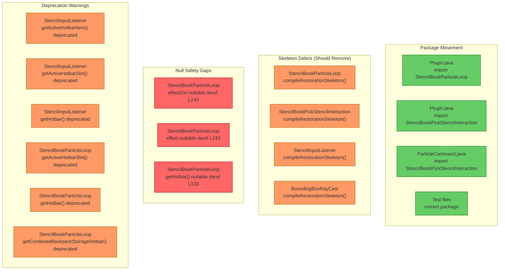

# Review: Compile Restoration — Vector Type Drift (S2605261205)

**Scope:** `StencilBookParticleLoop`, `StencilBookPickStencilInteraction`, `StencilInputListener`, `BoundingBoxRayCast`
**Design doc:** `docs/design-s2605261205-compile-restoration-vector-types.md`
**Date:** 2026-05-27

---

## 1. Executive Summary

Package movement is correctly wired — `Plugin.java`, `ParticleCommand.java`, and all test files reference the new `ui.stencilbook` and `ui.radial` packages with no stale `com.CodeCreature.stencil` imports remaining in live source. However, the compile-restoration skeleton scaffolding (`compileRestorationSkeleton()` methods, `COMPILE_RESTORATION_TODO_ID` constants, and 9 `TODO[S2605261205]` markers) was **not cleaned up** as required by the design doc. More critically, `StencilBookParticleLoop` has **missing null guards** on `effectCtrl` and `effect` that will cause NPEs at runtime, and both it and `StencilInputListener` use **deprecated-for-removal Inventory APIs** that will break on the next engine version.

---

## 2. Current Architecture Diagram

---

## 3. Findings Table

| # | Category | Severity | Location | Detail |
|---|----------|----------|----------|--------|
| 1 | Anti-pattern | 🔴 Blocked | [StencilBookParticleLoop.java](src/main/java/com/CodeCreature/ui/stencilbook/StencilBookParticleLoop.java#L241-L243) | **Missing null guard on `effectCtrl` and `effect`.** `store.getComponent(entityRef, EffectControllerComponent.getComponentType())` returns `@Nullable`. `EntityEffect.getAssetMap().getAsset(effectId)` also returns nullable. Both are dereferenced unconditionally on L243. If either is null, the particle loop NPEs on every spawn cycle, permanently killing the highlight for that player. The design doc explicitly lists "Guard nullable effect lookup before addEffect" as a required change. |
| 2 | Anti-pattern | 🔴 Blocked | [StencilBookParticleLoop.java](src/main/java/com/CodeCreature/ui/stencilbook/StencilBookParticleLoop.java#L133) | **Missing null guard on `getHotbar()`.** Compiler reports "Potential null pointer access: The method getHotbar() may return null." The call `player.getInventory().getHotbar().getItemStack(activeSlot)` dereferences the result directly. If `getHotbar()` returns null, the update loop NPEs on every tick. |
| 3 | Anti-pattern | 🔴 Blocked | [StencilBookParticleLoop.java](src/main/java/com/CodeCreature/ui/stencilbook/StencilBookParticleLoop.java#L241-L243) | **`entityRef` passed to `@Nonnull` parameters while inferred `@Nullable`.** The compiler reports "Null type mismatch: required '@Nonnull Ref<EntityStore>' but the provided value is inferred as @Nullable" on both `store.getComponent(entityRef, ...)` and `effectCtrl.addEffect(entityRef, ...)`. The `store.addEntity()` return type is `@Nullable Ref<EntityStore>`. |
| 4 | Redundancy | 🟡 Should Fix | All 4 files | **Skeleton scaffolding not cleaned up.** The design doc states: "Migration cleanup after implementation: remove temporary compatibility TODO markers and any temporary fallback comments." All 4 files still contain: `compileRestorationSkeleton()` method, `COMPILE_RESTORATION_TODO_ID` constant, and `TODO[S2605261205]` markers (9 total). These are dead code. |
| 5 | Anti-pattern | 🟡 Should Fix | [StencilInputListener.java](src/main/java/com/CodeCreature/ui/radial/StencilInputListener.java#L72), [StencilInputListener.java](src/main/java/com/CodeCreature/ui/radial/StencilInputListener.java#L139), [StencilInputListener.java](src/main/java/com/CodeCreature/ui/radial/StencilInputListener.java#L143-L144) | **Deprecated-for-removal Inventory API usage.** `getActiveHotbarItem()`, `getActiveHotbarSlot()`, and `getHotbar()` are all marked `@Deprecated(forRemoval=true)`. These will cause compile failure on the next API update. The design doc's goal was compile stability. |
| 6 | Anti-pattern | 🟡 Should Fix | [StencilBookParticleLoop.java](src/main/java/com/CodeCreature/ui/stencilbook/StencilBookParticleLoop.java#L132-L133), [StencilBookParticleLoop.java](src/main/java/com/CodeCreature/ui/stencilbook/StencilBookParticleLoop.java#L163) | **Deprecated-for-removal Inventory API usage.** Same deprecated APIs as finding #5: `getActiveHotbarSlot()`, `getHotbar()`, and `getCombinedBackpackStorageHotbar()`. |
| 7 | Redundancy | 🟠 QA | [StencilInputListener.java](src/main/java/com/CodeCreature/ui/radial/StencilInputListener.java#L97-L103) | **Redundant `Objects.requireNonNull` after null guard.** `openRadialMenu()` checks `if (ref == null ... ) return;` then passes `Objects.requireNonNull(ref, "ref")` to `openCustomPage()`. The requireNonNull can never throw — it's dead validation. Same pattern in `pickToSwitch()` at L118-L120. Either the null guard or the requireNonNull should be removed, not both. |
| 8 | Anti-pattern | 🟠 QA | [StencilInputListener.java](src/main/java/com/CodeCreature/ui/radial/StencilInputListener.java#L33) | **Stale Javadoc reference.** Comment says `StencilRadialInputListener::onOutboundPacket` but the class was renamed to `StencilInputListener`. This mismatch could mislead anyone searching for the registration site. |
| 9 | Anti-pattern | 🟠 QA | [BoundingBoxRayCast.java](src/main/java/com/CodeCreature/util/BoundingBoxRayCast.java#L42-L43) | **Dead code in skeleton method.** `compileRestorationSkeleton()` contains `if (COMPILE_RESTORATION_TODO_ID.isEmpty()) throw ...` — a compile-time false condition guarding a throw. This is never reachable and is a skeleton artifact. |
| 10 | Scalability | 🔵 Review | [StencilBookParticleLoop.java](src/main/java/com/CodeCreature/ui/stencilbook/StencilBookParticleLoop.java#L154) | **Unchecked @Nonnull conversion warning.** `blockType.getId()` returns `@Nullable String` but `getRecipeForBlock()` requires `@Nonnull String`. The null guard at L148 (`blockType == null`) doesn't guard `blockTypeId` itself. Low risk since `getId()` shouldn't return null for a valid BlockType, but the compiler flags it. |

---

## 4. Root Cause Risks

These could prevent the plugin from working even after the manifest/package fix:

1. **Finding #1 + #3 (Blocked):** The particle loop will NPE the first time a player looks at a craftable block while holding the Stencil Book. The `effectCtrl.addEffect(entityRef, effect, ...)` call on L243 has three nullable arguments passed to `@Nonnull` parameters. This kills the scheduled loop for that player permanently (exception caught, `active` remains true, loop keeps retrying and failing).

2. **Finding #2 (Blocked):** If `getHotbar()` returns null (which the engine's nullability contract says is possible), the update loop NPEs on the `getItemStack()` call every 100ms, flooding the log.

3. **Findings #5 + #6 (Should Fix):** The deprecated-for-removal APIs will compile today but will break on the next Hytale engine update. Since the stated goal was compile stability, using APIs marked for removal undermines that goal.

---

## 5. Cleanup Needed

**Skeleton code to remove from all 4 files:**

| File | What to remove |
|------|---------------|
| `StencilBookParticleLoop.java` | `COMPILE_RESTORATION_TODO_ID` constant (L48), `compileRestorationSkeleton()` method (L68-L78), 3 TODO comments |
| `StencilBookPickStencilInteraction.java` | `COMPILE_RESTORATION_TODO_ID` constant (L35), `compileRestorationSkeleton()` method (L47-L55), 2 TODO comments |
| `StencilInputListener.java` | `COMPILE_RESTORATION_TODO_ID` constant (L38), `compileRestorationSkeleton()` method (L43-L50), 2 TODO comments |
| `BoundingBoxRayCast.java` | `COMPILE_RESTORATION_TODO_ID` constant (L31), `compileRestorationSkeleton()` method (L36-L44), 2 TODO comments |

**Stale comment to fix:**
| File | Line | Fix |
|------|------|-----|
| `StencilInputListener.java` | L33 | Change `StencilRadialInputListener::onOutboundPacket` → `StencilInputListener::onOutboundPacket` |

---

## 6. Package Movement Verification

| Check | Status |
|-------|--------|
| `Plugin.java` imports `StencilBookParticleLoop` from `ui.stencilbook` | ✅ Correct (L12) |
| `Plugin.java` references `StencilBookPickStencilInteraction` from `ui.stencilbook` | ✅ Correct (L78-L79, FQCN) |
| `Plugin.java` imports `StencilInputListener` from `ui.radial` | ✅ Correct (L15) |
| `ParticleCommand.java` imports from `ui.stencilbook` | ✅ Correct (L3) |
| Test files in correct package | ✅ Both in `com.CodeCreature.ui.stencilbook` |
| No stale `com.CodeCreature.stencil.StencilBook*` imports in `src/` | ✅ Only in `all_java_sources.txt` (historical) |
| Remaining `com.CodeCreature.stencil.*` imports in `Plugin.java` | ✅ Correct — `StencilDropDestroySystem`, `StencilPlacementSystem`, `StencilSyncSystem`, `StencilVisualManager` still live in `stencil` package |

---

## 7. Vector Type Usage Verification

| Check | Status |
|-------|--------|
| `Vector3i` imported from `org.joml` | ✅ All 4 files |
| `Vector3d` imported from `org.joml` | ✅ `StencilBookParticleLoop`, `BoundingBoxRayCast` |
| `Rotation3f` imported from `com.hypixel.hytale.math.vector` | ✅ `StencilBookParticleLoop` |
| `Transform` imported from `com.hypixel.hytale.math.vector` | ✅ `BoundingBoxRayCast` |
| Consistent usage across files | ✅ No mixed old/new vector types |

---

## 8. Log Safety Verification

| Check | Status |
|-------|--------|
| `StencilInputListener` L87 — recipe ID log uses `%s` (string placeholder) | ✅ `log("[Stencil] Use interaction for player %s — ...", playerRef.getUuid())` |
| `StencilInputListener` L148 — pick-to-switch log uses `%s` for both args | ✅ `log("[Stencil] Pick-to-switch for player %s - swapped to recipe %s", ...)` |
| `StencilBookPickStencilInteraction` L93 — stencil give log uses `%s` | ✅ `log("[StencilBook] Gave stencil for %s to player %s", ...)` |
| No `%d` or `%f` format specifiers used for string arguments | ✅ All format-safe |

---

→ @Engineer: Fix findings #1, #2, #3 (Blocked) before merging — these are runtime NPEs. Then clean up finding #4 (skeleton debris). Consider addressing #5-#6 (deprecated APIs) in this cycle or tracking separately.
→ @Architect: No new system design required. All findings are local fixes within existing files.
