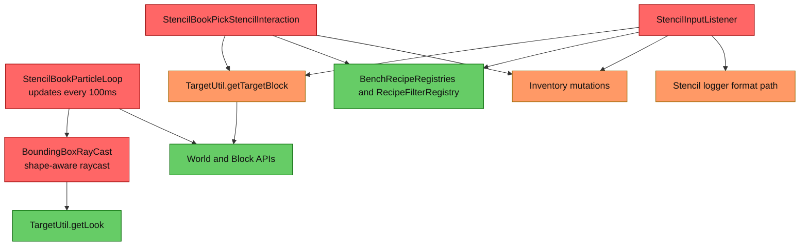
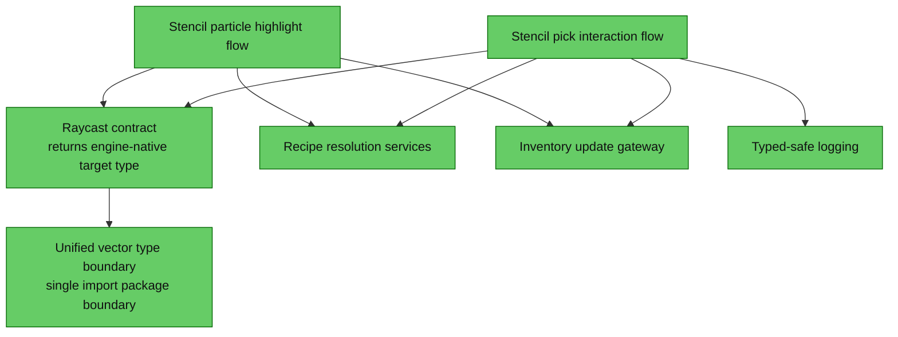

# Decompile Compile-Fix Risk Review (Stencil/Stencil Narrow Scope)

## 1. Executive Summary
The current architectural risk is dominated by a hard compile blocker: all four scoped files depend on vector imports that are no longer resolvable after the server decompile update. This failure is structural because the same type-family dependency is repeated across particle, pick, listener, and raycast paths, so one API move breaks all interaction entry points at once. This should be treated as a mechanical import/type correction first, followed by a very small stabilization pass for signature/nullability/runtime-log safety; it does not justify a broader subsystem refactor for this compile-fix change.

## 2. Current Architecture Diagram

## 3. Findings Table
| # | Category | Severity | Location | Detail |
|---|---|---|---|---|
| 1 | Scalability | 🔴 **Blocked** | [src/main/java/com/CodeCreature/ui/stencilbook/StencilBookParticleLoop.java:11](../src/main/java/com/CodeCreature/ui/stencilbook/StencilBookParticleLoop.java#L11) | Vector package dependency is hardcoded to a removed/moved namespace (`Vector3d/Vector3f/Vector3i`), immediately failing compile in the particle loop path. |
| 2 | Scalability | 🔴 **Blocked** | [src/main/java/com/CodeCreature/util/BoundingBoxRayCast.java:8](../src/main/java/com/CodeCreature/util/BoundingBoxRayCast.java#L8) | Raycast return and intermediate math types depend on unresolved vector classes; this blocks both direct raycast compilation and any caller relying on returned target coordinates. |
| 3 | Redundancy | 🔴 **Blocked** | [src/main/java/com/CodeCreature/ui/stencilbook/StencilBookPickStencilInteraction.java:12](../src/main/java/com/CodeCreature/ui/stencilbook/StencilBookPickStencilInteraction.java#L12) | Same unresolved `Vector3i` dependency is duplicated in a second pick path, widening blast radius for a single API move and multiplying compile failures. |
| 4 | Redundancy | 🔴 **Blocked** | [src/main/java/com/CodeCreature/ui/radial/StencilInputListener.java:8](../src/main/java/com/CodeCreature/ui/radial/StencilInputListener.java#L8) | A third interaction path duplicates the same vector dependency break, making this a cross-entry-point mechanical failure rather than an isolated file defect. |
| 5 | Anti-pattern | 🟡 **Should Fix** | [src/main/java/com/CodeCreature/ui/radial/StencilInputListener.java:113](../src/main/java/com/CodeCreature/ui/radial/StencilInputListener.java#L113) | Logging format uses `%d` with `entry.recipeId()` (string-like id), creating a likely runtime format exception on successful pick-to-switch flow after compile issues are cleared. |
| 6 | Anti-pattern | 🟠 **QA** | [src/main/java/com/CodeCreature/ui/radial/StencilInputListener.java:84](../src/main/java/com/CodeCreature/ui/radial/StencilInputListener.java#L84) | Nullability contract mismatch against `openCustomPage` indicates API signature tightening risk; currently reported as null-safety conversion warnings and should be validated under strict null-analysis settings. |
| 7 | Anti-pattern | 🟠 **QA** | [src/main/java/com/CodeCreature/ui/radial/StencilInputListener.java:93](../src/main/java/com/CodeCreature/ui/radial/StencilInputListener.java#L93) | `TargetUtil.getTargetBlock` call site shows nullability conversion warnings for both ref and accessor arguments, suggesting potential future compile/runtime friction if annotations become enforced. |

## 4. Target Architecture Diagram

Notes:
- Consolidate vector API touchpoints to one boundary so decompile-driven package moves do not fan out across multiple interaction classes.
- Keep behavior and flow unchanged for this cycle; this target is a containment shape, not a redesign of gameplay logic.

## 5. Migration Notes
- What can be deleted entirely:
  - No scoped class needs deletion for this compile-fix cycle.
- What should be consolidated into what:
  - Consolidate direct vector-type assumptions behind a single boundary shared by [src/main/java/com/CodeCreature/ui/stencilbook/StencilBookParticleLoop.java](../src/main/java/com/CodeCreature/ui/stencilbook/StencilBookParticleLoop.java), [src/main/java/com/CodeCreature/ui/stencilbook/StencilBookPickStencilInteraction.java](../src/main/java/com/CodeCreature/ui/stencilbook/StencilBookPickStencilInteraction.java), [src/main/java/com/CodeCreature/ui/radial/StencilInputListener.java](../src/main/java/com/CodeCreature/ui/radial/StencilInputListener.java), and [src/main/java/com/CodeCreature/util/BoundingBoxRayCast.java](../src/main/java/com/CodeCreature/util/BoundingBoxRayCast.java).
- What ordering constraints are eliminated:
  - Eliminate the current requirement to update imports/signatures in four separate files each time engine vector packages move.
- What runtime systems become unnecessary:
  - No runtime system removal is required; only compile-compatibility and small runtime-safety hardening are needed.

Mechanical vs broader refactor call:
- Recommended now: mechanical import/type correction plus small signature/nullability/log-safety fixes.
- Not recommended now: broader refactor of stencil/particle interaction architecture for this narrow compile-fix objective.