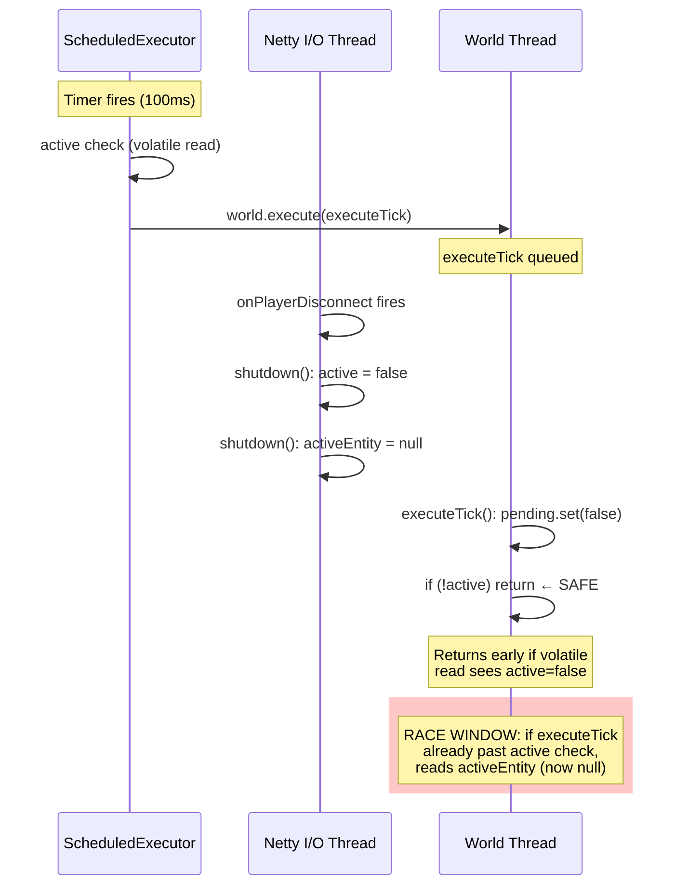

# Review: Disconnect Race Condition Fixes

## 1. Executive Summary

**Verdict: NEEDS WORK** — one low-severity finding on Fix 3.

Fixes 1 and 2 are correct and clean. Fix 3 achieves the critical goal (eliminating the loading-screen hang by removing `world.execute()` from shutdown) but introduces a JMM data race on the `activeEntity` field. The race has a narrow window, low practical impact, and a one-line fix.

## 2. Fix Overview

```mermaid
graph TB
    subgraph "Fix 1: Plugin.onPlayerDisconnect"
        A["StencilSyncSystem.unregister()"]
        B["StencilVisualManager.removePlayer()"]
        C["StencilBookParticleLoop.remove()"]
    end
    subgraph "Fix 2: StencilSyncSystem.register"
        D["containsKey check"]
        E["unregister stale handles"]
        F["register new handles"]
    end
    subgraph "Fix 3: StencilBookParticleLoop.shutdown"
        G["active = false"]
        H["cancel updateTask"]
        I["activeEntity = null"]
    end

    A --> B --> C
    D --> E --> F
    G --> H --> I

    style A fill:#6c6,stroke:#060
    style B fill:#6c6,stroke:#060
    style C fill:#6c6,stroke:#060
    style D fill:#6c6,stroke:#060
    style E fill:#6c6,stroke:#060
    style F fill:#6c6,stroke:#060
    style G fill:#6c6,stroke:#060
    style H fill:#6c6,stroke:#060
    style I fill:#f96,stroke:#960
```



## 3. Fix-by-Fix Analysis

### Fix 1: Plugin.java — Isolated disconnect cleanup ✅ PASS

All three cleanup calls are independently wrapped in try-catch blocks (lines 112–127). One failure cannot cascade into the next. Exceptions are logged with the player UUID and subsystem tag. Method signature and void return preserved.

No findings.

### Fix 2: StencilSyncSystem.register — Defensive re-registration ✅ PASS

When `registeredPlayers.containsKey(uuid)` is true (lines 49–53), the method logs a warning and calls `unregister(uuid)` before proceeding. `unregister()` (lines 87–96) removes the coalescer, removes the handle array, and iterates all handles calling `.unregister()` with null guards. New handles are then registered normally. No double-registration is possible.

No findings.

### Fix 3: StencilBookParticleLoop.shutdown — Removed world.execute() ⚠️ NEEDS WORK

**Core goal achieved:** Removing `world.execute()` from `shutdown()` eliminates the causal chain (disconnect → plugin queues world work → entity removal delayed → `removalFuture.join()` blocks → loading screen hang). The entity is non-serialized (won't persist to disk) and the 500ms effect self-expires (no visible artifact). The `if (!active)` guard at the top of `executeTick()` (line 116) prevents most post-shutdown ticks.

**Data race found:** See findings table below.

## 4. Findings Table

| # | Category | Severity | Location | Detail |
|---|----------|----------|----------|--------|
| 1 | Anti-pattern | 🟡 Should Fix | [StencilBookParticleLoop.java](src/main/java/com/CodeCreature/ui/stencilbook/StencilBookParticleLoop.java#L268-L278) | **Data race on `activeEntity`** — `shutdown()` (Netty thread) writes `activeEntity = null` at L275 *after* the volatile write to `active` at L268, so the null is not piggybacked on the volatile's memory fence. `executeTick()` (world thread) reads `activeEntity` at L186, L191, L193 without synchronization. See detailed analysis below. |

### Finding 1 — Detailed Analysis

**Thread timeline that triggers the race:**



**Two problems:**

1. **JMM ordering:** `activeEntity = null` (L275) is written *after* the volatile write `active = false` (L268). The JMM only guarantees that writes *before* a volatile write are visible to threads that read that volatile. Writes *after* the volatile write are not covered. So even if `executeTick` reads `active == false` and returns, a *future* tick (before the task cancel takes effect) could read a stale non-null `activeEntity`.

2. **TOCTOU on `activeEntity`:** The pattern `activeEntity != null && activeEntity.isValid()` (L186, L191) reads the field twice per expression. If the JIT reloads from the heap between reads and sees `null` on the second read, an NPE results. A third read at L193 (`store.removeEntity(activeEntity, ...)`) compounds this. The same TOCTOU exists in `removeHighlightEntity()` at L258–260.

**Practical severity is low:** On x86 (TSO memory model), stores are naturally ordered and JIT typically caches heap field reads in a register within the same basic block. The race window is narrow (100ms tick interval, Netty thread must fire between two specific instructions). Worst case is an NPE during a disconnect — the player is already leaving.

**Fix — two changes, both trivial:**

**(a) Reorder writes in `shutdown()` so `activeEntity = null` piggybacks on the volatile fence:**

```java
private void shutdown() {
    // Clear entity ref BEFORE volatile write so it piggybacks on the fence
    activeEntity = null;
    lastTargetBlock = null;
    lastAffordable = false;
    active = false;  // volatile write — flushes all prior stores
    if (updateTask != null) {
        updateTask.cancel(false);
        updateTask = null;
    }
}
```

**(b) Capture `activeEntity` in a local variable at each use site to eliminate TOCTOU:**

```java
// In executeTick(), at the top of the target-comparison block:
Ref<EntityStore> entity = this.activeEntity;

if (target.equals(lastTargetBlock) && entity != null && entity.isValid()
        && affordable == lastAffordable) {
    return;
}
if (entity != null && entity.isValid()) {
    store.removeEntity(entity, RemoveReason.REMOVE);
}

// Same pattern in removeHighlightEntity():
Ref<EntityStore> entity = this.activeEntity;
if (entity != null && entity.isValid() && store != null) {
    store.removeEntity(entity, RemoveReason.REMOVE);
}
```

This is the standard Java idiom for non-volatile fields accessed cross-thread (used throughout `java.util.concurrent`).

## 5. Migration Notes

- Fix 1: Done, no further action.
- Fix 2: Done, no further action.
- Fix 3: Apply the two changes from Finding 1 (reorder writes + local-variable capture). Both are safe, mechanical, and non-behavioral — they only tighten memory ordering guarantees.
- No code can be deleted. No new systems needed.

---

→ @Engineer apply the two-part fix from Finding 1 to `StencilBookParticleLoop.java`
