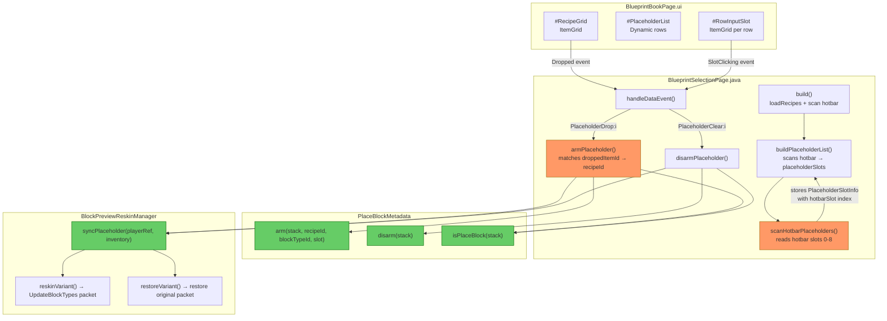
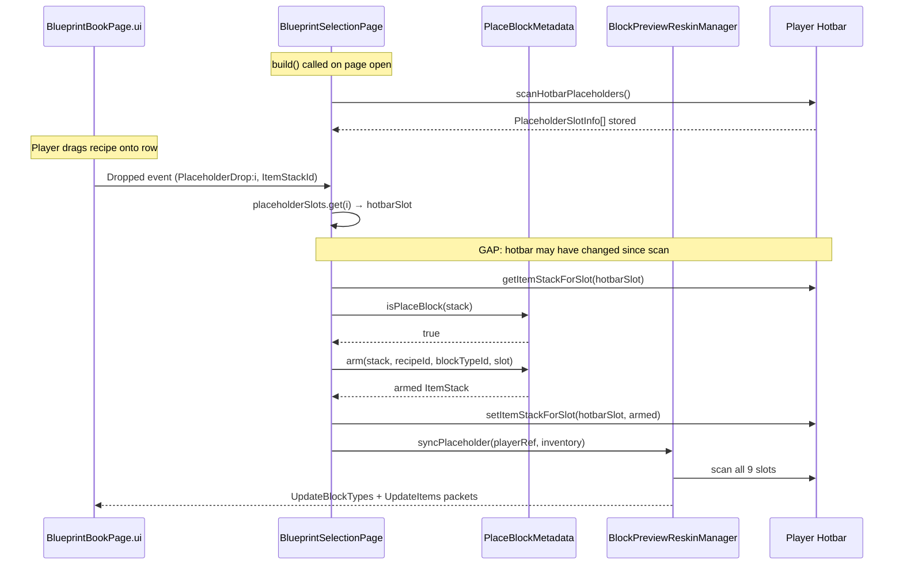

# Review: Dynamic Placeholder List — BlueprintSelectionPage

## 1. Executive Summary

The arm/disarm flow is **structurally correct** — `PlaceBlockMetadata.arm()`/`disarm()` properly mutate the ItemStack and `BlockPreviewReskinManager.syncPlaceholder()` is called after every mutation. The dominant concern is **stale-index mapping**: the page scans the hotbar once, stores `PlaceholderSlotInfo` with hotbar slot indices, then uses those cached indices for all subsequent event handling. If the hotbar changes between the scan and an event (slot swap, item drop, external system mutation), the row→hotbar mapping silently targets the wrong slot. A secondary concern is the first-match recipe lookup, which can arm the wrong recipe when multiple recipes share an output item.

## 2. Current Architecture Diagram

## 3. Findings Table

| # | Category | Severity | Location | Detail |
|---|----------|----------|----------|--------|
| 1 | Edge-case | 🟡 Should Fix | [BlueprintSelectionPage.java](../src/main/java/com/UnobstructedThirdPerson/placeblock/ui/BlueprintSelectionPage.java#L455-L470) | **Stale index mapping.** `buildPlaceholderList` snapshots the hotbar into `placeholderSlots`, then events reference rows by index `i` which maps to `placeholderSlots.get(i).hotbarSlot`. If the player swaps, drops, or gains placeholder items (via keybind, another system, or network lag) between the snapshot and the event, the cached `hotbarSlot` targets the wrong physical slot. The `isPlaceBlock()` guard only prevents mutation on non-placeholder items — it does NOT detect a *different* placeholder now occupying that slot. |
| 2 | Correctness | 🟠 QA | [BlueprintSelectionPage.java](../src/main/java/com/UnobstructedThirdPerson/placeblock/ui/BlueprintSelectionPage.java#L541-L555) | **First-match recipe lookup.** `armPlaceholder` finds `recipeId`/`blockTypeId` by iterating `allRecipes` and taking the first entry where `outputItemId` matches `droppedItemId`. If multiple recipes produce the same output item (e.g., different bench origins, different ingredient tiers), this silently picks the alphabetically-first recipe. Whether this is a real problem depends on whether `RecipeFilterRegistry` guarantees unique output items — needs verification. |
| 3 | Correctness | 🟠 QA | [BlueprintSelectionPage.java](../src/main/java/com/UnobstructedThirdPerson/placeblock/ui/BlueprintSelectionPage.java#L270-L278) | **`itemStackId` population relies on engine contract.** The `Dropped` event binding sends only `EventData.of("Action", "PlaceholderDrop:" + i)` — `ItemStackId` is not explicitly included. The handler guards on `data.itemStackId != null`, so if the engine doesn't auto-populate this field for `Dropped` events, the arm operation silently fails. This needs a test to confirm the engine populates `ItemStackId` on drag-drop into an ItemGrid. |
| 4 | Edge-case | 🟡 Should Fix | [BlueprintSelectionPage.java](../src/main/java/com/UnobstructedThirdPerson/placeblock/ui/BlueprintSelectionPage.java#L480-L520) | **No hotbar change listener.** The placeholder list is only rebuilt on arm/disarm actions (`buildPlaceholderList` is called in those event branches). If the hotbar changes from an external source (e.g., `PlaceholderSyncSystem`, another UI, death/respawn), the visible placeholder list becomes stale. There is no inventory change callback or periodic refresh. |
| 5 | Design | 🔵 Review | [BlueprintSelectionPage.java](../src/main/java/com/UnobstructedThirdPerson/placeblock/ui/BlueprintSelectionPage.java#L540-L565) | **No disarm-before-rearm.** `armPlaceholder` doesn't call `disarm()` before `arm()` when the target slot is already armed to a different recipe. `arm()` overwrites metadata and calls `withState()`, which works correctly assuming `withState()` replaces rather than appends the state suffix. `syncPlaceholder` also cleans up the old reskin. This is fine *if the engine's `withState` is idempotent* — worth a unit test to confirm. |
| 6 | Edge-case | 🔵 Review | [PlaceBlockMetadata.java](../src/main/java/com/UnobstructedThirdPerson/placeblock/PlaceBlockMetadata.java#L91-L101) | **`arm()` mutates the incoming metadata document.** `arm()` calls `stack.getMetadata()` and mutates the returned `BsonDocument` in-place before creating a new `ItemStack`. If `getMetadata()` returns a shared reference (not a copy), this could mutate the metadata of the stack that's still in the hotbar slot before `setItemStackForSlot` replaces it. Low risk since `setItemStackForSlot` immediately follows, but violates value semantics. |
| 7 | Design | 🔵 Review | [BlueprintSelectionPage.java](../src/main/java/com/UnobstructedThirdPerson/placeblock/ui/BlueprintSelectionPage.java#L486-L505) | **Event binding uses `SlotClicking` for disarm.** The `PlaceholderClear` action fires on `SlotClicking`, which triggers when the player clicks any slot in the row's `#RowInputSlot` ItemGrid. This means clicking an *empty* placeholder row also fires `PlaceholderClear`, which is benign (guarded by `slotInfo.armed`) but generates unnecessary server round-trips. |

## 4. Arm/Disarm Sequence (Race Window)

## 5. Migration Notes

- **Finding 1 (Stale index)**: Fix by re-scanning the hotbar at the *start* of `PlaceholderDrop`/`PlaceholderClear` handlers rather than relying on the cached `placeholderSlots`. Alternatively, store the `hotbarSlot` directly in the event payload (`EventData.of("Action", "PlaceholderDrop:" + hotbarSlot)`) instead of the row index, so the mapping is captured at bind-time and doesn't depend on a mutable list.
- **Finding 2 (First-match lookup)**: If duplicate outputItemIds exist, pass the `recipeId` through the drop event instead of resolving from `droppedItemId`. The recipe grid already knows which recipe each slot represents.
- **Finding 3 (ItemStackId)**: Add a manual test: open bench, drag a recipe onto a placeholder row, confirm the server log shows `[BlueprintUI] Armed slot X with Y`. If it logs nothing, the engine doesn't populate `ItemStackId` on `Dropped` events and the binding needs `EventData.of("Action", "PlaceholderDrop:" + i, "ItemStackId", "...")` or a different event type.
- **Finding 4 (No hotbar listener)**: Consider calling `buildPlaceholderList` at the top of every `handleDataEvent` dispatch (it's already cheap — just a 9-slot scan + UI rebuild). This ensures the list is always fresh regardless of which event arrived.
- **Finding 6 (Metadata mutation)**: Defensively clone: `BsonDocument metadata = stack.getMetadata() != null ? stack.getMetadata().clone() : new BsonDocument()` in both `arm()` and `disarm()`.

---

→ @Engineer implement fixes from findings 1, 4 (stale index + missing refresh) — these are the highest-impact items  
→ @QA verify finding 3 (`ItemStackId` population) with a manual drag-drop test
