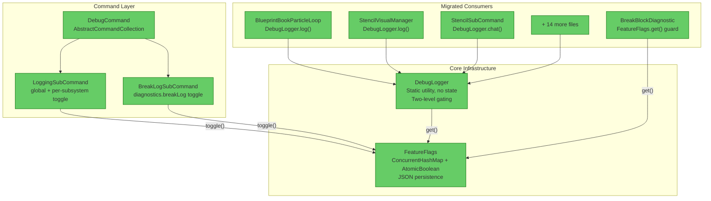
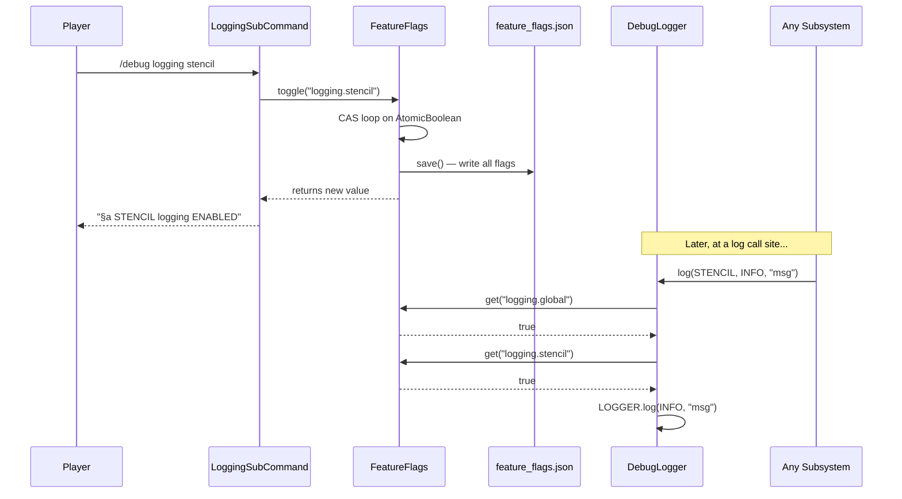

# Review: FeatureFlags & DebugLogger — Verification

**Date:** 2026-05-28  
**Scope:** FeatureFlags, DebugLogger, /debug command group, migration spot-check  
**Type:** Post-implementation verification  

---

## Quality Verdict: ✅ PASS

---

## 1. Executive Summary

The FeatureFlags and DebugLogger systems are cleanly implemented with correct thread safety, clear single responsibility, and proper fail-open semantics. The migration is complete — `BreakBlockDiagnostic` no longer owns its own toggle state, and 18 files across 7 subsystems have been migrated to use `DebugLogger` with static subsystem imports. The only findings are minor/cosmetic with no architectural or correctness concerns.

## 2. Architecture Diagram

## 3. Runtime Flow

## 4. Findings Table

| # | Category | Severity | File | Detail |
|---|----------|----------|------|--------|
| 1 | API Design | 🔵 Review | [FeatureFlags.java](../src/main/java/com/CodeCreature/util/FeatureFlags.java#L124) | `set()` uses `computeIfAbsent(key, k -> new AtomicBoolean(value)).set(value)` — the `.set(value)` is redundant when the key is new (AtomicBoolean already constructed with that value). Harmless; no fix needed. |
| 2 | API Design | 🔵 Review | [FeatureFlags.java](../src/main/java/com/CodeCreature/util/FeatureFlags.java#L85-L97) | `save()` writes the entire file on every `set()` and `toggle()`. Correct for command-driven use (low frequency). Would need batching if flags were ever toggled in hot paths. Current usage is safe. |
| 3 | API Design | 🔵 Review | [DebugLogger.java](../src/main/java/com/CodeCreature/util/DebugLogger.java#L116) | `logHytale()` hardcodes `atInfo()` — no level parameter. Acceptable simplification since all current call sites use INFO. Could add a level variant if FINE-level HytaleLogger usage is needed later. |
| 4 | Anti-pattern | 🟠 QA | [BreakBlockDiagnostic.java](../src/main/java/com/CodeCreature/scaling/BreakBlockDiagnostic.java#L135-L141) | Pre-existing: reflection access to `BlockGathering.useDefaultDropWhenPlaced`. Not introduced by this migration, but worth noting as a fragility point. |
| 5 | Architecture | 🔵 Review | [BreakBlockDiagnostic.java](../src/main/java/com/CodeCreature/scaling/BreakBlockDiagnostic.java#L181) | Uses raw `LOGGER.info()` instead of `DebugLogger` for its output. This is **correct by design** — the method is already gated by `FeatureFlags.get("diagnostics.breakLog")` at line 64, and the diagnostic is not subsystem-gated logging but a dedicated diagnostic dump. No change needed. |

## 5. Component Assessment

### FeatureFlags.java — ✅ Clean

| Criterion | Assessment |
|-----------|------------|
| Single Responsibility | ✅ One job: store, toggle, persist boolean flags |
| Thread Safety | ✅ `ConcurrentHashMap<String, AtomicBoolean>` — reads are lock-free, toggle uses CAS loop |
| API Design | ✅ Fail-open (`get()` returns `true` for unknown keys), `register()` for defaults, `getAll()` returns unmodifiable snapshot |
| Error Handling | ✅ `save()` catches exceptions, logs warning, never throws. `initialize()` handles missing file gracefully |
| Persistence | ✅ BsonUtil for JSON I/O — consistent with existing codebase pattern (BlueprintBenchPrefsStore) |

### DebugLogger.java — ✅ Clean

| Criterion | Assessment |
|-----------|------------|
| Single Responsibility | ✅ Convenience layer only — owns zero state, delegates everything to FeatureFlags |
| Thread Safety | ✅ No mutable state. `isEnabled()` reads two AtomicBooleans via FeatureFlags.get() |
| API Design | ✅ Enum-based subsystems with `flagKey()` method. Lazy `Supplier<String>` variant for expensive messages. `chat()` for player-visible debug messages |
| Subsystem Coverage | ✅ 8 subsystems covering all major plugin areas. Enum values align 1:1 with `registerDefaults()` keys |

### Command Layer — ✅ Clean

| Criterion | Assessment |
|-----------|------------|
| DebugCommand | ✅ Minimal `AbstractCommandCollection` — groups subcommands only |
| LoggingSubCommand | ✅ Handles both global and per-subsystem toggle. Case-insensitive matching. Lists valid subsystems on invalid input |
| BreakLogSubCommand | ✅ Single-purpose toggle. Clean delegation to `FeatureFlags.toggle()` |

### Plugin.java Integration — ✅ Correct

- `FeatureFlags.initialize(this.getDataDirectory())` called during `setup()` — line 74
- `DebugCommand` registered — line 44
- `DebugLogger.chat()` used for player-ready message — line 96
- Ordering is correct: `FeatureFlags.initialize()` runs before any player events fire (players can't connect until setup completes)

### BreakBlockDiagnostic Migration — ✅ Complete

- Old `AtomicBoolean` field and `toggle()` method: **removed** (confirmed via grep — no AtomicBoolean in file)
- Guard changed to `FeatureFlags.get("diagnostics.breakLog")` at line 64
- Toggle moved to `BreakLogSubCommand` via `FeatureFlags.toggle("diagnostics.breakLog")`

## 6. Migration Spot-Check

| File | Status | Import Style | Call Sites |
|------|--------|-------------|------------|
| [BlueprintBookParticleLoop.java](../src/main/java/com/CodeCreature/ui/blueprintbook/BlueprintBookParticleLoop.java) | ✅ Correct | `static import Subsystem.*` | 7 call sites: `log(BLUEPRINT_BOOK, ...)` at INFO, FINE, WARNING levels. Lazy supplier used for FINE-level messages. |
| [StencilVisualManager.java](../src/main/java/com/CodeCreature/stencil/StencilVisualManager.java) | ✅ Correct | `static import Subsystem.*` | 12 call sites: `log(STENCIL, ...)` at INFO, FINE, WARNING levels. Consistent pattern throughout. |
| [StencilSubCommand.java](../src/main/java/com/CodeCreature/command/placeblock/subcommands/StencilSubCommand.java) | ✅ Correct | `import DebugLogger` (qualified) | 4 call sites: `DebugLogger.chat(playerRef, DebugLogger.Subsystem.STENCIL, ...)` — uses qualified form instead of static import, which is fine for a file with few calls. |

**Broader adoption:** 18 files import `DebugLogger.Subsystem.*` — full migration across all subsystems. No remaining raw `Logger.info()`/`Logger.warning()` calls found in consumer files (only in FeatureFlags itself for infrastructure-level errors, and in BreakBlockDiagnostic for its gated diagnostic dump — both intentional).

## 7. Summary

| Severity | Count |
|----------|-------|
| 🔴 Critical | 0 |
| 🟡 Major | 0 |
| 🟠 QA | 1 (pre-existing reflection in BreakBlockDiagnostic) |
| 🔵 Review | 3 (informational, no action required) |

**Architectural assessment:** This is a textbook utility layer implementation — minimal surface area, correct concurrency primitives, clean separation between state (FeatureFlags) and behavior (DebugLogger), and consistent migration across all consumer files. No regressions introduced.
