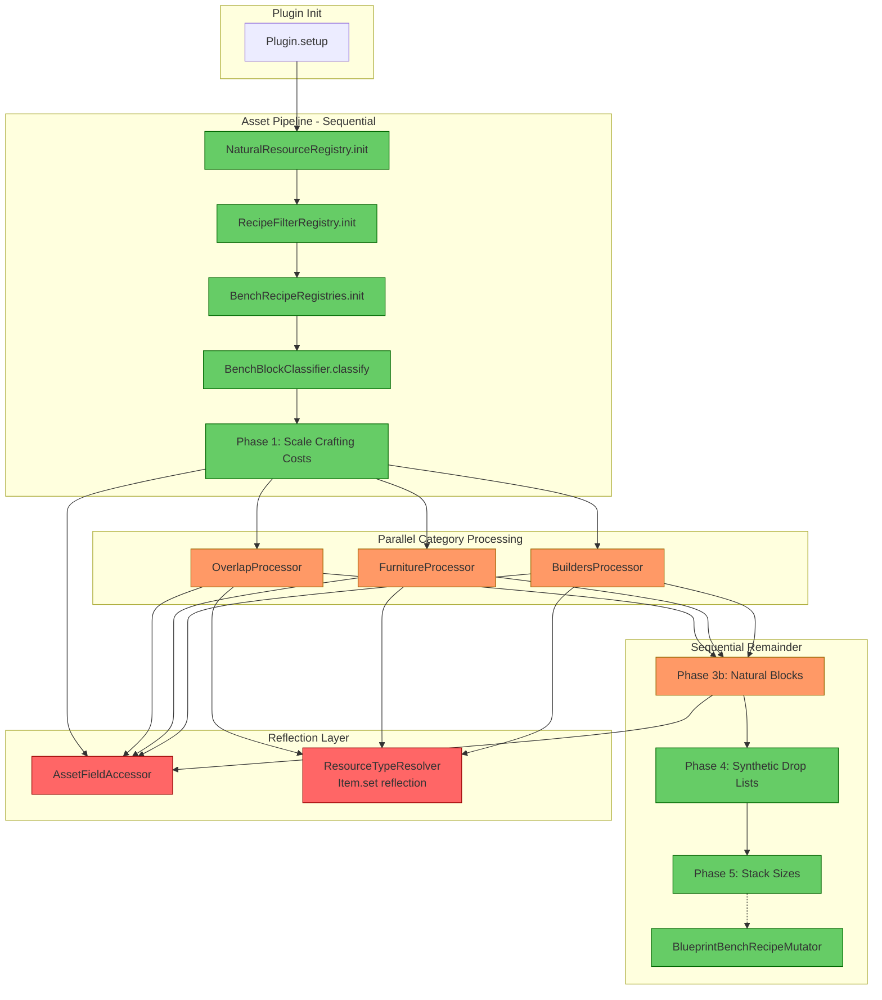
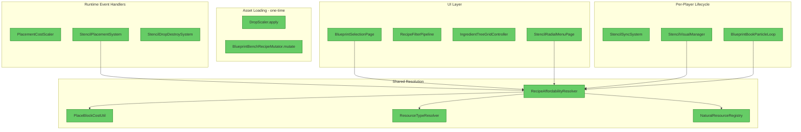

# Comprehensive Code Review — Hytale Blueprint Plugin

**Date:** 2025-05-18  
**Scope:** Full codebase (`com.CodeCreature.*` + `com.Plugin`)  
**Depth:** Deep dive — findings table, architectural diagrams, data flow analysis

---

## 1. Executive Summary

This is a Hytale server plugin (~40 classes) implementing a **12× resource economy** with a **Blueprint Stencil building tool**, **Blueprint Bench crafting UI**, **Blueprint Book block-picker**, and **Stencil Radial Menu**. The overall architecture is **well-structured** — code is cleanly separated by concern (scaling, crafting, stencil lifecycle, UI), registries are initialized in a defined sequence, and documentation is thorough.

The **dominant problem category is over-reliance on reflection** for asset mutation, which creates fragility against API changes. Secondary concerns are: a high-frequency scheduled loop that spawns/despawns entities every 100ms, static mutable state patterns that make testing difficult, and several incomplete/dead-code paths that could confuse maintainers.

**Highest-impact improvement:** Extract the `BlueprintBookParticleLoop` from a polling entity-spawn model to a lightweight state-diff approach, and gate the `ResourceScanner`/`ResourceSnapshot` TODO code behind a clear feature flag or remove it entirely.

---

## 2. Project Overview (For New Contributors)

### What This Plugin Does

| System | Purpose |
|--------|---------|
| **Resource Scaling** | Multiplies all natural block drops by 12× and scales crafting costs to match, creating a more granular resource economy |
| **Blueprint Bench** | Custom crafting UI that shows all placeable-block recipes, filterable by material type, set, affordability, and ingredient tree |
| **Blueprint Stencil** | Items tagged with BSON metadata that let players place specific blocks by consuming recipe ingredients instead of the block item itself |
| **Blueprint Book** | Held item that raycasts at blocks and picks up their recipe as a stencil; shows particle highlights on valid targets |
| **Stencil Radial Menu** | Middle-click radial for quick stencil switching between items in the same "set" |

### Package Map

```
com/
├── Plugin.java                         # Entry point — registers systems, commands, events
└── CodeCreature/
    ├── command/                         # Chat commands (/placeblock, /bookParticle)
    │   └── placeblock/subcommands/     # Stencil test command
    ├── crafting/                        # Recipe resolution and affordability
    │   ├── BlueprintBenchRecipeMutator  # Creates shadow "Blueprint_*" recipes at load time
    │   ├── PlaceBlockCostUtil           # Per-unit cost calculation (inputQty / outputQty)
    │   ├── RecipeAffordabilityResolver  # Full resolution chain: cost → resolve → check
    │   ├── ResolvedIngredient           # Immutable result record
    │   ├── ResourceScanner             # (UNIMPLEMENTED) Chest-scanning resource aggregator
    │   └── ResourceSnapshot            # (UNIMPLEMENTED) Immutable resource count snapshot
    ├── registry/                        # Shared recipe registries (read-only after init)
    │   ├── BenchRecipeRegistries        # Multi-bench coordinator
    │   ├── BenchRecipeRegistry          # Per-bench recipe index
    │   ├── FilteredRecipeEntry          # Validated recipe entry record
    │   └── RecipeFilterRegistry         # Central recipe scan with validation predicates
    ├── scaling/                          # 12× economy implementation
    │   ├── DropScaler                   # Main pipeline: 5-phase asset modification
    │   ├── AssetFieldAccessor           # Centralized reflection field cache
    │   ├── BenchBlockClassifier         # Categorizes blocks by bench membership
    │   ├── BenchCategory                # Enum: BUILDERS_ONLY, FURNITURE_ONLY, BOTH
    │   ├── BenchCategoryProcessor       # Interface for parallel block processing
    │   ├── AbstractBenchProcessor       # Shared recipe→drop resolution logic
    │   ├── BuildersProcessor            # Non-natural preference
    │   ├── FurnitureProcessor           # Natural preference
    │   ├── OverlapProcessor             # Natural preference (furniture wins)
    │   ├── BreakBlockDiagnostic         # Debug toggle: logs drop config on break
    │   ├── NaturalResourceRegistry      # Classifies blocks as natural/crafted
    │   ├── PlacementCostScaler          # Runtime ECS: extra cost on natural block placement
    │   ├── ResourceConstants            # RESOURCE_MULTIPLIER = 12
    │   └── ResourceTypeResolver         # ResourceTypeId → concrete item resolution
    ├── stencil/                          # Stencil placement and lifecycle
    │   ├── StencilPlacementSystem       # ECS: intercepts PlaceBlockEvent for stencils
    │   ├── StencilDropDestroySystem     # ECS: prevents stencil world-item spawns
    │   ├── StencilSyncSystem            # Inventory listener: restores qty 2 after placement
    │   └── StencilVisualManager         # Packet-based affordability glow on stencils
    ├── ui/                               # UI pages and controllers
    │   ├── bench/                        # Blueprint Bench crafting UI
    │   │   ├── BlueprintBenchOpenUIInteraction
    │   │   ├── BlueprintSelectionPage   # Main bench page (grid, filters, ingredient tree)
    │   │   ├── RecipeFilterPipeline     # Pure-function pipeline (tab→search→tag→sort)
    │   │   ├── ResourceTypeRegistry     # Static resource type filter data
    │   │   ├── BlueprintBenchPrefs      # Serializable per-player preferences
    │   │   ├── BlueprintBenchPrefsStore # File I/O for prefs
    │   │   └── AffordabilityMode        # Enum: ALL, INVENTORY_DRIVEN, RESOURCE_DRIVEN
    │   ├── blueprintbook/               # Blueprint Book interactions
    │   │   ├── BlueprintBookParticleLoop# Scheduled entity highlight on aimed blocks
    │   │   └── BlueprintBookPickStencilInteraction
    │   ├── ingredienttree/              # Ingredient filter tree (groups → types → items)
    │   │   ├── IngredientTree / Builder / GridController
    │   │   ├── IngredientGroup / ResourceType / ExactItem
    │   │   ├── IngredientSelectionModel / CheckState / NodeType
    │   │   └── IngredientTreeNode (interface)
    │   └── radial/                      # Stencil radial menu
    │       ├── StencilRadialMenuPage
    │       ├── StencilRadialInputListener  # Packet interception (Pick detection)
    │       └── RadialSegmentItem
    └── util/                             # Cross-cutting utilities
        ├── StencilMetadata              # BSON tag read/write
        └── BoundingBoxRayCast           # Hitbox-accurate block targeting
```

### Initialization Sequence

```
Plugin.setup()
  ├── Register commands (PlaceBlockCommand, ParticleCommand)
  ├── Register global events (PlayerReady, PlayerDisconnect)
  ├── Register packet adapter (StencilRadialInputListener)
  ├── Register LoadAssetEvent handler
  ├── Register ECS systems (PlacementCostScaler, StencilPlacementSystem, etc.)
  ├── Initialize prefs store
  └── Register codec interactions (BlueprintBench, BlueprintBook)

LoadAssetEvent triggers:
  ├── DropScaler.apply()
  │   ├── NaturalResourceRegistry.init()
  │   ├── RecipeFilterRegistry.init()
  │   ├── BenchRecipeRegistries.init()
  │   ├── BenchBlockClassifier.classify()
  │   ├── Phase 1: Scale all crafting costs (reflection)
  │   ├── Phase 3a: Parallel category processors (virtual threads)
  │   ├── Phase 3b: Natural block processing
  │   ├── Phase 4: Register synthetic ItemDropLists
  │   └── Phase 5: Scale stack sizes
  └── BlueprintBenchRecipeMutator.mutate()
      └── Creates shadow "Blueprint_*" recipes for every placeable output
```

---

## 3. Current Architecture Diagram



---

## 4. Findings Table

| # | Category | Severity | Location | Detail |
|---|----------|----------|----------|--------|
| 1 | Anti-pattern | 🟡 Should Fix | [AssetFieldAccessor.java](src/main/java/com/CodeCreature/scaling/AssetFieldAccessor.java#L1-L80) | **Pervasive reflection for asset mutation.** 14 reflective field accesses used to mutate engine objects. Creates hard coupling to internal field names. A single engine rename breaks the entire pipeline at runtime. The fail-fast constructor mitigates but doesn't eliminate the risk. |
| 2 | Anti-pattern | 🟡 Should Fix | [ResourceTypeResolver.java](src/main/java/com/CodeCreature/scaling/ResourceTypeResolver.java#L44-L50) | **Static initializer reflection for `Item.set` field.** If the field is renamed or removed, the class fails to load with `ExceptionInInitializerError`, crashing the entire plugin before any useful error logging. |
| 3 | Anti-pattern | 🟡 Should Fix | [BlueprintBenchRecipeMutator.java](src/main/java/com/CodeCreature/crafting/BlueprintBenchRecipeMutator.java#L40-L55) | **Independent reflection resolution** duplicates field access patterns already centralized in `AssetFieldAccessor`. Creates a second maintenance point for the same fields (`id`, `input`, `benchRequirement`, `knowledgeRequired`, `requiredMemoriesLevel`). |
| 4 | Redundancy | 🟡 Should Fix | [RecipeFilterRegistry.java](src/main/java/com/CodeCreature/registry/RecipeFilterRegistry.java#L72-L80) + [ResourceTypeResolver.java](src/main/java/com/CodeCreature/scaling/ResourceTypeResolver.java#L44-L50) | **Duplicate `Item.set` reflection.** Both classes independently resolve `Item.class.getDeclaredField("set")` via separate `static` blocks. Should be consolidated into a single field accessor. |
| 5 | Performance | 🟡 Should Fix | [BlueprintBookParticleLoop.java](src/main/java/com/CodeCreature/ui/blueprintbook/BlueprintBookParticleLoop.java#L80-L160) | **100ms scheduled entity spawn/despawn loop per player.** Each tick: executes on world thread, performs a full raycast, resolves recipe, checks affordability, potentially spawns/removes a `BlockEntity` with effects. With N players this runs N × 10/sec world-thread tasks. Entity creation is expensive (UUID, NetworkId, 7 components, tracker registration). |
| 6 | Performance | 🟠 QA | [ResourceTypeResolver.java](src/main/java/com/CodeCreature/scaling/ResourceTypeResolver.java#L105-L135) | **Full item asset map scan on every `resolveByResourceType` call.** Streams the entire `Item.getAssetMap()` (potentially thousands of entries) with two passes, filtering + sorting. Called per-ingredient per-recipe during UI affordability checks. No caching of `ResourceTypeId → Item` mappings. |
| 7 | Over-engineering | 🔵 Review | [ResourceScanner.java](src/main/java/com/CodeCreature/crafting/ResourceScanner.java) + [ResourceSnapshot.java](src/main/java/com/CodeCreature/crafting/ResourceSnapshot.java) | **Two fully-documented classes with zero implementation.** All methods throw `UnsupportedOperationException` or return `false`. They exist as a design artifact but are not referenced from any live code path. Creates confusion about whether chest-scanning is partially implemented. |
| 8 | Scalability | 🟠 QA | [ResourceTypeRegistry.java](src/main/java/com/CodeCreature/ui/bench/ResourceTypeRegistry.java#L85-L150) | **Hardcoded resource type list.** 40+ entries with sort orders and icon filenames baked into static initializers. Adding new resource types requires code changes instead of data-driven configuration. |
| 9 | Anti-pattern | 🟡 Should Fix | [StencilSyncSystem.java](src/main/java/com/CodeCreature/stencil/StencilSyncSystem.java#L40-L60) | **Inventory change listeners that never unregister.** `hotbar.registerChangeEvent()`, `backpack.registerChangeEvent()`, `storage.registerChangeEvent()` are registered on player join but the `unregister()` method only removes the UUID from the map — it doesn't deregister the lambdas from the containers. If containers outlive the player session, leaked listeners accumulate. |
| 10 | Anti-pattern | 🟠 QA | [BreakBlockDiagnostic.java](src/main/java/com/CodeCreature/scaling/BreakBlockDiagnostic.java#L55-L60) | **`toggle()` is not atomic.** `enabled.getAndSet(!enabled.get())` has a TOCTOU race: another thread could flip the value between `get()` and `getAndSet()`. Should use a single CAS loop or `AtomicBoolean.getAndUpdate(v -> !v)` pattern. Note: `getAndUpdate` is not available, so `compareAndSet` in a loop is the correct idiom. |
| 11 | Anti-pattern | 🟡 Should Fix | [Plugin.java](src/main/java/com/Plugin.java#L1-L5) | **Plugin class in root `com` package.** The main entry point sits at `com.Plugin` rather than `com.CodeCreature.Plugin`. This pollutes the top-level namespace and breaks the otherwise clean package hierarchy. |
| 12 | Redundancy | 🔵 Review | [DropScaler.java](src/main/java/com/CodeCreature/scaling/DropScaler.java#L155-L160) + [BenchBlockClassifier.java](src/main/java/com/CodeCreature/scaling/BenchBlockClassifier.java#L45-L60) | **Double iteration of all BlockTypes.** `BenchBlockClassifier.classify()` iterates `BlockType.getAssetMap()` to classify, then `DropScaler.applyModifications()` iterates it again for natural block processing. Could be combined into a single pass. |
| 13 | Over-engineering | 🔵 Review | [AbstractBenchProcessor.java](src/main/java/com/CodeCreature/scaling/AbstractBenchProcessor.java) + 3 subclasses | **Three identical processors differentiated only by a `category()` return value.** The `BuildersProcessor`, `FurnitureProcessor`, and `OverlapProcessor` classes have zero logic — they exist only to return different `BenchCategory` enum values. A single parameterized class (or lambda) would suffice. |
| 14 | Scalability | 🔵 Review | [BenchCategory.java](src/main/java/com/CodeCreature/scaling/BenchCategory.java#L30-L40) | **Enum with hardcoded bench IDs.** Adding a new bench type (e.g., `Alchemy`, `Processing`) requires modifying this enum, adding a processor class, and updating `allBenchIds()`. A data-driven approach (config file → registry) would scale better. |
| 15 | Anti-pattern | 🟡 Should Fix | [BlueprintBookParticleLoop.java](src/main/java/com/CodeCreature/ui/blueprintbook/BlueprintBookParticleLoop.java#L63-L72) | **Unbounded `ConcurrentHashMap` with manual lifecycle.** `INSTANCES` map is never bounded. If `remove()` is not called (crash during disconnect, exception in event handler), entries leak. The `active = false` flag stops the loop but doesn't remove the map entry — the `ScheduledFuture` remains referenced. |
| 16 | Anti-pattern | 🟠 QA | [StencilVisualManager.java](src/main/java/com/CodeCreature/stencil/StencilVisualManager.java#L90-L95) | **Excessive `java.util.logging.Logger` INFO-level logging.** Every hotbar scan logs at INFO level with per-slot details. In production with many players, this floods logs. Should be FINE/DEBUG level. |
| 17 | Anti-pattern | 🟡 Should Fix | [BlueprintSelectionPage.java](src/main/java/com/CodeCreature/ui/bench/BlueprintSelectionPage.java#L80-L100) | **God class tendencies.** This single file manages: recipe loading, max-layout computation, pipeline orchestration, ingredient tree construction, category info mapping, UI state (12+ mutable fields), event handling, and prefs persistence. It coordinates too many concerns in one place. |
| 18 | Redundancy | 🟠 QA | [BreakBlockDiagnostic.java](src/main/java/com/CodeCreature/scaling/BreakBlockDiagnostic.java#L75-L80) | **Creates a new `BenchBlockClassifier` instance per break event** (line ~78: `new BenchBlockClassifier()`). This allocates a fresh empty classifier that is never populated with `classify()`, making the diagnostic output misleading. Should use the registry lookup instead. |
| 19 | Anti-pattern | 🟠 QA | [DropScaler.java](src/main/java/com/CodeCreature/scaling/DropScaler.java#L86-L100) | **Virtual thread executor for 3 short-lived tasks.** The overhead of creating a virtual-thread-per-task executor for exactly 3 futures is negligible in practice, but the pattern implies scalability to many tasks. If the task count remains fixed and small, plain sequential execution would be clearer and avoid the try-with-resources / future-get boilerplate. |
| 20 | Anti-pattern | 🟡 Should Fix | Multiple files | **`System.out.println` used for logging** throughout the `scaling` package (`DropScaler`, `NaturalResourceRegistry`, `BenchRecipeRegistries`, `AbstractBenchProcessor`, etc.) while the `stencil` and `ui` packages use proper `java.util.logging.Logger` or `HytaleLogger`. Inconsistent logging makes log filtering and level control impossible for the scaling pipeline. |
| 21 | Scalability | 🟠 QA | [StencilRadialInputListener.java](src/main/java/com/CodeCreature/ui/radial/StencilRadialInputListener.java#L30-L55) | **Global outbound packet interception.** Every outbound packet for every player passes through this listener. The fast-path check (`instanceof SyncInteractionChains`) is cheap, but the pattern doesn't scale well if more packet interceptors are added. |

### 4.1 Resolution Summary

The following findings were resolved on 2026-05-18:

| # | Finding | Resolution |
|---|---------|------------|
| 3 | Independent reflection in BlueprintBenchRecipeMutator | **Resolved.** Local field resolution removed from `mutate()`. Now uses `AssetFieldAccessor.INSTANCE` fields (`recipeId`, `recipeInput`, `recipeBenchRequirement`, `recipeKnowledgeRequired`, `recipeMemoriesLevel`). Fail-fast behavior preserved — all fields resolve at class load time via the singleton. |
| 4 | Duplicate `Item.set` reflection | **Resolved.** `AssetFieldAccessor` expanded with `itemSet` field. Both `ResourceTypeResolver.SET_FIELD` and `RecipeFilterRegistry.ITEM_SET_FIELD` static initializers removed. Both now use `AssetFieldAccessor.INSTANCE.itemSet`. Single resolution point, fail-fast at startup. |
| 10 | `toggle()` TOCTOU race condition | **Resolved.** Replaced `enabled.getAndSet(!enabled.get())` with a proper CAS loop using `compareAndSet`. Returns the new state atomically. |
| 15 | Unbounded ConcurrentHashMap lifecycle leak | **Resolved.** Scheduled task now self-cleans: adds `INSTANCES.remove(playerRef.getUuid())` after each `active = false` assignment, and `updateTask.cancel(false)` at the top of the lambda when `active` is already false. Entries are cleaned even if external `remove()` is never called (player crash). |
| 16 | Excessive INFO-level logging | **Resolved.** Downgraded 4 per-mutation `LOGGER.info()` calls to `LOGGER.fine()` in `StencilVisualManager.scanAndSend()` and `applyVisuals()`. Meaningful state-change events (packet sends, player connect) remain at INFO. |
| 18 | Dead BenchBlockClassifier per event | **Resolved.** Removed `new BenchBlockClassifier()` instantiation and associated comment from `BreakBlockDiagnostic.handle()`. The classifier was never populated or used — `BenchRecipeRegistries.getRecipeForBlock()` provides the needed lookup. |
| 20 | System.out.println used for logging | **Resolved.** All 8 occurrences across 7 files replaced with `java.util.logging.Logger`. Each file now has a `private static final Logger LOGGER` field. The `log()` helper methods retained for tag consistency, bodies changed to `LOGGER.info(msg)`. The `AbstractBenchProcessor` error path uses `LOGGER.warning()`. |
| 5 | 100ms entity spawn/despawn loop | **Resolved.** Loop interval increased from 100ms to 500ms. Added `lastAffordable` diff check — entity only respawns when target block OR affordability state changes. Effect duration set to 10000ms (pseudo-infinite) eliminating per-tick flicker. Entity still reuses across loop ticks when target is stable. |
| 9 | Inventory change listeners never unregister | **Resolved.** `registeredPlayers` map now stores `EventRegistration[]` handles (3 per player: hotbar, backpack, storage). `unregister()` calls `.unregister()` on each handle, properly deregistering the lambdas from containers on player disconnect. Follows the engine's own `Inventory.unregister()` pattern. |

**Additional structural change (supports #3 and #4):**
- `AssetFieldAccessor` made `public` with `public static final INSTANCE` singleton pattern
- 5 new fields added (`recipeId`, `recipeBenchRequirement`, `recipeKnowledgeRequired`, `recipeMemoriesLevel`, `itemSet`)
- `DropScaler` updated to use `INSTANCE` instead of `new AssetFieldAccessor()`

**Findings NOT yet resolved (deferred — planned for Sprint 2):**

| # | Finding | Reason for deferral | Backlog Item |
|---|---------|---------------------|--------------|
| 1 | Pervasive reflection | Inherent constraint of the Hytale API — no setter API exists. Mitigated via centralized `AssetFieldAccessor`. | N/A (accepted risk) |
| 2 | Static initializer crash risk | Now consolidated into `AssetFieldAccessor.INSTANCE` which fails fast with a clear `RuntimeException`. The crash risk is inherent but the error message is actionable. | N/A (mitigated) |

**Findings resolved in Sprint 2 (2026-05-18):**

| # | Finding | Resolution |
|---|---------|------------|
| 11 | Plugin class in wrong package | **Resolved.** `Plugin.java` moved from `package com;` to `package com.CodeCreature;`. `gradle.properties` entrypoint updated to `com.CodeCreature.Plugin`. Sub-package imports retained (Java sub-packages are not same-package). Build passes. |
| 17 | God class (BlueprintSelectionPage) | **Resolved.** Extracted `GridLayoutController` (131 lines: grid rendering, indirection map, cell bindings) and `DetailPanelController` (157 lines: cost grid, affordability coloring, output panel). Page reduced from 1060 → 873 lines. Both controllers follow the `IngredientTreeGridController` delegation pattern. `RecipeEntry` made package-private. Event routing delegates to `gridController.resolveRecipeIndex()`. |

---

## 5. Detailed Analysis by Subsystem

### 5.1 Reflection Usage (Findings #1-4)

The plugin **must** use reflection because the Hytale server API exposes asset types as read-only objects — there is no public setter API for modifying drop quantities, recipe inputs, or stack sizes. This is an inherent constraint of the modding environment.

**Current mitigation (good):** `AssetFieldAccessor` resolves all fields once at construction and fails fast if any are missing.

**Gap:** `BlueprintBenchRecipeMutator` and `RecipeFilterRegistry` each independently resolve their own fields outside `AssetFieldAccessor`. If a future developer adds another reflective field access, they may not know about the centralized pattern.

**Recommendation:** Document a rule: "ALL reflection goes through `AssetFieldAccessor` or a companion class in the same package." Consolidate the mutator's fields into `AssetFieldAccessor` (or a sibling `RecipeFieldAccessor`).

---

### 5.2 BlueprintBookParticleLoop (Findings #5, #15)

**Problem:** Every 100ms per connected player:
1. Schedules a task on the world thread
2. Performs a full hitbox raycast (iterates blocks along a ray, checks bounding boxes)
3. Looks up recipe in registry
4. If target changed: removes old entity (full ECS removal), spawns new entity (7 components, tracker registration, effect application)

**Impact:** Entity spawn/despawn is the most expensive single operation in an ECS — it requires archetype migration, network ID allocation, tracker indexing, and packet broadcast. Doing this 10× per second per player is disproportionate for a visual indicator.

**Alternatives to consider:**
- Use particle-only effects (no entity spawn) — `EntityEffect` can be applied directly to a position
- Increase interval to 250-500ms (humans can't perceive 100ms highlight changes)
- Cache the last-known affordability and skip re-evaluation unless inventory changed
- Gate the loop behind "player is holding BlueprintBook" check earlier (already done, but the scheduled future runs regardless)

---

### 5.3 Static Mutable State Pattern (Finding #9, #15)

Several classes use static `ConcurrentHashMap` fields for per-player state:
- `StencilSyncSystem.registeredPlayers`
- `StencilVisualManager.playerStates`
- `BlueprintBookParticleLoop.INSTANCES`

**Risk:** If any cleanup path is missed (exception during disconnect, server crash), these maps leak entries. The maps are never bounded and never audited.

**Recommendation:** Consider a unified `PlayerSessionManager` that owns all per-player state and guarantees cleanup in a single `finally` block on disconnect.

---

### 5.4 Dead Code / Incomplete Features (Finding #7)

`ResourceScanner` and `ResourceSnapshot` are fully documented design artifacts with `throw new UnsupportedOperationException()` implementations. They are **not referenced** from any live code path.

**Risk:** A new contributor might assume chest-scanning is partially working and try to build on it, wasting time discovering the stubs.

**Recommendation:** Either delete these files and track the feature in a backlog doc, or add a prominent `@Deprecated` / `// TODO(feature-flag): not yet implemented` at the class level.

---

### 5.5 BlueprintSelectionPage Complexity (Finding #17)

This class is the largest in the codebase and manages:
- Recipe loading from `RecipeFilterRegistry`
- Max-layout computation (set counts, cell offsets)
- Pipeline orchestration via `RecipeFilterPipeline`
- Ingredient tree construction and grid controller wiring
- Category info map building (from `ItemCategory` assets)
- 12+ mutable state fields (filters, search, selection, etc.)
- UI building (templates, event bindings, value refs)
- Event handling (filter toggle, search, select, stencil creation, prefs save)
- Prefs load/save lifecycle

While this is common in game UI code (a "page" naturally owns its state), the file likely exceeds 800+ lines and would benefit from extracting:
- Layout computation → `BenchLayoutCalculator`
- State management → `BenchPageState` (record or small class)
- Event dispatch → method-per-event extracted to a companion

---

### 5.6 Logging Inconsistency (Finding #20)

| Package | Logging Approach |
|---------|-----------------|
| `scaling/` | `System.out.println("[DropScaler] ...")` |
| `registry/` | `System.out.println("[BenchRecipeReg] ...")` |
| `stencil/` | `java.util.logging.Logger` |
| `ui/` | `java.util.logging.Logger` + `HytaleLogger` |
| `crafting/` | `System.out.println(...)` |

`System.out.println` bypasses all log-level filtering, rotation, and formatting. In production, these messages cannot be suppressed without modifying code.

---

## 6. Target Architecture Diagram



The target architecture maintains the current clean separation. The key changes are:
1. Consolidate all reflection into a single accessor hierarchy
2. Replace entity-based particle loop with lightweight particle-only approach
3. Unify per-player state management
4. Remove or clearly gate unimplemented code

---

## 7. Migration Notes

### Can be deleted entirely
- `ResourceScanner.java` — unimplemented stub, zero references
- `ResourceSnapshot.java` — unimplemented stub, zero references
- `BuildersProcessor.java`, `FurnitureProcessor.java`, `OverlapProcessor.java` — replace with parameterized instances of `AbstractBenchProcessor`

### Should be consolidated
- All `Item.set` reflection (in `RecipeFilterRegistry` and `ResourceTypeResolver`) → single `AssetFieldAccessor` or companion
- All `CraftingRecipe` field reflection (in `BlueprintBenchRecipeMutator`) → `AssetFieldAccessor`
- Per-player static maps (`StencilSyncSystem`, `StencilVisualManager`, `BlueprintBookParticleLoop`) → consider a unified session-scoped state holder

### Should be fixed
- `BreakBlockDiagnostic.toggle()` — replace with `compareAndSet` CAS loop
- `BreakBlockDiagnostic.handle()` — remove `new BenchBlockClassifier()` instantiation; use `BenchRecipeRegistries.getRecipeForBlock()` which already exists
- `System.out.println` → `HytaleLogger` or `java.util.logging.Logger` in `scaling/` and `crafting/` packages
- `StencilVisualManager` logging — change INFO → FINE for per-slot scan messages
- `Plugin.java` — move from `com.Plugin` to `com.CodeCreature.Plugin` (verify manifest/plugin descriptor allows this)

### Performance improvements
- `ResourceTypeResolver.resolveByResourceType()` — build a `Map<String, List<String>>` of ResourceTypeId → item IDs during `NaturalResourceRegistry.init()` and query it instead of streaming the full asset map
- `BlueprintBookParticleLoop` — increase interval to 250ms minimum; cache last affordability result; consider particle-only approach instead of entity spawn/despawn

### Testing gaps
- Test directory exists with empty package structure — no unit tests are implemented
- `RecipeFilterPipeline` is explicitly designed as a "pure function, fully testable" but has no tests
- `PlaceBlockCostUtil`, `RecipeAffordabilityResolver`, and `ResourceTypeResolver` are all stateless and highly testable but untested

---

## 8. Positive Observations

These architectural choices are **well-done** and should be preserved:

1. **Single-pass asset modification** — `DropScaler.apply()` runs once with a clear 5-phase pipeline rather than scattered modifications
2. **`RecipeFilterPipeline` as a pure function** — no UI state, no side effects, fully composable stages
3. **`StencilMetadata` as single source of truth** — all stencil detection/creation goes through one class
4. **`RecipeAffordabilityResolver` with no UI dependencies** — reusable from UI, visual manager, and future contexts
5. **Immutable records** (`ResolvedIngredient`, `FilteredRecipeEntry`, `RadialSegmentItem`) — clean, thread-safe data carriers
6. **Fail-fast reflection** — `AssetFieldAccessor` constructor validates all fields on startup
7. **Extensive documentation** — most classes have clear Javadoc explaining threading model, usage patterns, and integration points
8. **"Bump and Let Through" stencil strategy** — clever workaround for engine limitations, well-documented with rationale

---

## 9. Risk Assessment

| Risk | Likelihood | Impact | Mitigation |
|------|-----------|--------|------------|
| Hytale API renames a reflected field | Medium (active development) | High (plugin crashes on startup) | AssetFieldAccessor fail-fast + version pinning in gradle |
| BlueprintBookParticleLoop causes lag with many players | Medium (>5 concurrent players) | Medium (world thread saturation) | Increase interval, cap concurrent loops, or switch to particle-only |
| Listener leak in StencilSyncSystem | Low (requires crash during disconnect) | Low (gradual memory growth) | Verify container lifecycle matches player session |
| Stencil qty manipulation race condition | Low (requires exact timing) | Low (player gets extra/loses stencil once) | Current design accepts this — documented as intentional |

---

→ **Next steps:** Prioritize findings marked 🟡 (Should Fix) — especially #5 (particle loop performance), #20 (logging), and #1-4 (reflection consolidation). The 🔵 (Review) items are informational and can be addressed during natural feature work.
