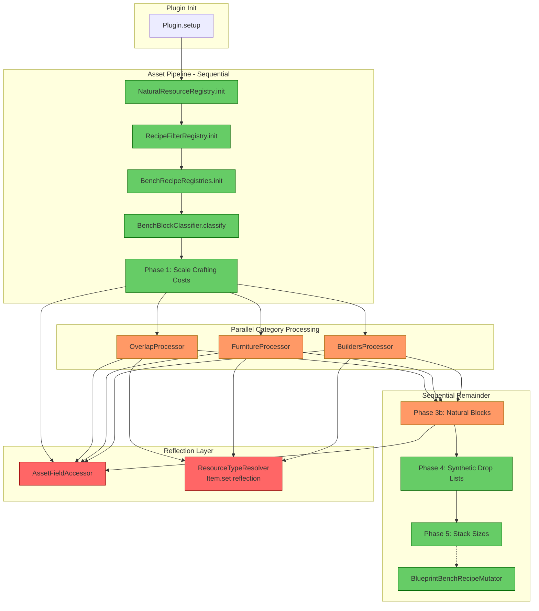
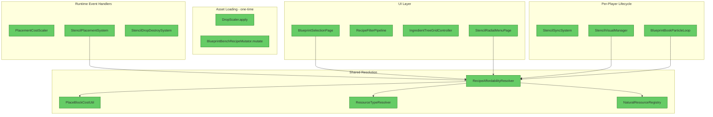

# Hytale Blueprint Plugin — Architecture Reference

**Last updated:** 2026-05-18  
**Scope:** Full codebase (`com.CodeCreature.*`)

---

## 1. Overview

This is a Hytale server plugin (~40 classes) implementing a **12× resource economy** with a **Blueprint Stencil building tool**, **Blueprint Bench crafting UI**, **Blueprint Book block-picker**, and **Stencil Radial Menu**. The architecture is cleanly separated by concern (scaling, crafting, stencil lifecycle, UI), registries are initialized in a defined sequence, and documentation is thorough.

| System | Purpose |
|--------|---------|
| **Resource Scaling** | Multiplies all natural block drops by 12× and scales crafting costs to match, creating a more granular resource economy |
| **Blueprint Bench** | Custom crafting UI that shows all placeable-block recipes, filterable by material type, set, affordability, and ingredient tree |
| **Blueprint Stencil** | Items tagged with BSON metadata that let players place specific blocks by consuming recipe ingredients instead of the block item itself |
| **Blueprint Book** | Held item that raycasts at blocks and picks up their recipe as a stencil; shows particle highlights on valid targets |
| **Stencil Radial Menu** | Middle-click radial for quick stencil switching between items in the same "set" |

---

## 2. Package Map

```
com/
└── CodeCreature/
    ├── Plugin.java                     # Entry point — registers systems, commands, events
    ├── command/                         # Chat commands (/placeblock, /bookParticle)
    │   └── placeblock/subcommands/     # Stencil test command
    ├── crafting/                        # Recipe resolution and affordability
    │   ├── BlueprintBenchRecipeMutator  # Creates shadow "Blueprint_*" recipes at load time
    │   ├── PlaceBlockCostUtil           # Per-unit cost calculation (inputQty / outputQty)
    │   ├── RecipeAffordabilityResolver  # Full resolution chain: cost → resolve → check
    │   ├── ResolvedIngredient           # Immutable result record
    │   ├── ResourceScanner             # (UNIMPLEMENTED) Chest-scanning resource aggregator
    │   └── ResourceSnapshot            # (UNIMPLEMENTED) Immutable resource count snapshot
    ├── registry/                        # Shared recipe registries (read-only after init)
    │   ├── BenchRecipeRegistries        # Multi-bench coordinator
    │   ├── BenchRecipeRegistry          # Per-bench recipe index
    │   ├── FilteredRecipeEntry          # Validated recipe entry record
    │   └── RecipeFilterRegistry         # Central recipe scan with validation predicates
    ├── scaling/                          # 12× economy implementation
    │   ├── DropScaler                   # Main pipeline: 5-phase asset modification
    │   ├── AssetFieldAccessor           # Centralized reflection field cache
    │   ├── BenchBlockClassifier         # Categorizes blocks by bench membership
    │   ├── BenchCategory                # Enum: BUILDERS_ONLY, FURNITURE_ONLY, BOTH
    │   ├── BenchCategoryProcessor       # Interface for parallel block processing
    │   ├── AbstractBenchProcessor       # Shared recipe→drop resolution logic
    │   ├── BuildersProcessor            # Non-natural preference
    │   ├── FurnitureProcessor           # Natural preference
    │   ├── OverlapProcessor             # Natural preference (furniture wins)
    │   ├── BreakBlockDiagnostic         # Debug toggle: logs drop config on break
    │   ├── NaturalResourceRegistry      # Classifies blocks as natural/crafted
    │   ├── PlacementCostScaler          # Runtime ECS: extra cost on natural block placement
    │   ├── ResourceConstants            # RESOURCE_MULTIPLIER = 12
    │   └── ResourceTypeResolver         # ResourceTypeId → concrete item resolution
    ├── stencil/                          # Stencil placement and lifecycle
    │   ├── StencilPlacementSystem       # ECS: intercepts PlaceBlockEvent for stencils
    │   ├── StencilDropDestroySystem     # ECS: prevents stencil world-item spawns
    │   ├── StencilSyncSystem            # Inventory listener: restores qty 2 after placement
    │   └── StencilVisualManager         # Packet-based affordability glow on stencils
    ├── ui/                               # UI pages and controllers
    │   ├── bench/                        # Blueprint Bench crafting UI
    │   │   ├── BlueprintBenchOpenUIInteraction
    │   │   ├── BlueprintSelectionPage   # Main bench page (grid, filters, ingredient tree)
    │   │   ├── RecipeFilterPipeline     # Pure-function pipeline (tab→search→tag→sort)
    │   │   ├── ResourceTypeRegistry     # Static resource type filter data
    │   │   ├── BlueprintBenchPrefs      # Serializable per-player preferences
    │   │   ├── BlueprintBenchPrefsStore # File I/O for prefs
    │   │   └── AffordabilityMode        # Enum: ALL, INVENTORY_DRIVEN, RESOURCE_DRIVEN
    │   ├── blueprintbook/               # Blueprint Book interactions
    │   │   ├── BlueprintBookParticleLoop# Scheduled entity highlight on aimed blocks
    │   │   └── BlueprintBookPickStencilInteraction
    │   ├── ingredienttree/              # Ingredient filter tree (groups → types → items)
    │   │   ├── IngredientTree / Builder / GridController
    │   │   ├── IngredientGroup / ResourceType / ExactItem
    │   │   ├── IngredientSelectionModel / CheckState / NodeType
    │   │   └── IngredientTreeNode (interface)
    │   └── radial/                      # Stencil radial menu
    │       ├── StencilRadialMenuPage
    │       ├── StencilRadialInputListener  # Packet interception (Pick detection)
    │       └── RadialSegmentItem
    └── util/                             # Cross-cutting utilities
        ├── StencilMetadata              # BSON tag read/write
        └── BoundingBoxRayCast           # Hitbox-accurate block targeting
```

---

## 3. Initialization Sequence

```
Plugin.setup()
  ├── Register commands (PlaceBlockCommand, ParticleCommand)
  ├── Register global events (PlayerReady, PlayerDisconnect)
  ├── Register packet adapter (StencilRadialInputListener)
  ├── Register LoadAssetEvent handler
  ├── Register ECS systems (PlacementCostScaler, StencilPlacementSystem, etc.)
  ├── Initialize prefs store
  └── Register codec interactions (BlueprintBench, BlueprintBook)

LoadAssetEvent triggers:
  ├── DropScaler.apply()
  │   ├── NaturalResourceRegistry.init()
  │   ├── RecipeFilterRegistry.init()
  │   ├── BenchRecipeRegistries.init()
  │   ├── BenchBlockClassifier.classify()
  │   ├── Phase 1: Scale all crafting costs (reflection)
  │   ├── Phase 3a: Parallel category processors (virtual threads)
  │   ├── Phase 3b: Natural block processing
  │   ├── Phase 4: Register synthetic ItemDropLists
  │   └── Phase 5: Scale stack sizes
  └── BlueprintBenchRecipeMutator.mutate()
      └── Creates shadow "Blueprint_*" recipes for every placeable output
```

---

## 4. Asset Pipeline Diagram



---

## 5. Design Decisions & Constraints

### Reflection for Asset Mutation

The Hytale server API exposes asset types as read-only objects — there is no public setter API for modifying drop quantities, recipe inputs, or stack sizes. The plugin **must** use reflection. All reflective field access is centralized in `AssetFieldAccessor` (singleton), which resolves all fields once at startup and fails fast with a clear `RuntimeException` if any are missing. Rule: **ALL reflection goes through `AssetFieldAccessor`**.

### BlueprintBookParticleLoop

Runs at 500ms intervals per player holding a Blueprint Book. Performs hitbox raycast, resolves recipe, checks affordability, and spawns/despawns a highlight `BlockEntity`. Uses a `lastAffordable` diff check — entity only respawns when target block OR affordability state changes. Effect duration is 10000ms (pseudo-infinite) eliminating per-tick flicker.

### Per-Player State Management

Several classes use static `ConcurrentHashMap` fields for per-player state:
- `StencilSyncSystem.registeredPlayers` — stores `EventRegistration[]` handles, properly deregistered on disconnect
- `StencilVisualManager.playerStates`
- `BlueprintBookParticleLoop.INSTANCES` — self-cleans via scheduled task when `active = false`

### Parallel Category Processing

`DropScaler` uses a virtual-thread-per-task executor to run `BuildersProcessor`, `FurnitureProcessor`, and `OverlapProcessor` in parallel during asset loading. The three processor subclasses exist primarily to return different `BenchCategory` enum values but share all logic via `AbstractBenchProcessor`.

### BlueprintSelectionPage Structure

The main bench UI page delegates to:
- `GridLayoutController` — grid rendering, indirection map, cell bindings
- `DetailPanelController` — cost grid, affordability coloring, output panel
- `IngredientTreeGridController` — ingredient filter tree UI
- `RecipeFilterPipeline` — pure-function filter pipeline (tab → search → tag → sort)

### Stencil "Bump and Let Through" Strategy

Stencils intercept `PlaceBlockEvent`, consume recipe ingredients from inventory, then allow the engine's default block placement to proceed. The stencil item maintains quantity 2 (never consumed) via `StencilSyncSystem`. This clever workaround avoids fighting the engine's placement system.

---

## 6. Runtime Architecture Diagram



---

## 7. Architectural Strengths

These choices are intentional and should be preserved:

1. **Single-pass asset modification** — `DropScaler.apply()` runs once with a clear 5-phase pipeline rather than scattered modifications
2. **`RecipeFilterPipeline` as a pure function** — no UI state, no side effects, fully composable stages
3. **`StencilMetadata` as single source of truth** — all stencil detection/creation goes through one class
4. **`RecipeAffordabilityResolver` with no UI dependencies** — reusable from UI, visual manager, and future contexts
5. **Immutable records** (`ResolvedIngredient`, `FilteredRecipeEntry`, `RadialSegmentItem`) — clean, thread-safe data carriers
6. **Fail-fast reflection** — `AssetFieldAccessor` singleton validates all fields on startup
7. **Extensive documentation** — most classes have clear Javadoc explaining threading model, usage patterns, and integration points
8. **"Bump and Let Through" stencil strategy** — clever workaround for engine limitations, well-documented with rationale

---

## 8. Known Risks & Accepted Constraints

| Risk | Likelihood | Impact | Mitigation |
|------|-----------|--------|------------|
| Hytale API renames a reflected field | Medium (active development) | High (plugin crashes on startup) | `AssetFieldAccessor` fail-fast + version pinning in gradle |
| Particle loop performance at scale | Low (mitigated) | Medium (world thread saturation) | 500ms interval + state-diff check; entity reuse when target stable |
| Stencil qty manipulation race condition | Low (requires exact timing) | Low (player gets extra/loses stencil once) | Accepted — documented as intentional |
| `ResourceTypeResolver.resolveByResourceType()` scans full asset map | Low (UI only) | Low (perceptible lag with 1000+ items) | Future: cache `ResourceTypeId → Item[]` at init time |

---

## 9. Future Opportunities

These are not bugs — they are potential improvements for when the codebase grows:

- **`ResourceScanner` / `ResourceSnapshot`** — unimplemented stubs for chest-scanning resource aggregation. Not referenced anywhere. Delete or implement when the feature is needed.
- **`ResourceTypeRegistry` hardcoded list** — 40+ resource types with sort orders baked into static initializers. Consider data-driven config if types expand significantly.
- **`BenchCategory` enum** — adding a new bench type requires enum modification + processor class. Consider a registry approach if bench count grows beyond 3.
- **Per-player state consolidation** — three separate `ConcurrentHashMap` instances across `StencilSyncSystem`, `StencilVisualManager`, `BlueprintBookParticleLoop`. A unified `PlayerSessionManager` would simplify lifecycle guarantees.
- **Unit tests** — `RecipeFilterPipeline`, `PlaceBlockCostUtil`, `RecipeAffordabilityResolver`, and `ResourceTypeResolver` are all stateless/pure and highly testable but currently untested.
