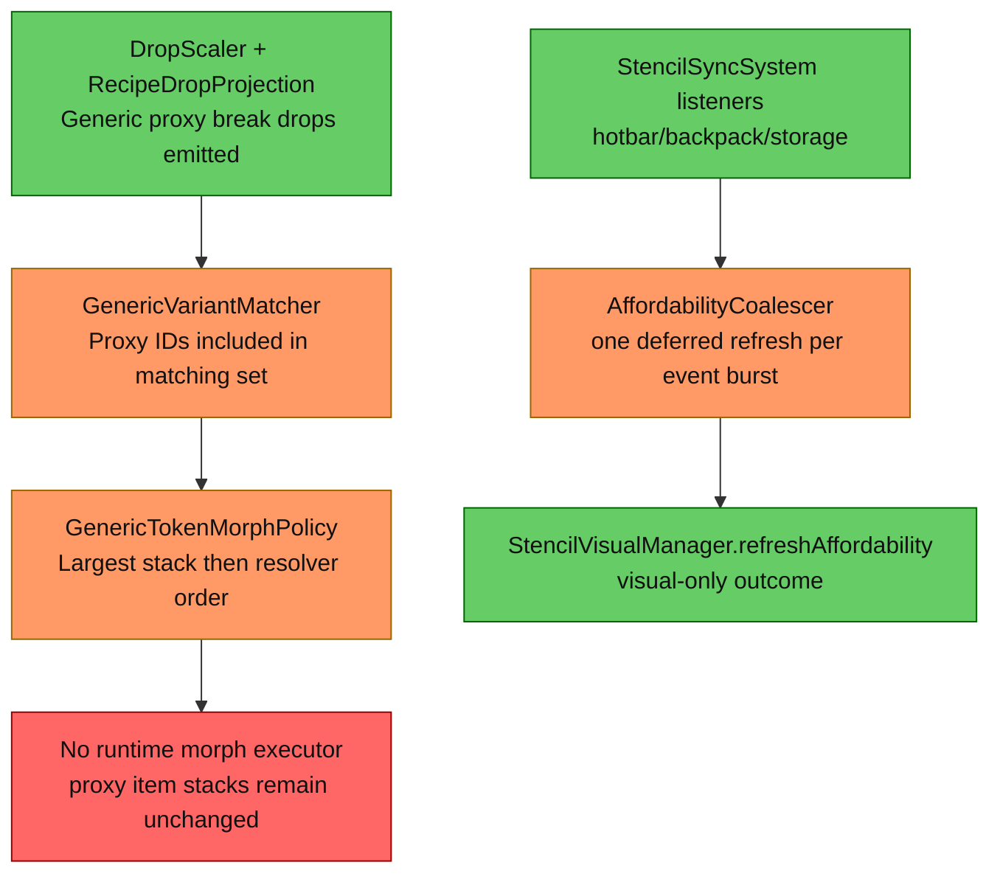

# 1. Executive Summary
The safest minimal validation slice is to add one coalesced morph pass in the existing inventory-change refresh path, without touching drop generation, planner math, or placement consumption. The dominant risk category is anti-pattern behavior at runtime boundaries (re-entrant inventory mutation and metadata-unsafe replacement), not missing core algorithms. The highest-impact change is introducing a dedicated proxy-morph service invoked from the existing coalescer tick so morphing is centralized, guarded, and observable.

# 2. Current Architecture Diagram


# 3. Findings Table
| # | Category | Severity | Location | Detail |
|---|---|---|---|---|
| 1 | Anti-pattern | 🟡 Should Fix | [src/main/java/com/CodeCreature/stencil/AffordabilityCoalescer.java](src/main/java/com/CodeCreature/stencil/AffordabilityCoalescer.java#L168) | Coalesced refresh currently executes visual refresh only. Morph policy exists but is not executed in runtime inventory flow, so concept cannot be validated end-to-end. |
| 2 | Anti-pattern | 🟡 Should Fix | [src/main/java/com/CodeCreature/stencil/StencilSyncSystem.java](src/main/java/com/CodeCreature/stencil/StencilSyncSystem.java#L61) | Hotbar listener already performs inventory mutation (stencil restore). Adding morphing in the same event stream without a distinct re-entrancy guard risks self-trigger loops and duplicate passes. |
| 3 | Scalability | 🟠 QA | [src/main/java/com/CodeCreature/crafting/GenericVariantMatcher.java](src/main/java/com/CodeCreature/crafting/GenericVariantMatcher.java#L126) | Proxy discovery scans full item asset map for each typed resolution. Safe for validation, but runtime cost can scale with asset count; keep this unchanged for minimal slice and instrument morph pass frequency. |
| 4 | Anti-pattern | 🟡 Should Fix | [src/main/java/com/CodeCreature/crafting/GenericTokenMorphPolicy.java](src/main/java/com/CodeCreature/crafting/GenericTokenMorphPolicy.java#L42) | Morph policy output is selection-only. Without an explicit mutation boundary contract, direct stack replacement can accidentally drop metadata or stack quantity. |
| 5 | Redundancy | 🔵 Review | [src/main/java/com/CodeCreature/stencil/StencilVisualManager.java](src/main/java/com/CodeCreature/stencil/StencilVisualManager.java#L220) | Existing refresh path already runs on every coalesced inventory burst. Reusing this lifecycle for morph validation avoids introducing new listeners/schedulers. |

# 4. Target Architecture Diagram
```mermaid
graph TB
  A[StencilSyncSystem listeners\n(existing)]
  B[AffordabilityCoalescer.executeRefresh\n(existing deferred tick)]
  C[ProxyMorphCoordinator.morphInventoryIfNeeded\nnew minimal service]
  D[StencilVisualManager.refreshAffordability\n(existing)]
  E[Morph audit counters/logging\nnew guardrail observability]

  A --> B
  B --> C
  C --> D
  C --> E

  classDef green fill:#6c6,stroke:#060,color:#111;
  class A,B,C,D,E green;
```
Notes:
- Consolidated insertion point: only the coalesced deferred refresh path changes.
- No changes to drop projection, planner deficit logic, or placement consumption for this slice.
- Morph pass owns all inventory mutation and guardrails; listeners stay orchestration-only.

# 5. Migration Notes
- What can be deleted entirely:
  - No deletions required for this validation slice.
- What should be consolidated into what:
  - Consolidate runtime morph execution into one new coordinator service, invoked only from coalesced refresh.
  - Keep selection logic in existing matcher/policy classes; coordinator should call, not duplicate, policy rules.
- What ordering constraints are eliminated:
  - Eliminates any need for per-container direct morph calls by requiring one deferred pass after event burst settles.
  - Eliminates listener-order dependence between hotbar/backpack/storage for morph correctness.
- What runtime systems become unnecessary:
  - Any additional ad hoc timers/listeners for morphing become unnecessary; coalescer remains the single scheduler.

## Minimal Code Change Slice (Exact Files + Methods)
1. Add new class [src/main/java/com/CodeCreature/stencil/ProxyMorphCoordinator.java](src/main/java/com/CodeCreature/stencil/ProxyMorphCoordinator.java)
- Add method morphInventoryIfNeeded(PlayerRef playerRef, Player player).
- Add method scanSlotsForProxyCandidates(ItemContainer hotbar, ItemContainer backpack, ItemContainer storage).
- Add method resolveMorphTargetForProxy(ItemStack proxyStack, CombinedItemContainer combined).
- Add method applyMorphToSlot(ItemContainer container, short slot, String concreteItemId, ItemStack original).
- Add method isProxyItemId(String itemId) (delegate to existing proxy catalog/prefix contract).

2. Update [src/main/java/com/CodeCreature/stencil/AffordabilityCoalescer.java](src/main/java/com/CodeCreature/stencil/AffordabilityCoalescer.java)
- In executeRefresh(), call ProxyMorphCoordinator.morphInventoryIfNeeded(playerRef, player) before StencilVisualManager.refreshAffordability(...).
- Add a dedicated morphing guard flag (parallel to restoringStencils) so mutation from morph pass cannot re-enter morph pass in same cascade.

3. Optional small update [src/main/java/com/CodeCreature/stencil/StencilSyncSystem.java](src/main/java/com/CodeCreature/stencil/StencilSyncSystem.java)
- Keep register(...) listener count unchanged.
- If needed for readability only, rename local restoration guard usage in hotbar listener comments to clarify it protects stencil-restore only (not morph).

4. No changes in this validation slice:
- [src/main/java/com/CodeCreature/scaling/RecipeDropProjection.java](src/main/java/com/CodeCreature/scaling/RecipeDropProjection.java)
- [src/main/java/com/CodeCreature/crafting/GenericVariantMatcher.java](src/main/java/com/CodeCreature/crafting/GenericVariantMatcher.java)
- [src/main/java/com/CodeCreature/crafting/GenericTokenMorphPolicy.java](src/main/java/com/CodeCreature/crafting/GenericTokenMorphPolicy.java)
- [src/main/java/com/CodeCreature/stencil/StencilPlacementSystem.java](src/main/java/com/CodeCreature/stencil/StencilPlacementSystem.java)

## Required Guardrails (Execution-Time)
1. Re-entrancy guard
- Morph pass must have its own in-progress flag separate from stencil-restore guard.
- If guard is true, skip morph pass and only proceed to visual refresh.

2. Item-loss prevention
- Never mutate stack quantity during morph: new stack quantity must equal original quantity.
- Never mutate if target item asset is missing or invalid.
- Apply at-most-once per slot per pass; no chained remorph in one tick.

3. Metadata preservation
- Preserve metadata bytes/object exactly when swapping item ID.
- If target item is non-stackable with existing metadata model, skip morph and emit debug counter/log.

4. Safety fallback behavior
- If no concrete target selected or selected target equals current item ID, no-op.
- Any exception in morph pass must fail open (skip morph for that slot) and still execute affordability refresh.

## Targeted Tests (2-4)
1. Add [src/test/java/com/CodeCreature/stencil/ProxyMorphCoordinatorTest.java](src/test/java/com/CodeCreature/stencil/ProxyMorphCoordinatorTest.java)
- Test morphs proxy to largest-available concrete variant across hotbar/backpack/storage using existing policy ordering.
- Assert quantity unchanged and metadata object/value preserved after morph.

2. Add [src/test/java/com/CodeCreature/stencil/ProxyMorphCoordinatorTest.java](src/test/java/com/CodeCreature/stencil/ProxyMorphCoordinatorTest.java)
- Test no morph when no matching concrete stack exists; proxy remains unchanged.
- Assert no inventory writes performed.

3. Add/extend [src/test/java/com/CodeCreature/stencil/AffordabilityCoalescerTest.java](src/test/java/com/CodeCreature/stencil/AffordabilityCoalescerTest.java)
- Test one coalesced executeRefresh burst triggers at most one morph pass and one visual refresh.
- Include re-entrant mutation simulation to verify morph guard prevents recursive morph execution.

4. Extend [src/test/java/com/CodeCreature/crafting/GenericTokenMorphPolicyTest.java](src/test/java/com/CodeCreature/crafting/GenericTokenMorphPolicyTest.java#L50)
- Add regression case with proxy candidate present and tied concrete variants to verify deterministic tie-break remains resolver-order stable.

## Execution Checklist
1. Implement ProxyMorphCoordinator with no external callers except coalescer.
2. Wire single call in executeRefresh() before visual refresh.
3. Add morphing guard and fail-open logging.
4. Run targeted tests plus existing [src/test/java/com/CodeCreature/scaling/GenericRecipeProxyDropIntegrationTest.java](src/test/java/com/CodeCreature/scaling/GenericRecipeProxyDropIntegrationTest.java#L37) and [src/test/java/com/CodeCreature/crafting/GenericTokenMorphPolicyTest.java](src/test/java/com/CodeCreature/crafting/GenericTokenMorphPolicyTest.java#L31).

## Validation Scope Boundaries
- This slice validates concept viability only: proxy break drops plus inventory-time morph behavior.
- It intentionally defers parity-level planner/removeMaterials alignment changes to later waves.

→ @Engineer implement migration from docs/review-generic-proxy-morph-validation-slice.md
→ @Architect if any finding requires a new system design
