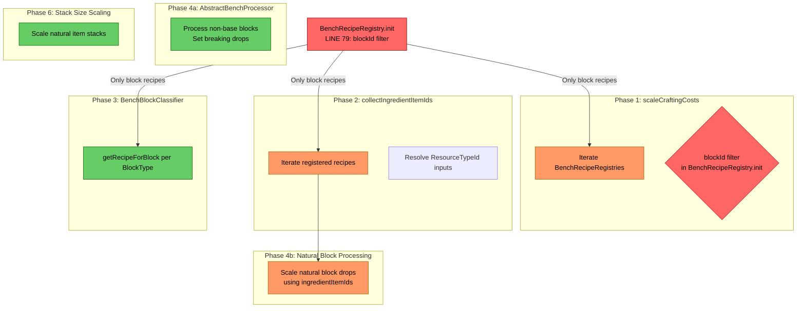
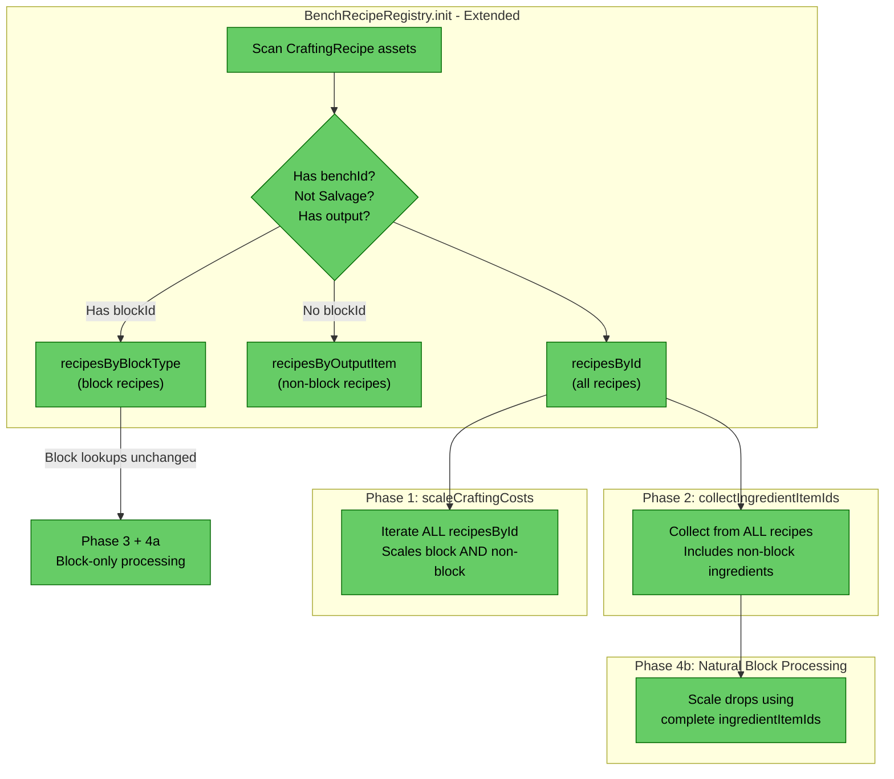

# Review: Non-Block Item Recipes Excluded from 12x Scaling Pipeline

**Date:** 2026-04-18  
**Scope:** `resourcecollection` package — recipe filtering, cost scaling, and ingredient tracking  
**Depth:** Deep dive with data flow analysis

---

## 1. Executive Summary

The 12x scaling pipeline has a systematic blind spot: **any crafting recipe whose output item lacks a `blockId` is completely invisible** to all pipeline phases. The root cause is a single filter in `BenchRecipeRegistry.init()` (line 79) that gates recipe registration on the output item having a block type. This propagates downstream — Phase 1 never scales their input costs, Phase 2 never collects their ingredients, and Phase 4b consequently under-scales natural block drops that serve as inputs to these recipes. Additionally, a **pre-existing double-scaling bug** affects recipes belonging to both Builders and Furniture benches, which would also affect non-block recipes if they are brought into scope.

---

## 2. Current Architecture Diagram



---

## 3. Findings Table

| # | Category | Location | Detail |
|---|----------|----------|--------|
| 1 | **Anti-pattern** | [BenchRecipeRegistry.java](src/main/java/com/UnobstructedThirdPerson/resourcecollection/BenchRecipeRegistry.java#L79) | `blockTypeId == null \|\| blockTypeId.isEmpty()` filter excludes all non-block recipes from registration. This is the root cause — every downstream phase inherits this exclusion because they all iterate `BenchRecipeRegistries`. |
| 2 | **Scalability** | [BenchRecipeRegistry.java](src/main/java/com/UnobstructedThirdPerson/resourcecollection/BenchRecipeRegistry.java#L40-L42) | `recipesByBlockType` is the only index; there is no `recipesByOutputItem` map. The data model structurally cannot represent non-block recipes even if the filter were removed. |
| 3 | **Anti-pattern** | [DropScaler.java](src/main/java/com/UnobstructedThirdPerson/resourcecollection/DropScaler.java#L154-L170) | `scaleCraftingCosts` iterates all registries without deduplication. A recipe in both the Builders and Furniture registries would be scaled **twice** (×12 then ×144). This is a pre-existing bug that also applies to any fix for non-block recipes. |
| 4 | **Redundancy** | [DropScaler.java](src/main/java/com/UnobstructedThirdPerson/resourcecollection/DropScaler.java#L364-L381) | `collectIngredientItemIds()` only iterates registered (block-only) recipes. Ingredients unique to non-block recipes are missing from the set, causing Phase 4b to miss scaling their drops on natural blocks. |
| 5 | **Scalability** | [BenchBlockClassifier.java](src/main/java/com/UnobstructedThirdPerson/resourcecollection/BenchBlockClassifier.java#L66) | `classify()` queries `BenchRecipeRegistries.getRecipeForBlock(btId)` — inherently block-only. This is **correct behavior** for Phase 4a partitioning, but confirms that non-block recipes need a separate path, not a modification of the classifier. |
| 6 | **Scalability** | [NaturalResourceRegistry.java](src/main/java/com/UnobstructedThirdPerson/resourcecollection/NaturalResourceRegistry.java#L71-L76) | `craftableBlockIds` uses `item.getBlockId()` to identify non-natural blocks. This is **correct** — a pure-item recipe should NOT disqualify a block from being natural. No change needed here. |
| 7 | **Over-engineering risk** | [AbstractBenchProcessor.java](src/main/java/com/UnobstructedThirdPerson/resourcecollection/AbstractBenchProcessor.java#L46) | Phase 4a (`process()`) resolves recipe inputs and sets `BlockBreakingDropType`. This phase is inherently block-only (modifies block gathering config). Non-block items have no block to modify — do NOT try to extend this phase for non-block items. |

---

## 4. Detailed Gap Analysis

### 4.1 Exact Scope of Exclusion

**Excluded recipe types:** Any `CraftingRecipe` where:
- `recipe.getPrimaryOutput().getItemId()` → `Item.getBlockId()` returns null or empty
- AND the recipe belongs to a Builders or Furniture bench

These are items craftable at benches but **not placeable as blocks**: tools, weapons, consumables, entity-based furniture (if any), decorative items that are held/worn rather than placed, etc.

### 4.2 Affected Pipeline Phases

| Phase | Affected? | Impact |
|-------|-----------|--------|
| **Phase 1** (scaleCraftingCosts) | **YES** | Non-block recipe costs stay at 1x while players get 12x materials. Items are 12x too cheap to craft. |
| **Phase 2** (collectIngredientItemIds) | **YES** | Ingredients unique to non-block recipes are missing from the ingredient set. |
| **Phase 3** (BenchBlockClassifier) | No | Block-only by design. Correct behavior. |
| **Phase 4a** (AbstractBenchProcessor) | No | Block-only by design. Correct behavior. |
| **Phase 4b** (processNaturalBlock) | **INDIRECT** | Uses `ingredientItemIds` from Phase 2. If an ingredient is only used in non-block recipes, its drop quantity on natural blocks won't be scaled. |
| **Phase 5** (register drop lists) | No | Only registers lists created by Phase 4a/4b. |
| **Phase 6** (scaleStackSizes) | No | Independent of recipe system. Scales all natural item stacks. |

### 4.3 Pre-existing Double-Scaling Bug (Finding #3)

`scaleCraftingCosts` loops over **all registries** without tracking which `CraftingRecipe` objects have already been scaled:

```java
for (BenchRecipeRegistry reg : BenchRecipeRegistries.getAllRegistries()) {
    for (var entry : reg.getAllRecipesById().entrySet()) {
        // ... scales recipe.input via reflection ...
    }
}
```

If recipe R has `BenchRequirement: ["Builders", "Furniture_Bench"]`:
1. `BenchRecipeRegistry("Builders")` includes R (via `hasBenchId`)
2. `BenchRecipeRegistry("Furniture_Bench")` includes R (via `hasBenchId`)
3. First iteration: `input[i].quantity × 12`
4. Second iteration: `(input[i].quantity × 12) × 12 = input[i].quantity × 144`

This affects any recipe with `BUILDERS_AND_FURNITURE` category. It would also affect non-block recipes if they span both benches.

---

## 5. Target Architecture Diagram



---

## 6. Recommended Modifications

### 6.1 BenchRecipeRegistry.java — Extend, don't replace

The existing registry can be extended to track non-block recipes alongside block recipes. The key insight: `recipesByBlockType` stays unchanged for block-only consumers, while `recipesById` becomes the universal set.

**Changes needed:**
1. **Remove the `blockId` gate from `recipesById`** — move the `blockTypeId` check so it only guards `byBlock.putIfAbsent()`, not the entire recipe registration
2. **Add `recipesByOutputItem` map** — index non-block recipes by their output `itemId` for any future lookup needs
3. **Update `baseBlockRecipeIds`** — the base-block classification should also cover non-block recipes whose inputs are all natural

**In `init()` at line 79**, change:
```java
// BEFORE: both maps gated on blockId
if (blockTypeId == null || blockTypeId.isEmpty()) continue;
byBlock.putIfAbsent(blockTypeId, recipe);
byId.put(recipe.getId(), recipe);

// AFTER: only byBlock gated on blockId
byId.put(recipe.getId(), recipe);
if (blockTypeId != null && !blockTypeId.isEmpty()) {
    byBlock.putIfAbsent(blockTypeId, recipe);
}
```

### 6.2 DropScaler.scaleCraftingCosts — Fix double-scaling

**Add an `IdentityHashSet` of already-scaled recipes** to prevent the same `CraftingRecipe` object from being scaled twice when it appears in multiple registries:

```java
Set<CraftingRecipe> scaled = Collections.newSetFromMap(new IdentityHashMap<>());
for (BenchRecipeRegistry reg : BenchRecipeRegistries.getAllRegistries()) {
    for (var entry : reg.getAllRecipesById().entrySet()) {
        CraftingRecipe recipe = entry.getValue();
        if (scaled.contains(recipe)) continue;  // dedup
        // ... scale ...
        scaled.add(recipe);
    }
}
```

### 6.3 No changes needed in:
- **NaturalResourceRegistry** — `blockId` filter is correct for determining natural blocks
- **BenchBlockClassifier** — block-only by design, correct
- **AbstractBenchProcessor** — block-only by design, correct
- **PlacementCostScaler** — operates on block placement, not crafting
- **ResourceTypeResolver** — already generic, works for any recipe's inputs

---

## 7. Risks and Edge Cases

| Risk | Severity | Mitigation |
|------|----------|------------|
| **Double-scaling of overlap recipes** | High | Fix Finding #3 BEFORE or DURING the non-block recipe inclusion. Otherwise overlap non-block recipes get ×144 cost. |
| **Salvage recipe interference** | Low | The `startsWith("Salvage")` filter runs before the blockId check, so salvage recipes are already excluded. No change needed. |
| **Base-block classification for non-block recipes** | Medium | If a non-block recipe has all-natural inputs (e.g., crafting a tool directly from raw wood), it should be classified as a "base item recipe" and excluded from Phase 1 scaling, same as base block recipes. Verify the `allInputsNatural` logic works for non-block recipes — it should, since it checks `MaterialQuantity` inputs without reference to block types. |
| **`collectIngredientItemIds` stale category assignment** | Low | The function currently hardcodes `BenchCategory` from `benchId` string comparison. When non-block recipes are included, ensure the category resolution uses `BenchCategory.fromRecipe()` instead of string matching, or the wrong preference (natural vs non-natural) could be applied during resolution. |
| **Test coverage** | Medium | `BlockRecipeRegistryTest` likely only tests block recipes. New tests needed for non-block recipe registration, Phase 1 scaling of non-block recipes, and the double-scaling dedup fix. |

---

## 8. Migration Notes

- **Nothing should be deleted** — this is an additive change to the registry
- **`BenchRecipeRegistry.recipesById`** should be expanded to include non-block recipes; `recipesByBlockType` stays block-only
- **`DropScaler.scaleCraftingCosts`** needs an identity-based dedup guard (applies to both block and non-block recipes)
- **`DropScaler.collectIngredientItemIds`** automatically picks up non-block recipe ingredients once they're in `recipesById` — no code change needed there beyond what `BenchRecipeRegistry` provides
- **Phase 4a/4b ordering constraints are unaffected** — non-block recipes only need Phase 1 cost scaling and Phase 2 ingredient collection; they don't interact with block gathering configs
- **No new runtime systems needed** — the fix is entirely in the asset-load-time pipeline
