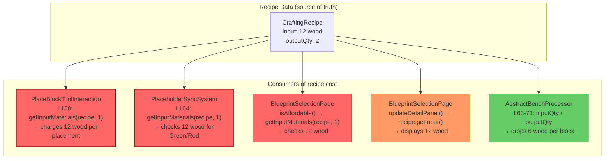
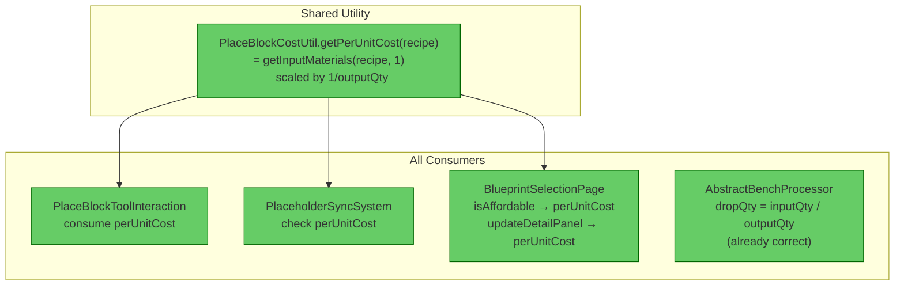

# Review: Output Quantity Not Applied to Placement Cost

## 1. Executive Summary

The resource economy has a **critical cost calculation bug**: every consumer of recipe material cost — except the break-drop system — ignores `outputQuantity`. Recipes that produce multiple items (e.g., 1 wood → 2 ladders, scaled to 12 wood → 2 ladders) charge the **full recipe cost per single placement** instead of `cost / outputQty`. The break-drop system (`AbstractBenchProcessor`) is the only location that correctly divides, creating a mismatch where placing a ladder costs 12 wood but breaking it only returns 6. The fix is a single shared utility method consumed by all four call sites.

## 2. Current Architecture — Cost Flow



## 3. Findings Table

| # | Category | Severity | Location | Detail |
|---|----------|----------|----------|--------|
| 1 | Anti-pattern | 🔴 **Blocked** | [PlaceBlockToolInteraction.java](src/main/java/com/UnobstructedThirdPerson/placeblock/PlaceBlockToolInteraction.java#L180) | `getInputMaterials(recipe, 1)` returns the full recipe cost (e.g., 12 wood). This is consumed atomically on every block placement. For a recipe with `outputQty=2`, the player pays 12 wood per ladder instead of 6. **Economy-breaking**: 2× overcharge on every multi-output recipe. |
| 2 | Anti-pattern | 🔴 **Blocked** | [PlaceholderSyncSystem.java](src/main/java/com/UnobstructedThirdPerson/placeblock/PlaceholderSyncSystem.java#L104) | `getInputMaterials(recipe, 1)` checks affordability against full recipe cost. The placeholder turns Red (unaffordable) when the player has 6–11 wood, even though 6 wood is sufficient for one ladder. Green/Red state is **wrong for all multi-output recipes**. |
| 3 | Anti-pattern | 🔴 **Blocked** | [BlueprintSelectionPage.java](src/main/java/com/UnobstructedThirdPerson/placeblock/ui/BlueprintSelectionPage.java#L638) | `isAffordable()` uses `getInputMaterials(recipe, 1)` — same full-cost check. The blueprint UI grays out recipes the player can actually afford. Inconsistent with what `PlaceBlockToolInteraction` would charge (both are wrong, but if #1 is fixed and #3 is not, they'd disagree). |
| 4 | Redundancy | 🟡 **Should Fix** | [BlueprintSelectionPage.java](src/main/java/com/UnobstructedThirdPerson/placeblock/ui/BlueprintSelectionPage.java#L415-L433) | `updateDetailPanel()` reads `recipe.getInput()` raw and displays full recipe quantities (e.g., "x12 wood"). The UI shows the total recipe cost, not per-unit placement cost. Player sees "12 wood" but should see "6 wood" (per ladder). Not economy-breaking but **misleading UI** that will conflict with the fix. |
| 5 | OK | ✅ | [AbstractBenchProcessor.java](src/main/java/com/UnobstructedThirdPerson/resourcecollection/AbstractBenchProcessor.java#L63-L71) | Correctly computes `dropQty = Math.max(1, inputQty / outputQty)`. Breaking a ladder drops 6 wood, not 12. This is the **only correct implementation** and should be the reference for all others. |
| 6 | Redundancy | 🟠 **QA** | [PortableBenchWindow.java](src/main/java/com/UnobstructedThirdPerson/portablebench/PortableBenchWindow.java#L180) | `getInputMaterials(recipe, 1)` for craftable-filter affordability in the portable bench. This is a **traditional crafting context** (craft 1 recipe → get `outputQty` items), so using the full recipe cost is arguably correct here. However, verify: if a player crafts 1 ladder recipe, do they get 2 ladders? If yes, full cost is correct for crafting. **Not affected by this bug** — but flag for QA. |
| 7 | Redundancy | 🔵 **Review** | [PortableStructuralWindow.java](src/main/java/com/UnobstructedThirdPerson/portablebench/PortableStructuralWindow.java#L169-L204) | `getInputMaterials(recipe)` for input validation and recipe matching. Traditional crafting context — same as #6. Not part of the PlaceBlock per-unit cost path. No action needed. |

### Summary by severity

| Severity | Count | Impact |
|----------|-------|--------|
| 🔴 Blocked | 3 | Player overcharged 2× on every multi-output recipe placement; UI shows wrong affordability |
| 🟡 Should Fix | 1 | UI displays full recipe cost instead of per-unit cost |
| 🟠 QA | 1 | Portable bench uses full recipe cost — correct for crafting, needs verification |
| 🔵 Review | 1 | No action needed |

## 4. Target Architecture — Shared Per-Unit Cost Utility



### Proposed utility: `PlaceBlockCostUtil`

**Location:** `com.UnobstructedThirdPerson.placeblock.PlaceBlockCostUtil`

**Why a utility class in the `placeblock` package:**
- All three broken consumers are in the `placeblock` package (or its `ui` sub-package)
- `AbstractBenchProcessor` is in `resourcecollection` and already has its own correct calculation — it doesn't need this utility (it operates at asset-setup time, not runtime)
- The concept of "per-unit placement cost" is specific to the PlaceBlock system, not a general crafting concept

**Method signature:**
```java
public static List<MaterialQuantity> getPerUnitPlacementCost(CraftingRecipe recipe)
```

**Logic:**
1. Call `CraftingManager.getInputMaterials(recipe, 1)` to get the full recipe cost
2. Read `recipe.getPrimaryOutput().getQuantity()` (default to 1 if null or ≤ 0)
3. If `outputQty == 1`, return materials unchanged
4. Otherwise, return a new list where each `MaterialQuantity` has `quantity / outputQty` (using `Math.max(1, ...)` to prevent zero-cost)

**Symmetry check:** This matches `AbstractBenchProcessor` line 68: `Math.max(1, inputQty / outputQty)` — the same formula used for break-drops. Place cost and break refund will be **identical**.

## 5. Migration Notes

### What changes (4 call sites):

- **PlaceBlockToolInteraction L180** — replace `CraftingManager.getInputMaterials(recipe, 1)` with `PlaceBlockCostUtil.getPerUnitPlacementCost(recipe)`
- **PlaceholderSyncSystem L104** — same replacement
- **BlueprintSelectionPage L638** (`isAffordable`) — same replacement
- **BlueprintSelectionPage L415-433** (`updateDetailPanel`) — replace `recipe.getInput()` raw iteration with `PlaceBlockCostUtil.getPerUnitPlacementCost(recipe)`, then display those quantities

### What stays the same:

- `AbstractBenchProcessor` — already correct, no changes needed
- `PortableBenchWindow` / `PortableStructuralWindow` — traditional crafting context, full recipe cost is correct

### What can be deleted:

- Nothing — no dead code involved

### Ordering constraints:

- All 4 fixes are independent of each other. No ordering required.
- The utility class must be created first, then all 4 call sites updated.

### Testing:

- **Unit test:** Create a recipe with `outputQty=2`, verify `getPerUnitPlacementCost` returns half quantities
- **Integration test:** Place a ladder (outputQty=2, input=12 wood) — should consume 6 wood, not 12
- **Symmetry test:** Verify `place cost == break drop` for all multi-output recipes (ladder, slab, rail, etc.)
- **Regression:** Verify single-output recipes (outputQty=1) are unchanged

---

→ @Engineer implement migration from docs/review-output-quantity-cost.md
→ @Architect if the `getPerUnitPlacementCost` formula needs to handle fractional division (e.g., 7 input / 2 output = 3.5 → 3 or 4?) — currently uses integer division with `Math.max(1, ...)`, matching `AbstractBenchProcessor`
