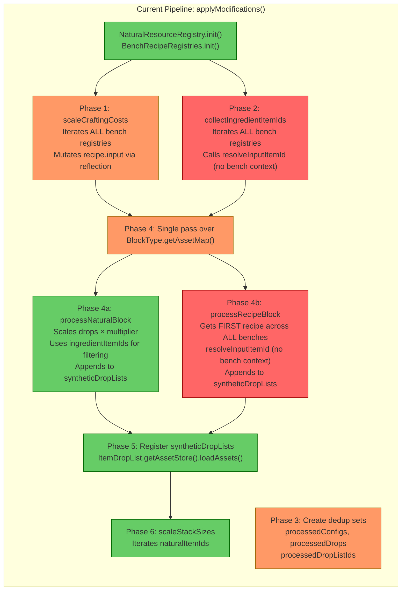
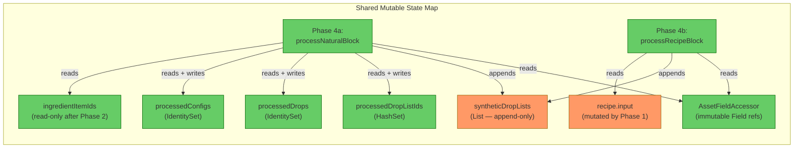
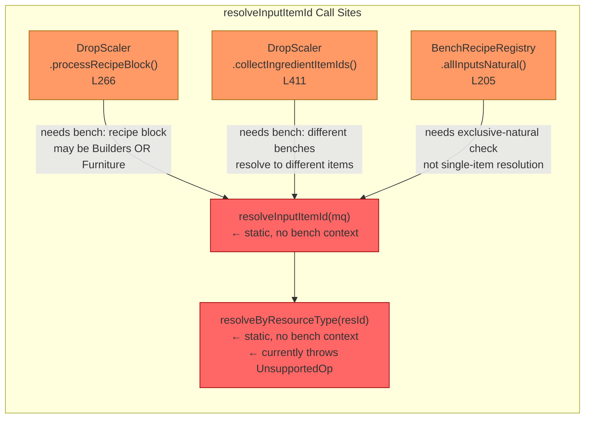
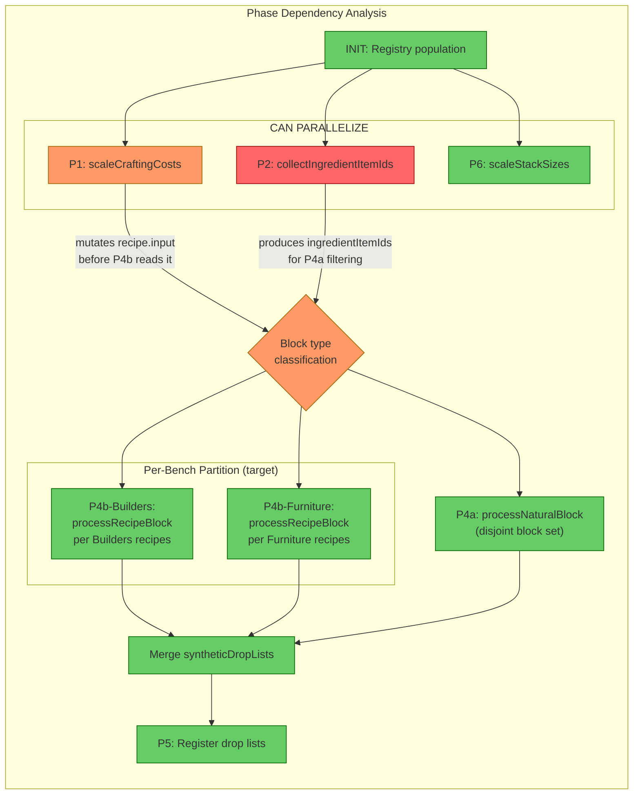
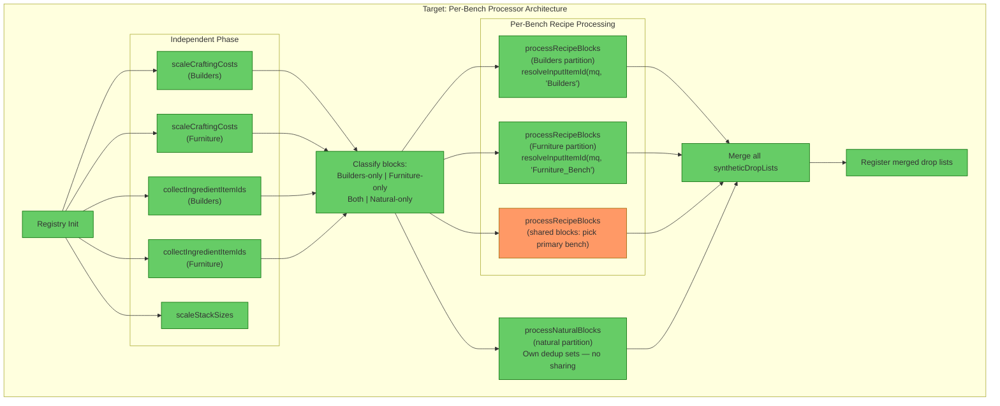

# Review: Asset Modification Pipeline — Parallel Bench-Category Processors

## 1. Executive Summary

The `DropScaler.applyModifications()` pipeline is structured as a **single monolithic pass** over all block types, with cross-bench aggregate queries (`hasRecipeAnywhere`, `getRecipeForBlock`, `collectIngredientItemIds`) that **erase bench identity** at every decision point. This makes per-bench partitioning impossible without restructuring three core coupling points: (1) block ownership classification, (2) `resolveInputItemId` gaining bench context, and (3) `processRecipeBlock` accepting a specific registry instead of querying the first-match coordinator. The highest-impact change is introducing a block classification phase that partitions blocks into bench-specific sets *before* the processing loop, eliminating the need for `hasRecipeAnywhere` and enabling independent per-bench processors that share no mutable state.

## 2. Current Architecture Diagram

### Shared Mutable State Map

### resolveInputItemId Call Sites

## 3. Findings Table

| # | Category | Location | Detail |
|---|----------|----------|--------|
| 1 | **Coupling** | [DropScaler.java](../src/main/java/com/UnobstructedThirdPerson/resourcecollection/DropScaler.java#L90-L91) | `hasRecipeAnywhere(btId)` and `isBaseBlockTypeAnywhere(btId)` erase bench identity at the block classification point. A block that belongs to Builders is indistinguishable from one in Furniture. This prevents per-bench partitioning — the pipeline cannot know *which* bench a block belongs to, only that it belongs to *some* bench. |
| 2 | **Coupling** | [DropScaler.java](../src/main/java/com/UnobstructedThirdPerson/resourcecollection/DropScaler.java#L253) | `processRecipeBlock` calls `BenchRecipeRegistries.getRecipeForBlock(btId)` which returns the **first match across all benches** (insertion-order priority: Builders wins). If a block has recipes in both Builders and Furniture, the Furniture recipe is silently discarded. The dropping behavior will be wrong for the Furniture context. |
| 3 | **Anti-pattern** | [BenchRecipeRegistries.java](../src/main/java/com/UnobstructedThirdPerson/resourcecollection/BenchRecipeRegistries.java#L65-L70) | `getRecipeForBlock()` is a lossy first-match aggregation. It cannot return multiple recipes for a multi-bench block. All downstream logic receives a single recipe with no bench provenance. |
| 4 | **Anti-pattern** | [BenchRecipeRegistry.java](../src/main/java/com/UnobstructedThirdPerson/resourcecollection/BenchRecipeRegistry.java#L154) | `resolveInputItemId(MaterialQuantity)` is static with no bench context. Different benches need different resolution preferences (Builders → non-natural, Furniture → natural), but the method cannot distinguish them. Already identified in [fix-bench-specific-resolution.md](Plans/fix-bench-specific-resolution.md) — needs a `benchId` parameter. |
| 5 | **Scalability** | [DropScaler.java](../src/main/java/com/UnobstructedThirdPerson/resourcecollection/DropScaler.java#L403-L416) | `collectIngredientItemIds()` merges ingredient IDs from ALL bench registries into a single flat `Set<String>`. If bench-specific resolution produces different item IDs per bench, the merged set becomes a superset that over-matches — natural blocks may have drops scaled for ingredients that only exist in one bench's context. |
| 6 | **Coupling** | [DropScaler.java](../src/main/java/com/UnobstructedThirdPerson/resourcecollection/DropScaler.java#L129-L137) | `scaleCraftingCosts` iterates all registries in a single loop. This is structurally independent per bench — each bench's recipes can be scaled without knowledge of other benches. But the current shape prevents parallel execution because it's a single method with a single counter. |
| 7 | **Thread-safety** | [DropScaler.java](../src/main/java/com/UnobstructedThirdPerson/resourcecollection/DropScaler.java#L79-L82) | `syntheticDropLists` is an `ArrayList` appended by both `processNaturalBlock` (Phase 4a) and `processRecipeBlock` (Phase 4b). If these phases were to run in parallel (or per-bench processors ran concurrently), `ArrayList.add()` is not thread-safe. Would need `CopyOnWriteArrayList`, `Collections.synchronizedList`, or post-merge of per-processor lists. |
| 8 | **Thread-safety** | [AssetFieldAccessor.java](../src/main/java/com/UnobstructedThirdPerson/resourcecollection/AssetFieldAccessor.java#L49-L84) | `AssetFieldAccessor` is **effectively immutable** after construction — it only holds `Field` references resolved once. `Field.set(target, value)` on *different target objects* is thread-safe (each call operates on a distinct object's memory). Sharing a single `AssetFieldAccessor` across parallel processors is safe. |
| 9 | **Coupling** | [DropScaler.java](../src/main/java/com/UnobstructedThirdPerson/resourcecollection/DropScaler.java#L75-L82) | Dedup sets `processedConfigs`, `processedDrops`, `processedDropListIds` are used **only** by Phase 4a (natural blocks). Phase 4b (recipe blocks) never touches them. These sets protect against Hytale's shared-instance configs — if two BlockTypes share the same `SoftBlockDropType` object, scaling it twice would double-scale. This concern is *within* Phase 4a only and can be scoped to each processor's local state. |
| 10 | **Scalability** | [DropScaler.java](../src/main/java/com/UnobstructedThirdPerson/resourcecollection/DropScaler.java#L85-L107) | The single-pass loop over `BlockType.getAssetMap()` makes a binary classification: `(hasRecipe && !isBase)` vs `(isNatural && !hasRecipe)`. Blocks that are both natural AND have a recipe (impossible by current definitions) and blocks that are neither (e.g., Empty, Unknown, non-natural non-recipe blocks) are silently skipped. This classification hardcodes a two-way split — extending to three or more bench categories requires changing the if/else chain. |
| 11 | **Anti-pattern** | [BenchRecipeRegistry.java](../src/main/java/com/UnobstructedThirdPerson/resourcecollection/BenchRecipeRegistry.java#L70) | `recipesByBlockType` uses `putIfAbsent`, so only the **first** recipe for a given blockTypeId within a single bench is stored. If multiple recipes in the same bench produce the same block type, all but the first are silently discarded. |
| 12 | **Coupling** | [DropScaler.java](../src/main/java/com/UnobstructedThirdPerson/resourcecollection/DropScaler.java#L266) | Inside `processRecipeBlock`, `resolveInputItemId(mq)` is called per-input but has no access to the bench context. The resolved item determines what the block *drops* when broken. For a Builders block this should be planks; for Furniture it should be logs. Without bench context, the resolution is arbitrary. |

## 4. Phase Dependency Analysis

### What can run in parallel vs. what must be sequential

| Relationship | Constraint | Reason |
|---|---|---|
| P1 ∥ P2 ∥ P6 | **Independent** — can run in parallel after INIT | P1 mutates `recipe.input`, P2 reads `recipe.getInput()` (the accessor, not the field). But P2 calls `resolveInputItemId` which reads `mq.getItemId()`/`getResourceTypeId()` on `MaterialQuantity` objects from the *same* input array. If P1 replaces the array via `f.recipeInput.set(recipe, scaled)` while P2 is iterating the old reference, P2 holds a stale-but-valid reference. **However**, P1 creates a *new* array and sets it atomically via `Field.set`. P2 reads via `recipe.getInput()` which returns whatever the field currently points to. If P2 reads before P1's set → old array (unscaled, but still valid MQ objects). If P2 reads after → new array. No corruption, but the *quantities* in `collectIngredientItemIds` don't matter (it only collects item IDs, not quantities). **Safe to parallelize.** |
| P1 → P4b | **Sequential** — P1 must complete before P4b | `processRecipeBlock` reads `recipe.getInput()` to compute `dropQty = inputQty / outputQty`. The `inputQty` must already be the 12x-scaled value from P1. If P1 hasn't run, drop quantities will be 12x too low. |
| P2 → P4a | **Sequential** — P2 must complete before P4a | `processNaturalBlock` uses `ingredientItemIds` to decide which drops to scale. If the set is incomplete, natural blocks may not have their drops scaled. |
| P4a ∥ P4b | **Independent** — process disjoint block sets | The if/else at L90-107 guarantees a block is processed by exactly one of P4a or P4b, never both. They share `syntheticDropLists` (append-only) and `AssetFieldAccessor` (read-only). If parallelized, `syntheticDropLists` needs a thread-safe list or post-merge. |
| P4b-Builders ∥ P4b-Furniture | **Independent if blocks are partitioned** | Currently impossible because `getRecipeForBlock` returns one recipe with no bench. After partitioning, each processor owns its block set. The only shared structure is `syntheticDropLists`. |
| P4 → P5 | **Sequential** — all processors must complete before registration | `loadAssets` registers all synthetic drop lists at once. Must have the complete list. |
| P5 ∥ P6 | **Independent** | P6 modifies `Item.maxStack` which is unrelated to `ItemDropList` registration. Can run after INIT. |

## 5. Target Architecture Diagram

**Key changes from current to target:**

- **Block classification becomes an explicit phase.** Instead of `hasRecipeAnywhere` (boolean), a new method `classifyBlock(btId)` returns the owning bench(es). Blocks are partitioned into: Builders-only, Furniture-only, both, or natural-only.
- **`processRecipeBlock` receives a `BenchRecipeRegistry` directly** instead of querying the coordinator. Each per-bench processor calls `registry.getRecipeForBlock(btId)` on its own registry — no cross-bench first-match.
- **`resolveInputItemId(mq, benchId)` gains bench context.** Each processor passes its own bench ID. Builders resolves `Wood_Hardwood` → planks; Furniture resolves `Wood_All` → logs.
- **`collectIngredientItemIds` becomes per-bench.** Each bench produces its own ingredient set. Natural block processing uses the **union** of all bench ingredient sets (since a natural block's drops may be ingredients in any bench).
- **Dedup sets are processor-local.** `processedConfigs`, `processedDrops`, `processedDropListIds` are scoped to the natural block processor. Each recipe processor has no dedup concern (it creates new `BlockBreakingDropType` per block, never mutating shared instances).
- **`syntheticDropLists` becomes per-processor.** Each processor accumulates its own list. A merge step concatenates them before registration.
- **The "both" partition (orange)** requires a policy decision: which bench is primary? Options: (a) process once with the first bench (current behavior, lossy), (b) process with each bench and produce multiple drop lists (complex, may conflict), (c) require manual annotation of primary bench. This is the main unresolved design question.

## 6. Migration Notes

### What can be split immediately (no design decisions needed)
- `scaleCraftingCosts` → per-registry loop body is already independent. Extract to `scaleCraftingCosts(BenchRecipeRegistry, AssetFieldAccessor, int)` and call per bench.
- `collectIngredientItemIds` → same pattern. Per-bench sets, then union for Phase 4a.
- `scaleStackSizes` → already independent of all other phases. Can run any time after INIT.

### What requires resolveInputItemId to become bench-aware first
- `processRecipeBlock` restructure — cannot partition by bench until resolution is bench-specific
- `collectIngredientItemIds` per-bench — different benches may resolve the same ResourceTypeId to different items, producing different ingredient sets

### What requires a block classification phase
- Introducing `BenchRecipeRegistries.getRegistriesForBlock(btId)` → returns `List<BenchRecipeRegistry>` instead of boolean
- Replacing the `hasRecipeAnywhere` / `isBaseBlockTypeAnywhere` checks with per-bench partition maps
- Deciding policy for blocks in multiple benches

### What ordering constraints are eliminated
- P1 per-bench calls become independent (currently sequential via iterator)
- P4a and P4b-per-bench become independent (currently interleaved in one loop)
- P6 is lifted out of the sequential chain (currently waits for P5 unnecessarily)

### What runtime systems become unnecessary
- `BenchRecipeRegistries.getRecipeForBlock()` (first-match aggregation) — replaced by direct `registry.getRecipeForBlock()` on the owning registry
- `BenchRecipeRegistries.hasRecipeAnywhere()` — replaced by classification map lookup
- `BenchRecipeRegistries.isBaseBlockTypeAnywhere()` — replaced by per-bench `registry.isBaseBlockType()`

### Unresolved design questions
1. **Dual-bench blocks**: If a block has recipes in both Builders and Furniture, what drops when broken? Current behavior (first-match) is lossy. Options: pick primary bench by convention, use the recipe with higher ingredient cost, or require explicit annotation.
2. **Ingredient set scope for natural blocks**: Should natural block scaling use per-bench ingredient sets or the union? The union is conservative (scales more drops), per-bench is precise but requires knowing which bench a natural item feeds into.
3. **Whether to actually parallelize**: The plugin runs once during `onAssetsLoaded`. Parallelism adds complexity. The main benefit of restructuring is **correctness** (bench-specific resolution) and **extensibility** (adding a third bench), not performance. Consider restructuring into per-bench processors that run sequentially but share no state, rather than threading.
