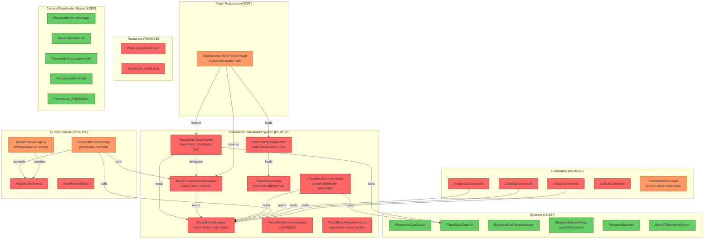
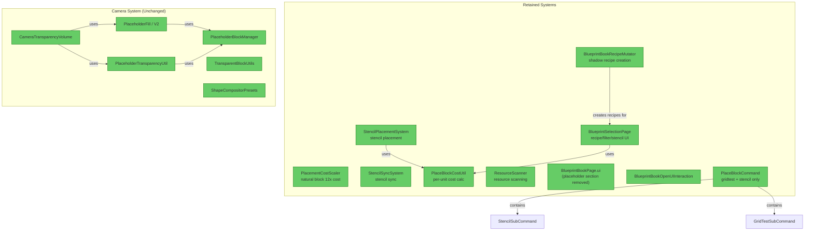

# Placeholder System Removal — Dependency Map

> **Scope:** All code related to the `Block_Placeholder` item (arming, syncing, reskinning, UI, commands).  
> **Preserve:** `PlacementCostScaler`, stencil system, camera transparency `Placeholder_*` blocks, `PlaceBlockCostUtil`.  
> **Date:** 2026-05-01

---

## 1. Executive Summary

The PlaceBlock placeholder system is a **self-contained subsystem** with a clean boundary: 8 files to delete entirely, 5 files to surgically edit, 13 resource files to delete. The dominant risk is `PlaceBlockMetadata` — it's imported by 9 Java files, but EVERY consumer is placeholder-specific or has a placeholder-specific branch that can be cleanly removed. **`PlacementCostScaler` has ZERO dependencies on the placeholder system.** The camera transparency `Placeholder_*` blocks (in `shape/v1/placeholder/`) are a **separate system** that happens to share the word "placeholder" — they must be kept intact.

---

## 2. Current Architecture Diagram

---

## 3. Findings Table

### 3.1 Files to DELETE (entirely placeholder-specific)

| # | Category | Severity | Location | Detail |
|---|----------|----------|----------|--------|
| 1 | DELETE | 🔴 Blocked | [PlaceholderSyncSystem.java](../src/main/java/com/UnobstructedThirdPerson/placeblock/PlaceholderSyncSystem.java) | Entire file is placeholder-only. Registers per-player `ItemContainer.registerChangeEvent` listeners on hotbar/storage. Delegates to `BlockPreviewReskinManager.syncPlaceholder()` and runs `checkAffordability()` for Green↔Red transitions. No non-placeholder consumers. |
| 2 | DELETE | 🔴 Blocked | [BlockPreviewReskinManager.java](../src/main/java/com/UnobstructedThirdPerson/placeblock/BlockPreviewReskinManager.java) | Entire file manages per-player reskinning of `*Block_Placeholder_State_Armed_Green_N` block types via `UpdateBlockTypes`/`UpdateItems` packets. Every method references `PlaceBlockMetadata`. No non-placeholder use. |
| 3 | DELETE | 🔴 Blocked | [PlaceBlockMetadata.java](../src/main/java/com/UnobstructedThirdPerson/placeblock/PlaceBlockMetadata.java) | Defines `PLACEHOLDER_ID`, `ARMED_GREEN_PREFIX`, `ARMED_RED_ID`, and all arm/disarm/state methods. 100% placeholder-specific. `HOTBAR_SIZE` constant is used by other files but is trivially replaceable with a literal `9`. |
| 4 | DELETE | 🔴 Blocked | [PlaceBlockToolInteraction.java](../src/main/java/com/UnobstructedThirdPerson/placeblock/PlaceBlockToolInteraction.java) | Custom interaction for placing armed placeholders. Guards on `PlaceBlockMetadata.isPlaceBlock()`, reads armed recipe from metadata, consumes materials, places output block. Entirely placeholder-specific. |
| 5 | DELETE | 🟡 Should Fix | [PlaceBlockBenchInterceptor.java](../src/main/java/com/UnobstructedThirdPerson/placeblock/PlaceBlockBenchInterceptor.java) | Already DISABLED in plugin `setup()` (commented out). Intercepts `CraftRecipeEvent.Pre` to arm placeholders at the bench. Safe to delete — dead code. |
| 6 | DELETE | 🟡 Should Fix | [PlaceBlockMenuInteraction.java](../src/main/java/com/UnobstructedThirdPerson/placeblock/PlaceBlockMenuInteraction.java) | Phase 1 stub interaction for `PlaceBlock_Menu` codec. Javadoc references placeholder preview integration. Registered in plugin `setup()`. |
| 7 | DELETE | 🟡 Should Fix | [PlaceBlockConfig.java](../src/main/java/com/UnobstructedThirdPerson/placeblock/PlaceBlockConfig.java) | Record with `placeholderItemId` field. `getConfig()` has **zero runtime callers** — the config is loaded but never consumed. Dead code. |
| 8 | DELETE | 🟡 Should Fix | [PlaceBlockConfigLoader.java](../src/main/java/com/UnobstructedThirdPerson/placeblock/PlaceBlockConfigLoader.java) | Loads `PlaceBlockConfig` from JSON. Since the config is dead, the loader is dead too. |

### 3.2 Command Files to DELETE

| # | Category | Severity | Location | Detail |
|---|----------|----------|----------|--------|
| 9 | DELETE | 🔴 Blocked | [AssignSubCommand.java](../src/main/java/com/UnobstructedThirdPerson/command/placeblock/subcommands/AssignSubCommand.java) | Arms held `Block_Placeholder` with a recipe. Uses `PlaceBlockMetadata.arm()`. 100% placeholder. |
| 10 | DELETE | 🔴 Blocked | [ClearSubCommand.java](../src/main/java/com/UnobstructedThirdPerson/command/placeblock/subcommands/ClearSubCommand.java) | Disarms held `Block_Placeholder`. Uses `PlaceBlockMetadata.disarm()`. 100% placeholder. |
| 11 | DELETE | 🔴 Blocked | [InfoSubCommand.java](../src/main/java/com/UnobstructedThirdPerson/command/placeblock/subcommands/InfoSubCommand.java) | Shows armed state of held `Block_Placeholder`. Uses `PlaceBlockMetadata.isPlaceBlock()`, `isArmed()`, `getArmedRecipeId()`. 100% placeholder. |
| 12 | DELETE | 🟡 Should Fix | [ListSubCommand.java](../src/main/java/com/UnobstructedThirdPerson/command/placeblock/subcommands/ListSubCommand.java) | Lists recipes that can be assigned to a placeholder. Placeholder-specific purpose. |

### 3.3 Resource Files to DELETE

| # | Category | Severity | Location | Detail |
|---|----------|----------|----------|--------|
| 13 | DELETE | 🔴 Blocked | [Block_Placeholder.json](../src/main/resources/Server/Item/Items/Tool/Block_Placeholder.json) | Item definition for the `Block_Placeholder` tool item. |
| 14 | DELETE | 🟡 Should Fix | [placeblock_config.json](../src/main/resources/placeblock_config.json) | Config file with `placeholderItemId`. Dead config — never read at runtime. |
| 15 | DELETE | 🔴 Blocked | [PlaceholderRow.ui](../src/main/resources/Common/UI/Custom/Pages/BlueprintBook/PlaceholderRow.ui) | UI component for placeholder list rows. Appended by `BlueprintSelectionPage.build()`. |
| 16 | DELETE | 🔴 Blocked | [PlaceholderSlot.ui](../src/main/resources/Common/UI/Custom/Pages/BlueprintBook/PlaceholderSlot.ui) | UI component for placeholder slot interaction. |

### 3.4 Files to EDIT (mixed placeholder + non-placeholder code)

| # | Category | Severity | Location | Detail |
|---|----------|----------|----------|--------|
| 17 | EDIT | 🔴 Blocked | [UnobstructedThirdPersonPlugin.java](../src/main/java/com/UnobstructedThirdPersonPlugin.java) | **Remove:** (a) `import PlaceholderSyncSystem` (L24), `import BlockPreviewReskinManager` (L18), `import PlaceBlockConfigLoader` (L21), `import PlaceBlockMenuInteraction` (L22), `import PlaceBlockToolInteraction` (L23). (b) `PlaceBlockConfigLoader.loadAndStore(...)` call (L81). (c) `PlaceBlock_Menu` codec registration (L78-79). (d) `PlaceBlockTool` codec registration (L87-88). (e) `PlaceholderSyncSystem.register(...)` call (L128). (f) `PlaceholderSyncSystem.unregister(...)` call (L142). (g) `BlockPreviewReskinManager.cleanup(...)` call (L144). **Keep:** `PlacementCostScaler` registration (L67), stencil registrations, all other systems. |
| 18 | EDIT | 🔴 Blocked | [BlueprintSelectionPage.java](../src/main/java/com/UnobstructedThirdPerson/placeblock/ui/BlueprintSelectionPage.java) | **Remove:** (a) `import BlockPreviewReskinManager` (L3), `import PlaceBlockMetadata` (L5). (b) `MAX_PLACEHOLDER_ROWS` constant (L50). (c) `#PlaceholderList` append loop in `build()` (L176-178). (d) `buildPlaceholderBindings(evt)` call (L215). (e) `updatePlaceholderList(cmd, store, ref)` call in `build()` (L225). (f) `#GetPlaceholderBtn` event binding (L208-209). (g) `PlaceholderDrop:` handler (L344-355). (h) `PlaceholderClear:` handler (L360-368). (i) Entire `buildPlaceholderBindings()` method (L523-531). (j) Entire `updatePlaceholderList()` method (L534-592). (k) Entire `armPlaceholder()` method (L595-625). (l) Entire `disarmPlaceholder()` method (L627-641). **Keep:** Recipe grid, filter system, cost display, stencil/recipe selection, tab management. |
| 19 | EDIT | 🟡 Should Fix | [BlueprintBookPage.ui](../src/main/resources/Common/UI/Custom/Pages/BlueprintBook/BlueprintBookPage.ui) | **Remove:** (a) Entire "Placeholder List" section (L227-265): header label "Placeholders", `#NoPlaceholdersLabel`, `#PlaceholderList` group, `#GetPlaceholderBtn`. (b) Comment references to `PlaceholderRow` (L2). **Keep:** All recipe grid, filter, cost, tab, and stencil UI sections. |
| 20 | EDIT | 🟡 Should Fix | [PlaceBlockCommand.java](../src/main/java/com/UnobstructedThirdPerson/command/placeblock/PlaceBlockCommand.java) | **Remove:** `addSubCommand(new AssignSubCommand())` (L21), `addSubCommand(new ClearSubCommand())` (L22), `addSubCommand(new InfoSubCommand())` (L24), `addSubCommand(new ListSubCommand())` (L25). Remove imports for those 4 classes. Update description from "Manage PlaceBlock placeholder arming" to "PlaceBlock tool commands". **Keep:** `GridTestSubCommand`, `StencilSubCommand`. |
| 21 | EDIT | 🟡 Should Fix | [ResourceScanner.java](../src/main/java/com/UnobstructedThirdPerson/placeblock/ResourceScanner.java#L17) | **Remove:** Javadoc reference to `PlaceholderSyncSystem` (L17). No code changes needed — just a doc comment. |

### 3.5 Files to KEEP (confirmed no placeholder dependency)

| # | Category | Severity | Location | Detail |
|---|----------|----------|----------|--------|
| 22 | KEEP | ✅ Safe | [PlacementCostScaler.java](../src/main/java/com/UnobstructedThirdPerson/resourcecollection/PlacementCostScaler.java) | **ZERO imports** of any placeholder class. Guards on `StencilMetadata.isStencil()` and `NaturalResourceRegistry.isNaturalBlock()`. Completely independent. |
| 23 | KEEP | ✅ Safe | [PlaceBlockCostUtil.java](../src/main/java/com/UnobstructedThirdPerson/placeblock/PlaceBlockCostUtil.java) | Shared by `StencilPlacementSystem`, `BlueprintSelectionPage`, and (deleted) `PlaceholderSyncSystem`/`PlaceBlockToolInteraction`. After removal, still has 2 active consumers. |
| 24 | KEEP | ✅ Safe | [BlueprintBookRecipeMutator.java](../src/main/java/com/UnobstructedThirdPerson/placeblock/BlueprintBookRecipeMutator.java) | Creates shadow recipes with `PlaceBlock` ResourceType input and `Blueprint` bench requirement. The input override comment (L85) mentions "matches all 3 placeholder colors" — **update comment only**. The `ResourceType` input still works for stencils. |
| 25 | KEEP | ✅ Safe | [TransparentBlockUtils.java](../src/main/java/com/UnobstructedThirdPerson/shape/v1/placeholder/TransparentBlockUtils.java) | General utility for fake block IDs and block reading. Used by 6+ files across camera, shape, preview, and debug systems. Lives in `placeholder` package but is NOT placeholder-specific. |
| 26 | KEEP | ✅ Safe | [PlaceholderBlockManager.java](../src/main/java/com/UnobstructedThirdPerson/shape/v1/placeholder/PlaceholderBlockManager.java) | Maps hitbox types to `Placeholder_*` camera blocks. Used by camera transparency system. NOT related to `Block_Placeholder` item. |
| 27 | KEEP | ✅ Safe | [PlaceholderFill.java](../src/main/java/com/UnobstructedThirdPerson/shape/v1/fill/PlaceholderFill.java) | Camera fill type. Uses `PlaceholderBlockManager`. NOT related to `Block_Placeholder` item. |
| 28 | KEEP | ✅ Safe | [PlaceholderFillV2.java](../src/main/java/com/UnobstructedThirdPerson/shape/v2/fill/PlaceholderFillV2.java) | V2 camera fill type. Same as above. |
| 29 | KEEP | ✅ Safe | [PlaceholderTransparencyUtil.java](../src/main/java/com/UnobstructedThirdPerson/shape/v1/placeholder/PlaceholderTransparencyUtil.java) | Camera transparency utility. Uses `PlaceholderBlockManager`. |
| 30 | KEEP | ✅ Safe | All `_Debug/Placeholders/*.json`  | Camera system block definitions (`Placeholder_Full`, `_Half`, `_Quarter`, etc.). These are NOT the `Block_Placeholder` item — they're hitbox-shaped blocks for the camera transparency system. |
| 31 | KEEP | ✅ Safe | [StencilSubCommand.java](../src/main/java/com/UnobstructedThirdPerson/command/placeblock/subcommands/StencilSubCommand.java) | Creates stencil items. No placeholder references. |
| 32 | KEEP | ✅ Safe | [GridTestSubCommand.java](../src/main/java/com/UnobstructedThirdPerson/command/placeblock/subcommands/GridTestSubCommand.java) | Opens UI test page. No placeholder references. |

---

## 4. Target Architecture Diagram

---

## 5. Migration Notes

### Files to DELETE entirely (8 Java + 4 resources = 12 files)

**Java files:**
- `src/main/java/com/UnobstructedThirdPerson/placeblock/PlaceholderSyncSystem.java`
- `src/main/java/com/UnobstructedThirdPerson/placeblock/BlockPreviewReskinManager.java`
- `src/main/java/com/UnobstructedThirdPerson/placeblock/PlaceBlockMetadata.java`
- `src/main/java/com/UnobstructedThirdPerson/placeblock/PlaceBlockToolInteraction.java`
- `src/main/java/com/UnobstructedThirdPerson/placeblock/PlaceBlockBenchInterceptor.java`
- `src/main/java/com/UnobstructedThirdPerson/placeblock/PlaceBlockMenuInteraction.java`
- `src/main/java/com/UnobstructedThirdPerson/placeblock/PlaceBlockConfig.java`
- `src/main/java/com/UnobstructedThirdPerson/placeblock/PlaceBlockConfigLoader.java`

**Command files (4):**
- `src/main/java/com/UnobstructedThirdPerson/command/placeblock/subcommands/AssignSubCommand.java`
- `src/main/java/com/UnobstructedThirdPerson/command/placeblock/subcommands/ClearSubCommand.java`
- `src/main/java/com/UnobstructedThirdPerson/command/placeblock/subcommands/InfoSubCommand.java`
- `src/main/java/com/UnobstructedThirdPerson/command/placeblock/subcommands/ListSubCommand.java`

**Resource files (4):**
- `src/main/resources/Server/Item/Items/Tool/Block_Placeholder.json`
- `src/main/resources/placeblock_config.json`
- `src/main/resources/Common/UI/Custom/Pages/BlueprintBook/PlaceholderRow.ui`
- `src/main/resources/Common/UI/Custom/Pages/BlueprintBook/PlaceholderSlot.ui`

### Files to EDIT (5 files)

1. **`UnobstructedThirdPersonPlugin.java`** — Remove 5 imports, 5 registration/lifecycle calls
2. **`BlueprintSelectionPage.java`** — Remove 2 imports, 1 constant, ~120 lines of placeholder methods/handlers
3. **`BlueprintBookPage.ui`** — Remove ~38 lines (Placeholder List section)
4. **`PlaceBlockCommand.java`** — Remove 4 subcommand registrations + 4 imports, update description
5. **`ResourceScanner.java`** — Remove 1 javadoc reference (cosmetic)

### Registration/Import Sites to Clean Up

| File | Line(s) | What to remove |
|------|---------|----------------|
| `UnobstructedThirdPersonPlugin.java` | L18 | `import BlockPreviewReskinManager` |
| `UnobstructedThirdPersonPlugin.java` | L21 | `import PlaceBlockConfigLoader` |
| `UnobstructedThirdPersonPlugin.java` | L22 | `import PlaceBlockMenuInteraction` |
| `UnobstructedThirdPersonPlugin.java` | L23 | `import PlaceBlockToolInteraction` |
| `UnobstructedThirdPersonPlugin.java` | L24 | `import PlaceholderSyncSystem` |
| `UnobstructedThirdPersonPlugin.java` | L78-79 | `PlaceBlock_Menu` codec registration |
| `UnobstructedThirdPersonPlugin.java` | L81 | `PlaceBlockConfigLoader.loadAndStore(...)` |
| `UnobstructedThirdPersonPlugin.java` | L87-88 | `PlaceBlockTool` codec registration |
| `UnobstructedThirdPersonPlugin.java` | L128 | `PlaceholderSyncSystem.register(...)` |
| `UnobstructedThirdPersonPlugin.java` | L142 | `PlaceholderSyncSystem.unregister(...)` |
| `UnobstructedThirdPersonPlugin.java` | L144 | `BlockPreviewReskinManager.cleanup(...)` |
| `BlueprintSelectionPage.java` | L3 | `import BlockPreviewReskinManager` |
| `BlueprintSelectionPage.java` | L5 | `import PlaceBlockMetadata` |
| `PlaceBlockCommand.java` | L3-6 | 4 subcommand imports |

### Risk Areas

| Risk | Assessment | Mitigation |
|------|-----------|------------|
| **`HOTBAR_SIZE` constant removal** | `PlaceBlockMetadata.HOTBAR_SIZE` is referenced by `BlockPreviewReskinManager` (deleted) and `PlaceholderSyncSystem` (deleted). No surviving consumers. | Safe — all consumers are being deleted. |
| **`BlueprintBookRecipeMutator` shadow recipes still use `PlaceBlock` ResourceType** | The input override `new MaterialQuantity(null, "PlaceBlock", null, 1, null)` was designed for placeholder colors. Stencils also match this ResourceType. | **Verify stencil items have the `PlaceBlock` ResourceType** — if not, recipe matching will break. |
| **`PlaceBlockCommand` may become oddly named** | After removing 4 of 6 subcommands, only `gridtest` and `stencil` remain under `/placeblock`. | Consider renaming to `/tools` or `/stencil`, or moving subcommands elsewhere. |
| **Camera `Placeholder_*` blocks share package name** | The `shape/v1/placeholder/` package contains `TransparentBlockUtils`, `PlaceholderBlockManager`, `PlaceholderTransparencyUtil` — all camera-system files. Do NOT delete this package. | These files have ZERO dependencies on `PlaceBlockMetadata` or any deleted file. Safe. |
| **`BlueprintSelectionPage` structural integrity** | Removing ~120 lines of placeholder methods from a large file. The remaining recipe/filter/cost/stencil code has no references to deleted classes. | After edits, verify `build()` and `handleDataEvent()` still compile — the placeholder branches are self-contained `else if` blocks. |
| **`*Block_Placeholder_State_Armed_Green_*` block/item definitions** | These are virtual item IDs created via `ItemStack.withState()` — they don't have standalone `.json` files. Removing the code that creates them is sufficient. | No resource files to find for these. |

### What ordering constraints are eliminated

- **`PlaceholderSyncSystem.register()` → must happen in `onPlayerReady`** — eliminated
- **`BlockPreviewReskinManager.cleanup()` → must happen in `onPlayerDisconnect`** — eliminated
- **`PlaceBlockConfigLoader.loadAndStore()` → must happen in `setup()`** — eliminated
- **Inventory change → `PlaceholderSyncSystem` → `BlockPreviewReskinManager.syncPlaceholder()` → `checkAffordability()` → state mutation loop** — entire reactive chain eliminated

### What runtime systems become unnecessary

- Per-player `ItemContainer.registerChangeEvent` listeners (managed by `PlaceholderSyncSystem`)
- Per-player `UpdateBlockTypes` / `UpdateItems` packet sending (managed by `BlockPreviewReskinManager`)
- Per-player `ConcurrentHashMap<UUID, Map<Integer, String>>` tracking (in `BlockPreviewReskinManager.activeReskins`)
- Per-player `AtomicBoolean` re-entry guards (in `PlaceholderSyncSystem.syncInProgress`)

---

## 6. Verification Checklist

After implementation, verify:

- [ ] `PlacementCostScaler` still compiles and fires on natural block placement
- [ ] `StencilPlacementSystem` still compiles and consumes materials via `PlaceBlockCostUtil`
- [ ] `BlueprintSelectionPage` opens, shows recipes, handles stencil workflow
- [ ] Camera transparency system (`CameraTransparencyVolumeV2`) still works — `Placeholder_*` blocks intact
- [ ] `/placeblock stencil <id>` command works
- [ ] `/placeblock gridtest` command works
- [ ] No compile errors from orphaned imports
- [ ] `BlueprintBookRecipeMutator.mutate()` still runs on `LoadAssetEvent`

---

→ @Engineer implement migration from docs/review-placeholder-removal-map.md  
→ @Architect if the `PlaceBlock` ResourceType input in `BlueprintBookRecipeMutator` needs redesign for stencil-only workflows
