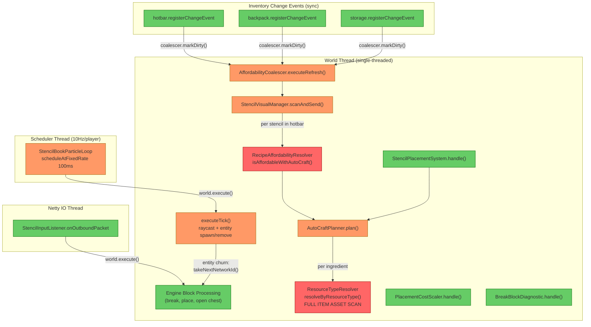
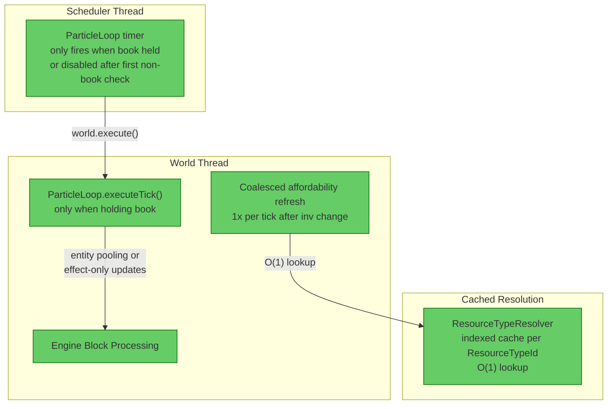

# Review: Progressive Server Slowdown — Full Codebase Audit

**Date:** 2026-05-29  
**Scope:** All files in `src/main/java/com/CodeCreature/` — 70 source files  
**Symptom:** Server progressively slows down until ALL block interactions (break, place, open chests) stop working. Affects engine-level interactions, not just plugin. Indicates world thread saturation.

---

## 1. Executive Summary

The codebase has **no single unbounded-growth smoking gun**. Per-player state maps (`registeredPlayers`, `playerStates`, `INSTANCES`, `coalescers`) all have proper lifecycle management with cleanup on disconnect. The particle loop queue flooding fix is correctly implemented. Instead, the progressive slowdown is caused by the **cumulative world-thread load** from three reinforcing sources: (1) entity churn consuming monotonic network IDs in `StencilBookParticleLoop`, (2) full item-asset-map scans in `ResourceTypeResolver.resolveByResourceType()` running on every affordability check, and (3) `AutoCraftPlanner.plan()` eagerly computing unused display data that doubles the resolution cost. Under sustained gameplay, these compound to saturate the single world thread, starving the engine's block interaction processing.

---

## 2. Current Architecture Diagram

---

## 3. Findings Table

| # | Category | Severity | Location | Detail |
|---|----------|----------|----------|--------|
| 1 | CPU Accumulation | 🔴 **Blocked** | [ResourceTypeResolver.java](src/main/java/com/CodeCreature/scaling/ResourceTypeResolver.java#L107-L128) | `resolveByResourceType()` performs a **full scan of the entire Item asset map** (potentially thousands of items) using stream/filter/sort on every call. Called per ingredient per stencil per affordability refresh. With 5 stencils × 3 ingredients × 2000 items = **30,000 item scans per inventory change**. No index or cache. This method is the single most expensive operation on the world thread hot path. |
| 2 | CPU Accumulation | 🟡 **Should Fix** | [AutoCraftPlanner.java](src/main/java/com/CodeCreature/crafting/AutoCraftPlanner.java#L100-L103) | `plan()` eagerly computes `directView` (via `resolveIngredientCosts()`) and `rawView` before the fast-path check. `resolveIngredientCosts()` re-does the full ResourceType resolution. The affordability-check callers (`isAffordableWithAutoCraft`) only need the `affordable()` boolean — the display data is wasted. This roughly **doubles** the ResourceType resolution cost on the hot path. |
| 3 | CPU Accumulation | 🟡 **Should Fix** | [StencilBookParticleLoop.java](src/main/java/com/CodeCreature/ui/stencilbook/StencilBookParticleLoop.java#L96-L108) | `startUpdateLoop()` fires 10 times/sec for every connected player **unconditionally**. Each fire does a CAS + `world.execute()` queuing a Runnable that resolves entity components even when the player is NOT holding the StencilBook. With N players, adds 10N Runnables/sec to the world thread queue. The work per Runnable is cheap (~5 component lookups) when not holding the book, but the scheduling overhead and queue pressure is constant. |
| 4 | Memory Leak | 🟡 **Should Fix** | [StencilBookParticleLoop.java](src/main/java/com/CodeCreature/ui/stencilbook/StencilBookParticleLoop.java#L262-L283) | `shutdown()` sets `activeEntity = null` without calling `store.removeEntity()`. Comment explains this is intentional (world.execute during disconnect causes hangs). But the entity persists in the entity store until world unload — **one leaked entity per disconnect** while holding the StencilBook aimed at a recipe block. Non-serialized, so it doesn't survive restart, but accumulates across connect/disconnect cycles. |
| 5 | Queue Growth | 🟠 **QA** | [StencilBookParticleLoop.java](src/main/java/com/CodeCreature/ui/stencilbook/StencilBookParticleLoop.java#L111-L148) | `executeTick()` calls `takeNextNetworkId()` on every entity spawn. Network IDs are likely monotonically increasing and never recycled. When a player moves their cursor across blocks while holding the StencilBook, entities are spawned and removed at up to 10/sec. Over a multi-hour session, thousands of network IDs are consumed. If the engine indexes entity tracker data by network ID (array or bitmap), these structures **grow permanently**, potentially degrading entity iteration and packet dispatch performance. **Needs verification**: check if `takeNextNetworkId()` recycles IDs or grows without bound. |
| 6 | Anti-pattern | 🟠 **QA** | [StencilInputListener.java](src/main/java/com/CodeCreature/ui/radial/StencilInputListener.java#L50-L75) | `onOutboundPacket()` runs on the **Netty IO thread** but calls `store.getComponent(ref, Player.getComponentType())` and `player.getInventory().getActiveHotbarItem()` — both world-thread-only operations. The `instanceof SyncInteractionChains` filter and `InteractionType` check are cheap, but the component/inventory reads create a **cross-thread race**. Under contention this could cause stale reads or corruption. Not directly a progressive issue but a correctness risk. |
| 7 | No Issue | 🔵 **Review** | [StencilSyncSystem.java](src/main/java/com/CodeCreature/stencil/StencilSyncSystem.java) | Event registration lifecycle is clean. `register()` stores handles, `unregister()` calls `handle.unregister()` for each. Guard against stale registration on reconnect. No accumulation. |
| 8 | No Issue | 🔵 **Review** | [AffordabilityCoalescer.java](src/main/java/com/CodeCreature/stencil/AffordabilityCoalescer.java) | `pending` AtomicBoolean properly coalesces multiple synchronous change events into a single deferred `world.execute()`. Re-entrancy guard via `isRestoring()` prevents recursive `restoreStencils()` calls. No accumulation. |
| 9 | No Issue | 🔵 **Review** | [StencilVisualManager.java](src/main/java/com/CodeCreature/stencil/StencilVisualManager.java) | `playerStates` ConcurrentHashMap is bounded by concurrent players. Entries added in `applyVisuals()`, removed in `removePlayer()`. `trackedItems` within each `PlayerVisualState` is bounded by stencil types in hotbar and cleaned via `removeIf`. State-diff prevents redundant packets. No accumulation. |
| 10 | No Issue | 🔵 **Review** | [StencilPlacementSystem.java](src/main/java/com/CodeCreature/stencil/StencilPlacementSystem.java) | Per-event handler with no state. Calls `AutoCraftPlanner.plan()` per placement (Finding #2 applies), but the handler itself has no growth pattern. |
| 11 | No Issue | 🔵 **Review** | [StencilDropDestroySystem.java](src/main/java/com/CodeCreature/stencil/StencilDropDestroySystem.java) | Stateless event handler. Cancels drop event and removes stencil from hotbar. No accumulation. |
| 12 | No Issue | 🔵 **Review** | [PlacementCostScaler.java](src/main/java/com/CodeCreature/scaling/PlacementCostScaler.java) | Stateless event handler. Consumes extra items from inventory. Skips stencils. No accumulation. |
| 13 | No Issue | 🔵 **Review** | [DropScaler.java](src/main/java/com/CodeCreature/scaling/DropScaler.java) | Runs once at asset load. All collections (`processedConfigs`, `processedDrops`, etc.) are local to `applyModifications()` and GC'd after. No runtime accumulation. |
| 14 | No Issue | 🔵 **Review** | [BreakBlockDiagnostic.java](src/main/java/com/CodeCreature/scaling/BreakBlockDiagnostic.java) | Gated by `FeatureFlags.get("diagnostics.breakLog")`. When disabled (default), immediate return. When enabled, does expensive reflection per block break but no accumulation. |
| 15 | No Issue | 🔵 **Review** | [StencilRadialMenuPage.java](src/main/java/com/CodeCreature/ui/radial/StencilRadialMenuPage.java) | Instance-scoped page (created on open, GC'd on close). No static state. `allItems` list is built once from hotbar scan. No accumulation. |
| 16 | No Issue | 🔵 **Review** | [StencilBookPickStencilInteraction.java](src/main/java/com/CodeCreature/ui/stencilbook/StencilBookPickStencilInteraction.java) | Stateless interaction handler. Creates a stencil ItemStack and adds to inventory. No accumulation. |
| 17 | No Issue | 🔵 **Review** | [StencilSelectionPage.java](src/main/java/com/CodeCreature/ui/bench/StencilSelectionPage.java) | Instance-scoped page. `allRecipes`, `displayedRecipes`, etc. are rebuilt per open. `onDismiss()` saves prefs to disk (synchronous I/O, but only on page close). No runtime accumulation. |
| 18 | No Issue | 🔵 **Review** | [StencilBookOpenUIInteraction.java](src/main/java/com/CodeCreature/ui/bench/StencilBookOpenUIInteraction.java) | Stateless interaction handler. Creates a `StencilSelectionPage` per open. Guard against double-open. No accumulation. |
| 19 | No Issue | 🔵 **Review** | [RecipeAffordabilityResolver.java](src/main/java/com/CodeCreature/crafting/RecipeAffordabilityResolver.java) | Stateless utility. The expensive work is in the methods it delegates to (Finding #1, #2). No state of its own. |
| 20 | No Issue | 🔵 **Review** | [BenchRecipeRegistries.java](src/main/java/com/CodeCreature/registry/BenchRecipeRegistries.java) | Initialized once, immutable after. Map lookups only. No accumulation. |
| 21 | No Issue | 🔵 **Review** | [RecipeFilterRegistry.java](src/main/java/com/CodeCreature/registry/RecipeFilterRegistry.java) | Initialized once, immutable after. All query methods return unmodifiable views. No accumulation. |

---

## 4. Target Architecture Diagram

---

## 5. Migration Notes

### Finding #1 — ResourceTypeResolver full asset scan → indexed cache
- **Add** a `Map<String, List<String>> resourceTypeIndex` in `ResourceTypeResolver`, populated once during init (after `NaturalResourceRegistry.init()`)
- **Replace** `itemsWithResourceType()` stream scan with `resourceTypeIndex.get(resId)` — O(1) lookup
- This eliminates the dominant CPU cost: ~30,000 item scans per inventory change → ~15 map lookups
- All downstream callers (`AutoCraftPlanner`, `RecipeAffordabilityResolver`, `StencilVisualManager`) benefit automatically

### Finding #2 — AutoCraftPlanner.plan() lazy display data
- **Split** `plan()` into two methods: `planAffordability()` (returns only `affordable()` + `consumptions()`) and `planWithDisplay()` (full `AutoCraftPlan` with `directView` + `rawView`)
- **Change** `RecipeAffordabilityResolver.isAffordableWithAutoCraft()` to call `planAffordability()` instead of `plan()`
- This removes the redundant `resolveIngredientCosts()` call from the affordability-check hot path
- Existing callers that need display data (`StencilPlacementSystem`) continue to use `planWithDisplay()`

### Finding #3 — StencilBookParticleLoop unconditional timer
- **Add** an `AtomicBoolean holdingBook` field that is updated by the world-thread Runnable
- **Gate** the scheduled task: if `!holdingBook.get()`, skip the `world.execute()` call entirely
- Alternatively: cancel the ScheduledFuture when not holding the book, restart when a hotbar change detects the book. More complex but eliminates all scheduler overhead.
- This removes 10N Runnables/sec from the world thread queue for players not holding the book

### Finding #4 — Highlight entity leak on disconnect
- **Option A**: Store the entity's network ID or UUID and schedule a deferred cleanup (e.g., 1 second after disconnect) via the scheduler thread → `world.execute()`. The hang only occurs if cleanup is synchronous with the disconnect flow.
- **Option B**: Accept the leak but add a periodic sweep (every 60s) that checks `INSTANCES` for orphaned entities and cleans them up.
- Either option prevents entity accumulation across connect/disconnect cycles.

### Finding #5 — Network ID churn (QA verification needed)
- **Investigate** whether `EntityStore.takeNextNetworkId()` recycles IDs from removed entities. If not:
  - **Option A**: Reuse the highlight entity instead of remove+respawn. Change `executeTick()` to update the existing entity's `BlockEntity` component and `TransformComponent` when the target changes, rather than destroying and recreating.
  - **Option B**: Use effect-only updates (reapply the EntityEffect to the same entity) and only move the entity when the target changes.
- Entity reuse eliminates the network ID churn entirely (1 entity per player lifetime instead of thousands)

### Finding #6 — StencilInputListener cross-thread reads
- **Move** the Player/Inventory reads inside the `world.execute()` lambda. The `SyncInteractionChains` type check and `InteractionType` filter can remain on the Netty thread (these are packet fields, thread-safe).
- The `world.execute()` lambda already captures `playerRef` — it can resolve the Player and check `isStencil` on the world thread where inventory access is safe.

### Priority order for maximum impact:
1. **Finding #1** (ResourceTypeResolver cache) — eliminates the dominant per-event CPU cost
2. **Finding #2** (lazy plan display data) — halves remaining resolution cost
3. **Finding #5** (entity reuse) — eliminates entity churn and network ID growth
4. **Finding #3** (conditional timer) — reduces world thread queue pressure
5. **Finding #4** (entity leak on disconnect) — prevents cross-session accumulation
6. **Finding #6** (thread safety) — correctness fix, minimal perf impact

---

→ @Engineer implement migration from docs/review-progressive-slowdown-audit.md — start with Finding #1 (ResourceTypeResolver cache) as it has the highest impact on world thread saturation  
→ @Architect if Finding #5 (network ID recycling) investigation confirms non-recycling IDs, a broader entity pooling system may be warranted
