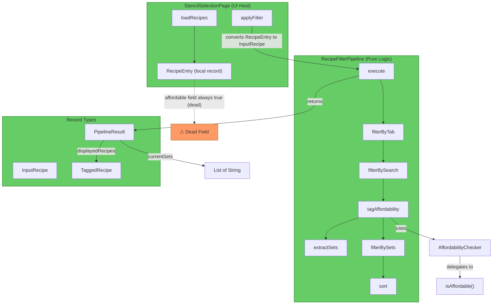
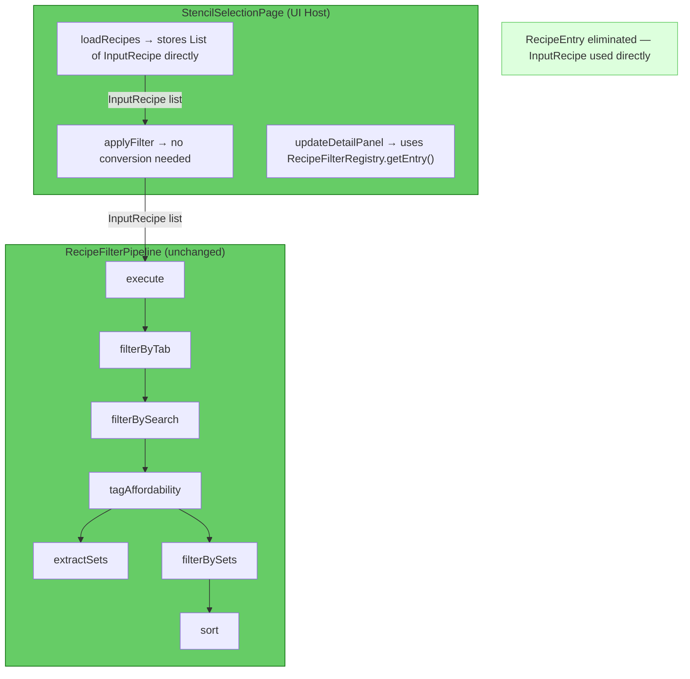

# Review: RecipeFilterPipeline Refactor

**Date:** 2026-04-29  
**Scope:** Extraction of inline filter logic from `StencilSelectionPage` into a standalone `RecipeFilterPipeline` class  
**Files reviewed:**
- [src/main/java/com/UnobstructedThirdPerson/placeblock/ui/RecipeFilterPipeline.java](../src/main/java/com/UnobstructedThirdPerson/placeblock/ui/RecipeFilterPipeline.java)
- [src/main/java/com/UnobstructedThirdPerson/placeblock/ui/StencilSelectionPage.java](../src/main/java/com/UnobstructedThirdPerson/placeblock/ui/StencilSelectionPage.java)
- [src/main/resources/Common/UI/Custom/Pages/StencilBook/StencilBookPage.ui](../src/main/resources/Common/UI/Custom/Pages/StencilBook/StencilBookPage.ui)

---

## 1. Executive Summary

The refactor is structurally sound. The pipeline is cleanly separated from UI concerns, the record types are well-designed, and the `AffordabilityChecker` interface is a good abstraction boundary. The dominant remaining issue is **residual redundancy** — the `RecipeEntry` record in `StencilSelectionPage` carries a dead `affordable` field and duplicates `InputRecipe`'s structure, creating an unnecessary conversion step. There are no correctness blockers, but one subtle logic gap in the uncategorized × set-filter interaction warrants verification.

---

## 2. Current Architecture Diagram

---

## 3. Findings Table

| # | Category | Severity | Location | Detail |
|---|----------|----------|----------|--------|
| 1 | Redundancy | 🟡 Should Fix | [StencilSelectionPage.java](../src/main/java/com/UnobstructedThirdPerson/placeblock/ui/StencilSelectionPage.java#L485-L486) | `RecipeEntry.affordable` is hardcoded to `true` at construction (L80) and never read. Affordability is now computed by the pipeline's `TaggedRecipe`. The field is dead weight. |
| 2 | Redundancy | 🟡 Should Fix | [StencilSelectionPage.java](../src/main/java/com/UnobstructedThirdPerson/placeblock/ui/StencilSelectionPage.java#L108-L116) | `applyFilter()` converts `List<RecipeEntry>` → `List<InputRecipe>` via a loop every invocation. `RecipeEntry` and `InputRecipe` have identical fields (minus `affordable`). The conversion is pure overhead — `allRecipes` could store `InputRecipe` directly. |
| 3 | Redundancy | 🔵 Review | [RecipeFilterPipeline.java](../src/main/java/com/UnobstructedThirdPerson/placeblock/ui/RecipeFilterPipeline.java#L35) / [StencilSelectionPage.java](../src/main/java/com/UnobstructedThirdPerson/placeblock/ui/StencilSelectionPage.java#L43) | `ALL_TAB = "All"` is defined in both classes. Minor duplication — the pipeline owns this constant; the page should reference it or the UI template value. |
| 4 | Correctness | 🟠 QA | [RecipeFilterPipeline.java](../src/main/java/com/UnobstructedThirdPerson/placeblock/ui/RecipeFilterPipeline.java#L148-L151) | When set filters are active AND `showUncategorized=true`, uncategorized recipes are excluded by `filterBySets` (stage 5) *before* the `showUncategorized` guard (which only prevents *removal*). The toggle has no effect when any set filter is selected. Verify this is intentional. |
| 5 | Anti-pattern | 🔵 Review | [RecipeFilterPipeline.java](../src/main/java/com/UnobstructedThirdPerson/placeblock/ui/RecipeFilterPipeline.java#L149-L151) | `setFiltered.removeIf(...)` mutates the list returned by `filterBySets` in-place. Every other stage creates a new list. Inconsistent with the pipeline's functional style. Works correctly because `filterBySets` returns `new ArrayList<>`, but fragile if that implementation changes. |
| 6 | Testability | 🟡 Should Fix | (missing file) | No test class exists for `RecipeFilterPipeline`. The pipeline stages are package-private and independently testable. The `AffordabilityChecker` is a `@FunctionalInterface` and trivially mockable. This is the highest-value test target in the system — all filtering logic in one pure-function class. |
| 7 | Architecture | 🔵 Review | [StencilSelectionPage.java](../src/main/java/com/UnobstructedThirdPerson/placeblock/ui/StencilSelectionPage.java#L362-L404) | `updateDetailPanel()` still depends on `findEntry()` which searches `allRecipes` (the `RecipeEntry` list) by `recipeId`. After the pipeline returns `TaggedRecipe`s, the detail panel needs to look up ingredient data from `RecipeFilterRegistry` anyway. The `RecipeEntry` intermediary adds no value here — `findEntry` could search `RecipeFilterRegistry` directly. |
| 8 | Architecture | 🔵 Review | [StencilSelectionPage.java](../src/main/java/com/UnobstructedThirdPerson/placeblock/ui/StencilSelectionPage.java#L449-L483) | `isAffordable()` is defined on `StencilSelectionPage` and passed as a lambda to the pipeline. This is correctly on the UI side (it needs `CombinedItemContainer`), but it could be extracted to a named class implementing `AffordabilityChecker` if it grows more complex or needs reuse. Current form is fine. |
| 9 | Integration | ✅ | [StencilSelectionPage.java](../src/main/java/com/UnobstructedThirdPerson/placeblock/ui/StencilSelectionPage.java#L130-L139) | Toggle button pattern (`Activating` + `FILTER_ACTIVE`/`FILTER_INACTIVE` style swap) matches the existing set filter pattern. Consistent. |
| 10 | Integration | ✅ | [StencilSelectionPage.java](../src/main/java/com/UnobstructedThirdPerson/placeblock/ui/StencilSelectionPage.java#L488-L509) | `EventPayload` codec is clean — no leftover `@CraftableFilter` keys. All `CraftableFilter` references are fully removed from the codebase. |
| 11 | Integration | ✅ | [StencilBookPage.ui](../src/main/resources/Common/UI/Custom/Pages/StencilBook/StencilBookPage.ui#L112-L127) | `#AffordableToggle` and `#UncategorizedToggle` are properly placed in the sidebar, use the same `TextButton` pattern as set filters, and have matching style references. |

---

## 4. Target Architecture Diagram

**Changes from current:**
- `RecipeEntry` record eliminated; `allRecipes` stores `InputRecipe` directly
- `applyFilter()` conversion loop removed
- `updateDetailPanel()` resolves ingredient data from `RecipeFilterRegistry.getEntry()` instead of `findEntry()`
- `ALL_TAB` constant referenced from pipeline only

---

## 5. Migration Notes

- **Delete:** `RecipeEntry` private record from `StencilSelectionPage` (L485-486)
- **Delete:** `findEntry()` method from `StencilSelectionPage` (L443-446) — replace with `RecipeFilterRegistry.getEntry(recipeId)`
- **Consolidate:** `allRecipes` field type from `List<RecipeEntry>` to `List<RecipeFilterPipeline.InputRecipe>` — eliminates conversion loop in `applyFilter()`
- **Consolidate:** `ALL_TAB` constant — remove from `StencilSelectionPage`, expose from `RecipeFilterPipeline` (or share via a constants class)
- **Fix (if intentional skip):** Uncategorized × set-filter interaction (finding #4) — if the toggle should work even with set filters active, move the `removeIf` to run *inside* `filterBySets` or add uncategorized recipes back after set filtering when the toggle is on
- **Fix:** Replace `removeIf` mutation with a filtered copy for pipeline consistency (finding #5)
- **Add:** `RecipeFilterPipelineTest` — test each stage independently with mock `AffordabilityChecker`; cover edge cases: empty input, null search, null checker, empty set filters, all-uncategorized input

---

→ @Engineer implement migration from docs/review-recipe-filter-pipeline.md  
→ @Architect if finding #4 (uncategorized × set-filter interaction) requires a design decision
