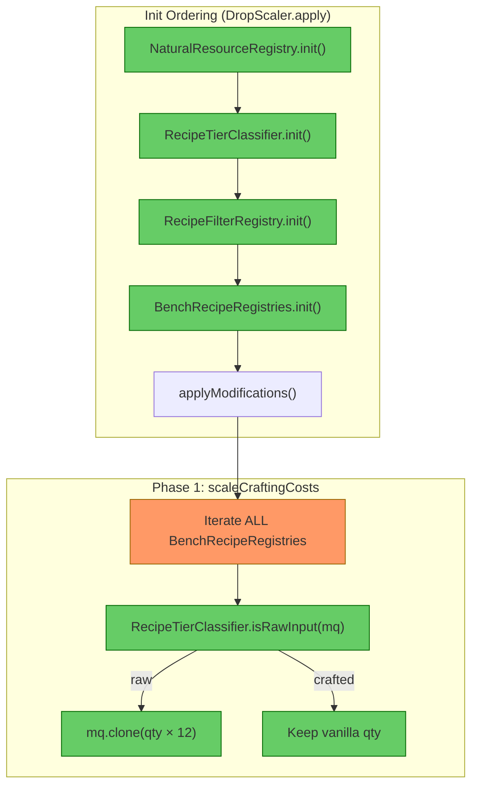
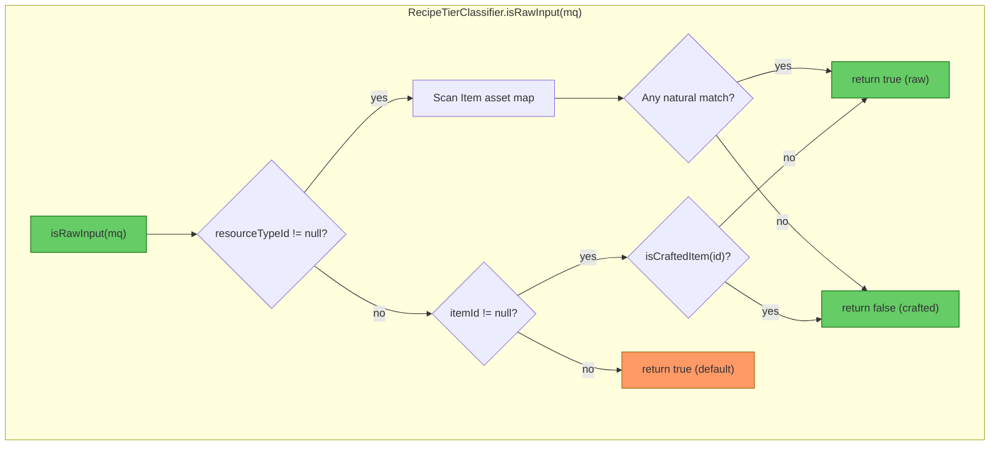

# Review: RecipeTierClassifier & Phase 1 scaleCraftingCosts

**Date:** 2026-05-19  
**Scope:** `RecipeTierClassifier` (new), `DropScaler.scaleCraftingCosts` (modified), `RecipeTierClassifierTest` (new)  
**Depth:** Standard — full findings table + diagrams

---

## 1. Executive Summary

The `RecipeTierClassifier` is a well-structured addition that follows the established static-registry pattern (`NaturalResourceRegistry`, `ResourceTypeResolver`). Architecture quality and encapsulation are strong. The primary concern is a **double-scaling bug** in `scaleCraftingCosts`: it iterates all `BenchRecipeRegistry` instances, and a recipe with dual bench requirements (which the system explicitly supports via `BUILDERS_AND_FURNITURE`) would be scaled twice — resulting in 144× instead of 12×. The test suite is thorough for classification logic but does not cover this integration scenario.

---

## 2. Current Architecture Diagram



The orange node highlights the double-scaling risk: iterating all registries without deduplication.

---

## 3. Findings Table

| # | Category | Severity | Location | Detail |
|---|----------|----------|----------|--------|
| 1 | Anti-pattern | 🟡 Should Fix | [DropScaler.java](src/main/java/com/CodeCreature/scaling/DropScaler.java#L160-L196) | **Double-scaling on dual-bench recipes.** `scaleCraftingCosts` iterates `BenchRecipeRegistries.getAllRegistries()` in a nested loop. `RecipeFilterRegistry` explicitly documents that "a single recipe may appear in multiple bench lists" (line 214). A recipe with both `Builders` and `Furniture_Bench` requirements is the **same `CraftingRecipe` object** in both registries. First pass: `qty × 12`. Second pass reads the already-mutated inputs and scales again: `(qty × 12) × 12 = qty × 144`. The `BUILDERS_AND_FURNITURE` enum constant proves this path exists in the system. Fix: track scaled recipe IDs in a `Set<String>` and skip already-processed recipes, or iterate `RecipeFilterRegistry.getAllEntries()` directly (each recipe appears once there). |
| 2 | Scalability | 🔵 Review | [RecipeTierClassifier.java](src/main/java/com/CodeCreature/scaling/RecipeTierClassifier.java#L87-L99) | **`isRawInput` full asset map scan for ResourceTypeId.** Scans every item in `Item.getAssetMap()` to find matches. Acceptable at load time (runs once per recipe input), but if recipe counts grow significantly or this method is called at runtime, it should be replaced with a pre-built `resourceTypeId → Set<itemId>` index. No action needed now. |
| 3 | Scalability | 🔵 Review | [RecipeTierClassifier.java](src/main/java/com/CodeCreature/scaling/RecipeTierClassifier.java#L88-L95) | **Mixed `Arrays.stream()` and imperative loop.** The outer item loop is imperative, but the resource type match uses `Arrays.stream().anyMatch()`. This allocates a stream per item per ResourceTypeId input. Consistent with `ResourceTypeResolver` patterns, so not a deviation, but worth noting for future optimization if profiling shows load-time regression. |
| 4 | Anti-pattern | 🟠 QA | [RecipeTierClassifier.java](src/main/java/com/CodeCreature/scaling/RecipeTierClassifier.java#L101-L107) | **Asymmetric default behavior between input types.** ResourceTypeId with zero matches → `return false` (not scaled). Direct itemId not in crafted set → `return true` (scaled). Tag-only input → `return true` (scaled). The asymmetry is arguably correct (unknown itemId should be conservatively scaled; unresolvable ResourceTypeId shouldn't), but it's undocumented in the Javadoc and could surprise future maintainers. Verify with QA that a ResourceTypeId matching no items should NOT be scaled. |
| 5 | Anti-pattern | 🟠 QA | [RecipeTierClassifier.java](src/main/java/com/CodeCreature/scaling/RecipeTierClassifier.java#L28) | **Non-volatile static field.** `craftedItemIds` is assigned in `init()` and read from `isCraftedItem()` / `isRawInput()`. The field is not `volatile`. This is consistent with `NaturalResourceRegistry` (same pattern), and safe given the current sequential init in `DropScaler.apply()`. However, the virtual-thread executor in Phase 3a could theoretically call `isRawInput` from a worker thread after init — verify that Phase 1 completes fully before Phase 3a starts (it does in the current code, but fragile if phases are ever parallelized). |
| 6 | Redundancy | 🔵 Review | [RecipeTierClassifier.java](src/main/java/com/CodeCreature/scaling/RecipeTierClassifier.java#L44-L63) | **`init()` scans `CraftingRecipe.getAssetMap()` independently from `RecipeFilterRegistry.init()`.** Both scan the full recipe asset map with overlapping logic (null checks, Salvage prefix filtering, output extraction). RecipeTierClassifier could potentially consume `RecipeFilterRegistry.getAllEntries()` instead. However, RecipeTierClassifier covers ALL recipes (not just block-producing ones), so the scan scopes differ. This is acceptable but worth noting — if RecipeFilterRegistry's scope widens, the overlap increases. |
| 7 | — | ✅ Pass | [RecipeTierClassifier.java](src/main/java/com/CodeCreature/scaling/RecipeTierClassifier.java#L60-L61) | **Dual-identity filtering is correct.** `crafted.removeIf(NaturalResourceRegistry::isNaturalItem)` correctly removes items that are both recipe outputs AND natural drops. Init ordering (NaturalResourceRegistry first) ensures the data is available. |
| 8 | — | ✅ Pass | [RecipeTierClassifier.java](src/main/java/com/CodeCreature/scaling/RecipeTierClassifier.java) | **Architecture quality.** Follows the same patterns as `NaturalResourceRegistry`: final class, private constructor, static init/query methods, `Collections.unmodifiableSet`, logging. Properly encapsulated. |
| 9 | — | ✅ Pass | [RecipeTierClassifierTest.java](src/test/java/com/CodeCreature/scaling/RecipeTierClassifierTest.java) | **Test quality is strong.** Tests verify behavior not implementation. Good coverage: pure crafted, pure natural, dual-identity, salvage filtering, null/empty, second-tier, processing bench, ResourceTypeId variants (natural, mixed, crafted-only), tag-only, unknown items. Integration tests verify the full pipeline with mixed-input recipes. |
| 10 | Scalability | 🔵 Review | [RecipeTierClassifierTest.java](src/test/java/com/CodeCreature/scaling/RecipeTierClassifierTest.java) | **Missing test: dual-bench recipe scaling.** No test verifies that a recipe with both `Builders` and `Furniture_Bench` bench requirements is only scaled once. Adding this test would have caught Finding #1. |

---

## 4. Decision Flow: `isRawInput`



---

## 5. Migration Notes

### Must fix (Finding #1)
- **`scaleCraftingCosts` double-scaling guard.** Add a `Set<String> processedRecipeIds` and skip recipes already scaled. Alternatively, iterate `CraftingRecipe.getAssetMap()` directly (each recipe appears once) and use `RecipeTierClassifier.isRawInput` without needing the registry loop. The simplest fix:
  ```
  Set<String> scaled = new HashSet<>();
  for (BenchRecipeRegistry reg : ...) {
      for (var entry : reg.getAllRecipesById().entrySet()) {
          if (!scaled.add(entry.getKey())) continue; // skip duplicates
          ...
      }
  }
  ```
- **Add a test** for a recipe with dual bench requirements to prevent regression.

### Should verify (Findings #4, #5)
- Confirm with QA that a `ResourceTypeId` matching zero items should default to "not scaled" (current behavior).
- Verify that all callers of `isRawInput` / `isCraftedItem` run on the init thread (currently true — Phase 1 is sequential before Phase 3a parallel work).

### No action needed
- Findings #2, #3, #6, #10 are informational. No code changes required.

---

→ @Engineer implement fix for Finding #1 (double-scaling guard in `scaleCraftingCosts`) and add the dual-bench test case  
→ @Architect no new system design needed — this is a targeted guard fix
