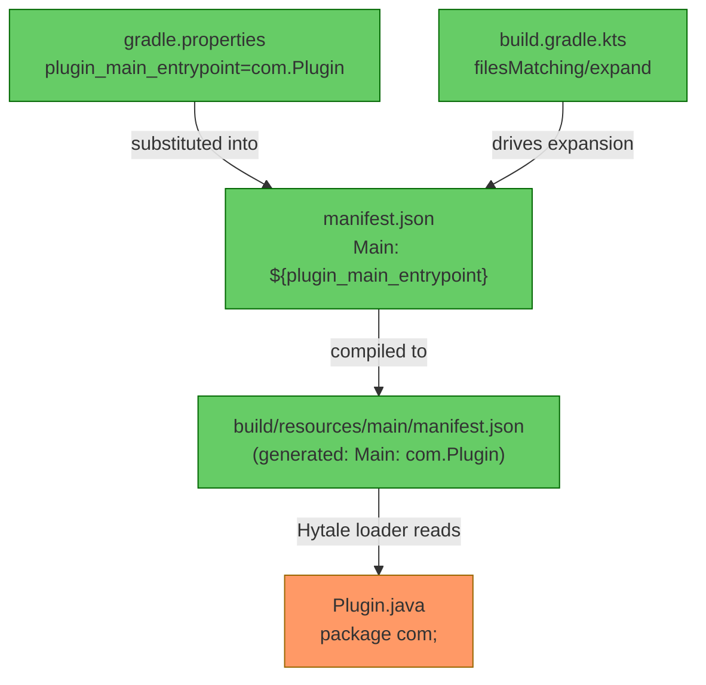
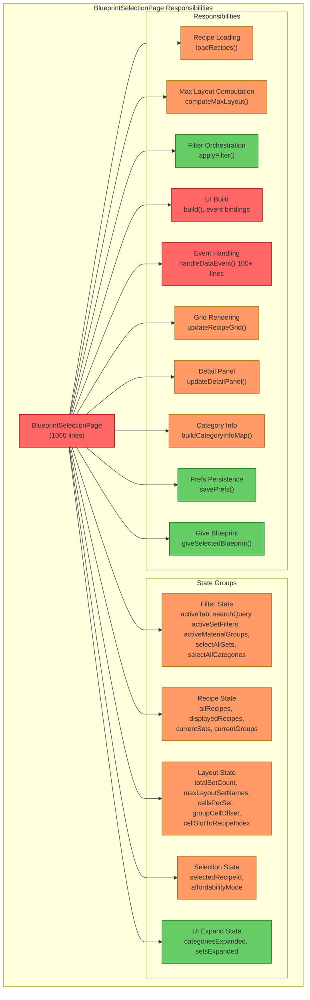
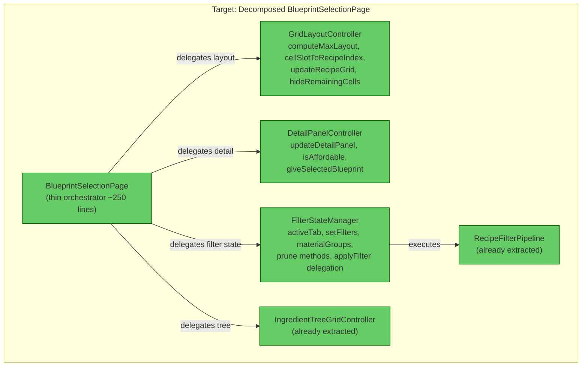

# Architecture Assessment: Finding #11 & #17 Blast Radius

**Date:** 2026-05-18  
**Scope:** Plugin.java package move + BlueprintSelectionPage decomposition  

---

## Finding #11: Plugin.java Package Move (`com.Plugin` → `com.CodeCreature.Plugin`)

### Executive Summary

This is a **trivially simple** refactor with a **binary risk profile** — it either works perfectly or the plugin fails to load entirely. The dependency graph is narrow and fully mechanical: one file move, one property change. No source code imports `com.Plugin`. The only consumer is the Hytale plugin loader via the manifest's `"Main"` field.

### Dependency Graph



### Answers to Assessment Questions

#### 1. What files reference `com.Plugin` directly?

| File | Reference Type | Line |
|------|---------------|------|
| [gradle.properties](../gradle.properties#L10) | Property value | `plugin_main_entrypoint=com.Plugin` |
| [build/resources/main/manifest.json](../build/resources/main/manifest.json#L19) | Generated output | `"Main": "com.Plugin"` (auto-generated, not committed) |
| [src/main/resources/manifest.json](../src/main/resources/manifest.json#L19) | Template | `"Main": "${plugin_main_entrypoint}"` (uses property substitution, no direct reference) |

**No Java source files import or reference `com.Plugin`.**  
Tests reference `"Plugin_RecipeDrop_..."` strings — these are asset/recipe ID prefixes, unrelated to the class FQN.

#### 2. Is the move purely: move file + change package + update gradle.properties?

**Yes.** The complete changeset is:

1. Move `src/main/java/com/Plugin.java` → `src/main/java/com/CodeCreature/Plugin.java`
2. Change `package com;` → `package com.CodeCreature;`
3. Remove `import com.CodeCreature.*` lines that become same-package (optional cleanup)
4. Update `gradle.properties`: `plugin_main_entrypoint=com.CodeCreature.Plugin`

That's it. The build system (`build.gradle.kts` lines 85-92) already handles manifest property substitution — no changes needed there.

#### 3. Are there runtime string-based references grep can't catch?

**Investigated and found: None.**

- `run/` directory configs (`config.json`, `permissions.json`, `bans.json`, `whitelist.json`) — no Plugin class references
- No reflection-based loading of `com.Plugin` anywhere in source
- Hytale's plugin loader uses only the `"Main"` field in `manifest.json`, which is driven by `gradle.properties`
- The class name `Plugin` is a common word but it's only used as the Hytale entrypoint FQN in one place

#### 4. What's the blast radius if this goes wrong?

**Binary failure: plugin won't load at all.** The Hytale server will log a class-not-found error at startup and the entire mod is inert. This is:
- **Immediately detectable** — server log shows the error on first startup
- **Trivially reversible** — revert the 2 file changes
- **No data corruption** — universe/player data is untouched

#### 5. Recommended approach

**Single atomic commit. No phased approach needed.**

### Assessment Summary

| Dimension | Rating |
|-----------|--------|
| **Complexity** | Simple |
| **Blast radius** | High (binary: load or don't) |
| **Recommended waves** | 1 |
| **Dependencies** | None — can be done first or last |
| **Key risk** | Typo in `gradle.properties` → plugin won't load. Validated by `./gradlew compileJava` + server startup. |

### Verification Checklist

- [ ] `./gradlew clean build` passes
- [ ] `build/resources/main/manifest.json` contains `"Main": "com.CodeCreature.Plugin"`
- [ ] Server starts and logs `[Plugin] Resource scaling active.` on player join

---

## Finding #17: BlueprintSelectionPage God Class Decomposition

### Executive Summary

`BlueprintSelectionPage` is a 1060-line class with **5 coherent state groups** and **10 distinct responsibilities**. The class is already partially decomposed (`RecipeFilterPipeline`, `IngredientTreeGridController`), but still retains layout management, detail panel rendering, event routing, and filter state coordination. The Hytale `InteractiveCustomUIPage` contract (override `build()`, `handleDataEvent()`, `onDismiss()`) constrains where seams can be cut — the page class must remain the event entry point but can delegate aggressively.

### Current Responsibility Map



### Answers to Assessment Questions

#### 1. What are the natural responsibility boundaries?

| Boundary | Lines | Methods | Cohesion |
|----------|-------|---------|----------|
| **Grid Layout Engine** | ~150 | `computeMaxLayout()`, `updateRecipeGrid()`, `hideRemainingCells()`, `buildRecipeGridBindings()` | Operates on `cellsPerSet`, `groupCellOffset`, `cellSlotToRecipeIndex`, `maxLayoutSetNames` |
| **Detail Panel** | ~100 | `updateDetailPanel()`, `isAffordable()`, `giveSelectedBlueprint()` | Operates on `selectedRecipeId`, cost rendering |
| **Filter State Coordination** | ~80 | `applyFilter()`, `pruneInvalidMaterialGroups()`, `pruneIncompatibleSetFilters()` | Operates on `activeSetFilters`, `activeMaterialGroups`, `selectAll*` |
| **Category Info Builder** | ~40 | `buildCategoryInfoMap()`, `capitalize()` | Pure function, no state dependency |
| **Event Router** | ~120 | `handleDataEvent()` | Dispatches to other responsibilities — must stay in page |
| **UI Init** | ~100 | `build()` templates + event bindings | Must stay in page (framework contract) |

#### 2. Which mutable state fields form coherent groups?

**Group A — Filter State (6 fields):**
- `activeTab`, `searchQuery`, `activeSetFilters`, `activeMaterialGroups`, `selectAllSets`, `selectAllCategories`
- These always change together in response to filter events and drive `applyFilter()`

**Group B — Layout State (7 fields):**
- `totalSetCount`, `maxLayoutSetNames`, `cellsPerSet`, `groupCellOffset`, `totalCellCount`, `cellSlotToRecipeIndex`, `setNameToGroupIndex`
- Computed once in `build()` from `computeMaxLayout()`, then used by `updateRecipeGrid()`

**Group C — Recipe/Pipeline State (5 fields):**
- `allRecipes`, `displayedRecipes`, `currentSets`, `currentGroups`, `categoryInfoMap`
- Populated by `loadRecipes()` + `applyFilter()`

**Group D — Selection State (2 fields):**
- `selectedRecipeId`, `affordabilityMode`
- Drives detail panel rendering

**Group E — UI Chrome (2 fields):**
- `categoriesExpanded`, `setsExpanded`
- Trivial toggle state, not worth extracting

#### 3. Are there clear seams that respect the `InteractiveCustomUIPage` contract?

**Yes.** The contract requires:
- `build()` — called once, sets up templates and event bindings
- `handleDataEvent()` — called per event, must produce `UICommandBuilder` updates
- `onDismiss()` — cleanup

The seam pattern is **delegation to controllers that accept `UICommandBuilder`**:

```java
// Page stays thin — routes events to controllers
@Override
public void handleDataEvent(..., EventPayload data) {
    UICommandBuilder cmd = new UICommandBuilder();
    if (data.selectedTab != null) {
        filterState.setTab(data.selectedTab);
        filterState.applyFilter(pipeline, ...);
        gridController.update(cmd, filterState.getDisplayedRecipes());
        detailController.update(cmd, filterState.getSelectedRecipe());
    }
    sendUpdate(cmd, null, false);
}
```

This pattern is already proven by `IngredientTreeGridController` which takes `UICommandBuilder` in `buildUI()` and `updateUI()`.

#### 4. What's the minimum viable decomposition?

**Extract 2 controllers (GridLayoutController + DetailPanelController) = 250 lines moved.**

This is the highest-ROI split because:
- Grid layout is the most complex logic (indirection arrays, prefix sums, set boundary detection)
- Detail panel has clear inputs (`selectedRecipeId`) and no feedback to filter state
- Both are pure "render to UICommandBuilder" — no event routing complexity

**Not worth extracting separately:**
- Filter state coordination — only ~80 lines, tightly coupled to event routing
- Category info builder — only ~40 lines, called once
- Prefs persistence — only ~20 lines, already clean

#### 5. What's the regression risk?

**Medium.** The main risk is:

1. **Event→state→render ordering** — `handleDataEvent()` follows a strict pattern: mutate state → `applyFilter()` → update UI components. If a controller misses an update call, the UI becomes stale.
2. **Shared mutable state** — `displayedRecipes` is written by `applyFilter()` and read by `updateRecipeGrid()`. Extracting grid layout requires passing this as a parameter or sharing a reference.
3. **Index coupling** — `cellSlotToRecipeIndex` maps grid slots back to `displayedRecipes` indices. This bidirectional coupling means grid layout and recipe state must be synchronized.

**Mitigation:** Keep the same call ordering in `handleDataEvent()`. Controllers should be stateless renderers that accept current state as parameters, not maintain their own copies.

### Target Architecture



### Assessment Summary

| Dimension | Rating |
|-----------|--------|
| **Complexity** | Medium |
| **Blast radius** | Medium (UI regressions — stale panels, broken selection) |
| **Recommended waves** | 2 |
| **Dependencies** | Finding #11 should go first (trivial, unblocks clean package) |
| **Key risk** | Event→state→render ordering breaks, causing stale UI after filter changes |

### Recommended Waves

**Wave 1:** Extract `GridLayoutController`
- Move: `computeMaxLayout()`, `updateRecipeGrid()`, `hideRemainingCells()`, `buildRecipeGridBindings()`, all `cellsPerSet`/`groupCellOffset`/`cellSlotToRecipeIndex` state
- Validate: open bench, filter recipes, verify grid renders correctly in all tabs

**Wave 2:** Extract `DetailPanelController`
- Move: `updateDetailPanel()`, `isAffordable()`, `giveSelectedBlueprint()`, cost-rendering constants
- Validate: select recipes, verify cost display and give-blueprint action

**Optional Wave 3 (if desired):** Extract `FilterStateManager`
- Move: filter state fields + `applyFilter()` + prune methods
- Lower ROI — consider only if the class is still too large after waves 1-2

---

## Overall Sequencing Recommendation

| Order | Finding | Effort | Reason |
|-------|---------|--------|--------|
| 1 | #11 — Plugin.java move | 5 min | Zero coupling, atomic, validates build pipeline |
| 2 | #17 Wave 1 — GridLayoutController | 1-2 hrs | Largest complexity extraction |
| 3 | #17 Wave 2 — DetailPanelController | 30 min | Clean separation, low risk |

---

→ @Engineer implement Finding #11 as a single atomic commit  
→ @Engineer implement Finding #17 Wave 1 (GridLayoutController extraction) after #11 is verified
