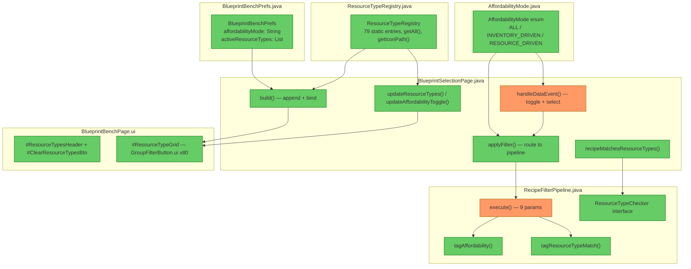

# Review: Resource Type Input Filter

**Reviewed:** 2026-05-06
**Design doc:** [design-resource-type-filter.md](design-resource-type-filter.md)
**Contract:** [blueprint-bench-filters.md](product/contracts/blueprint-bench-filters.md)

---

## 1. Executive Summary

The Resource Type Input Filter is architecturally sound. It correctly follows the existing build/bind/update pattern, maintains clean responsibility boundaries between UI (`BlueprintSelectionPage`), data (`ResourceTypeRegistry`, `AffordabilityMode`), pipeline (`RecipeFilterPipeline`), and persistence (`BlueprintBenchPrefs`). The highest-impact issues are an **uncaught `NumberFormatException`** in the `ResourceType:idx:` event handler and a **missing mode gate** in the `ToggleResourceTypes` handler that allows the grid to be shown in non-RESOURCE_DRIVEN modes.

## 2. Architecture Diagram

**Color key:** 🟢 Healthy — 🟠 Has finding(s)

---

## 3. Findings Table

| # | Category | Severity | Location | Description | Suggestion |
|---|----------|----------|----------|-------------|------------|
| 1 | Edge Case | 🔴 **High** | [BlueprintSelectionPage.java](../src/main/java/com/UnobstructedThirdPerson/placeblock/ui/BlueprintSelectionPage.java#L591) | `Integer.parseInt()` called without try-catch on `ResourceType:idx:` payload. Every other `idx:` handler (`SetFilter:idx:` at L461, `MaterialGroup:idx:` at L500, `RecipeSelect:idx:` at L610) wraps the parse in try-catch. A malformed event payload would throw an unhandled `NumberFormatException`, crashing the event handler mid-execution. | Wrap in try-catch with `idx = -1` fallback, matching the pattern at L500: `try { idx = Integer.parseInt(...); } catch (NumberFormatException ignored) {}` |
| 2 | Anti-Pattern | 🟡 **Should Fix** | [BlueprintSelectionPage.java](../src/main/java/com/UnobstructedThirdPerson/placeblock/ui/BlueprintSelectionPage.java#L575-L578) | `ToggleResourceTypes` handler sets `#ResourceTypeGrid.Visible` to `resourceTypesExpanded` without gating by affordability mode. The `build()` method at L375 correctly uses `resourceTypesExpanded && affordabilityMode == AffordabilityMode.RESOURCE_DRIVEN`. The `ToggleAffordable` handler at L550 also correctly gates. This allows the player to expand the resource type grid in ALL or INVENTORY_DRIVEN modes by clicking the section header. | Change L577 to: `cmd.set("#ResourceTypeGrid.Visible", resourceTypesExpanded && affordabilityMode == AffordabilityMode.RESOURCE_DRIVEN);` |
| 3 | Architecture | 🟡 **Should Fix** | [BlueprintSelectionPage.java](../src/main/java/com/UnobstructedThirdPerson/placeblock/ui/BlueprintSelectionPage.java#L582-L589) | `ResourceType:All` and `ResourceType:idx:` handlers don't call `pruneInvalidMaterialGroups()` or `updateMaterialGroups()`. When resource type filtering changes the visible recipe set, the category bar could show stale groups. The `ToggleAffordable` handler (L547-548) correctly calls both after `applyFilter()`. The `SearchQuery` handler (L531) also calls `pruneInvalidMaterialGroups()`. | Add `pruneInvalidMaterialGroups()` after `applyFilter()` and `updateMaterialGroups(cmd)` to the update sequence in both handlers. |
| 4 | Architecture | 🔵 **Review** | [RecipeFilterPipeline.java](../src/main/java/com/UnobstructedThirdPerson/placeblock/ui/RecipeFilterPipeline.java#L55-L65) | `TaggedRecipe.affordable` is semantically overloaded — means "player can afford" in INVENTORY_DRIVEN mode but "matches resource type" in RESOURCE_DRIVEN mode. The design doc acknowledges this as intentional, and downstream consumers (`updateRecipeGrid` → `#CellDim.Visible`) work correctly with either meaning. However, a future reader may misinterpret the field name. | Acceptable for now. If more filter modes are added, consider renaming to `matchesFilter` or adding a `filterMatchReason` field. |
| 5 | Architecture | 🔵 **Review** | [BlueprintBenchPage.ui](../src/main/resources/Common/UI/Custom/Pages/BlueprintBench/BlueprintBenchPage.ui#L286-L293) | The scrollable parent group containing `#ResourceTypeGrid` has `Visible: false` but no element ID. Code addresses `#ResourceTypeGrid` (the inner group), not the parent. This differs from `#SetFilters` and `#MaterialGroups` which are directly on their scrollable containers. If the framework respects parent visibility, the grid may never display; if it doesn't, the pattern is functionally fine but structurally inconsistent with other sections. | Verify runtime behavior. If the parent visibility gates children, add an ID to the scrollable group and control it directly (matching the `#SetFilters` pattern). |
| 6 | Redundancy | 🔵 **Review** | [ResourceTypeRegistry.java](../src/main/java/com/UnobstructedThirdPerson/placeblock/ui/ResourceTypeRegistry.java#L107-L114) | `getIconPath()` performs a linear scan over 79 entries. Not a performance issue at this scale, but a `Map<String, String>` would be O(1). | No action needed unless the registry grows significantly or `getIconPath()` is called in a hot loop. |

---

## 4. Contract Compliance

Verified against [blueprint-bench-filters.md](product/contracts/blueprint-bench-filters.md):

| Contract Rule | Status | Evidence |
|---------------|--------|----------|
| Resource type selections IGNORED in ALL / INVENTORY_DRIVEN modes | ✅ | `applyFilter()` only creates `resourceTypeChecker` in RESOURCE_DRIVEN case (L220-225). Pipeline receives null checker in other modes. |
| No selection = all recipes pass | ✅ | RESOURCE_DRIVEN with empty `activeResourceTypes`: both `checker` and `resourceTypeChecker` remain null, `affordableOnly` stays false (L226). All recipes tagged affordable=true. |
| Set visible if ≥1 recipe matches ANY selected type | ✅ | `affordableOnly=true` feeds `filterByAffordability()` into `extractSets()`, hiding sets with zero matches. Pipeline L207-209. |
| Non-matching items dimmed but visible within visible sets | ✅ | Pipeline uses `tagged` (not `affordableBase`) for `filterByMaterialGroups()` and downstream, so non-matching recipes reach the display list with `affordable=false`. Grid dims via `#CellDim.Visible` = `!entry.affordable()` at L737. |
| Loose OR across selected types | ✅ | `recipeMatchesResourceTypes()` returns true on first matching input (L898-901). Any single type match is sufficient. |
| Toggle cycles correctly | ✅ | Enum ordinal cycle ALL→INVENTORY_DRIVEN→RESOURCE_DRIVEN→ALL matches contract. Tests confirm full cycle. |
| Anti-pattern: dimming affects sidebar | ✅ Not present | Sets are either visible or hidden. No dimmed sets in sidebar. |
| Anti-pattern: search changes set visibility | ✅ Not present | Search narrows grid contents only. Sets extracted pre-search. |

---

## 5. Positive Observations

- **Pattern consistency:** `buildResourceTypeBindings()` / `updateResourceTypes()` are structural mirrors of `buildMaterialGroupBindings()` / `updateMaterialGroups()`. Same selector patterns, same loop structure, same visibility toggling. Easy to maintain as a pair.
- **Clean enum design:** `AffordabilityMode` is self-contained with `next()`, `label()`, and `fromString()`. Migration from legacy boolean is handled in one place. No leakage into other classes.
- **Pipeline integration:** `ResourceTypeChecker` as a `@FunctionalInterface` mirrors `AffordabilityChecker` exactly. The pipeline routes between `tagAffordability()` and `tagResourceTypeMatch()` based on which checker is provided — no mode enum leaking into the pipeline.
- **Prefs round-trip:** `BlueprintBenchPrefs` CODEC handles both new fields (`activeResourceTypes`, `resourceTypesExpanded`, `affordabilityMode`) and legacy migration (`AffordabilityEnabled` boolean → mode string).
- **Test coverage:** `AffordabilityModeTest` covers full cycling, all labels, all parse paths including null, legacy booleans, and unknown strings. `ResourceTypeRegistryTest` validates count, order, immutability, entry integrity, and null handling.

---

## 6. Overall Assessment

**NEEDS WORK** — Two findings require fixes before this is production-ready:

1. **Finding #1** (uncaught exception) — crash risk on malformed event data. One-line fix.
2. **Finding #2** (mode gate) — allows resource type grid to display in wrong modes. One-line fix.
3. **Finding #3** (stale material groups) — functional gap when resource type selection narrows visible recipes. Two-line addition to each handler.

All three fixes are mechanical and low-risk. The architecture, contract compliance, and test coverage are strong.

→ **@Engineer** implement fixes for findings #1, #2, #3 from this review
→ **@Architect** no new design needed — all fixes are within existing patterns
