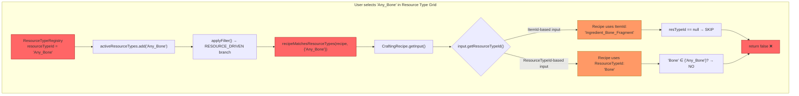
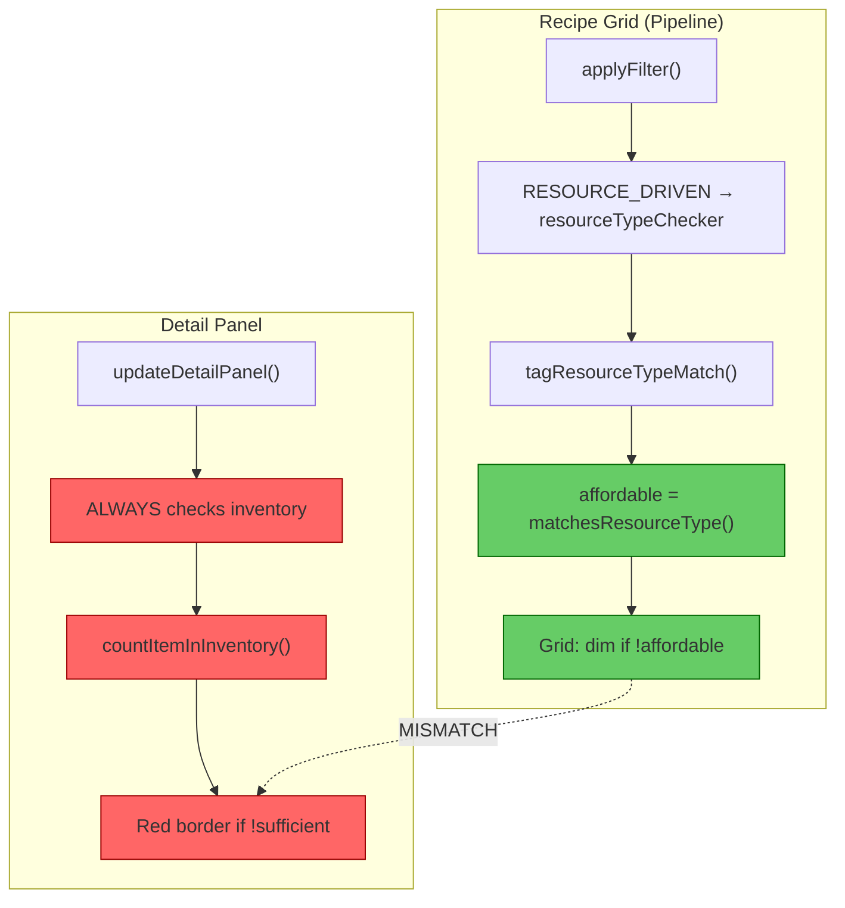
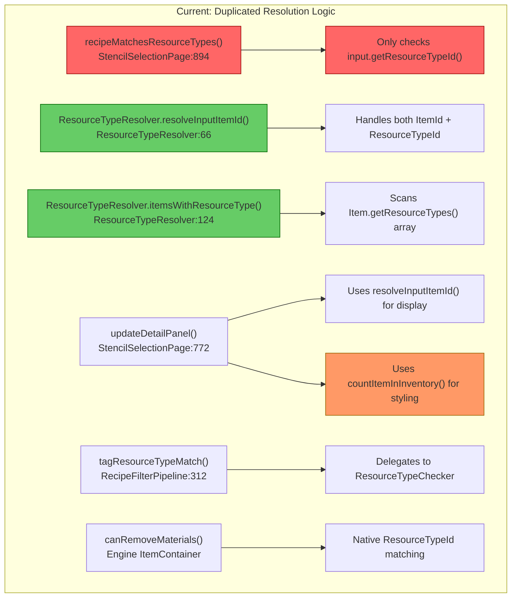
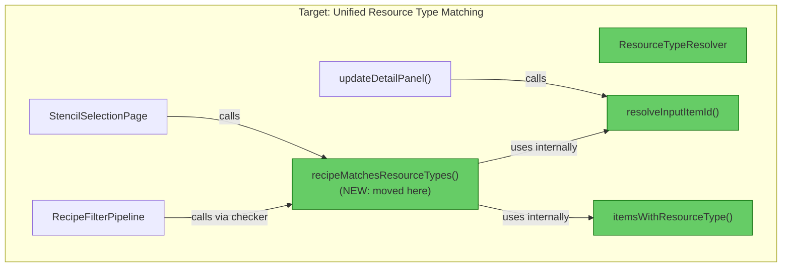

# Review: Resource Type Filter — Bug Root Cause Analysis

## 1. Executive Summary

The Resource Type Input Filter has **three interconnected bugs** stemming from two root causes: (1) `recipeMatchesResourceTypes()` implements an incomplete matching algorithm that ignores ItemId-based recipe inputs and uses wrong ResourceTypeId values from a misbuilt registry, and (2) `updateDetailPanel()` unconditionally applies inventory-based affordability styling regardless of the active affordability mode. The highest-impact fix is rewriting `recipeMatchesResourceTypes()` to use `ResourceTypeResolver`'s existing item-resolution logic, which already handles both `ItemId` and `ResourceTypeId` inputs correctly.

---

## 2. Current Architecture Diagram



---

## 3. Findings Table

| # | Category | Severity | Location | Detail |
|---|----------|----------|----------|--------|
| 1a | Logic Error | 🔴 Blocked | [StencilSelectionPage.java](src/main/java/com/UnobstructedThirdPerson/placeblock/ui/StencilSelectionPage.java#L894-L912) | `recipeMatchesResourceTypes()` only checks `input.getResourceTypeId()`. Recipes whose inputs use `ItemId` (e.g., `Deco_Bone_Skulls_Wall` uses `ItemId: "Ingredient_Bone_Fragment"`) are silently skipped because `getResourceTypeId()` returns null for those inputs. The function never resolves the ItemId to its item definition to check `Item.getResourceTypes()`. |
| 1b | Contract Violation | 🔴 Blocked | [ResourceTypeRegistry.java](src/main/java/com/UnobstructedThirdPerson/placeblock/ui/ResourceTypeRegistry.java#L51) | The registry entry `"Any_Bone"` was derived from the **icon filename** (`Any_Bone.png`), not from the actual engine ResourceTypeId. The engine's resource type definition is [`Bone.json`](docs/Reference%20Assets/Assets/Server/Item/ResourceTypes/Bone.json) — the ResourceTypeId is `"Bone"`, and `Any_Bone.png` is merely its icon. Selecting "Any_Bone" in the UI adds `"Any_Bone"` to `activeResourceTypes`, but no recipe input or item declaration uses that string. Both `"Bone"` (index 9) and `"Any_Bone"` (index 0) exist as separate registry entries, making the generic entry permanently non-functional. |
| 2 | Architecture | 🟡 Should Fix | [StencilSelectionPage.java](src/main/java/com/UnobstructedThirdPerson/placeblock/ui/StencilSelectionPage.java#L772-L842) | `updateDetailPanel()` unconditionally performs inventory-based affordability checks (`countItemInInventory()`, red border, red cost quantities) regardless of `affordabilityMode`. In `RESOURCE_DRIVEN` mode, the recipe grid dims items based on resource type matching (via the pipeline's `tagResourceTypeMatch`), but the detail panel shows inventory-based red/green — creating a visual contradiction where a recipe appears highlighted in the grid but "unaffordable" in the detail panel. |
| 3a | Redundancy | 🟡 Should Fix | [StencilSelectionPage.java](src/main/java/com/UnobstructedThirdPerson/placeblock/ui/StencilSelectionPage.java#L894-L912) | `recipeMatchesResourceTypes()` reimplements a partial, incorrect version of resource-type resolution that `ResourceTypeResolver` already handles correctly. The resolver handles both `ItemId` and `ResourceTypeId` inputs, applies set-root preference, and filters decorative items — none of which `recipeMatchesResourceTypes()` does. |
| 3b | Redundancy | 🟠 QA | [StencilSelectionPage.java](src/main/java/com/UnobstructedThirdPerson/placeblock/ui/StencilSelectionPage.java#L772-L810) vs [StencilSelectionPage.java](src/main/java/com/UnobstructedThirdPerson/placeblock/ui/StencilSelectionPage.java#L1062-L1080) | `updateDetailPanel()` resolves recipe inputs using `ResourceTypeResolver.resolveInputItemId()` + `NaturalResourceRegistry.resolveToGatherableForm()` for display, then checks affordability via `countItemInInventory()`. Meanwhile, `isAffordable()` uses `canRemoveMaterials()` for the same purpose but with different semantics (it also checks BlockGroup interchangeability). Two different affordability checks coexist with different logic. |
| 3c | Scalability | 🔵 Review | [ResourceTypeRegistry.java](src/main/java/com/UnobstructedThirdPerson/placeblock/ui/ResourceTypeRegistry.java#L48-L130) | The registry is a hardcoded `List.of(...)` with 79 entries derived from icon filenames rather than from the engine's `ResourceTypes/*.json` asset definitions. Adding/removing resource types requires a code change. The `"Any_*"` entries (Any_Bone, Any_Book, Any_Meat, Any_Mushroom, Any_Recipe, Any_Rock, Any_Rubble, Any_Trunk) appear to be **icon names** that the engine shares across multiple ResourceType definitions, not actual ResourceTypeId values. |

---

## 4. Detailed Root Cause Analysis

### Bug 1: Generic resource types don't match any recipes

**Two independent failures conspire to produce zero matches:**

**Failure A — ItemId inputs ignored (Finding 1a):**

The recipe for `Deco_Bone_Skulls_Wall` specifies its input as:
```json
{ "ItemId": "Ingredient_Bone_Fragment", "Quantity": 4 }
```

The current matching function at line 894:
```java
String resTypeId = input.getResourceTypeId();
if (resTypeId != null && selectedTypes.contains(resTypeId)) {
    return true;
}
```

For this recipe, `input.getResourceTypeId()` returns `null` because the input uses `ItemId`, not `ResourceTypeId`. The function never resolves `Ingredient_Bone_Fragment` to its item definition to check whether it declares `ResourceTypes: [{Id: "Bone"}]`.

Meanwhile, `ResourceTypeResolver.resolveInputItemId()` at [ResourceTypeResolver.java](src/main/java/com/UnobstructedThirdPerson/resourcecollection/ResourceTypeResolver.java#L66-L79) already handles both paths correctly — it checks `ItemId` first, then falls back to `ResourceTypeId` resolution.

**Failure B — Registry ID mismatch (Finding 1b):**

Even for recipes that DO use `ResourceTypeId` in their inputs (e.g., `Furniture_Feran_Torch` uses `ResourceTypeId: "Bone"`), selecting the "Any_Bone" entry in the UI adds `"Any_Bone"` to `activeResourceTypes`. But the recipe input's `getResourceTypeId()` returns `"Bone"` — and `"Bone" ∈ {"Any_Bone"}` evaluates to **false**.

The root cause is that `ResourceTypeRegistry` was populated from icon filenames:
- Engine file: `ResourceTypes/Bone.json` → `ResourceTypeId = "Bone"`, `Icon = "Any_Bone.png"`
- Registry entry: `resourceTypeId = "Any_Bone"` (from icon filename, NOT from actual ID)

The `"Any_*"` prefix on icons appears to be the engine's convention for indicating a generic/shared icon — e.g., `Any_Trunk.png` is shared across `Wood_Hardwood_Trunk`, `Wood_Softwood_Trunk`, `Wood_Redwood_Trunk`, etc. These are icon names, not ResourceTypeId values.

**Impact:** Selecting ANY generic resource type (Any_Bone, Any_Book, Any_Meat, Any_Mushroom, Any_Recipe, Any_Rock, Any_Rubble, Any_Trunk) in the filter grid will dim ALL recipes. The feature is completely non-functional for these entries.

---

### Bug 2: Detail panel always shows inventory affordability

**Root cause:** `updateDetailPanel()` has no awareness of `affordabilityMode`. It unconditionally:

1. Resolves ingredients via `ResourceTypeResolver.resolveInputItemId()` (lines 799-804)
2. Counts each ingredient in the player's inventory via `countItemInInventory()` (line 812)
3. Applies red styling (`COST_QTY_INSUFFICIENT`, `OUTPUT_BG_UNAFFORDABLE`) if the player doesn't have enough (lines 813-822)



In `RESOURCE_DRIVEN` mode:
- **Grid says:** "This recipe matches your selected resource type" → highlighted
- **Detail panel says:** "You don't have enough Ingredient_Bone_Fragment" → red border, red quantities

The user sees conflicting signals: the recipe looks "selected" in the grid but "unaffordable" in the detail panel.

**Impact:** Confusing UX in RESOURCE_DRIVEN mode. The detail panel always communicates inventory state even when the user is browsing by resource type, not by what they can craft.

---

### Bug 3: Reusability Analysis

#### Resolution Logic Map



#### Duplication Analysis

| Location | What it does | Input handling | Uses ResourceTypeResolver? |
|----------|-------------|----------------|---------------------------|
| `recipeMatchesResourceTypes()` | Checks if recipe inputs match selected resource types | `ResourceTypeId` only — ignores `ItemId` | ❌ No |
| `ResourceTypeResolver.resolveInputItemId()` | Resolves a `MaterialQuantity` to a concrete item ID | Both `ItemId` and `ResourceTypeId` | ✅ Is the resolver |
| `ResourceTypeResolver.itemsWithResourceType()` | Finds all items declaring a ResourceTypeId | Scans `Item.getResourceTypes()` array | ✅ Is the resolver |
| `updateDetailPanel()` | Resolves inputs for display + checks inventory | Both (via `resolveInputItemId()`) | ✅ For display only |
| `tagResourceTypeMatch()` | Pipeline tagging stage | Delegates to `ResourceTypeChecker` lambda | Indirectly (via lambda) |
| Engine `canRemoveMaterials()` | Native engine affordability check | Both `ItemId` and `ResourceTypeId` internally | N/A (engine-level) |

**Core problem:** `recipeMatchesResourceTypes()` should NOT re-implement resolution logic. It should use `ResourceTypeResolver.itemsWithResourceType()` or a new method on `ResourceTypeResolver` that answers the question: "does this recipe's input resolve to an item that declares resource type X?"

---

## 5. Target Architecture Diagram



---

## 6. Migration Notes

### Bug 1 Fix — `recipeMatchesResourceTypes()` rewrite

- **Move** the matching logic to `ResourceTypeResolver` as a new static method (e.g., `recipeMatchesAnyResourceType(CraftingRecipe, Set<String>)`)
- **For each recipe input**, check BOTH paths:
  1. If `input.getResourceTypeId()` is non-null → check if `selectedTypes.contains(resTypeId)`
  2. If `input.getItemId()` is non-null → resolve to `Item`, check if any entry in `Item.getResourceTypes()` has an ID in `selectedTypes`
- **Delete** the local `recipeMatchesResourceTypes()` from `StencilSelectionPage`; replace the lambda at line 220 with a call to the new `ResourceTypeResolver` method

### Bug 1 Fix — `ResourceTypeRegistry` ID correction

- **Fix** the 8 `"Any_*"` entries whose `resourceTypeId` is derived from icon filenames instead of actual engine ResourceTypeId values:
  - `"Any_Bone"` → `"Bone"` (entry already exists at index 9 — **delete** the `Any_Bone` entry entirely, or repurpose it as a "group all bone subtypes" meta-filter if that concept is desired)
  - `"Any_Book"` → `"Books"` (entry already exists at index 10)
  - `"Any_Meat"` → determine actual ResourceTypeId from engine assets
  - `"Any_Mushroom"` → determine actual ResourceTypeId
  - `"Any_Recipe"` → determine actual ResourceTypeId
  - `"Any_Rock"` → `"Rock"` (entry already exists at index 31)
  - `"Any_Rubble"` → `"Rubble"` (entry already exists at index 67)
  - `"Any_Trunk"` → `"Wood_Trunk"` (entry already exists at index 77)
- **Consider** building the registry dynamically from `ResourceTypes/*.json` asset files at init time instead of hardcoding

### Bug 2 Fix — `updateDetailPanel()` mode awareness

- **Add** an `affordabilityMode` check to `updateDetailPanel()`
- In `RESOURCE_DRIVEN` mode: skip inventory quantity checks, show neutral styling (no red borders/quantities), or show resource-type-match state instead
- In `ALL` mode: skip affordability styling entirely (no dim/red)
- In `INVENTORY_DRIVEN` mode: keep current behavior (inventory-based red/green)

### Reusability consolidation

- **All** resource-type-to-recipe matching should flow through `ResourceTypeResolver`
- **The pipeline's** `ResourceTypeChecker` functional interface is correct as an abstraction — the lambda just needs to call the correct resolver method
- **`updateDetailPanel()`** already uses `ResourceTypeResolver.resolveInputItemId()` for display — no change needed for the resolution path, only for the affordability styling path

---

## 7. Severity Summary

| Bug | Severity | Blocking? | Effort |
|-----|----------|-----------|--------|
| Bug 1a (ItemId inputs ignored) | 🔴 Blocked | Yes — feature non-functional for majority of recipes | Small — rewrite one method |
| Bug 1b (Registry ID mismatch) | 🔴 Blocked | Yes — 8 of 79 entries permanently broken | Small — fix registry data |
| Bug 2 (Detail panel mismatch) | 🟡 Should Fix | No — cosmetic/UX only | Small — add mode branch |
| Bug 3 (Duplication) | 🟡 Should Fix | No — code health | Medium — extract to resolver |

---

→ @Engineer implement migration from docs/review-resource-type-matching-bugs.md
→ @Architect if the `"Any_*"` entries should become meta-filters that match multiple ResourceTypeIds (e.g., "Any_Bone" matches both "Bone" and all bone subtypes), that requires a new design decision before implementation
