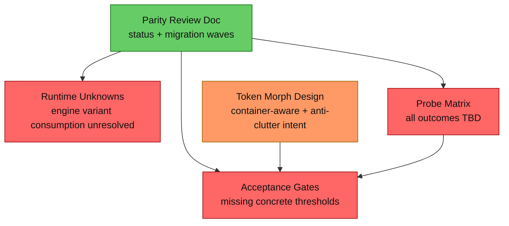
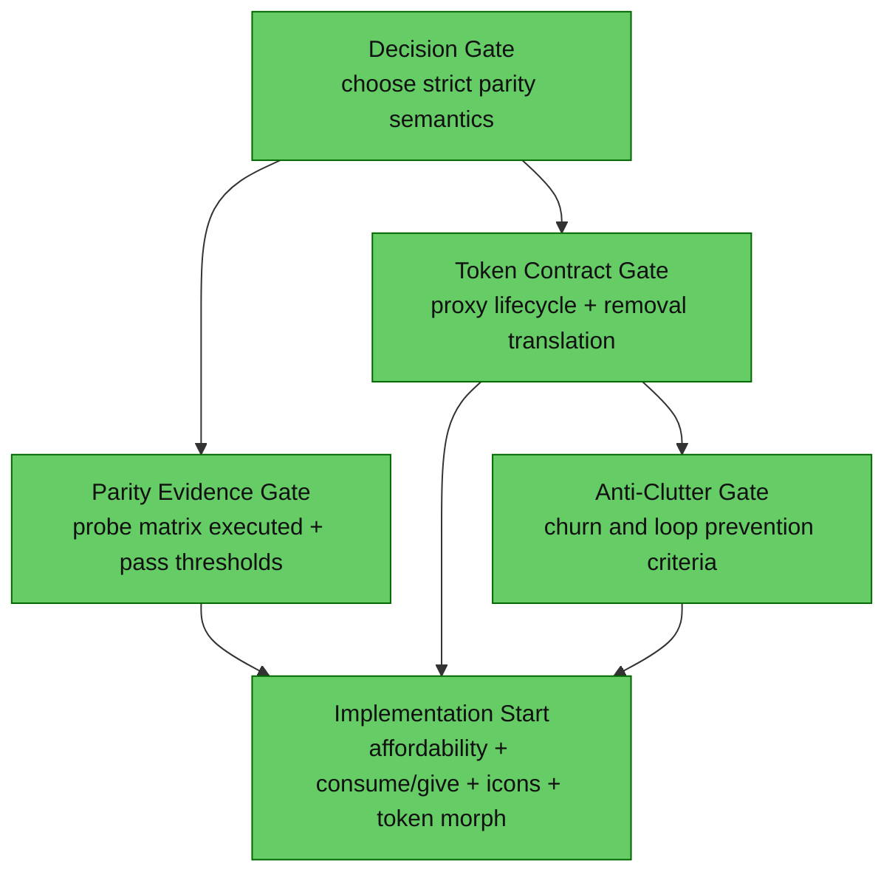

# 1. Executive Summary
The design is not implementation-ready for strict parity delivery yet. The dominant gap is unresolved behavioral parity at consumption boundaries: the design itself states parity is provisional, runtime proof is outstanding, and the probe matrix is still unexecuted. The highest-impact change is to convert parity unknowns and token-morph behavior into explicit acceptance gates with pass/fail thresholds before any implementation wave starts.

# 2. Current Architecture Diagram

# 3. Findings Table
| # | Category | Severity | Location | Detail |
|---|---|---|---|---|
| 1 | Anti-pattern | 🔴 Blocked | [docs/review-resource-typeid-parity.md#L2](docs/review-resource-typeid-parity.md#L2), [docs/review-resource-typeid-parity.md#L85](docs/review-resource-typeid-parity.md#L85), [docs/review-resource-typeid-parity.md#L104](docs/review-resource-typeid-parity.md#L104) | Strict parity is claimed as target but core consumption behavior is explicitly unknown and parity proof is explicitly outstanding. This is a hard implementation gate for parity-sensitive systems (affordability and consumption/give). |
| 2 | Scalability | 🔴 Blocked | [docs/review-resource-typeid-parity.md#L185](docs/review-resource-typeid-parity.md#L185), [docs/review-resource-typeid-parity.md#L203](docs/review-resource-typeid-parity.md#L203), [docs/review-resource-typeid-parity.md#L207](docs/review-resource-typeid-parity.md#L207) | The probe matrix that should establish parity has all Observed/Parity cells as TBD, so there is no completed evidence baseline for go/no-go. |
| 3 | Over-engineering | 🟡 Should Fix | [docs/The Fractonomical System/_knowledge/_sources/Hytale/04010000_Crafting-Input-Resolution/Overview.md#L79](docs/The%20Fractonomical%20System/_knowledge/_sources/Hytale/04010000_Crafting-Input-Resolution/Overview.md#L79), [docs/The Fractonomical System/_knowledge/_sources/Hytale/04010000_Crafting-Input-Resolution/Overview.md#L80](docs/The%20Fractonomical%20System/_knowledge/_sources/Hytale/04010000_Crafting-Input-Resolution/Overview.md#L80) | A core policy fork remains open (strict engine-parity branching vs pragmatic representative display path). Without choosing one as authoritative for implementation, teams can build conflicting semantics. |
| 4 | Scalability | 🟡 Should Fix | [docs/The Fractonomical System/_knowledge/_sources/Hytale/04010000_Crafting-Input-Resolution/Overview.md#L88](docs/The%20Fractonomical%20System/_knowledge/_sources/Hytale/04010000_Crafting-Input-Resolution/Overview.md#L88), [docs/The Fractonomical System/_knowledge/_sources/Hytale/04010000_Crafting-Input-Resolution/Overview.md#L113](docs/The%20Fractonomical%20System/_knowledge/_sources/Hytale/04010000_Crafting-Input-Resolution/Overview.md#L113), [docs/The Fractonomical System/_knowledge/_sources/Hytale/04010000_Crafting-Input-Resolution/Overview.md#L123](docs/The%20Fractonomical%20System/_knowledge/_sources/Hytale/04010000_Crafting-Input-Resolution/Overview.md#L123) | Generic token items (inventory-aware morph + consumption compatibility) are described, but implementation-contract details are missing: authoritative ownership boundary, inventory event ordering guarantees, and exact removeMaterials translation contract for proxy tokens. |
| 5 | Anti-pattern | 🟡 Should Fix | [docs/The Fractonomical System/_knowledge/_sources/Hytale/04010000_Crafting-Input-Resolution/Overview.md#L115](docs/The%20Fractonomical%20System/_knowledge/_sources/Hytale/04010000_Crafting-Input-Resolution/Overview.md#L115), [docs/The Fractonomical System/_knowledge/_sources/Hytale/04010000_Crafting-Input-Resolution/Overview.md#L119](docs/The%20Fractonomical%20System/_knowledge/_sources/Hytale/04010000_Crafting-Input-Resolution/Overview.md#L119), [docs/The Fractonomical System/_knowledge/_sources/Hytale/04010000_Crafting-Input-Resolution/Overview.md#L135](docs/The%20Fractonomical%20System/_knowledge/_sources/Hytale/04010000_Crafting-Input-Resolution/Overview.md#L135), [docs/The Fractonomical System/_knowledge/_sources/Hytale/04010000_Crafting-Input-Resolution/Overview.md#L136](docs/The%20Fractonomical%20System/_knowledge/_sources/Hytale/04010000_Crafting-Input-Resolution/Overview.md#L136) | Anti-clutter intent is present but not testable yet: no explicit churn budget, no morph-cooldown/coalescing acceptance thresholds, and no loop-prevention acceptance criteria for stackability/metadata interactions. |

# 4. Target Architecture Diagram

Notes:
- Keep one authoritative semantic contract from parity through planner through remove/give.
- Treat token morphing as a first-class contract, not an additive side behavior.
- Make anti-clutter behavior measurable with hard acceptance thresholds.

# 5. Migration Notes
- What can be deleted entirely:
  - Remove provisional language as a delivery gate once probe evidence is completed and accepted.
- What should be consolidated into what:
  - Consolidate strict/parity policy choice into one explicit decision section in the parity review document and reference it from token design.
  - Consolidate token morphing, consumption translation, and anti-clutter into one acceptance table instead of distributed prose.
- What ordering constraints are eliminated:
  - Eliminates ambiguity between probe-first work and implementation waves by defining explicit go/no-go criteria.
  - Eliminates interpretation differences between affordability and consumption/give teams by pinning one parity contract.
- What runtime systems become unnecessary:
  - Ad hoc per-team interpretations of token morphing and inventory coalescing behavior become unnecessary once a single contract is published.

## Readiness Verdict
NEEDS WORK before implementation. The design is close, but not yet implementation-ready for strict parity and token anti-clutter delivery.

## What Is Already Strong
- The parity review has a concrete phased plan and explicit risk acknowledgment: [docs/review-resource-typeid-parity.md#L106](docs/review-resource-typeid-parity.md#L106).
- The probe mechanism and failure rules are already defined, which is the right validation backbone: [docs/review-resource-typeid-parity.md#L91](docs/review-resource-typeid-parity.md#L91), [docs/review-resource-typeid-parity.md#L209](docs/review-resource-typeid-parity.md#L209).
- Generic token intent is correctly framed around container-aware morphing and compatibility at consumption boundaries: [docs/The Fractonomical System/_knowledge/_sources/Hytale/04010000_Crafting-Input-Resolution/Overview.md#L89](docs/The%20Fractonomical%20System/_knowledge/_sources/Hytale/04010000_Crafting-Input-Resolution/Overview.md#L89), [docs/The Fractonomical System/_knowledge/_sources/Hytale/04010000_Crafting-Input-Resolution/Overview.md#L123](docs/The%20Fractonomical%20System/_knowledge/_sources/Hytale/04010000_Crafting-Input-Resolution/Overview.md#L123).

## Minimal Changes Needed Before Implementation Starts
- Add a parity decision record selecting one authoritative semantics path (strict branch-preserving parity or scoped pragmatic fallback), with explicit non-goals.
- Complete the Wave 1 matrix with real observations and define pass criteria (for example: 0 parity WARN cases across required recipe families).
- Add an acceptance criteria table for token items: spawn conditions, morph trigger timing, tie-break policy, failure behavior, and remove/give translation rules.
- Add anti-clutter acceptance thresholds: max morph operations per coalesced tick, no oscillation rule, and loop-prevention criteria around stackability/metadata.
- Add cross-system acceptance checks proving that affordability, consumption, give systems, and icon/presentation all use the same generic identity contract.

→ @Engineer implement migration from docs/review-resource-typeid-parity-readiness.md
→ @Architect if any finding requires a new system design
