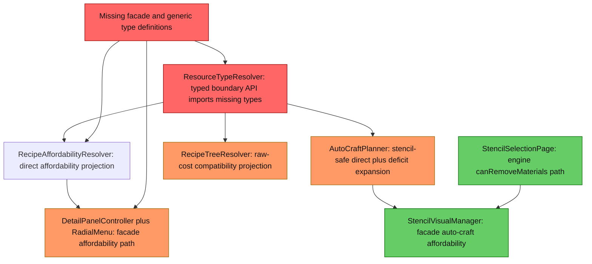
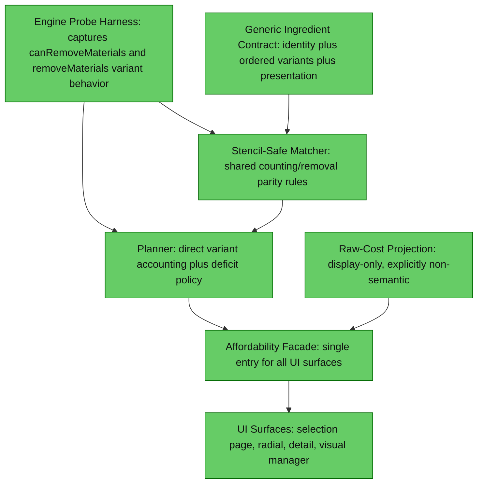

# 1. Executive Summary
The structural integration blocker has been resolved: typed generic-resolution and affordability-facade classes now exist and are wired through resolver, planner, and key UI surfaces. The remaining parity risk is behavioral: generic deficits and raw-cost projection can still collapse ambiguity to a representative concrete item before expansion, which is deterministic but not yet proven to match engine consumption semantics. The highest-impact next step is runtime evidence capture with the craft probe command, then policy alignment based on observed engine behavior.

# 2. Current Architecture Diagram

# 3. Findings Table
| # | Category | Severity | Location | Detail |
|---|---|---|---|---|
| 1 | Integration | ✅ Resolved | [src/main/java/com/CodeCreature/crafting/CraftingAffordabilityFacade.java](src/main/java/com/CodeCreature/crafting/CraftingAffordabilityFacade.java), [src/main/java/com/CodeCreature/crafting/GenericIngredientResolution.java](src/main/java/com/CodeCreature/crafting/GenericIngredientResolution.java), [src/main/java/com/CodeCreature/crafting/GenericIngredientResolver.java](src/main/java/com/CodeCreature/crafting/GenericIngredientResolver.java), [src/main/java/com/CodeCreature/crafting/IndexedGenericIngredientResolver.java](src/main/java/com/CodeCreature/crafting/IndexedGenericIngredientResolver.java), [src/main/java/com/CodeCreature/crafting/IngredientPresentation.java](src/main/java/com/CodeCreature/crafting/IngredientPresentation.java), [src/main/java/com/CodeCreature/crafting/GenericIngredientIdentity.java](src/main/java/com/CodeCreature/crafting/GenericIngredientIdentity.java) | Previously-missing typed boundary classes now exist and are wired. Resolver/facade tests pass for generic variant affordability and presentation. |
| 2 | Anti-pattern | 🟡 Should Fix | [src/main/java/com/CodeCreature/crafting/AutoCraftPlanner.java#L271](src/main/java/com/CodeCreature/crafting/AutoCraftPlanner.java#L271), [src/main/java/com/CodeCreature/crafting/AutoCraftPlanner.java#L286](src/main/java/com/CodeCreature/crafting/AutoCraftPlanner.java#L286) | Generic ingredient deficit expansion collapses ambiguity to one compatibility item before crafted-item checks and raw-cost recursion. This can diverge from strict engine parity whenever multiple variants with different craftability or raw trees satisfy the same ResourceTypeId. |
| 3 | Consistency | ✅ Resolved | [src/main/java/com/CodeCreature/crafting/RecipeAffordabilityResolver.java#L322](src/main/java/com/CodeCreature/crafting/RecipeAffordabilityResolver.java#L322), [src/main/java/com/CodeCreature/crafting/AutoCraftPlanner.java#L331](src/main/java/com/CodeCreature/crafting/AutoCraftPlanner.java#L331) | Direct concrete affordability counts now exclude stencil-tagged stacks, aligned with planner execution semantics. |
| 4 | Consolidation | ✅ Resolved | [src/main/java/com/CodeCreature/ui/bench/StencilSelectionPage.java#L1322](src/main/java/com/CodeCreature/ui/bench/StencilSelectionPage.java#L1322), [src/main/java/com/CodeCreature/ui/radial/StencilRadialMenuPage.java#L401](src/main/java/com/CodeCreature/ui/radial/StencilRadialMenuPage.java#L401), [src/main/java/com/CodeCreature/stencil/StencilVisualManager.java#L285](src/main/java/com/CodeCreature/stencil/StencilVisualManager.java#L285) | Bench selection, radial/detail, and visual manager affordability routes now rely on facade/planner generic-aware checks instead of mixed ad hoc checks. |
| 5 | Over-engineering | 🟠 QA | [src/main/java/com/CodeCreature/crafting/RecipeTreeResolver.java#L203](src/main/java/com/CodeCreature/crafting/RecipeTreeResolver.java#L203), [src/main/java/com/CodeCreature/crafting/RecipeTreeResolver.java#L336](src/main/java/com/CodeCreature/crafting/RecipeTreeResolver.java#L336), [src/main/java/com/CodeCreature/crafting/RecipeTreeResolver.java#L361](src/main/java/com/CodeCreature/crafting/RecipeTreeResolver.java#L361), [src/main/java/com/CodeCreature/command/debug/CraftingParityProbeSubCommand.java](src/main/java/com/CodeCreature/command/debug/CraftingParityProbeSubCommand.java) | Raw-cost projection still has representative fallback for ambiguous generics. Runtime proof path now exists via `/debug craftprobe <recipeId> [preferNatural]`, which compares engine direct check, facade direct check, planner outcome, and raw projection snapshot. Treat parity as provisional until probe evidence is collected across representative recipes. |
| 6 | Scalability | 🟠 QA | [src/main/java/com/CodeCreature/crafting/AutoCraftPlanner.java#L155](src/main/java/com/CodeCreature/crafting/AutoCraftPlanner.java#L155), [src/main/java/com/CodeCreature/crafting/RecipeAffordabilityResolver.java#L98](src/main/java/com/CodeCreature/crafting/RecipeAffordabilityResolver.java#L98), [src/test/java/com/CodeCreature/scaling/ResourceTypeResolverTest.java#L302](src/test/java/com/CodeCreature/scaling/ResourceTypeResolverTest.java#L302) | Only resolver-level generic API tests exist. There are no tests covering planner deficit behavior, raw-cost generic projection, stencil exclusion consistency, or cross-UI affordability consistency, so parity regressions can ship undetected as item families grow. |
| 7 | Anti-pattern | 🔵 Review | [src/main/java/com/CodeCreature/ui/ingredienttree/IngredientTreeBuilder.java#L22](src/main/java/com/CodeCreature/ui/ingredienttree/IngredientTreeBuilder.java#L22), [src/main/java/com/CodeCreature/ui/ingredienttree/IngredientTreeBuilder.java#L227](src/main/java/com/CodeCreature/ui/ingredienttree/IngredientTreeBuilder.java#L227) | Ingredient tree display uses typed projection for icon choice and includes fallback scanning when index may be uninitialized. This is acceptable for display, but should remain strictly non-semantic to avoid accidental reuse in planner semantics. |

# 4. Target Architecture Diagram

Notes:
- Consolidate all affordability consumers to one facade path backed by one matcher.
- Keep raw-cost projection as a compatibility display concern only; never as execution identity.
- Drive final deficit policy from measured engine behavior, not resolver preference assumptions.

# 5. Migration Notes
- What can be deleted entirely:
  - Remove parallel affordability entrypoints once facade path is complete and parity-proven, especially direct canRemoveMaterials-only checks used as standalone truth.
- What should be consolidated into what:
  - Consolidate stencil exclusion and variant counting into one shared matcher used by RecipeAffordabilityResolver, AutoCraftPlanner, and all UI affordability surfaces.
  - Consolidate representative-item fallback policy into one clearly labeled display projection utility, not spread across planner and raw-cost recursion.
- What ordering constraints are eliminated:
  - Eliminate ordering dependence on resolver representative selection for deficit expansion after engine probing defines true variant-consumption rules.
  - Eliminate UI-dependent affordability ordering by routing all views through one facade.
- What runtime systems become unnecessary:
  - Ad hoc per-surface affordability logic and duplicated projection helpers become unnecessary once a single facade plus shared matcher is adopted.

## Unknowns Requiring Runtime Probing
- Whether engine removeMaterials for ResourceTypeId consumes by inventory slot order, stack order, set-root preference, or another internal priority.
- Whether engine canRemoveMaterials and removeMaterials use identical matching and variant-priority rules under mixed-variant inventories.
- Whether engine excludes or includes metadata-tagged stencil items when matching generic ResourceTypeId ingredients.
- Whether engine preview or UI cost paths intentionally collapse generic ResourceTypeId to one representative item, and whether that affects actual removal.

## Runtime Probe Procedure
1. Enable detailed probe logging (optional): run `/debug logging crafting`, then set `diagnostics.craftingParityProbe=true` in feature flags (or add a toggle command in a follow-up wave).
2. Execute `/debug craftprobe <recipeId> [preferNatural]` for representative recipes that include `ResourceTypeId` inputs and mixed-variant inventories.
3. Capture and compare these values from probe output:
  - `engineDirect` from `container.canRemoveMaterials(...)`
  - `facadeDirect` from `CraftingAffordabilityFacade.isAffordable(...)`
  - `autoPlan.affordable` and `autoPlan.requiresAutoCraft`
  - input-level generic resolution (`rep`, `matches`) and `rawProjection`
4. Any warning line (`engineDirect != facadeDirect` or `facadeDirect != autoPlan.affordable` when `requiresAutoCraft=false`) is treated as a parity-failure case requiring planner/raw-cost policy adjustment.

## Locked Acceptance Decisions (2026-07-23)
These decisions are authoritative and remove remaining design ambiguity.

1. Parity Contract: `A`
  - Requirement is exact runtime parity with engine removal behavior in generic-variant cases.
  - No tolerated semantic mismatch between plugin affordability/consumption behavior and observed engine behavior for scoped cases.

2. Generic Token Morph Policy: `A`
  - When multiple valid concrete variants exist for a generic token, morph to the currently largest matching stack.
  - Tie-break remains deterministic using stable resolver ordering when quantities are equal.

3. Wave 1 Go/No-Go Gate: `A`
  - Release threshold is zero parity warnings across all required probe matrix cases.
  - Any warning is a hard fail until fixed and re-verified.

## Verification Evidence Snapshot
- Compile blocker for missing generic/facade symbols is resolved.
- Targeted tests pass for resolver and facade generic behavior (`ResourceTypeResolverTest`, `CraftingAffordabilityFacadeTest`).
- Runtime parity proof remains outstanding and is now instrumented via `craftprobe`.

## Execution Plan (Proceed)
### Wave 1: Probe-First Evidence Capture
Goal: replace parity assumptions with observed engine behavior.

Scope:
- Use `craftprobe` to collect recipe-by-recipe parity traces for mixed-variant inventories.
- Capture warning cases where `engineDirect != facadeDirect` or where planner disagreeing with facade has no auto-craft justification.

Evidence points:
- [src/main/java/com/CodeCreature/command/debug/CraftingParityProbeSubCommand.java](src/main/java/com/CodeCreature/command/debug/CraftingParityProbeSubCommand.java)

Exit criteria:
- A probe matrix exists for representative resource-type families (wood, rock, trunk-group, at least one crafted intermediate).
- At least one documented tie-break observation for engine variant selection is recorded.

### Wave 2: Matcher Consolidation
Goal: one counting/removal semantics boundary shared by resolver/planner/facade surfaces.

Scope:
- Consolidate stencil exclusion + variant accounting into one matcher utility and migrate both planner and affordability resolver to it.
- Keep representative fallback policy out of direct-count stage.

Evidence points:
- [src/main/java/com/CodeCreature/crafting/AutoCraftPlanner.java](src/main/java/com/CodeCreature/crafting/AutoCraftPlanner.java)
- [src/main/java/com/CodeCreature/crafting/RecipeAffordabilityResolver.java](src/main/java/com/CodeCreature/crafting/RecipeAffordabilityResolver.java)

Exit criteria:
- No duplicate counting logic remains between planner and affordability resolver.
- Stencil exclusion behavior is identical in direct checks and planner final verification.

### Wave 3: Deficit Expansion Policy Alignment
Goal: resolve representative-collapse parity risk in deficit expansion.

Scope:
- Replace or constrain late representative compatibility projection where probe evidence shows divergence.
- Keep deterministic ordering but make it explicitly engine-backed (not resolver preference backed).

Evidence points:
- [src/main/java/com/CodeCreature/crafting/AutoCraftPlanner.java#L271](src/main/java/com/CodeCreature/crafting/AutoCraftPlanner.java#L271)
- [src/main/java/com/CodeCreature/crafting/AutoCraftPlanner.java#L295](src/main/java/com/CodeCreature/crafting/AutoCraftPlanner.java#L295)

Exit criteria:
- Planner deficit outcomes match probe-backed expected behavior for all matrix cases.
- All required matrix cases pass with zero warnings.

### Wave 4: Raw Projection Isolation
Goal: keep raw projection display-only and non-semantic.

Scope:
- Isolate representative projection fallback behind one clearly display-only policy utility.
- Ensure planner/consumption semantics do not depend on raw projection representation.

Evidence points:
- [src/main/java/com/CodeCreature/crafting/RecipeTreeResolver.java#L361](src/main/java/com/CodeCreature/crafting/RecipeTreeResolver.java#L361)

Exit criteria:
- Raw projection functions cannot be called by execution/consumption boundaries.
- Any remaining representative fallback is explicitly labeled display-only.

### Wave 5: Surface Parity Sweep and Tests
Goal: prevent regressions as resource families grow.

Scope:
- Add tests for planner deficits, raw projection policy boundary, stencil exclusion parity, and cross-surface affordability consistency.
- Remove residual ad hoc direct `canRemoveMaterials` checks where facade should be source-of-truth, except explicitly documented fallback paths.

Evidence points:
- [src/main/java/com/CodeCreature/ui/bench/StencilSelectionPage.java#L1373](src/main/java/com/CodeCreature/ui/bench/StencilSelectionPage.java#L1373)
- [src/main/java/com/CodeCreature/ui/radial/StencilRadialMenuPage.java#L401](src/main/java/com/CodeCreature/ui/radial/StencilRadialMenuPage.java#L401)
- [src/test/java/com/CodeCreature/scaling/ResourceTypeResolverTest.java#L302](src/test/java/com/CodeCreature/scaling/ResourceTypeResolverTest.java#L302)

Exit criteria:
- Test suite includes parity coverage beyond resolver-only tests.
- UI surfaces consume one documented affordability entrypoint.

## Immediate Next Slice
1. Build and run probe matrix for 3-5 representative recipes with mixed variant inventories.
2. Document observed engine variant-priority behavior in this review and the Hytale knowledge node.
3. Apply the smallest planner policy change needed to remove first confirmed mismatch.

## Wave 1 Probe Matrix (Ready To Run)
Use this matrix as the canonical capture sheet for runtime parity evidence.

### Candidate Recipe IDs (from repository evidence)
The following IDs are present in test fixtures and should be treated as first-pass candidates to validate against live assets:
- `Furniture_Kweebec_Bed` (ResourceTypeId: `Wood_All` + concrete fiber input)
- `Wood_Hardwood_Fence` (ResourceTypeId: `Wood_Hardwood`)
- `Planks_Oak` (concrete baseline control)
- `Slab_Oak` (crafted intermediate control)

Evidence source for candidate IDs:
- [src/test/java/com/CodeCreature/scaling/TestDataSet.java#L227](src/test/java/com/CodeCreature/scaling/TestDataSet.java#L227)
- [src/test/java/com/CodeCreature/scaling/TestDataSet.java#L293](src/test/java/com/CodeCreature/scaling/TestDataSet.java#L293)
- [src/test/java/com/CodeCreature/scaling/TestDataSet.java#L307](src/test/java/com/CodeCreature/scaling/TestDataSet.java#L307)

### Matrix
| Case | RecipeId | preferNatural | Inventory Setup | Command | Capture Fields | Expected Signal | Observed | Parity |
|---|---|---:|---|---|---|---|---|---|
| 1 | Furniture_Kweebec_Bed | true | Mixed trunk/log variants satisfying `Wood_All` + exact fiber qty | `/debug craftprobe Furniture_Kweebec_Bed true` | `engineDirect`, `facadeDirect`, `autoPlan.affordable`, `autoPlan.requiresAutoCraft`, `rep`, `matches`, `rawProjection` | No WARN lines; direct checks align | TBD | TBD |
| 2 | Furniture_Kweebec_Bed | false | Same inventory as Case 1 | `/debug craftprobe Furniture_Kweebec_Bed false` | same as Case 1 | Any divergence from Case 1 must be explainable by resolver preference only | TBD | TBD |
| 3 | Wood_Hardwood_Fence | false | Multiple `Wood_Hardwood` variants with uneven stack sizes | `/debug craftprobe Wood_Hardwood_Fence false` | same as Case 1 | No WARN lines; variant matching should still pass direct affordability | TBD | TBD |
| 4 | Wood_Hardwood_Fence | true | Same as Case 3 | `/debug craftprobe Wood_Hardwood_Fence true` | same as Case 1 | Compare rep/matches ordering with Case 3; parity should remain stable | TBD | TBD |
| 5 | Slab_Oak | false | Crafted intermediate available, limited direct planks | `/debug craftprobe Slab_Oak false` | same as Case 1 | Planner may require auto-craft; any mismatch without auto-craft is failure | TBD | TBD |

### Wave 1 Runtime Attempt Status (2026-07-23T11:38:32-04:00)
| Case | Attempt Result | Status |
|---|---|---|
| 1 | Live runtime probe command was not executed in this environment. | INVESTIGATE (BLOCKED) |
| 2 | Live runtime probe command was not executed in this environment. | INVESTIGATE (BLOCKED) |
| 3 | Live runtime probe command was not executed in this environment. | INVESTIGATE (BLOCKED) |
| 4 | Live runtime probe command was not executed in this environment. | INVESTIGATE (BLOCKED) |
| 5 | Live runtime probe command was not executed in this environment. | INVESTIGATE (BLOCKED) |

## Runtime Execution Blockers
- Live runtime startup could not be established from this session: both attempts to launch `./gradlew runServer` were skipped by the operator in this environment.
- Probe command scope is player-bound, not console-bound: `CraftingParityProbeSubCommand` extends `AbstractPlayerCommand` and requires a resolved `Player` and `CombinedItemContainer` at execution time.
- Required matrix inventory states are manual in-world setups and cannot be synthesized from this non-interactive session without a connected player avatar.
- Result: no probe output values were captured for `engineDirect`, `facadeDirect`, `autoPlan.affordable`, `autoPlan.requiresAutoCraft`, `rep`, `matches`, `rawProjection`, or warning lines.

## Operator Runbook
Use this exact sequence on a runtime-capable machine/session with an active player in-world.

1. Build and sanity-check tests:
  - `./gradlew compileJava test --tests com.CodeCreature.ui.bench.StencilSelectionPageSetOrderingTest --tests com.CodeCreature.ui.bench.RecipeFilterPipelineSearchTest`
2. Ensure no stale server process:
  - `./gradlew killExistingServers`
3. Start runtime:
  - `./gradlew runServer`
4. Enable crafting log channel in player chat/command input:
  - `/debug logging crafting`
5. Enable detailed parity probe diagnostics:
  - Locate plugin `feature_flags.json` (created after startup) and set `"diagnostics.craftingParityProbe": true`.
  - Discovery command from repo root (PowerShell): `Get-ChildItem run -Recurse -Filter feature_flags.json`
6. For each matrix case, set inventory exactly as defined, then run:
  - `/debug craftprobe Furniture_Kweebec_Bed true`
  - `/debug craftprobe Furniture_Kweebec_Bed false`
  - `/debug craftprobe Wood_Hardwood_Fence false`
  - `/debug craftprobe Wood_Hardwood_Fence true`
  - `/debug craftprobe Slab_Oak false`
7. Repeat each case at least twice without inventory mutation between repeated runs.
8. Append evidence bullets to this document using the capture format below and mark case parity `PASS`, `FAIL`, or `INVESTIGATE`.

### Failure Rules
- Mark case as `FAIL` if output contains `engineDirect != facadeDirect`.
- Mark case as `FAIL` if output contains `facadeDirect != autoPlan.affordable` while `requiresAutoCraft=false`.
- Mark case as `INVESTIGATE` if direct parity passes but `rawProjection` implies a different concrete variant path than observed removal behavior.

### Strict Gate
- Global gate is `PASS` only when every required case has no warning lines.
- Any single warning in any required case keeps the overall gate at `FAIL`.

## Wave Gate Checklist
Use this as the authoritative gate list before advancing each wave.

### Wave 1 Gate: Probe-First Evidence
- [x] Required probe matrix is defined in this document.
- [ ] All required probe matrix cases executed in live assets.
- [ ] Every required case has `Observed` filled in.
- [ ] Every required case has `Parity` filled in.
- [ ] Zero warning lines across all required cases.
- [ ] At least one documented engine tie-break observation recorded.

### Wave 2 Gate: Matcher Consolidation
- [x] Shared matcher utility is the only source of stencil exclusion + variant counting semantics in planner/resolver paths.
- [x] Duplicate counting logic removed from planner/resolver call paths.
- [x] Direct checks and planner verification use identical matcher behavior.

### Wave 3 Gate: Deficit Expansion Alignment
- [ ] Deficit expansion policy reflects observed engine behavior from Wave 1 evidence.
- [ ] Representative fallback is not used where it causes parity mismatch.
- [ ] Required matrix cases still pass with zero warnings after changes.

### Wave 4 Gate: Raw Projection Isolation
- [x] Raw projection is explicitly display-only.
- [x] Execution/consumption boundaries do not depend on raw projection representation.
- [x] Any representative projection fallback is clearly labeled non-semantic.

### Wave 5 Gate: Surface Parity + Regression Coverage
- [x] Tests cover planner deficits and raw-projection policy boundaries.
- [x] Tests cover stencil exclusion parity between facade/planner paths.
- [ ] Cross-surface affordability consistency (bench/radial/detail) validated by dedicated tests.
- [x] Residual ad hoc affordability checks are removed or explicitly documented as fallback-only.
- [ ] Final required matrix rerun remains zero-warning.

### Release Gate (Locked Decision A)
- [x] Locked acceptance decisions (A/A/A) are documented and approved.
- [ ] Exact runtime parity requirement satisfied for scoped generic-variant cases.
- [x] Generic token morph policy uses largest matching stack with deterministic tie-break (unit tests).
- [x] Generic token fallback behavior validated (unit tests): when no matching concrete stack exists, token remains generic (no forced morph).
- [ ] Global go/no-go remains `PASS` only with zero required-case warnings.

### Non-runtime implementation evidence (2026-07-23)
- Execution/removal boundaries now carry explicit guardrails that raw projection helpers are outside final removal semantics in [src/main/java/com/CodeCreature/crafting/AutoCraftPlanner.java](src/main/java/com/CodeCreature/crafting/AutoCraftPlanner.java), [src/main/java/com/CodeCreature/crafting/RecipeTreeResolver.java](src/main/java/com/CodeCreature/crafting/RecipeTreeResolver.java), and [src/main/java/com/CodeCreature/stencil/StencilPlacementSystem.java](src/main/java/com/CodeCreature/stencil/StencilPlacementSystem.java).
- Source-level regression guards were added in [src/test/java/com/CodeCreature/crafting/RawProjectionExecutionBoundaryTest.java](src/test/java/com/CodeCreature/crafting/RawProjectionExecutionBoundaryTest.java).
- StencilSelectionPage residual direct `canRemoveMaterials` usage was kept as an intentional fallback-only path, isolated and documented in [src/main/java/com/CodeCreature/ui/bench/StencilSelectionPage.java](src/main/java/com/CodeCreature/ui/bench/StencilSelectionPage.java).
- Generic token policy contracts (largest-stack deterministic ordering and no-match remains generic) are covered in [src/test/java/com/CodeCreature/crafting/GenericTokenMorphPolicyTest.java](src/test/java/com/CodeCreature/crafting/GenericTokenMorphPolicyTest.java).

## Gate Traceability Map
Each unchecked gate item must be satisfied by the exact artifact listed below.

| Gate Item (Unchecked) | Required Artifact |
|---|---|
| Wave 1: All required probe matrix cases executed in live assets | Filled matrix rows in this file under `## Wave 1 Probe Matrix (Ready To Run)` |
| Wave 1: Every required case has `Observed` filled in | Non-`TBD` `Observed` column values for cases 1-5 in this file |
| Wave 1: Every required case has `Parity` filled in | Non-`TBD` `Parity` column values for cases 1-5 in this file |
| Wave 1: Zero warning lines across all required cases | Evidence bullets in this file under `### Evidence Logging Format` with `warns=none` for required cases |
| Wave 1: At least one documented engine tie-break observation recorded | New subsection in this file: `## Engine Tie-Break Observation` with at least one captured case |
| Wave 2: Shared matcher utility is the only source of stencil exclusion + variant counting semantics | Code diff in [src/main/java/com/CodeCreature/crafting/AutoCraftPlanner.java](src/main/java/com/CodeCreature/crafting/AutoCraftPlanner.java) and [src/main/java/com/CodeCreature/crafting/RecipeAffordabilityResolver.java](src/main/java/com/CodeCreature/crafting/RecipeAffordabilityResolver.java) referencing one matcher utility |
| Wave 2: Duplicate counting logic removed from planner/resolver call paths | Reviewer proof in [docs/review-resource-typeid-parity-readiness.md](docs/review-resource-typeid-parity-readiness.md) plus code references to consolidated matcher calls |
| Wave 2: Direct checks and planner verification use identical matcher behavior | New/updated tests in [src/test/java/com/CodeCreature/crafting](src/test/java/com/CodeCreature/crafting) asserting parity across direct/planner paths |
| Wave 3: Deficit expansion policy reflects observed engine behavior from Wave 1 evidence | Linked evidence bullets in this file + policy diff in [src/main/java/com/CodeCreature/crafting/AutoCraftPlanner.java](src/main/java/com/CodeCreature/crafting/AutoCraftPlanner.java) |
| Wave 3: Representative fallback is not used where it causes parity mismatch | Code proof in [src/main/java/com/CodeCreature/crafting/AutoCraftPlanner.java#L271](src/main/java/com/CodeCreature/crafting/AutoCraftPlanner.java#L271) neighborhood showing guarded/replaced fallback behavior |
| Wave 3: Required matrix cases still pass with zero warnings after changes | Re-run matrix entries and evidence bullets appended in this file with post-change timestamp |
| Wave 4: Raw projection is explicitly display-only | Policy annotation in [src/main/java/com/CodeCreature/crafting/RecipeTreeResolver.java](src/main/java/com/CodeCreature/crafting/RecipeTreeResolver.java) and docs note in this file |
| Wave 4: Execution/consumption boundaries do not depend on raw projection representation | Code references proving no execution path calls projection helpers for removal decisions |
| Wave 4: Any representative projection fallback is clearly labeled non-semantic | Inline docs/comments in [src/main/java/com/CodeCreature/crafting/RecipeTreeResolver.java](src/main/java/com/CodeCreature/crafting/RecipeTreeResolver.java) |
| Wave 5: Tests cover planner deficits and raw-projection policy boundaries | Added tests in [src/test/java/com/CodeCreature/crafting](src/test/java/com/CodeCreature/crafting) |
| Wave 5: Tests cover stencil exclusion parity between facade/planner paths | Added tests in [src/test/java/com/CodeCreature/crafting](src/test/java/com/CodeCreature/crafting) |
| Wave 5: Cross-surface affordability consistency (bench/radial/detail) validated by dedicated tests | Added/updated UI-surface parity tests across bench/radial/detail controllers |
| Wave 5: Residual ad hoc affordability checks are removed or explicitly documented as fallback-only | Code diff in [src/main/java/com/CodeCreature/ui/bench/StencilSelectionPage.java](src/main/java/com/CodeCreature/ui/bench/StencilSelectionPage.java) and migration note update in this file |
| Wave 5: Final required matrix rerun remains zero-warning | Final matrix rerun evidence bullets in this file with `warns=none` |
| Release: Exact runtime parity requirement satisfied for scoped generic-variant cases | All required matrix cases marked `PASS` and no warnings in this file |
| Release: Generic token morph policy uses largest matching stack with deterministic tie-break (unit tests) | Behavior assertions in [src/test/java/com/CodeCreature/crafting/GenericTokenMorphPolicyTest.java](src/test/java/com/CodeCreature/crafting/GenericTokenMorphPolicyTest.java) |
| Release: Generic token fallback behavior validated (unit tests, no-match stays generic) | Behavior assertions in [src/test/java/com/CodeCreature/crafting/GenericTokenMorphPolicyTest.java](src/test/java/com/CodeCreature/crafting/GenericTokenMorphPolicyTest.java) |
| Release: Global go/no-go remains `PASS` only with zero required-case warnings | Final gate summary line in this file: `Release Gate Status: PASS` |

## Probe Runtime Environment (Reproducibility)
Probe evidence is considered valid only when captured under all conditions below:

1. Server/runtime context
- Hytale plugin build from the active branch under review.
- Resource scaling and crafting systems enabled with default plugin startup path.

2. Diagnostics context
- `/debug logging crafting` enabled for trace visibility.
- `diagnostics.craftingParityProbe=true` enabled in feature flags.

3. Inventory context
- Probe inventory setup must match each matrix case definition exactly.
- No unrelated inventory mutations between setup and probe command execution.

4. Command context
- Run probe commands exactly as defined in the matrix (recipeId and preferNatural value).
- Capture full output including warning lines and `rawProjection`.

5. Repeatability context
- Each required case must be run at least twice with identical setup to confirm stable output.
- If repeated runs diverge, case is `INVESTIGATE` and cannot be marked `PASS`.

### Evidence Logging Format
For each case, append one evidence bullet in this format:
- `Case <n> | recipe=<id> | preferNatural=<bool> | engineDirect=<x> | facadeDirect=<y> | autoPlan.affordable=<a> | autoPlan.requiresAutoCraft=<b> | rep=<...> | matches=<...> | rawProjection=<...> | warns=<none|...> | parity=<PASS|FAIL|INVESTIGATE> | notes=<short finding>`

### Runtime Attempt Evidence (No Live Probe Output)
- `2026-07-23T11:38:32-04:00 | preflight=PASS | command=./gradlew compileJava test --tests com.CodeCreature.ui.bench.StencilSelectionPageSetOrderingTest --tests com.CodeCreature.ui.bench.RecipeFilterPipelineSearchTest | result=BUILD SUCCESSFUL`
- `2026-07-23T11:38:32-04:00 | runtime-start-attempt=./gradlew runServer | result=SKIPPED_BY_OPERATOR | effect=no live probe commands executed`
- `2026-07-23T11:38:32-04:00 | required-probes=5 | captured-fields=none | gate-impact=Wave 1 probe-dependent checkboxes remain unchecked`

→ @Engineer implement migration from docs/review-resource-typeid-parity.md
→ @Architect if any finding requires a new system design
