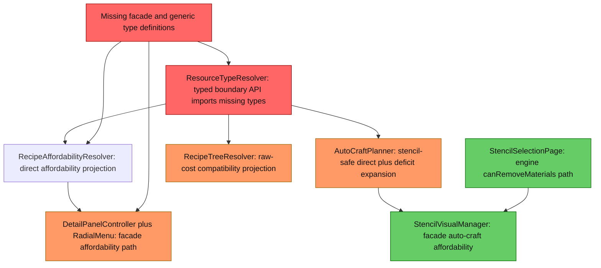
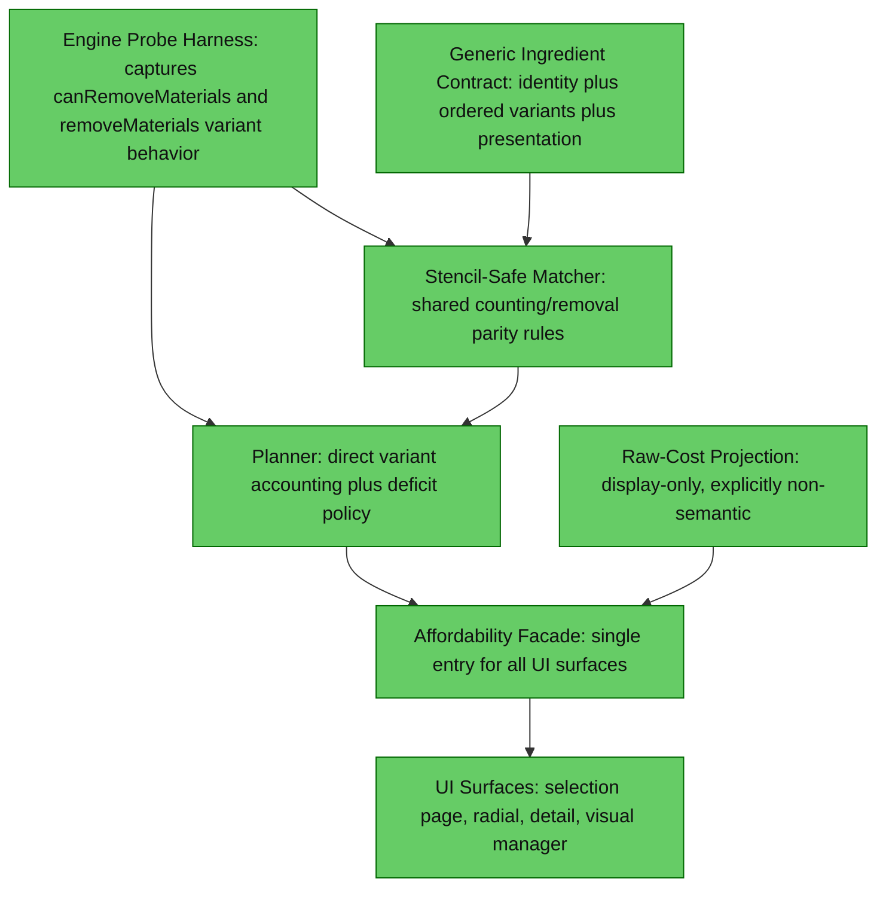

# 1. Executive Summary
The current ResourceTypeId parity migration is blocked by a structural integration regression: core typed-resolution and facade classes are referenced but absent, so the project does not compile. Beyond that build break, the main behavioral parity gap is that generic deficits still collapse to one representative concrete item before raw-cost and crafted-intermediate expansion, which is deterministic but not engine-proven. The highest-impact change is to establish a single executable generic ingredient contract that both planner and UI use, then validate engine variant-consumption behavior with runtime probes before finalizing deficit and raw-cost policies.

# 2. Current Architecture Diagram

# 3. Findings Table
| # | Category | Severity | Location | Detail |
|---|---|---|---|---|
| 1 | Anti-pattern | 🔴 Blocked | [src/main/java/com/CodeCreature/scaling/ResourceTypeResolver.java#L14](src/main/java/com/CodeCreature/scaling/ResourceTypeResolver.java#L14), [src/main/java/com/CodeCreature/ui/bench/DetailPanelController.java#L14](src/main/java/com/CodeCreature/ui/bench/DetailPanelController.java#L14), [src/main/java/com/CodeCreature/ui/radial/StencilRadialMenuPage.java#L14](src/main/java/com/CodeCreature/ui/radial/StencilRadialMenuPage.java#L14), [src/main/java/com/CodeCreature/stencil/StencilVisualManager.java#L14](src/main/java/com/CodeCreature/stencil/StencilVisualManager.java#L14) | Referenced types (CraftingAffordabilityFacade, GenericIngredientResolution, GenericIngredientResolver, IndexedGenericIngredientResolver, IngredientPresentation, GenericIngredientIdentity) are not present in workspace sources. Compile currently fails, so parity behavior cannot be validated or shipped. |
| 2 | Anti-pattern | 🟡 Should Fix | [src/main/java/com/CodeCreature/crafting/AutoCraftPlanner.java#L271](src/main/java/com/CodeCreature/crafting/AutoCraftPlanner.java#L271), [src/main/java/com/CodeCreature/crafting/AutoCraftPlanner.java#L286](src/main/java/com/CodeCreature/crafting/AutoCraftPlanner.java#L286) | Generic ingredient deficit expansion collapses ambiguity to one compatibility item before crafted-item checks and raw-cost recursion. This can diverge from strict engine parity whenever multiple variants with different craftability or raw trees satisfy the same ResourceTypeId. |
| 3 | Anti-pattern | 🟡 Should Fix | [src/main/java/com/CodeCreature/crafting/RecipeAffordabilityResolver.java#L288](src/main/java/com/CodeCreature/crafting/RecipeAffordabilityResolver.java#L288), [src/main/java/com/CodeCreature/crafting/RecipeAffordabilityResolver.java#L309](src/main/java/com/CodeCreature/crafting/RecipeAffordabilityResolver.java#L309), [src/main/java/com/CodeCreature/crafting/AutoCraftPlanner.java#L328](src/main/java/com/CodeCreature/crafting/AutoCraftPlanner.java#L328) | Direct itemId affordability counts do not exclude stencil metadata, while planner execution counts always exclude stencils. This can produce UI affordability true while execution-affordability false for itemId ingredients, violating strict runtime parity expectations for players. |
| 4 | Redundancy | 🟡 Should Fix | [src/main/java/com/CodeCreature/ui/bench/StencilSelectionPage.java#L1321](src/main/java/com/CodeCreature/ui/bench/StencilSelectionPage.java#L1321), [src/main/java/com/CodeCreature/ui/radial/StencilRadialMenuPage.java#L401](src/main/java/com/CodeCreature/ui/radial/StencilRadialMenuPage.java#L401), [src/main/java/com/CodeCreature/stencil/StencilVisualManager.java#L285](src/main/java/com/CodeCreature/stencil/StencilVisualManager.java#L285) | Affordability now has parallel implementations: engine canRemoveMaterials path in one UI surface, facade direct path in another, and planner auto-craft path in visual manager. This creates parity drift risk because each path can make different variant and stencil decisions. |
| 5 | Over-engineering | 🟠 QA | [src/main/java/com/CodeCreature/crafting/RecipeTreeResolver.java#L203](src/main/java/com/CodeCreature/crafting/RecipeTreeResolver.java#L203), [src/main/java/com/CodeCreature/crafting/RecipeTreeResolver.java#L336](src/main/java/com/CodeCreature/crafting/RecipeTreeResolver.java#L336), [src/main/java/com/CodeCreature/crafting/RecipeTreeResolver.java#L361](src/main/java/com/CodeCreature/crafting/RecipeTreeResolver.java#L361) | Raw-cost projection introduces policy flags and dual recursion paths with preferNatural toggles, but still projects ambiguous generic inputs to a representative concrete item. Complexity increased without evidence that this matches engine removal semantics. Requires runtime proof before treating as parity-safe. |
| 6 | Scalability | 🟠 QA | [src/main/java/com/CodeCreature/crafting/AutoCraftPlanner.java#L155](src/main/java/com/CodeCreature/crafting/AutoCraftPlanner.java#L155), [src/main/java/com/CodeCreature/crafting/RecipeAffordabilityResolver.java#L98](src/main/java/com/CodeCreature/crafting/RecipeAffordabilityResolver.java#L98), [src/test/java/com/CodeCreature/scaling/ResourceTypeResolverTest.java#L302](src/test/java/com/CodeCreature/scaling/ResourceTypeResolverTest.java#L302) | Only resolver-level generic API tests exist. There are no tests covering planner deficit behavior, raw-cost generic projection, stencil exclusion consistency, or cross-UI affordability consistency, so parity regressions can ship undetected as item families grow. |
| 7 | Anti-pattern | 🔵 Review | [src/main/java/com/CodeCreature/ui/ingredienttree/IngredientTreeBuilder.java#L22](src/main/java/com/CodeCreature/ui/ingredienttree/IngredientTreeBuilder.java#L22), [src/main/java/com/CodeCreature/ui/ingredienttree/IngredientTreeBuilder.java#L227](src/main/java/com/CodeCreature/ui/ingredienttree/IngredientTreeBuilder.java#L227) | Ingredient tree display uses typed projection for icon choice and includes fallback scanning when index may be uninitialized. This is acceptable for display, but should remain strictly non-semantic to avoid accidental reuse in planner semantics. |

# 4. Target Architecture Diagram

Notes:
- Consolidate all affordability consumers to one facade path backed by one matcher.
- Keep raw-cost projection as a compatibility display concern only; never as execution identity.
- Drive final deficit policy from measured engine behavior, not resolver preference assumptions.

# 5. Migration Notes
- What can be deleted entirely:
  - Remove parallel affordability entrypoints once facade path is complete and parity-proven, especially direct canRemoveMaterials-only checks used as standalone truth.
- What should be consolidated into what:
  - Consolidate stencil exclusion and variant counting into one shared matcher used by RecipeAffordabilityResolver, AutoCraftPlanner, and all UI affordability surfaces.
  - Consolidate representative-item fallback policy into one clearly labeled display projection utility, not spread across planner and raw-cost recursion.
- What ordering constraints are eliminated:
  - Eliminate ordering dependence on resolver representative selection for deficit expansion after engine probing defines true variant-consumption rules.
  - Eliminate UI-dependent affordability ordering by routing all views through one facade.
- What runtime systems become unnecessary:
  - Ad hoc per-surface affordability logic and duplicated projection helpers become unnecessary once a single facade plus shared matcher is adopted.

## Unknowns Requiring Runtime Probing
- Whether engine removeMaterials for ResourceTypeId consumes by inventory slot order, stack order, set-root preference, or another internal priority.
- Whether engine canRemoveMaterials and removeMaterials use identical matching and variant-priority rules under mixed-variant inventories.
- Whether engine excludes or includes metadata-tagged stencil items when matching generic ResourceTypeId ingredients.
- Whether engine preview or UI cost paths intentionally collapse generic ResourceTypeId to one representative item, and whether that affects actual removal.

## Verification Evidence Snapshot
- Compile check currently fails with missing symbols for generic/facade types after this change set.
- Test coverage in scope currently exercises resolver-level generic ordering only, not planner, raw-cost, or UI parity.

→ @Engineer implement migration from docs/review-resource-typeid-parity.md
→ @Architect if any finding requires a new system design
