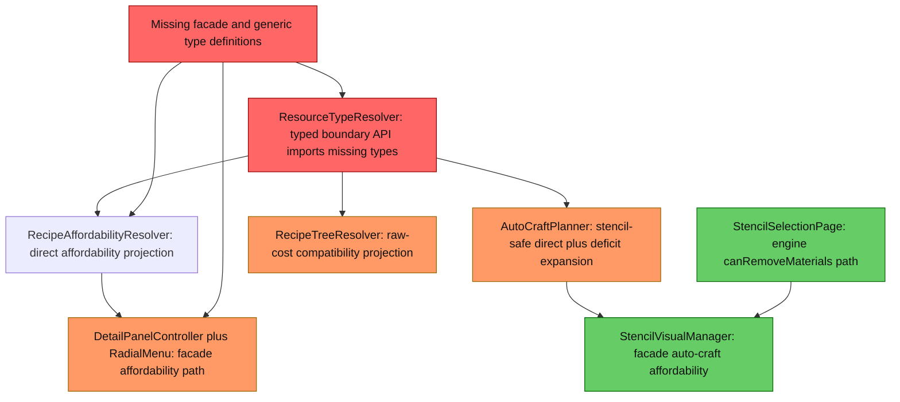
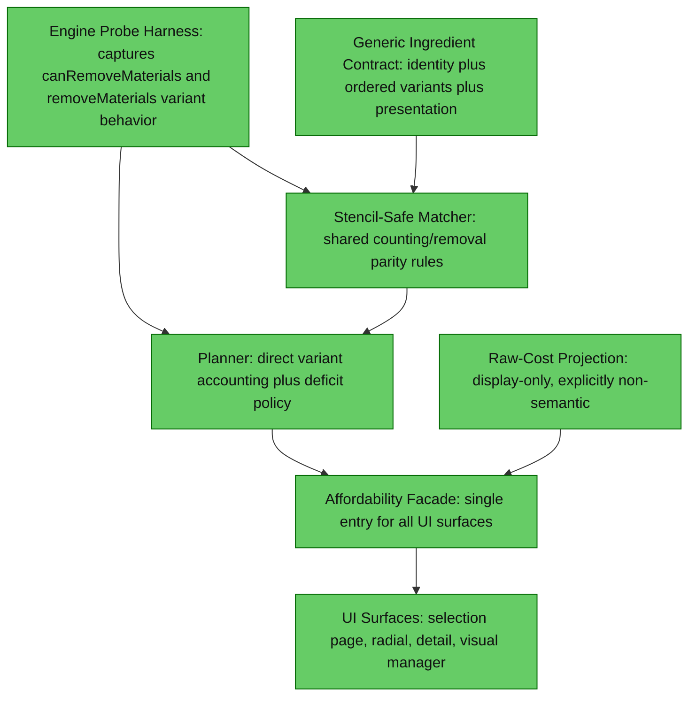

# 1. Executive Summary
The structural integration blocker has been resolved: typed generic-resolution and affordability-facade classes now exist and are wired through resolver, planner, and key UI surfaces. The remaining parity risk is behavioral: generic deficits and raw-cost projection can still collapse ambiguity to a representative concrete item before expansion, which is deterministic but not yet proven to match engine consumption semantics. The highest-impact next step is runtime evidence capture with the craft probe command, then policy alignment based on observed engine behavior.

# 2. Current Architecture Diagram

# 3. Findings Table
| # | Category | Severity | Location | Detail |
|---|---|---|---|---|
| 1 | Integration | ✅ Resolved | [src/main/java/com/CodeCreature/crafting/CraftingAffordabilityFacade.java](src/main/java/com/CodeCreature/crafting/CraftingAffordabilityFacade.java), [src/main/java/com/CodeCreature/crafting/GenericIngredientResolution.java](src/main/java/com/CodeCreature/crafting/GenericIngredientResolution.java), [src/main/java/com/CodeCreature/crafting/GenericIngredientResolver.java](src/main/java/com/CodeCreature/crafting/GenericIngredientResolver.java), [src/main/java/com/CodeCreature/crafting/IndexedGenericIngredientResolver.java](src/main/java/com/CodeCreature/crafting/IndexedGenericIngredientResolver.java), [src/main/java/com/CodeCreature/crafting/IngredientPresentation.java](src/main/java/com/CodeCreature/crafting/IngredientPresentation.java), [src/main/java/com/CodeCreature/crafting/GenericIngredientIdentity.java](src/main/java/com/CodeCreature/crafting/GenericIngredientIdentity.java) | Previously-missing typed boundary classes now exist and are wired. Resolver/facade tests pass for generic variant affordability and presentation. |
| 2 | Anti-pattern | 🟡 Should Fix | [src/main/java/com/CodeCreature/crafting/AutoCraftPlanner.java#L271](src/main/java/com/CodeCreature/crafting/AutoCraftPlanner.java#L271), [src/main/java/com/CodeCreature/crafting/AutoCraftPlanner.java#L286](src/main/java/com/CodeCreature/crafting/AutoCraftPlanner.java#L286) | Generic ingredient deficit expansion collapses ambiguity to one compatibility item before crafted-item checks and raw-cost recursion. This can diverge from strict engine parity whenever multiple variants with different craftability or raw trees satisfy the same ResourceTypeId. |
| 3 | Consistency | ✅ Resolved | [src/main/java/com/CodeCreature/crafting/RecipeAffordabilityResolver.java#L322](src/main/java/com/CodeCreature/crafting/RecipeAffordabilityResolver.java#L322), [src/main/java/com/CodeCreature/crafting/AutoCraftPlanner.java#L331](src/main/java/com/CodeCreature/crafting/AutoCraftPlanner.java#L331) | Direct concrete affordability counts now exclude stencil-tagged stacks, aligned with planner execution semantics. |
| 4 | Consolidation | ✅ Resolved | [src/main/java/com/CodeCreature/ui/bench/StencilSelectionPage.java#L1322](src/main/java/com/CodeCreature/ui/bench/StencilSelectionPage.java#L1322), [src/main/java/com/CodeCreature/ui/radial/StencilRadialMenuPage.java#L401](src/main/java/com/CodeCreature/ui/radial/StencilRadialMenuPage.java#L401), [src/main/java/com/CodeCreature/stencil/StencilVisualManager.java#L285](src/main/java/com/CodeCreature/stencil/StencilVisualManager.java#L285) | Bench selection, radial/detail, and visual manager affordability routes now rely on facade/planner generic-aware checks instead of mixed ad hoc checks. |
| 5 | Over-engineering | 🟠 QA | [src/main/java/com/CodeCreature/crafting/RecipeTreeResolver.java#L203](src/main/java/com/CodeCreature/crafting/RecipeTreeResolver.java#L203), [src/main/java/com/CodeCreature/crafting/RecipeTreeResolver.java#L336](src/main/java/com/CodeCreature/crafting/RecipeTreeResolver.java#L336), [src/main/java/com/CodeCreature/crafting/RecipeTreeResolver.java#L361](src/main/java/com/CodeCreature/crafting/RecipeTreeResolver.java#L361), [src/main/java/com/CodeCreature/command/debug/CraftingParityProbeSubCommand.java](src/main/java/com/CodeCreature/command/debug/CraftingParityProbeSubCommand.java) | Raw-cost projection still has representative fallback for ambiguous generics. Runtime proof path now exists via `/debug craftprobe <recipeId> [preferNatural]`, which compares engine direct check, facade direct check, planner outcome, and raw projection snapshot. Treat parity as provisional until probe evidence is collected across representative recipes. |
| 6 | Scalability | 🟠 QA | [src/main/java/com/CodeCreature/crafting/AutoCraftPlanner.java#L155](src/main/java/com/CodeCreature/crafting/AutoCraftPlanner.java#L155), [src/main/java/com/CodeCreature/crafting/RecipeAffordabilityResolver.java#L98](src/main/java/com/CodeCreature/crafting/RecipeAffordabilityResolver.java#L98), [src/test/java/com/CodeCreature/scaling/ResourceTypeResolverTest.java#L302](src/test/java/com/CodeCreature/scaling/ResourceTypeResolverTest.java#L302) | Only resolver-level generic API tests exist. There are no tests covering planner deficit behavior, raw-cost generic projection, stencil exclusion consistency, or cross-UI affordability consistency, so parity regressions can ship undetected as item families grow. |
| 7 | Anti-pattern | 🔵 Review | [src/main/java/com/CodeCreature/ui/ingredienttree/IngredientTreeBuilder.java#L22](src/main/java/com/CodeCreature/ui/ingredienttree/IngredientTreeBuilder.java#L22), [src/main/java/com/CodeCreature/ui/ingredienttree/IngredientTreeBuilder.java#L227](src/main/java/com/CodeCreature/ui/ingredienttree/IngredientTreeBuilder.java#L227) | Ingredient tree display uses typed projection for icon choice and includes fallback scanning when index may be uninitialized. This is acceptable for display, but should remain strictly non-semantic to avoid accidental reuse in planner semantics. |

# 4. Target Architecture Diagram

Notes:
- Consolidate all affordability consumers to one facade path backed by one matcher.
- Keep raw-cost projection as a compatibility display concern only; never as execution identity.
- Drive final deficit policy from measured engine behavior, not resolver preference assumptions.

# 5. Migration Notes
- What can be deleted entirely:
  - Remove parallel affordability entrypoints once facade path is complete and parity-proven, especially direct canRemoveMaterials-only checks used as standalone truth.
- What should be consolidated into what:
  - Consolidate stencil exclusion and variant counting into one shared matcher used by RecipeAffordabilityResolver, AutoCraftPlanner, and all UI affordability surfaces.
  - Consolidate representative-item fallback policy into one clearly labeled display projection utility, not spread across planner and raw-cost recursion.
- What ordering constraints are eliminated:
  - Eliminate ordering dependence on resolver representative selection for deficit expansion after engine probing defines true variant-consumption rules.
  - Eliminate UI-dependent affordability ordering by routing all views through one facade.
- What runtime systems become unnecessary:
  - Ad hoc per-surface affordability logic and duplicated projection helpers become unnecessary once a single facade plus shared matcher is adopted.

## Unknowns Requiring Runtime Probing
- Whether engine removeMaterials for ResourceTypeId consumes by inventory slot order, stack order, set-root preference, or another internal priority.
- Whether engine canRemoveMaterials and removeMaterials use identical matching and variant-priority rules under mixed-variant inventories.
- Whether engine excludes or includes metadata-tagged stencil items when matching generic ResourceTypeId ingredients.
- Whether engine preview or UI cost paths intentionally collapse generic ResourceTypeId to one representative item, and whether that affects actual removal.

## Runtime Probe Procedure
1. Enable detailed probe logging (optional): run `/debug logging crafting`, then set `diagnostics.craftingParityProbe=true` in feature flags (or add a toggle command in a follow-up wave).
2. Execute `/debug craftprobe <recipeId> [preferNatural]` for representative recipes that include `ResourceTypeId` inputs and mixed-variant inventories.
3. Capture and compare these values from probe output:
  - `engineDirect` from `container.canRemoveMaterials(...)`
  - `facadeDirect` from `CraftingAffordabilityFacade.isAffordable(...)`
  - `autoPlan.affordable` and `autoPlan.requiresAutoCraft`
  - input-level generic resolution (`rep`, `matches`) and `rawProjection`
4. Any warning line (`engineDirect != facadeDirect` or `facadeDirect != autoPlan.affordable` when `requiresAutoCraft=false`) is treated as a parity-failure case requiring planner/raw-cost policy adjustment.

## Verification Evidence Snapshot
- Compile blocker for missing generic/facade symbols is resolved.
- Targeted tests pass for resolver and facade generic behavior (`ResourceTypeResolverTest`, `CraftingAffordabilityFacadeTest`).
- Runtime parity proof remains outstanding and is now instrumented via `craftprobe`.

→ @Engineer implement migration from docs/review-resource-typeid-parity.md
→ @Architect if any finding requires a new system design
